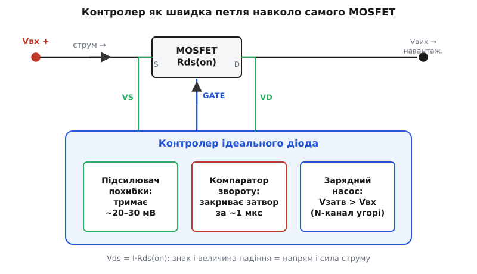
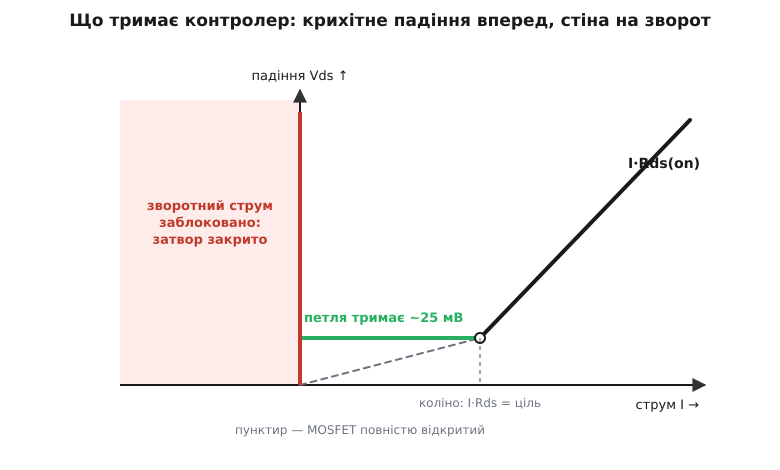
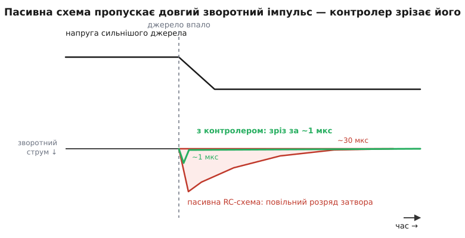

# Контролер ідеального діода

<preknowlist>
- [Ідеальний діод](topic:hw-power/ideal-diode) — заміна діода на MOSFET, що пропускає струм в один бік майже без падіння (I·Rds замість Vf); «ідеальний» = прагнення до нульового падіння.
- [Опір Rds(on)](topic:hw-components/rds-on) — відкритий MOSFET поводиться як резистор; падіння на ньому Vds = I·Rds(on), і знак цього падіння показує, куди тече струм.
- [Body-діод](topic:hw-components/body-diode) — вбудований у MOSFET діод, що проводить уперед навіть при закритому каналі; тому сам MOSFET без керування ще не однобічний.
- [Зарядний насос](topic:hw-power/charge-pump) — схема, що робить напругу ВИЩУ за живлення; потрібна, щоб відкрити N-канал у верхньому плечі.
- [Зворотний зв'язок](topic:hw-power/feedback-stability) — замкнена петля з підсилювачем, що втримує вимірювану величину на заданій цілі.
</preknowlist>

Замінити діод на MOSFET спокусливо: відкритий транзистор — це маленький резистор, і падіння I·Rds(on) на ньому в рази менше за Vf діода. Це і є ідея [ідеального діода](topic:hw-power/ideal-diode). Але одразу вилазить халепа. Діод сам знає, куди пускати струм: його однобічність фізична. MOSFET такого чуття не має. Його канал — симетричний резистор: відкрий затвор, і струм піде крізь нього в будь-який бік однаково легко. Мало того, навіть при закритому каналі вбудований [body-діод](topic:hw-components/body-diode) усе одно проводить уперед. Тобто сам собою MOSFET — не діод, а просто ключ, якому байдуже напрям.

Щоб зробити з нього діод, потрібен хтось, хто щомиті стежить, куди тече струм, і тримає затвор відповідно: відкриває, коли струм іде вперед, і рвучко закриває, коли той поривається назад. Цей «хтось» і є **контролер ідеального діода** (англ. ideal-diode controller) — маленька мікросхема, що з тупого ключа робить однобічний вентиль з майже нульовим падінням.

### Чим він міряє напрям

Найгарніше тут те, ЧИМ контролер вимірює напрям. Окремий давач йому не потрібен: він міряє падіння на тому самому MOSFET, яким керує. Відкритий канал — це [резистор Rds(on)](topic:hw-components/rds-on), тож на ньому Vds = I·Rds(on). Величина падіння каже, який струм тече, а **знак** — у який бік. Струм уперед (від входу до навантаження) робить один вивід трохи нижчим за інший; варто струмові розвернутися — і різниця міняє знак. Отже сам ключ є власним давачем: контролеру досить під'єднатися до двох його кінців (вивід VS до витоку, VD до стоку) і читати мілівольти між ними, як чутливий вольтметр.

> 🔧 **Навіщо це.** Окремий струмовий шунт — це зайвий резистор у силовому тракті, на якому знову ж таки гріється потужність і губиться напруга. Тут його роль грає вже наявний Rds(on) відкритого MOSFET: вимірювання дармове, воно не додає жодного падіння понад те, що ми й так хочемо мати крихітним.


*Контролер під'єднується до витоку й стоку силового MOSFET (виводи VS, VD) і читає падіння на ньому як напрям та силу струму. Усередині — підсилювач, що тримає крихітне пряме падіння, швидкий компаратор звороту й зарядний насос для затвора.*

### Петля, що тримає крихітне падіння

Просте «повністю відкрити чи повністю закрити» тут не годиться. Уяви струм, що плаває біля нуля: ключ смикався б увімк-вимк, брязкаючи на межі. Тому контролер не перемикає затвор, а **регулює** його. Усередині сидить підсилювач похибки з ціллю — тримати пряме падіння на MOSFET на маленькій сталій величині, порядку 20–30 мВ. Побачив, що падіння вперед більше за ціль, — піддає затвору напруги, канал ширшає, Rds(on) і падіння меншають. Побачив, що менше, — трохи прикриває. Виходить м'яка петля [зворотного зв'язку](topic:hw-power/feedback-stability), що втримує падіння в заданій точці незалежно від струму й температури.

Звідси цікава поведінка на двох ділянках. Поки струм малий, повне I·Rds(on) саме по собі менше за ціль — і контролер навмисно НЕ відкриває MOSFET до кінця, а тримає його привідкритим рівно так, щоб падіння лишалося на цілі. Щойно струм виростає настільки, що навіть повністю відкритий канал дає падіння більше за ціль, регулювати вже нема куди: затвор тримається повністю відкритим, і падіння стає звичайним I·Rds(on). Межу між двома режимами — «коліно» — легко полічити: вона там, де I·Rds(on) саме дорівнює цілі.


*Нижче «коліна» петля навмисно тримає стале крихітне падіння ~25 мВ (зелене плато), вище — MOSFET повністю відкритий і падіння росте як I·Rds(on). На зворот (ліворуч від нуля) — тверда стіна: затвор закрито, струму немає.*

### Головний трюк — швидко перекрити зворот

Це мале стале падіння — не примха, а спосіб завжди мати визначену робочу точку, з якої видно найменший натяк на розворот струму. І тут головне, чого пасивна схема з її body-діодом не вміє в принципі. Поряд із повільним регулювальним підсилювачем сидить **швидкий компаратор** (лат. comparāre — порівнювати), єдина робота якого — ловити зміну знаку Vds. Тільки-но падіння показало, що струм пішов назад, компаратор не прикриває плавно, а вихоплює заряд із затвора щосили й закриває MOSFET за частки мікросекунди. Активне висмикування заряду — ось звідки швидкість: пасивна схема мусила б чекати, поки затвор розрядиться крізь резистор (десятки мікросекунд), і за цей час у навантаження встиг би прослизнути добрий зворотний імпульс.


*Коли сильніше джерело раптом зникає, пасивна схема ще довго розряджає затвор крізь резистор — і крізь канал устигає перетекти чималий зворотний струм (червона площа). Контролер зрізає його приблизно за мікросекунду.*

### Зарядний насос — щоб узяти дешевий N-канал

Лишається питання: яким MOSFET керувати. Найменший Rds(on) за ті самі гроші й розмір дає N-канал — бо електрони рухливіші за дірки. Але у **верхньому** плечі (у плюсовому проводі, де ключ і має стояти, щоб не рвати спільну землю) N-канал має прикру вимогу: щоб він відкрився, затвор треба підняти ВИЩЕ за витік, тобто вище за вхідну напругу. Своїми силами схема цього не зробить — напруги, вищої за вхід, у неї нема. Тому контролер носить усередині [зарядний насос](topic:hw-power/charge-pump): він накачує на затвор напругу на кілька вольтів вищу за Vвх і тим тримає дешевий N-канал повністю відкритим. Пасивна схема цього не має, тому змушена ставити дорожчий P-канал з більшим опором.

### Навіщо це — об'єднання джерел

Здатність за мікросекунди перекрити зворотний струм — саме те, що потрібно, коли на одну шину працюють кілька джерел. Заведи батарею й USB кожне через свій ідеальний діод на спільний вузол — і вийде [об'єднання джерел](topic:hw-power/power-oring): вище з двох тримає шину, нижче автоматично відсічене, а коли головне джерело просідає чи зникає, контролер миттю не дає здоровому джерелу вилити струм назад у мертве. Звичайні діоди робили б те саме, але постійно палили б Vf·I на кожному вході. Та сама швидка відсічка потрібна й при гарячому під'єднанні плати, і скрізь, де важить не пустити струм назад ([захист від зворотного струму](topic:hw-power/reverse-current-protection)).

На платі це зазвичай виглядає як одна невелика мікросхема плюс зовнішній силовий MOSFET; типові виводи, схему під'єднання одного тракту й пари для об'єднання джерел та звичні граблі зібрано окремо ([клас пристрою](topic:hw-power/ideal-diode-controller/comp-ideal-diode-controller.md)). Сама ідея активно керованого діода-без-втрат виросла з систем резервованого живлення, де кільком джерелам треба було ділити навантаження без ризику, що сильніше перекачає струм у слабше ([як це народилося](topic:hw-power/ideal-diode-controller/hist-active-oring.md)).

### Скільки економимо

**Вхід 12 В, MOSFET із Rds(on) = 5 мОм, контролер тримає пряме падіння 25 мВ. Де коліно і скільки гріється ключ при 5 А?**

```text
Коліно (де I·Rds дорівнює цілі):
  I_коліно = Vціль / Rds(on)
           = 0.025 / 0.005 = 5 А

При 5 А (саме на коліні):
  Vds = 0.025 В                  (петля ще тримає ціль)
  P   = Vds · I = 0.025 · 5 = 0.125 Вт

Для порівняння на тих самих 5 А:
  body-діод   0.5 · 5 = 2.5 Вт
  діод Шотткі 0.4 · 5 = 2.0 Вт
```

Нижче ~5 А контролер тримає падіння на рівні 25 мВ і розсіює десяті частки вата там, де діод спалив би одиниці ватів; вище коліна ключ повністю відкритий і працює вже просто як низькоомний резистор.

### Де це ламається

Падіння, яке контролер міряє, — мілівольти, тож сенсорні виводи VS/VD треба вести прямо до площадок MOSFET, інакше падіння на самих доріжках забреше давачеві. Body-діод нікуди не дівається: у прямому напрямку струм побіжить крізь нього ще до того, як відкриється канал, тож у мить вмикання ключ не ізолює — справжня двобічна відсічка з'являється тільки після того, як канал відкрито й контролер його тримає (для повного блокування в обидва боки беруть [пару MOSFET спина-до-спини](topic:hw-power/mosfet-back-to-back)). І біля самого нуля струму петля балансує на мілівольтах — щоб не дрижати, контролери додають невеликий гістерезис.

> 🔧 **Навіщо це.** Там, де звичайний захисний діод чи пасивний MOSFET-«ідеальний діод» уже не тягне — треба об'єднати джерела, відсікти зворотний струм за мікросекунди чи витиснути падіння до мілівольтів, — ставлять контролер ідеального діода. Він міряє напрям струму по власному Vds ключа, активною петлею тримає пряме падіння крихітним, зарядним насосом дозволяє взяти дешевий низькоомний N-канал і рвучко закриває ключ, щойно струм поривається назад.
