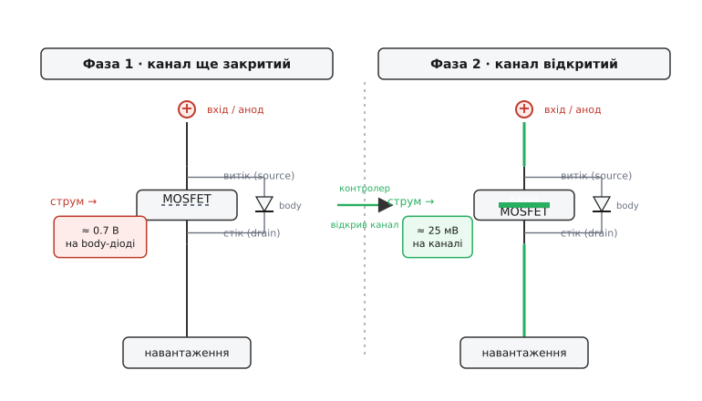

# 🔌 Body-діод як стартовий шлях «ідеального діода»

> «Ідеальний діод» (ideal diode) на MOSFET пропускає струм майже без падіння, бо веде його відкритий канал — резистор у кілька міліом замість напівпровідникового переходу. Але в перший момент після подачі живлення канал ще закритий, а струмові вже треба кудись текти. Цю першу мить тримає вбудований у транзистор **body-діод** (паразитний діод тіла), і саме він робить схему «самозапускною»: дає падіння, яке контролер бачить і за яким відкриває канал. Тут body-діод — не паразит, від якого тікають, а корисний стартовий шлях.

## Звідки в MOSFET узявся діод

Body-діод не додають навмисно — він народжується із самої будови польового транзистора. У N-канальному MOSFET підкладка (тіло, body) — це p-область, а стік (drain, від нім.-англ. *drain* — «стік») сидить в окремій n-області. На межі p-тіла й n-стоку виходить звичайний p-n перехід, тобто діод. Щоб тіло не «плавало» за потенціалом, його на кристалі коротять із витоком (source). Так і виходить стале правило: **body-діод дивиться анодом на витік, катодом на стік** — від витока до стока. Для N-каналу це означає, що він проводить струм у напрямку «витік → стік».

Це не дрібниця конкретної моделі, а властивість класу: будь-який кремнієвий MOSFET — IRF7413, BSC0902NS, AON6504, SiR826 — несе цей перехід усередині. Тому в даташиті завжди є окремий рядок про «diode forward voltage» (V_SD) і графік body-діода: виробник визнає його повноцінним компонентом схеми.

## Чому канал не вмикається миттєво

Відкрити MOSFET — це зарядити його затвор. Затвор ізольований від каналу тонким шаром оксиду й поводиться як конденсатор ємністю кілька нанофарад (його характеризують зарядом затвора Q_g). Поки на цьому конденсаторі немає достатньої напруги (|V_GS| нижче за поріг V_GS(th)), канал закритий — провідного шляху «витік–стік» крізь сам транзистор немає.

А тепер уявімо момент увімкнення: на вхід щойно прийшов «плюс», навантаження вимагає струму, але затвор іще не заряджений. Якби body-діода не було, струмові не було б куди текти аж до повного відкриття каналу — на виході провал, кидок, дзвін. Body-діод закриває цей розрив: він уже на місці, орієнтований **уперед** (анод на витоку = на вході, катод на стоку = до навантаження), тож одразу проводить. Навантаження отримує живлення з першої мілісекунди, ще до того, як контролер устиг щось зробити.


*Фаза 1: канал ще закритий, увесь струм іде крізь body-діод, на ньому падає ≈ 0.7 В. Контролер «бачить» це падіння між входом і виходом і починає заряджати затвор. Фаза 2: канал відкрився й зашунтував діод — падіння впало до ≈ 25 мВ. Перехід безшовний, без мертвого часу.*

## Падіння, яке стає сигналом

Тут і ховається головна користь. Body-діод — це кремнієвий p-n перехід, тож на ньому падає чималеньке пряме V_SD: для кремнію близько 0.6–0.9 В на робочому струмі (вище за діод Шотткі з його 0.15–0.45 В, бо в Шотткі немає повноцінного дифузійного потенціалу переходу). Для самого ККД це падіння велике — палити ват на кожному ампері ніхто не хоче. Але контролер «ідеального діода» дивиться на цю напругу інакше: для нього падіння body-діода — це **сигнал «струм пішов уперед, час відкривати канал»**.

Контролер увімкнено між входом і виходом як мікровольтметр падіння V_DS. Логіка проста й причинна: побачив пряме падіння (струм тече від входу до навантаження) → почав заряджати затвор → канал відкривається → його малий R_DS(on) **шунтує** body-діод, бо паралельно йому тепер стоїть шлях із набагато меншим опором. Струм перетікає з діода в канал, і падіння валиться з ~0.7 В до десятків мілівольт. Реальні мікросхеми тримають це падіння як ціль регулювання: LTC4357 серворує форвардне падіння до ≈ 25 мВ, LTC4359 — до ≈ 30 мВ, а в сучасних контролерів (наприклад, AP74700Q) ціль опускається до ≈ 20 мВ. Менше впало — трохи прикрив затвор; більше — підкрутив; так MOSFET тримається у вузенькій робочій точці незалежно від струму й температури.

Орієнтація транзистора тут і вирішує напрям усього «діода»: куди дивиться body-діод, той бік і є «прямим». Поставили MOSFET витоком на вхід — body-діод проводить уперед, схема пропускає струм до навантаження й стартує сама. Поставили б навпаки — body-діод дивився б у зворотний бік, не провів би на старті, і весь сенс «самозапуску» зник би (а ще пропускав би струм назад при закритому каналі — те, проти чого «ідеальний діод» і ставлять). Детально напрям блокування розбирає [сама стаття про «ідеальний діод»](root:hw-power/ideal-diode); тут важливе доповнення: цей самий перехід, що блокує **зворотний** струм, у **прямому** напрямку є обов'язковим стартовим шляхом.

> 🔧 **Навіщо це.** Завдяки body-діоду «ідеальний діод» не потребує жодного зовнішнього «байпаса» на час запуску — навантаження живиться з першої мілісекунди, поки контролер відкриває канал. А падіння на цьому діоді — готовий сигнал напрямку струму, за яким контролер і вирішує, відкривати канал чи тримати закритим. Дві функції одного безкоштовного переходу.

## Скільки коштує перебути на діоді

Поки канал не відкрився, увесь струм гріє body-діод повним падінням — це невеликі, але реальні втрати на короткий час запуску. Прикинемо для типового входу.

**Вхід 12 В, струм навантаження 3 А. На старті веде body-діод (V_SD = 0.8 В), потім канал (R_DS(on) = 20 мОм) серворований до 25 мВ.**

```text
Поки веде body-діод (фаза 1):
  Падіння   V_SD   = 0.80 В
  Втрати    P_diode = V_SD · I
                    = 0.80 · 3   = 2.4 Вт

Коли канал відкрився (фаза 2):
  Падіння   V_DS   ≈ 0.025 В      (ціль регулювання контролера)
  Втрати    P_chan  = V_DS · I
                    = 0.025 · 3  = 0.075 Вт

Відношення  2.4 / 0.075 ≈ 32×  менше тепла після відкриття каналу
```

Висновок очевидний: на body-діоді сидіти треба якнайменше. Тому контролер відкриває канал за мікросекунди — фаза 1 триває лише поки заряджається затвор. Якби струм застряг на діоді надовго (наприклад, контролер не зміг відкрити канал), 2.4 Вт швидко перегріли б кристал: пікова потужність body-діода в даташиті обмежена, бо діод не розрахований нести робочий струм постійно.

## Той самий діод в іншій ролі — для контрасту

Корисно бачити, що **той самий** body-діод в іншій схемі — головний біль, а не помічник. У синхронному випрямлячі (synchronous rectifier) і в напівмостах між вимиканням одного ключа й вмиканням іншого є **мертвий час** (dead time) — обидва канали закриті, щоб не було наскрізного струму. У ці наносекунди струм індуктивності тече саме крізь body-діод, і його велике V_SD ≈ 0.7–1 В палить помітну потужність на кожному циклі (тому під body-діоди в потужних перетворювачах ставлять зовнішній Шотткі або беруть FETKY-збірку — MOSFET із Шотткі в одному корпусі). Спеціальні контролери навіть стежать за порогом body-діода, аби скоротити цей мертвий час.

Різниця в одному: у синхронному випрямлячі body-діод проводить **через силу, бо канал ще/вже закритий за розкладом перемикань**, і це втрата, яку мінімізують. В «ідеальному діоді» body-діод проводить **навмисно один раз на старті**, даючи струму шлях і контролеру — сигнал. Той самий фізичний перехід; протилежна роль. (Як body-діод заважає у ключі навантаження, де він пропускає струм у вимкненому стані, — окрема [вставка про body-діод ключа](root:hw-power/load-switch/comp-body-diode.md).)

## Типові граблі

**Думати, що до відкриття каналу струму немає.** Є — крізь body-діод, уперед, із падінням ~0.7 В. Це нормально й корисно на старті, але означає, що пасивний «ідеальний діод» (P-MOSFET без контролера) **не ізолює вхід у прямому напрямку взагалі**: body-діод проведе вперед завжди, навіть при закритому каналі. Для двостороннього блокування потрібні два MOSFET спина-до-спини (back-to-back), де два body-діоди дивляться назустріч.

**Не врахувати пікову потужність body-діода.** Якщо контролер з якоїсь причини не відкрив канал (низький V_GS, обрив затвора, занадто мала вхідна напруга), струм лишається на діоді з повним V_SD. На 3 А це вже 2.4 Вт у крихітному кристалі — кілька секунд, і перегрів. Старт має бути коротким.

**Брати MOSFET без оглядки на діод.** V_SD body-діода й допустимий імпульсний струм діода — рядки даташита, які легко проґавити. Для застосувань із частими стартами під навантаженням (hot-swap, об'єднання джерел) ці параметри так само важливі, як R_DS(on).

**Плутати напрям.** Якщо орієнтувати MOSFET «навпаки» (стоком на вхід), body-діод дивитиметься в зворотний бік: схема не стартує крізь діод і не блокує зворотний струм. Напрям body-діода = напрям «прямого» струму всього «ідеального діода».

## Варіації класу

Майже кожен кремнієвий MOSFET несе цей перехід, тож стартова поведінка «спершу діод, потім канал» однакова для будь-якого виробника. Відмінності — в числах: V_SD трохи різниться між моделями (0.6–1 В), а допустимий імпульсний струм діода — від десятків мА у дрібних SOT-23 до десятків ампер у силових корпусах. У контролерах ідеального діода body-діод часто навмисно беруть «сильніший» (із запасом по імпульсному струму), бо саме він тримає навантаження на час запуску й на ті мікросекунди, поки контролер реагує на зміну напрямку струму. А де падіння на старті критичне (телеком, hot-swap великих струмів), паралельно body-діоду ставлять зовнішній Шотткі — він перехоплює стартовий струм із меншим падінням, доки канал не відкрився.
