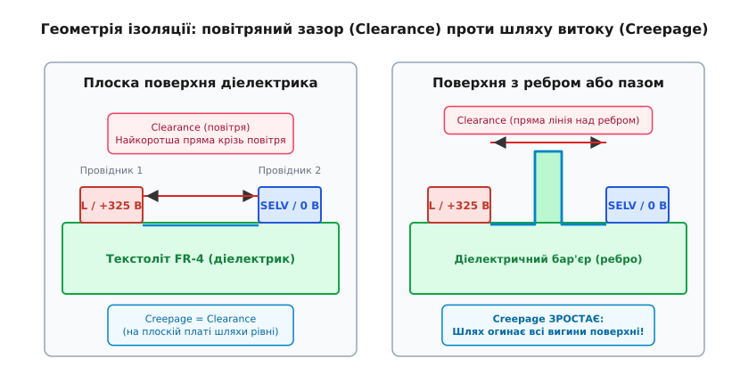
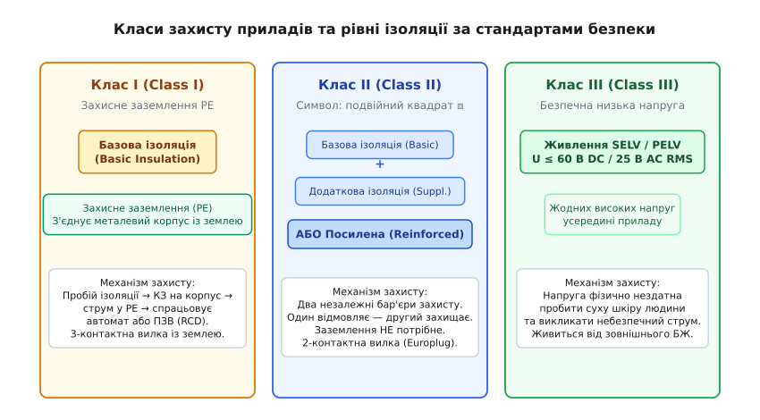
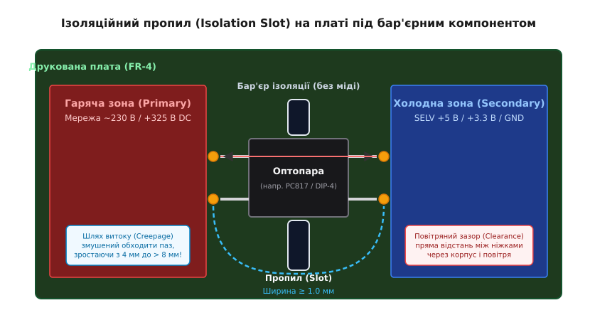
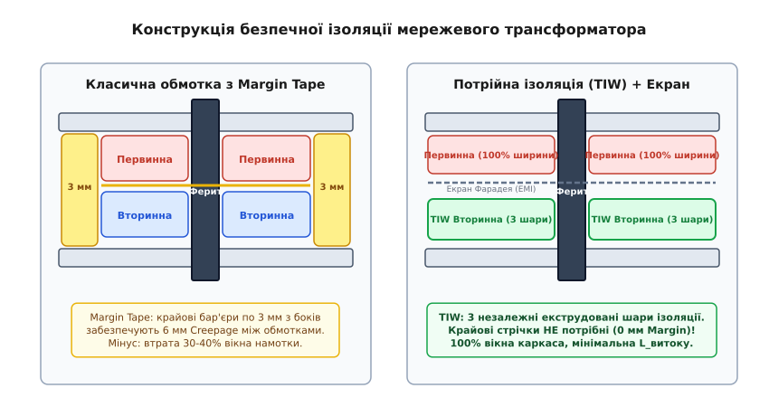

# Класи ізоляції та шляхи витоку: Creepage і Clearance

<preknowlist>
- [Безпека з мережею](topic:hw-power/mains-safety) — дія електричного струму на тіло людини, фібриляція серця при струмах понад 30 мА та призначення захисного заземлення.
- [Кидки напруги в мережі](topic:hw-power/mains-transients) — категорії перенапруги (Overvoltage Category I..IV) та імпульсні перехідні процеси від комутацій і блискавок.
- [Ізольований flyback-перетворювач](topic:hw-power/flyback-isolated) — архітектура імпульсного джерела живлення з гальванічним розділенням первинного й вторинного боків.
- [Гіпот-тест](topic:hw-power/mains-hipot-test) — методика випробування діелектричної міцності високою напругою та вимірювання струмів витоку.
</preknowlist>

Коли людина вставляє зарядний пристрій у розетку 230 В і торкається металевого роз'єму підключеного смартфона, її життя тримається на відстані кількох міліметрів. Усередині компактного пластикового адаптера первинний випрямляч живить високовольтну шину постійної напруги 325 В (а за наявності коректора потужності — понад 400 В), де під час комутації транзисторів виникають імпульсні викиди амплітудою до 700–800 В. За два-три міліметри від цієї смертоносної міді розташовані низьковольтні доріжки живлення 5 В, з'єднані з кабелем USB. Якщо електричний заряд подолає цей міліметровий проміжок крізь повітря або по поверхні склотекстоліту, мережева напруга піде крізь серце користувача в землю зі струмом у сотні міліампер, що викликає фібриляцію серця за частки секунди.

Щоб не допустити трагедії, інженерія електроживлення спирається не на інтуїцію чи випадкові зазори, а на сувору систему координат: рівні ізоляції, класи приладів, повітряні зазори (*Clearance*) та шляхи витоку (*Creepage*).

## Два шляхи пробою: повітряний зазор і шлях витоку

Висока напруга здатна перетнути ізоляційний бар'єр між двома провідниками на друкованій платі двома принципово різними фізичними шляхами.


*Зліва — на плоскій платі шлях витоку по поверхні діелектрика дорівнює повітряному зазору по прямій. Справа — наявність вигину, ребра або пазу змушує струм витоку огинати контур, суттєво збільшуючи Creepage, тоді як Clearance лишається прямою лінією крізь повітря.*

### Повітряний зазор (Clearance Distance)

**Повітряний зазор** (англ. *Clearance*) — це найкоротша відстань між двома провідниками, виміряна по прямій лінії крізь повітря (*line-of-sight*).

Фізичний механізм руйнування повітряного зазору — **діелектричний пробій газу**. Коли напруженість електричного поля `E = U / d` у проміжку перевищує критичну міцність повітря (близько 3.0 кВ/мм для однорідного поля за нормальних умов), вільні електрони прискорюються полем настільки, що під час зіткнень із молекулами азоту та кисню вибивають нові електрони. Виникає лавиноподібна ударна іонізація (електронна лавина Таунсенда), повітряний проміжок іонізується і перетворюється на низькоомний плазмовий канал — спалахує електрична дуга (іскра).

Повітряний зазор розраховують насамперед на захист від **пікових імпульсних перенапруг** (англ. *Transient Overvoltages*). Короткочасний кидок напруги 2.5 кВ тривалістю всього 50 мікросекунд від комутації сусіднього промислового двигуна чи непрямого грозового розряду миттєво запалює дугу в замалому повітряному зазорі.

### Шлях витоку (Creepage Distance)

**Шлях витоку** (англ. *Creepage*) — це найкоротша відстань між двома провідниками, виміряна **вздовж поверхні твердого діелектрика** (поверхні склотекстоліту FR-4, пластикового каркаса котушки чи корпусу мікросхеми).

Фізичний механізм руйнування ізоляції по поверхні — **утворення провідного вуглецевого треку** (*Tracking*). Цей процес якісно відрізняється від повітряного пробою:
1. За нормальних умов на поверхню плати неминуче осідає пил, мікрочастинки солей та конденсується атмосферна волога;
2. Солі розчиняються у волозі, утворюючи тонкий шар слабкого електроліту з кінцевим поверхневим опором;
3. Під дією постійної робочої напруги крізь цю плівку починає протікати крихітний струм витоку (мікроампери), який виділяє джоулеве тепло `P = I² · R`;
4. Волога випаровується нерівномірно. У місці найтоншого шару утворюється мікроскопічна суха зона (*dry band*). Опір цієї сухої ділянки різко зростає, тому майже вся прикладена напруга концентрується на ній;
5. Напруженість поля на сухій ділянці перевищує поріг іонізації повітря, запалюючи мікроіскри (сцинтиляції);
6. Температура плазми в мікродузі сягає понад 1000 °C. Епоксидна смола склотекстоліту зазнає термічного розпаду (піролізу), виділяючи вільний вуглець у вигляді графіту;
7. Графіт має високу провідність. Крок за кроком графітова голка проростає вздовж поверхні плати, доки не замкне обидва провідники наскрізною вуглецевою доріжкою, що викликає коротке замикання та пожежу.

Тому шлях витоку розраховують на тривалу стійкість до **середньоквадратичної робочої напруги** (англ. *Working Voltage RMS*), ступеня забруднення навколишнього середовища та якості матеріалу діелектрика.

## Система стандартів електробезпеки

В інженерній практиці розрахунок зазорів регламентується трьома базовими міжнародними стандартами:

```
        ┌───────────────────────────────────────────────────────────┐
        │       IEC 60664-1: Координація ізоляції низьковольтних   │
        │       систем (фундаментальна фізична основа зазорів)      │
        └─────────────────────────────┬─────────────────────────────┘
                                      │
                 ┌────────────────────┴────────────────────┐
                 ▼                                         ▼
  ┌─────────────────────────────┐           ┌─────────────────────────────┐
  │ IEC 62368-1: Обладнання     │           │ IEC 60601-1: Медична        │
  │ аудіо/відео, ІТ та зв'язку  │           │ апаратура (найсуворіші      │
  │ (концепція HBSE, ES1/ES2/ES3│           │ вимоги MOOP та MOPP)        │
  └─────────────────────────────┘           └─────────────────────────────┘
```

1. **IEC 60664-1:** фундаментальний стандарт координації ізоляції низьковольтних систем (до 1000 В змінного та 1500 В постійного струму). Він встановлює базові математичні моделі та таблиці зазорів залежно від напруги, категорій перенапруги (I..IV), ступенів забруднення (1..4), груп матеріалів діелектрика (I..III) та висоти над рівнем моря.
2. **IEC 62368-1:** стандарт безпеки аудіо-, відео- та інформаційно-комунікаційного обладнання (який замінив застарілі IEC 60950-1 та IEC 60065). Стандарт побудований на концепції інженерії безпеки на основі джерел небезпеки (*Hazard-Based Safety Engineering*, HBSE) і ділить електричні джерела енергії на три класи:
   - **ES1 (Energy Source Class 1):** безпечний рівень (напруга до 60 В постійного струму або 25 В змінного RMS). Не відчувається тілом або викликає легке поколювання; контакт безпечний за будь-яких умов;
   - **ES2 (Energy Source Class 2):** помірний рівень (напруга до 120 В DC або 50 В AC RMS). Струм може бути болісним, але не викликає фібриляції серця чи незворотних травм;
   - **ES3 (Energy Source Class 3):** небезпечний мережевий рівень (напруга понад 120 В DC або 50 В AC RMS, мережа 230 В). Здатний спричинити фібриляцію серця, зупинку дихання, глибокі опіки та смерть. Ізоляційний бар'єр зобов'язаний гарантовано блокувати перехід енергії з ES3 у доступні користувачу зони ES1.
3. **IEC 60601-1:** спеціалізований стандарт медичних електричних виробів. Оскільки пацієнт у лікарні може бути ослабленим, перебувати під наркозом або мати електроди, введені безпосередньо в кровоносне русло чи до серця, його опір тіла критично знижений. Стандарт ділить захист на дві категорії:
   - **MOOP (Means of Operator Protection):** засоби захисту медперсоналу (вимоги аналогічні стандартному промисловому обладнанню);
   - **MOPP (Means of Patient Protection):** засоби захисту пацієнта. Вимагають подвоєних зазорів (посилена ізоляція 2x MOPP потребує щонайменше 8.0 мм Creepage та 5.0 мм Clearance при напрузі 250 В, випробувальну напругу 4000 В AC та струм витоку не більше 10 мкА для приладів типу CF).

## П'ять рівнів ізоляції

Стандарти розрізняють п'ять рівнів ізоляції, кожен з яких виконує строго визначену функцію в конструкції пристрою:

```
┌─────────────────┬─────────────────────────────────────────────────────────┐
│ Рівень ізоляції │ Призначення та ступінь захисту від ураження струмом     │
├─────────────────┼─────────────────────────────────────────────────────────┤
│ Функціональна   │ Необхідна лише для правильної роботи схеми.             │
│ (Functional)    │ НЕ захищає людину від удару струмом.                    │
├─────────────────┼─────────────────────────────────────────────────────────┤
│ Базова          │ Перший повноцінний бар'єр захисту від струму.            │
│ (Basic)         │ Потребує обов'язкового додаткового рубежу (PE-землі).    │
├─────────────────┼─────────────────────────────────────────────────────────┤
│ Додаткова       │ Незалежний другий шар ізоляції на додаток до базової.   │
│ (Supplementary) │ Працює, якщо базова ізоляція зазнала пробою.            │
├─────────────────┼─────────────────────────────────────────────────────────┤
│ Подвійна        │ Комбінація двох незалежних шарів: Базова + Додаткова.   │
│ (Double)        │ Забезпечує повну безпеку без захисного заземлення.      │
├─────────────────┼─────────────────────────────────────────────────────────┤
│ Посилена        │ Монолітний шар ізоляції, еквівалентний подвійній.       │
│ (Reinforced)    │ Найпоширеніший рівень у сучасних зарядних пристроях.    │
└─────────────────┴─────────────────────────────────────────────────────────┘
```

1. **Функціональна ізоляція (Functional Insulation):**
   - Це ізоляція між провідниками всередині самого приладу, необхідна виключно для його працездатності (наприклад, зазор між доріжками первинного випрямляча, емалевий лак між сусідніми витками однієї обмотки, або діелектрик між стоком і витоком польового транзистора);
   - Вона **не розглядається як засіб захисту людини**. Її пробій викликає перегорання запобіжника чи відмову приладу, але не повинен виносити високу напругу на корпус.
2. **Базова ізоляція (Basic Insulation):**
   - Первинний шар діелектрика, що відділяє небезпечні струмовідні частини (230 В) від металевого корпусу або доступних людині частин;
   - Забезпечує базовий захист від ураження струмом. Проте якщо цей єдиний шар зазнає механічного пошкодження або пробою, прилад стає смертельно небезпечним, якщо немає додаткового захисту.
3. **Додаткова ізоляція (Supplementary Insulation):**
   - Незалежний ізоляційний бар'єр, який накладається поверх базової ізоляції (наприклад, пластикова ізоляційна втулка або додаткова пластикова перегородка всередині металевого шасі);
   - У нормальному режимі на неї не припадає напруга; вона вступає в роботу виключно при аварійному пробої базової ізоляції.
4. **Подвійна ізоляція (Double Insulation):**
   - Повноцінна система захисту, що складається з **двох фізично незалежних шарів**: Базової та Додаткової ізоляції;
   - Принцип «одиничної відмови» (*Single Fault Tolerance*): якщо будь-який один шар зазнає повного руйнування, другий шар гарантовано витримує напругу мережі.
5. **Посилена ізоляція (Reinforced Insulation):**
   - Єдина монолітна система ізоляції струмовідних частин, яка забезпечує такий самий високий ступінь захисту від ураження струмом, як і подвійна ізоляція;
   - Застосовується там, де розділити діелектрик на два фізичні шари конструктивно неможливо (наприклад, оптичний прозорий компаунд усередині оптопари, потрійна екструдована оболонка проводу TIW в трансформаторі, або повітряний проміжок 6.0 мм на друкованій платі);
   - Нормативи випробування посиленої ізоляції подвоєні: випробувальна напруга Hipot становить приблизно `2 · U_test_basic` (типово 3000–4000 В AC).

## Класи приладів за типом захисту від ураження струмом

Залежно від того, як реалізовано захист від небезпечної напруги, усе електротехнічне обладнання поділяється на три класи (за стандартом IEC 61140):


*Три філософії безпеки: Клас I спирається на базову ізоляцію та заземлення корпусу PE (3 дроти); Клас II захищає подвійною або посиленою ізоляцією без землі (2 дроти, символ ⧈); Клас III живиться від безпечної наднизької напруги SELV.*

### Клас I (Class I): захисне заземлення (PE)

У приладах Класу I (комп'ютерні блоки живлення ATX, пральні машини, електричні чайники, лабораторні осцилографи) захист тримається на комбінації **базової ізоляції** та **захисного заземлення** (*Protective Earth*, PE).
- **Конструкція:** металевий корпус приладу з'єднаний із заземлювальним контактом мережевої вилки товстим мідним провідником (із перехідним опором контакту не більше 0.1 Ом при струмі 25 А);
- **Сценарій аварії:** якщо базова ізоляція всередині пробивається і фазний провід 230 В торкається металевого корпусу, струм короткого замикання миттєво стікає в провідник PE;
- **Ліквідація небезпеки:** великий струм КЗ (десятки або сотні ампер) за мікросекунди змушує спрацювати автоматичний вимикач або плавкий запобіжник у щитку, знеструмлюючи аварійний прилад до того, як людина встигне торкнутися корпусу. А за наявності пристрою захисного вимкнення (ПЗВ) витік струму понад 30 мА в землю вимикає мережу за 20–40 мс;
- **Вилка живлення:** обов'язково триконтактна (Schuko CEE 7/4 або IEC C13/C14).

### Клас II (Class II): подвійна або посилена ізоляція

У приладах Класу II (зарядні пристрої телефонів і ноутбуків, побутові електродрилі, телевізори) захисне заземлення **відсутнє і принципово не потрібне**.
- **Конструкція:** уся конструкція виконана або в суцільному пластиковому корпусі, або будь-які доступні металеві деталі відокремлені від мережі **подвійною чи посиленою ізоляцією**;
- **Сценарій безпеки:** відмова одного ізоляційного бар'єра всередині залишає в дії другий бар'єр. Поява високої напруги на зовнішніх поверхнях фізично виключена;
- **Маркування:** міжнародний графічний символ у вигляді **двох концентричних квадратів (⧈)** на заводському шильдику;
- **Вилка живлення:** двоконтактна (Europlug CEE 7/16 без заземлювального контакту).

### Клас III (Class III): безпечна наднизька напруга (SELV / PELV)

Прилади Класу III взагалі не містять усередині небезпечних потенціалів.
- **Джерело живлення:** пристрій живиться від зовнішнього джерела безпечної наднизької напруги (англ. *Safety Extra-Low Voltage*, SELV), де напруга не перевищує **60 В постійного струму або 25 В змінного RMS** (пікова напруга до 42.4 В);
- **Фізика безпеки:** за такої низької напруги суха шкіра людини (опір якої становить від 1 до 5 кОм) надійно обмежує струм крізь тіло на рівні кількох міліампер, що абсолютно безпечно для серця;
- **Вимога до зовнішнього БЖ:** сам зовнішній блок живлення, що видає SELV, повинен бути виробом Класу I або Класу II із сертифікованою посиленою ізоляцією від первинної мережі.

## Геометричні фактори розрахунку шляху витоку (Creepage)

Щоб розрахувати точний мінімальний шлях витоку вздовж поверхні друкованої плати, інженер оцінює два параметри: ступінь забруднення середовища та стійкість матеріалу текстоліту до трекінгу.

### Ступені забруднення (Pollution Degree)

Стандарт IEC 60664-1 класифікує умови експлуатації на 4 ступені забруднення (*Pollution Degree*, PD):
- **Ступінь 1 (PD 1):** забруднення відсутнє або спостерігається лише сухе, неелектропровідне забруднення. Конденсація вологи виключена. Це герметично запаяні корпуси з силікагелем, модулі, повністю залиті компаундом (*potting*), або плати, покриті конформним лаком (*conformal coating*);
- **Ступінь 2 (PD 2):** нормальне середовище побутових приладів, офісної техніки та лабораторій. Присутній звичайний сухий неелектропровідний пил. Проте допускається тимчасова короткочасна електропровідність, викликана випадковою конденсацією вологи (наприклад, коли холодний прилад занесли з вулиці в тепле приміщення);
- **Ступінь 3 (PD 3):** промислове середовище (цехи, виробничі шафи керування, неопалювані приміщення, обладнання на вулиці в корпусах IP54). Присутній електропровідний пил (металева стружка, сажа) або постійна висока вологість із конденсацією;
- **Ступінь 4 (PD 4):** екстремальне середовище з неперервною провідністю (прямий вплив дощу, снігу, дорожнього сольового розчину).

Переважна більшість споживчої та промислової електроніки розраховується на **ступінь забруднення 2 (PD 2)**.

### Індекс трекінгостійкості (CTI) та групи матеріалів

Стійкість діелектрика плати до утворення провідного вуглецевого мокротреку вимірюється **індексом порівняльної стійкості до трекінгу** (*Comparative Tracking Index*, CTI за стандартом IEC 60112).

Методика вимірювання CTI: на зразок матеріалу між двома платиновими електродами під напругою кожні 30 секунд капають 50 крапель 0.1% розчину хлориду амонію (NH₄Cl). Максимальна напруга, за якої зразок витримує 50 крапель без виникнення струму пробою понад 0.5 А, і є значенням CTI у вольтах.

За значенням CTI матеріали друкованих плат діляться на групи:
- **Група I:** `CTI ≥ 600 В` (високоякісна кераміка, фторопласт/PTFE, спеціалізовані термостійкі ламінати);
- **Група II:** `400 В ≤ CTI < 600 В` (полікарбонат, високоякісний спеціальний FR-4 з додаванням мінеральних наповнювачів);
- **Група IIIa:** `175 В ≤ CTI < 400 В` (стандартний склотекстоліт **FR-4**, гетинакс CEM-1, фенольні смоли. Типовий бюджетний FR-4 має CTI порядку 175–250 В);
- **Група IIIb:** `100 В ≤ CTI < 175 В` (дешевий низькоякісний паперово-бакелітовий гетинакс FR-2).

```
Нормативні значення Creepage для робочої напруги 250 В RMS (IEC 62368-1 / IEC 60664-1, PD 2):
┌────────────────────┬─────────────────────┬────────────────────────┐
│ Група матеріалу    │ Базова ізоляція     │ Посилена ізоляція      │
├────────────────────┼─────────────────────┼────────────────────────┤
│ Група I (CTI ≥600) │ 1.8 мм              │ 3.6 мм                 │
│ Група II           │ 2.2 мм              │ 4.4 мм                 │
│ Група IIIa (FR-4)  │ 2.5 мм              │ 5.0 мм (типово 6.0 мм) │
└────────────────────┴─────────────────────┴────────────────────────┘
```

Якщо плата розводиться на звичайному дешевому склотекстоліті FR-4 (Група IIIa) під мережу 230 В, мінімальний шлях витоку для посиленої ізоляції становить **5.0 мм** (а з урахуванням допусків виробництва закладають **6.0 мм**).

Проте якщо перейти на ламінат Групи I (CTI ≥ 600), нормативний шлях витоку зменшується до **3.6 мм**, що дозволяє зекономити до 40% площі плати в ультракомпактних адаптерах живлення.

### Ізоляційні пропили на платі (Isolation Slots / Milling Grooves)

Коли через габарити компонента неможливо витримати 5–6 мм по поверхні текстоліту (наприклад, під оптопарою, де крок виводів становить 4.5 мм), виконують **наскрізний фрезерований пропил** (*Slot*) у склотекстоліті.


*Наскрізний фрезерований паз під оптопарою розриває плоску поверхню текстоліту. Шлях витоку (Creepage) змушений огинати контур пропилу, збільшуючи реальну відстань з 4 мм до понад 8 мм, тоді як Clearance вимірюється по прямій між виводами.*

**Критичне правило ширини пропилу (IEC 60664-1):**
- Щоб пропил зараховувався як бар'єр для Creepage, його ширина повинна бути **`w ≥ 1.0 мм`** (для ступеня забруднення 2);
- Якщо ширина пропилу менша за 1.0 мм (наприклад, тонка прорізь 0.5 мм), стандарт вважає, що пил і сконденсована волога можуть замкнути щілину капілярними силами, тому шлях витоку вимірюється по прямій поверх пазу, ніби пропилу немає взагалі;
- Якщо `w ≥ 1.0 мм`, шлях витоку більше не може йти по прямій: він змушений спускатися по вертикальній стінці пазу (1.6 мм завтовшки для стандартної плати), проходити по нижньому зрізу або огинати паз по горизонтальному периметру, збільшуючи шлях у рази.

## Геометричні фактори розрахунку повітряного зазору (Clearance)

Повітряний зазор залежить від пікової імпульсної напруги та барометричного тиску повітря.

### Закон Пашена та пробій повітря

Згідно з фундаментальним законом Пашена, електрична міцність газу є функцією добутку тиску на відстань:

```
U_breakdown = f(p · d)
```

Математичний апарат ударної іонізації та повне аналітичне виведення кривої Пашена з критерію Таунсенда розібрано в окремій математичній вставці ([🧮 математичний розрахунок і крива Пашена](topic:hw-power/insulation-classes/math-paschen-clearance.md)).

У діапазоні атмосферного тиску (права гілка кривої Пашена) діелектрична міцність повітря становить приблизно 3 кВ/мм для плоских поверхонь. Проте для гострих кромок мідних доріжок, де поле сильно неоднорідне, напруженість зростає в рази, тому нормативи закладають базовий повітряний зазор для посиленої ізоляції на рівні **3.0 мм** (при імпульсній випробувальній напрузі 2.5 кВ, категорія перенапруги II).

### Вплив висоти експлуатації (> 2000 м)

Атмосферний тиск падає зі збільшенням висоти над рівнем моря:
- На рівні моря: `p ≈ 101.3 кПа` (760 Торр);
- На висоті 2000 м: `p ≈ 80 кПа` (600 Торр);
- На висоті 5000 м: `p ≈ 54 кПа` (405 Торр).

Зі зменшенням тиску густина повітря падає, а середня довжина вільного пробігу електронів зростає. Електрон встигає розігнатися до енергії іонізації за значно меншої різниці потенціалів — **напруга пробою повітряного зазору різко падає**.

Стандарт IEC 60664-1 (Таблиця A.2) вимагає множити номінальний повітряний зазор на висотний коефіцієнт корекції `k_d`:

```
┌─────────────────────────┬───────────────────────────────┐
│ Висота над рівнем моря  │ Висотний коефіцієнт k_d       │
├─────────────────────────┼───────────────────────────────┤
│ до 2000 м               │ 1.00 (базовий норматив)       │
│ 3000 м                  │ 1.15                          │
│ 4000 м                  │ 1.29                          │
│ 5000 м                  │ 1.48                          │
└─────────────────────────┴───────────────────────────────┘
```

**Приклад (розрахунок повітряного зазору для гірських умов):**
Якщо прилад сертифікується для експлуатації на висоті до 5000 м (наприклад, сонячний інвертор або апаратура зв'язку), базовий посилений повітряний зазор 3.0 мм необхідно збільшити:

```
Clearance(5000 м) = Clearance_базовий · k_d     [масштабування базового зазору]
= 3.0 мм · 1.48                                  [підстановка значень]
= 4.44 мм                                        [підсумковий необхідний зазор]
```

Якщо залишити зазор 3.0 мм, на висоті 5000 м мережевий імпульс 2.5 кВ проб'є проміжок наскрізь.

## Безпечна конструкція імпульсних трансформаторів

Імпульсний трансформатор гальванічно розв'язаного перетворювача (Flyback, Forward, LLC) є головним вузлом передачі енергії через ізоляційний бар'єр. На одному магнітному осерді поруч розташовані первинна обмотка (+325 В) та вторинна обмотка (SELV 5 В).


*Зліва — класична намотка з крайовими бар'єрними стрічками (Margin Tape) по 3 мм з боків для забезпечення 6 мм Creepage (втрата вікна намотки до 40%). Справа — технологія потрійно ізольованого проводу (TIW), де 3 шари полімеру на самому проводі дозволяють мотати на всю ширину каркаса, та екран Фарадея для гасіння синфазного шуму.*

Для створення посиленої ізоляції в трансформаторах застосовують три підходи:

1. **Крайові захисні стрічки (Margin Tape):**
   - Первинна і вторинна обмотки намотуються звичайним емаль-проводом, але не на всю ширину каркаса, а з відступом по 3.0 мм від кожного краю каркаса, куди накладається спеціальна потовщена поліефірна стрічка;
   - Завдяки цьому поверхневий шлях витоку між первинним і вторинним проводом по краях міжобмоткової ізоляції становить `3 мм + 3 мм = 6.0 мм`;
   - Між самими обмотками накладають 3 шари ізоляційної стрічки (Mylar Tape);
   - Недолік: стрічки займають до 30–40% корисної ширини вікна намотки, збільшуючи габарити трансформатора та індуктивність розсіювання (*Leakage Inductance*).
2. **Потрійно ізольований дріт (TIW — Triple Insulated Wire):**
   - Вторинна обмотка намотується спеціальним проводом, який покритий не тонким емаль-лаком, а трьома незалежними суцільними екструдованими шарами високоякісного термостійкого полімеру (поліаміду чи фторопласту);
   - Кожен із трьох шарів окремо витримує повну діелектричну напругу. Відповідно до стандартів, такий провід сам по собі визнається посиленою ізоляцією;
   - Обмотку TIW дозволено мотати безпосередньо поверх первинної на всю ширину каркаса (0 мм Margin), що дає 100% використання вікна та мінімальну індуктивність розсіювання.
3. **Міжобмотковий екран Фарадея (Interwinding Shield):**
   - Між первинною і вторинною обмотками прокладають шар тонкої мідної фольги (ізольованої з обох боків, з незамкненим витком, щоб не створити короткозамкнутого контуру);
   - Екран підключають до первинної «тихої» землі DC-шини;
   - Призначення: перехоплення високочастотного струму зміщення `i = C_par · (dv/dt)`, що протікає крізь міжелектродну ємність обмоток, повертаючи його назад у первинне коло без переходу у вторинні кола (зменшення рівня синфазних EMI-завад на 20–30 дБ).

## Компоненти на межі ізоляції

Через лінію ізоляційного бар'єра дозволено перекидати лише спеціально сертифіковані компоненти:
- **Y-конденсатори (Safety Y-Capacitors):** конденсатори класів Y1 (посилена ізоляція, імпульс 8 кВ) та Y2 (базова ізоляція, імпульс 5 кВ), розраховані на гарантовану відмову виключно в режим обриву кола (*Open Circuit*);
- **Оптопари та цифрові ізолятори:** оптопари з широким корпусом (*Wide-Body*, крок 10.16 мм, Clearance ≥ 8.0 мм) та внутрішньою товщиною діелектрика DTI ≥ 0.4 мм, або монолітні ємнісні ізолятори на SiO₂.

Детальний аналіз внутрішньої фізики, класифікації безпечних конденсаторів та стійкості ізоляторів до синфазних завад (CMTI) розібрано у компонентній вставці ([🔌 компоненти на межі ізоляції](topic:hw-power/insulation-classes/comp-safety-barriers.md)).

Практику налаштування правил трасування (DRC), конфігурацію заборонених зон на внутрішніх шарах багатошарових плат та реалізацію програмного калькулятора наведено в інженерній вставці ([⚙️ проєктування ізоляційних бар'єрів у CAD](topic:hw-power/insulation-classes/proj-isolation-routing.md)).

> 🔧 **Навіщо це.** Жоден електронний прилад із живленням від мережі 230 В не може потрапити на комерційний ринок без проходження сертифікаційних випробувань безпеки (маркування CE, UL, TÜV). Знання різниці між Creepage і Clearance та правильний вибір ширини ізоляційних пропилів дозволяють з першого разу спроектувати компактну плату, яка без проблем проходить високовольтний гіпот-тест на 3000 В і гарантує абсолютну безпеку кінцевого користувача.

## Приклад повного розрахунку ізоляції блоку живлення

**Постановка задачі:** розрахувати мінімальний повітряний зазор (Clearance) та шлях витоку (Creepage) для мережевого адаптера живлення потужністю 65 Вт (Клас II, подвійна/посилена ізоляція, мережа 230 В RMS, робоча напруга шини DC 400 В після PFC, матеріал плати — стандартний FR-4 з CTI = 200 В, ступінь забруднення 2, висота експлуатації до 3000 м).

```
1. Вихідні дані:
   U_rms = 250 В (номінал мережі з запасом)
   U_working_dc = 400 В (напруга шини живлення)
   Матеріал: FR-4 (CTI = 200 В -> Група IIIa)
   Ступінь забруднення: PD 2
   Клас ізоляції: Посилена (Reinforced)
   Висота: h = 3000 м

2. Розрахунок повітряного зазору (Clearance):
   Базовий Clearance для U_rms = 250 В (OVC II, U_imp = 2.5 кВ):
   Clearance_base = 3.0 мм                 [за стандартом IEC 62368-1]
   
   Висотний коефіцієнт корекції для h = 3000 м:
   k_d(3000 м) = 1.15                      [за таблицею A.2 IEC 60664-1]
   
   Підсумковий повітряний зазор:
   Clearance_req = Clearance_base · k_d    [масштабування базового зазору]
   = 3.0 мм · 1.15                         [підстановка значень]
   = 3.45 мм                               [необхідний зазор по повітрю]

3. Розрахунок шляху витоку (Creepage):
   Для робочої напруги шини U_working_dc = 400 В (Група IIIa, PD 2):
   Creepage_base = 4.0 мм                  [базова ізоляція за IEC 60664-1]
   
   Для посиленої ізоляції норматив подвоюється:
   Creepage_req = 2 · Creepage_base        [правило посиленої ізоляції]
   = 2 · 4.0 мм                            [підстановка значень]
   = 8.0 мм                                [необхідний поверхневий шлях]

4. Інженерне рішення топології:
   - Якщо на платі немає пропилу: витримати чисту зону між первинним і вторинним полігонами шириною не менше 8.0 мм;
   - Якщо розміри плати обмежені: зробити наскрізний пропил шириною w = 1.5 мм під оптопарою, що дозволяє зменшити фізичну відстань між виводами оптопари до 4.0 мм (оскільки Creepage обходитиме паз по периметру > 8.0 мм, а Clearance 4.0 мм > 3.45 мм).
```

Розуміння фізики процесів пробою газу та деструкції твердого діелектрика перетворює проектування високовольтних плат із набору формальних табличних обмежень на усвідомлений процес побудови надійної, компактної та безпечної силової апаратури.
