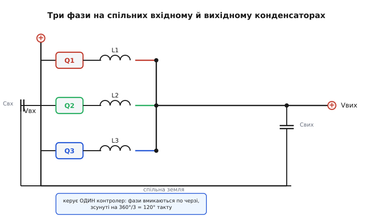
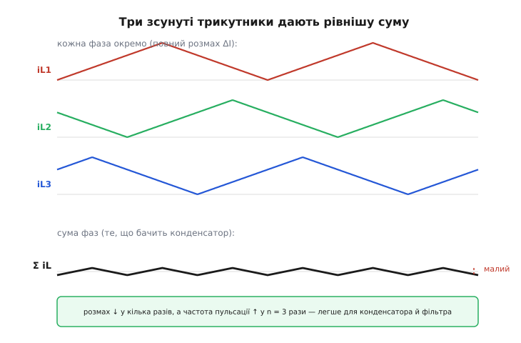
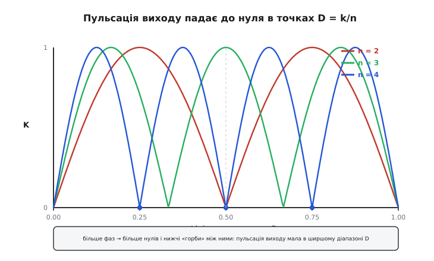

# Паралельно-фазний (interleaved) перетворювач

Уявіть, що процесор просить 100 ампер при 1 вольті — і просить їх ривками, за наносекунди. Один [buck-перетворювач](root:hw-power/buck) на такий струм зробити можна, але вийде монстр: гігантський ключ, товстелезна котушка, батарея конденсаторів на виході, щоб проковтнути шалену пульсацію. І вся ця жара сидить в одній точці плати. Замість цього роблять інакше — ставлять кілька однакових перетворювачів **пліч-о-пліч** на спільний вихід і **розводять їхні такти в часі**, щоб вони працювали по черзі, а не разом. Це і є паралельно-фазний, або **черезкроковий**, перетворювач (англ. *interleave* — «прокладати шар за шаром, чергувати»; звідси усталене *interleaved converter*).

Ідея звучить як проста паралель — «поставили N штук, кожна тягне 1/N струму». Але справжня магія не в поділі струму (це очевидно), а в тому, що **правильно зсунуті в часі пульсації взаємно гасяться**. Один перетворювач пульсує вгору саме тоді, коли інший пульсує вниз, — і те, що бачить вихідний конденсатор, стає набагато рівнішим, ніж пульсація кожної окремої фази. Ось де ховається вся користь, і саме її ми розберемо від першопричини.

### Що таке «фаза» і навіщо їх зсувати

Кожен окремий перетворювач у цій зграї називають **фазою** (*phase*) — не в сенсі мережевих фаз, а в сенсі «зсуву по фазі такту». Візьмемо N однакових buck-комірок: у кожної свій ключ (точніше, пара ключів — верхній і синхронний нижній), своя котушка, але **вхідний конденсатор спільний і вихідний спільний**. Керує ними **один контролер**, і робить одну хитру річ: він не вмикає всі ключі одночасно, а рознесе моменти ввімкнення рівномірно по такту.


*Три однакові buck-комірки (пара ключів + котушка) висять на спільному вхідному й спільному вихідному конденсаторах. Один контролер вмикає їх по черзі, зсуваючи такти на 360°/3 = 120°. Струми котушок сходяться в один вихідний вузол — і саме там їхні пульсації додаються.*

Зсув простий: якщо фаз N, а повний такт — це 360°, то кожну наступну фазу вмикають на **360°/N пізніше** за попередню. Для трьох фаз це 120°, для чотирьох — 90°, для двох — 180° (тобто рівно в протифазі). У часі: якщо такт триває T = 1/f, то фаза 2 стартує на T/N пізніше фази 1, фаза 3 — на 2T/N, і так далі.

> 🔧 **Навіщо це.** Рівномірний зсув — не забаганка, а точка, у якій пульсації гасяться найкраще. Візьмете зсув «на око» — і фази почнуть частково збігатися, пульсація на виході підскочить, конденсатори загріються. Тому в контролері зсув задає не програміст «руками», а апаратний лічильник, що ділить такт на N рівних частин.

Чому саме рівний зсув гасить найкраще, стане зрозуміло, щойно ми складемо струми.

### Серце ідеї: пульсації додаються й гасяться

Струм у котушці buck-перетворювача — це **трикутна хвиля**: поки верхній ключ відкритий, струм наростає, поки закритий — спадає. Розмах цього трикутника — **пульсація струму** (ΔI), і в одній фазі вона нікуди не дівається. А тепер поставимо три такі трикутники **зсунутими на третину такту** й складемо їх — адже їхні струми сходяться в один вихідний вузол.


*Угорі — три струми котушок, кожен із повним розмахом ΔI, але зсунуті на 120°. Унизу — їхня сума, те, що реально бачить вихідний конденсатор. Розмах суми в кілька разів менший за розмах однієї фази, а її частота — утричі вища. Саме ця рівна сума й робить interleaved таким привабливим.*

Погляньте на суму уважно. Коли трикутник першої фази йде вниз (ключ закрився, струм спадає), трикутник другої вже йде вгору (її ключ щойно відкрився). Спад одного **компенсує** підйом іншого — і сума майже не гойдається. Це і є **скасування пульсацій** (*ripple cancellation*): не тому, що пульсація зникла в кожній фазі (вона там така сама), а тому, що фази пульсують **не в такт**, і в сумі їхні коливання накладаються протилежними хвилями.

Дві речі відбуваються одночасно, і обидві корисні:

1. **Розмах пульсації падає** — сумарний струм у конденсатор стає рівнішим. Для конденсатора це прямий подарунок: менша пульсація струму → менший нагрів, менша потрібна ємність, менший розмах напруги на виході.
2. **Частота пульсації росте у N разів.** Кожна фаза перемикається на частоті f, але оскільки їх N і вони зсунуті, вихід «бачить» пульсацію на частоті N·f. А вища частота пульсації фільтрується легше — той самий конденсатор гасить її ефективніше, а часто менший конденсатор уже дає той самий результат.

Ось чому один великий buck і три маленькі interleaved — це **не одне й те саме**, навіть якщо сумарна потужність однакова. Три маленькі дають на виході набагато рівнішу напругу за ту саму (або меншу) ємність.

### Де пульсація падає до нуля: солодкі точки D = k/N

Тепер найкрасивіше. Скасування працює не однаково при всіх коефіцієнтах заповнення — воно то сильніше, то слабше залежно від того, яку частку такту відкритий ключ (це **коефіцієнт заповнення** D, *duty cycle*). А в певних точках сумарна пульсація виходу падає **точно до нуля** — принаймні в ідеалі.

Ці точки — там, де **D = k/N** (k — ціле: 1, 2, …, N−1). Логіка чиста: якщо відкриті інтервали фаз укладаються в такт так, що в кожен момент **сумарна напруга, прикладена до всіх котушок, стала**, то й сумарний струм наростає рівномірно, без коливань. Так стається саме тоді, коли D — рівно частка k/N: інтервали фаз стикуються край-у-край, і провал одного затуляється підйомом наступного ідеально.


*Пульсація виходу залежно від D для 2, 3 і 4 фаз. Вона падає до нуля в точках D = k/N (для 4 фаз — це 0.25, 0.5, 0.75) і піднімається до «горбів» між ними. Що більше фаз, то більше нулів і то нижчі горби: рівний вихід виходить у ширшому діапазоні напруг.*

Звідси практичний висновок, який визначає вибір числа фаз. Скажімо, треба знизити 12 В до 1.2 В: тоді D ≈ 0.1. Погляньте на криву — для двох фаз (нулі в D = 0.5) ця точка сидить майже на «горбі», скасування слабке. А для більшого числа фаз горби нижчі, і навіть далеко від точного нуля пульсація лишається малою. Ось чому в живленні процесорів, де вхід 12 В, а вихід близько 1 В (тобто мале D), ставлять **багато** фаз — не заради струму, а заради того, щоб опинитися ближче до солодкої точки й тримати вихід рівним.

> 🔧 **Навіщо це.** Число фаз обирають не «скільки струму / скільки тягне одна». Спершу дивляться, яке буде D (з відношення Vвх/Vвих), і підбирають N так, щоб робоча точка сіла ближче до нуля D = k/N. Це рішення в лоб економить конденсатори й ловить рівніший вихід — часто важливіше за сам поділ струму.

Точну форму цієї кривої скасування — звідки беруться нулі й наскільки високі горби між ними — виводять через сумарний вольт-секундний баланс усіх фаз. Це варте окремого розбору: [🧮 Коефіцієнт скасування пульсацій](root:hw-power/interleaved-converter/math-ripple-cancellation.md) показує, як із зсунутих трикутників отримати формулу пульсації виходу як функції D і N та довести, що нулі стоять рівно в D = k/N.

### Друга велика вигода: рознесення тепла й струму

Скасування пульсацій — головна причина взагалі городити interleaved, але не єдина. Друга — **тепло й струм рознесені по площі й по деталях**.

Коли 100 А тягне один ключ, уся втрата провідності (I²·Rси) і всі [втрати перемикання](root:hw-components/switching-losses) сидять в одному корпусі, і його доводиться героїчно охолоджувати. Розкидаємо той самий струм на 5 фаз — кожен ключ тягне 20 А, а втрата провідності в кожному падає **вчетверо** (бо I²: 20² проти 100² на канал, і таких каналів п'ять). Загальна втрата теж падає, але головне — вона **розмазана** по п'яти точках плати, і кожну легше остудити. Те саме з котушками: п'ять малих замість однієї величезної, і кожна гріється помірно.

Є й тонший бонус — **вхідний струм теж стає рівнішим**. Кожна фаза смикає вхід імпульсами (поки її верхній ключ відкритий), і якщо фази зсунуті, ці імпульси розкидані по такту, а не б'ють разом. Тож і вхідний конденсатор бачить меншу пульсацію — важливо, коли вхід іде довгим кабелем чи від слабкого джерела.

> 🔧 **Навіщо це.** Саме поділ струму робить можливими живлення на десятки й сотні ампер узагалі: немає ключа й котушки, які самотужки й спокійно тримали б такий струм при потрібній частоті. Interleaved розбиває непідйомну задачу на N підйомних — і кожен елемент працює в комфортному для себе режимі.

### Ціна: усі фази мусять нести рівний струм

Досі все звучало як безплатний обід. Плата є, і головна — **балансування струму** (*current sharing*). Три фази номінально однакові, але в реальності котушки трохи різні, ключі мають різний опір, доріжки різної довжини. Якщо пустити все на самоплив, одна фаза візьме на себе більше струму, ніж інші, — перегріється й вигорить, тоді як сусідні недовантажені.

Тому справжній interleaved-контролер **міряє струм кожної фази окремо** й підправляє її коефіцієнт заповнення, щоб усі фази несли порівну. Це окремий контур керування поверх звичайного [зворотного зв'язку по напрузі](root:hw-power/feedback-stability): напруга задає **загальний** рівень, а балансування ділить його **між фазами**. Без нього interleaved втрачає половину сенсу — рознесення тепла працює, лише якщо струм справді поділений рівно.

Виміряти струм фази можна по-різному: точний, але гарячий шунт у розрив; хитре зчитування падіння на власному опорі котушки (*DCR sensing*); або падіння на самому нижньому ключі. Дрібниці різняться, а суть одна — контролеру потрібне число «скільки тягне ця фаза», щоб тримати всіх урівні.

Друга плата — **складніший контролер і розведення**. Один buck розводить і школяр; п'ятифазний вимагає симетрії доріжок (щоб фази справді були однакові), акуратного зворотного зв'язку по струму й контролера, який усе це вміє. Тому interleaved не ставлять там, де вистачає одної фази, — його дістають, коли струм або вимоги до рівності виходу переростають одну фазу.

### Розумний трюк: гасити фази на малому навантаженні (phase shedding)

Багато фаз чудові на повному струмі, але марнотратні на малому. Уявіть п'ятифазне живлення процесора, що зараз майже нічого не робить і бере два ампери. Ганяти всі п'ять фаз заради двох ампер — безглуздо: кожна фаза має власні втрати «на холостому» (перезаряд затворів, струм спокою контролера), і п'ять фаз палять уп'ятеро більше «на дурно».

Тому розумні контролери роблять **скидання фаз** (*phase shedding*): на малому навантаженні вони **вимикають зайві фази** й лишають, скажімо, одну. Коли навантаження зростає — фази знову підмикаються по одній. Так перетворювач тримає високий ККД **і** на повному, **і** на малому струмі, замінюючи щедрість на ощадливість, коли вона доречна.

Розплата за скидання — гірше скасування пульсацій у ті моменти (менше фаз — менше гасіння), але на малому струмі пульсація й так мала в абсолюті, тож обмін вигідний.

### Скільки саме виграємо: worked-приклад

Порахуймо на числах, наскільки interleaved полегшує життя виходу. Візьмемо базу: buck 12 В → 1.2 В (тобто D = 0.1), частота фази f = 500 кГц, котушка кожної фази L = 1 мкГ. Порівняємо одну фазу й чотири.

Спершу пульсація струму **однієї** фази — звичайна формула buck (наростання за час відкритого ключа):

```
ΔI = (Vвх − Vвих) · D / (L · f)
   = (12 − 1.2) · 0.1 / (1·10⁻⁶ · 500·10³)
   = 10.8 · 0.1 / 0.5
   = 1.08 / 0.5 = 2.16 А (розмах на фазу)
```

Один buck на весь струм ковтав би ці 2.16 А розмаху в конденсатор на частоті 500 кГц. Тепер чотири фази, зсунуті на 90°. Для чотирьох фаз при D = 0.1 сумарний розмах пульсації падає приблизно в **8–10 разів** (ми недалеко від нуля D = 0, бо горби для 4 фаз низькі), а частота пульсації стає 4·500 кГц = 2 МГц. Оцінимо пульсацію напруги на виході для ємнісної складової (∝ 1/(f·C)):

```
для однієї фази:  ΔVвих ≈ ΔI / (8 · f · C)
для 4 фаз:        ΔVвих ≈ ΔIΣ / (8 · 4f · C)
```

ΔIΣ уже менша за ΔI приблизно вдесятеро, а знаменник більший вчетверо (частота 4f). Разом пульсація напруги падає **у ~40 разів** за той самий конденсатор. Або, дивлячись з іншого боку: щоб дістати ту саму пульсацію напруги, чотирифазному виходу треба приблизно в 40 разів **меншу** ємність, ніж однофазному. Ось звідки в живленні процесорів рівний вихід за скромною батареєю конденсаторів.

Тепер приклад коду — як контролер зсуває фази. У найпростішому вигляді це один такт-лічильник, поділений на N рівних порогів; кожна фаза стартує на своєму порозі:

:::tabs
```cpp
// N-фазний зсув: один такт ділимо на N рівних інтервалів.
// TIMER_TOP — значення лічильника за повний такт (=1/f).
#define N_PHASES   4
#define TIMER_TOP  1000u   // тактів таймера на один період комутації

// Поріг старту фази i: рівномірний зсув на 360°/N.
static inline uint16_t phase_start(uint8_t i) {
    // i-та фаза починає свій такт на (i * TIMER_TOP / N)
    return (uint16_t)((uint32_t)i * TIMER_TOP / N_PHASES);
}

void setup_phase_offsets(void) {
    for (uint8_t i = 0; i < N_PHASES; i++) {
        // кожній фазі — власний зсув фази ШІМ у її таймері/каналі
        pwm_set_phase(i, phase_start(i));   // 0, 250, 500, 750 тактів
    }
}
```
```python
# N-фазний зсув: один такт ділимо на N рівних інтервалів.
# TIMER_TOP — значення лічильника за повний такт (=1/f).
N_PHASES = 4
TIMER_TOP = 1000   # тактів таймера на один період комутації

def phase_start(i):
    """Поріг старту фази i: рівномірний зсув на 360°/N."""
    # i-та фаза починає свій такт на (i * TIMER_TOP / N)
    return i * TIMER_TOP // N_PHASES

def setup_phase_offsets():
    for i in range(N_PHASES):
        # кожній фазі — власний зсув фази ШІМ у її таймері/каналі
        pwm_set_phase(i, phase_start(i))   # 0, 250, 500, 750 тактів
```
:::

Зверніть увагу: зсуви — це просто `i * TIMER_TOP / N` (0, 250, 500, 750 для чотирьох фаз при TIMER_TOP = 1000). Рівні пороги дають рівний зсув 90°, а він і забезпечує найкраще скасування. Помиліться в цьому діленні — і фази з'їдуть, гасіння погіршиться.

А ось спрощене ядро балансування струму, що підправляє заповнення кожної фази до середнього по всіх фазах:

:::tabs
```cpp
// Балансування: тягнемо кожну фазу до середнього струму по всіх фазах.
void balance_phases(int16_t i_phase[N_PHASES], uint16_t duty[N_PHASES]) {
    int32_t sum = 0;
    for (uint8_t k = 0; k < N_PHASES; k++) sum += i_phase[k];
    int16_t i_avg = (int16_t)(sum / N_PHASES);   // цільовий струм на фазу

    for (uint8_t k = 0; k < N_PHASES; k++) {
        int16_t err = i_phase[k] - i_avg;         // ця фаза тягне більше/менше?
        // тягне більше середнього → трохи прикрити її заповнення, і навпаки
        duty[k] -= (err >> 4);                     // м'який коефіцієнт (÷16)
    }
}
```
```python
# Балансування: тягнемо кожну фазу до середнього струму по всіх фазах.
def balance_phases(i_phase, duty):
    i_avg = sum(i_phase) // N_PHASES              # цільовий струм на фазу

    for k in range(N_PHASES):
        err = i_phase[k] - i_avg                  # ця фаза тягне більше/менше?
        # тягне більше середнього → трохи прикрити її заповнення, і навпаки
        duty[k] -= err >> 4                        # м'який коефіцієнт (÷16)
```
:::

Це навмисне спрощено (реальний контур має обмеження й фільтри), але суть видно: **напругу тримає спільний контур, а рівність фаз — оцей додатковий**. Одне без одного не працює.

### Не лише buck: interleaved як загальний прийом

Ми весь час говорили про buck, бо це найпоширеніший випадок (живлення процесорів — його головна арена). Але сама ідея — «постав N однакових комірок, зсунь такти, дай пульсаціям погаситися» — прикладна до будь-якої імпульсної топології. Interleaved [boost](root:hw-power/boost) роблять там, де треба велика потужність підвищення з рівним вхідним струмом (наприклад, на вході коректорів коефіцієнта потужності). Interleaved-варіанти є й у flyback, і в інших схемах. Прийом один: рознести фази в часі, щоб зграя працювала рівніше за поодинокого силача.

Окремо варто назвати найвідоміше втілення — **багатофазний buck для живлення процесорів** (той самий VRM, *voltage regulator module*), де фаз буває вісім, дванадцять і більше, а струми сягають сотень ампер. Це та сама interleaved-ідея, доведена до краю під вимоги сучасних процесорів: мале D, шалений струм, блискавична реакція на стрибок навантаження. Про специфіку саме цього застосування — [багатофазний buck-перетворювач](root:hw-power/multiphase-buck): чому фаз саме стільки, як контролер реагує на наносекундні стрибки струму процесора, як влаштоване динамічне скидання фаз.

Отже, паралельно-фазний перетворювач — це не «кілька buck поруч заради струму». Це спосіб змусити пульсації **самі себе гасити**, розкидати тепло по площі й тримати вихід рівним навіть на непідйомних струмах. Ціна — балансування фаз і складніший контролер; виграш — рівний вихід за скромної ємності, рознесене тепло й високий ККД у широкому діапазоні навантаження. Саме тому кожен сучасний процесор живиться не одним великим перетворювачем, а зграєю малих, що працюють по черзі.
