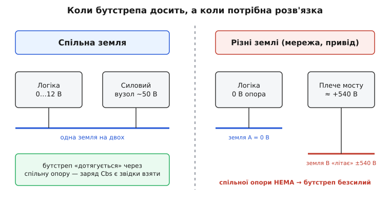
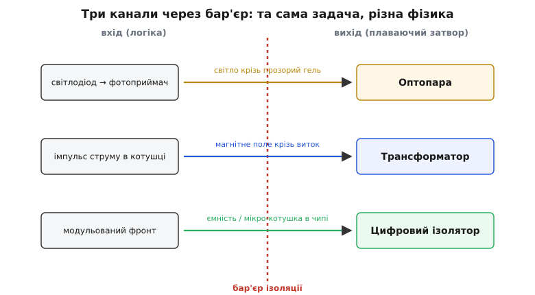
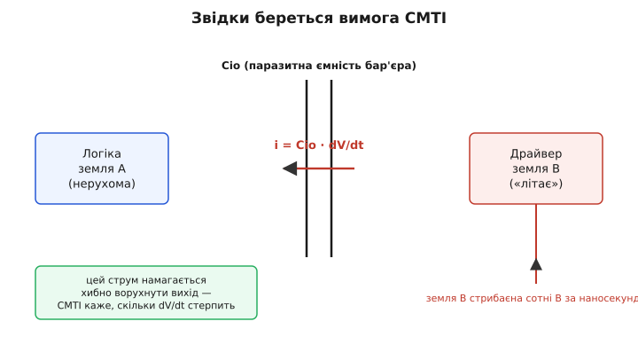

# Ізольований драйвер затвора

<preknowlist>
- [Драйвер затвора](topic:hw-power/gate-driver) — навіщо силовому ключу потрібен окремий підсилювач струму на затвор і як влаштований його двотактний вихід.
- [Гальванічна розв'язка](topic:hw-components/galvanic-isolation) — передавання сигналу між колами без спільного провідника, коли їхні «землі» під різними потенціалами.
- [Верхній ключ](topic:hw-power/high-side-switch) — чому затвор верхнього N-ключа треба живити над силовою шиною і як це роблять бутстрепом.
- [Ємність затвора](topic:hw-components/gate-capacitance) — затвор як конденсатор із зарядом Qg; струм у затвор задає швидкість фронту.
</preknowlist>

## Де закінчується бутстреп

Звичайний драйвер затвора живе в одному електричному світі з контролером: у них **спільна земля**. Навіть верхній ключ півмоста, чий витік підстрибує до силової шини, вдається обслужити хитрим трюком — бутстрепним конденсатором, що «їде» вгору разом із вузлом і на мить дає плаваюче живлення. Трюк тримається на одній непомітній умові: між логікою й силовою частиною є **спільна опора**, від якої бутстреп щоразу перезаряджається. Прибери її — і вся конструкція розсипається.

А прибирають її самі задачі. У приводі електромотора, мережевому інверторі, зарядці електромобіля, індукційному нагріві силова частина сидить під потенціалом, що **не має нічого спільного** із землею контролера: сотні вольт постійної шини, а часом і безпосередній зв'язок із мережею 230 В. Земля силового боку тут — не «трохи вища», а зовсім інша опора, яка ще й **стрибає** на сотні вольт щоразу, коли перемикається плече мосту. Спільної точки, від якої міг би зарядитися бутстрепний конденсатор, просто немає.


*Коли логіка й силовий вузол мають одну землю, бутстреп перезаряджається через цю спільну опору. Коли землі різні й одна з них «літає» на сотні вольт (мережа, привід, тяга), спільної точки немає — заряджати бутстреп нема від чого, і потрібен зовсім інший спосіб керувати затвором.*

Тут і з'являється **ізольований драйвер затвора** *(від лат. insula — острів; «зробити островом», відрубати від решти)*. Це драйвер, у якому вхід (керування від контролера) і вихід (у затвор силового ключа) **не з'єднані жодним провідником**. Керувальний сигнал долає розрив крізь фізичний бар'єр — світлом, магнітним полем чи полем через ємність, — а сила, що заряджає затвор, береться на вихідному боці з **окремого плаваючого живлення**. Логіка й силова частина стають двома окремими островами; між ними ходить лише інформація «відкрий/закрий», але не спільний струм.

> 🔧 **Навіщо це.** Правило вибору просте: якщо силова земля може відрізнятися від землі контролера більше ніж на ~60–100 В або гальванічно зв'язана з мережею — бутстреп забороняється двічі. Раз — бо фізично не працює (нема від чого заряджатися). Два — бо небезпечно: він **не розриває** зв'язок, і мережевий потенціал приліз би просто на ніжку контролера, а звідти до людини. Ізольований драйвер тут не «краще», а **єдиний припустимий** спосіб.

## Що саме розриваємо і навіщо

Слово «ізольований» тут означає конкретну річ: між входом і виходом стоїть **діелектричний бар'єр**, що витримує велику напругу й не пропускає постійний струм. Дві причини завести такий бар'єр існують незалежно, і корисно їх розрізняти.

Перша — **функційна**: інакше не працює. Затвор верхнього ключа треба «розмовляти» з боку, що плаває на +540 В, а контролер живе коло нуля. Без розриву довелося б тягнути живлення й сигнал напряму між світами з різницею в сотні вольт — це або неможливо, або перетворює всю схему на джерело завад і руйнівних струмів.

Друга — **безпека**: розрив рятує людину й апаратуру. У мережевих пристроях між тим боком, до якого має доступ людина (кнопки, роз'єми, USB), і тим, що висить на 230 В, за нормами мусить стояти бар'єр, здатний витримати кіловольти й не пробитися навіть при кидку напруги. Ізольований драйвер якраз і несе такий бар'єр усередині, а тому заразом виконує вимогу [безпеки з мережею](topic:hw-power/mains-safety) на найнебезпечнішій ділянці — там, де слабкий сигнал керування торкається силового плеча.

Розрізняють **основну** ізоляцію (один бар'єр — базовий захист) і **підсилену** *(reinforced — «посилену»; фактично подвійний запас, що замінює два незалежні бар'єри)*. Пристрій, у якого людина може торкнутися вхідного боку, вимагає підсиленої: якщо єдиний бар'єр колись пробитий, більше нема нічого між пальцем і мережею. Наскільки широкий має бути цей бар'єр по поверхні корпусу (щоб напруга не «переповзла» зовні) і як його перевіряють випробувальною напругою — окрема інженерна тема; коротко про відстані витоку й [гіпот-тест](topic:hw-power/mains-hipot-test) сказано осібно.

## Три способи перенести сигнал через бар'єр

Сигнал «відкрий/закрий» — це біти, і перенести їх крізь діелектричний розрив можна трьома фізичними каналами. Усі роблять одне: беруть фронт на вході й відтворюють його на виході, ніде не з'єднавши боки провідником. Різняться носієм.


*Та сама задача — перенести фронт через розрив — розв'язується трьома фізиками. Оптика світить крізь прозорий гель, трансформатор проводить магнітне поле крізь виток, цифровий ізолятор модулює фронт і ловить його ємнісним чи магнітним зв'язком просто в кристалі.*

**Оптика.** Найдавніший і найнаочніший спосіб — [оптопара](topic:hw-components/optocoupler): світлодіод світить крізь прозорий ізолювальний гель на фотоприймач по той бік. Струм у світлодіод — світло — струм у приймачі; провідника немає, лише фотони, а вони бар'єру не бояться. У ролі драйвера це «драйвер-оптопара»: у одному корпусі світлодіод і повноцінний двотактний вихід на ампери, готовий гнати затвор IGBT. Плата за наочність — світлодіод старіє й слабшає з роками та жаром, а сам оптичний канал повільніший і чутливіший до різких стрибків напруги, ніж хочеться від швидких ключів.

**Магнітне поле.** Трансформатор *(лат. transformare — перетворювати)* передає **зміну** струму: імпульс у первинній котушці наводить імпульс у вторинній, і між ними — лише магнітне поле крізь виток, а обмотки розділені ізоляцією. Трансформатор витримує величезні кіловольти, дуже швидкий і, на відміну від оптики, **сам** може передати ще й трохи енергії на вихідний бік. Але передає він лише зміни: тримати постійний рівень «відкрито» трансформатор не вміє — доводиться або гнати сигнал не рівнем, а серією імпульсів, або кодувати фронти хитріше.

**Поле в кристалі (цифровий ізолятор).** Сучасний спосіб — [цифровий ізолятор](topic:hw-digital/digital-isolator): біти переносить крихітний конденсатор або мікроскопічна котушка, вбудовані просто в мікросхему поряд зі схемою. Фронт модулюють у високочастотний сигнал, він проскакує через ємність чи магнітний зв'язок бар'єра, а по той бік відновлюється. Виходить швидко, стабільно з роками (нема світлодіода, що вигорає) і компактно; такий бар'єр тримає ті самі кіловольти на площі кількох міліметрів. Саме цей клас витіснив оптику там, де важать швидкість і термін служби, — у драйверах для швидких SiC- і GaN-ключів.

Спосіб — це носій сигналу, не «клас драйвера». Один і той самий готовий драйвер IGBT усередині може бути оптичним, трансформаторним чи ємнісним; для схемотехніка змінюється швидкість, ресурс і стійкість до стрибків напруги, але роль лишається та сама — донести біт керування на плаваючий бік.

## Живлення затвора мусить бути своє

Перенести біт — половина справи. Затвор — це [ємність](topic:hw-components/gate-capacitance) на десятки нанокулон, і щоб перемкнути ключ швидко, у неї треба **влити ампери** й так само швидко **відсмоктати**. Ця сила береться на вихідному боці бар'єра — а він плаває на сотнях вольт, і простягнути туди дротик від блока живлення контролера не можна, це знищило б розв'язку. Отже, кожному плаваючому боку потрібне **власне ізольоване живлення** на 10–20 В, теж відрубане від землі контролера.

Звідки його брати? Найчастіше — з маленького **ізольованого перетворювача** (за принципом [flyback](topic:hw-power/flyback-isolated) чи push-pull через свій трансформатор): він теж несе бар'єр і віддає на вихідний острів кілька вольт-ампер, рівно щоб живити вихідний каскад драйвера. Деякі трансформаторні драйвери спритніші й **самі** гойдають достатньо енергії через сигнальний трансформатор, обходячись без окремого джерела для слабких ключів. Але для потужних IGBT і SiC, де затвор жадібний, а часто ще й треба **від'ємна** напруга на вимкнення, майже завжди ставлять окреме ізольоване живлення на бік.

Тут і криється головна відмінність від бутстрепа. Бутстреп — це хитрий спосіб **не** заводити окреме живлення: він позичає заряд зі спільної шини на мить. Ізольований драйвер робить протилежне — свідомо дає кожному боку **повноцінне постійне** живлення без жодної спільної точки. Тому він не має обмеження «до 99 % шпаруватості» (нема бутстрепного конденсатора, що стече) і тримає ключ відкритим скільки завгодно — хоч вічно.

## CMTI — головна цифра, якої нема у звичайного драйвера

У ізольованого драйвера є параметр, якого в неізольованого не існує в принципі, і саме він часто вирішує, годиться драйвер чи ні, — **CMTI** *(Common-Mode Transient Immunity — стійкість до синфазних перехідних стрибків)*. Щоб відчути його, треба побачити, що робить бар'єр під час перемикання.

Вихідний бік драйвера прив'язаний до плеча мосту. Коли це плече перемикається, потенціал усього вихідного острова **стрибком** злітає чи падає на всю силову шину — сотні вольт за одиниці наносекунд. Тобто вхідний бік стоїть нерухомо, а вихідний **разом зі своєю землею** смикається на сотні вольт відносно нього. Це і є синфазний стрибок: не сигнал, а рух цілого боку.

Ідеальний бар'єр такого руху не помічав би. Реальний має **паразитну ємність** Cio між боками — кілька пікофарад крізь ізоляцію, нікуди не дінешся. А будь-яка ємність під швидкою зміною напруги проводить струм:

```
i = Cio · dV/dt
```

Цей струм проскакує крізь бар'єр і намагається **хибно ворухнути** вихідну схему драйвера — збити її стан, щоб на виході майнув паразитний імпульс. Якщо він майне, драйвер на мить смикне затвор не туди — і у півмості це прямий шлях до наскрізного струму й загибелі ключів.


*Коли земля вихідного боку стрибає на сотні вольт за наносекунди, паразитна ємність бар'єра Cio проводить струм i = Cio·dV/dt просто у вихідну схему драйвера. CMTI — це гранична крутість dV/dt, яку драйвер витримує, не давши хибного імпульсу на виході.*

**CMTI** і є та гранична крутість dV/dt, яку драйвер стерпить без хибного спрацювання. Міряють її в **кіловольтах за мікросекунду** (кВ/мкс), тобто у вольтах за наносекунду. Чим швидший ключ, тим більший dV/dt він створює на вимиканні, тим вищий CMTI потрібен від драйвера, що поряд.

**Скільки CMTI треба.** Раніше для повільних кремнієвих IGBT вистачало 25–50 кВ/мкс. Швидкі SiC- і GaN-ключі дають набагато крутіші фронти, і практичне правило для типової шини ~600 В — драйвер має тримати щонайменше ~100–120 кВ/мкс, а найшвидшим потрібно 150–200 кВ/мкс і вище. *(Дані усталені: наводяться в технічних матеріалах виробників драйверів для широкозонних приладів; порядки величин збігаються між джерелами.)* Це не «запас про всяк випадок»: недостатній CMTI у швидкій схемі проявляється як загадкові збої під навантаженням, які ніяк не зловити на малих струмах.

**Чи вистачить CMTI: числовий приклад.**
Півмостовий інвертор на шині 540 В. SiC-ключ вимикається різко, і вузол SW злітає з 0 до 540 В за 6 нс, тобто dV/dt = 540 В / 6 нс = 90 В/нс = 90 кВ/мкс. Візьмімо драйвер із паспортним CMTI 100 кВ/мкс і паразитною ємністю бар'єра Cio = 2 пФ.

```
dV/dt  = 540 / 6e-9    = 9.0e10 В/с   = 90 кВ/мкс
i      = Cio · dV/dt
       = 2e-12 · 9.0e10 = 0.18 А       = 180 мА крізь бар'єр
```

90 кВ/мкс проти паспортних 100 кВ/мкс — впритул, запасу майже нема. Крізь бар'єр щоразу тече 180 мА струму-«злодія», і драйвер мусить його ігнорувати. Висновок прямий: для цієї схеми беруть драйвер із CMTI хоча б 150 кВ/мкс, інакше перші ж повні режими дадуть хибні імпульси й наскрізний струм. У неізольованого драйвера цього параметра нема взагалі — бо там вихід не смикається відносно входу, немає й струму крізь бар'єр, якого й самого немає.

## Що це дає в реальній розробці

Ізольований драйвер тягне за собою свій набір інженерних турбот, відмінних від бутстрепного.

**Затримка й її розкид.** Сигнал іде крізь бар'єр не миттєво — є **затримка поширення** в десятки-сотні наносекунд. Сама собою вона стерпна, але у півмості важливий **розкид** затримки між верхнім і нижнім каналом: якщо один драйвер стабільно спізнюється відносно іншого, це прямо з'їдає [мертвий час](topic:hw-components/switching-losses) і наближає наскрізний струм. Тому в парних драйверах шукають не лише малу затримку, а й малий **розбаланс** каналів.

**Кожному боку — своє живлення й свій розв'язувальний конденсатор.** Вихідний острів мусить мати свій запас енергії просто коло виходу драйвера: у момент перемикання затвор вимагає ампери за наносекунди, і взяти їх ніде, крім місцевого конденсатора. Слабке чи далеке ізольоване живлення — і фронт «просідає», ключ повзе крізь лінійну зону й гріється. Розв'язувальний конденсатор ставлять упритул до виходу, а не «десь на платі».

**Розведення поперек бар'єра.** Під бар'єром на платі **нічого не проводять**: жодних доріжок, полігонів, перехідних отворів — інакше вони скорочують відстань витоку й зводять нанівець весь сенс ізоляції. Область під мікросхемою-драйвером і вздовж бар'єра лишають порожньою; це фізична вимога до топології, не рекомендація.

**Від'ємне живлення на вимкнення.** Швидкі й потужні ключі (IGBT, SiC) люблять, коли на вимкнення затвор тримають не на нулі, а на кількох вольтах **нижче** нуля — так навіть сильний стрибок за Міллером не дотягнеться до порога відмикання. Ізольований бік це дозволяє легко: раз живлення й так окреме та плаваюче, зробити його не «0…+15 В», а «−5…+15 В» майже нічого не коштує. Бутстреп такого не вміє в принципі.

> 🔧 **Навіщо це.** Обираючи ізольований драйвер, дивіться на три числа передусім. **CMTI** — чи витримає стрибок вашого найшвидшого ключа (порахуйте dV/dt = Vшина / tфронт і візьміть драйвер із добрим запасом). **Затримка та її розкид** — чи вкладеться мертвий час. **Тип і рівень ізоляції** (основна чи підсилена, на скільки кіловольт) — чи відповідає він тому, чи торкається людина вхідного боку. І пам'ятайте: сам драйвер — лише половина, другу половину складає **ізольоване живлення** його вихідного боку, без якого перша не працює.

## Коли він потрібен, а коли ні

Ізольований драйвер — не «покращена» версія звичайного, а відповідь на конкретну фізичну ситуацію: **боки під різними, а часто й небезпечними, потенціалами**. Якщо вся ваша силова частина живе від того самого блока живлення, що й контролер, і різниця потенціалів — одиниці десятків вольт, ізоляція зайва: бутстреп простіший, дешевший і швидший. Щойно з'являється мережа, висока постійна шина привода чи тяги, доступний людині бік — рівняння перевертається: спільної опори більше нема, безпека вимагає розриву, і єдиний коректний вибір — ізольований драйвер зі своїм плаваючим живленням і достатнім CMTI. Він коштує дорожче й додає затримку, але робить те, чого бутстреп не зробить ніколи: керує затвором з іншого електричного світу, не пускаючи туди ні спільного струму, ні небезпеки.
