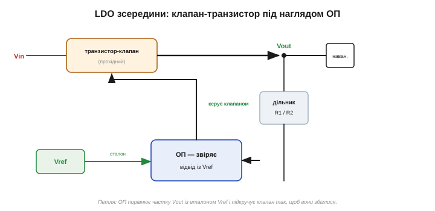
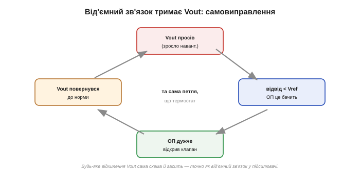
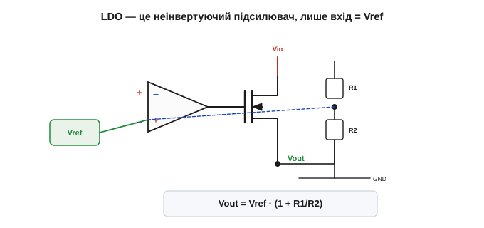
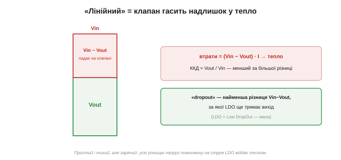
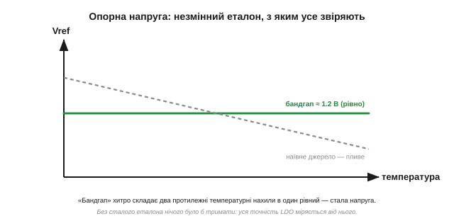
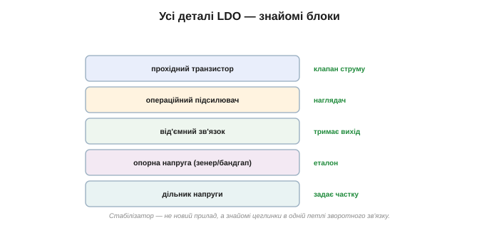

# LDO зсередини: ОП + транзистор + опорна напруга

Серед схем на [операційному підсилювачі](topic:hw-analog/ideal-opamp) — підсилювачів, буферів, суматорів, компараторів — є одна найкорисніша, та, що тихо стоїть **у кожному** електронному пристрої: **лінійний стабілізатор напруги** (стабілізатор — від лат. *stabilis*, стійкий). І виявляється, що це не новий загадковий прилад, а ОП, транзистор і опорна напруга, з'єднані в петлю зворотного зв'язку. Тут кілька знайомих цеглинок сходяться в одній маленькій, але незамінній схемі.

### Задача: чиста, точна, стабільна напруга

Майже вся цифрова електроніка хоче живитися **точною** напругою — мікроконтролер просить рівно 3.3 В, давач — рівно 5 В. А що ми маємо насправді? Акумулятор, чия напруга повзе від 4.2 до 3.4 В у міру розряду; адаптер, що «брудний» пульсаціями; шину, на якій напруга просідає щоразу, як умикається сусідній вузол. Із цього хисткого, мінливого живлення треба зробити **рівну й незворушну** напругу, що не зважає ні на вхідні коливання, ні на те, скільки струму бере навантаження. Саме це й робить стабілізатор.

Чому не обійтися простим дільником із двох резисторів? Бо дільник тримає **частку входу**, а не сталу напругу: попливе вхід — попливе й вихід; а варто навантаженню потягти струм — вихід просяде, бо «нижній» резистор уже не сам визначає напругу на вузлі. Дільник задає напругу, але не **тримає** її. Потрібен активний наглядач, що сам підправляється під будь-яку зміну, — а це вже зворотний зв'язок.

Звучить як знайома пісня: «тримати щось незмінним усупереч завадам». Інструмент для цього — [**від'ємний зворотний зв'язок**](topic:hw-analog/negative-feedback). Лишилося застосувати його до напруги.

### Ідея: клапан під наглядом

Уявіть кран на трубі. Через нього з вищого (вхідного) тиску тече вода в бак, а ми хочемо тримати в баку **сталий** рівень. Поставмо наглядача: він дивиться на рівень і підкручує кран — рівень упав, прочинив більше; піднявся — прикрутив. Стабілізатор улаштований **точнісінько так**.


*Три дійові особи. **Прохідний транзистор** — клапан між Vin і Vout: він пропускає рівно стільки, скільки треба. **Опорна напруга** Vref — еталон, «який рівень тримаємо». **Операційний підсилювач** — наглядач: він звіряє частку виходу (через дільник) з еталоном і підкручує клапан. Усе замкнено в петлю.*

Розберімо трьох учасників. **Прохідний транзистор** (біполярний чи польовий — [BJT](topic:hw-components/bjt-operation) або [MOSFET](topic:hw-components/field-control)) стоїть **послідовно** між входом і виходом і працює як **керований клапан** — пропускає більший чи менший струм залежно від того, наскільки його відкрити. **Опорна напруга** Vref — це незмінний еталон, мовляв, «ось яку напругу ми хочемо». А **операційний підсилювач** — наглядач: на один його вхід заведено еталон Vref, на другий — частку виходу через дільник, і він **порівнює** їх, керуючи клапаном так, щоб вони збіглися.

### Петля сама себе виправляє

Тепер найголовніше — як ця трійця тримає вихід рівним. Простежмо, що буде, коли навантаження раптом зросте й потягне більше струму: вихід трохи **просяде**.


*Самовиправлення. Vout просів → відвід дільника став трохи нижчий за Vref → ОП це помітив і **дужче** відкрив клапан → крізь транзистор пішло більше струму → Vout піднявся назад. Та сама петля [від'ємного зв'язку](topic:hw-analog/negative-feedback), лише стереже вона тепер напругу.*

Щойно Vout просів, частка його на дільнику стала трохи **меншою** за Vref. Операційний підсилювач, який тільки й робить, що підсилює різницю своїх входів, одразу це «бачить» і змінює сигнал на клапані так, щоб **сильніше** його відкрити. Транзистор пропускає більше струму — і вихід піднімається назад, аж поки відвід знову не зрівняється з Vref. І навпаки: підскочив вихід — відвід переріс Vref — ОП **прикрутив** клапан — вихід осів. Петля невпинно гасить будь-яке відхилення, тримаючи вихід як прицвяшений. Це той самий «термостат» [від'ємного зв'язку](topic:hw-analog/negative-feedback), лише стереже він не підсилення, а напругу.

Інженери розрізняють дві якості цієї незворушності: наскільки добре вихід тримається проти змін **входу** (стабілізація від мережі) і проти змін **навантаження** (стабілізація від струму). Хороший стабілізатор справляється з обома — і обидві дає та сама петля зворотного зв'язку, бо їй байдуже, **чому** саме вихід відхилився: вона гасить будь-яке відхилення однаково.

### Це знайомий неінвертуючий підсилювач

Придивімося до схеми уважніше. Еталон Vref заходить на неінвертуючий вхід «+», дільник із виходу повертає частку на інвертуючий «−», а транзистор лише підсилює вихідний струм ОП. Це ж [**неінвертуючий підсилювач**](topic:hw-analog/inverting-noninverting), тільки вхідним сигналом служить не зовнішня напруга, а сталий Vref!


*Та сама схема, що й неінвертуючий підсилювач. Завдяки [«віртуальному короткому»](topic:hw-analog/virtual-short) ОП підганяє вихід так, щоб відвід дорівнював Vref. Звідси одразу й формула виходу.*

Тут працює [«віртуальне коротке»](topic:hw-analog/virtual-short): справний ОП у петлі підганяє вихід так, щоб його входи зрівнялися. Отже, він триматиме відвід дільника точно рівним Vref. А раз дільник віддає на відвід частку R2/(R1+R2) від Vout, то вихід виходить:

```
Vout = Vref · (1 + R1/R2)
```

— рівно формула [неінвертуючого підсилювача](topic:hw-analog/inverting-noninverting). Звідси й проста інженерна свобода: **відношенням двох резисторів** ми задаємо будь-який вихід, більший за Vref. Хочеш 3.3 В від еталона 1.2 В — добери R1/R2 так, щоб (1 + R1/R2) = 2.75. Уся «магія» стабілізатора — це ОП, що завзято тримає відвід рівним еталону.

### Чому «лінійний» — і чому гарячий

Чому такий стабілізатор звуть **лінійним**? Бо прохідний транзистор працює не як вимикач (відкритий/закритий), а як **плавно керований опір** — прочинений рівно настільки, щоб «з'їсти» зайву напругу. Уся різниця Vin − Vout падає **на ньому**. А спад напруги на елементі, крізь який тече струм, означає одне — [**тепло**](topic:hw-components/rds-on).


*Розплата лінійного стабілізатора. Різниця Vin − Vout падає на прохідному транзисторі й розсіюється теплом: втрати = (Vin − Vout)·I. Звідси й невисокий ККД (≈ Vout/Vin) — що більша різниця, то більше марнується. Dropout — найменша різниця Vin−Vout, за якої схема ще тримає вихід.*

Звідси дві важливі речі. Перша — **ККД**: корисно лише Vout, а решта (Vin − Vout) на кожному ампері йде в тепло, тож коефіцієнт корисної дії приблизно Vout/Vin. Стабілізувати 3.3 В із 12 В лінійно — означає викинути теплом більш ніж дві третини потужності. Друга — звідки взялася сама абревіатура **LDO** (*Low DropOut*): це стабілізатор, здатний працювати за **малої** різниці Vin − Vout. Та найменша різниця, нижче за яку петля вже не може втримати вихід (бо клапан відкрито навстіж, а спаду все одно бракує), зветься **напругою dropout**. Звичайні стабілізатори вимагають ~2 В запасу, LDO задовольняються кількома десятими — тому й живлять 3.3 В прямо від 3.6-вольтового акумулятора. А що ж дає LDO це мале dropout? Тип прохідного транзистора: у класичних стабілізаторах клапан стоїть «повторювачем» і потребує добрих двох вольтів над собою, а в LDO його ставлять так (часто на P-канальному чи p-n-p приладі), що він здатен відкритися майже навстіж і підпустити вихід під саму вхідну напругу.

Прикиньмо ціну тепла на числах. Хай LDO робить 3.3 В при струмі 0.5 А. Від 5-вольтового адаптера він гасить (5 − 3.3) = 1.7 В, тобто P = 1.7 · 0.5 ≈ 0.85 Вт тепла — відчутно, транзистор уже треба охолоджувати. А від 3.6-вольтового акумулятора різниця лише 0.3 В, і втрати — мізерні 0.15 Вт. Та сама схема, та сама робота, а нагрів різниться в рази, бо все вирішує **різниця** Vin − Vout. (Саме цей ват тепла й визначає, чи обійдеться корпус сам, чи проситиме мідного полігона під собою; як перевести ці ватти в температуру кристала, показано в [тепловому розрахунку ключа](topic:hw-components/mosfet-power-switch/proj-thermal-calc.md).)

> 🧮 **Порахуймо межу.** Чому ККД лінійного — це просто Vout/Vin, скільки тепла дає кожен варіант (0.15 Вт від 3.6 В проти 4.35 Вт від 12 В) і де проходить межа, за якою лінійний стабілізатор уже недоцільний, — у математичній вставці [«Розсіювання LDO»](topic:hw-power/ldo-internals/math-ldo-dissipation.md).

Тепло — це ціна за простоту й тишу. Є й ефективніший спосіб робити напругу — імпульсний (перемикальний), що не палить надлишок, а спритно перекидає енергію; але він складніший і галасливіший, і це вже інша історія. Там, де треба тихо, просто й небагато струму, лінійний стабілізатор досі поза конкуренцією.

### Опорна напруга — еталон, з якого все починається

Лишилася одна деталь, яку ми досі вважали даністю: звідки береться сам **еталон** Vref? Адже вся точність стабілізатора міряється саме від нього — попливе еталон, попливе й вихід. Тому Vref робить не простим дільником (той залежав би від вхідної напруги), а спеціальним стійким джерелом.


*Добра опорна напруга майже не залежить ні від живлення, ні від температури. Найпоширеніша — бандгап: вона складає два протилежні температурні нахили в один рівний і дає сталі ≈1.2 В. Простіший варіант — [стабілітрон](root:embedded/zener-schottky), що тримає на собі сталу напругу.*

Найпростіший еталон — [**стабілітрон**](root:embedded/zener-schottky) (зенерів діод): він тримає на собі майже сталу напругу незалежно від струму. А найпоширеніший у мікросхемах — **бандгап** *(bandgap reference)*: розумна схемка, що складає дві величини з **протилежними** температурними нахилами так, щоб їхня сума не залежала від температури, і дає напрочуд стабільні ≈1.2 В (звідси й назва — це приблизно ширина забороненої зони кремнію у вольтах). Не вдаючись у деталі, важливо запам'ятати суть: десь усередині стабілізатора сидить маленький незмінний **еталон**, і вся робота схеми — це невпинно підганяти вихід під нього. А отже, точність усього приладу впирається саме в якість цього еталона: кращим за свій еталон вихід однаково не буде.

### Дрібниці, що вирішують

Кілька практичних рис, без яких картина неповна. По-перше, **власне споживання** (quiescent current): стабілізатор сам живить свій ОП і еталон, тож навіть без навантаження бере трохи струму. Для пристрою на батарейці, що місяцями спить, цей струмок вирішує термін життя — тому для автономних схем шукають LDO з мікроамперним власним споживанням.

По-друге, **вихідний конденсатор**. Петля реагує не миттєво, і без конденсатора на виході вона може «розгойдатися» — почати коливатися замість того, щоб тримати напругу (та сама загроза нестійкості, що чигає на будь-який зворотний зв'язок). Тому LDO майже завжди вимагає конденсатора на виході, а декотрі — ще й певної якості; це не примха, а умова стійкості.

По-третє, **очищення від пульсацій**. Та сама петля, що тримає вихід проти повільних змін входу, заразом **відфільтровує** й вхідні пульсації — але лише доти, доки встигає реагувати. Повільне брижіння вона давить чудово, а на високих частотах слабшає (це описують параметром «придушення завад живлення», PSRR). Тому LDO так люблять ставити саме перед чутливою аналоговою чи радіочастиною — щоб дати їй тиху, чисту напругу.

### Стабілізатор — це знайомі цеглинки

У стабілізаторі **немає жодної нової деталі**:


*Стабілізатор — це звичні блоки в одній петлі: прохідний [транзистор](topic:hw-components/field-control), [операційний підсилювач](topic:hw-analog/ideal-opamp), [від'ємний зворотний зв'язок](topic:hw-analog/negative-feedback), опорна напруга ([стабілітрон](root:embedded/zener-schottky) чи бандгап) і [дільник напруги](topic:hw-analog/voltage-divider). Жодної магії — лише гарне поєднання.*

Прохідний транзистор — це звичайний силовий ключ, тільки прочинений плавно. Операційний підсилювач — звичайний ОП. [Від'ємний зв'язок](topic:hw-analog/negative-feedback) тримає вихід рівним. Опорна напруга — стабілітрон чи бандгап. [Дільник](topic:hw-analog/voltage-divider) задає, яку частку виходу звіряти з еталоном. П'ять знайомих цеглинок, з'єднаних у петлю, — і виходить прилад, без якого не живе жоден пристрій. Складна на вигляд мікросхема стабілізатора — це майже завжди прості, уже відомі блоки, складені з тямою. Зазирнувши в один даташит уважно, ви впізнаєте їх усі — і замість «чорної магії» побачите знайому петлю зворотного зв'язку. Саме цю петлю й запаковано в звичний [модуль лінійного стабілізатора](topic:hw-power/ldo) AMS1117-класу: на платі він просить лише пару конденсаторів для стійкості, гріється на тій самій різниці Vin − Vout, а від регульованого LM317 відрізняється тим, що його вихід зафіксовано на заводі.

> 🔧 **Навіщо це.** Лінійний стабілізатор (LDO) — найперша цеглинка живлення в майже кожній саморобці: він робить рівні 3.3 чи 5 В для мікроконтролера з хисткого входу. Знаючи його нутро, ви розумієте і його чесноти (простий, тихий, точний), і його межі: він **гріється** на різниці (Vin − Vout)·I, тож не годиться, коли різниця велика чи струм чималий, — там рахуйте [тепло](topic:hw-components/rds-on) або беріть імпульсний. А ще ви бачите головне: «розумна» мікросхема стабілізатора — це ОП, транзистор і еталон у петлі зворотного зв'язку, не більше.
