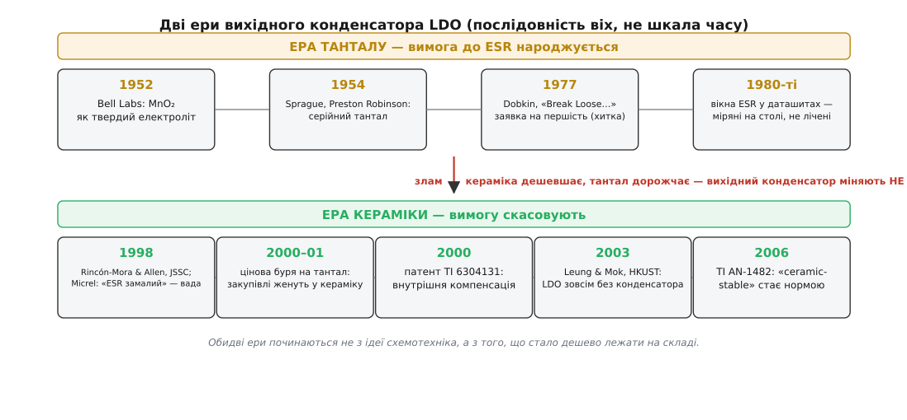
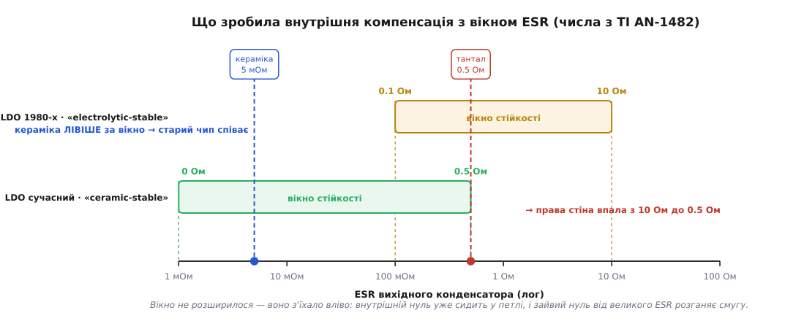

# 📜 Звідки взялася вимога до ESR

Рядок у даташиті «ESR вихідного конденсатора: 0.1…2 Ом» виглядає як забаганка інженера, що вимагає гіршої деталі. Але жодна людина ніколи не сідала й не проєктувала цю вимогу. Її не вигадали — вона **загусла**: спершу була зручність, потім звичка, потім залежність, і аж наприкінці — рядок у специфікації, який мільйони плат сприймали як закон природи.

Історія тут варта уваги не заради дат. Вона показує рідкісну річ: як технічна вимога може народитися **не з інженерного рішення, а з бухгалтерії** — і як її потім скасувала не краща схемотехніка, а ціна на метал. Простежмо цей ланцюжок від початку.


*Дві ери, кожна з власною логікою. У першій ESR — безкоштовний подарунок, на який петля навчилася спиратися; у другій цей подарунок зник із ринку, і петлі довелося відростити свій власний нуль усередині кремнію. Зверніть увагу на злам посередині: вихідний конденсатор на платах поміняли не схемотехніки.*

## Нуль, за який не треба було платити

Щоб зрозуміти походження вимоги, треба спитати не «навіщо ESR», а «що ще було під рукою в того, хто малював цю петлю».

Коріння — у самій топології. Низький спад напруги в LDO дає прохідний транзистор особливого штибу: PNP або PMOS, у якого навантаження висить на колекторі (стоці). Саме це дозволяє відчинити його майже до кінця й утримати регулювання, коли вхід лише на сотні мілівольтів вищий за вихід. Але колектор і стік — це **високоомні** виводи, і в цьому вся сіль: те саме конструктивне рішення, що дає низький спад, автоматично робить вузол виходу високоомним, а отже — породжує ту повільну полюс, яка їде з навантаженням. [Різні топології лінійних регуляторів — NPN-повторювач, PNP, PMOS — і те, як вибір прохідного транзистора визначає і спад напруги, і вихідний опір](root:hw-power/linear-regulator-types) — окрема тема; тут важливо одне: **низький спад і залежність від ESR — це той самий факт, побачений двічі**. LDO не «страждає» від вимоги до ESR як від дефекту. Вимога — це рахунок за низький спад.

Далі — проста арифметика для того, хто в 1980-х проєктував такий чип. Полюсів у нього три: панівна в підсилювачі похибки, полюс виходу від конденсатора з навантаженням (яка гуляє зі струмом) і полюс самого прохідного транзистора від його паразитної ємності. Три полюси в петлі з великим підсиленням — це готовий генератор, якщо не додати нуль. Нуль треба звідкись узяти.

І ось ключ до всієї історії. Узяти нуль можна було по-різному: додати RC-ланку, ускладнити підсилювач похибки, витратити площу кремнію. А можна було **не витрачати нічого**. Вихідний конденсатор на платі вже стояв — він потрібен був незалежно ні від чого, просто щоб регулятор працював. А в кожного реального конденсатора вже є паразитний послідовний опір. Отже, нуль **уже лежав у переліку деталей** — за нього вже заплатили. Інженер його не додав; він його **помітив**.

Texas Instruments сформулювала це без прикрас у застосовній записці SLVA115 (Джефф Фейлін, травень 2002): позаяк LDO і так вимагає вихідного конденсатора, використати його ESR — найпростіший і найдешевший спосіб дістати потрібний нуль. Ось і все походження вимоги. Не інсайт, не винахід — **економія**. Нуль з ESR переміг не тому, що він кращий, а тому, що безкоштовний.

Далі спрацював звичайний механізм затвердіння. Якщо петлю компенсовано чужим паразитом, то цей паразит перестає бути паразитом — він стає **деталлю схеми**, яку просто не намальовано на схемі. А деталь схеми треба специфікувати. Так залежність, що почалася як зручність, доїхала до розділу «Electrical Characteristics» і стала вимогою, обов'язковою до виконання.

> 🔧 **Навіщо це.** Коли бачите в старому даташиті дивну вимогу до зовнішньої деталі, питайте не «що вони хотіли цим сказати», а «на що вони спиралися задарма». Компенсація чужим паразитом — стала практика аналогової схемотехніки, і вона завжди має ту саму ціну: чип стає заручником чужої технології, яку не контролює. Саме це й вибухнуло через двадцять років.

## Хто «винайшов» LDO — і чому першість тут хитка

Раз уже вимога виросла з топології, варто спитати, кому цю топологію приписують. І тут ми одразу натрапляємо на класичну корпоративну першість, яку варто розібрати.

Поширена версія (її повторює й англійська Вікіпедія) звучить так: регульований LDO дебютував **12 квітня 1977 року** в статті «Break Loose from Fixed IC Regulators» у журналі *Electronic Design*; автор — **Роберт Добкін** (Robert «Bob» Dobkin), тодішній розробник National Semiconductor; на цій підставі National Semiconductor заявляла титул «винахідника LDO».

Заявка не витримує елементарної перевірки. Мікросхема, про яку та стаття, — LM117/LM317, регульований стабілізатор, який Добкін спроєктував 1976 року. Його спад напруги — **3 вольти**. Це рівно стільки ж, скільки у звичайнісінького нерегульованого 7805, і приблизно в десять разів більше, ніж у того, що сьогодні називають LDO. Стаття була про **регульованість** (два резистори замість фіксованої напруги) — і саме це слово в заголовку. Ототожнення «регульований» із «низьким спадом» — підміна, і англійська Вікіпедія в статті про сам LM317 послідовно не називає його низькоспадним.

Статус цієї першості чесно назвати так: **корпоративна маркетингова заявка, не підтверджена технічно**. Це не привід применшувати Добкіна — постать цілком реальна: він пішов із National 1981 року з посади директора з перспективних розробок, разом із Робертом Свонсоном (Robert H. Swanson) заснував Linear Technology, був там технічним директором і має понад сотню патентів. Річ не в людині, а в питанні. «Хто винайшов LDO» — питання погано поставлене: LDO — це не момент і не осяяння, а **зміна топології** (відмова від NPN-повторювача на користь PNP/PMOS), яку індустрія робила поступово й багатьма руками. І ця ж зміна, як ми щойно бачили, тим самим рухом підклала під LDO і його низький спад, і його залежність від ESR.

## Тантал, що підійшов випадково

Отже, нуль вирішили брати з ESR. Але щоб на такому нулі можна було будувати мільйонні тиражі, ESR мусив опинитися в потрібному місці частотної осі. Тут історія робить свій найкращий трюк: **ніхто цього не влаштовував**.

Конденсатор, що панував тоді на платах у діапазоні одиниць-десятків мікрофарад, — твердотільний танталовий. Його родовід теж вартий згадки, бо він рима до історії з Добкіним. Фундаментальний винахід належить Bell Labs: на початку 1950-х там шукали твердий електроліт для спеченого танталового аноду, і 1952 року **Д. А. Маклін (D. A. McLean) і Ф. С. Пауер (F. S. Power)** знайшли його у вигляді діоксиду мангану (MnO₂). Але довести це до серійного виробу зуміли в Sprague Electric: **Престона Робінсона (Preston Robinson)**, директора з досліджень Sprague, вважають фактичним винахідником танталового конденсатора 1954 року, а **Р. Дж. Міллард (R. J. Millard)** 1955-го додав критичний крок «reform» — відновлення діелектрика після кожного циклу нанесення MnO₂.

І знову — суперечка про першість: Sprague і Bell Labs **обидві** заявляли себе винахідниками твердотільного танталового конденсатора; заявки подали в середині 1950-х, і до початку 1960-х патенти так і не видали через спір про пріоритет винахідництва. Статус: **справді спірна атрибуція**, і повчальна саме тим, що обидві сторони мали рацію в різному — Bell Labs зробила фундаментальний винахід, Sprague зробила з нього товар. Це різні дії, і зливати їх в одне «хто винайшов» — та сама помилка, що й з LDO. [Твердотільний танталовий конденсатор — його будова, чому в нього такий ESR і чому він поводиться інакше за кераміку](root:hw-components/tantalum-capacitor) — окрема тема.

А тепер збіг, заради якого все це розказано. Типовий танталовий конденсатор на 10 мкФ має ESR близько 0.5 Ом. Порахуймо, куди це ставить нуль.

**Той самий 10 мкФ — три покоління конденсаторів, три різні нулі.**

```
нуль ESR:   f_нуль = 1 / (2π · ESR · C),   C = 10 мкФ

алюмінієвий електроліт, ESR ≈ 3 Ом:
   f_нуль = 1 / (2π · 3 · 10·10⁻⁶)      ≈ 5.3 кГц    — надто низько, розганяє смугу
тантал, ESR ≈ 0.5 Ом:
   f_нуль = 1 / (2π · 0.5 · 10·10⁻⁶)    ≈ 31.8 кГц   — рівно там, де петлі треба
кераміка, ESR ≈ 5 мОм:
   f_нуль = 1 / (2π · 0.005 · 10·10⁻⁶)  ≈ 3.18 МГц   — на два порядки далі
```

Тантал влучив у ціль, якої ніхто не малював. Хімія MnO₂-катода, спечений анод, геометрія виводів — усе це визначалося зовсім іншими міркуваннями, ніж запас фази чужої мікросхеми, яку винайдуть через двадцять років. Дві індустрії, що ніколи не домовлялися, зійшлися на одному числі. TI пізніше визнала це прямо: у застосовній записці AN-1482 про танталовий нуль сказано, що він **типово ідеально розташований** для компенсації LDO.

Але «ідеально розташований» тут означає «пощастило». І в цьому — вся вразливість конструкції. Три числа з таблиці вище розкидані майже на три порядки; розробник чипа 1985 року мусив **поставити на одне з них**. Він поставив на тантал і записав свою ставку в даташит як вимогу. Поки ставка грала, вона виглядала як фізичний закон.

## Криві ESR не рахували — їх вислуховували

Перш ніж іти далі, варто розвіяти одну ілюзію. Ті поважні криві «Output Capacitor ESR Range», що десятиліттями стоять у даташитах і виглядають як результат теорії, — **не обчислені**. Їх намацали руками.

AN-1482 описує метод без сорому: точки для таких кривих здобували **емпірично, на стенді** — брали керамічний конденсатор (у якого ESR практично нема), впаювали послідовно з ним дискретні резистори різних номіналів і шукали, за якого опору воно зривається, — на різних струмах навантаження, знімаючи дані на **обох температурних крайнощах**.

Тут варто зупинитися й оцінити іронію. Щоб накреслити карту танталової ери, у лабораторії користувалися **керамікою з припаяним резистором** — тобто рівно тією комбінацією, яку потім десятиліттями рекомендували замученим клієнтам як обхідний шлях. Стенд характеризації й аварійна латка на платі — це та сама схема; різниця лише в тому, з якого боку столу ти сидиш.

Метод був не від недбальства, а від чесності. Реальна петля тягне за собою паразити, яких не було в жодній моделі: індуктивність виводів, резонанс конденсатора, розкид на температурі. Крива, знята на столі, включала все це автоматично — а розрахунок включив би лише те, про що розрахунковик здогадався. Тому й критерій стійкості був відповідний: SLVA115 радить бити плату стрибком навантаження й **рахувати дзвони на екрані** — зазвичай чотири й менше означає, що запасу фази вистачає.

Ця епоха лишила по собі й прямий діагностичний слід. У «Micrel's Guide to Designing With Low-Dropout Voltage Regulators» (Боб Волберт, менеджер із застосувань Micrel; перевидання **грудня 1998**) є таблиця пошуку несправностей, і серед причин симптому «регулятор генерує» чорним по білому стоїть: **ESR вихідного конденсатора замалий**. Прочитайте це ще раз. Наприкінці 1990-х «конденсатор занадто хороший» було офіційно задокументованою **вадою плати** — поруч із «вхідний конденсатор поганий чи відсутній».

## Керамічна хвиля прийшла не зі схемотехніки

Тепер — злам. І тут головне не проґавити, **звідки** він прийшов, бо це найцікавіше в усій історії.

Технічна передумова визрівала своїм ходом. Багатошарова кераміка навчилася брати ємності, які раніше належали електролітам: перехід на **неблагородні електроди** (BME, нікель замість паладію) плюс діелектрик BaTiO₃, легований рідкісноземельними, дозволили робити шари тоншими за пару мікрометрів і надійно. Так з'явилися високоємнісні X5R/X7R на одиниці й десятки мікрофарад — дешеві, малі, неполярні, довговічні. [MLCC — як влаштований багатошаровий керамічний конденсатор і чому саме він витіснив електроліти](root:hw-components/mlcc) заслуговує окремої розмови.

Але сама по собі технічна можливість платами не рухає. Плати посунула **ціна**. На межі тисячоліть попит на тантал розігнали мобільні телефони й інтернет-бульбашка; розширення рудників — справа довга й дорога, і того, що встигли зробити в 1990-х, на бум 2000-го не вистачило. Наприкінці 2000 року дефіцит сировини став очевидним, і в **2000–2001 роках** ціна на тантал вибухнула. Виробники апаратури почали масово скорочувати вжиток танталових конденсаторів і переводити конструкції на високоємнісну кераміку. Струс був такої сили, що виштовхнув на ринок цілий новий клас деталей: та сама цінова буря 2000/2001 змусила розробити [ніобієві електролітичні конденсатори з електролітом MnO₂](root:hw-components/niobium-capacitor), доступні з 2002 року.

Ось де захована сіль. Рішення поміняти вихідний конденсатор ухвалювали **не схемотехніки**. Його ухвалювали відділи закупівель, дивлячись на прайс на метал і на строки постачання. А наслідок прилітав у зовсім інший відділ — у петлю зворотного зв'язку мікросхеми, спроєктованої за п'ятнадцять років до того. На жодній організаційній схемі ці дві події не були з'єднані. Закупівельник, що 2001 року замінив тантал на кераміку заради ціни й строку, не мав ані найменшого способу знати, що він щойно висмикнув нуль із петлі чужого чипа.

І петля відповіла єдиним доступним їй способом. Погляньте ще раз на числа: 5 мОм замість 0.5 Ом — і нуль з 31.8 кГц злітає за 3 МГц, туди, де від нього вже нема жодної користі. Опора зникла. Мікросхема, що двадцять років бездоганно працювала, заспівала — не змінившись ані на транзистор.

## Хто зробив петлю байдужою до ESR

Коли проблема стала масовою, розв'язок прийшов з кількох боків одразу — і це важливо, бо спокуса знайти одного героя тут велика, а героя нема.

**Академічний бік.** 1998 року в *IEEE Journal of Solid-State Circuits* (том 33, № 1, с. 36–44) вийшла стаття «A low-voltage, low quiescent current, low drop-out regulator» — **Габріель А. Рінкон-Мора (Gabriel A. Rincón-Mora)** і **Філіп Е. Аллен (Phillip E. Allen)**, Georgia Tech. Робота цілила в живлення від батарей: схема працювала аж від 1 В, даючи 18 мА при струмі спокою 23 мкА без навантаження. Це стало одним із наріжних текстів у проєктуванні LDO.

**Корпоративний бік.** Далі Рінкон-Мора опинився в Texas Instruments — і саме там ідея перетворилася на патент. Патент **US 6 304 131**, «High power supply ripple rejection internally compensated low drop-out voltage regulator using PMOS pass device»; винахідники — **Марк Вейн Хаґґінс (Mark Wayne Huggins)** і **Габріель Альфонсо Рінкон-Мора**; правовласник — Texas Instruments; подано **22 лютого 2000 року**, видано **16 жовтня 2001 року**.

Варто вчитатися, що написано в розділі передумов цього патенту, бо це рідкісний випадок, коли біль індустрії зафіксовано юридичним документом. Патент прямо констатує: намітився перехід на керамічні конденсатори як вихідні розв'язувальні — на противагу колишньому звичному танталу; і саме через дуже низький ESR кераміки спиратися на ESR вихідного конденсатора для стабілізації петлі LDO **більше неможливо**; отже, потрібна техніка **внутрішньої компенсації**, яка дозволила б широкий діапазон типів конденсатора. Простіше кажучи: цінова буря на метал перетворилася на рівень техніки в патентній заявці.

**Промисловий бік.** Micrel того ж часу рухалася туди ж своїм шляхом; згодом ціла родина її LDO пішла під маркою **µCap** — оптимізованих під малі дешеві керамічні конденсатори, аж до 0.1 мкФ на виході (у каталозі Micrel ця марка фігурує вже за 2004 рік; у книжці Волберта 1998-го її ще нема — тоді Micrel говорила мовою «Super Beta PNP»).

**Академія знову — до межі.** 2003 року **Ка Нанґ Леунґ (Ka Nang Leung)** і **Філіп К. Т. Мок (Philip K. T. Mok)** з Гонконзького університету науки й технології опублікували в *JSSC* (том 38, № 10, с. 1691–1702) «A Capacitor-Free CMOS Low-Dropout Regulator with Damping-Factor-Control Frequency Compensation»: LDO на 1.5 В і 100 мА, стійкий **зовсім без зовнішнього конденсатора** — заради економії площі плати й зовнішніх виводів у системах-на-кристалі. Активна площа — 568 × 541 мкм, вихід відновлюється за 2 мкс на повний стрибок струму.

А сам трюк, якщо його оголити, майже образливо простий. Раніше підсилювач похибки був чистим інтегратором з одним конденсатором зворотного зв'язку C_комп. Щоб дістати свій нуль, до цього конденсатора **послідовно додали резистор** R_комп. Пара R_комп·C_комп дає і полюс інтегратора, і нуль — той самий нуль, ту саму роботу, що раніше виконував ESR, тільки тепер він **усередині кремнію**, під контролем виробника чипа, і йому байдуже, що там купив відділ закупівель. Двадцять років залежності зняли резистором.

## Ціна внутрішнього нуля

Проте задарма не буває нічого, і патент Хаґґінса й Рінкон-Мори чесно називає ціну — просто в заголовку.

Найочевидніший спосіб зробити внутрішню компенсацію — [міллерівська](root:hw-analog/miller-effect) (з розщепленням полюсів). Але патент одразу зазначає її ваду: міллерівська компенсація вішає шунт через прохідний транзистор — конденсатором компенсації разом із C_зв — і цей шунт **завчасно завалює PSRR**, тобто псує придушення вхідних пульсацій. Ось чому патент і зветься «High power supply ripple rejection…»: увесь винахід існує саме тому, що очевидна латка коштує чистоти живлення.

Це варто запам'ятати як загальне правило, а не як курйоз. Історія LDO — не марш поліпшень, а **ланцюг обмінів**: спершу низький спад купили високоомним виходом, потім стійкість купили чужим паразитом, потім незалежність від паразита купили внутрішнім нулем, а за внутрішній нуль довелося доплатити PSRR-ом і винаходити, як його відіграти назад.

## Вікно не розширилося — воно з'їхало

І тут — найкорисніший наслідок усієї цієї історії, який дуже легко зрозуміти навпаки.

Природно припустити, що внутрішній нуль просто **звільнив** петлю: ліва стіна вікна ESR упала до нуля, і тепер чипові байдуже. Перша половина правдива, друга — ні. AN-1482 каже пряме: цей прийом опускає нижню межу стійкого ESR практично до 0 Ом, **але водночас опускає й верхню межу**.

Причина рівно та, з якої нуль узагалі працює. Підсилювач похибки тепер уже дає нуль **всередині смуги** петлі. Якщо тепер додати ще один нуль — ззовні, від великого ESR, — смуга розжене надто широко, і в неї заїдуть високочастотні полюси, які доти чемно сиділи за зрізом. Другий нуль не допомагає — він шкодить.


*Числа з AN-1482. Типовий LDO під електроліт стійкий приблизно від 0.1 до 10 Ом — кераміка з її 5 мОм лежить лівіше вікна, і старий чип співає. «Ceramic-stable» тримає ESR аж від 0 Ом, але верхня стіна опускається приблизно до 0.5 Ом. Вікно не стало ширшим — воно переїхало вліво: сучасний чип не «байдужий до ESR», він налаштований на інший ESR.*

Числа промовисті. Типовий LDO, розрахований на електролітичний вихід, стійкий приблизно від 0.1 до 10 Ом. Його «ceramic-stable» родич тримає ESR від 0 Ом — але верхня межа падає аж до ~0.5 Ом (залежно від струму навантаження й ємності виходу). Двадцятикратне звуження згори.

Точності заради: це **не** означає «в сучасний LDO не можна тантал». AN-1482 тут обережна й каже, що запасу згори зазвичай вистачає, щоб застосувати **низькоомні** танталові й алюмінієві електроліти. Небезпечний не тантал як клас, а **високий ESR** як число — старий високоомний електроліт чи танталовий конденсатор на межі свого строку.

Практичний висновок протилежний інтуїції: «сучасний — значить, невибагливий» — хибно. Стійкість LDO ніколи не була властивістю мікросхеми; вона завжди була властивістю **пари** «мікросхема + конденсатор». Змінилося лише те, яка саме пара працює.

## Скам'янілість у чинному PDF

Насамкінець — артефакт, який робить усю цю історію відчутною на дотик. Обидві ери можна побачити **в одному документі**, як два шари породи в зрізі.

Візьміть чинний даташит TI на LP2950-N/LP2951-N — SNVS764Q, «січень 2000 — переглянуто в грудні 2017». На першій сторінці, у переліку властивостей, стоїть: стійкий із низькоомними вихідними конденсаторами, **10 мОм…6 Ом**. У розділі опису — що прилад **спеціально розрахований на керамічні** вихідні конденсатори й тримає весь діапазон струму з ESR аж до 6 мОм. Мова другої ери, все чітко.

Тепер погортайте той самий файл до двадцятої сторінки, до розділу застосування. Там, дослівно й донині, написано протилежне: у кераміки низький ESR дає нуль на **надто високій** частоті, щоб бути корисним, тож помітного випередження фази не виходить; керамічний конденсатор застосувати можна, **якщо додати послідовний резистор** — рекомендовано близько **0.1…2 Ом**, — щоб зімітувати потрібний ESR. Поруч стоїть та сама крива «Output Capacitor ESR Range» і розрахунок нуля з ESR = 5 Ом, що дає 14.5 кГц.

Ось воно: **0.1…2 Ом** — та сама пара чисел, з якої почалася вся загадка. Вона й досі в друці, у чинній редакції, за двадцять сторінок від фрази, що прямо їй суперечить.

Шов датується за журналом змін самого документа. Редакція O (грудень 2014) додала до даташита нові розділи TI-формату — Feature Description, Application and Implementation — і перевела найменування корпусів з National на TI. Тобто коли документ National переливали в шаблон Texas Instruments, **новий передок написали голосом керамічної ери, а старий текст застосування лишили як був**. Що саме сталося з кремнієм, цей PDF не каже, і додумувати за нього не варто: те, що ми бачимо напевно, — це **шов у документації**, дві епохи, зшиті в один файл і залишені сперечатися між собою через двадцять сторінок.

Практичний бік цього спостереження простий: маркетинговий рядок на першій сторінці й розділ застосування — різні за віком тексти, і довіряти для легасі-деталі слід тому, у кого є **крива ESR і числа**, а не тому, у кого гарне формулювання. А історичний бік іще простіший. Вимога до ESR ніколи не була примхою. Це слід від часів, коли нуль лежав на платі безкоштовно, і всі, від Sprague до National, будували на тому, що він там лежатиме завжди. Він там більше не лежить — і те, що рядок про нього досі надрукований, лише доводить, як довго живуть вимоги, породжені не фізикою, а тим, що колись просто було дешево.
