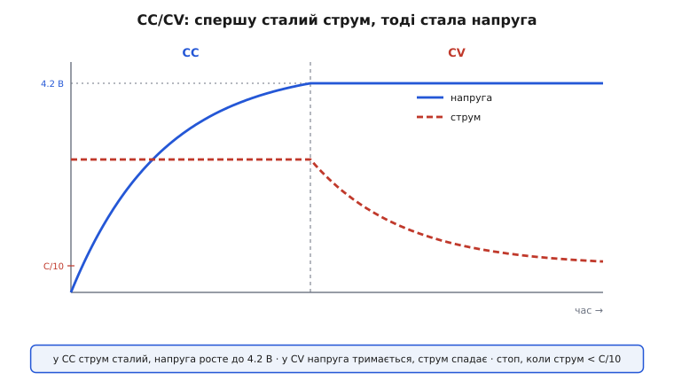
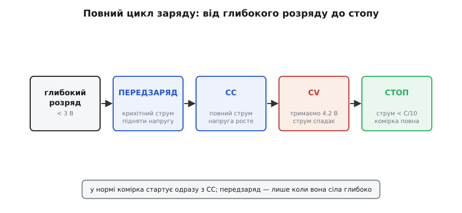
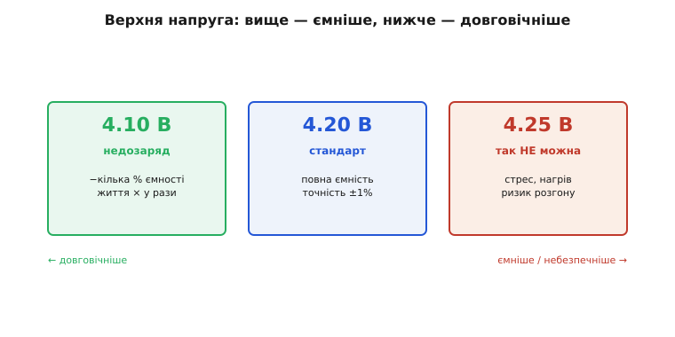
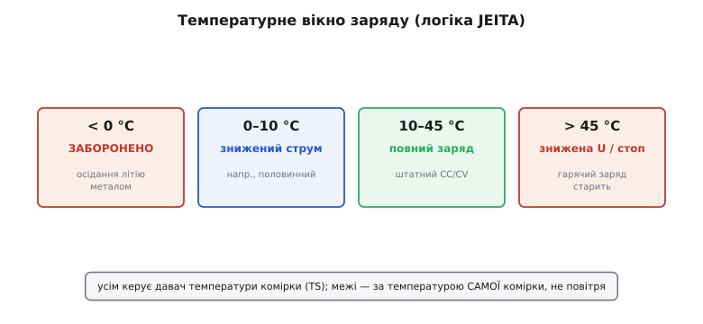
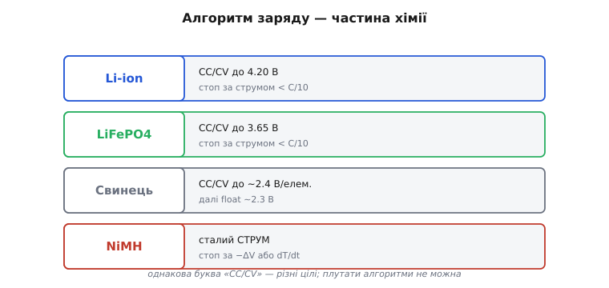
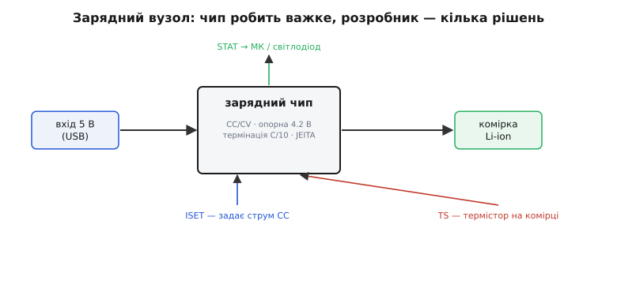

# Зарядка Li-ion

Розряд літієвої (від грец. *líthos* — камінь) батареї пробачає багато; **заряд** — майже нічого. Залити в літієву комірку забагато напруги, забагато струму чи зробити це на морозі — означає в кращому разі вбити ємність, у гіршому — влаштувати пожежу. Тому заряд літію — це не «під'єднати до 5 В», а точний алгоритм із жорсткими межами. Зарядний вузол доводиться не просто вмикати, а **проєктувати** й розуміти кожну його дію. Ставки високі: помилка коштує не «глюка», а зіпсованої батареї чи навіть пожежі, тож саме тут цінується розуміння механізму, а не копіювання навмання.

Канонічний алгоритм заряду літію зветься **CC/CV** (англ. *constant current / constant voltage* — сталий струм, потім стала напруга). За ним же, з варіаціями, заряджають і свинець; а от нікелеві хімії живуть за іншими правилами. Розгляньмо алгоритм по фазах, чому точність 4.2 вольта критична, чому літій **не доливають** нескінченно, як заряд залежить від температури — і складімо практичний зарядний вузол.

### CC/CV: дві фази одного заряду

Серце алгоритму — дві фази, що змінюють одна одну. Спершу **CC** (*constant current*): зарядник ллє в комірку **сталий струм**, а напруга на ній сама поволі росте в міру наповнення. Коли напруга дотягується до цільових 4.2 В, починається **CV** (*constant voltage*): тепер зарядник **тримає сталі 4.2 В**, а струм, навпаки, сам спадає, бо комірка вже майже повна й бере дедалі менше.


*У фазі CC струм сталий, а напруга (синя крива) сама росте до 4.2 В; у фазі CV напруга зафіксована на 4.2 В, а струм (червона крива) спадає. Більшість ємності входить саме у CC; CV доливає «хвіст». Коли струм у CV впав нижче ~C/10 — заряд зупиняють.*

Інтуїція проста, якщо думати про комірку як про посудину. У фазі CC її **наповнюють з постійним напором** — рівень (напруга) росте. Щойно рівень сягнув краю (4.2 В), лити далі з тим самим напором не можна — переллється (перезаряд). Тоді настає CV: **рівень тримають рівно по край**, а потік сам стихає, бо посудина майже повна. Аналогія з посудиною точна доти, доки йдеться про «скільки влізло»; вона мовчить про те, що повний літій ще й *псується* від тривалого тиску по край, — і саме звідси випливе заборона на нескінченний підзаряд. Цей поділ робить заряд безпечним: струм обмежений у CC (не спалити), напруга обмежена у CV (не перезарядити). Два прості обмеження замість одного складного контролю — та сама ідея, що в [керуванні перетворювачем зворотним зв'язком](root:hw-power/feedback-stability), тільки тут об'єкт — батарея.

За фразою «зарядник тримає струм чи напругу» стоїть звичайний [перетворювач напруги](root:hw-power/buck), лише керований по-особливому: його петля зворотного зв'язку в CC обмежує струм, а в CV — напругу. Реалізують його двояко. **Лінійний** зарядник — це по суті керований резистор: простий і дешевий, але всю різницю між входом і напругою комірки він розсіює теплом (з 5 В у комірку 3.7 В при струмі 1 А це понад ват — і чип помітно гріється). **Імпульсний** (англ. *switching*) зарядник ефективніший і холодніший, бо не палить надлишок, та складніший і дорожчий. Вибір між ними — той самий компроміс «просто проти ефективно», що й у звичайних перетворювачах.

> 🔧 **Навіщо це.** Коли вибираєте зарядний чип під свою плату, спершу прикиньте розсіювану потужність лінійного варіанта: P ≈ (Uвх − Uкомірки) × Iзаряду. Вийшло більше десь пів вата на дрібному корпусі — лінійний перегріється й сам зменшить струм, тож або зменшуйте Iзаряду, або беріть імпульсний. Ця проста оцінка економить переробку плати.

### Повний цикл і скільки це триває

До двох головних фаз додається ще одна, на початку, — **передзаряд** (англ. *precharge*; інша назва — *trickle*, краплинний). Якщо комірка розряджена **глибоко** (нижче ~3 В, а то й у нуль), лити в неї одразу повний струм небезпечно: пошкоджений літій може перегрітися. Тому зарядник спершу дає **крихітний** струм — звичайно близько десятої частки робочого, — щоб обережно підняти напругу до безпечної зони, і лише тоді переходить у нормальний CC.


*Повний цикл: глибоко сіла комірка → передзаряд малим струмом → CC повним струмом (напруга росте) → CV (4.2 В тримаються, струм спадає) → стоп, коли струм < C/10. У нормі комірка стартує одразу з CC; передзаряд — лише для глибоко розрядженої.*

Скільки ж це все триває? Тут є важлива несподіванка: фази дуже **нерівні** за часом.

**Приклад (час заряду комірки 2000 мА·год).** Заряджаємо струмом 0.5C, тобто 1.0 А.

```
Фаза CC (струм 1.0 А, поки напруга не дійде 4.2 В):
   входить ~70% ємності ≈ 0.7 × 2000 = 1400 мА·год
   час ≈ 1400 / 1000 ≈ 1.4 год

Фаза CV (тримаємо 4.2 В, струм спадає від 1.0 А до C/10 = 0.2 А):
   доливає решту ~30%, але ПОВІЛЬНО → ще ~0.7–1.0 год

Разом до «повної»:  ~2.3–2.4 год
   …хоча перші 70% було вже за 1.4 год

На холоді (0–10 °C) струм CC ріжуть удвічі (0.5 А) → фаза CC ~2.8 год.
```

Висновок промовистий: **CC — швидка й продуктивна**, а «хвіст» CV — повільний і дає мало. Саме тому «швидка зарядка до 80%» — це переважно фаза CC, яку обривають, не чекаючи на хвіст; а останні відсотки до справжніх 100% коштують непропорційно багато часу. І відразу видно, як температура втручається: знижений на холоді струм прямо подовжує заряд (а нижче 0 °C його взагалі не починають).

Який же струм CC брати? Це окремий компроміс. Більший струм (ближче до 1C і вище) заряджає швидше, але дужче гріє комірку й помітніше скорочує її ресурс; менший (0.2–0.5C) лагідніший і до батареї, і до тепла, та повільніший. Для більшості embedded-пристроїв розумний вибір — десь **0.5C**: удвічі повільніше за «годинний» заряд, зате відчутно довше живе батарея. Гнатися за максимальним струмом «бо швидше» — поширена помилка: для пристрою, що заряджається вночі, зайва швидкість нічого не дає, а ресурс відбирає.

### Точність 4.2 В: ємність проти життя

Чому в усьому алгоритмі так наполягають на **точному** значенні напруги CV? Бо літій тут разюче чутливий: десяті частки вольта вирішують долю комірки.


*Зарядити до 4.25 В — це стрес, нагрів і ризик (так не можна); 4.20 В — стандарт, повна ємність, але вимагає точності ±1%; 4.10 В — кілька відсотків ємності втрачено, зате життя комірки в рази довше. Вище — ємніше, але небезпечніше й коротше; нижче — довговічніше.*

Картина така. Перевищити — скажімо, зарядити до **4.25 В** — означає загнати в комірку забагато: вона гріється, всередині йдуть небажані реакції, ресурс падає, а ризик теплового розгону зростає. Тому **4.25 В — це «не можна»**, і саме тому опорна напруга зарядника має бути точна в межах десь **±1%**: дешевий неточний зарядник, що замість 4.20 дає 4.30, поволі вбиває батарею. А в інший бік точність грає на користь: зарядивши свідомо **менше** — до 4.10 чи навіть 4.0 В — втрачаємо кілька відсотків ємності, але подовжуємо життя комірки **в рази**. Тому навмисний недозаряд — не помилка, а **легальний інженерний прийом** для пристроїв, де довговічність важливіша за останні відсотки заряду, бо нижча верхня напруга прямо сповільнює [старіння комірки](root:hw-power/battery-aging). Та сама жорсткість діє й знизу: розряджати типову літієву комірку нижче приблизно **3.0 В не можна** — глибокий розряд її теж псує, тож робоче вікно затиснуте між цими двома межами. Заряд літію — це балансування на вольтах між «ємніше» і «довше».

> 🔧 **Навіщо це.** Цифра ±1% — це прямий критерій вибору зарядного чипа. У даташиті шукайте точність опорної напруги (charge voltage accuracy): ±1% — добре, ±2% — уже на межі, бо верхня точка може поповзти до 4.28 В. Якщо проєктуєте на довговічність (носимий пристрій, давач на роки), свідомо беріть чип із цільовою 4.1 В або з програмованою напругою — це найдешевший спосіб у рази продовжити ресурс батареї.

Окремо ускладнюється все, коли комірок **кілька послідовно** (2S, 3S і більше). Тоді 4.2 В має дістати **кожна** комірка окремо, а не лише пакет загалом: якщо стежити тільки за сумарною напругою, одна слабша комірка легко перезарядиться, поки сусіди ще не повні. Тому багатокоміркові батареї **балансують** — вирівнюють заряд комірок, зливаючи надлишок із тих, що вже повні (пасивно), або переливаючи його (активно). Стежить за цим окрема [система керування батареєю (BMS)](root:hw-power/bms). Для одинарної комірки (1S) цього клопоту нема — і саме тому 1S такий популярний у простих пристроях.

### Термінація: чому літій не «доливають»

Є фундаментальна різниця між літієм і старими хіміями, на якій легко обпектися. Свинець і нікель-кадмій можна тримати на **підзаряді** (англ. *trickle* — краплинний, *float* — плавання) — підливати малий струм нескінченно, компенсуючи саморозряд. З **літієм так не можна**.

Літій заряджають до повного — і **зупиняють**. Момент зупинки (термінація) визначають за струмом: коли у фазі CV він, спадаючи, падає нижче приблизно **C/10** (десятої частки ємності за годину), комірку вважають повною й заряд **вимикають**. Далі її не підживлюють: тримати повністю заряджений літій під постійною напругою — означає прискорювати його старіння, а підливати струм у вже повну комірку небезпечно. Якщо ж напруга з часом сама просіла (від саморозряду), зарядник просто **перезапускає** цикл наново, а не «доливає» потихеньку. Ця відмінність — одна з найчастіших пасток для тих, хто переносить звички зі свинцевих чи нікелевих систем на літій: те, що рятувало там, тут шкодить.

З тієї ж причини окремо стоїть **зберігання**. Якщо пристрій надовго лягає «на полицю», тримати його батарею зарядженою на повні 100% — чи не найгірше, що можна зробити: повний літій старіє найшвидше, надто в теплі. Тому для тривалого зберігання його лишають зарядженим **приблизно наполовину** — десь до 3.7–3.8 В на комірку, — і це помітно подовжує життя. Деякі розумні зарядники й самі вміють виставляти такий «зберігаючий» рівень замість повного, коли пристроєм довго не користуються.

### Температурні межі

Заряд має **вузьке** температурне вікно — значно вужче, ніж дозволяє [хімія самої комірки](root:embedded/battery-chemistries) на розряді. І зарядний вузол зобов'язаний це вікно стерегти, бо саме на заряді холод і спека найнебезпечніші.


*Типова температурна логіка (її формалізують настанови JEITA): нижче 0 °C — заряд заборонено; 0–10 °C — зниженим струмом (скажімо, половинним); 10–45 °C — повний заряд; вище ~45 °C — знижена напруга або стоп. Усім керує давач температури комірки (TS).*

Правил тут кілька, і всі — за температурою **самої комірки**, яку міряє термістор. Нижче **0 °C заряджати не можна взагалі**: на холоді [літій осідає на аноді металом](root:embedded/battery-chemistries) — незворотно. У холодній зоні над нулем (приблизно 0–10 °C) заряд ведуть **зниженим струмом** — саме він і подовжує час заряду на морозі. У **спеці** (вище ~45 °C) або знижують напругу CV, або зупиняють заряд узагалі, бо гарячий заряд різко старить комірку. Цю логіку «струм і напруга залежно від температури» галузь звела в настанови **JEITA** (англ. *Japan Electronics and Information Technology Industries Association* — японське об'єднання виробників електроніки, що їх видало), і добрий зарядний чип реалізує її сам — за давачем температури TS (від англ. *temperature sense*) на виводі зарядної мікросхеми. Для розробника висновок простий: **термістор на батареї — не опція, а частина безпеки**.

Тут є й тонкість розміщення: щоб давач казав правду, його тулять **до самої комірки**, а не абикуди на платі, — інакше він міряє температуру повітря чи сусіднього чипа, а не літію. І ще: комірка під час заряду трохи **гріється сама**, тож той самий термістор заодно ловить ненормальний перегрів (ознаку біди) — ще одна причина тримати його в щільному тепловому контакті з батареєю, а не «десь поруч».

> 🔧 **Навіщо це.** Термістор — найдешевша й найчастіше зекономлена деталь зарядного вузла, і саме на ній не можна заощаджувати. Якщо вивід TS чипа лишити «висіти» (підтягнутим у середину діапазону), заряд піде завжди й за будь-якої температури — пристрій працюватиме на стенді й одного разу спалахне в кишені на морозі. Закладайте термістор на сам корпус комірки ще в схемі, а не «потім допаяємо».

### Кожна хімія по-своєму

CC/CV із його 4.2 вольта — це алгоритм саме для літій-іонної хімії, і варто чітко усвідомити головне: **алгоритм заряду — частина хімії**, переносити його з однієї на іншу не можна.


*Li-ion заряджають CC/CV до 4.20 В і зупиняють за струмом (< C/10). LiFePO4 — так само CC/CV, але до 3.65 В. Свинець — CC/CV до ~2.4 В на елемент, а тоді переходять на підзаряд (float) ~2.3 В. NiMH — навпаки: ллють сталий струм і ловлять кінець за крихітним спадом напруги (−ΔV) чи зростанням температури (dT/dt).*

Відмінності принципові. **LiFePO4** — той самий CC/CV, але цільова напруга інша, **3.65 В**, і зарядити його «методом Li-ion» на 4.2 — це грубий перезаряд. **Свинець** теж CC/CV, але після заповнення переходить у **плавання** (float) — той самий підзаряд, якого літій не терпить. А **NiMH** живе зовсім інакше: його заряджають **сталим струмом** і ловлять момент повноти не за напругою-стелею, а за тонкими ознаками — крихітним **спадом** напруги наприкінці (−ΔV) або стрибком температури (dT/dt). Тобто там, де літій тримають по напрузі й зупиняють за струмом, NiMH тримають по струму й зупиняють за напругою — дзеркально. Сплутати ці алгоритми — це не «трохи неоптимально», а псування батареї, а з літієм — і пряма небезпека.

### Зарядний вузол на практиці

Час зібрати все в реальний **зарядний вузол**. Хороша новина: розробнику рідко доводиться будувати CC/CV-логіку з нуля — її вже містить готовий зарядний чип.


*Вхід (5 В з USB) → зарядний чип → комірка. Розробник задає лише струм CC (резистором ISET) і покладається на точну вбудовану опорну 4.2 В та термінацію на C/10. Давач TS на комірці блокує заряд поза температурним вікном. Сигнал STAT повідомляє мікроконтролеру чи світлодіоду стан: заряджається / готово.*

На практиці робота зводиться до кількох рішень. Вибрати **струм CC** під ємність комірки (типово 0.5–1C, менше — лагідніше до батареї) і задати його одним резистором ISET. Покластися на чип у тому, що він точно тримає **4.2 В** і правильно **термінує** на C/10. Повісити **термістор TS** на комірку, щоб заряд блокувався поза вікном (а часом — щоб струм знижувався на холоді автоматично). І завести **STAT** у мікроконтролер чи на світлодіод, щоб знати стан. Усе важке — таймінги фаз, опорна напруга, логіка JEITA — лишається всередині чипа. Як це виглядає на рівні конкретних ніжок і номіналів, добре видно на масовому зарядному чипі [TP4056](root:cat-hw-power/tp4056): струм там задається одним резистором, термістор вішається на окремий вивід, а статус читається з відкритого стоку.

Сигнал STAT здебільшого реалізують **відкритим стоком**: чип просто притягує лінію до землі, поки заряд триває, і відпускає її, коли комірка готова. Прочитати його з мікроконтролера — кілька рядків прошивки.

**Приклад (читання STAT на C, вивід із підтяжкою вгору).** Лінія активна-низька: 0 — заряд триває, 1 — заряд завершено або не йде.

```c
// STAT від зарядного чипа заведено на вхід МК із внутрішньою підтяжкою вгору.
#define PIN_STAT  4          // номер виводу мікроконтролера

bool charging_active(void) {
    // відкритий стік притягує лінію до 0, поки йде заряд → інвертуємо
    return gpio_read(PIN_STAT) == 0;
}

void update_led(void) {
    if (charging_active())
        led_on();            // світиться, поки заряджається
    else
        led_off();           // погасло → готово (або заряд не йде)
}
```

Висновок: одна цифрова лінія дає індикацію «заряджається / готово» практично задарма — без жодного знання про фази всередині чипа.

Один практичний нюанс вибору вузла — **тепло**. Найпоширеніші дешеві зарядні чипи лінійні, і на великому струмі вони відчутно гріються: різниця між входом і напругою комірки, помножена на струм заряду, цілком дає понад ват на дрібному корпусі. Тому або обмежують струм заряду, щоб чип не перегрівся, або дбають про тепловідвід — полігон міді під корпусом, — або беруть імпульсний зарядник там, де струми великі. Усе це варто прикинути ще до розведення плати: перегрітий лінійний зарядник зазвичай сам ріже струм, тож «номінальний» заряд на гарячій тісній платі легко виявиться вдвічі повільнішим, ніж обіцяє даташит.

### Підсумок теми

Заряд літію — точний алгоритм **CC/CV**: спершу сталий струм (напруга росте, входить більшість ємності), тоді стала напруга 4.2 В (струм сам спадає). Глибоко сіла комірка спершу проходить обережний **передзаряд**. Фаза CC швидка, «хвіст» CV повільний — тому «80% швидко» це CC, а повні 100% коштують довгого хвоста. Точність **4.2 В критична** (±1%): 4.25 небезпечні, а навмисний недозаряд до 4.1 в рази подовжує життя ціною кількох відсотків ємності. Літій **термінують** за струмом (< C/10) і **не доливають** нескінченно, на відміну від свинцю й нікелю. Заряд має **вузьке температурне вікно** (нижче 0 °C — зась; на холоді менший струм, у спеку менша напруга — логіка JEITA за давачем TS). І головне: **алгоритм заряду — частина хімії** (LiFePO4 до 3.65, свинець із float, NiMH за −ΔV), плутати їх не можна. На практиці все це робить готовий зарядний чип, а розробник задає струм, вішає термістор і читає статус. А заряджена комірка одразу ставить дзеркальне питання — [скільки в ній лишилось заряду](root:hw-power/state-of-charge) і як це чесно виміряти, коли напруга «бреше».
