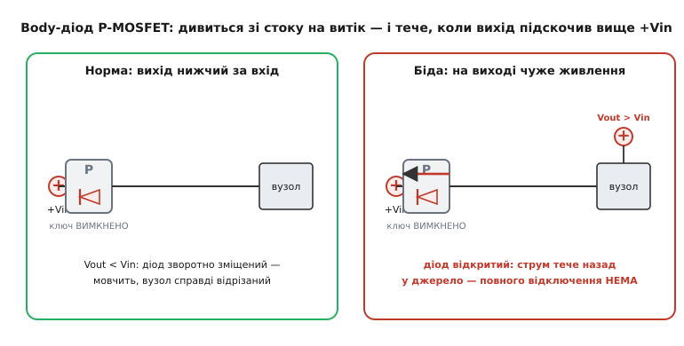
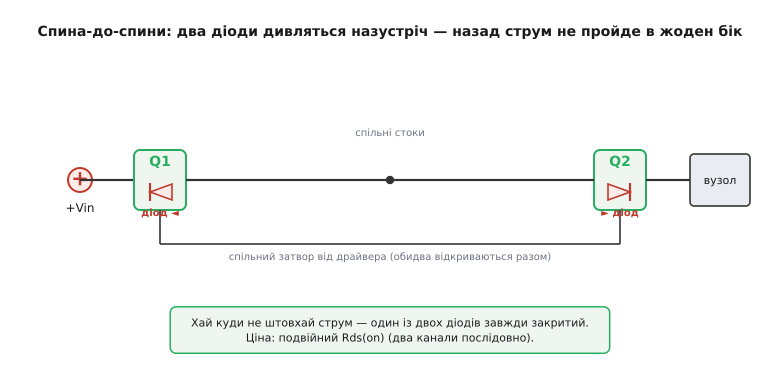

# 🔌 Body-діод у ключі навантаження: чому «вимкнений» ключ усе одно тече назад

Збираєш ключ живлення, гасиш його — а навантаження не зникає з шини, мультиметр уперто показує напругу на виході. Або ще гірше: вузол, який мав би спати знеструмлений, оживає від сусіда по платі. Винуватець майже завжди один — **вбудований діод** усередині силового MOSFET. Він є в кожному польовому транзисторі, його не можна «не поставити», і поки про нього не знаєш, він зриває саму ідею ключа — повністю розірвати живлення.

### Звідки в транзисторі взявся діод, якого ніхто не малював

MOSFET роблять на пластині кремнію одного типу провідності — це **тіло** (body, або підкладка). У P-канального ключа тіло — це n-кремній, а витік і стік — острівці p-кремнію в ньому. Кожен такий перехід p-в-n — це pn-перехід, тобто **діод** за побудовою. Виходить аж два паразитні діоди: тіло↔витік і тіло↔стік.

Лишити тіло «висіти» не можна. Між витоком, тілом і стоком тоді утворився б паразитний біполярний транзистор (емітер–база–колектор), який за стрибка напруги може раптом відкритися й пустити некерований струм — це зветься **засувка** (англ. *latch-up*), і вона вбиває чип. Щоб такого не сталося, виробник прямо на кристалі **накоротко з'єднує тіло з витоком**. Базу паразитного біполярника тим самим прибито до його ж емітера — відкритися він уже не може.

Та в цього з'єднання є наслідок. Перехід тіло↔витік закорочено, він мовчить. А перехід **тіло↔стік лишається живим діодом** — і оскільки тіло тепер сидить на витоку, цей діод увімкнений **між стоком і витоком**. Це і є **body-діод** (body diode, або internal/parasitic diode — паразитний). Він не дефект і не вада конкретної моделі: це неуникний побічний продукт того, як узагалі влаштований MOSFET. Він є геть у кожного.

Куди він «дивиться» — диктує тип каналу:

```
N-MOSFET:  тіло (p) на витоку → діод   анод=витік,  катод=стік   (пускає S → D)
P-MOSFET:  тіло (n) на витоку → діод   катод=витік, анод=стік    (пускає D → S)
```

> 🔧 **Навіщо це.** На умовному позначенні MOSFET ця стрілочка-діод між витоком і стоком — не прикраса й не «для повноти». Це реальний компонент, який працюватиме у вашій схемі, хочете ви того чи ні. Перше, що варто зробити з будь-яким силовим ключем: подумки знайти body-діод і спитати — а коли він відкриється?

### Чому це ламає ключ навантаження

Високобічний ключ на [P-MOSFET](root:hw-components/nmos-pmos) ставлять витоком на +Vin, стоком — на навантаження. Body-діод там, як щойно з'ясували, дивиться **анодом на стік (бік навантаження), катодом на витік (бік +Vin)**. Тобто він готовий пустити струм у напрямку **навантаження → джерело**, щойно стане прямо зміщеним.

А прямо зміщеним він стане, коли напруга на виході (на стоці) підніметься вище за +Vin приблизно на 0.5–0.7 В. І ось тут починаються проблеми, бо вузол сам керує затвором, **а діода затвор не стосується зовсім**: відкритий канал чи закритий — діод живе своїм життям.


*Зліва — норма: вихід нижчий за вхід, діод зворотно зміщений, мовчить, вузол справді відрізаний. Справа — на виході з'явилося чуже живлення (Vout > Vin): body-діод відкривається й жене струм назад у джерело крізь «вимкнений» ключ. Канал закритий, а струм усе одно тече.*

Коли таке буває насправді:

- **Немає повного відключення.** Ви гасите ключ, аби зняти живлення з вузла, — а на його вході висить заряджений конденсатор чи буферна ємність, що розряджається повільніше за решту шини. На мить вихід опиняється вище входу, body-діод відкривається, і вузол живиться «сам із себе» крізь діод, поки кондер не стече. Засинання вузла гальмується, струм спокою не падає до нуля.
- **Зворотне живлення (back-powering).** До виходу під'єднане ще одне джерело — друга шина, USB, акумулятор, навіть сигнальна лінія з сильною підтяжкою. Воно піднімає вихід вище +Vin, і струм через body-діод **тече назад у вашу шину +Vin**. Так живлення «протікає» туди, звідки його зняли: запитується пів плати, регулятор, який мав би спати, оживає від чужого боку.
- **Індуктивний кидок.** Якщо за ключем котушка чи довгий провід, у мить вимкнення індуктивність шарпає напругу — і body-діод приймає цей викид на себе (тут, до речі, він рятує, бо інакше викид пробив би канал).

Суть проста: **один MOSFET — ключ лише в один бік.** У бік, куди дивиться body-діод, він не вимикач, а діод. Закрити канал — не означає розірвати коло.

### Орієнтація транзистора: куди повернути діод

Перше, що можна зробити, — це свідомо обрати, **в який бік дивитиметься діод**, тобто яким кінцем поставити транзистор. Body-діод завжди готовий пустити струм у «свій» бік; отже, транзистор орієнтують так, щоб **його непрохідний для діода бік дивився туди, звідки можливе небажане живлення**.

У звичайному високобічному ключі вузол очікувано живиться **з боку +Vin у бік навантаження** — саме туди body-діод P-MOSFET і не пускає (він зворотно зміщений, поки Vin > Vout). Це правильна, природна орієнтація: коли на виході нічого чужого немає, діод мовчить, і ключ працює як належить. Проблема виникає лише тоді, коли на виході **з'являється вища напруга**.

Тож якщо у вашій схемі небажане живлення може прийти **тільки з одного боку**, часом досить просто **розвернути** один транзистор так, щоб глухий для діода бік стояв проти цього джерела. Але якщо напруга може стрибнути вище з **будь-якого** боку (типово для зарядних кіл, гарячої заміни, з'єднання двох живлених шин) — одним транзистором не обійтися: хоч як його поверни, у якийсь бік діод тектиме. Тоді ставлять **два**.

### Два MOSFET спина-до-спини

Ідея елегантна: візьмемо два транзистори й з'єднаємо їх так, щоб **їхні body-діоди дивилися назустріч один одному**. Тоді хоч куди штовхай струм — один із двох діодів завжди стоятиме поперек і закриватиме шлях. Це і є з'єднання **спина-до-спини** (back-to-back).

Найпоширеніше виконання — **спільні витоки** (common-source): два транзистори з'єднують стоками назовні, а витоки зводять у спільну точку (для P-каналу — навпаки, зводять стоки; головне, що body-діоди опиняються «носами» назустріч). Затвори керуються разом, від одного драйвера, тож обидва канали відкриваються й закриваються синхронно, ніби це один ключ.


*Два транзистори зі спільними стоками й спільним затвором. Body-діод Q1 дивиться вліво, Q2 — вправо: куди не прикладай зворотну напругу, один із них замкне шлях. Коли ключ увімкнено, струм іде крізь обидва відкриті канали (діоди при цьому ні до чого). Ціна — подвійний Rds(on): два канали послідовно.*

Простежмо, чому це працює в обидва боки. Прямий струм (вхід → навантаження): обидва канали відкриті, струм тече крізь них, падіння — на двох Rds(on). Спроба зворотного струму (вихід вище входу, ключ вимкнено): з боку виходу body-діод свого транзистора **готовий** пропустити, але другий транзистор поставлено дзеркально — його body-діод дивиться проти цього струму й **закритий**. Канали обидва зачинені, єдиний можливий шлях — крізь обидва діоди послідовно, а вони ввімкнені зустрічно, тож один завжди гальмує. Назад — глухо.

Ціна рішення видно одразу: **два канали послідовно — це подвійний опір у відкритому стані**. Якщо один транзистор мав Rds(on) = 20 мОм, пара дасть 40 мОм, удвічі більший нагрів і падіння під струмом. Тому для сильнострумових ключів беруть транзистори з удвічі меншим запасом по опору, ніж дали б на один.

### Готові мікросхеми: «reverse current blocking»

Розвертати й здвоювати транзистори вручну доводиться нечасто, бо виробники давно спакували два FET-и спина-до-спини в одну мікросхему-**ключ навантаження** (load switch) і вивели це окремою рисою в даташиті — **reverse current blocking** (RCB, блокування зворотного струму). Усередині — рівно та сама пара назустріч плюс драйвер і захисти.

Тут варто розрізняти два формулювання, бо вони означають різне:

- **Reverse current blocking** — блокує зворотний струм, **лише коли ключ вимкнено**. Поки ключ відкритий, body-діоди ні до чого, але зворотний струм пройде крізь відкриті канали вільно.
- **True reverse current blocking** (істинне) — блокує струм з виходу на вхід завжди, коли Vout > Vin, **байдуже, увімкнений ключ чи ні**; мікросхема активно стежить за напругами й розриває шлях.

З конкретних прикладів: TI **TPS22990** (10 А, Rds(on) ≈ 3.9 мОм) зворотний струм **не** блокує — у його даташиті прямо сказано, що струм із OUT на IN піде крізь body-діод; щоб дістати блокування, виробник радить або поставити **два TPS22990 послідовно**, або взяти **TPS22953**, у якого RCB уже всередині й не потрібне окреме зміщення VBIAS. Diodes Inc. **AP22913** заявляє саме *true* reverse current blocking з керуванням швидкістю наростання. Принцип усередині всіх — ті самі два транзистори назустріч; різниця лише в тому, чи додано логіку, що тримає блокування й у відкритому стані.

> 🔧 **Навіщо це.** Слово «reverse current blocking» у даташиті ключа навантаження — це й є вбудована пара спина-до-спини. Якщо її немає (як у TPS22990), вважайте, що **вимкнений ключ — це діод**, і вузол не відрізаний від виходу. Шукаєте справжнє відключення за будь-яких умов — беріть рядок *true* RCB; досить розриву лише у вимкненому стані — звичайного RCB.

### Числовий приклад: коли діод відкриється і скільки протече

**Умова.** Високобічний P-MOS-ключ живить вузол від Vin = 3.3 В. На вихід (на стік) під'єднано буферний конденсатор Cвих = 220 мкФ. Сусідня шина через несправність підняла вихід до 5 В. Ключ вимкнено. Чи відкриється body-діод, який струм потече назад у шину 3.3 В і скільки це триватиме, поки кондер не зрівняється? Body-діод P-MOSFET: Vf ≈ 0.6 В, у відкритому стані поводиться приблизно як 0.6 В + опір ~0.3 Ом.

```
Чи відкриється діод:
  Vout − Vin = 5.0 − 3.3 = 1.7 В   > Vf ≈ 0.6 В   → ТАК, діод відкритий

Піковий зворотний струм (відразу, поки Vout ще 5 В):
  на діоді падає Vf, решта — на його внутрішньому опорі Rd
  I_зв = (Vout − Vin − Vf) / Rd
       = (5.0 − 3.3 − 0.6) / 0.3
       = 1.1 / 0.3  ≈ 3.7 А      ← короткий кидок назад у шину 3.3 В

Скільки заряду піде назад, поки Vout не впаде з 5 В до ~3.9 В
(діод закриється, коли Vout − Vin < Vf, тобто Vout ≈ 3.9 В):
  ΔV = 5.0 − 3.9 = 1.1 В
  Q = Cвих · ΔV = 220·10⁻⁶ · 1.1 ≈ 0.24 мКл
```

**Висновок.** «Вимкнений» ключ кинув майже 4 А назад у шину 3.3 В — досить, щоб підняти її напругу, збити сусідні вузли або перевантажити регулятор, який мав би спати. І це не короткий збій: поки на виході тримається 5 В, діод тектиме постійно. Один транзистор тут безсилий; рятує лише пара спина-до-спини або ключ із позначкою true RCB.

### Як це згадати у прошивці

Програмно body-діод «не вимикається» — про нього дбають схемою. Але код мусить **знати**, що вимкнений ключ ще не гарантує знеструмленого виходу, і не покладатися на «вимкнув — значить, нуль». Перед тим як, скажімо, чіпати спільну з вузлом лінію, корисно перевірити, що вихід справді просів.

Потрібне для цього є на **будь-якому МК**: один цифровий вихід на керування затвором, пауза на стікання ємності й один вхід АЦП на дільнику з виходу ключа. Різняться лише назви функцій у конкретному середовищі:

:::tabs
```arduino
// Гасимо ключ навантаження і ПЕРЕКОНУЄМОСЯ, що вихід зник.
// Якщо на виході чуже живлення, body-діод тримає напругу — і ми це побачимо.
digitalWrite(LOAD_EN, LOW);          // закрили канал ключа
delay(10);                            // даємо ємності стекти

int raw = analogRead(VOUT_SENSE);            // дільник із виходу ключа
int mv  = (int)((long)raw * 5000L / 1023L);  // АЦП 10 біт, опора 5 В
if (mv > VOUT_OFF_THRESHOLD_MV) {
    // канал закритий, а напруга лишилась → тече крізь body-діод (зворотне живлення)
    // повне відключення тут потребує ключа з reverse current blocking
    Serial.print(F("vyhid ne znyksya, mV: "));
    Serial.println(mv);
}
```
```esp-idf
// Те саме на ESP-IDF: затвор — через driver/gpio.h, вихід — через oneshot-АЦП.
#include "driver/gpio.h"
#include "esp_adc/adc_oneshot.h"
#include "esp_adc/adc_cali.h"
#include "esp_log.h"
#include "freertos/FreeRTOS.h"
#include "freertos/task.h"

gpio_set_level(LOAD_EN, 0);                  // закрили канал ключа
vTaskDelay(pdMS_TO_TICKS(10));               // даємо ємності стекти

int raw = 0, mv = 0;                         // adc/cali — заведені при ініціалізації
ESP_ERROR_CHECK(adc_oneshot_read(adc, VOUT_SENSE_CH, &raw));
ESP_ERROR_CHECK(adc_cali_raw_to_voltage(cali, raw, &mv));
if (mv > VOUT_OFF_THRESHOLD_MV) {
    // канал закритий, а напруга лишилась → тече крізь body-діод (зворотне живлення)
    // повне відключення тут потребує ключа з reverse current blocking
    ESP_LOGW(TAG, "vyhid ne znyksya: %d mV — mozhlyve zhyvlennya kriz body-diod", mv);
}
```
```stm32
// Те саме на STM32 HAL: затвор — HAL_GPIO_WritePin, вихід — вбудований АЦП.
HAL_GPIO_WritePin(LOAD_EN_GPIO_Port, LOAD_EN_Pin, GPIO_PIN_RESET);  // закрили канал
HAL_Delay(10);                                                      // ємності стекти

uint32_t raw = 0;
HAL_ADC_Start(&hadc1);
if (HAL_ADC_PollForConversion(&hadc1, 10) == HAL_OK) raw = HAL_ADC_GetValue(&hadc1);
HAL_ADC_Stop(&hadc1);

uint32_t mv = raw * 3300u / 4095u;           // АЦП 12 біт, опора 3.3 В
if (mv > VOUT_OFF_THRESHOLD_MV) {
    // канал закритий, а напруга лишилась → тече крізь body-діод (зворотне живлення)
    // повне відключення тут потребує ключа з reverse current blocking
    reverse_feed_detected = 1;               // прапорець для верхнього рівня
}
```
:::

Жодних магічних слів у коді проти діода немає — є лише чесна перевірка факту. Якщо вузол мусить бути **гарантовано** відрізаний (вимірювання витоку, безпека, обмін шини між двома живленнями), то правильна відповідь не в прошивці, а в залізі: два транзистори спина-до-спини або готовий ключ навантаження з рядком *reverse current blocking*.
