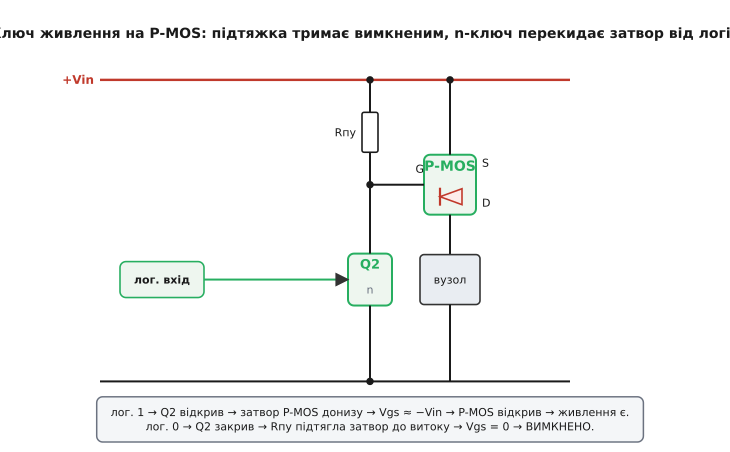
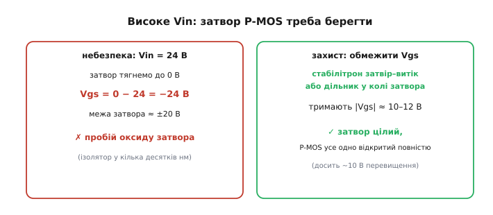

# 🔌 Load switch

**Load switch** (англ. *load* — «навантаження», *switch* — «вимикач»; українською — **ключ живлення**) — це електронний вимикач, що ставлять у провід живлення цілого вузла й керують ним з логіки: подав сигнал — вузол отримав живлення, зняв — вузол повністю знеструмлений. Не приглушений, а саме знеструмлений, до нуля по струму. Розберемо, навіщо це треба, чому верхнє плече дістається P-канальному транзистору й що мусить бути в схемі, щоб ключ не спалив сам себе на старті.

### Навіщо рубати живлення цілком

Часто треба не просто «замовкнути», а **повністю** вимкнути підсистему — зняти з неї живлення, щоб вона не їла струм у сні. «Сплячий» режим самого чипа економить мікроампери, а датчик, радіомодуль чи підсвітка поряд із ним і в сні тягнуть міліампери через свої підтяжки, витоки регуляторів і просто струм спокою (англ. *quiescent current* — струм, що тече, коли від вузла нічого не вимагають). Для пристрою, що мусить рік прожити на батарейці, ці міліампери — вирок. Єдиний спосіб звести їх до нуля — фізично розірвати провід живлення.

Питання лише — **який** провід рвати. Живлення приходить двома проводами: «плюс» (+Vin) і «земля» (GND). Розрив будь-якого з них знеструмить навантаження. Та рвати землю незручно: на ній зав'язані опорні потенціали, екрани, спільні точки кількох вузлів — піднявши «землю» одного блока над нулем, ми зсунемо всі його сигнали відносно сусідів і отримаємо паразитні струми по сигнальних лініях. Тому ключ ставлять у плюсовий провід — це **верхнє плече** (англ. *high-side* — «з боку плюса»). На верхньому плечі природний вибір — [P-MOSFET](root:hw-components/nmos-pmos): його витік сидить на «плюсі», а відкривається він, тільки-но затвор стягнути нижче за витік.

### Чому саме P-канал зверху, а не N

Це не випадковість і не звичка — це наслідок того, **як влаштований канал** польового транзистора, тож варто розібрати від першопричини.

MOSFET відкривається напругою затвор–витік Vgs: коли |Vgs| перевищує поріг Vth, під затвором у кремнії з'являється провідний канал. Ключове слово тут — **витік**: поріг відлічується саме від витоку, бо канал формується між витоком і стоком, а керує ним поле відносно того кінця, звідки в канал заходять основні носії. Для N-каналу носії — електрони, тож відкриває його **позитивна** Vgs (затвор вище витоку на +Vth і більше); для P-каналу носії — дірки, і відкриває його **негативна** Vgs (затвор нижче витоку).

Тепер прикладемо це до верхнього плеча. На верхньому плечі один кінець транзистора прибитий до +Vin, а інший — до навантаження, потенціал якого «плаває». Спробуймо поставити туди **N-MOS**. Щоб струм тік, його витоком стане той кінець, що ближче до землі, тобто **вихід на навантаження**. А вихід, коли ключ відкритий, підтягується майже до +Vin. Виходить, щоб тримати N-MOS відкритим, затвор мусить стояти на Vgs вище за витік — тобто **вище за +Vin** на кілька вольт. А де взяти напругу вищу за саме живлення? Її доводиться спеціально «надкачувати» зарядовою помпою або бутстреп-конденсатором — окремий вузол, який ще й мусить безперервно перемикатися, щоб тримати заряд. Для постійно ввімкненого ключа це абсурдно складно.

P-MOS перевертає задачу з ніг на голову. Його витік ставлять на +Vin — на найвищий потенціал у схемі, що нікуди не «плаває». Відкривають його негативною Vgs, тобто затвором **нижче** за витік. А «нижче за +Vin» — це будь-який потенціал аж до землі, який у схемі вже є під рукою. Не треба нічого надкачувати: достатньо просто **стягнути затвор до GND**. Ось чому верхнє плече — вотчина P-каналу: його логіка керування «дивиться вниз», у бік потенціалів, що завжди доступні, тоді як N-MOS на верхньому плечі змусив би «дивитися вгору», за межу живлення.

> 🔧 **Навіщо це.** Це правило врятує години відлагодження. Побачили на схемі ключ у плюсовому проводі без зарядової помпи — там майже напевно P-MOS, і відкривають його стягуванням затвора донизу. N-MOS зверху без помпи просто не відкриється повністю: канал ледь привідкриється, транзистор грітиметься як резистор і згорить. На нижньому плечі (у землі) усе дзеркально — там панує N-MOS, бо його витік уже сидить на GND і затвору досить логічних 3.3 В.

### Схема: P-MOS, підтяжка і маленький n-ключ


*P-MOS витоком на +Vin, стоком на навантаження. Підтяжка Rпу тримає затвор біля витоку: у спокої Vgs = 0, ключ вимкнено — безпечний стан за умовчанням. Маленький n-ключ Q2 стягує затвор до землі, Vgs ≈ −Vin, і P-MOS повністю відкритий. Самим Q2 керує логіка.*

Чому не обійтися без помічника Q2? Бо логіка сама не дотягнеться: щоб відкрити P-MOS, затвор треба опустити майже до нуля, поки витік стоїть на +Vin, — а ніжка мікроконтролера дає лише 0…3.3 В. Якби ми завели GPIO просто на затвор, то у стані «вмкнено» (GPIO = 0 В) Vgs = 0 − Vin = −Vin — добре, відкрило б. Але у стані «вимкнено» (GPIO = 3.3 В) при Vin = 5 В вийшло б Vgs = 3.3 − 5 = −1.7 В — а це за модулем може бути більше за поріг, і ключ **не закриється повністю**. А якщо Vin = 12 В, то GPIO взагалі не витримає: ніжка з'єднається з +12 В через відкритий канал і згорить. Тому між логікою і затвором ставлять **зсув рівня** (англ. *level shift* — перенесення сигналу з одного діапазону напруг у інший) — маленький n-ключ Q2: логіка вмикає його, а він уже стягує високовольтний затвор до землі. Це той самий прийом, що з [верхнім PNP у біполярних](root:hw-components/bjt-switch/comp-high-side-pnp.md), лише на польових. Тут є важлива **інверсія**: логічна 1 відкриває Q2, а той відкриває P-MOS.

### Як вибрати підтяжку Rпу

Підтяжка Rпу стоїть між затвором P-MOS і витоком (+Vin) і робить дві речі одночасно, тому її номінал — компроміс між ними.

По-перше, вона **закриває ключ за умовчанням**: коли Q2 вимкнений, Rпу підтягує затвор до витоку, Vgs → 0, P-MOS закритий. Сама собою ця функція номіналу майже не накладає — підтягне і 100 кОм, і 1 МОм.

По-друге — і ось де народжується компроміс — коли Q2 **вмикає** ключ, через Rпу безперервно тече наскрізний струм: від +Vin крізь Rпу і відкритий Q2 в землю. Цей струм не робить корисної роботи, він просто гріє резистор увесь час, поки навантаження живиться. Менший опір → дужче стягує затвор і швидше перемикає, але більший наскрізний струм. Більший опір → менші втрати, але мляве перемикання. Звідси правило: Rпу беруть **якомога більшим**, але таким, щоб струм крізь нього лишався надійно вищим за струм витоку затвора і паразитних шляхів, інакше затвор «попливе».

Порахуймо межі для типового Vin = 12 В.

```
Нижня межа (втрати потужності, коли ключ увімкнено):
  Iпу = Vin / Rпу
  при Rпу = 100 кОм:  Iпу = 12 / 100000   = 120 мкА  ← постійно, поки живимо
  при Rпу = 1 МОм:    Iпу = 12 / 1000000  = 12 мкА    ← у 10 разів економніше

Верхня межа (затвор має триматися надійно):
  струм витоку затвора P-MOS  ~ 0.1 мкА (даташит, Igss)
  щоб Rпу домінувала, беремо Iпу ≥ 100 × Iвит ≈ 10 мкА
  Rпу_макс = Vin / 10 мкА = 12 / 10⁻⁵ = 1.2 МОм
```

Тобто «золота середина» для 12-вольтового ключа — десь **220 кОм…1 МОм**: наскрізний струм 12…55 мкА (терпимо для більшості вузлів), а до межі за витоком ще далеко. Для батарейного пристрою, де кожен мікроампер на рахунку, тягнуться до верхньої межі (1 МОм) і миряться з повільнішим вимиканням; для швидкого ключа з частим перемиканням — навпаки, вниз до 100 кОм.

> 🔧 **Навіщо це.** Rпу — це той резистор, що тихо їсть батарею весь час, поки вузол увімкнений, тому в автономному пристрої його не лишають «навмання 10 кОм» (це були б цілі 1.2 мА викинутих у тепло). Рахуйте: верхня межа — зі струму витоку затвора, нижня — зі скільки мікроампер ви готові віддати на саме керування.

### Перший «байт»

Керування простіше нікуди: GPIO у «1» — живлення є, у «0» — нема. А підтяжка Rпу дає важливу гарантію: поки на старті ніжка ще не налаштована, ключ **надійно вимкнений** — підсистема не ввімкнеться сама собою (та сама логіка проти «плаваючого затвора», що й у [потужному ключі на MOSFET](root:hw-components/mosfet-power-switch), лише дзеркальна). Це не дрібниця: під час подачі живлення й скидання GPIO мікроконтролера ще «висить» у високоомному вході, і без підтяжки затвор P-MOS теж висів би невідомо де — вузол міг би самочинно блимнути живленням посеред скидання.

### Типові граблі

**Межа напруги затвора.** Якщо Vin високе (12–24 В), стягуючи затвор до нуля, ми отримуємо Vgs = −Vin — а це може перевищити межу затвора (зазвичай ±20 В) і пробити [тонкий підзатворний оксид](root:hw-components/mosfet-structure). Чому саме оксид найвразливіший: затвор відділений від каналу шаром діоксиду кремнію завтовшки лиш десятки нанометрів, і вся Vgs падає на цьому шарі. При −24 В поле в оксиді сягає межі пробою — оксид прокушується наскрізь, затвор замикає на канал, транзистор мертвий. Лікують це обмеженням Vgs — стабілітроном затвір–витік або дільником у колі затвора:


*При Vin = 24 В стягування затвора до нуля дало б −24 В — за межею. Стабілітрон або дільник тримають |Vgs| на безпечних ~10–12 В; цього перевищення P-MOS усе одно досить, щоб відкритися повністю.*

**Кидок струму (англ. *inrush current* — струм, що вривається).** У мить увімкнення розряджені конденсатори навантаження тягнуть величезний короткий струм. Чому величезний: розряджений конденсатор поводиться як коротке замикання — поки на ньому ще 0 В, він не чинить опору, і струм обмежує лише опір відкритого каналу та провідників, тобто частки ома. Цей кидок може «просадити» шину (а з нею перезавантажити сусідні вузли) чи перевищити пік-струм самого ключа. Лікують **плавним пуском**: уповільнюють відкриття P-MOS, розмазуючи заряд конденсаторів у часі. Власне, кидок задає швидкість наростання напруги на виході (англ. *slew rate* — крутість фронту, dVout/dt): чим повільніше наростає вихід, тим менший струм заряду, бо I = Cнав·dV/dt. Найпростіший спосіб уповільнити фронт — конденсатор Cзв між затвором і витоком: тепер Rпу мусить зарядити Cзв, перш ніж Vgs дійде до порога, тож затвор повзе вниз зі сталою часу RC, і канал відкривається поступово.

**Body-діод тече назад.** У P-MOS вбудований діод дивиться так, що коли напруга на виході колись підніметься вище за Vin, «вимкнений» ключ почне протікати назад крізь свій [body-діод](root:hw-power/load-switch/comp-body-diode.md). Де це критично — ставлять два ключі спина-до-спини.

### Числовий приклад: плавний пуск для сенсорного вузла

**Умова.** ESP32 вмикає по GPIO зовнішній сенсорний модуль (Vin = 3.3 В) з вхідною ємністю Cнав = 100 мкФ. Без плавного пуску кидок просадив би шину й рестартнув сам ESP32. Треба, щоб напруга на навантаженні наростала за ~5 мс — повільно для шини, але непомітно для користувача. Rпу вже вибрано 100 кОм. Який Cзв поставити між затвором і витоком і який вийде пік-струм заряду?

```
Стала часу заряду затвора (Q2 закритий, Rпу заряджає Cзв):
  τ_gate = Rпу · Cзв
  хочемо, щоб затвор проходив робочу зону (від Vth до повного відкриття,
  ~2 В розмаху) приблизно за бажані 5 мс
  візьмемо τ_gate ≈ t_наростання = 5 мс
  Cзв = τ_gate / Rпу = 5·10⁻³ / 100·10³ = 50·10⁻⁹ Ф = 50 нФ
  → беремо найближчий ряд E12: 47 нФ

Перевірка: наростання виходу й пік-струм у навантаження.
  вихід наростає теж за ~τ ≈ Rпу·Cзв = 100к · 47н ≈ 4.7 мс
  пік-струм заряду Cнав = Cнав · dV/dt
  dV/dt ≈ Vin / t_наростання = 3.3 / 4.7·10⁻³ ≈ 700 В/с
  I_пік = 100·10⁻⁶ · 700 ≈ 70 мА

Без плавного пуску (для порівняння):
  при Rкан ≈ 50 мОм:  I_пік ≈ Vin / Rкан = 3.3 / 0.05 = 66 А (!)
```

**Висновок.** Конденсатор 47 нФ на затворі розтягнув наростання до ~5 мс і збив пік-струм із десятків ампер до ~70 мА — шина більше не просідає. Зверніть увагу: керує швидкістю саме добуток Rпу·Cзв, тому, змінивши номінал підтяжки Rпу, доведеться перерахувати й Cзв, щоб утримати ту саму м'якість пуску.

### Варіації

На практиці весь цей вузол — P-MOS, підтяжку й драйвер — давно спакували в **інтегровану мікросхему-ключ живлення**: дають їй +Vin, навантаження й ніжку EN, а всередині вже є і плавний пуск, і обмеження струму, і часто блокування зворотного струму. Власний струм спокою такої мікросхеми тримають мізерним — одиниці мікроампер (приміром, TI TPS22918 — близько 8 мкА), а в режимі повного вимкнення він падає ще на порядки; саме тому вона годиться для батарейних пристроїв, де дискретна підтяжка Rпу постійно цідила б десятки мікроампер. Для більшості задач саме готову мікросхему й беруть; дискретну схему збирають, коли треба нестандартний струм чи напруга. А на нижньому плечі ключем живлення міг би бути й простий N-MOS, та він розриває «землю» — зазвичай небажано, тому й панує P-MOS на верхньому плечі.

> 🔧 **Навіщо це.** Ключ живлення — це вимикач для цілого вузла, керований логікою: безцінний для економії батареї в автономних пристроях. Запам'ятайте кістяк: P-MOS зверху, підтяжка тримає його вимкненим за умовчанням, маленький n-ключ перекидає затвор від логіки. І три перевірки перед увімкненням: чи не завелике Vgs (берегти затвор), чи не вб'є кидок струму (плавний пуск) і куди дивиться body-діод. А найчастіше — просто візьміть готову мікросхему-ключ живлення.
