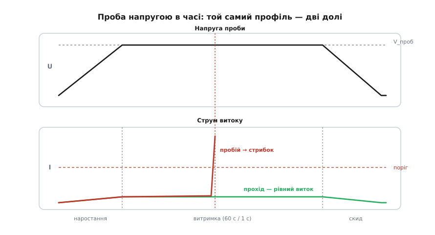

# Гіпот-тест: перевірка ізоляції мережевих пристроїв

<preknowlist>
- [Безпека з мережею](root:hw-power/mains-safety) — що робить напруга мережі з тілом, навіщо захисне заземлення й від чого відділяє ізоляція.
- [Закон Ома](root:hw-analog/ohms-law) — струм витоку = напруга / опір; основний зв'язок трьох величин.
- [Пробій діелектрика](root:ph-electromagnetism/dielectric-breakdown) — як ізолятор раптово перестає ізолювати, коли поле перевищує його міцність.
- [Опір конденсатора](root:hw-components/capacitive-reactance) — змінний струм тече крізь ємність (I = U·2πf·C); звідси береться струм витоку крізь Y-конденсатори.
</preknowlist>

Візьміть будь-який прилад, увімкнений у розетку: зарядку телефона, чайник, блок живлення комп'ютера. Усередину заходить 230 вольтів — напруга, яка вбиває. Назовні стирчать речі, яких торкаються пальці: металевий корпус, USB-гніздо, вихідні клеми. Між цими двома світами стоїть одне-єдине — **ізоляція**. Лакова плівка на обмотці трансформатора, повітряний зазор на платі, пластик каркаса, тонка стрічка між витками. Поки вона ціла, ви нічого не відчуваєте. Варто в ній з'явитися волоску припою, тріщині в каркасі трансформатора, краплі конденсату чи проколу в стрічці — і мережа дістається до того, чого ви торкаєтесь. Дізнаєтесь ви про це в мить удару струмом.

Ось головна підступність ізоляції: вона невидима, доки не вб'є. Її не видно оком і — що важливіше — її **не міряє мультиметр**. Мультиметр перевіряє опір кількома вольтами. Слабке місце — мікроскопічна тріщинка, забруднення, недопресований зазор — за трьох вольтів чесно показує «нескінченність, сотні мегаом». А за чотирьохсот вольтів воно проб'ється наскрізь. Дефект виказує себе лише під тією напругою, яку реально зустріне в роботі; низьковольтне вимірювання його просто не бачить.

Звідси єдиний чесний спосіб перевірити ізоляцію: подати на неї напругу **вищу**, ніж прилад колись побачить у мережі, і подивитися, чи вона встоїть. Це і є **гіпот-тест** (англ. *hipot* — скорочення від *high potential*, «висока напруга»); строгіша назва — випробування діелектричної міцності (англ. *dielectric withstand* — «витримування діелектриком»). Ідея — проба із запасом: свідомо навантажити ізоляцію сильніше за робочі умови, та слабше за руйнівний поріг, щоб виловити бракований виріб, не пошкодивши справний.

> 🔧 **Навіщо це.** Мережевий виріб не має права покинути конвеєр без цієї проби. Партія плат може бездоганно пройти перевірку мультиметром і функційні тести — а серед них ховатиметься одна з волоском припою під трансформатором, готова вдарити струмом користувача. Гіпот-тест — це рубіж, де таку плату ловлять до відвантаження. Тому він стоїть обов'язковим пунктом майже в кожному стандарті безпеки й проганяється на **кожному** зібраному пристрої, а не вибірково на партії.

## Де проходить рубіж, який перевіряють

Щоб зрозуміти, куди прикладати напругу, треба побачити, де в приладі лежить межа ізоляції. Найтиповіший випадок — [ізольований імпульсний перетворювач](root:hw-power/flyback-isolated): саме він стоїть у зарядках і блоках живлення. У ньому світ розколотий на два боки. **Первинний бік** тримає випрямлену мережу — близько 325 вольтів постійної напруги, смертельно. **Вторинний бік** — низьковольтний, той, що виходить назовні: п'ять вольтів USB, вихідні клеми, усе, чого торкається людина. Між ними — прірва, яку не можна перетнути дротом.

Через цю прірву перекинуто рівно три містки, і кожен переносить не сам струм мережі, а лише те, що потрібно для роботи. **Трансформатор** передає енергію магнітним полем — між обмотками немає провідного шляху, лише лак і стрічка. [Оптопара](root:hw-components/optocoupler) передає сигнал зворотного зв'язку світлом крізь прозорий проміжок — знову без дроту. І **Y-конденсатор** — навмисний крихітний місток ємністю в кілька нанофарад, поставлений між боками, щоб зливати високочастотні завади; постійний струм крізь нього не тече. Усе інше між первинним і вторинним боком мусить лишатися проваллям.


*Гіпот прикладає напругу поперек прірви — первинний бік проти вторинного й проти корпусу; будь-який випадковий місток там означає провал.*

Гіпот прикладає свою високу напругу саме поперек цієї прірви: первинний бік проти вторинного, а якщо корпус металевий і заземлений — ще й первинний бік проти корпусу. Якщо ізоляція ціла, високій напрузі нікуди йти й майже нічого не тече. Якщо десь причаївся зайвий місток — волосок припою через зазор, тріщина в каркасі, крапля вологи, — струм знаходить його й тече, а прилад отримує тавро «брак».

Наскільки товстою мусить бути та ізоляція, задає її **клас**. Один шар, що відділяє людину від мережі, — це [базова ізоляція](root:hw-power/insulation-classes): достатньо, поки він цілий, але єдиний прокол лишає людину беззахисною. Тому надійні прилади ставлять **два незалежні шари** (подвійна ізоляція) або один посилений шар, розрахований так, ніби він працює за два (**підсилена ізоляція**). Клас визначає й напругу проби: підсилену ізоляцію перевіряють приблизно вдвічі жорсткіше за базову — вона ж мусить встояти там, де інакше стояли б два бар'єри. Фізичний бік цієї ізоляції на платі — витримані [зазори повітрям і поверхнею діелектрика](root:hw-pcb/creepage-clearance), і саме їхню цілісність гіпот перевіряє напругою.

## Сама проба: наростити, витримати, стежити за струмом

Механіка тесту проста, коли ясно, що вимірюють. Усі точки первинного боку замикають в один вивід, усі точки вторинного боку й корпус — в інший, і між ними вмикають джерело високої напруги. Далі — три фази.

Напругу **нарощують плавно**, а не подають стрибком: різкий стрибок сам по собі був би кидком, який міг би пробити навіть здорову ізоляцію. Дійшовши до випробувальної напруги, її **витримують** — 60 секунд у типовому кваліфікаційному тесті, одну секунду в конвеєрному, який женуть на кожному виробі. Увесь цей час прилад **міряє струм**, що тече крізь ізоляцію.

У справного виробу тече лише мізерний струм витоку — дещиця крізь опір ізоляції плюс ємнісний струм крізь Y-конденсатори. Він рівний і низький. Це — **прохід**. У бракованого все інакше: у міру того як напруга росте, у слабкому місці поле сягає межі, повітря чи діелектрик іонізується, зривається [лавина](root:ph-electromagnetism/air-breakdown) — і струм стрибком злітає вгору. Прилад миттєво розриває тест і виставляє **провал**. Або ж рівний струм витоку вже перевищує дозволений поріг, і виріб бракують без жодного пробою.



*Той самий профіль напруги, дві долі: рівний низький струм — прохід; раптовий стрибок струму на пробої — провал.*

Уся суть рішення «прохід чи провал» тримається на одному числі — **порозі струму**. Нижче порога виток вважають нормальним, вище — браком. Де саме поставити цей поріг і якою напругою бити — і є вся інженерія тесту.

## Якою напругою бити

Логіка вибору напруги пряма: вона має бути вищою за найгірше, що ізоляція побачить у службі, і нижчою за те, що зруйнує здорову ізоляцію. Класичне правило для базової ізоляції зі стандарту IEC 60950-1 (він довго правив у техніці зв'язку й обчислювальній) — узяти подвоєну напругу мережі й додати кіловольт.

**Мережа 230 В, базова ізоляція, за IEC 60950-1:**

```
U      = 230 В                     діюча напруга мережі
V_проб = 2·U + 1000
       = 2·230 + 1000
       = 1460 В   (витримати 60 с)
```

Свіжіший стандарт IEC 62368-1 (тепер він накриває аудіо-, відео- й обчислювальну техніку) відмовився від формули на користь таблиці, прив'язаної до **пікової** робочої напруги. Але цифри виходять того самого порядку:

**Та сама точка, за IEC 62368-1:**

```
U_пік  = 230·√2 ≈ 325 В             пікова робоча напруга
базова           ≈ 1500 В (~)       змінного струму
підсилена/подвійна ≈ 3000 В (~)     удвічі — бо стоїть за два шари
```

Отут і видно, чому підсилена ізоляція перевіряється приблизно вдвічі жорсткіше: один її шар мусить витримати те, що інакше поділили б між собою два. Різні родини приладів міряють різними мірками — стандарт IEC 60601-1 для медичної техніки бере ширші запаси, бо струм може піти крізь пацієнта; IEC 61010 накриває лабораторні прилади, IEC 60335 — побутову техніку. Але принцип скрізь один: випробувальна напруга свідомо вища за службову.

> 🔧 **Навіщо це.** Обрати правильний стандарт для свого виробу — перша інженерна дія, а не формальність. Той самий блок живлення, сертифікований як побутовий прилад і як медичний, проходитиме гіпот за різними напругами й різними порогами витоку. Помилитесь із класом — або не пройдете сертифікацію, або поставите менший запас безпеки, ніж вимагає застосування.

## Змінним чи постійним, і пастка Y-конденсатора

Бити можна змінною напругою або постійною, і вибір не косметичний. Змінна проба ближча до реального життя: вона навантажує ізоляцію обома полярностями, точнісінько як сама мережа. Але змінна напруга жене струм крізь **кожну** ємність поперек рубежу — а найперше крізь ті самі Y-конденсатори, які туди навмисне поставили проти завад. І цей ємнісний струм зовсім не мізерний.

**Ємнісний струм витоку крізь Y-конденсатор (проба 1500 В, 50 Гц, C = 4.7 нФ):**

```
I_C = U · 2·π·f · C
    = 1500 · 2·π·50 · 4.7·10⁻⁹
    = 1500 · 314 · 4.7·10⁻⁹
    ≈ 2.2·10⁻³ А
    = 2.2 мА
```

Ось у чому халепа: 2.2 міліампера тече крізь **здоровий** виріб просто тому, що в ньому є Y-конденсатор. Отже, поріг спрацювання за змінної проби доводиться ставити вище за ці 2.2 мА — інакше кожен добрий виріб провалюватиметься. А високий поріг сліпне до дрібних витоків: маленький опірний виток крізь недобру ізоляцію ховається під горою ємнісного струму.

Постійна проба цю пастку обходить. Постійна напруга **один раз** заряджає всі ємності коротким кидком, а далі конденсатор перестає проводити — лишається тільки справжній опірний виток, який у справного виробу вимірюється мікроамперами. Тепер поріг можна опустити дуже низько й ловити ту марґінальну ізоляцію, яку змінна проба пропустила б. Ціна — постійну напругу треба взяти вищою, щоб дійти до тієї самої пікової напруженості поля, що й змінна:

**Еквівалент постійної напруги для проби 1500 В змінного:**

```
V_пост = √2 · V_змін
       = 1.414 · 1500
       ≈ 2121 В
```

Множник √2 — це просто відношення піка синусоїди до її діючого значення: щоб постійна напруга навантажила ізоляцію так само, як пік змінної, вона мусить дорівнювати цьому піку.


*Змінна проба тоне в ємнісному струмі Y-конденсаторів; постійна після зарядного кидка бачить лише опірний виток — і тому чутливіша до слабкої ізоляції.*

> 🔧 **Навіщо це.** Якщо на конвеєрі поставити змінну пробу, забувши про струм Y-конденсаторів, тестер справно бракуватиме **справні** вироби, і виробництво стане. Порахувати ємнісний струм наперед і рознести його з порогом — обов'язкова дія при налаштуванні станції. А після постійної проби пам'ятайте розрядити виріб: у ньому лишається запас енергії на кілька кіловольтів, і необережний контакт по завершенні тесту вкусить не гірше за саму мережу.

## Два супутники: опір ізоляції та заземлювальний зв'язок

Гіпот доводить, що бар'єр витримує сильний удар. Та повну картину безпеки дають ще дві споріднені проби, і всі три об'єднує одна філософія — навантажити захисника до найгіршого випадку й подивитись, чи встоїть.

**Опір ізоляції** (англ. *insulation resistance*) вимірюють помірною постійною напругою — 250, 500 чи 1000 вольтів — і замість «пройшло / пробило» дивляться саме число опору, яке має бути в десятках чи сотнях мегаом, а то й у гігаомах. Ця проба ловить те, що гіпот може пропустити: забруднення й вологу, які знижують опір, ще не спричиняючи повного пробою. Якщо гіпот питає «чи витримає прірва удар», то опір ізоляції питає «чи чиста прірва».

**Заземлювальний зв'язок** (англ. *ground bond*) стосується лише приладів [Класу I](root:hw-power/mains-safety) — тих, що покладаються на захисне заземлення, а не на подвійну ізоляцію. У такому приладі вся безпека тримається на одному дроті: якщо базова ізоляція пробилась і фаза торкнулась металевого корпусу, захисне заземлення мусить пропустити крізь себе величезний струм аварії, щоб автомат вимкнувся вмить, — і водночас утримати корпус біля нуля вольтів. Тому зв'язок від контакту заземлення до кожної дотичної металевої деталі має бути майже коротким замиканням. Перевіряють це, ганяючи крізь зв'язок великий струм і міряючи падіння напруги:

**Заземлювальний зв'язок: 25 А крізь зв'язок, межа 0.1 Ом:**

```
I = 25 А                            випробувальний струм
R < 0.1 Ом                          дозволена межа опору зв'язку
V = I·R = 25 · 0.1 = 2.5 В          максимальне падіння

Чому саме великим струмом:
  корозований обтиск чи кілька вцілілих жилок дроту
  за слабкого струму покажуть низький опір,
  а за струму аварії розігріються й розірвуться.
  25 А стресують зв'язок так, як стресувала б реальна аварія.
```

Мала величина опору тут критична з двох боків одразу. По-перше, за струму аварії низький опір утримує корпус біля землі: 0.1 ома при аварійному струмі 30 А підіймуть корпус лише на 3 вольти, тоді як 5 омів підняли б його на смертельні 150. По-друге, лише низький опір петлі дасть струму зрости настільки, щоб запобіжник чи автомат зреагували швидко. Тому проба не просто перевіряє наявність зв'язку — вона перевіряє його **під навантаженням**, тим самим методом проби із запасом, що й гіпот.

## Проба, що сама небезпечна

Варто пам'ятати: усе описане — це кілька кіловольтів і десятки ампер, здатні вбити чи покалічити не гірше за саму мережу. Тому виробничі станції гіпоту не лишають цю небезпеку відкритою: випробувальна зона за зблокованим кожухом, який знеструмлює високу напругу, щойно його відчинити; запуск двома руками, щоб оператор не тримав виріб під напругою; автоматичний розряд виробу після постійної проби; обмеження струму, щоб пробій не перетворився на дугу-різак. Сам тестер не має права стати джерелом лиха, яке він же й ловить. Як улаштувати послідовність проб, порогів і блокувань у коді керування станцією — розібрано окремо в [алгоритмі станції гіпоту](root:hw-power/mains-hipot-test/proj-hipot-sequencer.md).

Разом ці три проби відповідають на одне питання, яке користувач ніколи не встигне поставити сам: «чи справді стоїть бар'єр між мною і 230 вольтами?» Мультиметр на нього не відповість — він міряє надто лагідно. Відповідає лише удар напругою, вищою за службову: вистояла ізоляція — вистоїть і в руках людини; не вистояла — краще їй впасти тут, на конвеєрі, ніж потім. Історію того, як народилася сама ідея сертифікувати безпеку пробою напругою, зібрано у [нарисі про народження випробування ізоляції](root:hw-power/mains-hipot-test/hist-dielectric-withstand.md); кількісний бік — звідки беруться напруги проби, множник √2 і зв'язок із діелектричною міцністю — розкладено в [математиці координації ізоляції](root:hw-power/mains-hipot-test/math-insulation-coordination.md).
