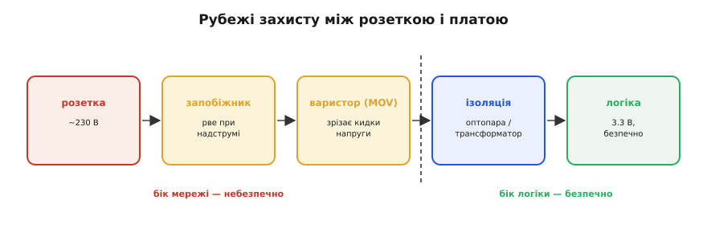
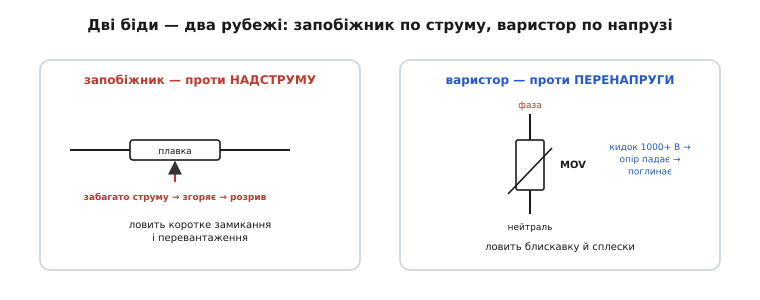
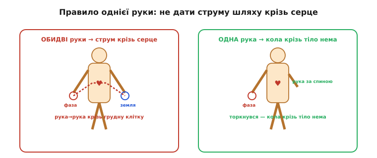

# Безпека з мережею

Уміти комутувати мережу — це половина справи; друга половина — **лишитися при цьому неушкодженим**. Це не формальність: між макеткою з батарейкою і схемою в розетці лежить якісна прірва. Батарейка на 5 В у найгіршому разі зіпсує компонент; мережа на 230 В у найгіршому разі **вбиває**. Тому культуру безпеки засвоюють **до** того, як уперше торкнутися мережевої схеми, а не після першого удару струмом. Безпека з мережею тримається на двох речах: не дати напрузі дістатися до людини, а якщо контакт усе ж стався — не дати струму пройти крізь серце. З цього й виростає все інше — чому мережа смертельна, які рубежі захисту стоять у приладі та як поводитися з живою схемою.

### Чому мережа смертельна: справа в струмі крізь тіло

Перше, що треба зрозуміти: убиває не «напруга сама по собі», а **струм, що проходить крізь тіло**, надто крізь серце. Тіло людини між мокрими руками має опір порядку кількох кілоом; за [законом Ома](topic:hw-analog/ohms-law) напруга мережі здатна прогнати крізь нього струм у **десятки міліампер**. А вже **~30 мА**, що тече крізь грудну клітку, може спричинити **фібриляцію серця** — хаотичне тремтіння, яке не жене кров. Це смертельно. Для порівняння: світлодіод живлять струмом усього 10…20 мА — тобто струм, безпечний для світлодіода, проходячи крізь серце, лежить уже біля смертельної межі.

Звідси випливає вся подальша логіка безпеки: треба або **не дати** мережевій напрузі дістатися до людини (ізоляція, рубежі захисту), або, якщо контакт усе ж стався, **не дати** струму пройти крізь серце (правило однієї руки).

Корисно тримати в голові й грубу шкалу впливу струму крізь тіло, щоб розуміти, чому межі саме такі. Близько **1 мА** — поріг відчуття, легке поколювання. Близько **10 мА** — м'язи руки судомить так, що людина **не може розтиснути** долоню й відпустити провід (звідси й правило хапати підозрілий провід тилом руки, а не долонею). Близько **30 мА** крізь грудну клітку — поріг фібриляції серця, далі небезпека для життя. Сотні міліампер — опіки й зупинка серця. А мережа, як показує той самий розрахунок за законом Ома, здатна прогнати крізь мокрі руки **понад сто** міліампер — тобто вона із запасом перекриває смертельний поріг. Тому до неї ставляться зовсім не так, як до 5 В на макетці.

### Рубежі захисту: ізоляція, запобіжник, варистор

Між розеткою й крихкою логікою має стояти не один, а **кілька рубежів** захисту, кожен від своєї біди.


*Послідовні рубежі: запобіжник (проти надструму) → варистор (проти кидків напруги) → гальванічна ізоляція (проти контакту з мережею), і лише за ними починається безпечна логіка на 3.3 В. Зліва від бар'єра ізоляції — небезпечний бік мережі, справа — безпечний бік керування.*

**Гальванічна ізоляція скрізь.** Це головне правило: між мережею й усім, чого торкається людина чи що з'єднане з комп'ютером, мусить стояти ізоляційний бар'єр — оптопара, трансформатор чи ізольований модуль. Сторона логіки **ніколи** не повинна мати спільної міді з мережею. Саме тому будь-який мережевий ключ несе ізоляцію всередині — [потреба ізолювати керування від мережі](root:embedded/ac-switch-need) визначає всю архітектуру силового вузла.

**Запобіжник** *(fuse)* — захист від **надструму**. Це тонка плавка вставка, що згоряє й розриває коло, коли струм перевищує норму (коротке замикання, пробій ключа). Запобіжник ставлять **першим**, одразу від фази, — щоб будь-яка аварія в схемі знеструмила її, а не спричинила пожежу. Він захищає не стільки прилад, скільки **проводку й людину** від наслідків короткого замикання.

**Варистор** *(MOV, metal-oxide varistor)* — захист від **перенапруги**. Це [прилад, опір якого різко падає](topic:hw-components/varistor), коли напруга на ньому перевищує поріг. У нормі варистор «невидимий» (величезний опір, струму нема), але щойно прилітає кидок напруги — від блискавки, від комутації потужного сусіднього навантаження — варистор миттю «коротить» його, поглинаючи енергію сплеску й не пускаючи його далі в схему. Ставлять варистор паралельно входу, зазвичай **за** запобіжником, щоб у разі сильного кидка варистор «закоротив» його, а запобіжник тоді розірвав коло. Поводиться варистор, по суті, як двобічний аналог [TVS-діода](root:embedded/zener-schottky), тільки на куди більші енергії й напруги мережі.

**Захисне заземлення й пристрій захисного вимкнення.** У стаціонарних приладах є ще два рубежі, які варто згадати, бо вони рятують саме людину. Третій провід — **захисне заземлення** *(protective earth, PE)* — з'єднує металевий корпус приладу із землею; якщо фаза через пробій торкнеться корпусу, струм піде в землю, а не чекатиме, поки його замкне людина. А **пристрій захисного вимкнення** *(ПЗВ; RCD / GFCI)* стежить за тим, чи струм, що **витік** у фазу, повністю **повертається** нейтраллю. Якщо частина струму «зникла» (потекла кудись повз — наприклад, крізь людину в землю), різниця навіть у ~30 мА змушує ПЗВ за мілісекунди розірвати коло. Це останній автоматичний рубіж, що рятує життя при прямому дотику, — і його поріг ~30 мА не випадковий: це саме той струм, що небезпечний для серця.

І сам поріг 30 мА, і пристрій, що його використовує, — не випадкові: поріг колись виміряли на дослідах, а ПЗВ незалежно склали кілька інженерів. [Звідки взялися 30 мА і хто зробив пристрій](topic:hw-power/mains-safety/hist-rcd-thresholds.md) — окрема історія.


*Дві різні біди — два різні рубежі. Запобіжник стежить за струмом і рве коло, коли струму забагато (коротке замикання). Варистор стежить за напругою й «коротить» кидок, поки той не дійшов до схеми (блискавка, сплеск). Часто стоять разом: варистор за запобіжником.*

> 🔧 **Навіщо це.** Ці три рубежі — не взаємозамінні, кожен ловить свою аварію. Запобіжник не захистить від стрибка напруги (струм іще в нормі), варистор не захистить від повільного перевантаження (напруга в нормі), а ізоляція не захистить від пожежі при короткому. Тому в будь-якому мережевому пристрої вони стоять **разом**: запобіжник + варистор на вході, гальванічна ізоляція перед логікою. Проєктуючи мережевий вузол, перевір, що є всі три.

Безпека — це не лише схема, а й **фізичне** виконання. Мережеву частину розміщують **окремо** від низьковольтної, із чіткою «лінією поділу» на платі; між доріжками «гарячого» боку й боку логіки витримують достатній **повітряний і поверхневий зазор** (бо інакше висока напруга «перестрибне» по поверхні плати чи крізь повітря). Усе, що під мережею, ховають у **корпус**, який не дає торкнутися струмовідних частин пальцем. Запобіжник ставлять у тримач, доступний для заміни, але не для випадкового дотику. Ці конструктивні правила здаються нудними, доки не згадаєш, що саме вони стоять між пальцем користувача й трьомастами вольтами. Гарна мережева схема й погана конструкція разом дають небезпечний прилад.

### Правило однієї руки

Останній рубіж — коли всі інші не спрацювали і ви все ж опинилися біля **живої** схеми (наприклад, налагоджуєте її під напругою). Тут діє **правило однієї руки** *(one-hand rule)*: працювати з мережею **лише однією рукою**, а другу тримати за спиною або в кишені.

Логіка проста й випливає прямо з того, що вбиває струм крізь серце. Якщо торкнутися мережі **двома** руками — однією фази, іншою чогось заземленого, — струм піде **від руки до руки**, тобто **через грудну клітку й серце**. Це найнебезпечніший шлях. Якщо ж працювати **однією** рукою, то навіть випадковий дотик замкне коло хіба що через ту саму руку (або зовсім не замкне) — і струм не пройде поперек грудей.


*Зліва — обидві руки на схемі: дотик фази однією рукою й землі іншою замикає струм через серце (найгірший шлях). Справа — одна рука працює, друга за спиною: навіть випадковий дотик не створює кола крізь грудну клітку. Звідси й правило: під напругою — лише однією рукою.*

До правила однієї руки додають здоровий набір звичок: **знеструмлювати** схему перед будь-якою правкою (а не правити «на гарячу»); пам'ятати, що [**конденсатори** на вході можуть лишатися зарядженими](topic:hw-components/capacitor-uses) й після вимкнення — їх розряджають перед роботою; не працювати з мережею **наодинці**; стояти на сухому й не торкатися заземлених предметів вільною рукою.

Окремо варто наголосити на **конденсаторах**, бо це найпідступніша пастка для того, хто звик до низьковольтних схем. У блоці живлення після [діодного мосту](topic:hw-power/rectification) стоїть великий згладжувальний конденсатор, заряджений до піка мережі — ~325 В. Вимкнули прилад із розетки — а конденсатор **тримає** ці 325 В іще секунди чи хвилини, бо розряджатися йому нікуди ([стала часу RC](topic:hw-analog/rc-time-constant) може бути великою). Людина, упевнена, що «прилад вимкнено, отже безпечно», лізе всередину — і отримує удар від зарядженого конденсатора. Саме тому у відповідальних блоках ставлять **bleeder-резистор** — резистор, що повільно розряджає конденсатор після вимкнення; а перед роботою конденсатор додатково розряджають вручну через резистор (не закорочуючи навпростець — заряджений конденсатор дасть іскру й може вибухнути). «Вимкнено з розетки» ≠ «безпечно»: спершу переконайся, що велика ємність розряджена.

> 🔧 **Навіщо це.** Правило однієї руки й увесь набір звичок коштують нуль і не потребують жодної деталі — це просто **порядок дій**: знеструмив → розрядив конденсатори → перевірив, що напруги нема → працюєш однією рукою. Це остання лінія оборони, коли техніка вже не рятує (схема жива, ізоляцію знято для налагодження). Інженер, що зробив цей порядок автоматичним, працює з мережею роками без пригод; той, хто «зекономить» один крок («та воно ж вимкнене»), рано чи пізно знаходить заряджений конденсатор або не ту фазу. Засвойте цей порядок раніше, ніж знадобиться: безпека з мережею — це не страх, а дисципліна послідовності.

**Приклад (чому 230 В небезпечні, а 5 В — ні).** Порівняємо струм крізь тіло (опір рук ≈ 2 кОм) від мережі й від логічного джерела.

```
Від мережі 230 В:   I = U / R = 230 / 2000 = 0.115 А = 115 мА
                    115 мА ≫ 30 мА (поріг фібриляції) → СМЕРТЕЛЬНО

Від джерела 5 В:    I = U / R = 5 / 2000 = 0.0025 А = 2.5 мА
                    2.5 мА — ледь відчутно, безпечно

Та сама людина, та сама рука — різниця лише в напрузі джерела,
але наслідок протилежний. Ось чому мережа вимагає іншої культури.
```

Той самий дотик, що від батарейки не дає навіть поколювання, від мережі жене крізь тіло струм, який у рази перевищує смертельний поріг. Уся ця тема — про те, щоб такого дотику **ніколи не сталося**, а якщо станеться — щоб струм не пройшов крізь серце.

Якщо звести все докупи, безпека мережі тримається на трьох речах, і всі вони закладаються ще на етапі проєктування. **Рубежі захисту** ловлять різні аварії: запобіжник — надструм, варистор — кидок напруги, гальванічна ізоляція — сам контакт із мережею; жоден не замінює іншого, тож у будь-якому мережевому вузлі вони стоять разом. **Конструкція** доводить цю схему до безпечного приладу: поділ гарячого й логічного боків, зазори, корпус. А **дисципліна послідовності** рятує того, хто торкається живої схеми: знеструмив → розрядив конденсатори → перевірив, що напруги нема → працюєш однією рукою. Засвоєні до того, як знадобляться, ці правила перетворюють мережу з її сотнями вольт із загадкового й страшного світу на керовану частину системи, до якої є правильний інструмент і правильний порядок дій.
