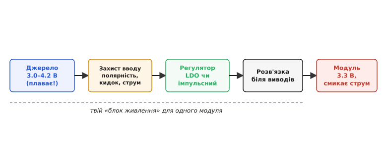
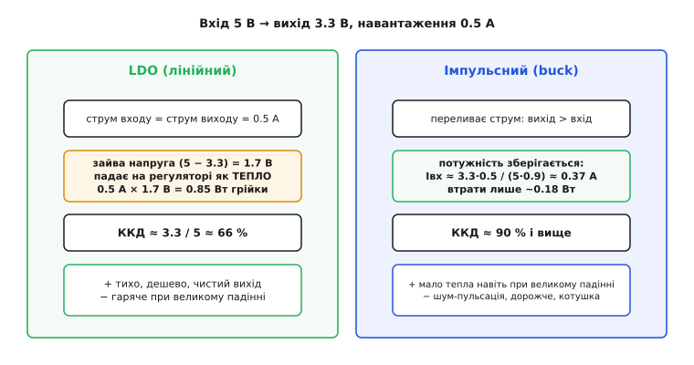
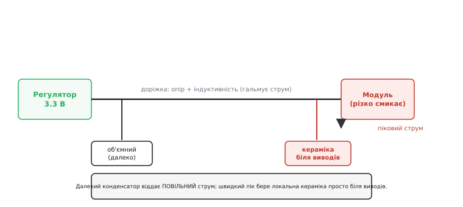

# Живлення модуля

Ти взяв готовий модуль — плату давача, приймач, дисплей чи мікроконтролер — і хочеш його ввімкнути. У даташиті написано щось на кшталт «3.3 В, 150 мА». Здається, справа на п'ять хвилин: приклав три вольти з копійками — і працює. Насправді за цим коротким рядком ховається маленький, але повноцінний **блок живлення**, який ти мусиш побудувати сам. І коли модуль «глючить» — раптово перезавантажується, бреше показами, гріється чи гине, — причина найчастіше саме тут, у тому, як його нагодовано.

Річ у тім, що модуль просить не «напругу». Він просить **сталу напругу потрібної якості, за будь-якого режиму своєї роботи, з того джерела, яке в тебе реально є** — а джерело майже ніколи не видає рівно те, що треба. Батарея сповзає, USB просідає, сусідня шина шумить. Тому живлення модуля — це не одна деталь, а короткий ланцюг перетворень: узяти те, що є, і зробити з нього те, що модуль хоче.

### Ланцюг, а не точка

Найкорисніше — одразу побачити живлення модуля як **ланцюг від джерела до виводів**, де кожна ланка розв'язує свою задачу:


*Живлення модуля — це ланцюг, а не точка. Ліворуч джерело, чия напруга **плаває** (літієва комірка: 3.0–4.2 В). Далі захист вводу ловить дурні аварії — переплутану полярність, кидок струму, перевантаження. Регулятор робить із плаваючого входу сталий вихід — лінійний (LDO) або імпульсний. Локальна розв'язка просто біля виводів гасить швидкі кидки струму, які сам модуль і створює. І тільки в кінці — модуль, що спокійно смикає свій струм. Усе праворуч від джерела ти проєктуєш власноруч.*

Проходити цей ланцюг найзручніше **з двох кінців назустріч**: спершу зрозуміти, що саме модуль просить (правий кінець), тоді — що видає джерело (лівий), і аж тоді підбирати ланки між ними. Почнімо з того, чого хоче модуль, бо саме його вимоги диктують усе решту.

### Що насправді просить модуль

Рядок «3.3 В, 150 мА» — це стисле резюме, і в ньому сховано щонайменше чотири різні вимоги.

**Напруга й допуск.** «3.3 В» — це не точка, а вузька смуга: чіп працює, скажімо, від 3.0 до 3.6 В, а поза нею або збоїть, або пошкоджується. Верхня межа — тверда: перевищив — палиш кристал. Нижня — підступна: щойно напруга просіла нижче порога, спрацьовує вбудований сторож напруги (англ. *brownout* — притьмарення світла, коли просідає мережа), і чіп скидається. Звідси й назва для «неповного» живлення, за якого логіка вже не тримається.

**Струм — середній і піковий.** «150 мА» — це зазвичай середнє. Але радіомодуль у момент передачі, мотор на старті чи процесор, що прокинувся, за мікросекунди смикають у рази більше. Цей **піковий** струм і вирішує, чи витримає твій регулятор і чи не просяде шина; середнім тут легко себе обдурити.

**Чистота.** Цифровому чіпу байдуже до десятків мілівольт брижів на живленні. А ось опора аналого-цифрового перетворювача або живлення радіо хочуть чистоти на рівні одиниць мілівольт — інакше шум із живлення просочиться прямо в покази чи в ефір. Тож «яка напруга» — це ще й «наскільки чиста».

**Порядок увімкнення.** Багато сучасних чіпів мають кілька живлень (ядро й вводи-виводи), і виробник вимагає подавати їх **у певному порядку**. Подаси не так — чіп може [«защемити» (latch-up)](topic:hw-power/power-sequencing) чи зависнути. Для простого однорейкового модуля це неактуально, але щойно живлень два — питання постає.

Оці чотири числа (радше — чотири смуги) і є справжнім технічним завданням на живлення. Розгорнути один рядок бюджету в повну специфікацію — окрема дисципліна; коротко: [що має містити ТЗ на перетворювач](topic:hw-power/converter-spec).

> 🔧 **Навіщо це.** Перш ніж вибирати регулятор, випиши ці чотири речі для свого модуля з даташита: діапазон напруги, середній і **піковий** струм, допустиму пульсацію, і чи є вимога до порядку рейок. Дев'ять із десяти проблем живлення — це пропущений піковий струм або brownout, який на середніх числах узагалі не видно.

### Звідки береться напруга: джерело — це діапазон

Тепер лівий кінець. Головна пастка новачка — думати про вхід як про число. Насправді **вхідна напруга завжди діапазон**. Літієва комірка повна дає 4.2 В, а сіла — 3.0 В; USB номінально 5 В, але на тонкому кабелі під навантаженням легко провалюється до 4.6; будь-яке джерело [просідає під навантаженням](topic:hw-power/battery-sag), бо має власний внутрішній опір. Тому вхід задають **від мінімуму до максимуму**, і живлення мусить працювати на всьому діапазоні.

Ця смуга входу проти потрібного виходу одразу вирішує **тип регулятора**. Якщо вхід завжди **вищий** за вихід (5 В USB → 3.3 В) — потрібне зниження. Якщо вхід і вищий, і нижчий за вихід у різні моменти (літій 3.0–4.2 В → стабільні 3.3 В) — самим зниженням не обійтися, треба вміти й **підвищувати**. А якщо вихід має бути дуже чистий і вхід лише трохи вищий — проситься лінійний регулятор. Отже, перш ніж дивитися на конкретні мікросхеми, порівняй дві смуги — входу й виходу — і побач, у який бік і наскільки треба «пересунути» напругу.

### Серце вибору: LDO чи імпульсний

Це головне рішення всього живлення, і воно зводиться до одного: **куди подіти зайву напругу**.

**Лінійний регулятор (LDO, англ. *low-dropout* — «з малим падінням»)** діє чесно й тупо: пропускає весь струм навантаження наскрізь, як керований резистор, а зайву напругу просто **спалює на собі теплом**. Вихід у нього тихий і чистий, схема — копійчана (сам чіп та два конденсатори). Ціна — тепло: скільки вольт він «зрізав», помножене на струм, і є його грійка. [Усередині LDO](topic:hw-power/ldo) — підсилювач помилки, що весь час підстроює прохідний транзистор, аби вихід тримався за опорну напругу.

**Імпульсний перетворювач (buck — знижувальний)** діє хитріше: він не палить зайве, а **швидко перемикає** ключ і накопичує енергію в котушці, «переливаючи» її на вихід порціями. Через збереження потужності знижувач бере з входу **менший** струм, ніж віддає в навантаження, — і майже нічого не гріє. Ціна — складність і шум: котушка, вища вартість, і на виході лишається пульсація від перемикання. Як саме [котушка й ключ будують стабільний вихід](topic:hw-power/switching-converter) — окрема тема, але сам вибір видно вже з арифметики тепла:


*Один і той самий вихід (3.3 В, 0.5 А з 5 В), два способи. LDO пропускає всі 0.5 А, а різницю 1.7 В обертає на 0.85 Вт тепла — ККД лише ~66%, чіп відчутно гарячий. Імпульсний зберігає потужність: щоб віддати 3.3 В × 0.5 А, він бере з 5-вольтового входу лише ~0.37 А, і втрати падають до ~0.18 Вт — ККД ~90%, майже холодний. За це платиш котушкою, ціною і шумом на виході.*

Правило вибору просте й народжується прямо з цієї картинки. Бери **LDO**, коли падіння напруги мале, струм невеликий, а чистота критична (живлення давача, опори, радіо поруч із цифрою). Бери **імпульсний**, коли падіння велике або струм великий — тобто коли LDO перетворився б на грубку. Межу відчувають по теплу: якщо добуток «зрізаних вольт на струм» переростає десь пів вата, LDO вже треба тепловідвід, і розумніше поставити знижувач. Часто ці двоє **поєднують**: галасливий, але ефективний імпульсний робить чорнову шину (наприклад, 3.3 В), а тихий LDO дочищає з неї окрему чисту рейку для найвразливішого вузла.

> 🔧 **Навіщо це.** Одна формула вирішує спір: `Pгрійки = (Vвх − Vвих) × Iнавантаження` для LDO. Порахуй її на **найгіршому** (найвищому) вході й найбільшому струмі. Вийшло понад ~0.3–0.5 Вт у корпусі без радіатора — не сперечайся з фізикою, став імпульсний. Вийшло мало, а вихід має бути чистий — LDO простіший, дешевший і надійніший.

### Локальна розв'язка: конденсатори біля самих виводів

Регулятор дає гарну напругу — але **у себе на виході**. Між ним і виводами модуля лежать сантиметри доріжки чи дроту, а в них ховаються опір та індуктивність. Індуктивність опирається **швидкій зміні** струму: коли модуль різко смикне піковий струм, далекий регулятор фізично не встигає його підвести — дріт «гальмує». І напруга просто на виводах модуля на мить провалюється, хоч на виході регулятора все ще ідеально.

Рятує **локальна розв'язка** — конденсатор просто біля виводів живлення, як маленький місцевий резервуар. У перші наносекунди кидка струм віддає він, а не далекий регулятор:


*Далекий об'ємний конденсатор біля регулятора добре тримає **повільні** зміни, але доріжка між ним і модулем гальмує швидкий струм. Тому просто біля виводів живлення ставлять маленьку кераміку — вона віддає **пік** миттєво, локально, не питаючи дозволу в далекого регулятора. Класичний рецепт: об'ємний конденсатор на вводі плати плюс мала кераміка (типово 100 нФ) впритул до кожного чіпа.*

Звідси стандартний рецепт живлення будь-якого чіпа: **об'ємний** конденсатор (одиниці-десятки мкФ) на вводі модуля тримає рейку під повільними навалами навантаження, а **мала кераміка** (типово 100 нФ) впритул до кожної пари виводів живлення гасить швидкі кидки. Ця мала кераміка й зветься [розв'язувальним, або блокувальним, конденсатором (decoupling)](topic:hw-components/decoupling): вона «розв'язує» чіп від решти живлення по змінному струму, замикаючи його власні кидки накоротко тут-таки, поряд. Ключове слово — **поряд**: конденсатор, віднесений на пару сантиметрів, індуктивність доріжки знецінює, і він уже не встигає. Скільки саме [ємності потрібно на вводі](topic:hw-power/converter-caps) — залежить від того, як глибоко можна дозволити рейці просісти на кидку.

> 🔧 **Навіщо це.** Правило, що рятує від годин загадкового налагодження: **100 нФ керамічний конденсатор упритул до кожного чіпа**, плюс один об'ємний на вводі модуля. Модуль, що «зависає» на ввімкненні радіо чи смикання серва, майже завжди страждає не від поганого регулятора, а від браку локальної розв'язки: пік струму просаджує рейку нижче brownout — на мілісекунду, якої досить, щоб чіп скинувся.

### Захист на вводі модуля

Остання ланка ланцюга — та, про яку згадують уже після першого спаленого модуля. На **вводі** живлення варто поставити кілька дешевих запобіжників від типових дурних аварій.

Перше — **переплутана полярність**. Рано чи пізно хтось під'єднає живлення навпаки, і без захисту модуль гине миттєво. Найпростіший захист — діод, але він з'їдає частину напруги й гріється; тому в акуратних пристроях ставлять [MOSFET як «ідеальний діод»](topic:hw-power/ideal-diode) — польовий ключ, що пропускає струм лише в правильному напрямку майже без втрат. Другий, споріднений вузол — [керований ключ живлення (load switch)](topic:hw-power/load-switch): він дає ще й вимикати модуль програмно та плавно, обмежуючи кидок при ввімкненні.

Друге — **кидок струму при ввімкненні (inrush)**. Порожні конденсатори модуля в першу мить під'єднання виглядають як коротке замикання: струм підскакує різким піком, іскрить на роз'ємі, просаджує спільну шину й будить сусідні вузли. Тому струм на старті **пом'якшують** — плавним нарощуванням через той самий load switch або струмообмежувальним елементом на вводі.

Третє — **перевантаження**. Якщо модуль колись закоротить, живлення має не спалити доріжку, а спокійно вимкнутись. Найпростіше — плавкий запобіжник; акуратніше — [самовідновний запобіжник (PTC)](topic:hw-components/inrush-ntc) або електронне обмеження струму, що вимикає рейку й повертає її, коли аварія минула.

Скільки саме цього захисту ставити — питання ціни помилки. Дослідна плата на столі проживе й без нього; серійний виріб, який вмикатимуть у полі чужі руки, без захисту вводу — це заявка на гарантійні повернення.

### Порахуймо живлення реального модуля

**Умова.** Модуль давача з мікроконтролером хоче 3.3 В, у спокої бере 40 мА, а в момент радіопередачі — пікові 250 мА. Живимо його від однієї літієвої комірки (Li-ion, 3.0–4.2 В). Що обрати — LDO чи імпульсний, і як не проґавити просідання рейки?

Спершу тип регулятора. Вхід гуляє від 3.0 до 4.2 В, а вихід треба 3.3 В — тобто вхід буває **нижчим** за вихід (сіла комірка). Простий LDO тут не дотягне: коли вхід 3.0 В, зробити з нього 3.3 В неможливо. Значить, потрібен або знижувально-підвищувальний імпульсний, або — практичний компроміс — узяти LDO, що працює аж до входу трохи вищого за вихід, і свідомо змиритися, що на зовсім сідлій комірці рейка почне просідати. Порахуймо тепло LDO для найгіршого (найвищого) входу, щоб знати ціну простоти:

```
Найгірший вхід для тепла:  Vвх = 4.2 В (повна комірка)
Падіння на LDO:            4.2 − 3.3 = 0.9 В
Грійка на піку струму:     0.9 В × 0.25 А = 0.225 Вт
```

Чверть вата в малому корпусі відвести можна, тепло не страшне. Але лишається інша межа — просідання на сідлій комірці, тож у прошивці варто стежити за самою рейкою й ловити підхід до brownout. Занесемо межі з даташита в код і будемо міряти напругу власним АЦП контролера:

```c
// Межі живлення модуля (з даташита чіпа)
#define VDD_MIN_V   3.15f   // нижче — ризик brownout, дії ненадійні
#define VDD_NOM_V   3.30f   // номінал рейки
#define VDD_MAX_V   3.60f   // вище — пошкодження

// Читаємо власну рейку через дільник на вхід АЦП.
// Опорна — ВНУТРІШНЯ стала (VREF_INT), а не сама рейка:
// інакше АЦП «пливе» разом із рейкою й просідання не побачить.
#define VREF_INT_V  1.20f   // внутрішнє опорне джерело чіпа
float read_vdd(uint16_t adc_raw) {
    float v_pin = (adc_raw / 4095.0f) * VREF_INT_V;
    return v_pin * 4.0f;    // дільник 1:4 → рейка вчетверо вища за вхід АЦП
}                           // (3.6 В рейки → 0.9 В на вході, з запасом під 1.20 В опори)

// Перед енерговитратною дією (радіопередача) перевіряємо запас
bool supply_ready_for_tx(uint16_t adc_raw) {
    float vdd = read_vdd(adc_raw);
    return vdd >= VDD_MIN_V;   // ще є запас над brownout — можна передавати
}
```

Це лише кістяк; повноцінний [сторож живлення в прошивці](topic:hw-power/module-power-supply/proj-supply-monitor.md) стежить за рейкою з гістерезисом (щоб не «торохтіти» на межі), відкладає важкі дії до відновлення напруги й вмикає підпорядковані вузли через ключ живлення в правильному порядку.

Тепер локальна розв'язка під той піковий струм. Радіопередача смикає різницю 250 − 40 = 210 мА, і поки регулятор не встиг, її віддає конденсатор біля виводів. Прикиньмо, наскільки просяде рейка на об'ємному конденсаторі за короткий сплеск передачі:

```
Сплеск струму:      ΔI = 0.21 А
Тривалість пакета:  Δt = 2 мс (типовий короткий кадр)
Дозволена просадка: ΔV = 0.1 В (лишаємось вище 3.15 В)

Потрібна ємність:   C = ΔI × Δt / ΔV
                    C = 0.21 × 0.002 / 0.1 = 4.2 мФ
```

Чотири мілі**фаради** — це неправдоподібно багато для такого модуля, і сам результат — корисний сигнал: тримати рейку **лише** конденсатором увесь пакет передачі нереально. Насправді ремонтує ситуацію не гігантський конденсатор, а те, що регулятор **встигає добрати струм** за мікросекунди, тож конденсатор мусить перекрити лише цей короткий провал, поки контур реагує, — а не всі 2 мс. Тому ставлять розумний об'ємний конденсатор (десятки мкФ) плюс 100 нФ впритул до чіпа й **вибирають регулятор із достатньою швидкодією**, а не борються з піком самою ємністю. Висновок практичний: якщо модуль дає жорсткі пакетні кидки, головне — швидкий регулятор і розв'язка поряд, а не спроба «залити» пік ємністю.

Так із чотирьох чисел даташита виріс цілий маленький блок живлення: тип регулятора продиктував діапазон входу, тепло — струм, захист — ціна помилки, а розв'язку й контроль brownout — піковий кидок. Саме в цьому й полягає живлення модуля: не «дати три вольти», а провести напругу через увесь ланцюг так, щоб на виводах вона лишалася доброю за будь-якого настрою і джерела, і самого модуля.
