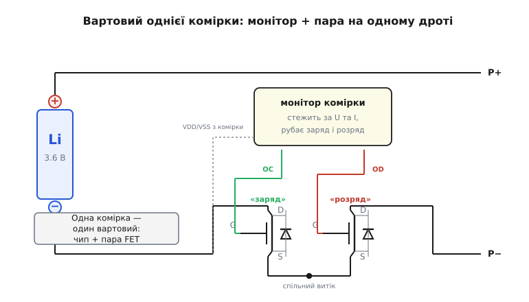

# 📜 Чому саме літій приставив до кожної комірки двох вартових

Збірка з двох MOSFET спина-до-спини існувала й до літію — інженери давно вміли ставити два транзистори назустріч, коли треба було рвати струм у обидва боки. Але з рідкісного схемного прийому вона стала **найпоширенішим силовим вузлом на планеті** — такі пари щороку роблять мільярдами — з однієї конкретної причини. Ця причина не електрична й не топологічна. Вона хімічна: у 1991 році на ринок вийшов акумулятор, який **вбиває сам себе**, якщо його не стерегти щомиті, і стерегти треба обидва напрями струму окремо. Одного транзистора для такої сторожі не досить у принципі. Тож кожна літієва комірка дістала пару.

Розберемо, як хімія однієї батареї продиктувала топологію мільярдів ключів — і чому саме «два назустріч», а не «один розумніший».

## Батарея, яку не можна залишити без нагляду

Щоб зрозуміти, звідки взявся вартовий, треба спершу відчути, чим літієва комірка відрізняється від усього, що було до неї. Свинцевий акумулятор, нікель-кадмієвий, нікель-металогідридний — усі вони **прощають**. Перезарядив трохи — зайва енергія піде в нагрів чи в електроліз води, батарея погарячішає, але виживе. Розрядив у нуль і забув на місяць — місткість просяде, та комірка лишиться комірка. Ці хімії мають вбудований запобіжник у самій фізиці: реакція, що з'їдає надлишок, не даючи напрузі втекти в небезпечну зону.

Літій-іонна комірка такого запобіжника не має. Її принцип — **інтеркаляція** (лат. *intercalare* — вставляти між): іони літію снують туди-сюди між шарами двох матеріалів, вбудовуючись у ґратку, як книжки в проміжки на полиці. Заряд заганяє літій в один електрод, розряд — назад. Поки іони йдуть у межах, на які матеріал розрахований, усе оборотно й акуратно. Але варто вийти за межі — і хімія ламається необоротно, кожен бік по-своєму.

**Перезаряд.** Женеш напругу вище за ~4.2 В на комірку — і починається біда з обох електродів одразу. На додатному катод (типово оксид літію-кобальту, LiCoO₂) віддає забагато літію, його ґратка стає нестійкою й починає віддавати кисень. На від'ємному літію вже нема куди вбудовуватися, і він осідає **металевим** нальотом — це **літієве покриття** (англ. *lithium plating*), голки-дендрити, що ростуть крізь сепаратор до катода. Кисень, що виділяється, зустрічається з розігрітим органічним електролітом — і це вже пожежа. Перезаряд літію — це не «трохи погрітися», це **тепловий розгін** (англ. *thermal runaway*): реакція гріє комірку, нагрів пришвидшує реакцію, і за секунди все йде врознос.

**Глибокий розряд.** Протилежний бік, інша поломка. Витягуєш напругу нижче за ~2.5 В — і руйнується від'ємний електрод з іншого краю: мідний струмознімач, на якому тримається графіт, починає **розчинятися** в електроліті. Коли комірку потім заряджають знову, розчинена мідь осідає назад металевими містками — і теж проколює сепаратор, теж веде до короткого замикання. Глибокий розряд не спалює комірку відразу, але готує їй смерть при наступному заряді.

> 🔧 **Навіщо це знати.** Ось чому в літієвому вузлі **два** незалежні заборони, а не один. Перезаряд і глибокий розряд — це **дві різні поломки на двох різних кінцях шкали напруги**. Захист мусить уміти сказати «стоп» кожній окремо: заборонити приймати заряд, коли комірка повна, і заборонити віддавати струм, коли вона майже порожня. Одна кнопка «вимкнути все» тут не годиться — треба два незалежні вимикачі на одному й тому ж дроті.

І тут криється вся суть. Заряд і розряд течуть крізь **ту саму пару клем**, але в **протилежних** напрямах: заряд заганяє струм у комірку, розряд тягне з неї. Заборонити один напрям, не чіпаючи другого, одним транзистором **неможливо** — його body-діод пропустить заборонений струм повз закритий канал. Саме ця вимога — роздільно рубати два зустрічні напрями на одному проводі — і привела прямісінько до пари спина-до-спини. Але спершу треба, щоб така батарея взагалі з'явилася.

## 1991: Sony випускає джина з пляшки

Ідея літієвого акумулятора зріла двадцять років і була, як майже кожен великий винахід, **колективною** — жоден із її батьків не зробив усього сам. Варто розкласти внески чесно, бо історію літію часто стискають до одного імені.

**М. Стенлі Віттінгем** (M. Stanley Whittingham), британський хімік, що працював у 1970-х у лабораторії *Exxon* у США, першим побудував діючу літієву комірку на **інтеркаляції** — з катодом із дисульфіду титану (TiS₂) й металевим літієвим анодом. Це був принцип: іони, що вбудовуються між шарами. Але металевий літій робив ту батарею небезпечною — вона мала звичку загорятися, — і до товару справа не дійшла.

**Джон Ґуденаф** (John B. Goodenough), американський фізик (працював тоді в Оксфорді), у 1980 році знайшов набагато кращий катод — **оксид літію-кобальту**, LiCoO₂. Він тримав вищу напругу й був стабільніший. Це другий стовп: правильний додатний електрод, що дожив до сьогодні майже без змін.

**Акіра Йосіно** (Akira Yoshino, 吉野彰), японський хімік з компанії *Asahi Kasei*, у 1985 році зібрав перший **повний прототип сучасної комірки**: катод Ґуденафа (LiCoO₂) плюс **вуглецевий анод** замість небезпечного металевого літію. Це вбило проблему займистого металевого літію — іони тепер вбудовувалися у вуглець, а не осідали металом. Ось третій стовп, і саме він зробив батарею придатною до товару.

Ці троє — Віттінгем, Ґуденаф, Йосіно — у 2019 році розділили Нобелівську премію з хімії за літій-іонний акумулятор. Це **усталений факт**, підтверджений офіційним рішенням Нобелівського комітету.

Але від придатного прототипу до товару в кишені — ще один крок, і зробила його **Sony**. Компанія взяла патенти *Asahi Kasei* (внесок Йосіно), доопрацювала анод, поставивши **графіт**, і збудувала масове виробництво. Тут варто розвести дві дати, які часто плутають: Sony **оголосила** нову батарею в **лютому 1990 року**, а **масове виробництво** запустила у **1991-му** на заводі в Коріямі (префектура Фукусіма). Першим виробом, куди вона стала, була **8-міліметрова відеокамера Sony CCD-TR1** серії Handycam — саме камкордер, а не мобільний телефон, як іноді пишуть. (Легенда, що першим був телефон Sony CM-H333, — **неточність**: той апарат вийшов пізніше, близько 1992 року. Перевірено: 1991-й — це камера.) Це усталена хронологія за кількома незалежними джерелами.

Формати перших комірок були циліндричні (серія US-61), напруга близько 3.6 В на комірку, щільність енергії — небачені на той час десятки ват-годин на кілограм. Раптом портативна електроніка дістала вдвічі-втричі легше живлення. І разом із подарунком — **джина, якого не можна лишати без нагляду**.

## Кожній комірці — власного вартового

Отут історія й повертає до транзисторів. Нова батарея була чудова, доки її стерегли, і смертельна, щойно нагляд зникав. А зникнути він міг легко: користувач залишає телефон на зарядці на ніч (перезаряд), забуває розряджений павербанк у шухляді на півроку (глибокий розряд), кладе його в кишеню з ключами, що замикають клеми (коротке). Продавати таку річ мільйонам людей можна було лише з однією умовою — **вартовий убудований у сам акумулятор** і працює завжди, без участі людини й навіть без участі пристрою, до якого батарею вставили.

Так народився клас крихітних мікросхем — **захист комірки** (англ. *cell protection IC*, *battery protector*). Логіка проста до геніальності: маленький чип сидить прямо в акумуляторному пакеті, вимірює напругу комірки й струм крізь неї, і **розриває лінію**, щойно щось виходить за межі. Перезаряд (напруга полізла вище порогу) — рубай заряд. Глибокий розряд (напруга впала нижче порогу) — рубай розряд. Коротке (струм стрибнув) — рубай миттю. Ранні такі чипи почали з'являтися на початку 1990-х (першими були японські виробники — *Seiko Instruments*, *Ricoh*, *Mitsumi*), рівно тоді, коли літій пішов у серію; це логічний, документований збіг — попит на вартового виник разом із батареєю, що його потребує.

Але тепер згадаймо головне обмеження з попереднього розділу: заряд і розряд — це **два зустрічні напрями на тому самому дроті**, і заборонити їх треба **окремо**. Чип уміє прийняти рішення — а чим він фізично **розірве** лінію? Йому потрібен виконавчий орган: силовий ключ, що (а) проводить великий струм майже без втрат, (б) вимикається логічним сигналом і (в) уміє **окремо** заблокувати кожен із двох напрямів.

Пункт (в) і є вирок одиночному транзистору. Постав один MOSFET у мінусову лінію комірки — і його body-діод стане лазівкою. Закрив канал, щоб заборонити розряд, — а заряд усе одно піде крізь діод у зворотний бік. Закрив, щоб заборонити заряд, — розряд просочиться крізь діод. Одинарний ключ рубає лише один напрям, а другий залишає діоду. Для батареї, де обидва напрями смертельні кожен по-своєму, це **не захист, а ілюзія захисту**.

Відповідь диктується сама собою: постав **два** транзистори назустріч, дай чипу **два роздільні виходи** на їхні затвори — і матимеш два незалежні вимикачі на одному проводі. Один стереже заряд, другий — розряд. Саме тому масовий вартовий літію — це **завжди пара спина-до-спини**, ніколи не одиночка.

## Пара під наглядом: як улаштований класичний захист

Найвідоміша реалізація цієї ідеї — та, що лежить у мільярдах телефонів, павербанків, ліхтариків і одноелементних пакетів, — це зв'язка з двох крихітних корпусів: **чип-монітор класу DW01** плюс **спарений транзистор класу 8205**. Обидва — у корпусах SOT-23-6 завбільшки з рисове зерно. Ця пара стала галузевим стандартом де-факто для одноелементного захисту; назви DW01 і 8205 (та їхні численні клони — FS8205, CJ8205, і подібні) впізнає будь-хто, хто розбирав дешеву електроніку. Розберемо зв'язку не як конкретні партномери, а як **архетип** — бо саме він показує, чому історія привела рівно до цієї топології.

*Плюс комірки йде прямо на клему P+. Мінус — крізь пару транзисторів до клеми P−. Витоки обох FET зведено в один вузол (спільний витік), стоки дивляться назовні. Монітор виміряє напругу комірки й падіння на парі (це його амперметр), а двома виходами піднімає чи опускає затвори «заряду» й «розряду» **незалежно**.*

**Спарений транзистор 8205** — це **два N-канальні MOSFET в одному корпусі, зі спільним витоком**. Витоки обох зведено в один внутрішній вузол; стоки виведено назовні окремими виводами. Це рівно та **збірка спільний витік**, яку диктує зручність керування: обидва канали мають одну опору (спільний витік), тож підняти чи опустити кожен затвор відносно неї легко, одним чипом, без окремих драйверів із підняттям напруги. Body-діоди двох транзисторів дивляться **назустріч** — аноди зведені в спільному витоку, катоди назовні. Це і є пара спина-до-спини, спакована в зернину.

> 🔧 **Навіщо це знати.** Спільний витік тут — не випадок, а вимога дешевизни. Щоб керувати обома затворами від крихітного чипа без окремого джерела для драйвера, потрібна **спільна опора** для обох Vgs. Дає її саме спільний витік. Якби зробили спільний стік, витоки «поплили» б на різні потенціали, і монітор не зміг би просто «підняти два затвори» — знадобилася б складніша, дорожча обв'язка. Дешевий масовий вартовий міг бути **лише** спільним витоком.

**Чип-монітор DW01** робить три вимірювання й дає два керування.

Він **виміряє напругу комірки** й порівнює з двома порогами. Перевищила верхній (типово близько 4.2–4.3 В) — це перезаряд, треба заборонити приймати струм. Впала нижче нижнього (типово близько 2.4–2.5 В) — це глибокий розряд, треба заборонити віддавати струм.

Він **виміряє струм** — і робить це хитро, без окремого шунта: амперметром йому служить **сам відкритий транзистор**. Струм тече крізь пару, на її сумарному Rds(on) падає напруга, чип цю напругу читає. Мале падіння (типово поріг близько 150 мВ на парі) з витримкою в мілісекунди — це перевантаження по струму. Велике падіння (близько 1.35 В) миттєво — це коротке замикання. Одна й та сама пара, що комутує струм, служить і давачем струму. Елегантно й безкоштовно.

І він дає **два роздільні виходи на затвори**. Один вихід (позначають зазвичай *OC*, від *overcurrent/charge*) керує затвором транзистора, чий канал відповідає за **напрям заряду**. Другий вихід (*OD*, від *overdischarge/discharge*) — за **напрям розряду**. Ось де вся ідея пари реалізується фізично: **два незалежні заборони на два зустрічні напрями**.

Простежмо, як монітор рубає кожну біду окремо — і як пара це дозволяє.

**Норма.** Обидва виходи тримають обидва затвори піднятими. Обидва канали відкриті. Струм тече в будь-який бік крізь два канали, падаючи лише на 2·Rds(on). Заряджається комірка чи віддає струм — байдуже, шлях відкритий в обидва напрями.

**Перезаряд.** Напруга комірки полізла вище верхнього порогу. Монітор опускає вихід «заряду» — закриває канал транзистора-заряду. Тепер заряд заборонено: щоб зарядний струм пройшов у комірку, він мусив би пройти крізь цей закритий канал, а його body-діод дивиться **проти** зарядного напряму. Глухо — струм у комірку не йде. **Але розряд ще можливий**: другий канал (розряду) відкритий, а заборонений зарядним каналом напрям обходиться через **body-діод транзистора-заряду**, що для розрядного струму відкритий. Тобто повну батарею перестали заряджати, але користуватися нею можна — вона розрядиться, напруга впаде, і монітор знову дозволить заряд. Ось навіщо два **окремі** канали: заборона одного напряму не глушить другий.

**Глибокий розряд.** Дзеркально. Напруга впала нижче нижнього порогу — монітор опускає вихід «розряду», закриває канал розряду. Віддавати струм заборонено (навантаження від'єднано), але **заряджати можна**: зарядний струм іде крізь відкритий канал заряду й крізь body-діод транзистора-розряду. Порожню комірку перестали висмоктувати, але поставити на зарядку — будь ласка.

**Коротке чи перевантаження.** Струм стрибнув, падіння на парі перевищило поріг — монітор рубає (з мікросекундною витримкою на коротке, з мілісекундною на перевантаження), розриваючи розрядний шлях. Комірка врятована від струмового удару.

Побачив логіку? Кожна з двох смертельних бід має **свій** транзистор і **свій** сигнал, а протилежний напрям щоразу лишається живим через канал-напарник і його body-діод. **Це неможливо зробити одним транзистором** — саме тому історія літію привела рівно до пари, і саме тому пара стала масовою.

## Чому не «один розумніший ключ»

Природне заперечення: а чи не можна було зробити один хитрий транзистор чи один прилад, що блокує обидва напрями сам? Історія відповіла «ні» на кожен варіант — і корисно розібрати, чому.

**Один MOSFET із «керованим діодом»?** Body-діод — це фізична частина структури транзистора, pn-перехід між тілом і стоком. Прибрати його не можна, не зруйнувавши сам транзистор; його орієнтація задана будовою. Тож один кремнієвий MOSFET **завжди** проведе в один бік крізь діод — і завжди лишить один із двох смертельних напрямів відкритим. Фізика структури не дає одинокому ключу стати двобічним.

**Одне реле?** Механічний контакт справді рве обидва напрями. Але реле велике, дороге, повільне (мілісекунди на спрацювання — а коротке треба рубати за мікросекунди), споживає струм на утримання котушки (для батареї, що бореться за кожен мікроампер саморозряду, це неприйнятно) і зношується за десятки тисяч циклів. Для комутації, що відбувається щоразу при заряді-розряді мільйони разів за життя пакета, реле не годиться геть.

**Спеціальний двобічний прилад?** Двобічні напівпровідникові ключі існують (той-таки симистор), але вони з іншого світу — сильнострумова мережева комутація, керування фазою, а не логічне вмикання-вимикання постійного струму низької напруги з мінімальними втратами й роздільним керуванням двома напрямами. Для батарейного захисту потрібні саме дешевизна, мале Rds(on), логічне керування й **два незалежні заборони** — а це, як не крути, зводиться до двох MOSFET.

Отже, пара спина-до-спини — не одна з опцій, а **єдина**, що задовольняє всі вимоги одразу: майже нульові втрати у відкритому стані (два канали замість двох діодів), логічне вмикання, роздільний контроль обох напрямів, копійчана ціна й розмір зернини. Хімія літію поставила задачу, а на цю задачу існувала лише одна практична відповідь. Тому щойно літій пішов у мільйонні тиражі, пара пішла слідом — стільки ж мільйонами.

## Що з цієї історії лишилося в кожній кишені

Простежмо ланцюг ще раз, від початку до кінця, бо він рідкісно прямий для історії техніки. **Хімія** інтеркаляції дала батарею небаченої щільності, але без внутрішнього запобіжника — вона руйнується необоротно за двома різними механізмами на двох кінцях шкали напруги. **Ця двобічність поломки** зажадала двох незалежних заборон: окремо на заряд, окремо на розряд. **Два зустрічні напрями на одному проводі** зробили одинарний ключ безсилим (body-діод — лазівка) і лишили єдину відповідь — **два транзистори назустріч**. Зручність керування від крихітного чипа зафіксувала збірку **спільний витік**. А масовість літію перетворила рідкісний схемний прийом на **найтиражніший силовий вузол в історії**.

Тепер ця пара всюди. Одноелементний пакет (телефон, павербанк, електронна цигарка, бездротові навушники) — DW01-подібний монітор плюс 8205-подібна пара. Багатоелементні пакети (ноутбук, шурупокрут, електросамокат, електромобіль) — складніша [система керування батареєю](root:hw-power/bms), але виконавчий орган той самий за принципом: пари FET у зарядно-розрядній лінії, лише більші й часто по кілька паралельно на кожен напрям. Скрізь, де є літій, є пара спина-до-спини, бо інакше літій просто не можна безпечно продати людині.

Є в цьому й гарна іронія. Транзистор, спроєктований як **однобічний** ключ (це його природа — керований канал плюс неминучий діод), став масовим саме в ролі, де однобічності **принципово мало**. Обмеження одного приладу породило стандартну збірку з двох — і ця збірка стерегтиме кожну літієву комірку доти, доки ми носимо літій у кишенях. Уся [топологія двостороннього ключа](root:hw-power/ideal-diode) — прямий нащадок однієї впертої хімічної обставини: батарея, що вбиває себе з обох боків, вимагає двох вартових, а не одного.
