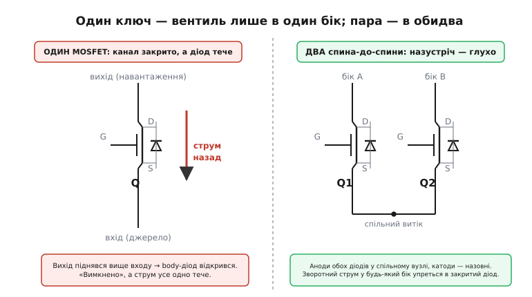
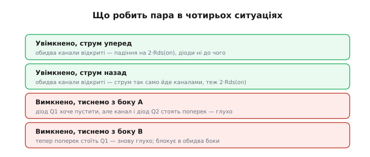
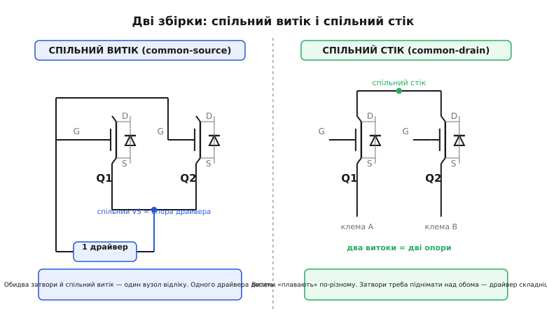

# MOSFET спина-до-спини і двосторонній ключ

Один польовий транзистор — прекрасний вимикач, але вимикач **однобічний**. Закрий його канал скільки завгодно щільно, а в один із двох напрямків струм усе одно пройде — крізь вбудований діод, якого ти не малював і не можеш прибрати. Тому там, де треба **справді** розірвати коло — щоб не текло в жоден бік, — ставлять не один транзистор, а **два, з'єднані спина-до-спини** (англ. *back-to-back* — «спинами разом»). Це найпоширеніший спосіб зробити з польових транзисторів двосторонній ключ, і саме він стереже кожен літієвий акумулятор у кишені. Розберемо, чому одного мало, як саме зводять два, які є дві збірки й чим вони відрізняються, і скільки це коштує в опорі та теплі.

### Звідки в транзисторі береться однобічність

Щоб зрозуміти рішення, треба спершу ясно побачити проблему — а вона схована в самій будові MOSFET. Транзистор роблять на пластині кремнію одного типу, це його **тіло** (англ. *body* — підкладка). Витік і стік — острівці протилежного типу в цьому тілі. Кожен перехід «острівець-у-тілі» — це pn-перехід, тобто **діод**. Виробник навмисно з'єднує тіло з витоком прямо на кристалі (інакше утворився б паразитний біполярник, здатний раптово «засунутися» і вбити чип), і в результаті між стоком та витоком лишається живий діод — **тіловий**, або **body-діод**. Він є в кожному польовому транзисторі без винятку; докладніше про його походження й орієнтацію — [окрема вставка](topic:hw-power/load-switch/comp-body-diode.md).

> 🔧 **Навіщо це знати.** Коли на схемі бачиш стрілку-діод між витоком і стоком MOSFET — це не декорація. Це реальний компонент, який працюватиме, хочеш ти того чи ні. Перше питання до будь-якого силового ключа: **куди дивиться його body-діод і коли він відкриється?**

Наслідок прямий. Керуючи затвором, ти вмикаєш і вимикаєш **канал**. Але body-діод затвора не слухає зовсім: відкритий канал чи закритий — діод живе своїм життям і проводить, щойно на ньому набереться прямих ~0.6 В. Тож «вимкнений» одинокий MOSFET — це не розрив кола, а **діод**: у той бік, куди діод дивиться, струм пройде вільно.

Уяви високобічний ключ: транзистор витоком на «плюс» живлення, стоком на навантаження. Body-діод там дивиться зі стоку на витік. Поки вхід вищий за вихід — усе гаразд, діод зворотно зміщений, мовчить. Але щойно на **виході** з'явиться напруга вища за вхід (сусідня шина підняла, підключили друге джерело, розряджається буферний конденсатор) — діод відкривається й жене струм **назад у джерело** крізь начебто вимкнений ключ.


*Ліворуч: канал одинокого ключа закрито, а вихід піднявся вище входу — body-діод відкрився й тече назад. Праворуч: два транзистори зі спільним витоком, їхні діоди аноди зведено в один вузол, катоди — назовні; зворотний струм у будь-який бік упирається в закритий діод.*

### Ліки: два транзистори назустріч

Ідея елегантна до простоти. Один діод пускає струм в один бік — візьмімо **другий транзистор і поставмо його дзеркально**, щоб його body-діод дивився **проти** першого. Тоді хоч куди штовхай зворотний струм, один із двох діодів завжди стоятиме поперек. Це і є з'єднання **спина-до-спини**: два MOSFET послідовно, body-діоди — назустріч один одному.

Простежмо всі чотири ситуації, бо саме в них видно, що пара робить, а одиночка — ні.


*Увімкнена пара проводить в обидва боки — струм іде крізь обидва відкриті канали (падіння на двох Rds(on), діоди ні до чого). Вимкнена — блокує в обидва боки: куди не тисни, поперек стоїть закритий канал одного з транзисторів, а його body-діод дивиться проти струму.*

**Увімкнено, струм уперед.** Обидва канали відкриті (затвори підняті разом). Струм тече крізь два послідовні канали, падіння — на двох Rds(on). Body-діоди при цьому байдужі: канал провідніший за діод, тож увесь струм іде каналами.

**Увімкнено, струм назад.** Те саме дзеркально. Обидва канали відкриті, і струм так само вільно йде крізь них у зворотний бік. Ось чому це **двосторонній ключ** (англ. *bidirectional switch*): у ввімкненому стані він проводить в обидва боки однаково добре, а MOSFET-канал і сам по собі провідний в обидва напрями (на відміну від діода). Пара нічим не гірша за одинарний ключ, коли відкрита.

**Вимкнено, тиснемо з боку A.** Обидва канали закриті. З боку A body-діод свого транзистора **готовий** пропустити — але щоб струм пройшов наскрізь, він мусить пройти й крізь другий транзистор, а там канал закритий, і його body-діод дивиться **проти** цього струму. Глухо.

**Вимкнено, тиснемо з боку B.** Дзеркально: тепер поперек стоїть перший транзистор. Знову глухо. Пара блокує в **обидва** боки — те, чого одинокий ключ не вміє в принципі.

Отже, головна властивість: **вимкнена пара — справжній розрив у обидва напрями; увімкнена — провідник у обидва напрями.** Один транзистор дає лише перше наполовину.

### Дві збірки: спільний витік і спільний стік

«Поставити назустріч» можна двома способами — залежно від того, які виводи зводять у спільну точку. Обидва працюють, але поводяться по-різному, і плутати їх не можна.


*Спільний витік (ліворуч): витоки обох транзисторів зведено в один вузол, стоки — назовні до клем. Цей вузол — спільна опора для обох затворів, тож одного драйвера досить. Спільний стік (праворуч): стоки зведено разом, а витоки «дивляться» назовні на дві клеми з різними потенціалами — керувати затворами складніше.*

**Спільний витік** (англ. *common-source*): витоки обох N-канальних транзисторів зводять у **спільний внутрішній вузол**, а стоки виводять назовні — до входу й до виходу. Головна перевага тут не в топології струму, а в **керуванні**. MOSFET відкривається напругою затвор-витік Vgs, що відлічується від витоку. А тут витік у обох **один і той самий** вузол. Тож достатньо підняти обидва затвори відносно цього спільного витоку — і **один драйвер** відкриває відразу два транзистори. Опора драйвера — спільний витік; підняв затвори на +10 В над ним — обидва канали розкрилися. Просто, дешево, надійно.

**Спільний стік** (англ. *common-drain*): навпаки, зводять **стоки**, а витоки виводять назовні на дві клеми. Тепер витоки двох транзисторів — це два **різні** вузли з різними, ще й «плаваючими» потенціалами (кожен сидить на своїй клемі). Керувати стало важче: щоб тримати обидва канали відкритими, треба підняти кожен затвор над **своїм** витоком, а витоки різні. Часто це вимагає окремого підняття напруги затвора над обома клемами. Зате спільний стік краще тримає **високу напругу** блокування, тому його беруть там, де на ключі бувають великі перепади.

> 🔧 **Навіщо це знати.** Побачив у батарейному захисті два FET у спареному корпусі — це майже напевно **спільний витік**: саме тому крихітний захисний чип керує обома одним виходом. Спільний стік упізнаєш там, де ключ рве високовольтну лінію й має окремий драйвер із підняттям напруги затвора. Перше, що дає збірка, — це відповідь на питання «звідки брати опору для Vgs».

Різницю в напрямі блокування варто уточнити, бо вона тонка. **Обидві** збірки блокують в обидва боки (у цьому весь сенс пари). Різниця — де опиняється спільний вузол при перевантаженні напругою й наскільки зручно піднімати затвори. Для більшості низьковольтних задач (батарея, USB, 5–24 В) беруть спільний витік — за простоту драйвера. Тому далі, кажучи «пара спина-до-спини» без уточнень, матимемо на увазі саме її.

### Головна ціна: подвійний опір

За двосторонність доводиться платити, і ціна видно одразу. Два канали **послідовно** — це **подвійний опір у відкритому стані**. Якщо один транзистор мав Rds(on) = 20 мОм, пара дає 40 мОм: удвічі більше падіння під струмом і **удвічі** більше тепла. Це не дрібниця для сильнострумового ключа, тож пару збирають із транзисторів удвічі «жирніших» (менший Rds(on)), ніж узяли б на одинарний ключ на той самий струм.

Порахуймо, у що обертається подвоєння на реальному прикладі.

**Двосторонній ключ у лінії батареї 3S (≈11 В), робочий струм 5 А. Транзистори з Rds(on) = 10 мОм кожен (гарячі — з даташита при робочій температурі). Скільки палить пара проти одинарного ключа?**

```
Одинарний ключ (гіпотетично, якби вистачило одного):
  R      = 10 мОм
  P_втр  = I² · R = 5² · 0.010 = 0.25 Вт
  падіння = I · R = 5 · 0.010  = 0.050 В

Пара спина-до-спини (два послідовно):
  R_пари = 2 · 10 мОм = 20 мОм
  P_втр  = I² · R = 5² · 0.020 = 0.50 Вт      ← удвічі більше тепла
  падіння = I · R = 5 · 0.020  = 0.100 В      ← удвічі більша просадка

Щоб повернути втрати до 0.25 Вт, треба вдвічі менший опір на транзистор:
  беремо Rds(on) = 5 мОм кожен → R_пари = 10 мОм → P = 0.25 Вт знову
```

**Висновок.** Двосторонність коштує рівно множника «два» в опорі. Хочеш ті самі втрати, що й на одинарному ключі, — бери транзистори з удвічі меншим Rds(on) (а це дорожчий і більший корпус). На малих струмах ця половина вата нічого не важить, на десятках ампер — це вже питання радіатора.

Тепловий бік має ще один нюанс, який легко проґавити. Rds(on) кремнієвого MOSFET **росте з нагрівом** — приблизно вдвічі від кімнатних 25 °C до робочих 100–125 °C. Тому в розрахунок беруть **гаряче** Rds(on) з даташита, а не кімнатне: інакше реальні втрати вийдуть удвічі вищими за очікувані. У парі це подвоєння діє на **обидва** транзистори одразу.

### Де це справді потрібно

Пару ставлять не всюди, а там, де зворотний струм — реальна загроза. Три класичні випадки.

**Захист літієвого акумулятора.** Це головна вотчина топології — і причина, чому вона в кожному телефоні й павербанку. [Захисна плата акумулятора](topic:hw-power/bms) мусить уміти окремо заборонити **заряд** і окремо — **розряд**: перезаряд і глибокий розряд руйнують комірку з різних боків. Але заряд і розряд течуть крізь ту саму лінію в **протилежних** напрямах. Одним ключем їх не розділити — body-діод пропустить один із них повз закритий канал. Тому ставлять два транзистори спина-до-спини (спільний витік), і захисний чип відкриває їх окремо: закрив «зарядний» — заряд заборонено, а розряд ще йде крізь другий канал і body-діод першого; закрив «розрядний» — навпаки. Саме звідси історично й пішла масовість цієї збірки; коротка [історія — окремо](topic:hw-power/mosfet-back-to-back/hist-battery-protector.md).

**Об'єднання джерел (power ORing).** Два входи — батарея й USB, два блоки живлення — заводять кожен на спільну шину. Вищий тримає навантаження, нижчий має **автоматично відсіктися**, і головне — струм не мусить потекти з сильнішого джерела **назад** у слабше. Простий діод на кожному вході зробив би це, але постійно палив би Vf·I. Пара спина-до-спини (або готовий контролер на її основі) блокує зворотний струм майже без втрат.

**Гаряча заміна й двонапрямні шини.** Там, де плату вставляють у живлену систему або де по лінії струм може текти в обидва боки (заряд і віддача накопичувача, спільна шина двох живлень), потрібен ключ, що ізолює **надійно, з будь-якого боку**. Одинарний ключ тут завжди лишить лазівку крізь свій діод.

Спільна нитка всіх трьох: **напруга може стрибнути вище з будь-якого боку ключа**. Якщо ж небажане живлення приходить лише з **одного** певного боку — часом досить просто **розвернути** один транзистор так, щоб його непрохідний бік стояв проти цього джерела, і другий не потрібен. Пара — це відповідь саме на невизначеність напряму.

### «Ідеальний діод» і готові мікросхеми

Ту саму пару використовують і як [«ідеальний діод»](topic:hw-power/ideal-diode) — заміну діода майже без падіння. Пасивний одинарний варіант (самозміщений P-MOS) блокує лише зворотний бік, а вперед завжди тече крізь body-діод. Для **справді** двостороннього блокування — коли треба відсікти струм з будь-якого напряму, ще й керовано — беруть або пару спина-до-спини, або **мікросхему-контролер**, у якій усередині рівно та сама пара плюс драйвер і логіка.

Розвертати й здвоювати транзистори вручну доводиться нечасто саме тому, що виробники давно спакували два FET спина-до-спини в один [ключ навантаження](topic:hw-power/load-switch) і вивели це окремим рядком у даташиті — **reverse current blocking** (RCB, блокування зворотного струму). Тут важлива тонкість формулювань:

- **Reverse current blocking** — блокує зворотний струм, **лише коли ключ вимкнено**. Поки ключ відкритий, обидва канали провідні, і зворотний струм пройде вільно.
- **True reverse current blocking** (істинне) — блокує з виходу на вхід **завжди**, щойно Vout перевищить Vin, байдуже, увімкнений ключ чи ні; мікросхема активно стежить за напрямом і розриває шлях.

> 🔧 **Навіщо це знати.** Слово *reverse current blocking* у специфікації ключа навантаження — це і є вбудована пара спина-до-спини. Немає його — вважай, що вимкнений ключ це діод, і вихід не відрізаний від входу. Треба відсічення в **будь-якому** стані — шукай рядок *true* RCB.

### Типові граблі

**Забути про подвійний опір.** Найчастіша помилка — узяти на пару транзистори «як на одинарний ключ» і здивуватися, чому гріється. Пара завжди має 2·Rds(on); закладай це в тепловий розрахунок від початку.

**Плутати збірку з драйвером.** Спробувати керувати **спільним стоком** так само, як спільним витоком (один драйвер від однієї точки), — і ключ не відкриється надійно, бо витоки різні й Vgs у другого транзистора вийде не той. Спершу з'ясуй, яка збірка, потім — звідки брати опору для затворів.

**Двосторонній ≠ ізольований у ввімкненому стані.** Пам'ятай: пара блокує обидва боки лише **вимкненою**. Увімкнена — вона провідник у обидва напрями, і зворотний струм пройде крізь канали вільно. Якщо треба заборонити зворотний струм, **не вимикаючи** прямий (як у power ORing), самої пари мало — потрібен контролер, що активно керує напрямом (*true* RCB).

**Межа напруги затвора.** У збірках, де Vgs формується самою напругою на ключі (самозміщені схеми), на високому вході Vgs може перевищити межу затвор-витік (типово ±20 В) і пробити [тонкий підзатворний оксид](topic:hw-components/mosfet-switch) — транзистор гине. Бережуть затвор стабілітроном або дільником; у парі — на **кожному** транзисторі свій.

**Тепло на обох, а не на одному.** Пара — це два джерела тепла поряд. У розведенні плати їм обом потрібен тепловідвід; гарячіший ще й матиме більший Rds(on) і тягтиме на себе більше падіння. Добре, що позитивний температурний коефіцієнт Rds(on) тут працює на вирівнювання: гарячіший канал трохи «відштовхує» струм.

### Як це стосується прошивки

Програмно body-діод «не вимикається» — про нього дбають залізом. Але код мусить **знати**, що вимкнений одинарний ключ ще не гарантує знеструмленого виходу, і не покладатися на «вимкнув — значить нуль». Якщо в схемі одинарний ключ, а вузол має бути гарантовано відрізаний, — код може лише **перевірити факт**, що вихід просів:

:::tabs
```arduino
// Гасимо ключ і ПЕРЕКОНУЄМОСЯ, що вихід зник.
// Одинарний ключ: якщо на виході чуже живлення, body-діод тримає напругу.
digitalWrite(SWITCH_EN, LOW);                 // закрили канал
delay(10);                                    // даємо ємності стекти

int raw = analogRead(VOUT_SENSE);             // дільник із виходу ключа
int mv  = (int)((long)raw * 5000L / 1023L);   // АЦП 10 біт, опора 5 В
if (mv > VOUT_OFF_THRESHOLD_MV) {
    // канал закрито, а напруга є → тече крізь body-діод (зворотне живлення)
    // справжнє відключення тут потребує пари спина-до-спини або true-RCB ключа
    Serial.print(F("vyhid ne znyksya, mV: "));
    Serial.println(mv);
}
```
```esp-idf
// Те саме на ESP-IDF: затвор — driver/gpio.h, вихід — oneshot-АЦП.
#include "driver/gpio.h"
#include "esp_adc/adc_oneshot.h"
#include "esp_adc/adc_cali.h"
#include "esp_log.h"
#include "freertos/FreeRTOS.h"
#include "freertos/task.h"

gpio_set_level(SWITCH_EN, 0);                 // закрили канал
vTaskDelay(pdMS_TO_TICKS(10));                // даємо ємності стекти

int raw = 0, mv = 0;                          // adc/cali заведені при ініціалізації
ESP_ERROR_CHECK(adc_oneshot_read(adc, VOUT_SENSE_CH, &raw));
ESP_ERROR_CHECK(adc_cali_raw_to_voltage(cali, raw, &mv));
if (mv > VOUT_OFF_THRESHOLD_MV) {
    // канал закрито, а напруга є → тече крізь body-діод (зворотне живлення)
    ESP_LOGW(TAG, "vyhid ne znyksya: %d mV — mozhlyve zhyvlennya kriz body-diod", mv);
}
```
```stm32
// Те саме на STM32 HAL: затвор — HAL_GPIO_WritePin, вихід — вбудований АЦП.
HAL_GPIO_WritePin(SWITCH_EN_GPIO_Port, SWITCH_EN_Pin, GPIO_PIN_RESET);  // закрили канал
HAL_Delay(10);                                                          // ємності стекти

uint32_t raw = 0;
HAL_ADC_Start(&hadc1);
if (HAL_ADC_PollForConversion(&hadc1, 10) == HAL_OK) raw = HAL_ADC_GetValue(&hadc1);
HAL_ADC_Stop(&hadc1);

uint32_t mv = raw * 3300u / 4095u;            // АЦП 12 біт, опора 3.3 В
if (mv > VOUT_OFF_THRESHOLD_MV) {
    // канал закрито, а напруга є → тече крізь body-діод (зворотне живлення)
    reverse_feed_detected = 1;                // прапорець для верхнього рівня
}
```
:::

А там, де стоїть **пара** з роздільним керуванням (як у батарейному захисті), прошивка дістає рідкісну змогу керувати напрямами **окремо**: увімкнути обидва канали — провід в обидва боки; лишити тільки «розрядний» — дозволити віддачу, заборонити приймання; закрити обидва — повний розрив. Це і є те, заради чого пару ставлять: два незалежні вимикачі на один і той самий провід.

:::tabs
```arduino
// Пара спина-до-спини з роздільними затворами (напр., у захисті батареї):
// два незалежні дозволи на одну лінію.
void power_path(bool allow_charge, bool allow_discharge) {
    digitalWrite(FET_CHG_EN, allow_charge   ? HIGH : LOW);  // канал напряму «заряд»
    digitalWrite(FET_DSG_EN, allow_discharge? HIGH : LOW);  // канал напряму «розряд»
    // обидва LOW → лінія розірвана в обидва боки (body-діоди назустріч)
    // обидва HIGH → провід в обидва боки (2·Rds(on))
}
```
```esp-idf
// Те саме на ESP-IDF: два звичайні виходи — два незалежні дозволи на одну лінію.
#include "driver/gpio.h"

void power_path_init(void) {
    gpio_config_t io = {
        .pin_bit_mask = (1ULL << FET_CHG_EN) | (1ULL << FET_DSG_EN),
        .mode = GPIO_MODE_OUTPUT,
    };
    ESP_ERROR_CHECK(gpio_config(&io));
}

void power_path(bool allow_charge, bool allow_discharge) {
    gpio_set_level(FET_CHG_EN, allow_charge    ? 1 : 0);    // канал напряму «заряд»
    gpio_set_level(FET_DSG_EN, allow_discharge ? 1 : 0);    // канал напряму «розряд»
    // обидва 0 → лінія розірвана в обидва боки (body-діоди назустріч)
    // обидва 1 → провід в обидва боки (2·Rds(on))
}
```
```stm32
// Те саме на STM32 HAL: два піни, налаштовані виходами (push-pull).
void power_path(bool allow_charge, bool allow_discharge) {
    HAL_GPIO_WritePin(FET_CHG_GPIO_Port, FET_CHG_Pin,
                      allow_charge ? GPIO_PIN_SET : GPIO_PIN_RESET);      // «заряд»
    HAL_GPIO_WritePin(FET_DSG_GPIO_Port, FET_DSG_Pin,
                      allow_discharge ? GPIO_PIN_SET : GPIO_PIN_RESET);   // «розряд»
    // обидва RESET → лінія розірвана в обидва боки (body-діоди назустріч)
    // обидва SET   → провід в обидва боки (2·Rds(on))
}
```
:::

> 🔧 **Навіщо це знати.** Головний висновок для розробника: **один MOSFET — ключ в один бік, два спина-до-спини — у обидва.** Треба гарантовано розірвати лінію, де напруга може прийти з будь-якого боку, — це пара (або ключ із рядком *reverse current blocking*). Ціна — подвійний Rds(on), тож бери транзистори з удвічі меншим опором. А для батарейного захисту й power ORing готові мікросхеми вже містять цю пару всередині — часто досить просто вибрати правильний рядок у специфікації.
