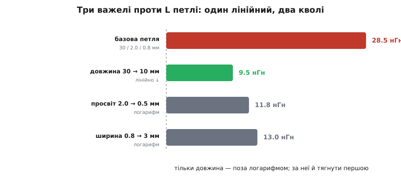
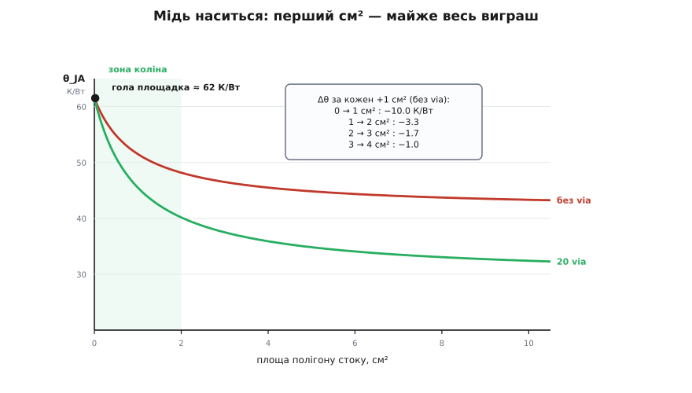

# ⚙️ Калькулятор розводки: з ескізу — викид, ширина, градуси

Ескіз плати вже перед очима: онде ключ, онде конденсатор, отут доріжка між ними, а внизу розлитий полігон стоку. Три речі вирішать, житиме ця плата чи димітиме, і жодної з трьох не видно оком на малюнку. Перша: коли ключ обірве струм, скільки вольтів викиду сяде на стік — і чи не перескочить пік межу транзистора. Друга: чи досить широка силова доріжка, щоб провести робочий струм і не спектися саме на собі. Третя: чи вистачить міді й перехідних отворів, щоб тепло стоку вивітрилося, а кристал лишився холодним. Кожне з трьох — коротка формула. Разом — півсторінки коду, що перетворює намальовану геометрію на вирок «працює / переробляй».

Написати цей код легко. Складне — не збрехати в ньому, бо кожна з трьох формул має рівно одне місце, де здоровий глузд підказує неправильне число. Розберімо всі три там, де вони брешуть, а тоді складімо в один скрипт, який рахує чесно.

## Задача: одне коло, три питання

Домовмося про коло, бо без нього слова «викид», «широка», «холодний» не мають міри.

```
шина            E     = 24 В
струм           I     = 10 А        (веде відкритий ключ)
вимкнення       di/dt = 10 А / 20 нс = 5·10⁸ А/с
опір відкритого Ron   = 8 мОм
межа ключа      V_max = 30 В        (абсолютний максимум стік–витік)
довкілля        T_a   = 40 °C       (усередині корпусу приладу)
```

Три питання до цього кола, і жодне не має відповіді на ескізі:

1. **Викид.** Петля силового струму має паразитну індуктивність. Коли ключ рве струм, ця індуктивність за законом [брикання котушки](root:hw-components/inductor-kickback) вихлюпує напругу V = L·di/dt, що додається до шини. Скільки саме — залежить від геометрії петлі, яку ми накреслили.
2. **Ширина.** Тими самими 10 А тече силова доріжка. Замала — і вона гріється власним [джоулевим теплом](root:ph-electromagnetism/joule-heating), просідає, а то й вигоряє. Яка ширина потрібна під заданий приріст температури?
3. **Градуси.** Ключ у відкритому стані розсіює I²·Ron і мусить віддати це тепло в мідь. Скільки міді й скільки via треба, щоб кристал не перегрівся?

Кожне питання — окрема функція. Спершу розберімо, що в кожній формулі неочевидне, бо саме там ховається різниця між калькулятором, який навчає, і калькулятором, який заспокоює брехнею.

## Ідея 1: індуктивність — не з площі, а з довжини й логарифма

Найпростіша картинка каже: «мідь має десь 1 нГн на міліметр, а петля — це площа». Вона годиться, щоб злякатися, але не годиться, щоб рахувати, — бо приховує, що насправді рухає індуктивність.

Петля — це струм, що йде **туди** одним провідником і **назад** іншим. Ці два зустрічні струми творять магнітне поле лише в проміжку між собою: зовні їхні поля майже гасяться. Тому індуктивність петлі задає не абстрактна «площа», а те, наскільки далеко рознесені прямий і зворотний шляхи та наскільки довго вони йдуть поряд. Для двох паралельних провідників завдовжки ℓ, рознесених на просвіт s, формула — класична:

```
L = (μ₀·ℓ / π) · ln( s / GMD )

μ₀ = 4π·10⁻⁷ Гн/м        μ₀/π = 4·10⁻⁷ Гн/м = 0.4 нГн/мм
GMD ≈ 0.2235·(w + t)      середня геометрична відстань перерізу доріжки
```

Тут GMD (англ. *geometric mean distance* — середня геометрична відстань) — це «ефективний радіус» плоскої доріжки завширшки w і завтовшки t; підстановка 0.2235·(w+t) уже враховує потік усередині самої міді, тож окремого внутрішнього доданка не треба. Головне — **де в цій формулі сидить кожна змінна**:

- **Довжина ℓ стоїть множником** — індуктивність зростає з нею **лінійно**. Удвічі коротша петля — удвічі менша L. Це найсильніший важіль.
- **Просвіт s і ширина w сидять під логарифмом** — вони міняють L **кволо**. Щоб удвічі зменшити ln(s/GMD), просвіт треба стиснути не вдвічі, а на порядок.

Ось чому «площа = індуктивність» — правда лише наполовину. Площа S = ℓ·s справді росте, коли росте будь-яка сторона, — але L реагує на ці сторони **по-різному**: на довжину лінійно, на просвіт логарифмічно. Калькулятор, який рахує L, а не площу, одразу показує, за який важіль тягнути першим.

> 🔧 **Навіщо це.** Коли на огляді плати хтось каже «зробімо доріжку ширшою, щоб збити індуктивність», формула відповідає: ширина під логарифмом, з неї майже нічого не вичавиш. А от підсунути конденсатор до ключа, скоротивши ℓ, — лінійний виграш задарма. Ширина доріжки рятує від тепла, а не від викиду; це різні задачі, і плутати їхні важелі — типова помилка першої плати.

## Ідея 2: ширина доріжки — крива 1950-х, а не фізика

Питання «яка ширина проведе 10 А» звучить так, ніби має точну відповідь із рівнянь теплопровідності. Насправді галузь користується **емпіричною кривою**, підігнаною під виміри ще з військового стандарту MIL-STD-275 середини минулого століття й закріпленою в IPC-2221:

```
I = k · ΔT⁰·⁴⁴ · A⁰·⁷²⁵

I  — струм, А
ΔT — дозволений приріст температури доріжки над довкіллям, °C
A  — площа перерізу доріжки, mil²  (квадратні мілі)
k  = 0.048 зовнішній шар  ·  0.024 внутрішній шар
```

Формула не виведена — вона **підігнана**: показники 0.44 і 0.725 не мають фізичного сенсу поза кривою, з якої їх зчитали. Але вона чесно передає два факти. Перший: внутрішній шар шаленіє вдвічі гірше (k удвічі менший), бо запечений у ламінат без обдуву; через показник 0.725 це означає, що тій самій доріжці всередині плати треба приблизно в 2.6 раза більший переріз. Другий, важливіший для нас: формула рахує ширину під **приріст температури**, а не під падіння напруги. Це різні бюджети, і про друге доведеться згадати окремо.

Щоб дістати ширину, обертаємо формулу: знаходимо потрібну площу перерізу, тоді ділимо на товщину міді. Товщина йде від «ваги» міді: 1 унція на квадратний фут (традиційна одиниця) — це 35 мкм, або 1.378 mil.

```
A(mil²) = ( I / (k·ΔT⁰·⁴⁴) )^(1/0.725)
ширина  = A / товщина_міді
```

## Ідея 3: мідь-радіатор — і чому вона швидко наситься

Тепло стоку виходить у мідь, розтікається нею й віддається повітрю. Здається, що більше міді — то холодніше, лінійно. Це неправда, і саме тут ховається головна пастка всієї теми.

Мідь тонка. Тепло, що вийшло з крихітної площадки, мусить **розтектися** нею вбік, перш ніж віддатися повітрю, — а тонкий шар чинить розтіканню опір. За кілька міліметрів від джерела мідь уже майже холодна: далекий її край тепла не бачить і повітрю нічого не віддає. Тому корисна площа **наситься**: перший квадратний сантиметр міді, що лежить впритул до гарячого, працює на повну; десятий, кудись у кут плати, майже дарма. [Тепловий опір](root:ph-thermodynamics/thermal-resistance) «кристал–повітря» падає з площею не прямо, а асимптотично, впираючись у стелю.

Точної формули цієї кривої з першопринципів немає — вона залежить від обдуву, кількості шарів, товщини міді. Тому калькулятор бере **насичувальну модель**, підігнану під типові виміряні криві, — рівно як інженер читає її з графіка в апнотах:

```
θ_JA(A, N) = θ_jc + θ_стеля(N) + (θ₀ − θ_стеля(N)) · A_коліно / (A + A_коліно)

θ_jc     — кристал → площадка (з даташита, мале)
θ₀       — гола площадка, A → 0
θ_стеля  — куди впирається крива при великій міді
A_коліно — площа, на якій крива згинається (~1 см²)
```

Дріб A_коліно/(A + A_коліно) — і є насичення: при A → 0 він дорівнює одиниці (θ = θ₀, гола площадка), при великій A прямує до нуля (θ → θ_стеля). А **перехідні отвори** опускають саму стелю: без них тепло віддає лише верхній бік, а стовпчик [теплових via](root:hw-pcb/thermal-vias) відкриває йому й нижній полігон плати, вмикаючи в роботу другий бік міді. Кожен via — тонка мідна трубка крізь плату; десяток-другий у паралель дає кілька К/Вт, тимчасом як сама склотканина під площадкою — сотні. Тож стелю моделюємо як спадання від однобічної до двобічної в міру того, як додаються via.

## Код

Усе разом — один скрипт. Мова — Python: це розрахунок за столом перед відправкою плати на виготовлення, який хочеться дописати й прогнати за вечір, а не прошивка приладу. Кожна з трьох функцій самостійна; наприкінці — сценарій нашого кола й друк вироку.

```python
import math
from dataclasses import dataclass

MU0 = 4e-7 * math.pi          # магнітна стала μ₀, Гн/м


# ── 1. Індуктивність петлі з геометрії ─────────────────────────────
@dataclass(frozen=True)
class Loop:
    """Силова петля як прямокутник: довжина туди-й-назад, просвіт, ширина."""
    length_mm: float          # ℓ — як далеко замикається петля
    gap_mm: float             # s — просвіт між прямим і зворотним шляхом
    width_mm: float           # w — ширина силової доріжки
    thick_um: float = 35.0    # товщина міді (1 унція ≈ 35 мкм)

    @property
    def area_mm2(self) -> float:
        return self.length_mm * self.gap_mm       # площа, яку охоплює петля

    def inductance_nH(self) -> float:
        # Два зустрічні провідники: L = (μ₀·ℓ/π)·ln(s/GMD).
        # GMD плоскої доріжки ≈ 0.2235·(w+t) — уже враховує внутрішній потік.
        w, t = self.width_mm * 1e-3, self.thick_um * 1e-6
        gmd = 0.2235 * (w + t)
        s, ell = self.gap_mm * 1e-3, self.length_mm * 1e-3
        ratio = max(s / gmd, 1.0)                  # s < GMD — провідники злиплися
        return (MU0 * ell / math.pi) * math.log(ratio) * 1e9


def overshoot_V(L_nH: float, di_A: float, dt_ns: float) -> float:
    """Викид на стоку при вимкненні: V = L·di/dt."""
    return (L_nH * 1e-9) * (di_A / (dt_ns * 1e-9))


# ── 2. Ширина силової доріжки за IPC-2221 ──────────────────────────
OZ_TO_MIL = 1.378             # 1 унція/фут² міді ≈ 1.378 mil ≈ 35 мкм

def ipc2221_width_mm(current_A: float, dT_C: float,
                     oz: float = 1.0, external: bool = True) -> float:
    """Ширина доріжки під заданий струм і приріст температури.
    Обертаємо I = k·ΔT^0.44·A^0.725 відносно площі перерізу, тоді ділимо
    на товщину міді. A — у квадратних мілях, як вимагає крива IPC."""
    k = 0.048 if external else 0.024
    area_mil2 = (current_A / (k * dT_C ** 0.44)) ** (1.0 / 0.725)
    width_mil = area_mil2 / (oz * OZ_TO_MIL)
    return width_mil * 0.0254                      # mil → мм


# ── 3. Тепловий опір полігону з via ────────────────────────────────
@dataclass(frozen=True)
class Thermal:
    """Насичувальна модель θ_JA(площа, via), підігнана під виміряні криві."""
    theta_jc: float = 1.5     # кристал → площадка, К/Вт (з даташита)
    theta0: float = 60.0      # гола площадка, край A → 0
    floor_1s: float = 40.0    # стеля з великою міддю, лише верхній бік
    floor_2s: float = 22.0    # ...коли via відкривають і нижній полігон
    knee_cm2: float = 1.0     # площа, на якій крива згинається (коліно)
    via_knee: float = 10.0    # скільки via дають половину виграшу від низу

    def theta_ja(self, area_cm2: float, n_via: int = 0) -> float:
        floor = self.floor_1s - (self.floor_1s - self.floor_2s) \
                * n_via / (n_via + self.via_knee)
        board = floor + (self.theta0 - floor) \
                * self.knee_cm2 / (area_cm2 + self.knee_cm2)
        return self.theta_jc + board


# ── Сценарій: 24 В, 10 А, вимкнення за 20 нс, ключ на 30 В ──────────
BUS, I, DI, DT = 24.0, 10.0, 10.0, 20.0
RON, DUTY, T_AMB, V_RATING = 8e-3, 1.0, 40.0, 30.0
P_cond = I * I * RON * DUTY                         # I²·Ron·D

print("── ПЕТЛЯ Й ВИКИД " + "─" * 40)
for tag, loop in [("недбала: конденсатор далеко", Loop(30.0, 2.0, 0.8)),
                  ("акуратна: конденсатор упритул", Loop(8.0, 0.5, 1.0))]:
    L = loop.inductance_nH()
    peak = BUS + overshoot_V(L, DI, DT)
    verdict = "OK" if peak <= V_RATING else "ПРОБІЙ"
    print(f"  {tag:32} площа {loop.area_mm2:5.1f} мм²  "
          f"L {L:5.1f} нГн  пік {peak:5.1f} В  [{verdict}]")

print("── ВАЖЕЛІ L: що насправді рухає індуктивність " + "─" * 12)
print(f"  базова 30/2.0/0.8 мм       : {Loop(30.0, 2.0, 0.8).inductance_nH():5.1f} нГн")
print(f"  довжина 30 → 10 мм (лінійно): {Loop(10.0, 2.0, 0.8).inductance_nH():5.1f} нГн")
print(f"  просвіт 2.0 → 0.5 мм (log)  : {Loop(30.0, 0.5, 0.8).inductance_nH():5.1f} нГн")
print(f"  ширина 0.8 → 3 мм (log)     : {Loop(30.0, 2.0, 3.0).inductance_nH():5.1f} нГн")

print("── ШИРИНА ДОРІЖКИ під 10 А (IPC-2221, зовнішній шар) " + "─" * 6)
for oz in (1.0, 2.0):
    for dT in (10.0, 20.0):
        print(f"  {oz:.0f} унц., ΔT {dT:.0f} °C : "
              f"{ipc2221_width_mm(I, dT, oz=oz):5.2f} мм")

print(f"── ПОЛІГОН І ГРАДУСИ (P = {P_cond:.2f} Вт, T_a = {T_AMB:.0f} °C) " + "─" * 8)
th = Thermal()
for A in (0.5, 1.0, 2.0, 4.0, 10.0):
    t0, tv = th.theta_ja(A, 0), th.theta_ja(A, 20)
    print(f"  {A:5.1f} см²:  без via θ {t0:4.1f} → T_j {T_AMB + P_cond*t0:5.1f} °C"
          f"   ·   20 via θ {tv:4.1f} → T_j {T_AMB + P_cond*tv:5.1f} °C")

print("── СПАД ВІДДАЧІ: що дає КОЖЕН доданий см² міді (без via) " + "─" * 3)
for a in range(6):
    gain = th.theta_ja(float(a), 0) - th.theta_ja(float(a + 1), 0)
    print(f"  {a} → {a+1} см² : {gain:+5.2f} К/Вт")
```

## Прогін

```
── ПЕТЛЯ Й ВИКИД ────────────────────────────────────────
  недбала: конденсатор далеко      площа  60.0 мм²  L  28.5 нГн  пік  38.2 В  [ПРОБІЙ]
  акуратна: конденсатор упритул    площа   4.0 мм²  L   2.5 нГн  пік  25.2 В  [OK]
── ВАЖЕЛІ L: що насправді рухає індуктивність ────────────
  базова 30/2.0/0.8 мм       :  28.5 нГн
  довжина 30 → 10 мм (лінійно):   9.5 нГн
  просвіт 2.0 → 0.5 мм (log)  :  11.8 нГн
  ширина 0.8 → 3 мм (log)     :  13.0 нГн
── ШИРИНА ДОРІЖКИ під 10 А (IPC-2221, зовнішній шар) ──────
  1 унц., ΔT 10 °C :  7.19 мм
  1 унц., ΔT 20 °C :  4.72 мм
  2 унц., ΔT 10 °C :  3.60 мм
  2 унц., ΔT 20 °C :  2.36 мм
── ПОЛІГОН І ГРАДУСИ (P = 0.80 Вт, T_a = 40 °C) ────────
    0.5 см²:  без via θ 54.8 → T_j  83.9 °C   ·   20 via θ 50.8 → T_j  80.7 °C
    1.0 см²:  без via θ 51.5 → T_j  81.2 °C   ·   20 via θ 45.5 → T_j  76.4 °C
    2.0 см²:  без via θ 48.2 → T_j  78.5 °C   ·   20 via θ 40.2 → T_j  72.1 °C
    4.0 см²:  без via θ 45.5 → T_j  76.4 °C   ·   20 via θ 35.9 → T_j  68.7 °C
   10.0 см²:  без via θ 43.3 → T_j  74.7 °C   ·   20 via θ 32.4 → T_j  65.9 °C
── СПАД ВІДДАЧІ: що дає КОЖЕН доданий см² міді (без via) ───
  0 → 1 см² : +10.00 К/Вт
  1 → 2 см² : +3.33 К/Вт
  2 → 3 см² : +1.67 К/Вт
  3 → 4 см² : +1.00 К/Вт
  4 → 5 см² : +0.67 К/Вт
  5 → 6 см² : +0.48 К/Вт
```

## Що з цього видно

**Та сама схема, той самий ключ — жива плата й мертва плата.** Недбала петля (конденсатор за три сантиметри, широкий просвіт) набрала 28.5 нГн; на нашому di/dt це 14 В викиду, пік 38 В — за межею 30-вольтового ключа, [лавинний пробій](root:hw-components/abs-max-ratings). Акуратна петля (конденсатор упритул, просвіт піврозміру) — 2.5 нГн, викид трохи більше вольта, пік 25 В із запасом. Різниця не в деталі з даташита, а в тому, де на платі лежить конденсатор. Калькулятор побачив це до того, як плата поїхала на завод.

**Найсильніший важіль — довжина, і він єдиний лінійний.** Погляньте на три рядки важелів, і стане видно, чому «зробімо ширше» — погана перша реакція. Від базових 28.5 нГн скорочення петлі втричі (30 → 10 мм) дало **9.5 нГн** — індуктивність упала теж утричі, лінійно. А розсунути просвіт учетверо тісніше чи розширити доріжку вчетверо ширше збили L лише до 11.8 і 13.0 нГн — на третину, бо обидва сидять під логарифмом. Урок числовий і чіткий: **насамперед коротшай петлю**, і аж потім, якщо треба, стискай просвіт; ширину для боротьби з викидом чіпати майже марно.



*Від тих самих 28.5 нГн: скоротити петлю втричі — це 9.5 нГн (лінійний виграш), а розсунути просвіт чи доріжку вчетверо — заледве до 12–13 нГн. Довжина — єдиний важіль поза логарифмом.*

**Десять ампер — це широчезна доріжка або товща мідь.** IPC-2221 просить під 10 А аж **7.2 мм** на звичайній унцевій міді за скромного приросту 10 °C. Дозволити доріжці грітися на 20 °C — і вистачить 4.7 мм; узяти двоунцеву мідь — 2.4 мм. Ось звідки на силових платах беруться широкі заливки й товста мідь: це не запас про всяк випадок, а пряма арифметика перерізу під струм.

**Мідь наситься після першого-другого сантиметра — і це головна пастка.** Дивіться на спад віддачі: **перший** квадратний сантиметр міді збиває θ_JA на цілих 10 К/Вт, другий — уже лише на 3.3, третій — на 1.7, п'ятий — на жалюгідні 0.7. Розлити півплати міддю під стоком — марна витрата місця: після ~2 см² крива майже лягла. А от **via працюють там, де мідь уже здалася**: на 2 см² вони опускають θ з 48 до 40 К/Вт — більше, ніж дав би ще один квадратний сантиметр верхньої міді. Бо вони не додають площі, а відкривають **другий бік** плати, тобто піднімають стелю, у яку впирається насичення.



*θ_JA проти площі полігону. Гола площадка — близько 62 К/Вт; перший см² бере майже весь виграш, після 2 см² крива майже пласка. Стовпчик via опускає нижню криву — не додаючи міді, а вмикаючи нижній бік плати.*

> 🔧 **Навіщо це.** Калькулятор не «оптимізує» — він **зупиняє марну роботу**. Побачивши, що після 2 см² мідь дає копійки, а десяток via — більше за наступний сантиметр, інженер перестає розливати полігон на пів плати й ставить натомість решітку отворів. Це і є нормальна роль розрахунку розводки: не вгадати ідеал, а показати, де віддача скінчилася.

## Складність і пастки

**«Площа петлі» — зручна брехня; чесна змінна — довжина.** Найспокусливіше — рахувати індуктивність із площі: мовляв, S = ℓ·s, ось і міра. Але L = (μ₀·ℓ/π)·ln(s/GMD): довжина лінійна, просвіт під логарифмом. Дві петлі однакової площі — довга й вузька проти короткої й широкої — мають **різну** індуктивність, і менша та, що коротша. Тому питання «яка площа петлі» веде не туди; питати треба «яка вона завдовжки», тобто як далеко лежить конденсатор. Площа — добрий сигнал тривоги, поганий інструмент.

**Ширша доріжка майже не збиває індуктивність — і от чому це не просто логарифм.** Ширина сидить у GMD під логарифмом, тож розширення доріжки вчетверо зменшує L лише на третину. Але є й гірше: на фронті в двадцять наносекунд струм не тече рівномірно всім перерізом. Через [поверхневий ефект](root:hw-components/skin-effect) і виштовхування сусіднім зворотним струмом він тулиться до країв доріжки, і серединна мідь майже порожня. Тобто навіть той кволий логарифмічний виграш від ширини на високому di/dt ще менший, ніж обіцяє формула. Ширина — інструмент проти **тепла**, не проти викиду; не переносьте її з однієї задачі на іншу.

**IPC-2221 рахує температуру, а не напругу — обидва бюджети окремі.** Крива дає ширину під **приріст температури** доріжки. Але та сама доріжка ще й **падає напругу** I·R, і на довгій тонкій жилі це падіння може стати проблемою раніше за нагрів — просадка живлення, зміщення опорних рівнів. Наш калькулятор відповідає лише на теплове питання; перевірку на падіння напруги (проста ланка I·R_доріжки) треба ставити поруч окремо. Дві плати з однаковим тепловим запасом можуть мати геть різну просадку, якщо одна веде струм здалеку.

**θ_JA — не властивість корпусу, а результат вимірювання на чиїйсь платі.** Число «62 К/Вт» у даташиті виглядає як паспорт деталі, а насправді його зміряли на **нормованій випробувальній платі** за стандартом JEDEC — з обумовленою міддю, без обдуву, у спокійному повітрі. Ваша плата не та. Мідь, via, сусіди, потік повітря міняють це число в рази — тому наша модель бере не паспортне θ_JA, а **будує** його з площі й via. Але й вона — підгонка під типові криві: коефіцієнти θ₀, стеля, коліно залежать від товщини міді, числа шарів і обдуву. Читайте вихід як **порядок і тенденцію** («перший см² важить, десятий — ні», «via опускають стелю»), а не як гарантію градуса. Точну цифру дає лише вимір на **вашій** платі або тепловий розрахунок методом скінченних елементів.

**Модель бачить середню температуру, а не гарячу пляму.** Уся теплова частина стоїть на припущенні, що кристал і мідь мають по одній температурі. У потужного ключа це неправда: він складений із тисяч паралельних комірок, струм збирається в найгарячішу, і локальна пляма буває значно гарячіша за «середню» θ_JA. Так само via в решітці гріються нерівномірно — ближчі до кристала беруть більше. Калькулятор відповідає на питання «чи є прийнятна **середня** рівновага», і не більше; питання «чи не пропалить локальна пляма» лежить за межами однієї теплової точки.

**І виграш від via не безмежний.** Десяток via опускає стелю добре, але двохсотий отвір нічого не додасть — з тієї ж причини, що й двохсотий квадратний сантиметр міді: нижній полігон теж наситься, а самі via забирають мідь із верхньої площадки, послаблюючи розтікання. Модель кладе половину виграшу низу на ~десяток via не випадково: далі знову спад віддачі, лише вже на нижньому боці. Ставити via треба **під площадкою й трохи довкола**, де мідь гаряча, а не рядами через усю плату.

## Коротко

Три питання до ескізу — три коротких формули, і кожна має пастку саме там, де око чекає простого. Індуктивність петлі йде **не з площі, а з довжини на логарифм просвіту**: коротшай петлю (лінійно!), тоді стискай просвіт, а ширину лиши тепловій задачі. Ширину доріжки дає емпірична крива IPC-2221 під **приріст температури** — і десять ампер просять або широчезну мідь, або товщу; падіння напруги перевіряй окремо. Тепловий опір **наситься після першого-другого сантиметра міді**, а далі працюють не квадратні сантиметри, а via, що відкривають другий бік плати.

Жодне з цих чисел не видно на схемі й жодне не стоїть у даташиті ключа — усі три народжуються рівно тоді, коли з ідеальних дротів схеми стають конкретні шматки міді на конкретній платі. Калькулятор не малює розводку за вас. Він робить інше, дорожче: показує, який важіль справді рухає кожне число, а який ви смикаєте намарно, — і зупиняє вас за крок до того, як ви розіллєте пів плати міддю або відправите на завод петлю, що вб'є ключ на першому ж вимкненні.
