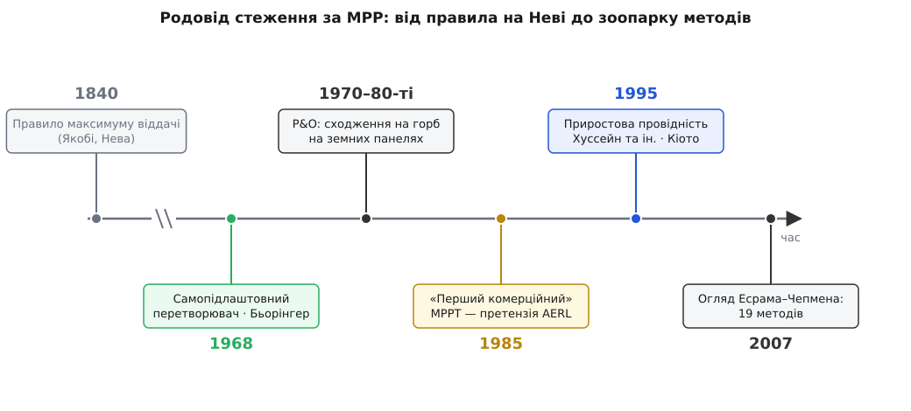

# 📜 Ват, який навчилися не марнувати: MPP-стеження родом із космосу

Уявіть, що ви конструюєте космічний апарат десь у середині 1960-х. Усе його життя тримається на кремнієвій панелі, пригвинченій до борту. Зробити панель більшою не можна — кожен зайвий кілограм на орбіту коштує як невеликий статок. Повернути її точно до Сонця теж не завжди виходить: апарат обертається або цілиться приладом у мішень, а не панеллю у світило. А сама панель — джерело примхливе: її [найкраща робоча точка](topic:hw-power/panel-iv-mpp) сповзає від кожної зміни світла й [температури](topic:hw-power/panel-temperature-coeff). Під'єднаєш її навпростець до батареї — і напруга батареї приб'є панель до випадкової точки її кривої, майже завжди не найкращої, а ти тихо викинеш чималу частку — часом до третини — тієї потужності, за виведення якої на орбіту заплачено золотом. У космосі таке марнотратство — не прикрість, а межа між робочим апаратом і мертвим. Саме з цього тиску й народилося стеження за максимумом.

## Чому космос, а не дах

На Землі 1960-х проблеми, власне, майже не було. Бракує вата — постав ще одну панель; землі під ногами й сонця над головою вдосталь, а самі елементи хоч і дорогі, та нікуди не летять. У космосі не так: там на вагу золота кожен грам і кожен ват, орієнтація часто задана раз і назавжди конструкцією, а система живлення мусить викохати максимум із того мізеру, що є.

Наочний приклад — зонд Sunblazer, який MIT разом із NASA готували в 1960-х, щоб просвітити радіохвилями сонячну корону. Його панель мала давати близько 30 Вт поблизу Сонця й лише 12 Вт удалині від нього — перепад у два з половиною рази вздовж усього шляху зонда. Коли весь твій енергетичний бюджет — дюжина ватів, лишити бодай п'яту частину висіти на кривій панелі просто нема з чого. Тут не до елегантності: або ти сидиш на горбі потужності завжди, або місія гасне.

## Самопідлаштовний перетворювач Бьорінгера (1968)

Розв'язок запропонував німецький інженер Андреас Бьорінгер (Andreas Boehringer, 1937 Штутгарт — 2001). У 1966–67 роках він працював у MIT над системами живлення для навколоземних супутників, а 1968-го надрукував у *IEEE Transactions on Aerospace and Electronic Systems* статтю з двомовною назвою — «Self-Adapting dc Converter for Solar Spacecraft Power Supply / Selbstanpassender Gleichstromwandler für die Energieversorgung eines Sonnensatelliten». Це — усталене стандартне посилання на найранішу ідею MPPT.

Задум його такий. Постав між панеллю та навантаженням [імпульсний перетворювач](topic:hw-power/switching-converter), який сам, автоматично, підганяє свій [вхідний опір](topic:hw-analog/impedance-matching) під панель — так, щоб та завжди стояла там, де віддає максимум. По суті це давнє правило максимальної віддачі: джерело віддає найбільшу потужність, коли опір навантаження дорівнює власному опору джерела. Правило старе — його зазвичай пов'язують з ім'ям німецького фізика Моріца фон Якобі, який вивів його близько 1840 року, працюючи в Петербурзькій академії над електричним човном на Неві. Тільки з однією прикрою поправкою: опір сонячного елемента не стоїть на місці — він повзе зі світлом і теплом. Тому підстроювання опору мусить бути не разовим, а **безперервним і самопідлаштовним**. Ось це «сам себе підганяю під рухому ціль» і є зерном, з якого виросло все MPP-стеження.

Перетворювач Бьорінгера будували саме для Sunblazer. Місію, щоправда, згодом скасували ще до першого запуску — тож слова з його анотації, що прилад «буде використано на супутнику Sunblazer», так і лишилися в майбутньому часі. Але сама схема пережила зонд: у габілітаційній праці (1969) Бьорінгер підвів під неї теорію — «метод характеристичних кривих» (нім. *Kennlinienverfahren*), тобто ведення робочої точки прямо по кривій елемента.

І ще одна деталь, важлива для всієї подальшої історії. Підганяти вхідну **провідність** перетворювача під робочу провідність панелі — це рівно та сама думка, що десятиліттями пізніше дістане ім'я «приростова провідність». Бьорінгер посадив зерно; назву й точний алгоритм воно отримає значно згодом.

> 🔧 **Навіщо ця історія.** Вона пояснює, чому MPPT так глибоко «зашите» саме в перетворювач, а не в окрему коробочку-радника збоку. Від самого початку — з 1968-го — стеження за максимумом і засіб керування (перетворювач, що підганяє опір) були одним пристроєм. Усі пізніші алгоритми лише по-різному відповідають на питання, яке вже стояло перед Бьорінгером: куди підкрутити, щоб панель віддала більше.

## Від однієї чистої гори — до земного зоопарку

У космосі крива потужності мала один охайний горб: ні дерев, ні хмари, що набігає за секунду, ні [часткової тіні](topic:hw-power/real-sun-mppt), яка робить криву горбатою з кількома піками. Тому й перших трекерів вистачало простих. А от коли після нафтових криз 1970-х фотовольтаїка посунула на Землю — на дахи, у телекомунікаційні вузли, до далеких насосів, — знадобилися трекери дешеві, які крутяться на копійчаному мікроконтролері, а не на замовному космічному перетворювачі.

Робочим конем став підхід, у якого немає одного винахідника, — «сходження на горб», воно ж Perturb & Observe: підштовхни робочу точку, глянь, чи зросла потужність, і якщо так — штовхай далі в той самий бік. Ідея настільки проста й стара, що приписати її одній людині чи одній статті годі; вона визрівала протягом кінця 1970-х і 1980-х. Ранні земні трекери часом навіть не додавали окремого збурення, а користалися готовим — 120-герцовою пульсацією самого інвертора як пробним поштовхом. Це радше фольклор інженерії, ніж чийсь патент.

## Приростова провідність дістає ім'я (1995)

Зерно Бьорінгера — рівняти провідність до провідності — довго лишалося принципом без чіткого рецепта. Рецепт з'явився 1995 року: група з Кіотського університету (Хуссейн, Мута, Хосіно, Осакада) надрукувала метод приростової провідності. Замість дивитися лише на те, зросла потужність чи впала, він порівнює приріст dI/dV із величиною −I/V — і з цього одразу знає, з якого боку від піка стоїть і коли вже точно на ньому. Ця праця — усталене стандартне посилання на сам названий алгоритм; від неї «приростова провідність» і пішла в підручники як окремий метод.

Варто помітити красу дуги: думку 1968 року (Бьорінгер, космос, узгодження провідностей) через двадцять сім років перетворили на конкретний алгоритм зовсім інші люди на іншому континенті — і вже для земних панелей, а не для супутника.

## Претензія на «перший комерційний»

А тепер шар, де історія завжди каламутніє, — маркетинг. У 1985 році Стюарт Воткінсон (Stuart Watkinson), випускник Квінслендського університету, заснував у гаражі в Брисбені компанію AERL (Australian Energy Research Laboratories) і зібрав пристрій «Power Optimizer», згодом названий AERL MAXIMIZER. Компанія й донині подає його як «перший у світі справді універсальний MPPT, що його розробили й випускали серійно».

Це формулювання варто читати уважно — і саме як **претензію компанії**, а не як установлений факт. Обидва застереження, «справді універсальний» і «серійно», роблять усю роботу: адже *сам принцип* був на той час уже сімнадцятирічним (Бьорінгер, 1968), а космічні апарати мали трекери максимальної потужності ще від 1960-х. Тож як заявка на перший **масовий земний** MPP-контролер заряду вона правдоподібна й широко повторювана; а от як «перший MPPT узагалі» — це рекламна претензія, не історія. Коротко: усталено — що AERL був серед піонерів побутового MPPT; спірно й радше маркетингово — що він був абсолютно першим.

## Зоопарк, що виріс з одного вата

До 2007 року галузь розрослася так, що Есрам і Чепмен змогли в одному огляді (*IEEE Transactions on Energy Conversion*) нарахувати дев'ятнадцять окремих методів MPPT: і P&O, і приростову провідність, і сталу напругу, і кореляцію пульсацій, і цілий звіринець нечітких, нейромережевих та роєвих варіантів. Але наскрізна нитка в усіх одна — та сама, що бентежила Бьорінгера над приреченим корональним зондом: як вичавити останній ват із **нерухомої** панелі, чия найкраща точка не стоїть на місці.

*Часова вісь не в масштабі: між правилом Якобі (≈1840) і перетворювачем Бьорінгера (1968) — понад століття, далі події густішають. Зелений вузол — народження ідеї MPPT у космосі; бурштиновий — комерційна претензія AERL (радше маркетинг, ніж установлений факт); синій — момент, коли приростова провідність дістала ім'я й алгоритм.*

І ось у чому сіль усього цього родоводу. Той самий трюк, що колись тримав живим супутник 1960-х, тепер сидить у контролері заряду за тридцять доларів на даху польової хатини. Тиск не змінився — фіксована панель, дорогий кожен ват; змінилася тільки ціна питання: не життя апарата, а повільне вмирання батареї. MPP-стеження прийшло з космосу на Землю, бо потреба виявилася всюди та сама.
