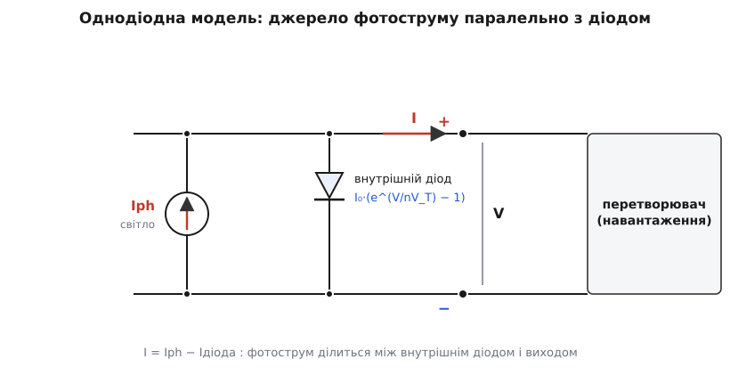
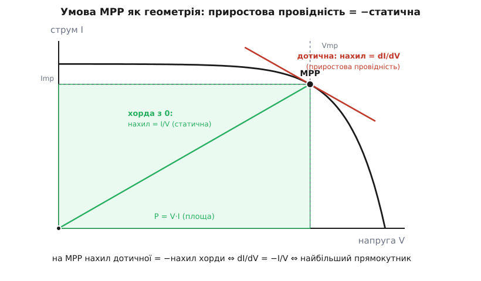
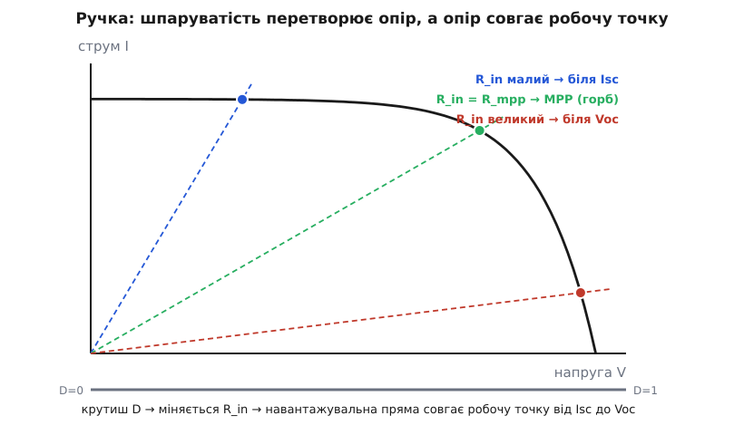

# 🧮 Горб і його вершина: математика точки максимальної потужності

Увесь трекер стоїть на двох припущеннях, які легко проковтнути не помітивши. Перше: у кривій потужності є **рівно один** горб — інакше «лізти вгору» не мало б сенсу. Друге: вершину того горба позначає ота таємнича рівність dI/dV = −I/V. Обидва беруться з одного місця — з **власного рівняння кривої панелі**. Виведемо його з першопринципів, тоді просто прочитаємо з нього вершину, а насамкінець побачимо, як шпаруватість перетворювача робиться повзунком уздовж цієї самої кривої.

### Звідки крива: панель — це джерело струму з діодом усередині

Спитаймо спершу, чому крива панелі саме така: чому струм тримається майже сталим уздовж усієї напруги, а тоді круто завалюється в нуль. Форма не випадкова — вона прямо випадає з того, як улаштована комірка.

Освітлена сонячна комірка робить дві речі водночас. По-перше, фотони вибивають носії заряду, і крізь перехід тече сталий **фотострум** Iph — тим більший, чим яскравіше світло (звідки він береться — [фотоелектричний ефект](root:ph-condensed/photovoltaic-cell)). По-друге, комірка фізично лишається звичайним [PN-переходом](root:ph-condensed/pn-junction) — тобто **діодом**, — і цей діод сидить просто на її ж виводах, нікуди не подівшись.

Складімо ці дві речі в одну схему: джерело сталого струму Iph, а паралельно йому — власний діод комірки. Куди подінеться фотострум? Він розтечеться на дві дороги. Частина піде **назовні**, у навантаження, — це і є корисний струм I. А частина завернеться назад **крізь власний діод** комірки, змарнувавшись усередині. Скільки саме завернеться — вирішує напруга на виводах: що вища напруга V, то сильніше вона зміщує внутрішній діод у прямому напрямі, і то жадібніше він відсмоктує струм на себе.


*Освітлена комірка — це джерело сталого фотоструму Iph з власним діодом на виводах. Що вища напруга V, то більшу частку Iph перехоплює внутрішній діод, і то менше лишається виходу I. Уся форма кривої панелі вже схована в цьому поділі.*

Запишімо баланс струмів на виводі — усе, що народив фотострум, або пішло назовні, або втекло в діод:

```
I = Iph − Iдіода
```

А струм діода підкоряється експоненті [рівняння Шоклі](root:hw-components/diode-iv-curve/math-shockley-equation.md):

```
I = Iph − I₀·(exp(V/(n·V_T)) − 1)
```

де I₀ — крихітний зворотний струм насичення діода, n — коефіцієнт ідеальності (від 1 до 2), а V_T = kT/q ≈ 26 мВ за 300 К — тепловий потенціал, себто теплова енергія, виражена у вольтах. Уся крива вже тут; лишається її прочитати, пройшовшись зліва направо.

- **V = 0 (коротке замикання).** Діод не бачить напруги, exp(0) − 1 = 0, тож він мовчить. Увесь фотострум іде назовні: I = Iph. Це і є струм короткого замикання Isc — верхня «поличка» кривої.
- **V росте.** Експонента прокидається й починає красти струм у навантаження — спершу непомітно, тоді дедалі швидше (на те вона й експонента). Тому струм спочатку майже не падає, а далі раптом завалюється.
- **I = 0 (холостий хід).** Тут діод з'їдає **весь** фотострум: Iph = I₀·(exp(Voc/(n·V_T)) − 1). Розв'язавши це відносно напруги, дістаємо напругу холостого ходу:

```
Voc = n·V_T · ln(Iph/I₀ + 1)
```

І ось перший важливий висновок, майже задарма. Voc залежить від світла **логарифмічно**, а Isc — **лінійно**. Подвойте освітлення: Isc подвоїться, а Voc підросте лише на n·V_T·ln2 ≈ 18 мВ. Ось чому яскравість тягне «поличку» струму вгору майже пропорційно, а праву межу кривої майже не рухає, — і чому [крива панелі](root:hw-power/panel-iv-mpp) зі зміною сонця більше «дихає» вгору-вниз, ніж їздить убік.

Одна тонкість про масштаб. Написане — рівняння **однієї комірки** (у неї Voc ≈ 0.6 В, бо V_T мале). Модуль — це N комірок послідовно, їхні напруги додаються, тож у показнику V ділиться на N: exp(V/(N·n·V_T)). Практично це значить, що модульна крива — це коміркова, розтягнута по горизонталі в N разів; уся математика горба, яку виводимо далі, лишається тією самою, тільки числа напруги більші.

### Звідки горб: добуток того, що росте, на те, що завалюється

Тепер — чому саме **горб**, а не проста монотонність. Потужність є добуток напруги на струм:

```
P(V) = V · I(V) = V · [Iph − I₀·(exp(V/(n·V_T)) − 1)]
```

Погляньмо на два множники нарізно. Зліва, біля V = 0, струм майже сталий (≈ Isc), тож P ≈ Isc·V — потужність росте майже прямою лінією, слухняно за напругою. Справа, біля Voc, усе навпаки: напруга висока, але струм експоненційно завалюється в нуль, і добуток V·I осідає назад до нуля попри велике V.

Отже, P дорівнює нулю на **обох** кінцях — при V = 0, бо немає напруги, і при V = Voc, бо немає струму, — а поміж ними додатна. Неперервна величина, що виходить із нуля, стає додатною й вертається в нуль, **мусить** десь мати максимум; це навіть не про панелі, це чиста неперервність. А оскільки струм спадає гладко й дедалі крутіше (експонента вигинає криву донизу), той максимум лише один: P(V) має єдину вершину. Ось математична гарантія «одного охайного горба», на якій тримається саме право сходити наосліп.

> 🔧 **Навіщо це.** Єдиність горба — не абстракція, а межа, за якою прості алгоритми ламаються. Щойно на панель лягає [часткова тінь](root:hw-power/real-sun-mppt), байпасні діоди роблять криву **сумою** кількох таких доданків; добуток V·I перестає бути опуклим, і горбів робиться декілька. Тоді все, що виводимо тут про єдину вершину, більше не правда, і сходження наосліп може застрягти на несправжньому, локальному піку. Тобто опуклість однодіодної кривої — це і є та умова, за якої трекерові взагалі можна довіряти.

### Вершина: чому саме dI/dV = −I/V

Ми знаємо, що вершина є й вона одна. Де вона? На вершині дотична до P(V) горизонтальна — [похідна](root:math-analysis/derivative) потужності по напрузі дорівнює нулю. Продиференціюймо добуток за правилом (V·I)′ = I + V·I′:

```
dP/dV = I + V·(dI/dV) = 0
```

Переставмо доданки — і дістанемо умову у формі, з якої виріс цілий клас алгоритмів:

```
V·(dI/dV) = −I      ⇒      dI/dV = −I/V
```

Прочитаймо її не як формулу, а як **геометрію**. Праворуч, I/V — це відношення струму до напруги в робочій точці, себто **статична провідність**: нахил прямої, проведеної з початку координат у робочу точку (хорди). Ліворуч, dI/dV — місцевий нахил самої кривої, **приростова провідність** (звідси й назва алгоритму — *incremental conductance*): наскільки зміниться струм, якщо трохи ворухнути напругу. Умова каже: **на MPP місцевий нахил кривої дорівнює за модулем нахилові хорди з початку координат — лише з протилежним знаком.**


*Статична провідність I/V — це нахил хорди з нуля в робочу точку; приростова dI/dV — нахил дотичної до кривої. Рівно на MPP вони збігаються за модулем (dI/dV = −I/V). Той самий факт видно і як площу: P = V·I — це вписаний прямокутник, а MPP — його найбільша площа.*

Ту саму рівність можна побачити ще наочніше — через **площу**. Потужність P = V·I — це площа прямокутника зі сторонами V та I, вписаного під криву з кутом у початку координат. Совгаючи робочу точку по кривій, ми роздуваємо чи стискаємо цей прямокутник; MPP — це його **найбільша** площа. А умова максимальної вписаної площі з математики й є та сама рівність нахилу дотичної нахилові хорди за модулем. Три погляди — нульова похідна потужності, рівність двох провідностей, найбільший прямокутник — це одна й та сама точка, лише названа по-різному.

З цієї рівності одразу випливає, куди крутити ручку, коли ми ще не на піку:

```
dI/dV  >  −I/V   → нахил кривої положистіший → ми ЛІВІШЕ піка  → підняти V
dI/dV  <  −I/V   → крива вже крута донизу     → ми ПРАВІШЕ піка → спустити V
dI/dV  =  −I/V   → нахили збіглися            → ми НА піку      → стояти
```

**Приклад (одна комірка, крок за кроком).** Візьмімо модель з Iph = 6.0 А, n·V_T = 33.7 мВ, звідки I₀ ≈ 61 нА (підігнано під Voc ≈ 0.62 В). Порахуймо в кількох точках статичну провідність I/V, приростову dI/dV і зведімо їх лице в лице:

```
V (В)   I (А)    P (Вт)   I/V     dI/dV    −I/V    де ми стоїмо
0.300   6.000    1.800    20.0    −0.01    −20.0   ЛІВІШЕ → підняти V
0.450   5.961    2.683    13.2    −1.15    −13.2   ЛІВІШЕ → підняти V
0.500   5.830    2.915    11.7    −5.06    −11.7   ЛІВІШЕ → підняти V
0.525   5.639    2.962    10.7    −10.7    −10.7   ← ВЕРШИНА (MPP)
0.550   5.248    2.887     9.5    −22.3     −9.5   ПРАВІШЕ → спустити V
0.600   2.686    1.611     4.5    −98.4     −4.5   ПРАВІШЕ → спустити V
```

Придивіться до двох останніх числових стовпців. Далеко зліва місцевий нахил майже нульовий (−0.01), а хорда крута (−20) — вони й близько не рівні, і потужність іще росте. Що ближче до вершини, то ці два числа сходяться; рівно на V ≈ 0.525 В вони збігаються (−10.7 = −10.7) — оце й є MPP, де P = 2.96 Вт найбільша. За вершиною приростова провідність шалено росте за модулем (знову експонента), лишаючи статичну далеко позаду. Алгоритмові досить порівняти два числа, щоб знати, з якого боку піка він стоїть — і, на відміну від сліпого «спробуй та порівняй», він може **впізнати саму рівність** і завмерти.

### Без ділення: форма для мікроконтролера

Рівність dI/dV = −I/V гарна на папері, але контролер міряє не похідні, а числа, і ділить неохоче. Двічі неохоче — бо ділити доводиться на V, а на старті чи в темряві V близьке до нуля, і таке ділення підриває арифметику. Приберімо його. Помножмо обидві частини на V:

```
V·(dI/dV) + I = 0
```

Похідної dI/dV контролер теж не має напряму — він має лише два сусідні виміри, тож оцінює її скінченною різницею dI/dV ≈ ΔI/ΔV, де ΔI та ΔV — прирости струму й напруги між двома тактами. Підставмо це й помножмо ще на ΔV, щоб прибрати зі знаменника й його:

```
V·ΔI + I·ΔV = 0      ⇔      ΔI·V = −I·ΔV
```

Ні ділення, ні небезпечного знаменника — самі множення й додавання, які мікроконтролер робить за лічені такти. Але тут ховається значно глибша річ, ніж просто «зручно рахувати». Придивімося до лівої частини, V·ΔI + I·ΔV. Це ж — з точністю до першого порядку — приріст **самого добутку**:

```
Δ(V·I) = I·ΔV + V·ΔI = ΔP
```

Тобто умова V·ΔI + I·ΔV = 0 буквально означає ΔP = 0 — «потужність перестала змінюватися». І ось несподіванка: та сама величина ΔP, за знаком якої орієнтується найпростіший, сліпий трекер, тут вигулькує з іншого боку. Це й пояснює, чому приростова провідність і сходження наосліп поводяться на диво схоже: **обидва зрештою дивляться на знак ΔP.** Уся різниця в тім, що приростова провідність не бере ΔP цілим, а **розкладає** його на два доданки — I·ΔV та V·ΔI — і саме через цей розклад уміє те, чого не вміє сліпий крок:

- **упізнати точну рівність** (ΔP = 0 прямо з розкладу), а отже завмерти на піку замість вічно топтатися навколо нього;
- **розрізнити причину** зміни: коли світло стрибнуло, міняється переважно струм (ΔI ≠ 0) за майже сталої напруги (ΔV ≈ 0) — у розкладі це видно окремими доданками, а сліпому «стало більше чи менше» — ні.

Чесна приписка про знаки. Сама **рівність** ΔI·V = −I·ΔV не має підводних каменів — нуль однаковий з обох боків. А от **нерівність** (з якого боку піка ми стоїмо) при переписуванні без ділення залежить від знака ΔV: множачи нерівність dI/dV vs −I/V на ΔV, ми перевертаємо її щоразу, коли ΔV < 0. Тому робочий алгоритм тримає окрему гілку на знак кроку напруги — і це та сама причина, чому й наосліп-трекер мусить пам'ятати, куди він щойно крокнув: ΔP і dP/dV збігаються знаком лише тоді, коли ΔV > 0. Математика чесно попереджає — напрям не можна прочитати з самого ΔP, не знаючи напряму кроку.

### Ручка: як шпаруватість стає повзунком по кривій

Лишилося пояснити третє диво: чому **одна** ручка — шпаруватість D — дістає **будь-яку** точку кривої, від короткого замикання до холостого ходу.

Робоча точка панелі — це перетин її кривої з **навантажувальною прямою**. Підключіть до панелі опір R — і за законом Ома струм із напругою зв'яжуться як I = V/R, тобто прямою з початку координат із нахилом 1/R. Де ця пряма перетне криву панелі, там і сяде робоча точка. Крута пряма (малий R) чиркне криву високо, біля Isc; полога (великий R) — низько, біля Voc.

Але між панеллю та батареєю стоїть не опір, а перетворювач, і весь його фокус у тім, що для панелі він [прикидається опором](root:hw-analog/impedance-matching), величину якого задає шпаруватість. Порахуймо цей уявний опір. Перетворювач майже без втрат, тож потужність на вході дорівнює потужності на виході: Vin·Iin = Vout·Iout. Далі — залежно від схеми.

Для [понижувального (buck)](root:hw-power/buck) перетворювача напруга падає в D разів, Vout = D·Vin, а струм відповідно росте, Iin = D·Iout (адже потужність та сама). Опір, який «бачить» панель на вході:

```
R_in = Vin/Iin = (Vout/D)/(D·Iout) = (Vout/Iout)/D² = R_load / D²
```

Для [підвищувального (boost)](root:hw-power/boost) — навпаки: Vout = Vin/(1−D), Iin = Iout/(1−D), звідки

```
R_in = Vin/Iin = R_load · (1−D)²
```

Тепер видно всю механіку ручки. Крутнеш D — зміниш R_in — навантажувальна пряма повернеться навколо початку координат — і робоча точка з'їде по кривій. Простежмо, як D пробігає свій діапазон:

- **boost, D → 1:** R_in = R_load·(1−D)² → 0. Пряма стає майже вертикальною, перетин — біля Isc (великий струм, мала напруга).
- **boost, D → 0:** R_in → R_load. Точка з'їжджає праворуч.
- **buck, D → 1:** R_in = R_load/D² → R_load (найменший, який buck здатний віддати).
- **buck, D → 0:** R_in → ∞. Пряма кладеться майже горизонтально, перетин — біля Voc.


*Робоча точка сидить там, де навантажувальна пряма I = V/R_in перетинає криву панелі. Малий R_in (крута пряма) садить її біля Isc, великий (полога) — біля Voc, а R_in = R_mpp влучає в горб. Шпаруватість монотонно міняє R_in, тож один прогін D від краю до краю протягує панель по всій кривій.*

Одне тонке місце варто назвати чесно. Сам-один buck дає R_in лише від R_load до нескінченності — тобто дістає **верхню** (високовольтну) половину кривої; сам-один boost дає R_in від нуля до R_load — **нижню**. Щоб один повзунок покрив **усю** криву від Isc до Voc, потрібна схема, чий R_in пробігає весь діапазон, — понижувально-підвищувальна (buck-boost) з R_in = R_load·((1−D)/D)²: при D від 0 до 1 цей вираз повзе від нескінченності до нуля, накриваючи криву цілком. На практиці схему добирають так, щоб потрібний MPP-опір R_mpp = Vmp/Imp напевно лежав у досяжному діапазоні (панель вища за батарею — беруть buck; нижча — boost).

А тепер — чому саме **весь** діапазон і саме **безперервно**, без пропусків. Бо ланцюг «D → R_in → робоча точка» монотонний на кожній ланці. R_in — гладка монотонна функція D. Крива панелі спадна, тож навантажувальна пряма з будь-яким нахилом перетинає її **рівно раз**, і що положистіша пряма (більший R_in), то правіше сидить перетин. Складімо дві монотонності — і робоча точка виходить неперервною монотонною функцією D. Тому один прогін D від краю до краю **протягує** панель по всій кривій, від Isc до Voc, проходячи вершину рівно раз. А раз V монотонна по D, а P одногорба по V, то **P одногорба й по D** — саме тому сходження безпосередньо по ручці коректне: горб один і в координатах шпаруватості.

**Приклад (перетворення опору).** Хай батарея-навантаження виглядає для перетворювача як R_load = 3 Ом, а панелі для MPP треба свій R_mpp. Ось що віддають три схеми за різних D:

```
схема        R_in(D)              D = 0.3    D = 0.5    D = 0.7
buck         R_load / D²          33.3 Ом    12.0 Ом    6.1 Ом
boost        R_load·(1−D)²         1.47 Ом    0.75 Ом    0.27 Ом
buck-boost   R_load·((1−D)/D)²    16.3 Ом     3.00 Ом    0.55 Ом
```

Видно і діапазони, і поділ праці: buck тримається вище R_load = 3 Ом, boost — нижче, а buck-boost проходить крізь R_load (при D = 0.5 віддає рівно 3 Ом) і сягає обох країв. Хай панелі для MPP треба R_mpp = 0.75 Ом — boost влучає в нього при D = 0.5; треба 16 Ом — buck-boost дає його при D = 0.3. Одне число D — і панель опиняється в потрібній точці своєї кривої.

### Де це працює

Три викладені речі — це весь кістяк під трекером, кожна на своєму місці. **Однодіодне рівняння** пояснює, чому крива має форму «поличка та обрив» і чому горб на добутку V·I єдиний, — а заразом окреслює межу, за якою (часткова тінь, сума доданків) ця єдиність ламається й прості алгоритми губляться. **Рівність dI/dV = −I/V** — це точна ціль, яку контролер намацує: збіг приростової та статичної провідностей, він же найбільший вписаний прямокутник, він же у формі без ділення V·ΔI + I·ΔV = 0, тобто ΔP = 0 — той самий приріст, за яким сходить і найпростіший трекер, лише розкладений на доданки, що дають упізнати пік і відрізнити стрибок світла. А **R_in(D) = R_load/D²** чи **R_load·(1−D)²** — це відповідь на «чому однієї ручки досить»: шпаруватість монотонно перетворює опір, опір монотонно совгає робочу точку, тож один повзунок дістає кожну точку кривої й проходить її вершину рівно раз. Формули тут не прикраса до теми — вони і є та тема, лише записана так, що з неї видно, чому все влаштовано саме так, а не інакше.
