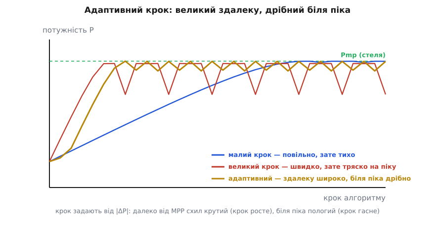
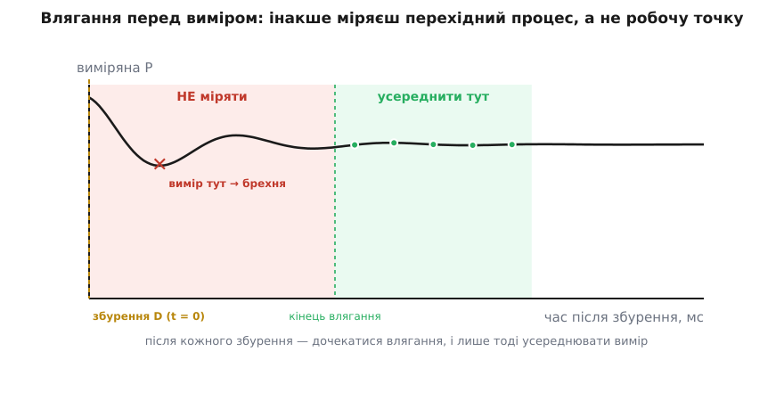
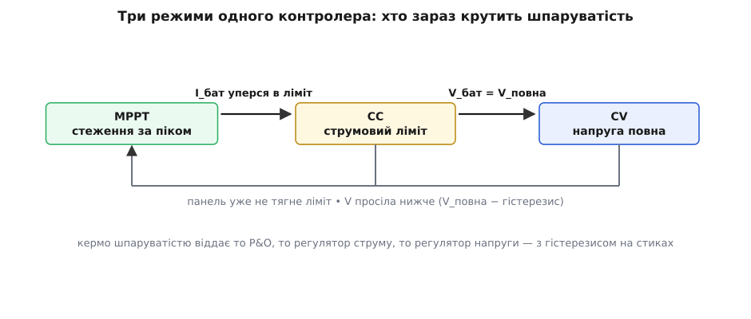

# ⚙️ Робочий трекер P&O: від сирого АЦП до шпаруватості

Ідею Perturb & Observe можна вмістити на серветці: зміряй потужність, крутни шпаруватість, зміряй знову; стало більше — той самий напрям, стало менше — розвернись. Десять рядків коду. От тільки якщо залити ці десять рядків у реальний контролер сонячного заряду, він поводитиметься огидно: смикатиме шпаруватість від шуму, міритиме перехідні процеси замість робочої точки, дрейфуватиме геть за хмари й весело переливатиме батарею через край, бо про батарею в тих десяти рядках немає ні слова.

Уся різниця між іграшкою й робочим трекером — у тому, що іграшка викидає. Розберімо повний прошивковий трекер P&O шар за шаром — вимір, рішення, час, запобіжники, передача керма — так, щоб у кінці лишився код, який справді можна залити в мікроконтролер сонячного вузла. А тоді пройдімося пастками, кожна з яких уже когось підводила на робочій платі.

### Задача: чого бракує серветці

Випишімо чесно, що саме десятирядкова версія мовчки припускає — і чому кожне з цих припущень на залізі не справджується.

- **«Зміряй потужність»** — а вимір сирий і шумний. Струм та напруга на вході перетворювача завжди в брижах ШІМ; один відлік [АЦП](topic:hw-analog/adc) — це не робоча точка, а випадкова мить на пульсації. Годуй алгоритм сирим АЦП — і шум сам клацатиме напрям.
- **«Крутни й одразу міряй»** — а перетворювач після збурення не стрибає в нову точку миттєво: він гойдається кілька десятків мікросекунд чи навіть мілісекунд. Зміряєш зарано — оціниш перехідний процес.
- **`p = v * i`** — а на дешевому мікроконтролері без блока з рухомою комою множення float коштує десятки тактів. На гарячому шляху, що крутиться кілогерцами, це марнотратство.
- **Крок сталий** — а сталий крок programує в контролер вроджену ваду: великий швидкий, але тряский на піку; малий тихий, але повільний за хмари. Робочий трекер робить крок **адаптивним**.
- **Немає меж** — шпаруватість може вилізти в нуль чи в насичення; на старті стрибок повної потужності б'є по конденсаторах і батареї. Потрібні **кламп** і **м'який старт**.
- **Немає батареї** — а MPPT керує лише доти, доки батарея здатна проковтнути все, що дає панель. Повна батарея чи струмовий ліміт — і кермо треба **віддати** регулюванню [заряду](topic:hw-power/cc-cv-bms).

Отже, задача не «написати P&O», а обстроїти його всім тим, без чого він на залізі не живе. Почнімо з фундаменту — арифметики.

### Одиниці: цілі числа замість рухомої коми

Перше рішення робочого трекера — **не чіпати float узагалі**. Домовмося тримати напругу в мілівольтах, струм у міліамперах, потужність у мікроватах. Уся хитрість в одному спостереженні: добуток мВ×мА одразу дає **мікровати**, і ці мікровати влазять у 32-бітне ціле з добрячим запасом.

```
16 В × 5 А  =  16000 мВ × 5000 мА  =  8·10⁷ мкВт
стеля int32  ≈  2.1·10⁹            → запас понад 25×
навіть 30 В × 8 А = 2.4·10⁸ мкВт   → усе одно вільно
```

> 🔧 **Навіщо це.** Ціла арифметика тут не аскеза, а швидкодія й передбачуваність. Множення `int32 × int32` — це один такт на будь-якому ядрі; float на МК без FPU — це виклик бібліотечної процедури й десятки тактів із непередбачуваним часом, а нам потрібен рівний період такту. Хто хоче дробів (коефіцієнти фільтра, підсилення) — тримає їх [фіксованою комою](topic:hw-arch/fixed-point): дріб як ціле, зсунуте на кілька бітів, замість рухомої коми. Тому весь трекер нижче — цілочисловий від АЦП до шпаруватості.

```c
#include <stdint.h>
#include <stdbool.h>

// Зовнішні залежності від драйверів конкретного МК:
extern uint16_t adc_read_raw(uint8_t ch);   // один сирий відлік 0..ADC_MAX
extern void     pwm_set_duty(uint16_t duty); // шпаруватість в одиницях таймера

#define ADC_MAX     4095u   // 12-бітний АЦП
#define CH_PANEL_V  0u
#define CH_PANEL_I  1u
#define CH_BATT_V   2u
#define CH_BATT_I   3u

// Калібрування «відлік → величина» лінійне: величина = відлік·(NUM/DEN).
// Дріб тримаємо цілим. Числа — приклад під конкретний дільник напруги й
// підсилювач шунта; на своїй платі їх заміряти й підставити.
#define PANEL_V_NUM 26000u   // повна шкала ≈ 26 В
#define PANEL_V_DEN  4095u
#define PANEL_I_NUM  8000u   // повна шкала ≈ 8 А
#define PANEL_I_DEN  4095u
```

### Шар виміру: усереднення плюс легкий фільтр

Один відлік недовірливий одразу з двох причин: брижі ШІМ і випадковий шум АЦП. Обидві лікуються усередненням, тільки різного роду. Спершу **передискретизація** — узяти кілька сирих відліків поспіль і усереднити ([ковзне середнє](topic:com-signal/moving-average) в найпростішій формі): якщо вікно накриває кілька періодів пульсації, брижі значною мірою скорочуються самі. Далі — легкий **експоненційний фільтр** ([EMA](topic:com-signal/ema)) поверх усередненого, щоб згладити повільний шум, не тримаючи довгого буфера.

Тонкість, на якій спотикаються: наївний цілий EMA `y += (x − y) >> k` **втрачає молодші біти** — коли різниця `x − y` менша за `2ᵏ`, зсув дає нуль, і фільтр застрягає, не доходячи до входу (мертва зона). Правильний цілий EMA тримає стан у **збільшеному масштабі** (×2ᵏ) і зсуває лише на виході — тоді молодші біти накопичуються, а не гинуть.

Струм міряють на [шунті](topic:hw-components/shunt-resistor) — малому точному резисторі, спад напруги на якому пропорційний струмові; докладніше про відбір напруги й струму на вході перетворювача — у [вимірюванні перетворювача](topic:hw-power/converter-measure).

```c
// Передискретизація: N сирих відліків → середнє (N — степінь двійки).
#define OVERSAMPLE  16u

static uint16_t adc_avg(uint8_t ch) {
    uint32_t acc = 0;
    for (uint8_t i = 0; i < OVERSAMPLE; ++i)
        acc += adc_read_raw(ch);
    return (uint16_t)(acc / OVERSAMPLE);   // компілятор зробить зсув
}

static inline uint16_t raw_to_mv(uint16_t code) {
    return (uint16_t)(((uint32_t)code * PANEL_V_NUM) / PANEL_V_DEN);
}
static inline uint16_t raw_to_ma(uint16_t code) {
    return (uint16_t)(((uint32_t)code * PANEL_I_NUM) / PANEL_I_DEN);
}

// EMA без втрати молодших бітів: стан у масштабі ×2^k, зсув лише на виході.
//   s += x − (s >> k);   значення = s >> k
typedef struct { int32_t s; bool primed; } ema_t;

static uint16_t ema_upd(ema_t *f, uint16_t x, uint8_t k) {
    if (!f->primed) { f->s = (int32_t)x << k; f->primed = true; }
    f->s += (int32_t)x - (f->s >> k);
    return (uint16_t)(f->s >> k);
}
```

Тепер зберемо один вимір у пакет — напруга, струм і одразу потужність у мікроватах:

```c
#define EMA_K  2u    // сила згладжування: більший k — тихіше, але повільніше

typedef struct {
    uint16_t vmv;    // напруга панелі, мВ
    uint16_t ima;    // струм панелі, мА
    int32_t  puw;    // потужність, мкВт
} meas_t;

static ema_t f_v, f_i;

static meas_t measure_panel(void) {
    meas_t m;
    m.vmv = ema_upd(&f_v, raw_to_mv(adc_avg(CH_PANEL_V)), EMA_K);
    m.ima = ema_upd(&f_i, raw_to_ma(adc_avg(CH_PANEL_I)), EMA_K);
    m.puw = (int32_t)m.vmv * (int32_t)m.ima;   // мВ×мА = мкВт, влазить у int32
    return m;
}
```

### Ядро P&O з адаптивним кроком

Тепер серце. Логіка сходження та сама: впала потужність — розвернути напрям. Але додаємо два робочі елементи, яких у серветковій версії немає, — **зону нечутливості** й **адаптивний крок**.

Зона нечутливості (deadband) на ΔP — це відповідь на шум пульсацій. На піку сусідні виміри відрізняються на копійки, і половина цих копійок — просто шум. Якщо розвертати напрям на будь-яку від'ємну ΔP, контролер клацатиме туди-сюди від самого шуму, навіть стоячи рівно на MPP. Тому напрям розвертаємо, лише коли потужність **відчутно** впала — на більше за поріг шуму; дрібні коливання в межах поро́га вважаємо за «нічого не змінилось».

Адаптивний крок — відповідь на дилему «швидко проти тихо». Ідея тонка й гарна: **мірою відстані до піка служить сам модуль приросту |ΔP|**. Далеко від MPP схил потужності крутий, тож той самий крок шпаруватості дає велике |ΔP| — і ми сміливо крокуємо широко. Біля піка схил пологий, |ΔP| гасне само собою — і крок стає дрібним без жодного окремого «детектора близькості». Крок просто **пропорційний |ΔP|**, затиснутий між мінімумом і максимумом.


*Малий фіксований крок повзе до стелі поволі, зате майже не гойдається; великий доганяє Pmp за кілька кроків, але на піку пиляє широкою пилкою, гублячи потужність; адаптивний бере краще з обох — здалеку крокує широко, а біля піка сам мілішає. Розмір кроку не задають наперед, його диктує |ΔP|: крутий схил — великий крок, пологий — дрібний.*

```c
// ── Ядро Perturb & Observe з адаптивним кроком ─────────────────────────────
#define DUTY_MIN      80u     // не даємо перетворювачу впасти в нуль
#define DUTY_MAX     900u     // і не заганяємо в насичення (одиниці таймера)
#define STEP_MIN       1u     // найдрібніший крок біля піка
#define STEP_MAX      24u     // найбільший крок здалеку
#define DP_DEADBAND  30000    // мкВт (30 мВт): поріг шуму — менше не реагуємо
#define STEP_GAIN_SH   14     // |ΔP| >> 14 → крок; коефіцієнт підбирають під плату

static uint16_t duty   = DUTY_MIN;
static int32_t  p_prev = 0;
static int8_t   dir    = +1;

static uint16_t clamp_duty(int32_t d) {
    if (d < DUTY_MIN) return DUTY_MIN;
    if (d > DUTY_MAX) return DUTY_MAX;
    return (uint16_t)d;
}

// Крок пропорційний |ΔP|, затиснутий у [STEP_MIN, STEP_MAX].
static uint16_t adaptive_step(int32_t dp_abs) {
    uint32_t s = (uint32_t)dp_abs >> STEP_GAIN_SH;
    if (s < STEP_MIN) s = STEP_MIN;
    if (s > STEP_MAX) s = STEP_MAX;
    return (uint16_t)s;
}

// Один крок рішення P&O. Викликати ЛИШЕ після влягання й на свіжому,
// усередненому за вікно вимірі — інакше рішення випадкове (див. нижче).
static void po_decide(const meas_t *m) {
    int32_t dp = m->puw - p_prev;

    if (dp < -DP_DEADBAND)       // потужність ВІДЧУТНО впала —
        dir = -dir;              //   минулий крок був не туди, розвернутись
    // |dp| ≤ DP_DEADBAND — у межах шуму, напрям лишаємо (інакше пульсації
    //   самі клацали б dir туди-сюди на піку).

    uint16_t step = adaptive_step(dp < 0 ? -dp : dp);
    duty = clamp_duty((int32_t)duty + dir * (int32_t)step);
    pwm_set_duty(duty);          // ЦЕ і є збурення D

    p_prev = m->puw;             // запам'ятати для наступного порівняння
}
```

### Час: влягання, вбудоване в такт

Ось де серветкова версія найтихіше бреше. Між рядком «крутни D» і рядком «зміряй знову» на залізі минає **перехідний процес**: індуктор і конденсатори перетворювача перекочують заряд у нову рівновагу кілька десятків мікросекунд, а з великою ємністю чи млявою петлею — і мілісекунди. Зміряєш посеред цього гойдання — і оціниш не нову робочу точку, а брижі; рішення вийде випадкове, і трекер танцюватиме навмання.

Лік один: після кожного збурення **дочекатися влягання** й лише тоді міряти. Але «дочекатися» треба зробити правильно — не блокувальним `delay()`, що заморозить увесь контролер, а фазовим тактом. Розіб'ємо роботу на дві фази й крутімо їх від рівного мілісекундного таймера: у фазі **влягання** просто мовчки чекаємо SETTLE_MS, нічого не міряючи; у фазі **виміру** протягом MEAS_MS збираємо усереднену потужність — і аж тоді даємо рішення. Крок стеження навмисно повільніший за динаміку перетворювача.


*Збурили шпаруватість — і потужність не стрибнула в нову точку, а загойдалася. Червона зона — влягання: міряти тут означає читати перехідний процес, а не робочу точку (звідси випадкові рішення). Аж коли гойдання вляглося, відкривається зелене вікно, де кілька усереднень дають чесне значення. Правило залізне: спершу влягання, потім вимір.*

```c
// ── Фазовий такт: влягання ВБУДОВАНЕ, а не «сподіваємось на delay» ─────────
#define SETTLE_MS  6u    // > динаміки перетворювача: чекаємо влягання
#define MEAS_MS    3u    // скільки мс збирати усереднений вимір

typedef enum { PH_SETTLE, PH_MEASURE } phase_t;

static phase_t  phase      = PH_SETTLE;
static uint16_t ph_ms      = 0;
static int32_t  meas_acc_p = 0;   // акумулятор потужності за вікно виміру
static uint16_t meas_n     = 0;
```

Сам крок фазового циклу впишемо у верхній такт трохи нижче — спершу доберімо два запобіжники, без яких трекер небезпечний уже на першій секунді.

### М'який старт і кламп шпаруватості

Кламп ми вже маємо — `clamp_duty()` не дасть шпаруватості вилізти в нуль чи в насичення на **кожному** записі. Лишається старт. Якщо на ввімкненні одразу задати робочу шпаруватість, перетворювач шарпне повну потужність у розряджені конденсатори й батарею — кидок струму, просідання, а то й спрацювання захисту. Тому шпаруватість піднімають **плавно** від безпечного низу — [м'який старт](topic:hw-power/soft-start-circuits): маленькими приростами за такт, доки не дійде до скромної відправної точки, з якої P&O уже сам поведе стеження.

```c
// ── М'який старт: плавно підняти шпаруватість від безпечного низу ──────────
#define SOFT_TARGET  (DUTY_MIN + 40u)   // куди дійти, перш ніж пускати P&O
#define SOFT_STEP     2u                // приріст за 1 мс

static bool soft_done = false;

static void soft_start_tick(void) {
    if (duty + SOFT_STEP >= SOFT_TARGET) { duty = SOFT_TARGET; soft_done = true; }
    else                                   duty += SOFT_STEP;
    pwm_set_duty(clamp_duty(duty));
}
```

### Наглядач: коли віддати кермо заряду

І головне, чого немає в жодній серветці: трекер **не завжди трекер**. Поки батарея голодна, MPPT має рацію — бери від панелі максимум. Та щойно струм заряду вперся в паспортний ліміт або напруга дійшла до порога «повна», гнатися за максимумом потужності вже **шкідливо**: зайву потужність нема куди подіти, крім як переливати батарею. Тут кермо шпаруватістю перехоплює регулювання [заряду](topic:hw-power/cc-cv-bms): спершу тримати сталий струм (CC), тоді сталу напругу (CV).

Виходить один контролер із трьома режимами, що передають кермо один одному. Наглядач лише перемикає, **хто зараз крутить D** — P&O, регулятор струму чи регулятор напруги, — а на стиках ставить **гістерезис**, щоб режими не деренчали туди-сюди на самій межі.


*Поки батарея бере все — працює MPPT. Струм уперся в ліміт — кермо переходить до регулятора струму (CC). Напруга дійшла до «повної» — до регулятора напруги (CV). Назад у MPPT повертаються, лише коли умова відпустила з запасом (гістерезис), інакше на межі режими деренчали б. Дуга внизу — повернення до стеження, коли панель уже не тягне ліміт або напруга просіла.*

```c
// ── Наглядач: коли MPPT має відпустити кермо ───────────────────────────────
#define I_BATT_LIMIT_MA  3000    // паспортний струм заряду
#define V_BATT_FULL_MV  14200    // поріг CV (приклад: 4S LiFePO4)
#define V_FULL_HYST_MV    200     // гістерезис повернення в MPPT з CV
#define I_LIMIT_HYST_MA   150     // гістерезис повернення в MPPT з CC

typedef enum { MODE_MPPT, MODE_CC, MODE_CV } mode_t;
static mode_t mode = MODE_MPPT;

static void supervisor_update(uint16_t vbatt_mv, uint16_t ibatt_ma) {
    switch (mode) {
    case MODE_MPPT:
        if      (vbatt_mv >= V_BATT_FULL_MV)   mode = MODE_CV;   // напруга повна
        else if (ibatt_ma >= I_BATT_LIMIT_MA)  mode = MODE_CC;   // струм на ліміті
        break;
    case MODE_CC:
        if      (vbatt_mv >= V_BATT_FULL_MV)   mode = MODE_CV;
        else if (ibatt_ma <  I_BATT_LIMIT_MA - I_LIMIT_HYST_MA) mode = MODE_MPPT;
        break;
    case MODE_CV:
        if (vbatt_mv < V_BATT_FULL_MV - V_FULL_HYST_MV) mode = MODE_MPPT;
        break;
    }
}
```

Самі регулятори CC/CV тут навмисно найпростіші — повільний інтегральний нудж шпаруватості до цілі із зоною нечутливості. Знак реакції (побільшити D підніме чи опустить вихід) залежить від топології перетворювача, тож винесений у сталу. Серйозна плата поставить сюди повноцінну петлю [зі зворотним зв'язком](topic:hw-power/control-loop-compensation) з належним підсиленням і захистом від насичення інтегратора; для демонстрації передачі керма досить нуджа.

```c
#define REG_SIGN     (+1)   // напрям «побільшити D → підняти вихід»: під плату
#define REG_DEAD_MV   50
#define REG_DEAD_MA   40

static void regulate_cv(uint16_t vbatt_mv) {           // тримати напругу
    int32_t e = (int32_t)V_BATT_FULL_MV - (int32_t)vbatt_mv;
    if (e >  REG_DEAD_MV) duty = clamp_duty((int32_t)duty + REG_SIGN);
    if (e < -REG_DEAD_MV) duty = clamp_duty((int32_t)duty - REG_SIGN);
    pwm_set_duty(duty);
}
static void regulate_cc(uint16_t ibatt_ma) {           // тримати струм
    int32_t e = (int32_t)I_BATT_LIMIT_MA - (int32_t)ibatt_ma;
    if (e >  REG_DEAD_MA) duty = clamp_duty((int32_t)duty + REG_SIGN);
    if (e < -REG_DEAD_MA) duty = clamp_duty((int32_t)duty - REG_SIGN);
    pwm_set_duty(duty);
}
```

### Верхній такт: усе разом

Тепер зшиваємо шари в одну функцію, яку таймер кличе рівно раз на мілісекунду. Порядок такий: спершу відпрацювати м'який старт; далі наглядач вибирає режим; якщо кермо не в MPPT — його крутить регулятор заряду; якщо в MPPT — обертається фазовий цикл із вбудованим вляганням.

```c
extern uint16_t adc_batt_vmv(void);   // напруга батареї (свої канали, ті ж усереднення)
extern uint16_t adc_batt_ima(void);   // струм заряду

// Викликати РІВНО раз на 1 мс (з таймера).
void tracker_tick(void) {
    if (!soft_done) { soft_start_tick(); return; }   // 1) спершу м'який старт

    uint16_t vb = adc_batt_vmv();
    uint16_t ib = adc_batt_ima();
    supervisor_update(vb, ib);                        // 2) хто крутить D?

    if (mode != MODE_MPPT) {                          // 3) кермо в регулятора заряду
        if (mode == MODE_CV) regulate_cv(vb);
        else                 regulate_cc(ib);
        phase = PH_SETTLE; ph_ms = 0;                 //   скинути фазу P&O на потім
        return;
    }

    // 4) MODE_MPPT: фазовий цикл «влягання → вимір → рішення»
    if (phase == PH_SETTLE) {
        if (++ph_ms >= SETTLE_MS) {                   // влягання скінчилось
            phase = PH_MEASURE; ph_ms = 0;
            meas_acc_p = 0; meas_n = 0;
        }
        return;                                       // МОВЧКИ чекаємо, не міряємо
    }

    // PH_MEASURE: збираємо усереднену потужність за вікно
    meas_t m = measure_panel();
    meas_acc_p += m.puw;
    ++meas_n;
    if (++ph_ms >= MEAS_MS) {                         // вікно заповнене — рішення
        meas_t avg = m;
        avg.puw = meas_acc_p / (int32_t)meas_n;       // середнє за вікно
        po_decide(&avg);                              // збурити D у (можливо) новому напрямі
        phase = PH_SETTLE; ph_ms = 0;                 // і знову чекати влягання
    }
}
```

Ось і повний трекер: сирий АЦП угорі, шпаруватість унизу, а поміж них — усереднення, фільтр, цілочислова потужність, адаптивний крок із зоною нечутливості, вбудоване влягання, м'який старт, кламп і наглядач із гістерезисом. Тепер — пастки, бо кожен із цих шматочків має свій спосіб зіпсувати життя.

### Складність і пастки

**Вимір під час перехідного процесу.** Найпоширеніша й найтихіша помилка — зміряти зарано. Її вже закрито фазою PH_SETTLE, але варто розуміти механізм: після збурення D потужність не стрибає, а гойдається; вимір посеред гойдання — це вимір випадкової миті пульсації, і рішення виходить випадкове. Симптом на стенді — трекер «нервує»: смикає шпаруватість навіть за рівного сонця. Лік — збільшувати SETTLE_MS, доки нервозність не зникне; правильне влягання завжди повільніше за динаміку самого перетворювача. Не спокушайтеся зробити такт швидшим «щоб краще стежити»: швидший за влягання такт не стежить краще, він стежить за шумом.

**Шум пульсацій, що клацає напрям.** Навіть по вляганні лишаються брижі ШІМ, і на пласкому піку сусідні виміри плавають у їхніх межах. Без запобіжника кожна випадкова від'ємна ΔP розвертає напрям — трекер деренчить на місці, недобираючи потужності. Три заслони працюють разом: **усереднення** цілого вікна (кілька періодів пульсації скорочуються), **EMA-фільтр** згладжує залишок, а **зона нечутливості** DP_DEADBAND не дає реагувати на ΔP, менші за шум. Поріг ставлять трохи вищим за спостережений розмах шуму ΔP на піку — завузький пропускає деренчання, зашироких робить трекер млявим до справжніх змін. Ще сильніший хід — **синхронний відбір**: замикати вибірку АЦП на ту саму фазу періоду ШІМ, тоді пульсація постійно ловиться в тій самій точці й почасти скорочується сама.

**Дрейф за швидкої зміни освітлення.** Найпідступніша пастка й вроджена вада самого P&O. Уявіть: рівно поки триває наш пробний крок, набігає просвіток і світло **швидко зростає**. Потужність піднялася — але не тому, що ми крутнули ручку правильно, а тому що просто стало більше сонця. Алгоритм цього не розрізняє, зараховує крок як «вдалий» і крокує далі в цьому напрямі — і може піти **геть від MPP**, поки світло змінюється. Це задокументований збій, і зветься він саме дрейфом (*drift*); за швидко наростної засвітки він тим гірший, чим більший крок, — тобто адаптивний крок, який ми додали задля швидкості, дрейф навіть **підсилює**.

Класичний лік — «drift-free» P&O — додає до рішення знак **приросту струму** ΔI. Логіка така: коли робоча точка рухається вздовж **однієї** кривої, напруга й струм міняються злагоджено; а коли підскочило світло, струм стрибає майже **незалежно** від того, куди ми крутнули напругу. Тож якщо одночасно ΔP > 0 **і** ΔI помітно додатний — це підозра, що потужність зросла через світло, а не через наш крок, і напрям цим кроком підтверджувати не можна.

```c
// Захист від дрейфу: додатковий свідок — знак ΔI. Викликати всередині
// рішення, маючи і ΔP, і ΔI за той самий інтервал.
static bool drift_suspected(int32_t dp, int32_t di_ma) {
    // P зросла І струм різко скочив угору → скоріш за все, це СВІТЛО, не крок.
    return (dp > 0) && (di_ma > DI_LIGHT_JUMP_MA);
}
// Тоді у po_decide(): якщо drift_suspected(...) — НЕ вважати крок вдалим,
// напрям лишити як був (не підтверджувати рухом світла).
```

**Адаптивний крок, що втратив стійкість.** Коефіцієнт STEP_GAIN_SH — це підсилення зворотного зв'язку, і задерши його, дістанете класичну нестійкість: завеликі кроки перестрибують пік із запасом, наступне велике |ΔP| штовхає ще дужче, і трекер розгойдується замість збігатися. Тому крок **обов'язково** затиснутий зверху (STEP_MAX), а коефіцієнт підбирають на стенді від малого вгору, доки стеження лишається спокійним. Це той самий компроміс, що й у будь-якій петлі: більше підсилення — швидше, але ближче до дзвону.

**Переповнення й одиниці.** Цілочислова арифметика швидка, але мовчазна: перевищив int32 — і потужність тихо стане від'ємною, а трекер піде в протилежний бік. Тому варто раз прикинути найгірший добуток `vmv × ima` для своєї панелі (ми це зробили: 8·10⁷ мкВт при 16 В·5 А, із запасом понад 25×) і тримати проміжні акумулятори (наприклад `meas_acc_p` за вікно) теж у 32 бітах із перевіреним запасом, а при потребі — у 64.

**Деренчання на стику режимів.** Без гістерезису наглядач на самій межі «повна / не повна» перемикав би MODE_CV ↔ MODE_MPPT щотакту: у CV напруга просідає під навантаженням регулятора, умова відпускає, вертаємось у MPPT, напруга знову лізе вгору — і так деренчати. V_FULL_HYST_MV та I_LIMIT_HYST_MA дають цим переходам «люфт»: увійшли в режим за одним порогом, вийшли за помітно іншим. Для геть спокійного стику додають ще й **мінімальний час перебування** в режимі — не перемикатися частіше, ніж, скажімо, раз на сотню мілісекунд, — щоб швидкоплинна хмара не смикала режими.

Підсумок усього проєкту — одне речення, яке варто тримати в голові, беручись за MPPT-прошивку. **Робочим трекер роблять не десять рядків самого P&O, а все, чим їх обстроюють: чесний вимір (усереднення, фільтр, зона нечутливості), чесний час (влягання перед виміром), чесні межі (кламп, м'який старт) і чесне знання, коли замовкнути й віддати кермо заряду.** Серветкова версія показує ідею; усе інше в цьому файлі — різниця між ідеєю та приладом, що збирає енергію цілий день і не переливає батарею на заході.
