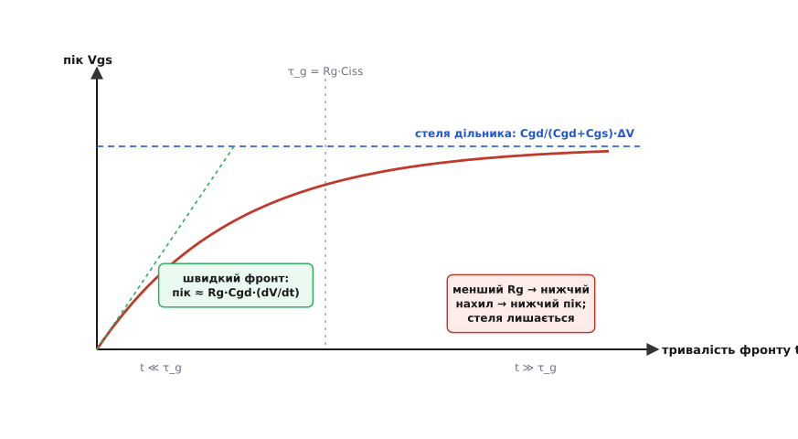
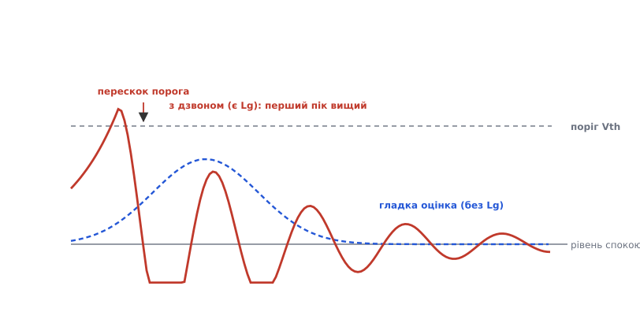

# 🧮 Скільки саме мінуса: розрахунок паразитного сплеску Vgs

> Питання стоїть інженерно точно: **на скільки вольтів** заглибити вимкнений затвор у мінус, щоб поштовх від сусіднього плеча гарантовано не долетів до порога? Відповідь — не «на око», а виводиться з тих самих законів, що керують ємністю й опором. Тут ми пройдемо цей вивід від першопричини: від струму крізь паразитну ємність до висоти сплеску, тоді врахуємо динаміку (затвор — не чистий резистор, а RC-, а насправді RLC-коло) і врешті отримаємо формулу глибини від'ємної шини з живими числами під SiC та кремній.

<preknowlist>
- [Ємність затвора](topic:hw-components/gate-capacitance) — між стоком і затвором сидить паразитна ємність Cgd (вона ж Crss); вхідна ємність Ciss = Cgs + Cgd — те, що драйвер мусить перезаряджати.
- [Ефект Міллера](topic:hw-analog/miller-effect) — стрибок напруги на стоку через Cgd впорскує струм у затвор; та сама ємність зв'язує стік із затвором в обидва боки.
- [Стала RC](topic:hw-analog/rc-time-constant) — коло «опір + ємність» згладжує стрибок струму з характерним часом τ = R·C; за час, коротший за τ, ємність «не встигає» набрати повну напругу.
- [Похідна](topic:math-analysis/derivative) — dV/dt тут буквально миттєва швидкість зміни напруги на вузлі, вольтів за секунду.
</preknowlist>

## Що ми взагалі рахуємо

У напівмості два ключі стоять один над одним, спільний вузол між ними — це стік нижнього ключа. Коли драйвер вмикає **верхній** ключ, спільний вузол стрімко злітає вгору, і вся ця швидка зміна напруги припадає на стік нижнього — того, що якраз мусить бути **закритий**. Між стоком і затвором нижнього ключа сидить паразитна ємність Cgd, і крізь неї стрибок стоку впорскує струм прямо в затвор. Драйвер тримає затвор притиснутим, але не ідеально жорстко — між ним і затвором є опір, на якому впорснутий струм створює падіння напруги. Це падіння **піднімає** затвор над рівнем спокою. Якщо воно перестрибне поріг Vth — закритий ключ на мить прочиниться сам.

Величина, яку ми виводимо, — це **пік того підняття**, Vgs(сплеск): наскільки високо злітає напруга затвор–витік вимкненого ключа під час цього удару. Виведемо її двічі — спершу грубо (миттєвий погляд), тоді точно (з динамікою) — і кожен раз побачимо, від чого вона залежить. А коли знатимемо пік, глибина мінуса випаде сама: треба лише опустити стартову точку настільки, щоб пік не дістав порога.

> 🔧 **Навіщо це.** Це не академічна вправа: саме за цією арифметикою в реальному проєкті вирішують, чи ставити від'ємну шину взагалі, і якщо так — на −2 В її робити чи на −5 В. Помилишся вниз — ключ хибно прочиняється й гріється чи гине; переборщиш угору на SiC — попливе сам поріг приладу (про це в кінці). Тобто число тут — компроміс із двома небезпеками, і його треба вміти прикинути, а не вгадати.

## Крок перший: струм, який ніхто не замовляв

Почнімо з найпершого — зі струму крізь Cgd. Конденсатор пов'язує струм крізь себе зі швидкістю зміни напруги на своїх обкладках. Це не постулат, а прямий наслідок означення ємності Q = C·V: заряд на обкладках пропорційний напрузі. Продиференціюймо по часу — і побачимо, що струм (а струм і є швидкість руху заряду, i = dQ/dt) дорівнює:

```
i = dQ/dt = d(C·V)/dt = C · dV/dt        (ємність стала)
```

Ось звідки береться вся справа. Поки одна обкладка Cgd (стік) стоїть на місці, dV/dt = 0 і струму немає. Але щойно стік рушає вгору зі швидкістю dV/dt, крізь Cgd негайно тече струм, пропорційний цій швидкості:

```
i(Міллера) = Cgd · dV/dt
```

Підставмо числа, типові для доброго напівмоста. Хай Cgd = 30 пФ (звичайна Crss для середнього силового ключа), а сусіднє плече жене фронт зі швидкістю dV/dt = 40 В/нс:

```
i = 30·10⁻¹² Ф · 40·10⁹ В/с
i = 30 · 40 · 10⁻³ А
i = 1.2 А
```

Понад ампер — у затвор, який мав тихо сидіти. Зверніть увагу на структуру: струм **не залежить** ні від опору кола затвора, ні від порога — лише від ємності Cgd і від того, як швидко перемикається сусід. Це чисто «нагнітальна» частина: скільки заряду за секунду вбивається в затвор. Куди він дінеться й наскільки підніме напругу — це вже наступний крок, де вступає опір.

Одразу видно і два важелі, якими на цей струм впливають. Cgd — властивість приладу (у паспорті це Crss), її беруть якнайменшою при виборі ключа. А dV/dt — властивість **сусіднього** плеча й того, як швидко його женуть; сповільниш той фронт (більший резистор затвора на вмиканні верхнього ключа, [снабер](topic:hw-power/snubbers-dvdt)) — і струм упаде пропорційно. Але сповільнювати фронти — значить платити [втратами перемикання](topic:hw-components/switching-losses), тож цей важіль тягнуть неохоче.

## Крок другий: сплеск як падіння на опорі

Тепер — куди подінеться цей струм. Драйвер тримає вимкнений затвор притиснутим до витоку, але між виходом драйвера й самим затвором завжди є опір. Він складається з двох частин: **внутрішній опір** нижнього (розрядного) плеча драйвера R(drv) плюс **зовнішній резистор** затвора на вимиканні Rg(off), який ставлять на платі. Позначимо суму:

```
Rg = R(drv) + Rg(off)
```

У найгрубішому наближенні весь впорснутий струм тече крізь цей опір на витік, і на ньому за законом Ома падає напруга. Оце падіння й піднімає затвор над рівнем спокою:

```
Vgs(сплеск) ≈ i · Rg = Cgd · dV/dt · Rg
```

Підставмо: Rg = 5 Ом (скажімо, 2 Ом усередині драйвера + 3 Ом зовнішній), струм ті самі 1.2 А:

```
Vgs(сплеск) ≈ 1.2 А · 5 Ом = 6 В
```

Шість вольтів сплеску. Якщо поріг ключа Vth = 3 В, сплеск **удвічі** перекриває поріг — ключ прочиняється навстіж. Це і є базова формула паразитного сплеску, і в ній уже видно всі три важелі оборони: **менша Cgd**, **повільніший dV/dt** і **менший Rg**. Останній — найдешевший і найпряміший: сплеск лінійний за Rg, а тягнути Rg вниз (сильніший драйвер, менший зовнішній резистор на вимикання) не коштує втрат перемикання, на відміну від сповільнення фронту.

Тут доречно застерегти від пастки. Може здатися, що сплеск тим менший, чим більший Rg — адже великий опір «гасить» струм. Це хибне читання формули: струм i задається ємністю й dV/dt і **не залежить** від Rg (він тече крізь Cgd, а не крізь Rg). Rg лише перетворює цей заданий струм на напругу; більший Rg дає **більшу** напругу сплеску, не меншу. Тому для придушення паразитного ввімкнення розрядний Rg роблять **малим**. (Це, до речі, одна з причин, чому вигідно мати **окремий** шлях на вимикання: вмикати можна через більший резистор — плавніше, менше дзвону, — а вимикати через маленький, щоб притиснути затвор жорстко.)


*Два режими одного явища. Швидкий фронт (t ≪ τ_g): затвор не встигає розрядитися, пік росте лінійно з крутизною фронту — ключова формула Rg·Cgd·(dV/dt). Повільний фронт (t ≫ τ_g): пік упирається в стелю ємнісного дільника Cgd/(Cgd+Cgs)·ΔV і від Rg вже не залежить. Менший Rg опускає похилу пряму, стелю не чіпає.*

## Крок третій: чому груба формула бреше в обидва боки

Формула Vgs(сплеск) ≈ Cgd·dV/dt·Rg — це наближення, і чесно знати, **де** воно вірне, а де ні. Бо затвор — не чистий резистор: паралельно опору сидить ще й ємність затвор–витік Cgs (а з нею вся вхідна ємність Ciss = Cgs + Cgd). Впорснутий струм не тільки тече крізь Rg — він ще й **заряджає** Ciss. Це коло з опором і ємністю, а отже, з характерним часом [RC-згладжування](topic:hw-analog/rc-time-constant):

```
τ_g = Rg · Ciss = Rg · (Cgs + Cgd)
```

І тепер усе залежить від того, як **тривалість фронту** t (за скільки стік проходить весь свій стрибок ΔV) співвідноситься з цим часом τ_g. Є два граничні випадки, і вони дають **різні** формули.

**Швидкий фронт, t ≪ τ_g.** Стік проскакує весь стрибок швидше, ніж коло затвора встигає зреагувати. Ємність Ciss за цей короткий час майже не встигає розрядитися крізь Rg — вона поводиться як «повна», і струм справді майже весь тече крізь Rg. Тут груба формула працює точно:

```
Vgs(сплеск) ≈ Rg · Cgd · (dV/dt)        (t ≪ τ_g)
```

Це і є той режим, у якому живуть швидкі прилади. На SiC dV/dt сягає понад 100 В/нс, фронт триває одиниці наносекунд, а τ_g при Ciss у сотні пікофарад і Rg у кілька ом — теж одиниці-десятки наносекунд. Тобто швидкий фронт — це **штатний** режим тривоги, і саме тому базова формула — робочий інструмент, а не груба прикидка.

**Повільний фронт, t ≫ τ_g.** Протилежність: стік повзе так неквапно, що коло затвора встигає прийти в рівновагу на кожній миті. У рівновазі струм крізь Rg вже не тече (усе усталилося), і напруга на затворі задається не опором, а **ємнісним дільником** Cgd–Cgs. Cgd і Cgs діляться повним стрибком стоку ΔV так само, як два послідовні конденсатори ділять прикладену напругу — обернено до ємностей:

```
Vgs(стеля) ≈ ΔV · Cgd / (Cgd + Cgs)        (t ≫ τ_g)
```

Це — **стеля**, у яку впирається сплеск, хоч би яким повільним був фронт: навіть за нескінченно довгий фронт затвор підніметься на цю дробову частину стрибка стоку. Від Rg вона не залежить зовсім. І ось де ховається глибокий зміст: у цій стелі вирішує **співвідношення ємностей** Cgd/Cgs. Саме тому виробники дають його як швидкий тест на схильність приладу до паразитного ввімкнення — якщо Cgd/Cgs малий (скажімо, менш як 0.1), навіть ідеальний повільний фронт не підніме затвор високо; якщо ж Cgd порівнянна з Cgs, прилад вразливий у принципі, і жодне сповільнення фронту не рятує — лишається тільки опускати стартову точку в мінус.

Реальний сплеск лежить **між** цими двома оцінками: він росте лінійно з крутизною фронту (перша формула), доки не впреться в стелю дільника (друга формула). Малюнок вище показує саме цей перехід. Практичний висновок звідси подвійний. По-перше, для швидких приладів (наш головний випадок) бери **першу** формулу — вона близька до правди. По-друге, якщо навіть друга формула (стеля) дає значення понад поріг — прилад приречений на паразитне ввімкнення за самою фізикою ємностей, і єдиний надійний захист — від'ємна шина плюс активний затискач; сповільненням фронту тут не відкупишся.

## Крок четвертий: чому реальний пік ще вищий — дзвін

Є ще один шар, і він робить справу **гіршою**, ніж каже RC-модель. Досі ми вважали коло затвора чистим RC. Насправді в ньому є ще й **паразитна індуктивність** — індуктивність петлі затвора Lg (доріжки на платі, виводи корпуса, внутрішня металізація), а до неї додається підступна **спільна індуктивність витоку** L(s): шматок індуктивності виводу витоку, спільний для силового кола й кола затвора. Коло з опором, ємністю **та індуктивністю** — це вже не RC, а RLC-контур, а RLC-контур уміє те, чого RC не вміє: **дзвеніти**.

Ключова величина тут — коефіцієнт затухання [(демпфування)](topic:hw-analog/quality-factor) контуру затвора:

```
ζ = (Rg / 2) · √(Ciss / Lg)
```

Якщо ζ ≥ 1, контур передемпфований — сплеск гладкий, як у RC-моделі, і наші формули справджуються. Але якщо ζ < 1 (недодемпфований), сплеск **не** гладкий: він **перескакує** усталене значення й дзвенить згасаючими коливаннями. Перший, найвищий пік цього дзвону піднімається **вище**, ніж передбачає плавна оцінка, — і саме цей перший пік вирішує, прочиниться ключ чи ні. Овершут може додати ще десятки відсотків до висоти.


*Пунктир — гладка оцінка (модель без індуктивності): горб лишається під порогом. Суцільна — реальний недодемпфований контур із паразитною Lg: перший пік дзвону вищий і перестрибує поріг. Отже, розрахунок за плавною формулою — це нижня межа біди, а не точна висота.*

І тут та сама мала індуктивність, що породжує дзвін, підказує напрям лікування, бо в ζ вона стоїть під коренем у знаменнику. Менша Lg (короткі товсті доріжки затвора, драйвер поряд із ключем, кельвінівський вивід витоку, щоб прибрати спільну L(s)) **піднімає** ζ — контур ближчає до передемпфованого, овершут спадає. Той самий менший Rg, що зменшує сам сплеск за законом Ома, тут працює **проти** демпфування (він у чисельнику ζ), тож дуже малий Rg може розгойдати дзвін. Це реальний компроміс: Rg женуть униз заради малого i·Rg, але не аж до нуля, щоб не втратити демпфування; тонку межу ловлять уже осцилографом на макеті.

Практичний підсумок цього кроку — обережність у розрахунку. Плавні формули дають **оцінку знизу**. Тому запас, який ми зараз закладемо у глибину від'ємної шини, беруть не впритул, а з добрим засапом — саме щоб перекрити овершут дзвону, який точно порахувати на папері важко.

## Крок п'ятий: умова невідкриття й потрібна глибина мінуса

Тепер зберімо все докупи. Ключ **не прочиниться**, поки пік напруги затвора лишається під порогом із запасом. Пік — це стартовий рівень плюс висота сплеску. Якщо вимикати в нуль, стартовий рівень нульовий, і умова така:

```
0 + Vgs(сплеск) < Vth − M(запас)
```

де M(запас) — інженерний засап на непевність (розкид Vth партії, температуру, овершут дзвону, який ми щойно визнали важкорахованим). Якщо ця умова **не** виконується від нуля — а для швидких приладів із низьким порогом вона зазвичай не виконується, — стартовий рівень треба опустити. Опускаємо його на Voff у мінус; тоді пік стає (−Voff + Vgs(сплеск)), і умова невідкриття:

```
−Voff + Vgs(сплеск) < Vth − M(запас)
```

Розв'яжімо це відносно потрібної глибини Voff. Переносимо:

```
Voff > Vgs(сплеск) − Vth + M(запас)
```

Ось вона — формула глибини від'ємної шини. Читається вона по-людськи так: **опусти стартову точку рівно настільки, на скільки сплеск перевищує поріг, і додай запас.** Якщо сплеск не дістає порога сам (Vgs(сплеск) < Vth), права частина від'ємна — мінус узагалі не потрібен, вистачає нуля (а то й невеликого плюса-запасу). Якщо ж сплеск перекриває поріг — рівно ця різниця, плюс засап, і йде у мінус. Ми не прибрали сплеск; ми **відсунули стартову точку** так, щоб той самий сплеск не долетів.

Розпишімо повністю, підставивши сплеск у швидкому режимі:

```
Voff > Rg · Cgd · (dV/dt) − Vth + M(запас)
```

Кожен доданок тут має прозорий сенс: перший — висота удару (ємність, опір, крутизна сусіда), другий — наскільки поріг сам відсуває удар, третій — скільки ми не довіряємо паперу. Тепер — у числа.

## Живий приклад: SiC-MOSFET

Візьмімо саме той випадок, де мінус майже обов'язковий, — [карбід-кремнієвий MOSFET](topic:hw-components/sic-mosfet-power) у швидкому мості. Його біда подвійна: **низький поріг** (веб-звірка з паспортами й нотатками виробників дає типове Vth близько 2…3 В, а найгірший випадок партії — аж до ~1 В) і **найвищий dV/dt** з усіх приладів. Візьмімо реалістичні числа:

**Умова.** SiC-MOSFET: Vth = 2.5 В (типовий), Cgd (Crss) = 20 пФ, dV/dt від сусіднього плеча = 80 В/нс, повний опір розряду Rg = 4 Ом (сильний драйвер + малий зовнішній резистор). Запас M беремо солідний — 3 В (низький поріг, розкид, дзвін).

```
i(Міллера) = Cgd · dV/dt
i = 20·10⁻¹² · 80·10⁹ = 1.6 А

Vgs(сплеск) ≈ i · Rg = 1.6 · 4 = 6.4 В

Voff > Vgs(сплеск) − Vth + M
Voff > 6.4 − 2.5 + 3
Voff > 6.9 В
```

Тобто затвор треба тримати нижче приблизно −7 В? Це багато — і тут вступає життя. Такий результат — сигнал, що **самим мінусом** проблему не закрити без шкоди приладу (глибокий мінус на SiC небезпечний, див. далі). На практиці роблять інакше: спершу **знижують сам сплеск** — беруть менший Rg на вимикання, коротшають петлю затвора (менше дзвону), а головне ставлять **активний затискач Міллера**, який у критичну мить замикає затвор майже накоротко й обходить навіть зовнішній Rg. Хай затискач знизить сплеск удвічі, до ~3.2 В:

```
Vgs(сплеск, із затискачем) ≈ 3.2 В

Voff > 3.2 − 2.5 + 2        (запас можна трохи зменшити — затискач стабільніший)
Voff > 2.7 В
```

Ось тепер результат лягає в реальність: **Voff ≈ −3 В**, і саме такі значення (−2…−4 В) рекомендують виробники SiC. Видно й головний урок: формула не тільки дає число, а й **показує, коли одного мінуса замало** — коли потрібна глибина виходить надто велика, це аргумент додати затискач і зменшити Rg, а не заганяти шину все глибше.

## Живий приклад: кремнієвий MOSFET

Тепер — для контрасту — звичайний кремнієвий силовий MOSFET на помірній частоті, той, якому мінус часто **не** потрібен. У нього поріг **вищий**, а фронти зазвичай повільніші.

**Умова.** Si-MOSFET: Vth = 4 В, Cgd = 50 пФ (більший кристал, більша ємність), dV/dt = 20 В/нс (повільніший міст), Rg = 5 Ом. Запас M = 2 В.

```
i(Міллера) = 50·10⁻¹² · 20·10⁹ = 1.0 А

Vgs(сплеск) ≈ 1.0 · 5 = 5 В

Voff > 5 − 4 + 2
Voff > 3 В
```

Результат Voff > 3 В каже: за таких умов **сплеск (5 В) таки перекриває поріг (4 В)**, і невеликий мінус (−3 В) не завадив би. Але гляньмо, що буде, якщо той самий кремнієвий ключ узяти в **повільнішому** застосунку або трохи придушити фронт — dV/dt = 6 В/нс:

```
i = 50·10⁻¹² · 6·10⁹ = 0.3 А
Vgs(сплеск) ≈ 0.3 · 5 = 1.5 В

умова від нуля: 0 + 1.5 < 4 − 2  →  1.5 < 2   (виконано, є запас)
```

Сплеск (1.5 В) уже **не** дістає порога (4 В) із запасом — можна спокійно лишити нуль. Ось де народжується практичне правило: **старому кремнію на невисоких частотах мінус зазвичай не потрібен**, бо високий поріг сам дає товсту оборону, а сплеск дрібний. Формула показує це кількісно: усе вирішує різниця (Vth − сплеск) — у кремнію вона додатна із запасом (мінус зайвий), у SiC від'ємна (мінус обов'язковий), а знак цієї різниці рівно й задає, чи буде права частина формули глибини додатною. Тому мінус — не універсальна догма, а відповідь на конкретне співвідношення сплеску й порога; порахувати його вартий кожен новий міст, а не копіювати чуже рішення наосліп.

## Чому менший Rg й затискач працюють — це та сама формула

Насамкінець зведімо всі важелі до однієї картини, бо всі вони живуть **в одній формулі** Vgs(сплеск) ≈ Cgd·dV/dt·Rg, і саме тому діють.

**Менший Rg(off)** — прямий множник. Сплеск лінійний за Rg: удвічі менший розрядний опір — удвічі нижчий сплеск при тому самому впорснутому струмі. Тому й вигідний окремий вихід драйвера на вимикання через маленький резистор: він жорсткіше притискає затвор саме тоді, коли по ньому б'є Міллерів струм. Обмежує цей важіль знизу лише демпфування (крок четвертий): надто малий Rg розгойдує дзвін.

**Активний затискач Міллера** — це доведення Rg майже до нуля, але **лише в критичну мить**. Затискач — окремий сильний ключ у драйвері, який замикає затвор на витік у момент небезпеки, обходячи навіть зовнішній Rg(off). У формулі це різко валить Rg (до внутрішнього опору затискача, часток ома), а з ним і сплеск. Через ту саму лінійну залежність i·Rg сплеск падає в рази. Тому затискач і мінус не конкурують: мінус опускає стартову точку (−Voff у формулі глибини), затискач валить висоту удару (Rg у формулі сплеску) — вони множаться в оборону з двох різних доданків.

**Менша Cgd й повільніший dV/dt** — два інші множники того самого добутку. Cgd обирають малою при виборі приладу (у паспорті — Crss), dV/dt пригальмовують [снабером](topic:hw-power/snubbers-dvdt) чи більшим резистором на вмиканні сусіда, коли решта важелів вичерпана й можна змиритися з [втратами перемикання](topic:hw-components/switching-losses).

Так усі заходи вкладаються в один ланцюг причин: **сплеск = (скільки заряду впорснулося: Cgd·dV/dt) × (на якому опорі він упав: Rg)**, а оборона — це або зменшити цей добуток (Cgd, dV/dt, Rg, затискач), або опустити під ним підлогу (від'ємна шина). Формула не просто рахує число — вона показує, що всі відомі ліки від паразитного ввімкнення — це різні способи смикнути за різні букви одного короткого виразу.
