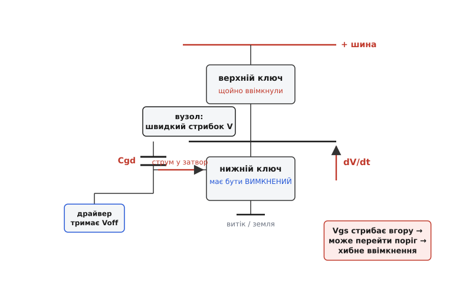
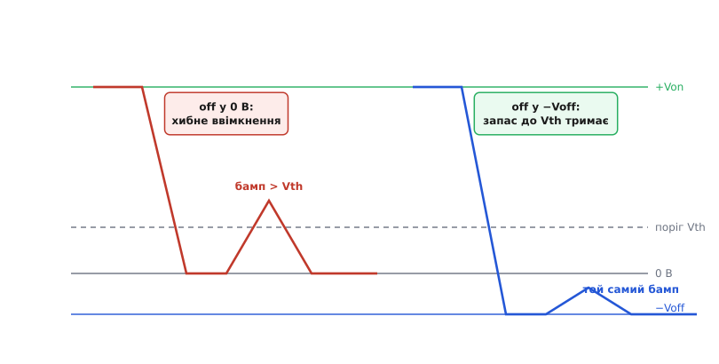
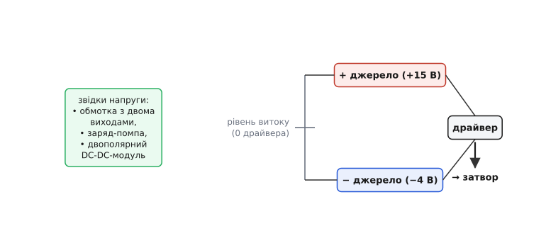

# Від'ємне живлення затвора

<preknowlist>
- [Ємність затвора](topic:hw-components/gate-capacitance) — затвор поводиться як конденсатор із паразитною ємністю затвор–стік Cgd; щоб ключ відкрився, напруга затвор–витік має перейти поріг Vth.
- [Ефект Міллера](topic:hw-analog/miller-effect) — ця сама Cgd зв'язує стрибок напруги на стоку назад у затвор, впорскуючи туди струм.
- [Драйвер затвора](topic:hw-power/gate-driver) — вузол, що заряджає й розряджає затвор, тягнучи його до рівня «увімкнено» чи «вимкнено».
</preknowlist>

Здавалося б, щоб надійно **вимкнути** польовий ключ, досить притиснути його затвор до витоку — поставити Vgs = 0. Поріг відкриття Vth завжди додатний (кілька вольтів), нуль явно нижчий за поріг, канал закритий. І довгі роки так і робили. Але коли ключі стали швидкими, а напруги великими, з'ясувалося: **нуля вже мало**. Ключ, якому наказали мовчати, раптом на мить прочиняється сам — без жодної команди від драйвера. Кожне таке хибне прочинення — це наскрізний струм, зайве тепло, а бува й миттєва смерть ключа.

Ліки виявилися дивними на перший погляд: не тримати вимкнений затвор на нулі, а **завести його в мінус** — тримати на −3, −4, а для деяких приладів −8 чи навіть −15 вольтів відносно витоку. Ось чому інженери спеціально будують окрему **від'ємну шину живлення** для драйвера. Щоб зрозуміти, навіщо витрачати на це схему й місце на платі, треба спершу побачити, звідки береться саме прочинення.

## Звідки затвор бере команду, якої ніхто не давав

Уявімо типову ситуацію — **напівміст**: два ключі один над одним, верхній тягне спільний вузол до плюса, нижній — до землі. Працюють вони по черзі: коли один відкритий, другий мусить бути щільно закритий. Розгляньмо мить, коли **нижній ключ вимкнений**, а драйвер саме **вмикає верхній**.

Верхній ключ відкривається — і спільний вузол між ними стрімко злітає від нуля майже до напруги шини. Не поступово, а за десятки наносекунд: сучасні прилади для того й швидкі, щоб перемикатися різко й менше грітися на самому перемиканні. Швидкість цього стрибка й називають **dV/dt** — скільки вольтів за наносекунду. У добрій схемі це легко 20, 50, а на карбід-кремнієвих приладах і понад 100 В/нс.

Тепер згадаймо, що стік нижнього (вимкненого) ключа під'єднаний саме до цього вузла. А між стоком і затвором сидить паразитна ємність Cgd — та сама, через яку працює [ефект Міллера](topic:hw-analog/miller-effect). Ємність не терпить різкої зміни напруги на своїх обкладках без струму: коли одна обкладка (стік) стрибає вгору, крізь Cgd тече струм заряджання. І тече він **у затвор** вимкненого ключа.

Струм цей — не абстракція, його легко порахувати:

```
i = Cgd · dV/dt
```

Візьмімо скромні числа: Cgd ≈ 30 пФ, dV/dt = 40 В/нс.

```
i = 30·10⁻¹² Ф · 40·10⁹ В/с
i = 30 · 40 · 10⁻³ А
i = 1.2 А
```

Понад ампер струму, впорснутого в затвор, який мав тихо сидіти на нулі. Куди він дінеться? Драйвер тримає затвор притиснутим до витоку, але тримає він його **не ідеально жорстко** — між виходом драйвера й затвором завжди є опір: власний опір нижнього плеча драйвера плюс зовнішній резистор затвора Rg. На цьому опорі впорснутий струм створює **падіння напруги**, і затвор на мить піднімається над витоком:

```
Vgs(сплеск) ≈ i · Rg = Cgd · dV/dt · Rg
```

При Rg = 5 Ом і наших 1.2 А це вже 6 вольтів сплеску. А поріг Vth у багатьох сучасних ключів — 2…4 вольти. Сплеск **перестрибує поріг** — і ключ, якому наказали бути закритим, на кілька наносекунд **прочиняється сам**. Це і є **паразитне ввімкнення** *(parasitic turn-on, spurious turn-on — самочинне ввімкнення)*.


*Верхній ключ увімкнувся — вузол злетів угору; крізь паразитну Cgd струм упорскується в затвор нижнього ключа попри те, що драйвер тримає його вимкненим.*

Найгірше, що прочиняється воно саме тоді, коли **протилежний ключ уже відкритий**. Верх відкритий, низ на мить прочинився — і між плюсом та землею відкривається пряма дорога. Це **наскрізний струм** *(shoot-through — крізний струм)*: обидва плеча провідні водночас, шину замикає майже накоротко крізь два ключі. У кращому разі — сплеск втрат і нагрів, у гіршому — ключ згорає за один такий імпульс.

> 🔧 **Навіщо це.** Паразитне ввімкнення — не рідкісна екзотика, а типова причина, чому «правильно спроєктований» напівміст гріється більше за розрахунок або зрідка вибухає під навантаженням. Інженер, що бачить незрозумілі втрати чи загадкову смерть нижнього ключа саме в момент увімкнення верхнього, першим ділом має запідозрити цей механізм — і подивитися осцилографом на Vgs вимкненого плеча.

## Чому нуль не рятує, а мінус рятує

Проблема в тому, що **весь запас** від рівня спокою до порогу — це і є вся оборона. Тримаємо затвор на нулі — запас до порогу дорівнює самому порогу, скажімо 3 вольти. Сплеск Міллера у 6 вольтів цей запас пробиває наскрізь.

Тепер зробімо одну-єдину зміну: хай драйвер, вимикаючи ключ, тягне затвор не до нуля, а до **−4 вольтів**. Механізм упорскування нікуди не подівся — той самий струм, той самий сплеск, та сама його висота у 6 вольтів. Але тепер сплеск відраховується **не від нуля, а від −4**:

```
рівень спокою:      −4 В
висота сплеску:     +6 В
пік напруги:        −4 + 6 = +2 В
поріг Vth:            3 В
```

Пік ледь-ледь **не дотягує** до порогу — 2 проти 3. Ключ лишається закритим. Ми не прибрали сплеск — ми **відсунули стартову точку вниз**, і той самий сплеск тепер не долітає до порогу. Оборона стала товщою рівно на ту величину, на яку затвор занурили в мінус.


*Ліворуч: вимикання в 0 В — бамп від поштовху Міллера перестрибує Vth, ключ хибно прочиняється. Праворуч: вимикання в −Voff — той самий бамп лишається під порогом, запас тримає.*

Ось чому від'ємна шина. Її завдання просте: дати драйверові рівень «вимкнено» **нижчий за нуль**, щоб між рівнем спокою й порогом був запас, який поштовх Міллера не пробиває. Наскільки нижчий — залежить від того, який очікується сплеск (тобто від Cgd, від dV/dt сусіднього плеча й від опору в колі затвора) і який поріг у приладу. Точний розрахунок цього запасу — [окрема нехитра арифметика](topic:hw-power/negative-gate-supply/math-spurious-vgs.md): прикидаємо пік сплеску, порівнюємо з порогом, і різницю з деяким засапом переносимо у від'ємний бік.

> 🔧 **Навіщо це.** Від'ємне зміщення дає ще й **швидше вимикання**. Розряджати затвор від +15 до −4 — це більший перепад, ніж від +15 до 0, тож на початку розряду струм більший і затвор проскакує активну ділянку жвавіше. Ключ коротше висить у напівпровідному стані, а саме там — головні [втрати перемикання](topic:hw-components/switching-losses). Тобто від'ємна шина одночасно і глушить паразитне ввімкнення, і трохи зрізає втрати на вимиканні.

## Кому це справді потрібно

Не кожен ключ вимагає мінуса. Усе впирається в **співвідношення порога й сплеску**.

Старі кремнієві силові MOSFET на невисоких частотах мають поріг вольтів 4 і повільні фронти — сплеск Міллера в них дрібний, запасу від нуля вистачає. Тут від'ємну шину ставити марно: вона додасть схеми, а користі не дасть.

А ось де мінус стає майже обов'язковим:

**IGBT у мостах.** Класика від'ємного зміщення. [IGBT](topic:hw-components/igbt) вмикають потужні мости — приводи моторів, зварювальні апарати, інвертори. Тут великі струми, великі dV/dt і сусіднє плече, що жорстко перемикає. Традиційно затвор IGBT у вимкненому стані тримають на **−8…−15 вольтів** — саме щоб dVce/dt від увімкнення протилежного ключа не прочинив закритий IGBT крізь його ємність затвор–колектор. Веб-звірка підтверджує: цей рівень і причина — усталена практика силової техніки, а не легенда.

**Карбід-кремнієві (SiC) MOSFET.** Найгостріший випадок. У [SiC-приладів](topic:hw-components/sic-mosfet-power) поріг **низький** — часто лише 2…3 вольти, а буває й менше. При цьому вони найшвидші з усіх, dV/dt у них найбільший. Запасу від нуля до такого низького порога катма — навіть коротенький сплеск у кілька вольтів, що триває пару наносекунд, дотягує до порога. Тому виробники SiC прямо радять вимикати їх у мінус: типово **−2…−4 вольти**. Це вже не поліпшення, а умова надійної роботи.

Тут, однак, аналогія «глибше в мінус — надійніше» **ламається**, і про це варто знати. Занадто глибокий мінус на SiC шкодить: під тривалим від'ємним зміщенням затвора у SiC **дрейфує сам поріг** *(threshold voltage instability — нестабільність порога)* — оксид затвора накопичує заряд, і Vth поволі повзе. Тому з новішими SiC-приладами часто беруть **м'якший** мінус (−2 В замість −5 В), а деякі виробники третього покоління дозволяють навіть вимикати в 0 В, якщо натомість поставити активний затискач. Тобто від'ємну шину дозують: досить глибоко, щоб побити сплеск Міллера, але не глибше, ніж треба, — бо надлишок псує сам прилад.

## Мінус — не єдині ліки

Чесно буде сказати, що від'ємне зміщення — не єдиний спосіб убити паразитне ввімкнення, і часто його поєднують з іншими.

Перший напарник — **малий опір у колі затвора при вимиканні**. Сплеск, згадаймо, дорівнює i·Rg. Що менший Rg на розряді, то нижчий сплеск при тому самому впорснутому струмі. Тому нерідко роблять **різні шляхи** для ввімкнення й вимикання: вмикають через більший резистор (щоб не надто різко, менше дзвону), а вимикають через маленький — щоб притиснути затвор жорсткіше. Це саме той випадок, коли драйверові корисний **окремий вихід на вимикання**.

Другий, і дуже дієвий, — **активний затискач Міллера** *(active Miller clamp — активний притиск за Міллером)*. Це окремий сильний ключ прямо в драйвері, який у момент небезпеки коротко замикає затвор на витік майже накоротко, обходячи навіть зовнішній Rg. Дорога для впорснутого струму стає такою низькоомною, що сплеск на ній майже не встигає піднятися. Затискач і від'ємна шина не конкурують, а доповнюються: шина опускає стартову точку, затискач притискає затвор у критичну мить. У найвідповідальніших мостах ставлять і те, і те.

Спорідненою мірою проти надто різких фронтів (першопричини сплеску) є [снабери й контроль dV/dt](topic:hw-power/snubbers-dvdt) — вони прибирають проблему з іншого боку, пригальмовуючи сам стрибок напруги на вузлі. Але сповільнити фронт — значить додати втрат на перемиканні, тож це компроміс: платиш ефективністю за спокій.

Тобто від'ємна шина — **одна опора** оборони, а не вся вона. Але опора фундаментальна: вона єдина, що прямо збільшує **запас** між рівнем спокою й порогом, і робить це, не сповільнюючи ключ.

## Звідки взяти сам мінус

Лишається питання, з якого власне все й почалося: як зробити цю від'ємну напругу. Витік ключа — це «нуль» для драйвера, точка відліку. Плюсову шину (+15 чи скільки треба) роблять звично. А мінус — це просто **ще одне джерело**, під'єднане так, що витік опиняється **між** плюсовим і мінусовим виходами: плюс дає рівень «увімкнено», мінус — рівень «вимкнено», а драйвер перемикає затвор між цими двома рейками, тримаючи витік за спільну опору.


*Двополярне живлення драйвера: рівень витоку — спільний нуль; одне джерело формує додатну рейку над ним, друге — від'ємну під ним.*

Способів сформувати цю пару рейок кілька:

**Окрема обмотка з двома виходами.** Живлення драйвера часто й так гальванічно розв'язане — свій маленький трансформатор на кожне плече. Досить намотати обмотку **з відводом посередині** й прив'язати цей відвід до витоку: те, що вище відводу, стає плюсом, нижче — мінусом. Простий і поширений спосіб у мостах з розв'язаними драйверами.

**[Заряд-помпа](topic:hw-power/charge-pump-conv).** Коли треба лише невеликий мінус (−3…−5 В) під невеликий струм, його інвертують з наявного плюса конденсаторним насосом: кілька діодів і конденсаторів перекидають заряд так, що на виході з'являється від'ємна напруга. Схема дешева й дрібна, але слабенька за струмом — для розряджання жвавого затвора помпу треба рахувати обережно, з добрим запасом за струмом.

**Готовий двополярний DC-DC-модуль.** Маленькі ізольовані перетворювачі з роздільними виходами (наприклад +15 / −4) роблять саме для драйверів затвора — під'єднав, прив'язав середню точку до витоку, і маєш обидві рейки. Найпростіше у виробництві, коштує грошей, зате знімає всю мороку.

Який спосіб брати — залежить від струму, якого потребує затвор, і від того, чи вже є розв'язка. Але суть у всіх однакова: **дати драйверові рейку нижче нуля**, щоб вимкнений ключ мав під собою запас, який поштовх Міллера не пробиває, — і завдяки цьому мовчав тоді, коли мовчати він мусить.
