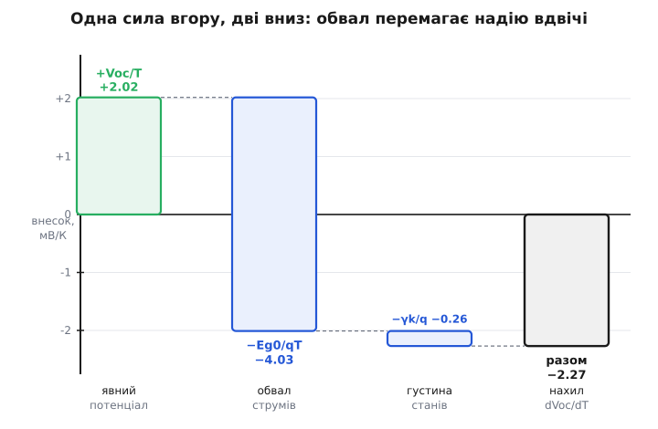
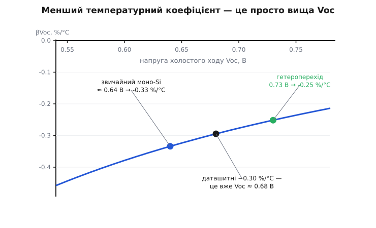

# 🧮 Виведення нахилу dVoc/dT: чому напруга падає саме на 2 мВ за градус

Число −2.2 мВ/°C — усталений температурний нахил напруги холостого ходу кремнієвого елемента — не константа матеріалу, яку колись виміряли й записали в довідник. Воно виводиться з рівняння діода за півсторінки алгебри, і саме виведення показує три речі, яких із готової цифри не видно: **чому** в кінцевій формулі стоїть заборонена зона, екстрапольована до 1.2 еВ, а не її кімнатне значення 1.12 еВ; **чому** доданок `k·T/q`, який з нагрівом чесно росте, напругу все одно не рятує; і **чому** кращий елемент — той, у якого вища Voc, — має *менший* за модулем температурний коефіцієнт. Останнє — не збіг і не властивість технології сама по собі, а прямий наслідок тієї ж формули, і наприкінці ми побачимо, як вона з чистої алгебри відтворює паспортні −0.25 %/°C гетеропереходу.

Виводитимемо повільно, називаючи кожен доданок по імені, бо вся суть теми — у тому, *котрий* доданок кого перемагає.

## Означення: звідки береться сама Voc

Освітлений елемент — це [той самий p-n перехід, що й діод](root:ph-condensed/photovoltaic-cell), повернутий назустріч світлу. Крізь нього течуть два зустрічні струми. Світло виштовхує носії назовні сталим **фотострумом** I_L (він майже дорівнює струму короткого замикання Isc). Назустріч, углиб переходу, тече [дифузійний струм самого діода](root:ph-condensed/pn-junction) — той, що росте з прикладеною напругою за експонентою й тримається на **темновому струмі насичення** I₀. У режимі холостого ходу зовнішнього кола немає, виходити струмові нікуди, тож два потоки мусять зрівноважитись рівно там, де їхня різниця — нуль:

```
I_L = I₀ · [ exp( q·Voc / (n·k·T) ) − 1 ]
```

Тут `n` — коефіцієнт ідеальності (для доброго кремнієвого елемента біля напруги Voc він близький до 1), `k` — стала Больцмана, `q` — заряд електрона, `T` — абсолютна температура. Розв'яжемо це відносно Voc — просто логарифмуємо:

```
Voc = (n·k·T / q) · ln( I_L / I₀ + 1 )
```

Відношення `I_L/I₀` — величезне: фотострум — це ампери, а темновий струм насичення кремнію — десь 10⁻¹²…10⁻⁹ А, тобто відношення сягає 10⁹…10¹². Проти такого числа одиниця під логарифмом — пил, і надалі ми її відкидаємо:

```
Voc ≈ (n·k·T / q) · ln( I_L / I₀ )
```

Швидка перевірка на здоровий глузд. При 25 °C тепловий потенціал `k·T/q ≈ 0.0257` В, а `ln(10¹⁰) ≈ 23`. Множимо: 0.0257 · 23 ≈ 0.59 В. Ось вони, паспортні «пів вольта» з одного елемента — не задані ззовні, а зібрані з двох множників: теплового потенціалу й логарифма відношення струмів.

Тепер ключове спостереження, з якого росте вся тема. У цій формулі температура сидить **у трьох місцях одразу**, і тягнуть вони в різні боки:

- явний множник `T` попереду — з нагрівом **росте**, підіймає Voc;
- фотострум `I_L` під логарифмом — з нагрівом ледь-ледь росте (це та сама фізика, що дає Isc її +0.05 %/°C), теж трішки на користь;
- темновий струм `I₀` у знаменнику логарифма — з нагрівом росте **шалено**, і кожен його приріст **валить** Voc.

Питання «який знак у dVoc/dT» — це питання, хто кого переможе. Продиференціюймо й порахуймо сили.

## Диференціювання: два доданки й слабка третя сила

Беремо похідну добутку `(n·k·T/q) · ln(I_L/I₀)` за T. Перший множник дає похідну сам по собі, другий — свою:

```
dVoc/dT = (n·k/q)·ln(I_L/I₀)  +  (n·k·T/q) · d/dT[ ln(I_L/I₀) ]
```

Перший доданок упізнається миттєво. Адже сама Voc = `(n·k·T/q)·ln(I_L/I₀)`, тож поділивши її на T дістаємо рівно `(n·k/q)·ln(I_L/I₀)`. Отже перший доданок — це просто **+Voc/T**. Це і є «надія» явного множника: тепловий потенціал попереду логарифма росте, і сам по собі він підняв би напругу на +Voc/T ≈ +0.6/298 ≈ **+2.0 мВ/К**. Запам'ятаймо це число — це вся сила, що грає *за* напругу.

Другий доданок розкриваємо через похідну логарифма:

```
d/dT[ ln(I_L/I₀) ] = (1/I_L)·dI_L/dT  −  (1/I₀)·dI₀/dT
```

Внесок фотоструму тут — це та сама слабка третя сила. Його логарифмічна похідна `(1/I_L)·dI_L/dT` дорівнює температурному коефіцієнту Isc, тобто ≈ +5·10⁻⁴ /К. Помножений на `(n·k·T/q) ≈ 0.0257` В, він додає до dVoc/dT цілих +0.0257 · 5·10⁻⁴ ≈ +1.3·10⁻⁵ В/К, тобто **+0.013 мВ/К**. Проти двох мілівольтів це округлення до нуля. Тож зростання струму, яке дає Isc її крихітний плюс, на напругу практично не діє — і надалі ми фотострум чесно відкидаємо, лишаючи всю драму темновому струму I₀.

Уся вага теми зібралася в одному члені: `−(n·k·T/q)·(1/I₀)·dI₀/dT`. Щоб його розкрити, треба знати, **як саме** I₀ залежить від температури. І тут починається фізика.

## Звідки T³: заборонена зона, помножена на густину станів

Темновий струм насичення для дифузійного діода тримається на **власній концентрації носіїв** у квадраті, I₀ ∝ n_i². А n_i² — це кількість пар «електрон–дірка», що народжуються самим теплом, і [для напівпровідника](root:ph-condensed/semiconductor) вона має вигляд:

```
n_i² = N_c · N_v · exp( −Eg / (k·T) )
```

Експонента тут — ядро всього: це больцманівська ймовірність того, що носій набере теплової енергії, достатньої перескочити заборонену зону Eg. Але перед експонентою стоять два множники — **ефективні густини станів** у зоні провідності N_c та у валентній зоні N_v. Кожен з них рахує, скільки взагалі є «місць», куди носій може сісти, і кожен росте з температурою як `T^(3/2)`. Ця степінь 1.5 — не підгонка: вона падає прямо з тривимірного простору швидкостей, у якому розподілені теплові носії (об'єм кулі в просторі імпульсів дає рівно 3/2). Перемножимо дві густини:

```
N_c · N_v  ∝  T^(3/2) · T^(3/2)  =  T³
```

Ось воно — **T³**. Три береться не з повітря, а з двох тривимірних газів носіїв, у зоні провідності й у валентній зоні, кожен зі своєю степенем 3/2. Зібравши все докупи, темновий струм пишуть у канонічному вигляді:

```
I₀ = B · T^γ · exp( −Eg / (k·T) )
```

де B — величина, що з температурою майже не змінюється, а показник **γ вбирає всі степеневі залежності перед експонентою**. Чиста густина станів дає γ = 3. Реальність трохи каламутить це число: коефіцієнти дифузії, рухливість носіїв та довжина дифузії теж повзуть із температурою й додають свої дробові степені, тож у детальних розрахунках γ гуляє між 3 і 4. Але — і це важливо — точне значення γ на кінцевий результат майже не впливе: побачимо, що весь доданок із γ дає лічені десяті мілівольта проти двох повних. Тому канонічно беруть **γ = 3**, свідомо ховаючи в цю трійку «можливі температурні залежності інших параметрів матеріалу», і не мучаться дробами.

> 🔧 **Навіщо це.** Саме степінь T³ (а не, скажімо, T¹) робить темновий струм таким нещадним до напруги. Кожен градус нагріву множить n_i² відразу двома шляхами — і трохи через степінь T³, і — набагато сильніше — через експоненту, що відчиняється ширше. Практичний слід цього — нещадна крутість: кожні ~10 °C множать темновий струм у кілька разів, а на кожні ~15 градусів він росте на цілий порядок. Саме ця лавина, а не скромний тепловий потенціал попереду логарифма, і вирішує долю напруги.

## Похідна I₀ і поява звуження зони

Тепер логарифмуємо I₀ й диференціюємо — з логарифмом це легко, бо добуток розпадається на суму:

```
ln I₀ = ln B + γ·ln T − Eg/(k·T)
```

```
d(ln I₀)/dT = γ/T − d/dT[ Eg/(k·T) ]
```

Останню похідну треба брати обережно, бо **сама Eg залежить від T** — гарячий кристал сильніше коливається, і заборонена зона звужується. Розкриваємо за правилом частки:

```
d/dT[ Eg/(k·T) ] = (1/k)·[ (1/T)·dEg/dT − Eg/T² ]
```

Отже:

```
d(ln I₀)/dT = γ/T − (1/(k·T))·dEg/dT + Eg/(k·T²)
```

Підставмо це у той важкий член `−(n·k·T/q)·d(ln I₀)/dT` і розкриймо дужки, скорочуючи `k·T`, де можна. Візьмемо для чистоти n = 1 (до поправки на ідеальність повернемось наприкінці):

```
−(k·T/q)·d(ln I₀)/dT = −γ·k/q + (1/q)·dEg/dT − Eg/(q·T)
```

Складаємо з першим доданком +Voc/T і збираємо все під спільний знаменник T:

```
dVoc/dT = Voc/T − γ·k/q + (1/q)·dEg/dT − Eg/(q·T)

        = −( Eg/q − Voc + γ·k·T/q − (T/q)·dEg/dT ) / T
```

Майже кінець — але в дужках сидить зайвий, незвичний член `−(T/q)·dEg/dT`. Це і є внесок звуження зони: оскільки `dEg/dT < 0` (зона з нагрівом меншає), цей член додатний і робить нахил ще крутішим униз. Формула ще не така гарна, як обіцяно. Щоб її причесати, потрібне рівняння, яке скаже, *наскільки саме* звужується зона.

## Рівняння Варшні і фокус зі скороченням

Як заборонена зона кремнію повзе з температурою, найточніше описує напівемпіричне співвідношення, яке 1967 року запропонував **Ятендра Пал Варшні** (Yatendra Pal Varshni) — фізик індійського походження, який на той час працював в Університеті Оттави в Канаді; формула відтоді носить його ім'я й лишається робочим стандартом для всіх напівпровідників:

```
Eg(T) = Eg(0) − α·T² / (T + β)
```

Для кремнію класичні значення такі: Eg(0) ≈ 1.17 еВ, α ≈ 4.73·10⁻⁴ еВ/К, β ≈ 636 К. Підставивши T = 300 К, дістаємо Eg ≈ 1.12 еВ — саме кімнатне значення, яке всі знають. А похідна цієї кривої біля кімнатної температури — тобто швидкість звуження — виходить близько **−0.25 меВ/К на кожен градус** (та сама «чверть міліелектронвольта на градус»; заборонена зона — це енергія, тож і нахил її вимірюють у міліелектронвольтах, а не мілівольтах).

Тепер фокус. Біля робочих температур панелі (T порядку 300 К, значно вище нуля) криву Варшні з чудовою точністю можна замінити **прямою**:

```
Eg(T) ≈ Eg0 − a·T,     де a = |dEg/dT| ≈ 0.25 меВ/К
```

І тут головне питання: чому дотична Eg0? Це **не** кімнатні 1.12 еВ і навіть **не** справжня зона при абсолютному нулі 1.17 еВ. Eg0 — це точка, у яку впирається **пряма-дотична**, продовжена від кімнатної температури назад до T = 0. Порахуймо її:

```
Eg0 = Eg(300) + a·300 = 1.12 еВ + 0.25·10⁻³·300 = 1.12 + 0.075 ≈ 1.20 еВ
```

Ось звідки береться загадкове **1.2 еВ** у кінцевій формулі. Це екстрапольована зона: не та, що є при 25 °C, і не та, що при нулі, а та, у яку прицілюється лінійний хід кривої з робочої ділянки. Справжня зона при нулі нижча (1.17), бо крива Варшні під β заламується й вирівнюється, — але для нахилу в робочому діапазоні важить саме дотична, а вона впирається в 1.20.

Тепер підставмо лінійну Eg(T) = Eg0 − a·T у нашу незугарну формулу. Похідна `dEg/dT = −a`, а сама `Eg = Eg0 − a·T`. Дивимось на два члени в дужках, що містять a:

```
Eg/q  →  (Eg0 − a·T)/q  =  Eg0/q − a·T/q

−(T/q)·dEg/dT  →  −(T/q)·(−a)  =  +a·T/q
```

Доданки `−a·T/q` та `+a·T/q` **точно скорочуються**. Уся плутанина зі звуженням зони самознищується — за єдиної умови, що зону відлічувати від екстрапольованої Eg0, а не від кімнатного значення. Ось чому у формулі стоїть саме 1.2, а не 1.12: звуження зони вже враховане, воно «зашите» в різницю між екстрапольованою 1.20 і кімнатною 1.12. У дужках лишається чиста, симетрична трійка:

```
┌─────────────────────────────────────────────┐
│  dVoc/dT = −( Eg0/q − Voc + γ·k·T/q ) / T   │
└─────────────────────────────────────────────┘
```

Це кінцева формула. Три доданки в дужках, поділені на температуру, зі знаком мінус. Тепер її треба прочитати — бо кожен доданок має фізичне ім'я, і саме їхня боротьба вирішує знак.

## Порахуймо і роздивімось конкуренцію

**Умова (один кремнієвий елемент за STC).** Eg0/q = 1.20 В, Voc = 0.60 В, γ = 3, тепловий потенціал `k·T/q` = 0.0257 В при T = 298 К.

```
dVoc/dT = −( 1.20 − 0.60 + 3·0.0257 ) / 298
        = −( 1.20 − 0.60 + 0.077 ) / 298
        = −( 0.677 ) / 298
        = −2.27·10⁻³ В/К
        ≈ −2.3 мВ/°C   на один елемент
```

Виходить рівно те число, що стоїть у даташиті: близько −2.2…−2.3 мВ на градус (точна цифра гуляє з Voc конкретного елемента). Але сама по собі відповідь — половина справи. Розкладімо ту саму дужку на окремі сили й подивімось, **хто на що тягне**. Кожен доданок, поділений на T, дає свій внесок у мілівольтах за кельвін:

```
доданок          у дужці, В     внесок у dVoc/dT, мВ/К     тягне
──────────────────────────────────────────────────────────────
−Voc             −0.60          +Voc/T        = +2.02      ↑ угору
+Eg0/q           +1.20          −Eg0/(q·T)    = −4.03      ↓ вниз (обвал)
+γ·k·T/q         +0.077         −γk/q         = −0.26      ↓ вниз (мало)
──────────────────────────────────────────────────────────────
разом                                          = −2.27      ↓ ПАДАЄ
```


*Розклад нахилу dVoc/dT на три внески. Єдина сила, що піднімає напругу, — зростання теплового потенціалу (+2.0 мВ/К, зелений). Проти неї — обвал відношення струмів через експоненту темнового струму (−4.0 мВ/К, синій) плюс дрібний внесок густини станів (−0.26). Обвал перемагає надію приблизно вдвічі; підсумок — стрибок униз на −2.3 мВ/К.*

Ось тут і видно всю драму одним поглядом. **Явний тепловий потенціал справді штовхає напругу вгору** — на цілих +2.0 мВ/К, і це не ілюзія. Але темновий струм у знаменнику логарифма росте настільки крутіше, що відповідний член валить напругу на −4.0 мВ/К — удвічі сильніше. Надія програє обвалу з рахунком приблизно два до одного.

## Чому `k·T/q` не рятує напруги

Тепер можна дати точну відповідь на питання, яке мучить кожного, хто вперше бачить формулу Voc: адже `k·T` у чисельнику явно росте — то чому напруга не росте разом із ним? Розклад показує це на двох рівнях.

По-перше, той приріст **реальний, але малий**: +2.0 мВ/К. Тепловий потенціал 26 мВ додає по 0.086 мВ на градус до кожної одиниці логарифма, і на всі ~23 одиниці це дає ті +2 мВ. Проблема не в тому, що член слабкий сам по собі, — а в тому, що проти нього стоїть експонента.

По-друге — і це найтонше — доданок `γ·k·T/q` у дужці, той самий тепловий потенціал, помножений на γ, стоїть **на боці мінуса**. Він не допомагає напрузі, а трохи її додатково валить (−0.26 мВ/К). Причина в тому, що цей `k·T` прийшов не з множника попереду логарифма, а зсередини — зі степеневого хвоста T³ у самому темновому струмі. Тепловий потенціал, отже, з'являється у формулі **двічі, з протилежними знаками**: як прибуток +Voc/T від явного множника й як збиток −γk/q від густини станів усередині I₀. Прибуток більший, але його з головою накриває третій, найбільший член — Eg0/q, що не має жодного стосунку до теплового потенціалу й береться суто з висоти забороненої зони.

Звідси мораль формули: напругу тримає не тепло, а **різниця Eg0/q − Voc** — те, наскільки досягнута напруга не дотягує до екстрапольованої зони. Ця різниця (≈ 0.6 В) ділиться на T і задає масштаб падіння. Тепловий потенціал лише злегка гойдає підсумок туди-сюди, але змінити його знак не годен: обвал відношення струмів закладено в саму експоненту `exp(−Eg/kT)`, і ніякий лінійний множник спереду її не наздожене.

## Переклад у відсотки й несподіваний важіль

Даташит любить не мілівольти, а відсотки, бо вони не залежать від того, скільки елементів у панелі. Температурний коефіцієнт у відсотках — це нахил, нормований на саму напругу:

```
βVoc = (1/Voc)·dVoc/dT = −( Eg0/q − Voc + γ·k·T/q ) / (Voc·T)
```

Підставмо наші числа:

```
βVoc = −2.27 мВ/К / 600 мВ = −3.8·10⁻³ /К ≈ −0.38 %/°C   (для Voc = 0.60 В)
```

Тут варто бути чесним: якщо взяти буквально Voc = 0.60 В і нахил −2.3 мВ/К, вийде близько −0.38 %/°C, а не круглих −0.30 з даташита. Ці «гарні» числа з підручників — −2.2 мВ, 0.6 В, −0.30 % — насправді між собою до другої цифри **не сходяться**, бо взяті від елементів різної якості й різних поколінь. Формула їх мирить: коефіцієнт у відсотках жорстко прив'язаний до того, **яка в елемента Voc**. Порахуймо βVoc для кількох значень напруги (Eg0/q = 1.20, γk·T/q = 0.077, T = 298 сталі):

```
Voc, В    Eg0/q − Voc + γkT/q     dVoc/dT, мВ/К    βVoc, %/°C
────────────────────────────────────────────────────────────
0.55           0.727                −2.44           −0.44
0.60           0.677                −2.27           −0.38
0.64           0.637                −2.14           −0.33
0.68           0.597                −2.00           −0.29     ← даташитні −0.30
0.73           0.547                −1.84           −0.25     ← гетероперехід
0.75           0.527                −1.77           −0.24
```


*Модуль коефіцієнта βVoc падає, коли Voc росте. Кругліші даташитні −0.30 %/°C відповідають не 0.6 В, а сучаснішим елементам із Voc ≈ 0.68 В. Кремнієвий гетероперехід із його високою Voc ≈ 0.73 В сам собою виходить на −0.25 %/°C — не завдяки окремій «температурній» технології, а просто тому, що його напруга ближча до екстрапольованої зони.*

І ось де математика віддячує несподіваним, дуже практичним висновком. Температурний коефіцієнт напруги — **не окремий незалежний параметр**, який можна крутити сам по собі. Він майже цілком заданий тим, наскільки Voc наблизилась до Eg0/q. Що кращий елемент — то вища його Voc, то менша різниця `Eg0/q − Voc` у чисельнику, то **дрібніший** коефіцієнт. Тому кремнієвий гетероперехід із його Voc близько 0.73 В виходить на −0.25 %/°C не тому, що там якась спеціальна «стійка до тепла» фізика, а тому, що його напруга ближча до забороненої зони — і формула це відтворює з точністю до сотої відсотка, з тих самих 1.20 і 0.077, що й для звичайного кремнію. Полюючи в спекотному кліматі на малий температурний коефіцієнт, ви насправді полюєте на високу Voc.

## Де це працює й що лишилось за кадром

Уся практика теми впирається в одну цю дужку. Нахил напруги — головний з трьох [температурних коефіцієнтів панелі](root:hw-power/panel-iv-mpp): він утричі крутіший за приріст струму й тягне за собою більшу частину падіння потужності. Ми вивели його з нуля й побачили, що керує ним різниця між екстрапольованою забороненою зоною й досягнутою напругою, а не тепловий потенціал, який лише злегка гойдає підсумок.

Одну спрощувальну умову варто назвати вголос: ми взяли коефіцієнт ідеальності n = 1 — тобто **дифузійний режим**, коли темновий струм визначає рекомбінація в об'ємі кристала, а в показнику експоненти стоїть повна заборонена зона Eg. Це не довільний вибір заради краси формул. Саме так добрий кремнієвий елемент і працює **біля своєї Voc**, за високої інжекції носіїв, — тому й результат n = 1 лягає рівно на паспортні −2.2 мВ/°C, а не мимо. Інший механізм — рекомбінація в збідненому шарі, той, що піднімає n до ~2, а в показнику лишає тільки Eg/2, — панує на **низькій** напрузі, далеко від холостого ходу, тож на температурний нахил *самої* Voc майже не діє. Ось чому повна екстрапольована Eg0 у чисельнику — правильний вибір: холостий хід живе саме в тому режимі, для якого ми й вивели формулу. Число −2.2 мВ/°C збігається з даташитом не завдяки підгонці, а тому, що вся фізика, яка його творить, зібрана в одну коротку дужку.
