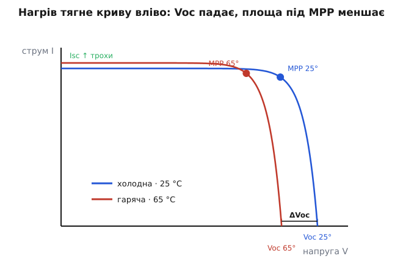
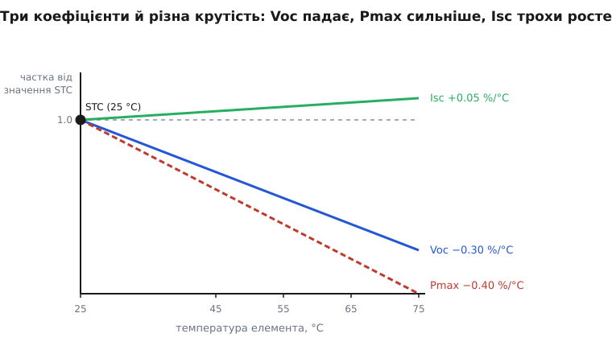
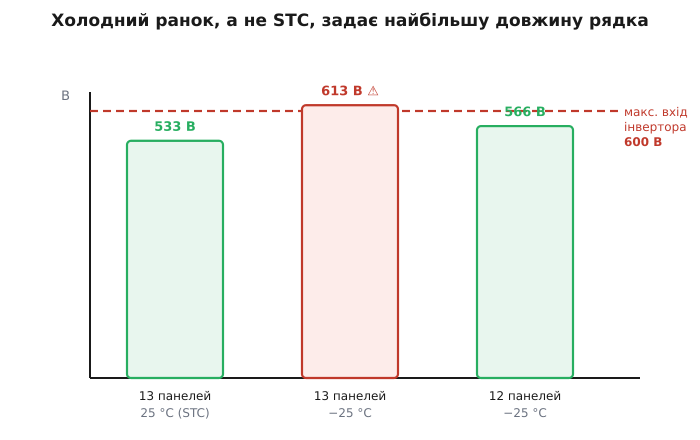

# Температурні коефіцієнти сонячної панелі

<preknowlist>
- [Фотоелемент](topic:ph-condensed/photovoltaic-cell) — що освітлений елемент є, по суті, великим p-n переходом, який дає ~0.5 В незалежно від розміру, а струм — від світла.
- [ВАХ панелі](topic:hw-power/panel-iv-mpp) — три опорні точки кривої: Voc (напруга холостого ходу), Isc (струм короткого замикання) і Pmax у точці максимальної потужності.
- [PN-перехід](topic:ph-condensed/pn-junction) — рівняння діода з експонентою й зустрічний «темновий» струм насичення I₀, що тече без світла.
- [Напівпровідник](topic:ph-condensed/semiconductor) — заборонена зона Eg і те, що з нагрівом дедалі більше носіїв самі перестрибують її від теплової енергії.
</preknowlist>

На даташиті панелі великим шрифтом написано «400 Вт». Ви ставите її на дах спекотного липневого дня, чіпляєте ватметр — і бачите десь 335 Вт. Нічого не зламалося, панель нова, сонце в зеніті. Куди поділися шістдесят із гаком ватів?

Відповідь у дрібному рядку того самого даташита — у **температурних коефіцієнтах**. Паспортні «400 Вт» виміряні за так званих стандартних умов (*standard test conditions*, STC): рівно 1000 Вт/м² світла й — головне тут — **25 °C на самому елементі**. А освітлена панель на даху розігрівається до 60–70 °C. Що гарячіша вона стає, то менше віддає. Температурні коефіцієнти — це три числа, що з точністю до відсотка кажуть, наскільки саме.

### Три числа й несподіванка в знаках

Панель описують трьома опорними [точками ВАХ](topic:hw-power/panel-iv-mpp), і кожна по-своєму реагує на нагрів. Тож коефіцієнтів теж три — по одному на точку:

```
Voc  (напруга холостого ходу)  →  βVoc  ≈ −0.30 %/°C     ← падає
Isc  (струм короткого замикання) →  αIsc ≈ +0.05 %/°C     ← трохи РОСТЕ
Pmax (потужність у точці MPP)  →  γPmax ≈ −0.40 %/°C     ← падає (це й платить рахунок)
```

Тут ховається перша несподіванка. Здоровий глузд підказує, що від нагріву панелі має ставати гірше в усьому. Аж ні: **струм від нагріву трохи росте**. Мінусів два (напруга й потужність), а плюс один (струм). І щоб зрозуміти всю тему, треба спершу розібратися, **чому знаки саме такі** — бо за кожним стоїть окрема фізика, і саме напруга, яка падає найсильніше, тягне за собою потужність.

### Чому падає напруга — серце теми

Ключ до всього — згадати, що освітлений елемент це [той самий p-n перехід, що й діод](topic:ph-condensed/photovoltaic-cell), лише повернутий назустріч світлу. А в діода є власний, вбудований опір нагріву — його **темновий струм насичення** I₀: той струм, що тече крізь перехід і без жодного світла, самою лише тепловою енергією носіїв, які перестрибують [заборонену зону](topic:ph-condensed/semiconductor). Напруга холостого ходу народжується з рівноваги двох струмів — світлового I_L, що виштовхує носії назовні, і темнового I₀, що затягує їх назад:

```
Voc = (n·k·T / q) · ln( I_L / I₀ + 1 )
```

Тут `k·T/q` — **тепловий потенціал** (при 25 °C це ~26 мВ), `n` — коефіцієнт ідеальності (близько 1). Гляньмо на цю формулу очима того, хто гріє панель. У чисельнику стоїть `k·T`, і воно з температурою **росте** — здавалося б, напруга має підніматися. Але водночас у знаменнику логарифма росте I₀ — і росте він **незрівнянно швидше**.

Ось у чому суть. Темновий струм I₀ тримається на концентрації носіїв, що самі народжуються від тепла, а та лізе вгору круто — приблизно як `T³·exp(−Eg/k·T)`. Тобто з кожним градусом дедалі більше електронів набирають досить теплової енергії, щоб перестрибнути заборонену зону без будь-якого фотона. Перехід стає **дірявішим**: він уже не здатний утримувати стільки напруги, скільки тримав холодним. І хоч `k·T/q` попереду логарифма й підростає, відношення `I_L/I₀` під логарифмом **обвалюється** швидше — тож добуток падає. Напруга програє.


*Та сама панель при 25 °C (синя) і розжарена до 65 °C (червона). Уся крива зсувається **вліво**: Voc помітно менша, тоді як Isc навіть трохи вища. Точка MPP переїжджає ліворуч і вниз — прямокутник її потужності меншає. Саме цю втрачену площу й позначають коефіцієнтом Pmax.*

До цього додається другий, менший ефект: сама **заборонена зона з нагрівом трохи звужується** — гарячий кристал сильніше коливається, і «стінка», яку долає електрон, стає нижчою (для кремнію — десь на чверть міліелектронвольта на кожен градус). Нижча стінка — ще легше носіям перестрибувати, ще більший I₀, ще нижча Voc. Обидві причини тягнуть в один бік.

Порахуймо, наскільки. Для одного кремнієвого елемента усталений результат такий:

```
dVoc/dT ≈ −(Eg/q − Voc + γ·k·T/q) / T

Eg/q ≈ 1.2 В,  Voc ≈ 0.6 В,  γ ≈ 3,  k·T/q ≈ 0.026 В,  T = 298 K:
dVoc/dT ≈ −(1.2 − 0.6 + 3·0.026) / 298
        ≈ −(0.678) / 298
        ≈ −2.3 мВ/°C  на один елемент
```

Тобто кожен елемент втрачає ~2.2–2.3 мВ напруги на градус. У відсотках від своїх ~0.6 В це і є ті **−0.30 %/°C** з даташита. [Повне виведення цього нахилу — від рівняння діода до −2.2 мВ/°C, з походженням множника γ і звуженням зони — винесено окремо](topic:hw-power/panel-temperature-coeff/math-voc-temperature.md): у базовій статті досить розуміти, що напругу валить не сам тепловий потенціал, а темновий струм, який росте набагато крутіше.

Множники додаються так само просто, як [напруги в послідовному ряду](topic:hw-power/panel-iv-mpp): у панелі з 60 елементів −2.3 мВ на елемент дають уже −0.14 В на кожен градус нагріву всієї панелі.

### Чому струм трохи росте

Тепер плюс. Та сама звужена нагрівом заборонена зона, що підкосила напругу, струмові навпаки трохи **допомагає**. Вужча зона означає, що тепер і слабші фотони — ті, яким холодного кремнію енергії ледь бракувало, — уже здатні вибити електрон. Панель починає збирати трохи ширший шматок сонячного спектра, до неї «дораховуються» найчервоніші промені. Плюс носії за вищої температури встигають дифундувати трохи далі, перш ніж рекомбінувати. Обидва дрібні внески піднімають Isc приблизно на **+0.05 %/°C**.

Але треба бути чесним щодо масштабу: цей плюс **крихітний** проти напругового мінусу. Півсотні тисячних відсотка проти третини відсотка — різниця на порядок. Тож нагрів ніколи не «окуповується» через струм: підрослий Isc не рятує, він лише ледь пом'якшує падіння потужності. На графіку коефіцієнтів це видно з першого погляду — по крутості ліній.


*Кожен параметр як частка від свого значення за STC. Voc спадає круто, Pmax — ще крутіше (бо вбирає й падіння напруги, і просідання коефіцієнта заповнення), а Isc ледь-ледь повзе вгору. Уся практика нагріву — це майже цілком історія про напругу; струм у ній майже не важить.*

### Pmax — число, що платить рахунок

Для того, хто рахує врожай енергії, важливий насамперед третій коефіцієнт — Pmax, бо потужність це те, що панель реально віддає в навантаження. Потужність у [точці максимуму](topic:hw-power/panel-iv-mpp) приблизно дорівнює `Voc · Isc · FF`, де FF — коефіцієнт заповнення. Нагрів валить Voc сильно, ледь-ледь піднімає Isc і трохи опускає FF (бо «коліно» кривої розмивається). Складіть ці три внески — і матимете чистий мінус, десь **−0.40 %/°C** для звичайного кристалічного кремнію.

> 🔧 **Навіщо це.** Коефіцієнт Pmax — це не абстракція, а прямий множник у бюджеті енергії системи. Він каже, скільки насправді дасть масив у полудневу спеку, а не в лабораторії, і саме на нього спираються, коли рахують, чи вистачить панелей зарядити батарею за день. Проєктувати сонячне живлення за паспортними «400 Вт» — означає систематично недобирати: реальна цифра завжди нижча, і температурний коефіцієнт каже, наскільки.

**Приклад (спекотний дах).** Панель Pmax(STC) = 400 Вт, γPmax = −0.40 %/°C. Полудень, елемент розігрівся до 65 °C.

```
ΔT над STC:      65 − 25 = 40 °C
втрата:          0.40 %/°C × 40 °C = 16 %
реальна Pmax:    400 Вт × (1 − 0.16) = 336 Вт
```

Ті самі «400» на папері стають 336 на гарячому даху — і жодної несправності, лише фізика переходу. Ось куди поділися ті шістдесят ватів із початку.

### То якої ж температури елемент насправді?

Щоб застосувати коефіцієнт, треба знати температуру не повітря, а самого елемента — а вона майже завжди вища за паспортні 25 °C, бо чорна панель на сонці добряче нагрівається. Оскільки STC (25 °C) під реальним сонцем **не трапляється майже ніколи**, у даташит кладуть чесніший орієнтир — **NOCT** (*nominal operating cell temperature*, номінальна робоча температура елемента): температуру, до якої панель нагрівається за м'якших, але життєвих умов — 800 Вт/м² світла, 20 °C повітря, вітерець 1 м/с, вільне кріплення. Типове NOCT кристалічної панелі — десь **45 °C**, і воно дає простий спосіб прикинути температуру елемента за будь-якої погоди:

```
T_елемента ≈ T_повітря + (NOCT − 20) · (світло / 800)
```

**Приклад (полудень).** Повітря 30 °C, повне сонце 1000 Вт/м², NOCT панелі 45 °C.

```
T_елемента ≈ 30 + (45 − 20) · (1000 / 800)
           ≈ 30 + 25 · 1.25
           ≈ 30 + 31 = 61 °C
```

Тобто навіть за помірних 30 °C у затінку сам елемент сидить під 60 °C, а темної спеки легко дотягує до 70. Ось чому в розрахунках беруть ΔT над STC у 35–45 градусів — це буденний робочий стан, а не рідкість.

### Холод кусає з іншого боку: чому не можна додати ще одну панель

Коефіцієнт працює **симетрично**: якщо нагрів напругу знижує, то холод її **піднімає** — вище за паспортну. І ось тут ховається найпідступніша пастка проєктування, бо перевищена напруга здатна не просто зменшити врожай, а **спалити** вхід перетворювача.

Уявіть морозний ясний ранок. Панелі ще крижані, скажімо −25 °C, а сонце вже вдарило на повну. Voc кожної панелі підскочила на 15 % над номіналом — і, поки масив не прогрівся, він якусь мить видає напругу, на яку його ніхто не розраховував. Якщо панелі з'єднані в довгий послідовний **рядок** (*string*), їхні напруги [додаються](topic:hw-power/panel-iv-mpp), і сумарна Voc рядка легко перестрибує гранично допустиму вхідну напругу інвертора чи MPPT-контролера. А це вже не втрата відсотків — це пробій входу.

> 🔧 **Навіщо це.** Саме холодна Voc, а не паспортна, задає **найбільшу дозволену довжину рядка**. Правило залізне: сума Voc усіх послідовних панелей, порахована за **рекордно низької** місцевої температури, мусить лишатися нижчою за абсолютний максимум входу інвертора. Тому проєктувальник не може «докинути ще одну панель для кругленької цифри» — цей запас з'їдає саме зимовий стрибок напруги. Хто рахує довжину рядка за теплою Voc, той узимку ризикує входом перетворювача.

**Приклад (довжина рядка).** Панель Voc(STC) = 41 В, βVoc = −0.30 %/°C. Рекордний місцевий мінімум −25 °C. Максимальний вхід інвертора — 600 В.

```
охолодження від STC:   25 − (−25) = 50 °C
приріст Voc:           0.30 %/°C × 50 °C = +15 %
Voc однієї панелі:     41 В × 1.15 ≈ 47.2 В (холодна!)

13 панелей у рядку:    13 × 47.2 = 613 В   → ПЕРЕВИЩУЄ 600 В ⚠
12 панелей у рядку:    12 × 47.2 = 566 В   → в межах, безпечно
```


*Той самий рядок із 13 панелей за STC (25 °C) тримає безпечні 533 В, але морозного ранку його Voc здіймається до 613 В — вище за стелю інвертора 600 В. Щоб лишитися під стелею в найхолодніший день, у рядок беруть 12 панелей, а не 13. Межу задає холод, не тепло.*

Порахувати цей запас з обох кінців — і гарячу просадку потужності, і холодний стрибок напруги — [зручно одним маленьким калькулятором](topic:hw-power/panel-temperature-coeff/proj-string-sizing.md): подаєш коефіцієнти з даташита й місцеві температурні крайнощі, а він каже, скільки панелей можна ставити в рядок і скільки потужності лишиться на спеці. Той самий коефіцієнт, що з'їдає літній врожай, узимку диктує саму архітектуру масиву.

### Коефіцієнт — це те, що обирають у магазині

Оскільки в спекотному кліматі панель половину життя проводить розжареною, її температурний коефіцієнт стає таким самим критерієм вибору, як і паспортний ККД. Дві панелі з однаковими «400 Вт» за STC поводяться по-різному, коли даху 65 °C: та, у якої γPmax = −0.29 %/°C, за літо віддасть відчутно більше за сусідку з −0.40 %/°C. Тому в жаркому кліматі полюють саме на **малий за модулем** коефіцієнт.

Технології тут різняться закономірно. У кремнієвих HJT-елементів (з гетеропереходом) коефіцієнт менший — близько −0.25 %/°C, і на гарячому даху це їхня перевага. Тонкоплівкові елементи (CdTe, аморфний кремній) гріються теж, але їхня потужність спадає ще повільніше — почасти тому їх і люблять у пустельних масивах. Плата за це — нижчий ККД або інші компроміси, тож вибір завжди балансує паспортну потужність, температурний коефіцієнт і ціну. А ще пам'ятайте, що [MPPT-контролер](topic:hw-power/real-sun-mppt) весь час доганяє точку максимуму, яка від нагріву переїжджає ліворуч: температура зсуває не лише скільки панель дає, а й **де** на кривій лежить її найкраща робоча точка.

### Підсумок

Паспорт панелі виміряний за 25 °C на елементі, а реальний елемент під сонцем сидить під 60–70 °C — і **температурні коефіцієнти** кажуть, наскільки від цього зміняться три опорні точки. **Voc падає** найсильніше (**−0.30 %/°C**, ~2.2 мВ на елемент), бо темновий струм насичення I₀ з нагрівом росте крутіше за тепловий потенціал, а заборонена зона ще й звужується — перехід «дірявіє» й не тримає напруги. **Isc трохи росте** (**+0.05 %/°C**): та сама звужена зона пропускає ширший спектр, але цей плюс мізерний. **Pmax падає** (**−0.40 %/°C**) — бо вбирає в себе і провал напруги, і просідання коефіцієнта заповнення; саме це число множить реальний врожай. Температуру елемента прикидають через **NOCT**, а найпідступніше те, що коефіцієнт двобічний: **холод піднімає Voc**, тож найхолодніший ранок, а не спека, задає гранично допустиму довжину послідовного рядка. Одні й ті самі три числа керують і літньою просадкою потужності, і зимовою межею напруги.
