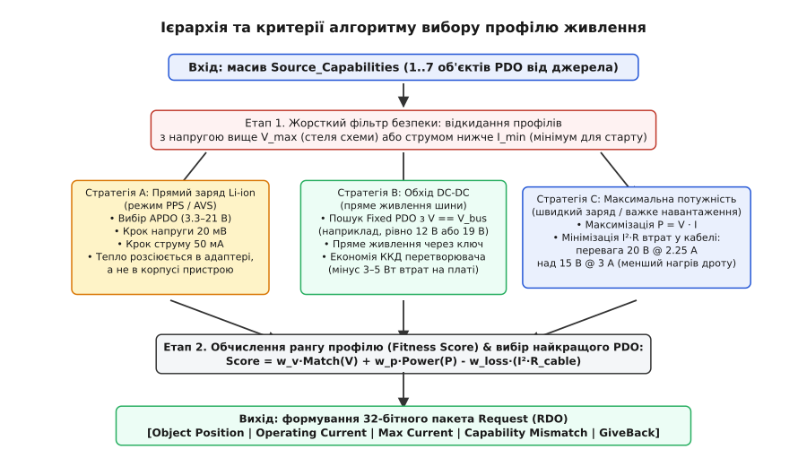
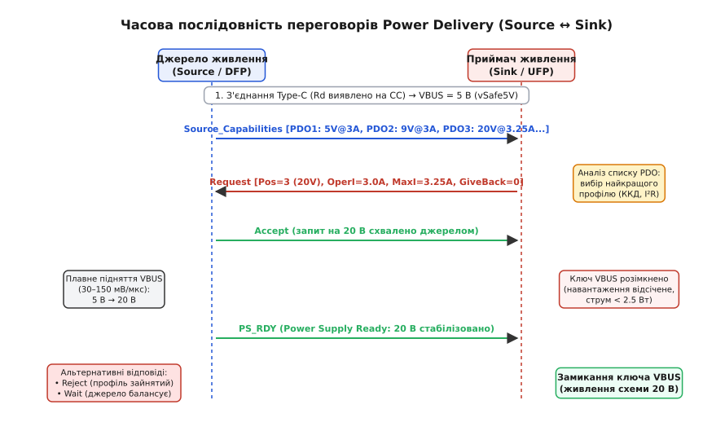
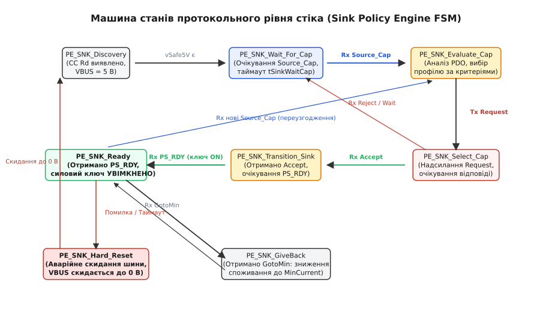

# PD-переговори стіка: алгоритм вибору профілю

<preknowlist>
- [USB Power Delivery](root:com-devices/usb-pd) — концепція протоколу, рівні напруг від 5 до 20 В та потужності до 100/240 Вт.
- [CC-лінії Type-C](root:com-devices/type-c-cc) — підтяжки Rd/Rp, визначення ролей Source/Sink та орієнтації роз'єму.
- [USB PD sink](root:hw-power/usb-pd-sink) — три бар'єри безпеки споживача, призначення вхідного силового ключа VBUS.
- [Силовий ключ](root:hw-components/mosfet-power-switch) — польовий MOSFET у ролі комутатора напруги, опір каналу та паразитичний діод.
- [Закон Ома](root:hw-analog/ohms-law) — зв'язок напруги, струму та теплових втрат Джоуля–Ленца I²·R.
</preknowlist>

Коли електронний пристрій підключають до роз'єму USB Type-C, за замовчуванням він отримує на шині VBUS лише безпечні 5 В із гарантованим струмом 500 мА. Якщо навантаженню — потужному дрону, автономному паяльнику, вимірювальному приладу чи батареї ноутбука — для повноцінної роботи потрібно 15 або 20 В, воно не може просто взяти цю напругу з кабелю. Джерело не знає, чи здатна схема витримати високу напругу без пробою, а споживач (Power Sink / UFP) не знає, яку максимальну потужність здатний надати підключений мережевий адаптер чи павербанк.

Між двома пристроями виникає необхідність цифрового узгодження силового контракту. Джерело надсилає структурований список своїх можливостей — масив об'єктів живлення (англ. *power data objects*, PDO), а мікроконтролер стіка виконує алгоритмічний аналіз цього списку, зіставляє його з апаратними обмеженнями своєї плати, обирає найкращий профіль за критеріями енергетичної ефективності та формує запит (англ. *request data object*, RDO). Цей процес вимагає суворого дотримання часових нормативів і станів скінченного автомата (англ. *finite state machine*, FSM), оскільки найменша помилка в розрахунках або передчасне вмикання силового навантаження призводить до аварійного відключення порту або фізичного вигорання компонентів.

---

## Анатомія енергетичного меню: що пропонує джерело у Source Capabilities

Цифровий діалог розпочинається з боку джерела (Source / DFP). Щойно апаратний компаратор фіксує підключення споживача за наявністю підтяжки Rd (5.1 кОм) на одній із ліній CC, джерело формує пакет даних `Source_Capabilities`, який містить від одного до семи 32-бітних слів PDO. Кожне таке слово описує конкретний режим віддачі електроенергії.

Стандарт USB Power Delivery розділяє всі профілі живлення на чотири класи за значенням старших бітів 31..30 у слові PDO:

```
Старші біти 31..30 у слові PDO:
  00b — Fixed Supply PDO (фіксована стабілізована напруга)
  01b — Variable Supply PDO (змінна нестабілізована напруга)
  10b — Battery Supply PDO (джерело постійної потужності)
  11b — Augmented PDO / APDO (програмовані джерела PPS та AVS)
```

Перший профіль у списку (позиція 1) за вимогами стандарту завжди зобов'язаний бути фіксованим профілем 5 В (`vSafe5V`). Це гарантує, що будь-який пристрій, незалежно від складності його прошивки, завжди знайде гарантовану точку старту.

### 1. Фіксовані профілі (Fixed Supply PDO)
Це найбільш розповсюджений тип живлення. Він задає стабілізовану напругу з фіксованим рядом номіналів: 5 В, 9 В, 15 В, 20 В (а також застарілий профіль 12 В). Поле напруги закодоване в одиницях 50 мВ, а максимальний струм — в одиницях 10 мА.

Окрім напруги та струму, Fixed PDO містить важливі системні прапорці:
* **Dual-Role Power (DRP):** вказує, що адаптер може мінятися ролями живлення;
* **Unconstrained Power:** сигналізує, що джерело живиться від стаціонарної мережі 230 В і не має лімітів за ємністю, на відміну від акумуляторного павербанка;
* **Peak Current:** визначає здатність силового каскаду витримувати короткочасні перевантаження за струмом (до 130%, 150% або 200% від номіналу протягом 10 мс) для запуску двигунів або заряду великих ємностей без просідання напруги;
* **EPR Mode Capable:** підтримка розширеного діапазону Extended Power Range (PD 3.1) для напруг 28 В, 36 В і 48 В.

### 2. Змінні та батарейні профілі (Variable / Battery PDO)
Змінний профіль (Variable Supply) задає діапазон зміни вихідної напруги від `Min Voltage` до `Max Voltage` (з дискретністю 50 мВ) та максимальний струм. Він застосовується для нестабілізованих трансформаторних блоків або сонячних контролерів, де напруга просідає під навантаженням.

Батарейний профіль (Battery Supply) оптимізований під пряме підключення до зарядних каскадів: замість ліміту струму джерело вказує максимально допустиму потужність у кроках по 250 мВт (наприклад, 45 Вт або 65 Вт). Стік самостійно обчислює допустимий струм на основі поточної напруги на клемах акумулятора.

### 3. Програмовані джерела живлення (Augmented PDO — PPS та AVS)
Програмований профіль SPR PPS (англ. *programmable power supply*) перетворює зовнішній мережевий адаптер на прецизійне джерело стабілізації струму та напруги. Діапазон напруги становить від 3.3 В до 21.0 В із надтонким кроком регулювання **20 мВ**, а струм обмеження задається з дискретністю **50 мА**.

У специфікації USB PD 3.1 цей механізм розширено профілем AVS (англ. *adjustable voltage supply*), який перекриває діапазон від 15 В до 48 В із кроком 100 мВ для потужностей до 240 Вт.

Повний опис кожного бітового поля, правила пакування байтів та масштабування фізичних величин наведено у вставці [детальний бітовий формат об'єктів живлення PDO та RDO](root:hw-power/pd-sink-negotiation/api-sink-request.md).

---

## Критерії та евристики вибору: чому найбільша напруга — не завжди найкраща

Отримавши масив PDO, недосвідчений розробник може реалізувати найпростішу логіку: «знайди профіль із найбільшою напругою або найбільшою потужністю і запроси його». У реальних інженерних системах така наївна стратегія призводить до трьох важких проблем:
1. **Пробій компонентів:** якщо плата розрахована на максимальну напругу 16 В (наприклад, встановлено електролітичні конденсатори на 16 В або вхідний DC-DC із максимальною напругою 18 В), запит профілю 20 В миттєво викличе незворотний пробій діелектрика.
2. **Паразитний нагрів у кабелі:** передача однієї й тієї самої потужності на різній напрузі кардинально різниться за тепловими втратами в мідних провідниках.
3. **Втрати на перетворенні на платі:** якщо пристрою для роботи внутрішньої шини потрібна напруга 12 В, запит 20 В змушує працювати понижувальний перетворювач (buck converter), який розсіює у тепло частину енергії безпосередньо всередині закритого корпусу приладу.


*Багатокритеріальний вибір профілю: первинна фільтрація за межами безпеки, оцінка втрат у кабелі, бонуси за обхід внутрішнього DC-DC або активацію PPS, та формування вихідного RDO.*

### Порівняння втрат у кабелі (закон Джоуля–Ленца)
Розглянемо практичну ситуацію: навантаженню потрібно отримати потужність 45 Вт. Джерело пропонує кілька профілів: 5 В @ 3 А (15 Вт макс), 15 В @ 3 А (45 Вт) та 20 В @ 2.25 А (45 Вт). Опір типового кабелю Type-C довжиною 1 метр разом із перехідними опорами роз'ємів становить `R_cable = 0.25 Ом`.

Розрахуємо втрати потужності на нагрів кабелю:

```
Для профілю 15 В @ 3 А:
  I = 3.0 А
  P_loss = I² · R_cable       [закон Джоуля–Ленца]
         = (3.0)² · 0.25      [підстановка струму 3 А та опору 0.25 Ом]
         = 2.25 Вт            [5.0% від усієї потужності 45 Вт]

Для профілю 20 В @ 2.25 А:
  I = 2.25 А
  P_loss = I² · R_cable       [закон Джоуля–Ленца]
         = (2.25)² · 0.25     [підстановка струму 2.25 А та опору 0.25 Ом]
         = 1.266 Вт           [лише 2.8% від потужності 45 Вт]
```

Перехід від 15 В до 20 В заощаджує майже 1 Вт тепла в кабелі та роз'ємах. На високих струмах (5 А) різниця стає ще критичнішою: дріт перестає нагріватися до небезпечних температур, а падіння напруги на кабелі зменшується.

### Пряме живлення (DC-DC Bypass) проти перетворення
Припустимо, внутрішня електроніка приладу (аудіопідсилювач, двигун або радіомодем) живиться від шини 12 В і споживає 60 Вт. Якщо стік обере профіль 20 В @ 3 А, на платі повинен працювати вхідний понижувальний перетворювач. Навіть якісний синхронний buck-перетворювач із ККД 94% при потужності 60 Вт розсіює у вигляді тепла:

```
P_dissipated = P_in · (1 - η)          [втрати потужності за ККД перетворювача η = 94%]
             = 60 Вт · (1 - 0.94)      [підстановка потужності 60 Вт та коефіцієнта 0.94]
             = 3.6 Вт                  [теплова потужність, розсіювана на платі]
```

Розсіювання 3.6 Вт тепла на друкованій платі площею в кілька квадратних сантиметрів викликає локальний нагрів текстоліту до 70–85 °C. Якщо ж джерело пропонує фіксований профіль 12 В @ 5 А (або регульований PPS, виставлений рівно на 12.0 В), стік відкриває прямий транзисторний ключ (load switch) із опором 10 мОм. Втрати на ключі складуть лише:

```
P_switch = I² · R_ds_on                [закон Джоуля–Ленца на опорі відкритого каналу]
         = (5.0 А)² · 0.010 Ом         [підстановка струму 5 А та опору 10 мОм]
         = 0.25 Вт                     [теплові втрати на відкритому MOSFET]
```

Тепловиділення всередині корпусу падає з 3.6 Вт до 0.25 Вт — більш ніж у 14 разів. Це усуває потребу в масивних радіаторах і виключає тепловий тротлінг процесора.

### Прямий заряд акумуляторів у режимі PPS та робота в режимі обмеження струму
Найбільш прогресивна стратегія застосовується для зарядки літій-іонних акумуляторів смартфонів і портативної техніки. У традиційній схемі всередині пристрою стоїть імпульсний чарджер, який бере 9 В або 20 В і знижує їх до 3.8–4.2 В на клемах батареї, сильно нагріваючи телефон.

У режимі PPS внутрішній перетворювач повністю вимикається: батарея підключається до шини VBUS через захисний MOSFET. Мікроконтролер стіка вимірює напругу на акумуляторі та кожні 100–500 мс надсилає адаптеру нові запити PPS RDO, піднімаючи напругу з кроком 20 мВ для підтримки заданого зарядного струму (фаза Constant Current).

Коли адаптер переходить у режим стабілізації струму (CC mode), його вихідна характеристика стає вертикальною: напруга на VBUS автоматично підлаштовується під внутрішню ЕРС акумулятора плюс падіння на проводах, а струм підтримується на рівні, замовленому в RDO. Усе теплове навантаження силового перетворення переноситься у зовнішній адаптер живлення, який має великі габарити та природну конвекцію повітря.

---

## Розширений діапазон потужності Extended Power Range (USB PD 3.1 EPR)

У специфікації USB PD 3.1 максимальну потужність передачі енергії збільшено зі 100 Вт (20 В @ 5 А) до **240 Вт** (48 В @ 5 А). Цей стандарт ввів поняття Standard Power Range (SPR, напруги до 20 В) та Extended Power Range (EPR, напруги від 28 В до 48 В).

Для переходу в режим EPR протокол встановлює сувору процедуру верифікації безпеки (EPR Entry Handshake):

1. **Автентифікація кабелю:** джерело та стік опитують вбудований у кабель чип E-Marker повідомленням `Discover Identity`. Кабель повинен явно підтвердити сертифікацію на роботу з напругами до 50 В (поле `VBUS Through Cable = 50V`) та струмом 5 А. Якщо кабель звичайний (SPR 20 В / 3 А), перехід в EPR апаратно блокується.
2. **Пакет EPR_Request:** стік надсилає спеціальне розширене повідомлення `EPR_Request` (Enter EPR Mode).
3. **Підтвердження та оголошення EPR PDO:** джерело підтверджує перехід пакетом `EPR_Mode` і надсилає розширений список `EPR_Source_Capabilities`, який містить нові фіксовані рівні (28 В, 36 В, 48 В) та діапазони AVS (від 15 В до 48 В).
4. **Механізм підтримки зв'язку (EPR Keep-Alive):** оскільки напруги до 48 В несуть високий ризик дугового розряду та перегріву, стік зобов'язаний надсилати повідомлення `EPR_KeepAlive` кожні 375 мс (таймаут `tEPRKeepAlive = 500 мс`). Якщо джерело не отримує цього сигналу, воно негайно знеструмлює шину VBUS, скидаючи напругу до 0 В, щоб запобігти неконтрольованому витоку енергії.

---

## Динамічний арбітраж потужності та швидка зміна ролей (Fast Role Swap)

У складних екосистемах (наприклад, ноутбук, підключений через док-станцію або монітор із вбудованим хабом) джерело живлення не є статичним. Док-станція живиться від мережі та віддає ноутбуку 100 Вт. Якщо користувач випадково висмикує вилку док-станції з розетки 230 В, уся система ризикує миттєво знеструмитися, що призведе до аварійного відключення зовнішніх накопичувачів та втрати даних.

Для запобігання цьому введено механізм Fast Role Swap (FRS):

1. **Аварійний сигнал на CC:** док-станція, втративши мережеве живлення, за кілька мікросекунд примусово притягує лінію CC до спеціального потенціалу `vFRSwap` (близько 0.9 В) на фіксований час 15 мкс.
2. **Миттєве перемикання ролей:** ноутбук, який щойно був споживачем (Sink), детектує сигнал FRS через апаратний аналоговий компаратор і за час менше **150 мкс** змінює свою роль на джерело (Source). Ноутбук відкриває свій силовий ключ VBUS і починає живити док-станцію від власного акумулятора.
3. **Безперервність живлення:** завдяки перемиканню за 150 мкс напруга на шині VBUS не встигає впасти нижче 4.5 В (за рахунок вихідних ємностей дока), і всі підключені зовнішні USB-пристрої продовжують працювати без перезавантаження.

---

## Керування пусковим струмом (Inrush Current) та заряд вхідних ємностей

Один із найпідступніших аспектів апаратної реалізації стіка — керування пусковим струмом при переході на підвищені напруги. За стандартом USB Type-C ємність на клемах VBUS самого роз'єму не повинна перевищувати `C_in <= 10 мкФ` під час первинного підключення, щоб уникнути іскріння контактів.

Однак реальне навантаження пристрою зазвичай містить фільтруючі батареї керамічних та електролітичних конденсаторів ємністю від 100 до 1000 мкФ. Ця ємність `C_bulk` ізольована від роз'єму вхідним силовим комутатором.

Коли стік отримує повідомлення `PS_RDY` на напрузі 20 В і замикає комутатор, струм заряду конденсаторів визначається швидкістю наростання напруги на виході ключа:

```
I_inrush = C_bulk · (dV / dt)          [струм через конденсатор при лінійній зміні напруги]
```

Якщо затвор MOSFET відкрити занадто швидко (наприклад, за 10 мкс):

```
I_inrush = 220·10⁻⁶ Ф · (20 В / 10·10⁻⁶ с)    [підстановка C = 220 мкФ та dt = 10 мкс]
         = 220·10⁻⁶ · 2 000 000 В/с
         = 440 А                               [струм короткого замикання]
```

Кидок струму амплітудою в сотні амперів миттєво викликає спрацьовування апаратного захисту від перевантаження (OCP) у блоці живлення, і джерело знеструмлює порт.

Щоб уникнути цього, драйвер затвора силового MOSFET реалізує кероване плавне наростання напруги (Soft-Start) із часом відкриття `dt = 2..5 мс`:

```
I_inrush = 220·10⁻⁶ Ф · (20 В / 2.0·10⁻³ с)   [підстановка C = 220 мкФ та dt = 2 мс]
         = 220·10⁻⁶ · 10 000 В/с
         = 2.2 А                               [безпечний пусковий струм]
```

Струм 2.2 А повністю вкладається в номінал 3.0 А, забезпечуючи плавний, безіскровий старт пристрою.

---

## Анатомія запиту Request: як стік формує RDO та заявляє свої наміри

Обравши цільовий PDO, стік зобов'язаний сформувати відповідне 32-бітне керівне слово запиту (Request Data Object — RDO) і надіслати його у повідомленні `Request`.

```
Бітове розташування Fixed/Variable RDO:
 31..28  27   26   25   24   23   22  21..20    19..10 (10 мА)       9..0 (10 мА)
+-------+----+----+----+----+----+----+-------+-------------------+-------------------+
|ObjPos |GvBk|MisM|Comm|NoSp|Unch|EPR | Res   | Operating Current | Max / Min Current |
+-------+----+----+----+----+----+----+-------+-------------------+-------------------+
```

### Поля та прапорці запиту RDO

1. **Object Position (біти 31..28):** порядковий номер обраного профілю зі списку `Source_Capabilities` (значення від `1` до `7`). Позиція `1` завжди відповідає базовим 5 В.
2. **Operating Current (біти 19..10):** фактичний струм, необхідний пристрою прямо зараз для нормального функціонування в одиницях **10 мА** (наприклад, значення `200` відповідає 2.0 А). Це значення не може перевищувати `Max Current` обраного PDO.
3. **Max Operating Current (біти 9..0):** максимальний граничний струм, який пристрій обіцяє не перевищувати за будь-яких умов пікового навантаження.
4. **Capability Mismatch (біт 26):** прапорець енергетичного дефіциту. Якщо пристрою для повноцінної роботи потрібно 65 Вт, а джерело пропонує щонайбільше 15 Вт на 5 В, стік змушений підписати контракт на 5 В, але встановлює `Capability Mismatch = 1`. Це повідомляє інтелектуальному джерелу (наприклад, розумному доку або хабу), що споживач обмежений у можливостях. Хост може показати користувачеві попередження в операційній системі або перерозподілити живлення від інших портів.
5. **GiveBack Flag (біт 27):** дозвіл на динамічний арбітраж потужності. Встановлюючи цей біт у `1b`, стік повідомляє джерелу: «Я готовий тимчасово зменшити своє споживання до значення в полі `Min Operating Current`, якщо іншому пристрою терміново знадобиться енергія». Якщо джерело надішле наказ `GotoMin`, стік зобов'язаний протягом 35 мс скинути споживання струму.
6. **No USB Suspend (біт 24):** якщо пристрій є чисто силовим навантаженням (паяльник, лампа, мотор) і не бере участі в обміні даними USB, цей біт встановлюється в `1b`. Він забороняє джерелу знеструмлювати пристрій, коли шина даних переходить у сплячий режим (Selective Suspend).
7. **USB Communications Capable (біт 25):** інформує джерело, чи підтримує пристрій передачу даних по інтерфейсу USB.

---

## Протокол взаємодії: реакція на відповіді джерела та перехідний процес на VBUS

Після відправлення пакета `Request` стік зупиняє передачу і запускає таймер очікування відповіді `tSenderResponse` (не більше 30 мс). Джерело перевіряє свій внутрішній енергетичний баланс і надсилає одне з трьох контрольних повідомлень.


*Повна часова послідовність переговорів: відправлення меню PDO, аналіз, надсилання Request, відповідь Accept, плавний перехід VBUS та фінальне підтвердження PS_RDY для замикання силового ключа.*

### 1. Відповідь Accept та перехідний інтервал
Повідомлення `Accept` означає, що джерело схвалило запит. З цієї миті починається силовий перехідний процес:
* Джерело змінює опорну напругу свого внутрішнього імпульсного стабілізатора.
* Напруга VBUS плавно зростає або спадає з нормованою швидкістю наростання (slew rate) від 30 мВ/мкс до 150 мВ/мкс. Плавне наростання запобігає виникненню індуктивних викидів на паразитичній індуктивності кабелю.
* **Інваріант стіка:** протягом усього часу зміни напруги вхідний силовий MOSFET стіка зобов'язаний бути **розімкнений**. Будь-яка спроба споживати значний струм під час руху напруги спричинить зрив зворотного зв'язку джерела і призведе до аварійного скидання порту.

### 2. Сигнал готовності PS_RDY
Коли напруга на шині VBUS досягає домовленого рівня (наприклад, 20 В) і стабілізується в межах допустимого коридору ±5%, джерело надсилає пакет `PS_RDY` (англ. *power supply ready*).

Отримання `PS_RDY` — це єдиний легітимний тригер для замикання силового комутатора. Контролер стіка подає керівний сигнал на затвор MOSFET, напруга надходить на внутрішні схеми, і пристрій переходить у повноцінний робочий режим.

### 3. Відповіді Reject та Wait
* **`Reject`:** джерело відхилило запит (наприклад, через те, що запрошений струм перевищує можливості кабелю без E-Marker або потужність уже зарезервована іншим портом). У разі відмови попередній силовий контракт залишається чинним. Якщо це був перший запит після підключення — система залишається на безпечних 5 В.
* **`Wait`:** джерело зайняте тимчасовим внутрішнім процесом (наприклад, перерахунком сумарного теплового бюджету або розрядом ємностей). Стік зобов'язаний витримати паузу `tSinkWaitCap` (100 мс) і не надсилати нових запитів, очікуючи дозволу або нового списку `Source_Capabilities`.

---

## Машина станів протокольного рівня стіка (Policy Engine FSM)

Для забезпечення абсолютної надійності алгоритм переговорів стіка оформлюється у вигляді скінченного автомата з чіткими інваріантами для кожного стану.


*Граф станів автомата Sink Policy Engine: обробка таймаутів, укладання контракту, реакція на відмови та аварійне скидання Hard Reset.*

1. **`PE_SNK_Discovery`:** початковий стан. Контролер виявляє стабільні 5 В на VBUS за допомогою компаратора напруги. Силовий ключ навантаження гарантовано вимкнено.
2. **`PE_SNK_Wait_For_Cap`:** стік зводить таймер `tTypeCSinkWaitCap` (620 мс) і чекає пакет `Source_Capabilities`. Якщо таймер закінчився, а пакет не надійшов (підключено звичайний адаптер без PD) — стік замикає ключ і працює від базових 5 В із лімітом струму згідно з аналоговою напругою на CC.
3. **`PE_SNK_Evaluate_Cap`:** розбір отриманого масиву PDO, розрахунок скорингу профілів та формування слова RDO.
4. **`PE_SNK_Select_Cap`:** надсилання пакета `Request` та запуск таймера `tSenderResponse` (30 мс).
5. **`PE_SNK_Transition_Sink`:** отримано `Accept`. Очікування стабілізації VBUS за таймером `tPSTransition` (550 мс). Навантаження ізольоване.
6. **`PE_SNK_Ready`:** отримано `PS_RDY`. Силовий ключ замикається. Робочий режим.
7. **`PE_SNK_GiveBack`:** отримано команду `GotoMin`. Контролер за час до 35 мс зменшує власне споживання до `Min Operating Current`.
8. **`PE_SNK_Hard_Reset`:** аварійне скидання шини у разі таймаутів чи помилок CRC. Ключ навантаження негайно розмикається, на лінію CC подається сигналізація Hard Reset, VBUS скидається в 0 В.

Повний вихідний код реалізації автомата на мовах C та C++ із розбором взаємодії з апаратним PHY наведено у вставці [скінченний автомат та алгоритм вибору профілю в коді FSM](root:hw-power/pd-sink-negotiation/proj-sink-fsm.md).

---

## Збої, перешкоди та аварійні сценарії

Надійність силової системи визначається тим, як вона поводиться в позаштатних ситуаціях. У роз'ємі USB Type-C силові контакти VBUS розташовані на відстані лише 0.5 мм від чутливих сигнальних ліній CC. При механічному перекосі або неакуратному висмикуванні штекера можливе короткочасне замикання високої напруги (20 В) на цифрові лінії або виникнення сильного брязкоту контактів.

```
Класифікація та ієрархія скидань у протоколі USB PD:
  
  Soft Reset (програмне скидання):
  • Не чіпає силову шину VBUS (напруга залишається 9/15/20 В);
  • Скидає лише порядкові номери MessageID та черги пакетів;
  • Викликається при спотворенні CRC або незначних помилках кадру.
  
  Hard Reset (апаратне силове скидання):
  • Джерело примусово знеструмлює VBUS до рівня vSafe0V (< 0.8 В);
  • Стік негайно розмикає вхідний силовий ключ навантаження;
  • Внутрішні розрядні резистори скидають залишковий заряд ємностей;
  • Через tSrcRecover (660–1000 мс) джерело повторно подає стартові 5 В.
```

### 1. Протокольні збої та Soft Reset
Якщо під час передачі кадру виникає електромагнітна завада, що спотворює контрольну суму CRC-32, канальний рівень не надсилає підтвердження `GoodCRC`. Передавач робить до трьох автоматичних повторів (`nRetryCount = 3`). Якщо зв'язок не відновився, ініціюється процедура `Soft_Reset`.

`Soft_Reset` є м'яким програмним скиданням: він скидає лічильники повідомлень `MessageID` в `0`, але **не змінює напругу на VBUS**. Це дозволяє відновити синхронізацію логічних рівнів без перезавантаження мікроконтролера стіка та без скидання живлення навантаження.

### 2. Фатальні помилки та Hard Reset
Якщо після `Soft_Reset` зв'язок не відновлюється або джерело не відповідає на запити протягом нормативних таймаутів, автомат переходить у стан `Hard_Reset`.

Сигнал Hard Reset формується не звичайними пакетами даних, а спеціальною фізичною послідовністю сигналів на лінії CC (впорядкований набір символів K-кодів), яку апаратний трансивер здатний розпізнати навіть за повного зависання програмного стека.

При отриманні Hard Reset:
1. Джерело негайно знеструмлює силовий перетворювач і замикає внутрішній розрядний резистор, скидаючи напругу VBUS до рівня менше 0.8 В (`vSafe0V`) за час `tPSSourceOff` (750–920 мс).
2. Стік негайно розмикає свій силовий ключ, захищаючи внутрішні схеми від перехідних процесів і знеструмлюючи навантаження.
3. Джерело витримує паузу відновлення `tSrcRecover` (до 1000 мс) і повторно піднімає базові 5 В (`vSafe5V`).
4. Обидві сторони розпочинають цикл переговорів з чистого аркуша зі стану `Discovery`.

### 3. Раптове відключення кабелю (Hot-Unplug)
Коли користувач висмикує штекер під час передачі максимальної потужності (наприклад, 20 В @ 5 А = 100 Вт), аналогова напруга на лінії CC зникає практично миттєво (за кілька мікросекунд), оскільки розривається контакт резистора Rd.

Апаратний компаратор контролера PD фіксує розрив лінії CC і за час не більше 10–20 мкс формує аварійний сигнал на драйвер силового ключа. Ключ розмикається до того, як розімкнуться силові контакти VBUS. Це запобігає виникненню електричної дуги між контактами гнізда та штекера Type-C, яка за напруги 20 В та струму 5 А здатна швидко зруйнувати золоте напилення контактів і вивести роз'єм з ладу.

---

## Тестування та валідація на відповідність стандартам USB-IF

У процесі промислової розробки та сертифікації USB-IF стік проходить обов'язкове тестування на автоматизованих вимірювальних стендах (наприклад, LeCroy Voyager або Ellisys USB Explorer).

Програма верифікації охоплює такі критичні стрес-тести:
* **Граничні часові перевірки (Timing Compliance):** стенд штучно затримує надсилання повідомлень `Accept` або `PS_RDY` до максимальних меж (29.5 мс та 540 мс відповідно), перевіряючи, чи не виникає передчасних таймаутів в автоматі стіка.
* **Стрибки та провали VBUS (Voltage Droop / Sag):** під час переходу з 5 В на 20 В стенд створює короткочасне просідання напруги до 4.2 В на час 10 мс, перевіряючи стійкість алгоритму до хибних спрацьовувань компаратора UVLO.
* **Ін'єкція помилок CRC та пошкоджених бітів:** стенд навмисно спотворює один біт у кожному третьому пакеті `Source_Capabilities`, перевіряючи коректність відпрацювання апаратних повторів `nRetryCount` та безаварійний перехід у `Soft_Reset`.
* **Перевірка захисту від зворотного струму:** стенд подає на роз'єм Type-C напругу 5 В, коли внутрішній акумулятор стіка заряджений до 8.4 В, фіксуючи витік струму назад у кабель (витік не повинен перевищувати 10 мкА).

Лише пристрій, скінченний автомат якого безпомилково проходить усі перелічені тести, отримує сертифікат сумісності та гарантує стабільну, безпечну роботу з будь-якими зарядними станціями та кабелями у світі.
