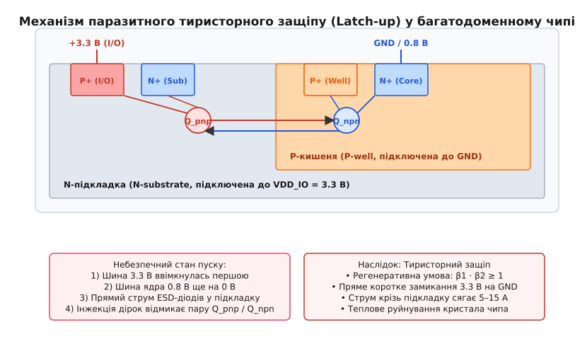
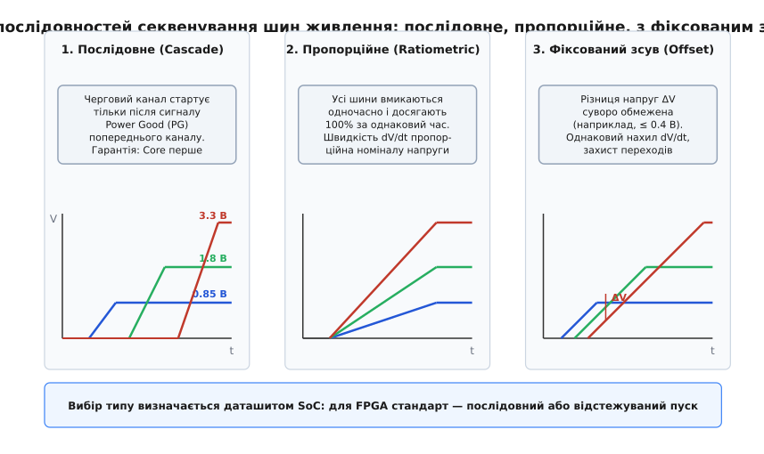
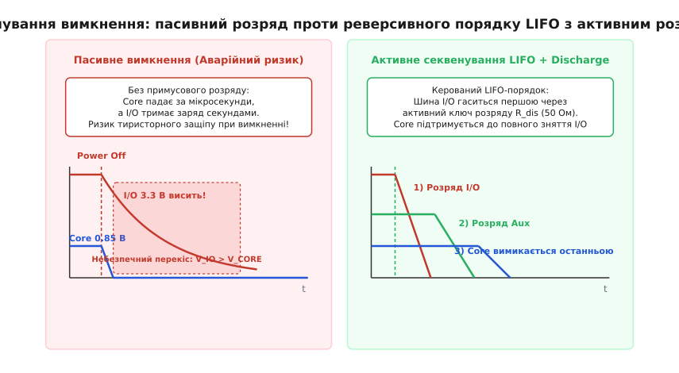
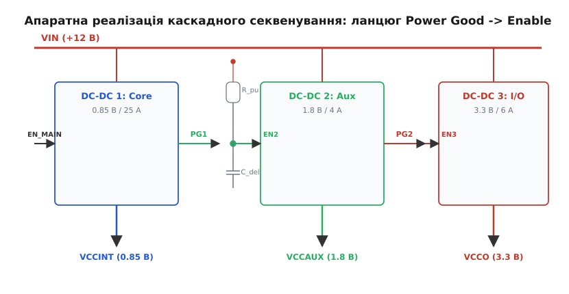

# Секвенування шин живлення: фізика доменів, тиристорний защіп і топології багатоканального пуску

<preknowlist>
- [Шини живлення](topic:hw-power/power-rails) — принципи побудови розподілених живильних ліній у складних цифрових схемах.
- [Закон Ома](topic:hw-analog/ohms-law) — базовий зв'язок напруги, струму та опору в колах постійного струму.
- [Стала RC](topic:hw-analog/rc-time-constant) — експоненційна динаміка заряду та розряду конденсатора через опір `τ = R·C`.
- [Компаратор](topic:hw-analog/comparator) — принцип детектування порогових рівнів напруги з гістерезисом.
- [LDO](topic:hw-power/ldo) — лінійний стабілізатор з виводами дозволу (Enable) та індикації стану (Power Good).
- [Buck-перетворювач](topic:hw-power/buck) — імпульсний регулятор з керованим часом наростання та моніторингом виходу.
- [Тиристор](topic:hw-components/thyristor-scr) — регенеративне вмикання чотиришарової напівпровідникової структури `p-n-p-n`.
- [Силовий ключ](topic:hw-components/mosfet-power-switch) — комутація силових кіл та активний розряд польовими транзисторами.
</preknowlist>

У сучасному чипі рівня FPGA Xilinx UltraScale+, Intel Agilex чи процесора додатків ARM Cortex-A на кремнієвому кристалі площею менш як два квадратні сантиметри одночасно функціонують від шести до дванадцяти незалежних доменів живлення з номіналами напруг від 0.72 В до 3.3 В. Якщо подати вхідну напругу на плату й дозволити всім стабілізаторам стартувати безконтрольно, низьковольтне ядро (0.85 В) через велику ємність фільтрів та повільний вихід перетворювача на режим може отримати живлення на 5–10 мілісекунд пізніше, ніж периферійні блоки вводу-виводу (3.3 В). У цей короткий часовий проміжок струм із шини 3.3 В через пряме зміщення захисних діодів від електростатичного розряду (ESD) та міждоменних транзисторів проривається у знеструмлені ланцюги ядра, підпалює паразитну чотиришарову тиристорну структуру `p-n-p-n`, струм крізь спільну кремнієву підкладку стрибає до 10–15 А, і кристал зазнає незворотного теплового руйнування за лічені мілісекунди. Секвенування шин живлення (*power rail sequencing*, від латинського *sequentia* — черговість, послідовне прямування) — це комплекс апаратних і системних методів суворого керування порядком увімкнення, швидкістю наростання, часовими інтервалами затримки, відносним зсувом напруг та реверсивним розрядом кожного силового домену системи.

### Анатомія багатодоменного чипа: чому домени живлення розділилися

Історично цифрові мікросхеми працювали від єдиної живильної лінії: стандарт ТТЛ жорстко вимагав 5.0 В, а перші покоління КМОН-логіки живилися від 5.0 В або 3.3 В. Проте зі зростанням тактових частот до гігагерцового діапазону та зменшенням топологічних норм літографії до 16, 7 та 5 нанометрів товщина підзатворного діелектрика польових транзисторів зменшилася до лічених атомних шарів (менш як 1.5 нм). Електричне поле напруженістю понад 1 В/нм спричиняє тунельний пробій тонкого оксиду кремнію, тому робочу напругу транзисторів ядра логіки довелося послідовно знижувати: 2.5 В → 1.8 В → 1.2 В → 0.9 В → 0.72 В.

Зниження напруги ядра стало критичним фактором виживання чипів і з точки зору тепловиділення. Динамічна потужність `P_dyn`, яка розсіюється під час перезаряджання паразитної ємності затворів мільярдів логічних вентилів на тактовій частоті `f`, квадратично залежить від напруги живлення `V`:

```
P_dyn = C_total · V² · f
```

Зменшення напруги ядра з 3.3 В до 0.85 В зменшує динамічні втрати в 15 разів:

```
(3.3 / 0.85)²
= (3.882)²             [відношення напруг живлення]
≈ 15.07                [квадратичний виграш у динамічній потужності]
```

Водночас мікросхема не існує ізольовано: вона повинна взаємодіяти із зовнішніми компонентами на друкованій платі — модулями пам'яті DDR4/DDR5 (1.1–1.2 В), мікросхемами Flash-пам'яті (1.8 В), шинами зв'язку, датчиками та зовнішніми контролерами промислових стандартів (2.5 В або 3.3 В LVCMOS). Спроба вивести напругу 0.85 В на довгі друковані провідники плати призвела б до катастрофічної втрати завадостійкості: шум перемикання та падіння напруги на опорі ліній зв'язку з'їли б увесь логічний запас перешкодозахищеності.

В результаті кристал сучасного процесора або FPGA розділився на кілька функціональних та ізольованих силових доменів:
1. **Домен обчислювального ядра (`VCCINT` / `VDD_CORE`):** напруга 0.72–0.9 В, споживання струму сягає десятків або сотень ампер (до 50–200 А в пікових режимах), мінімальна товщина затворного діелектрика, екстремальні вимоги до точності підтримки напруги (допуск ±2–3%).
2. **Домен пам'яті блоків та логічних матриць (`VCCBRAM`):** напруга 0.85–0.9 В, виділена для живлення внутрішніх масивів статичної пам'яті SRAM, чутлива до шумів комутації ядра.
3. **Допоміжний домен (`VCCAUX` / `VDD_SOC`):** напруга 1.8 В, живить внутрішні джерела опорної напруги Bandgap, фазові автопідстроювачі частоти (PLL), аналогові компаратори та схеми скидання за живленням (Power-On Reset, POR).
4. **Домен високошвидкісних трансиверів (`VCC_GT` / `MGTAVCC` / `MGTAVTT`):** напруги 0.9 В, 1.2 В та 1.8 В, живлять аналогові каскади передавачів та приймачів ліній SerDes (PCIe Gen4/Gen5, 100G Ethernet) з жорсткими обмеженнями на фазове тремтіння (*jitter*) та пульсації (шум менш як 10 мВ у смузі до 100 МГц).
5. **Домени банків вводу-виводу (`VCCO` / `VDD_IO`):** незалежні живильні лінії 1.2 В, 1.5 В, 1.8 В, 2.5 В або 3.3 В для кожного банку виводів мікросхеми, що контактують зі зовнішнім світом.

Усі ці домени інтегровані на єдиній спільній кремнієвій пластині. Доки всі живильні лінії стабільні та знаходяться в межах номінальних значень, спеціальні схеми узгодження рівнів (*level shifters*) та захисні ізоляційні структури надійно розмежовують домени. Але в перехідних процесах увімкнення та вимкнення живлення виникає небезпечна асиметрія потенціалів.

### Фізичний механізм катастрофи: паразитний тиристорний защіп (Latch-up)

Головна небезпека асинхронного увімкнення багатодоменного чипа криється в фундаментальній будові КМОН-структури (комплементарної пари польових транзисторів PMOS та NMOS), розташованої на єдиній напівпровідниковій підкладці.

У класичному напівпровідниковому процесі з n-підкладкою (*n-substrate*) транзистори p-типу (PMOS) формуються безпосередньо в об'ємі підкладки, підключеної до найвищого потенціалу домену (наприклад, `VDD_IO` = 3.3 В). Транзистори n-типу (NMOS) формуються всередині штучно створеної легованої кишені p-типу (*p-well*), яка підключається до спільної шини землі (`GND` = 0 В).

Якщо простежити чергування напівпровідникових шарів між витоком PMOS-транзистора домену 3.3 В та витоком NMOS-транзистора суміжного домену ядра 0.85 В, виявляється чотиришарова структура `p-n-p-n`:
1. Шар `p+`: область витоку або стоку PMOS-транзистора домену вводу-виводу (підключена до 3.3 В).
2. Шар `n`: об'єм n-підкладки або кишені (з'єднаний з шиною підкладки через паразитний опір `R_sub`).
3. Шар `p`: об'єм p-кишені NMOS-транзистора (з'єднаний із землею через паразитний опір `R_well`).
4. Шар `n+`: область витоку або стоку NMOS-транзистора ядра (підключена до землі або внутрішньої шини).


*Формування паразитної чотиришарової структури p-n-p-n на межі доменів у КМОН-кристалі. У звичайному режимі паразитні транзистори Q_pnp та Q_npn закриті. При ранній подачі напруги 3.3 В на виводи за знеструмленого ядра прямий струм ESD-діодів інжектує дірки в p-кишеньку, відмикаючи регенеративну петлю з прямим коротким замиканням 3.3 В на землю через кристал.*

Ця комбінація шарів утворює два перехресно увімкнених біполярних транзистори: вертикальний `p-n-p` транзистор `Q_pnp` та горизонтальний `n-p-n` транзистор `Q_npn`. Колектор `Q_pnp` з'єднаний з базою `Q_npn`, а колектор `Q_npn` з'єднаний з базою `Q_pnp`. Це класична еквівалентна схема напівпровідникового тиристора (SCR).

У стаціонарному робочому стані обидва паразитні біполярні транзистори надійно закриті, оскільки емітерно-базові переходи не мають прямого зміщення: напруга на підкладці дорівнює напрузі витоку PMOS, а напруга в p-кишені дорівнює нулю.

Розглянемо, що відбувається, коли шина `VDD_IO` (3.3 В) вмикається першою, тоді як шина ядра `VDD_CORE` (0.85 В) ще знаходиться на нульовому потенціалі. На кожному контактному майданчику та на кожній внутрішній лінії між доменами встановлено захисні діоди від статики (ESD-діоди). Верхній захисний діод підключений між сигнальною лінією та шиною живлення відповідного домену.

Коли вивід зв'язку або транзистор зсуву рівня опиняється під високим потенціалом 3.3 В за нульової напруги на внутрішній шині ядра, p-n перехід захисного діода або внутрішній ізолюючий перехід потрапляє під пряму напругу, що перевищує поріг відкриття кремнію (близько 0.6–0.7 В):

```
V_diode = V_IO - V_CORE = 3.3 В - 0 В = 3.3 В >> 0.7 В
```

Крізь відчинений p-n перехід у тіло кристала починає текти струм інжекції носіїв заряду (дірок у p-кишеньку та електронів у n-підкладку). Цей струм створює спад напруги на розподіленому паразитному опорі кишені `R_well`. Як тільки падіння напруги на `R_well` досягає величини прямого відкриття емітерного переходу транзистора `Q_npn` (понад 0.6 В), цей транзистор відмикається:

```
I_inject · R_well ≥ V_BE(Q_npn) ≈ 0.65 В
```

Колекторний струм відкритого транзистора `Q_npn` починає витікати з бази транзистора `Q_pnp`, створюючи спад напруги на опорі підкладки `R_sub`. Це своєю чергою призводить до прямого зміщення емітерно-базового переходу `Q_pnp` і його відмикання. Колекторний струм `Q_pnp` тепер втікає в базу `Q_npn`, ще сильніше відкриваючи його.

Виникає регенеративний лавиноподібний процес із додатним зворотним зв'язком. Умова виникнення стійкого защіпу описується добутком статичних коефіцієнтів підсилення струму бази обох транзисторів:

```
β(Q_pnp) · β(Q_npn) ≥ 1
```

Після виконання цієї умови паразитна структура переходить у стан глибокого насичення і починає **самостійно утримувати себе у відкритому стані**, навіть якщо первинний інжекційний струм зникне. Між шиною 3.3 В та шиною землі `GND` утворюється низькоомний канал із падінням напруги всього 1.0–1.5 В (напруга утримання тиристора, *holding voltage*).

Струм крізь цей канал обмежується виключно внутрішнім опором джерела живлення та опором доріжок друкованої плати. За лічені мікросекунди струм підкладки досягає 5–20 А. Локальна щільність струму в кремнії сягає мегаамперів на квадратний сантиметр, що викликає миттєве локальне розплавлення металізації кристала, пробій ізолюючих оксидів та фізичну загибель мікросхеми.

Вимкнути стан защіпу програмними засобами або подачею логічного сигналу скидання (*Reset*) принципово **неможливо**: єдиний спосіб вивести структуру із защіпу — повністю зняти напругу живлення та опустити струм нижче струму утримання (*holding current*).

> 🔧 **Навіщо це.** Якщо під час увімкнення складної плати процесор або FPGA раптово перевантажує блок живлення, споживаючи аномальні 10 А, сильно розігрівається за секунди, але при цьому не подає ознак життя — у 95% випадків стався паразитний тиристорний защіп через порушення порядку подачі напруг живлення.

### Невизначеність логічних станів і зворотне паразитне живлення (Back-powering)

Навіть якщо струм інжекції під час асинхронного увімкнення не досяг порогу запалювання тиристорного защіпу, виникає друга група руйнівних явищ: зворотне живлення крізь виводи та невизначеність логічних станів.

**Зворотне паразитне живлення (*Back-powering* / *Phantom Powering*):**
Коли напруга з'являється на вході цифрового виводу знеструмленого домену, струм крізь верхній захисний ESD-діод протікає безпосередньо у внутрішню шину живлення цього домену. Вихідні ємності фільтрів знеструмленого регулятора починають заряджатися через захисний діод. Оскільки захисний діод розрахований на короткочасні наносекундні імпульси статики величиною в міліампери, тривалий постійний струм заряду ємностей (сотні міліампер) викликає перегрів і деградацію p-n переходу діода з наступним тепловим пробоєм.

Крім того, шина живлення домену ядра «підтягується» цим паразитно струмом до проміжного потенціалу:

```
V_parasitic = V_IO - V_diode_drop ≈ 3.3 В - 0.6 В = 2.7 В
```

Для ядра з номіналом 0.85 В напруга 2.7 В є фатальною: тонкий підзатворний діелектрик 7-нм транзисторів пробивається високою напруженістю поля за лічені мілісекунди.

**Наскрізні струми вентилів (*Shoot-through / Crowbar currents*):**
КМОН-інвертор складається з верхнього транзистора PMOS та нижнього NMOS. За нормального логічного рівня 0 або 1 один транзистор повністю відкритий, а другий надійно закритий, тому статичний струм споживання вентиля прямує до нуля (визначається лише мікроскопічними витоками).

Коли напруга живлення домену наростає аномально повільно або «висить» на проміжному рівні 0.4–0.6 В через паразитне живлення, обидва транзистори (і PMOS, і NMOS) потрапляють у напіввідкритий лінійний режим. Виникає прямий наскрізний канал струму з шини живлення на землю через кожен логічний вентиль кристала:

```
I_shoot = (V_rail - V_th_p - V_th_n) / (R_on_p + R_on_n)
```

Коли одночасно наскрізний струм виникає в мільйонах вентилів ядра, сумарний струм спокою кристала стрибає на десятки ампер ще до старту генератора тактових імпульсів.

**Конфлікти вихідних драйверів (*Bus Contention*):**
Внутрішні конфігураційні комірки пам'яті SRAM у FPGA та регістри станів в ARM-процесорах під час подачі живлення повинні пройти процедуру ініціалізації (*Power-On Reset*, POR). Якщо напруга ядра наростає немонотонно або з запізненням відносно периферії, внутрішня логіка скидання спрацьовує некоректно. Тригери займають випадковий стан, одночасно відмикаючи вихідні транзистори на зустрічних шинах зв'язку: один драйвер намагається встановити логічну одиницю (тягне лінію до 3.3 В), а другий — логічний нуль (тягне лінію до землі). Виникає пряме міжвивідне коротке замикання з вигоранням вихідних каскадів буферів вводу-виводу.

### Три фундаментальні типи секвенування пуску

Для усунення ризиків тиристорного защіпу, наскрізних струмів та перекосу потенціалів розробники систем живлення використовують три стандартизовані топології наростання напруг: послідовне, пропорційне та відстежуване з фіксованим зсувом.


*Порівняння трьох фундаментальних топологій секвенування багатоканального живлення. Зліва: послідовний пуск (Cascade) з черговим стартом за сигналом Power Good. По центру: пропорційний пуск (Ratiometric) з одночасним досягненням 100% за фіксований час T_ramp. Справа: пуск з фіксованим зсувом (Simultaneous Offset), де миттєва різниця ΔV між шинами суворо лімітована.*

#### 1. Послідовне / Каскадне секвенування (Sequential / Cascade Sequencing)

У послідовній топології кожна наступна шина живлення починає підйом напруги лише після того, як попередня шина досягла свого номінального значення і стабілізувалася в межах заданого допуску (зазвичай ±3–5%).

**Алгоритм роботи каскаду:**
1. Головний сигнал дозволу плати `EN_MAIN` активує перетворювач першого ступеня — зазвичай це шина ядра `VCCINT` (0.85 В).
2. Напруга `VCCINT` наростає з контрольованою швидкістю `dV/dt` завдяки схемі м'якого старту (*soft-start*).
3. Коли напруга досягає 90–95% номіналу, внутрішній компаратор перетворювача ядра знімає блокування з виходу готовності живлення `Power Good` (`PG1`).
4. Сигнал `PG1` (з опціональною часовою затримкою `t_delay`, сформованою RC-ланкою або таймером) подається на вхід дозволу `EN2` другого перетворювача — допоміжної шини `VCCAUX` (1.8 В).
5. Після стабілізації `VCCAUX` сигнал `PG2` активує вхід `EN3` перетворювача інтерфейсів `VCCO` (3.3 В).
6. Останній сигнал `PG3` знімає апаратний сигнал системного скидання `RESET_N`, дозволяючи процесору почати виконання коду.

**Переваги каскадної схеми:**
- Найвища надійність захисту від защіпу: шина ядра гарантовано присутня раніше, ніж будь-яка напруга з'явиться на контактах вводу-виводу.
- Мінімізація сумарного пускового струму (*inrush current*): оскільки вихідні конденсатори кожної шини заряджаються у свій окремий часовий проміжок, пікові струми заряду ємностей не накладаються один на одного. Це дозволяє зменшити ємність вхідних фільтрів та вимоги до первинного джерела 12 В.
- Простота апаратної реалізації на дискретних компонентах без застосування мікроконтролерів.

#### 2. Пропорційне секвенування (Ratiometric Sequencing)

У пропорційній топології всі перетворювачі починають наростання вихідної напруги одночасно в момент часу `t_start` і досягають своїх встановлених номінальних значень одночасно в момент `t_ready`.

Швидкість наростання напруги `dV/dt` кожного каналу пропорційна його кінцевому номіналу `V_nom`. Для будь-якого проміжного моменту часу `t` відношення поточної напруги до номінальної залишається строго однаковим для всіх каналів:

```
V_core(t) / V_core_nom = V_aux(t) / V_aux_nom = V_io(t) / V_io_nom = t / T_ramp
```

Для реалізації пропорційного пуску стабілізатори повинні мати регульований вхід зовнішнього опорного сигналу відстеження (*Tracking Pin*). На цей вхід подається опорна пилкоподібна напруга з єдиного генератора плавного пуску, масштабована резистивними дільниками відповідно до коефіцієнтів передачі контурів зворотного зв'язку кожного каналу.

**Сфера застосування:**
Пропорційне секвенування застосовується в радіочастотних мікросхемах, змішувачах сигналів, багатокаскадних операційних підсилювачах та деяких ASIC, де внутрішні диференційні каскади вимагають збереження синфазного балансу напруг зміщення під час пуску для уникнення насичення підсилювальних трактів.

#### 3. Секвенування з фіксованим зсувом напруги (Simultaneous / Fixed Offset Tracking)

У топології з фіксованим зсувом усі канали запускаються одночасно і наростають з **однаковою абсолютною швидкістю** `dV/dt` (паралельні криві на графіку). При цьому миттєва різниця напруг між будь-якими двома шинами `ΔV(t)` у будь-який момент часу суворо обмежена внутрішніми параметрами безпеки кристала:

```
| V_A(t) - V_B(t) | ≤ ΔV_max ≈ 0.3...0.5 В
```

**Фізичне обґрунтування:**
Ця топологія є обов'язковою для процесорів та FPGA, в яких ізоляція між доменами виконана на базі низьковольтних діодних бар'єрів Шотткі або спеціальних зустрічно-паралельних обмежувачів на кремнії. Пряма напруга відкриття таких елементів становить близько 0.4–0.5 В при підвищеній температурі кристала (+85...100 °C). Якщо під час пуску різниця напруг між доменами ядра та периферії перевищить 0.4 В, крізь внутрішні обмежувачі потече небезпечний струм вирівнювання.

Для забезпечення фіксованого зсуву вихідні каскади регуляторів охоплюються спільним контуром динамічного стеження (*dynamic tracking loop*), де регулятор вищої напруги використовує вихідну напругу нижчого регулятора як динамічний рівень зміщення.

### Секвенування вимкнення (Power-Down Sequencing) та активний розряд

Більшість апаратних збоїв у польових умовах трапляються не під час увімкнення, а в момент **зняття живлення**.

Коли вхідна напруга 12 В відключається, перетворювачі перестають підтримувати напругу на шинах. Якщо процес вимкнення не контролюється, швидкість спаду напруги на кожній шині визначається виключно струмом навантаження та залишковою ємністю вихідного фільтра `C_out`:

```
dV / dt = - I_load / C_out
```

Шина ядра `VCCINT` (0.85 В) навантажена потужною логікою, яка навіть у режимі спокою споживає кілька ампер. Тому за наявності фільтра ємністю 1000 мкФ напруга ядра падає до нуля за частки мілісекунди:

```
t_fall_core ≈ C_out · ΔV / I_load = (1000 · 10⁻⁶ Ф · 0.85 В) / 5 А = 0.17 мс
```

Водночас шина вводу-виводу `VCCO` (3.3 В) після переведення зовнішніх трансиверів у високоімпедансний стан споживає лічені мікроампери. Конденсатори ємністю 470 мкФ на шині 3.3 В утримують високу напругу протягом сотень мілісекунд або навіть секунд.

Виникає найнебезпечніший аварійний стан: **напруга ядра вже впала до нуля, а напруга вводу-виводу все ще тримається на рівні 3.3 В**. Це ідеальні умови для відкриття паразитного тиристора та руйнування кристала зворотним струмом під час кожного циклу вимкнення живлення системи.


*Процеси вимкнення живлення. Ліворуч: неконтрольований пасивний розряд призводить до швидкого падіння ядра під важким навантаженням та зависання шини 3.3 В (зона аварійного перекосу). Праворуч: кероване реверсивне вимкнення LIFO з активним примусовим розрядом через польові ключі R_dis.*

Для запобігання цьому катастрофічному сценарію застосовують дві взаємопов'язані техніки:
1. **Реверсивний порядок вимкнення LIFO (*Last In, First Out*):** шини живлення вимикаються у порядку, строго зворотному до порядку увімкнення: спершу повністю знеструмлюється периферія вводу-виводу (3.3 В), потім допоміжні блоки (1.8 В), і лише останнім знімається живлення ядра (0.85 В).
2. **Активний примусовий розряд вихідних ємностей (*Active Output Discharge*):** у момент подачі сигналу вимкнення спеціальний внутрішній або зовнішній польовий транзистор (NMOS) підключає паралельно вихідному конденсатору низькоомний розрядний резистор `R_dis` (типовий номінал 10–50 Ом).

Накопичений заряд скидається на землю за експоненційним законом із малою сталою часу:

```
τ_discharge = R_dis · C_out = 20 Ом · 470 · 10⁻⁶ Ф = 9.4 мс
```

За час `t ≈ 3 · τ` (близько 28 мс) напруга на шині гарантовано падає нижче 5% від номіналу (менш як 0.15 В), що повністю ліквідує загрозу міждоменного перекосу.

> 🧮 **Розрахунок розрядного контуру.** Детальне математичне виведення рівнянь динаміки активного розряду, розрахунок пікового імпульсного струму через розрядний ключ та баланс розсіюваної теплової енергії наведено у вставці [🧮 Розрахунок активного розряду вихідних ємностей шин живлення](topic:hw-power/power-rail-sequencing/math-active-discharge.md).

### Схемотехніка вузлів секвенування: від дискретної логіки до цифрових менеджерів

На практиці інженер стикається з вибором між трьома апаратними архітектурами реалізації секвенування: дискретним каскадуванням сигналів Power Good, спеціалізованими апаратними ІС секвенсерів та мікроконтролерними/CPLD автоматами керування.

#### 1. Дискретне каскадування за сигналами Power Good (PG → EN)

Це найпоширеніший і найдешевший метод для систем з 2–4 силовими шинами.


*Схема дискретного каскадування секвенування. Вихід Power Good (PG) першого перетворювача підтягнутий до шини живлення через резистор R_pu і підключений до входу Enable (EN) наступного перетворювача через інтегруючу ланку затримки R_pu · C_del.*

**Принцип функціонування:**
- Вихід `PG` більшості інтегральних перетворювачів виконаний за схемою з відкритим стоком (*open-drain*).
- Поки вихідна напруга перетворювача знаходиться нижче 90% номіналу, внутрішній транзистор відкритий і надійно замикає лінію `PG` на землю, блокуючи вхід `EN` наступного ступеня.
- Коли вихідна напруга виходить на номінал, внутрішній транзистор закривається, і лінія починає заряджатися від опорної напруги через підтягувальний резистор `R_pu`.
- Зовнішній конденсатор `C_del` утворює з резистором ланку затримки, забезпечуючи плавне наростання напруги на вході `EN2` з часовою затримкою:

```
t_delay = -R_pu · C_del · ln(1 - V_th_EN / V_pullup)
```

Якщо `V_pullup = 3.3 В`, а поріг спрацьовування `V_th_EN = 1.2 В`:

```
t_delay = -R_pu · C_del · ln(1 - 1.2 / 3.3)   [підстановка логічного порогу та напруги підтяжки]
        = -R_pu · C_del · ln(0.636)           [обчислення підлогарифмічного виразу]
        ≈ 0.452 · R_pu · C_del                [числовий коефіцієнт сталої часу]
```

**Критичні обмеження дискретної схеми:**
1. Неможливість реалізації реверсивного вимкнення (LIFO): при знятті сигналу `EN_MAIN` перший перетворювач вимикається миттєво, а наступні продовжують працювати, поки не розрядяться їхні конденсатори.
2. Температурна нестабільність порогу `V_th_EN` (дрейф до ±20% у промисловому діапазоні температур від -40 °C до +105 °C).
3. Повільне наростання напруги на вході `EN` переводить внутрішній тригер стабілізатора в лінійну зону, що може викликати високочастотний брязкіт і фальстарт перетворювача.

#### 2. Спеціалізовані мікросхеми секвенсерів та цифрові менеджери (PMBus)

Для відповідальних застосувань дискретне каскадування замінюють спеціалізованими інтегральними схемами:

- **Апаратні секвенсери з фіксованими таймінгами (клас LM3880 / TPS386000):** мікросхеми в мініатюрних корпусах SOT-23 або WSON, які мають вбудований прецизійний кварцовий або RC-генератор тактової частоти. Вони забезпечують послідовну активацію 3–6 виходів `EN` з фіксованим або конденсаторно-заданим кроком (наприклад, 10 мс, 30 мс, 100 мс) та **гарантований апаратний реверсивний LIFO-порядок вимкнення**.
- **Програмовані цифрові менеджери живлення (клас UCD90120A, ADM1066, LTC2933):** потужні мікросхеми, що містять 12–24 каналів вимірювання напруги з 12-бітним АЦП, цифрові інтерфейси I2C/PMBus, енергонезалежну пам'ять EEPROM та апаратні компаратори аварійних станів. Вони дозволяють налаштувати будь-які комбінації затримок, відстеження напруг, контроль вікон допусків (*Windowed UVLO/OVLO*) та вести «чорну скриньку» аварійних подій.

> 🔌 **Порівняння мікросхем секвенування.** Детальний аналіз внутрішньої архітектури, параметрів, відмінностей та порівняльну таблицю дискретних схем, приладів класів LM3880, TPS386000 та цифрових менеджерів UCD90120A наведено у вставці [🔌 Архітектура та класифікація мікросхем секвенування](topic:hw-power/power-rail-sequencing/comp-sequencer-ics.md).

#### 3. Мікроконтролерне та CPLD-керування

У складних спеціалізованих виробах функції секвенсера часто покладають на окремий виділений системний мікроконтролер або недорогу мікросхему енергонезалежної логіки CPLD (наприклад, Intel MAX V, Lattice MachXO2/XO3).

Перевагою є повна свобода побудови автомата станів (*Finite State Machine*, FSM): мікроконтролер через багатоканальний АЦП сканує реальні напруги на шинах, керує ключами активного розряду, формує повідомлення про збої в системну шину CAN або Ethernet та реалізує складні сценарії аварійного вимкнення при перегріві чи перевантаженні.

> ⚙️ **Програмний секвенсер на практиці.** Повний алгоритм роботи автомата станів, модуль віконного моніторингу АЦП, аварійне скидання та робочий код мовами C та C++ наведено у практичній вставці [⚙️ Реалізація секвенсера живлення на мікроконтролері з телеметрією та захистом](topic:hw-power/power-rail-sequencing/proj-fpga-power-sequencer.md).

### Аварійні режими та захист системи (Fault Management)

Секвенсер живлення — це не просто таймер затримки, а головний арбітр безпеки апаратури. Під час пуску та нормальної роботи можуть виникнути три критичні аварійні ситуації:

1. **Таймаут виходу на номінал (*Start-up Timeout Failure*):**
   Якщо через коротке замикання на платі, пробій керамічного конденсатора або перевантаження перетворювач першого ступеня (`VCCINT`) не зміг підняти напругу до 90% за встановлений максимальний інтервал часу (наприклад, `t_timeout = 25 мс`), секвенсер зобов'язаний:
   - Негайно припинити процедуру пуску та заборонити увімкнення наступних ступенів (`VCCAUX`, `VCCO`).
   - Зняти сигнал `EN` з першого ступеня.
   - Активувати ключі примусового розряду на всіх каналах.
   - Зафіксувати код аварії у внутрішньому регістрі помилок (*Fault Latch*).

2. **Раптове зникнення або просідання напруги під час роботи (*Runtime Undervoltage Drop*):**
   Якщо під час нормальної роботи системи навантаження викликало глибоке просідання шини ядра `VCCINT` нижче допустимого порогу (наприклад, нижче 0.75 В), залишати увімкненими шини периферії 3.3 В категорично заборонено через загрозу негайного защіпу. Секвенсер ініціює процедуру **екстреного реверсивного скидання** (*Fast Coordinated Teardown*):
   - Миттєво вимикаються вихідні буфери та шина `VCCO` 3.3 В з увімкненням активного розряду.
   - Через фіксовану затримку 2–5 мс знімається `VCCAUX` 1.8 В.
   - Шина ядра утримується до повного спаду напруги на периферійних лініях.

3. **Перенапруга на шині (*Overvoltage Fault*):**
   У разі пробою верхнього силового транзистора в синхронному Buck-перетворювачі вхідна напруга 12 В може прорватися безпосередньо в шину ядра 0.85 В. У цьому випадку цифровий менеджер активує аварійне тиристорне закорочування (*Crowbar Protection*): відкриває спеціальний сильнострумовий зовнішній тиристор або нижній MOSFET, викликаючи контрольоване перегорання вхідного електронного запобіжника (*eFuse*) за лічені мікросекунди до того, як висока напруга зруйнує кремнієвий кристал.

### Практичний інженерний розрахунок таймінгів та проєктування PDN

Розглянемо практичний інженерний приклад проєктування черговості живлення для процесорного модуля на базі FPGA Xilinx UltraScale+.

**Вимоги виробника FPGA (згідно з даташитом DS890 / UG583):**
1. Рекомендована послідовність увімкнення: `VCCINT` (0.85 В) → `VCCBRAM` (0.85 В) → `VCCAUX` (1.8 В) → `VCCO` (3.3 В).
2. Допускається об'єднання `VCCINT` та `VCCBRAM` від одного потужного перетворювача за умови забезпечення вимог до фільтрації шумів.
3. Час наростання кожної напруги від 10% до 90% (`t_ramp`) повинен знаходитися у строгому вікні: `0.2 мс ≤ t_ramp ≤ 40 мс`.
   - Занадто швидке наростання (`t_ramp < 0.2 мс`) викликає неприпустимий кидок пускового струму `I_inrush = C_out · (dV/dt) > 50 А`, що призводить до спрацьовування захисту за струмом первинного джерела.
   - Занадто повільне наростання (`t_ramp > 40 мс`) спричиняє збій внутрішніх схем скидання POR і підвищений наскрізний нагрів вхідних каскадів.
4. Часова затримка між ступенями пуску `t_delay`: не менш як 2.0 мс і не більш як 50 мс.
5. Послідовність вимкнення: суворо реверсивна (`VCCO` → `VCCAUX` → `VCCBRAM` → `VCCINT`).

**Розрахунок пускового струму та вибір конденсаторів м'якого старту:**
Для Buck-перетворювача шини ядра `VCCINT` сумарна ємність керамічних та танталових конденсаторів розподіленої мережі живлення (PDN) становить `C_total = 2200 мкФ`.
Обираємо цільовий час наростання `t_ramp = 5.0 мс`.
Розрахуємо пусковий струм заряду ємності:

```
I_inrush = C_total · (ΔV / t_ramp)                     [формула струму заряду ємності за сталого наростання]
         = 2200 · 10⁻⁶ Ф · (0.85 В / (5.0 · 10⁻³ с))   [підстановка повної ємності PDN, розмаху напруги та часу]
         = 2.2 · 10⁻³ · 170                            [спрощення коефіцієнтів]
         ≈ 0.374 А                                     [числовий розрахунок пікового пускового струму]
```

Струм 374 мА є абсолютно безпечним для первинного джерела живлення і не викликає перевантаження силового дроселя.

Ємність конденсатора плавного пуску `C_ss` для контролера Buck-перетворювача зі струмом заряджання внутрішнього джерела `I_ss = 5 мкА` та внутрішньою опорною напругою `V_ref = 0.6 В` розраховується як:

```
C_ss = (I_ss · t_ramp) / V_ref                         [формула ємності плавного пуску за сталого струму заряду]
     = (5 · 10⁻⁶ А · 5.0 · 10⁻³ с) / 0.6 В             [підстановка струму генератора I_ss, часу t_ramp та V_ref]
     = 25 · 10⁻⁹ / 0.6                                 [обчислення чисельника]
     ≈ 41.67 · 10⁻⁹ Ф = 41.67 нФ                       [розрахункове значення ємності конденсатора]
```

Обираємо найближчий стандартний номінал з ряду E24: `C_ss = 47 нФ`, що забезпечує фактичний час наростання `t_ramp ≈ 5.64 мс`.

**Зведена карта проєктування секвенування системи:**

| Шина живлення | Номінал | Макс. струм | Ємність PDN | Час наростання `t_ramp` | Затримка запуску `t_delay` | Спосіб розряду |
| :--- | :--- | :--- | :--- | :--- | :--- | :--- |
| **1. VCCINT / VCCBRAM** | 0.85 В | 35 А | 2200 мкФ | 5.6 мс | 0 мс (Старт від `EN_MAIN`) | Активний ключ 20 Ом |
| **2. VCCAUX** | 1.8 В | 4 А | 470 мкФ | 3.5 мс | 4.0 мс (після `PG_VCCINT`) | Активний ключ 30 Ом |
| **3. VCCO_33** | 3.3 В | 6 А | 680 мкФ | 4.2 мс | 4.0 мс (після `PG_VCCAUX`) | Активний ключ 15 Ом |
| **4. RESET_N** | 3.3 В | Логічний | — | — | 20.0 мс (після `PG_VCCO`) | Скидання знято |

### Підсумок

Секвенування шин живлення — це фундаментальний рівень апаратного захисту сучасних багатодоменних мікроелектронних систем. Воно спирається на глибоке розуміння фізики напівпровідникових переходів: запобігання відкриттю паразитних тиристорних структур `p-n-p-n`, усунення наскрізних струмів та ліквідацію зворотного паразитного живлення знеструмлених доменів через захисні ESD-діоди.

Грамотний інженерний підхід вимагає проєктування не лише прямого пуску, але й реверсивного вимкнення системи з активним розрядом вихідних ємностей. Вибір між дискретним каскадуванням Power Good, апаратними секвенсерами або цифровими менеджерами PMBus визначається ціною помилки, кількістю каналів живлення та вимогами до діагностики відмов у життєвому циклі виробу.
