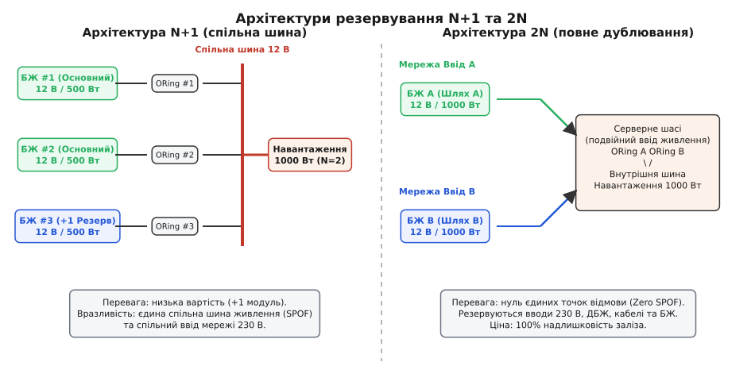
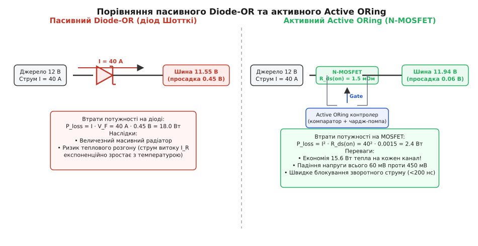
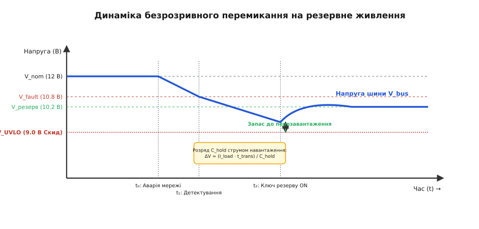
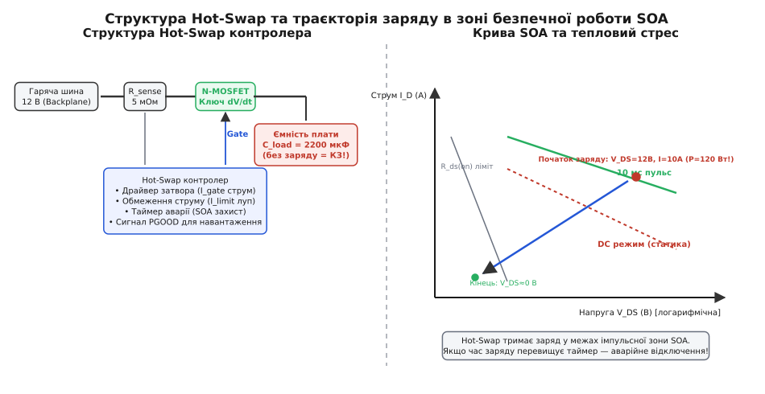
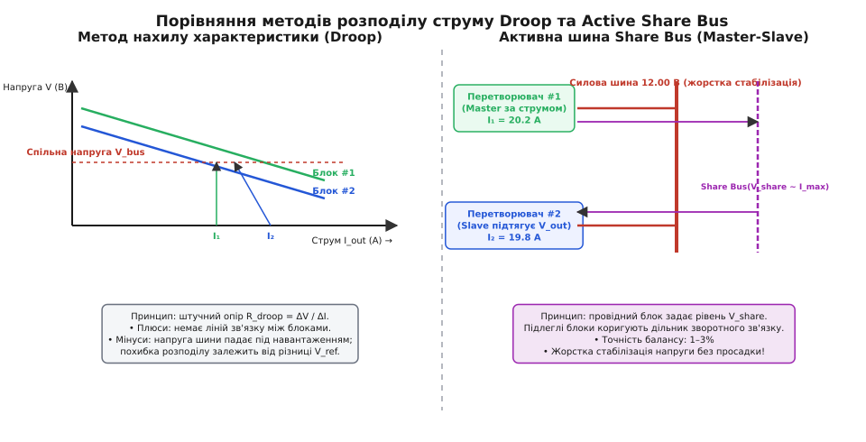
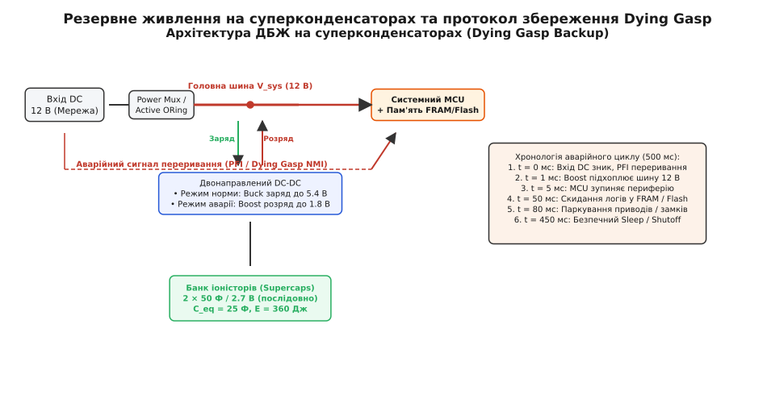

# Резервування живлення

<preknowlist>
- [Закон Ома](root:hw-analog/ohms-law) — зв'язок напруги, струму та опору в електричних колах.
- [Діод Шотткі](root:hw-power/schottky-diode) — напівпровідниковий перехід метал-напівпровідник зі зниженим прямим падінням напруги.
- [Силовий ключ](root:hw-components/mosfet-power-switch) — робота польового транзистора в ключовому режимі та керування затвором.
- [Ідеальний діод](root:hw-power/ideal-diode) — зменшення статичних втрат шляхом заміни діода на керований MOSFET.
- [Hot-swap](root:hw-power/hot-swap) — обмеження пускового струму при підключенні плати до робочої шини живлення.
- [Power ORing](root:hw-power/power-oring) — базові принципи об'єднання джерел живлення на спільне навантаження.
- [Power-path](root:hw-power/power-path) — керування шляхами протікання струму між зовнішнім джерелом, батареєю та навантаженням.
- [Розподіл струму між паралельними джерелами](root:hw-power/current-sharing) — методи симетричного навантаження перетворювачів.
</preknowlist>

Раптове знеструмлення промислового контролера, телекомунікаційної базової станції чи сервера обробки транзакцій призводить до втрати даних у динамічній пам'яті, аварійної зупинки механізмів без фіксації положення та пошкодження структур файлових систем. Жодне окреме джерело живлення не володіє абсолютною надійністю: електролітичні конденсатори поступово висихають через випаровування рідкого електроліту під впливом тепла, силові ключі деградують від постійних комутаційних перенапруг у мережі, а підшипники вентиляторів охолодження заклинюють від накопичення пилу. За статистикою центрів обробки даних, несправності блоків живлення становлять від 30% до 40% усіх апаратних відмов серверного обладнання.

Для забезпечення безперервної роботи електроніки енергію підводять від двох або більше незалежних джерел. Проте просте паралельне з'єднання вихідних клем кількох блоків живлення мідними проводами не створює надійності. Навпаки — воно перетворює поодиноку аварію на катастрофічний збій усієї системи: пробитий силовий транзистор синхронного випрямляча або закорочений вихідний керамічний конденсатор одного модуля миттєво закорочує спільну шину на землю. Це призводить до скидання енергії справних блоків у точку короткого замикання, випалювання доріжок друкованої плати та повного знеструмлення апаратури.

Резервування живлення (від латинського *redundare* — переливатися через край, бути в надлишку) — це сукупність схемотехнічних топологій, ключів надшвидкої комутації, схем вирівнювання струмів та накопичувачів енергії, які усувають єдині точки відмови (Single Point of Failure, SPOF) і підтримують безперервну стабільну напругу на навантаженні під час виходу з ладу будь-якого елемента живильного тракту.

## 1. Архітектури резервування та концепція єдиної точки відмови (SPOF)

Надійність складної живильної системи визначається двома фундаментальними параметрами: середнім напрацюванням на відмову (Mean Time Between Failures, MTBF) та середнім часом відновлення працездатності (Mean Time To Repair, MTTR). Коефіцієнт готовності (Availability, `A`) описує ймовірність того, що апаратура функціонує в довільний момент часу:

```
A = MTBF / (MTBF + MTTR)
```

Якщо система живиться від одного джерела живлення з показником `MTBF = 100 000 годин` (приблизно 11.4 року) і середній час заміни пошкодженого блока становить `MTTR = 4 години`, коефіцієнт готовності складає:

```
A = 100000 / (100000 + 4) = 0.99996 (чотири «дев'ятки», сумарний простій 21 хвилина на рік)
```

Для медичного обладнання життєзабезпечення або дата-центрів такий простій неприпустимий. Використання надлишкових модулів живлення підвищує надійність лише тоді, коли в схемі відсутні єдині точки відмови — вузли, вихід з ладу яких зупиняє всю систему незалежно від кількості резервних блоків.

```
                  ┌────────────────────────────────────────────────────────┐
                  │                 Класифікація надлишковості             │
                  └───────────────────────────┬────────────────────────────┘
                                              │
                    ┌─────────────────────────┴─────────────────────────┐
                    ▼                                                   ▼
       ┌─────────────────────────┐                         ┌─────────────────────────┐
       │     Топологія N+1       │                         │      Топологія 2N       │
       │  (Паралельний надлишок) │                         │   (Повне дублювання)    │
       ├─────────────────────────┤                         ├─────────────────────────┤
       │ • N блоків несуть струм │                         │ • Дві незалежні лінії   │
       │ • +1 модуль у резерві   │                         │ • Два вводи мережі      │
       │ • Спільна силова шина   │                         │ • Нуль спільних точок   │
       │ • Мінімальна вартість   │                         │ • 100% надлишок заліза  │
       └─────────────────────────┘                         └─────────────────────────┘
```


*Архітектури резервування джерел живлення: економічна схема N+1 зі спільною шиною розподілу та безкомпромісна схема 2N з повним дублюванням живильних трактів від розетки до споживача.*

### Схема N+1 (надлишковість на спільній шині)

У конфігурації `N+1` загальна потужність навантаження розподіляється між `N` однаковими блоками живлення, а один додатковий модуль встановлюється як гарячий резерв. Якщо для живлення серверної стійки потрібно 2000 Вт, встановлюють три блоки по 1000 Вт (`N=2`, плюс один резервний).

* **Поведінка в нормі:** Усі три блоки працюють паралельно, кожен віддає приблизно `2000 / 3 = 667 Вт` (66.7% від номіналу). Знижене навантаження зменшує нагрівання силових напівпровідників і збільшує їхній ресурс. Згідно з емпіричним правилом Арреніуса, зниження робочої температури електронних компонентів на кожні 10 °C подвоює їхній термін служби до відмови.
* **Поведінка при аварії:** При відмові одного модуля два справні блоки миттєво підхоплюють додатковий струм і працюють на повній номінальній потужності 1000 Вт кожен.
* **Вразливість топології:** Спільною точкою відмови є сама об'єднана силова шина (Backplane bus bar) та єдина живильна лінія електромережі 230 В. Якщо у вхідному розподільчому щиті виб'є загальний автомат, усі три блоки одночасно знеструмляться.

### Схема 2N (повне дублювання трактів)

У конфігурації `2N` (або `1+1`) створюють дві повністю незалежні підсистеми електропостачання — Тракт А і Тракт B. Кожен тракт живиться від окремого вводу міської електромережі (або мережа + дизель-генератор), має власний джерело безперебійного живлення (ДБЖ), окрему кабельну трасу та власний блок живлення всередині кінцевого серверного шасі.

Всередині навантаження лінії А і В об'єднуються лише в точці споживання за допомогою ізолювальних ключів. Відмова міського трансформатора, коротке замикання кабельної траси чи згоряння одного з блоків живлення ніяк не впливає на сусідній тракт. Це гарантує нульовий рівень SPOF і досягає готовності `A = 0.999999%` (шість «дев'яток», простій менше 30 секунд на рік), проте подвоює витрати на силове обладнання.

У критичних дата-центрах та аерокосмічних комплексах застосовують також розширені топології `N+M` (наприклад, `2N+1` або `N+2`), де кожен з двох незалежних живильних трактів додатково захищений внутрішнім резервним перетворювачем.

## 2. Об'єднання джерел живлення: Diode-OR проти Active ORing

Головне схемотехнічне завдання об'єднання паралельних джерел — забезпечити односпрямований рух енергії від кожного джерела до спільного навантаження, унеможливлюючи зворотне перетікання струму.

```
       Блок живлення #1 ──► [ Ізолювальний елемент #1 ] ──┐
                                                           ├──► Спільне навантаження
       Блок живлення #2 ──► [ Ізолювальний елемент #2 ] ──┘
```

Ізолювальний елемент повинен виконувати дві протилежні функції:
1. Пропускати прямий робочий струм у десятки ампер з мінімальним падінням напруги та мінімальними тепловими втратами.
2. При виникненні внутрішнього короткого замикання в джерелі миттєво розірвати коло, щоб енергія вихідної шини та справного блока не витікала в пошкоджений модуль.

### Пасивне діодне об'єднання (Diode-OR)

Історично першим і найпростішим рішенням є встановлення потужних діодів Шотткі послідовно з виходом кожного блока живлення. Катоди діодів з'єднуються разом на спільній шині, а аноди підключаються до відповідних джерел.

```
Джерело А (12.1 В) ───[ Анод ►| Катод ]───┬───► Шина (11.65 В)
                                          │
Джерело B (12.0 В) ───[ Анод ►| Катод ]───┘
```

Напруга на шині встановлюється на рівні найвищого джерела мінус пряме падіння на діоді `V_F`. Якщо Джерело А видає 12.1 В, а Джерело B — 12.0 В, то на катодах діє напруга `12.1 - 0.45 = 11.65 В`. Діод Джерела B опиняється під зворотною напругою `12.0 - 11.65 = 0.35 В`, що менше за поріг відкривання, тому він закритий, і все навантаження живиться від Джерела А. Якщо Джерело А виходить з ладу і його напруга спадає, шина плавно опускається до `12.0 - 0.45 = 11.55 В`, діод B відкривається, і Джерело B автоматично перебирає живлення на себе.

> ⚠️ **Фізичні обмеження та тепловий глухий кут Diode-OR:**
> Пряме падіння напруги на потужному діоді Шотткі становить `V_F ≈ 0.40 – 0.55 В`. Статичні втрати потужності, що виділяються у вигляді тепла, розраховуються за формулою:
> 
> ```
> P_loss = I_load · V_F
> ```
> 
> При робочому струмі сервера `I_load = 50 А` втрати на одному діоді досягають `50 А · 0.45 В = 22.5 Вт`. Для розсіювання такого тепла потрібен масивний алюмінієвий радіатор. Окрім того, діоди Шотткі мають виражений негативний температурний коефіцієнт зворотного струму: при нагріванні кристала до 100 °C струм витоку `I_R` зростає в десятки разів (до десятків міліампер), створюючи ризик теплового пробою.

### Активне об'єднання на польових транзисторах (Active ORing)

Для усунення гігантських втрат пасивних діодів застосовують схеми «ідеального діода» (Active ORing), де роль вентиля виконує N-канальний силовий MOSFET із наднизьким опором відкритого каналу `R_ds(on)` (від 0.5 до 2.0 мОм), керований спеціалізованою мікросхемою контролера.


*Порівняння втрат енергії та схемотехніки: пасивний діод Шотткі втрачає 18 Вт на нагрівання повітря, тоді як активний Active ORing контролер на N-MOSFET знижує втрати до 2.4 Вт при струмі 40 А.*

Силовий N-MOSFET встановлюють у розрив плюсової шини. Оскільки внутрішній паразитний діод транзистора (Body Diode) спрямований анодом до джерела, а катодом до шини, при першому ввімкненні струм тече через нього. Як тільки напруга з'являється, вбудована в контролер помпа заряду (Charge Pump) генерує напругу на затворі, що перевищує потенціал витоку на 10–12 В (`V_GS = 10 В`), повністю відкриваючи канал MOSFET.

Втрати потужності на відкритому транзисторі підпорядковуються квадратичному закону:

```
P_loss = I_load² · R_ds(on)
```

При тому самому струмі `I_load = 50 А` та транзисторі з `R_ds(on) = 1.2 мОм`:

```
P_loss = 50² · 0.0012 = 3.0 Вт (проти 22.5 Вт у діода Шотткі — зниження втрат у 7.5 разів!)
```

### Механізм регулювання малого падіння та блокування зворотного струму

Активний контролер ORing містить надшвидкий лінійний підсилювач і компаратор, які безперервно вимірюють спад напруги стік-витік `V_DS`:

```
                             Charge Pump (+12 В)
                                     │
               ┌─────────────────────┴─────────────────────┐
               │         Active ORing Контролер            │
               │                                           │
               │   [ Швидкий диференційний компаратор ]    │
               │         +                       −         │
               └─────────┬───────────────────────┬─────────┘
                         │                       │
     Вхід (Джерело) ─────┴──────[ N-MOSFET ]─────┴────── Вихід (Шина)
                                     ▲
                                     │ Затвор (Gate Drive)
```

1. **Режим малого струму (лінійне регулювання):** При незначному струмі навантаження падіння `I · R_ds(on)` могло б складати частки мілівольта. Будь-які високочастотні шуми чи пульсації джерела змушували б компаратор безладно вмикати й вимикати затвор. Щоб уникнути паразитної генерації, контролер модулює напругу затвора так, щоб утримувати фіксований спад напруги `V_DS` на рівні `10 – 30 мВ`.
2. **Режим номінального струму:** Коли струм навантаження зростає і падіння `I · R_ds(on)` перевищує 30 мВ, контролер видає максимальну напругу на затвор, переводячи ключ у режим чисто резистивного провідника.
3. **Режим короткого замикання джерела (Reverse Current Blocking):** Якщо первинний перетворювач пробивається на землю, напруга на його виході спадає майже до 0 В за сотні наносекунд. У цей момент відкритий MOSFET з опором 1.2 мОм з'єднує заряджену спільну шину з короткозамкненим входом. Без захисту виник би гігантський зворотний струм у сотні ампер, який миттєво розрядив би шину.

Контролер Active ORing фіксує зміну знака `V_DS` (коли потенціал стоку стає нижчим за потенціал витоку на `-5 ... -10 мВ`) і за допомогою потужного внутрішнього розрядного драйвера (струм розряду 2–5 А) скидає заряд затвора за час **`t_off < 100 – 200 нс`**. Транзистор запирається до того, як зворотний струм встигне набрати небезпечної амплітуди.

Детальний схемотехнічний аналіз та матрицю вибору між діодами, дискретними контролерами та інтегрованими збірками наведено у вставці [Порівняння топологій ORing та комутаторів живлення](root:hw-power/power-redundancy/comp-power-oring-switchover.md).

## 3. Автоматичне безрозривне перемикання (Seamless Power Path & Muxing)

Якщо схема ORing автоматично обирає джерело з найвищою напругою, то топологія Power Mux (мультиплексор живлення) здійснює керовану пріоритетну комутацію між різнорідними джерелами.

Типовий приклад: мобільний діагностичний термінал живиться від мережевого адаптера 12 В, порту USB-C (5–20 В) або внутрішньої батареї 7.4 В. Навіть якщо напруга батареї вища за просаджену мережу, система зобов'язана обирати зовнішню лінію, щоб зберегти заряд акумулятора.

```
       Джерело А (Мережа 12 В)  ───[ Ключ А (Back-to-Back) ]───┐
                                                               ├──► Системна шина
       Джерело B (Батарея 7.4 В) ───[ Ключ B (Back-to-Back) ]───┘
```

Для повного відключення непріоритетного каналу один MOSFET непридатний, оскільки його вбудований Body-діод пропускатиме струм у прямому напрямку. Тому в мультиплексорах застосовують зустрічне включення двох транзисторів (Back-to-Back, «спина до спини»), чиї Body-діоди спрямовані назустріч один одному:

```
Вхід ────[ FET1 (►|) ]────[ (|◄) FET2 ]──── Вихід
```

Така пара гарантує повне двонаправлене розмикання кола у вимкненому стані.


*Динамічні часові діаграми безрозривного перемикання: затримка виявлення відмови t_det, час розряду утримувальної ємності C_hold струмом навантаження та вихід шини на резервний рівень напруги без скидання споживача.*

### Динаміка перехідного процесу та розрахунок утримувальної ємності

Під час раптового зникнення основного джерела перемикання на резерв не відбувається миттєво. Процес складається з трьох послідовних фаз:

1. **Фаза детектування (`t_det`):** Напруга основного джерела падає від номіналу `V_nom` до порогу спрацьовування компаратора аварії `V_fault`. Час затримки фільтрів та компаратора становить `5 – 20 мкс`.
2. **Фаза перемикання (`t_sw`):** Контролер розряджає затвор першого ключа і накачує помпами затвор другого ключа. Щоб уникнути наскрізного струму (Shoot-through) між двома джерелами різної напруги, вводиться затримка мертвого часу (Dead-time) тривалістю `10 – 50 мкс` (стратегія Break-before-make).
3. **Фаза утримання зарядом конденсаторів (`t_trans = t_det + t_sw`):** Упродовж цього інтервалу обидва джерела фізично відключені від шини. Струм споживання `I_load` забезпечується виключно енергією банку вихідних конденсаторів шини `C_hold`.

Спад напруги на шині за час комутації описується формулою:

```
ΔV = (I_load · t_trans) / C_hold
```

Щоб мікроконтролери та цифрові мікросхеми не пішли в аварійний перезапуск, мінімальна напруга шини повинна залишатися вищою за поріг скидання живлення (Brownout Reset / UVLO):

```
V_bus_min = V_nom - ΔV ≥ V_UVLO
```

Звідси визначають мінімально необхідну ємність банку утримання:

```
C_hold ≥ (I_load · t_trans) / (V_nom - V_UVLO)
```

Математичне виведення енергетичного балансу для навантажень із постійною споживаною потужністю (`P_load = const`) розібрано у вставці [Розрахунок енергії утримання та кривих SOA](root:hw-power/power-redundancy/math-holdup-energy.md).

## 4. Гаряча заміна (Hot-Swap) та захист області безпечної роботи (SOA)

Резервування за схемою N+1 або 2N передбачає можливість вилучення пошкодженого блока й встановлення нового без вимкнення апаратури — гарячу заміну (Hot-Swap / Live Insertion).

```
   Робоча шина 12 В ═════════════════════════════════════════════════════════
                                   │
                           [ Контакт роз'єму ] (Іскріння та стрибок струму!)
                                   │
                             ┌─────┴─────┐
                             │ C_load    │ (Розряджений конденсатор 2200 мкФ
                             │ 0.001 Ом  │  в перший момент = коротке замикання)
                             └─────┬─────┘
                                   ▼
```

Коли плату з розрядженими вхідними електролітичними та керамічними конденсаторами ємністю `C_load = 2200 мкФ` вставляють у роз'єм під напругою 12 В, ємність у перший момент веде себе як коротке замикання. Пусковий струм (Inrush Current) обмежується лише паразитним опором доріжок і контактів (`R_par ≈ 10 – 30 мОм`):

```
I_inrush = V_bus / R_par = 12 В / 0.02 Ом = 600 А
```

> 🔥 **Руйнівні наслідки неконтрольованого пускового струму:**
> 1. **Просадка напруги на спільній шині (Backplane Sag):** Стрибок струму в 600 А створює миттєве падіння напруги на загальній шині живлення, через що всі сусідні справно працюючі плати в шасі перезавантажуються від UVLO.
> 2. **Ерозія контактів роз'єму:** Електрична мікродуга випалює позолоту контактних ламелей роз'єму, спричиняючи їхнє зварювання або окислення.
> 3. **Індуктивний викид напруги (Inductive Kick):** Паразитна індуктивність живильних кабелів `L_trace` при надшвидкому обриві або стабілізації струму генерує викид напруги `V = -L · (di/dt)`, амплітуда якого сягає 50–100 В, пробиваючи вхідні напівпровідники.


*Контролер Hot-Swap: структурна схема з керуванням наростанням dV/dt та траєкторія навантаження транзистора всередині кривих імпульсної області безпечної роботи (SOA).*

### Конструкція ступінчастих роз'ємів (Staggered Pins)

Для забезпечення безпечного механічного сполучення роз'єми гарячої заміни виготовляють із різною довжиною контактних пінів:
1. **Найдовші контакти (Pre-charge / Ground):** З'єднуються першими, забезпечуючи надійне з'єднання корпусів і захисного заземлення до появи напруги.
2. **Контакти середньої довжини (Main Power Rails):** Підключають силові лінії живлення +12 В та силову землю.
3. **Найкоротші контакти (Enable / Sense):** Замикаються останніми, коли плата вже повністю зафіксована в роз'ємі. Тільки після появи сигналу на контакті Enable мікросхема Hot-Swap починає плавний заряд затвора.

### Принцип роботи Hot-Swap контролера

Для запобігання аварії на вході кожної замінюваної плати встановлюють контролер гарячої заміни, що складається з вимірювального шунта `R_sense`, потужного N-MOSFET та схеми керування.

1. **Керування швидкістю наростання затвора (`dV/dt`):** Контролер заряджає затвор силового транзистора мікрострумовим джерелом `I_gate` (зазвичай 10–50 мкА). Швидкість наростання напруги на виході визначається ємністю затвор-стік (Міллера) або зовнішнім конденсатором `C_gate`:
   
   ```
   dV_out / dt = I_gate / C_gate
   ```
   
   Пусковий струм заряджання вихідної ємності суворо фіксується на безпечному рівні:
   
   ```
   I_inrush = C_load · (dV_out / dt) = C_load · (I_gate / C_gate)
   ```

2. **Захист в області безпечної роботи (Safe Operating Area, SOA):** Під час запуску транзистор тривалий час (5–50 мс) перебуває в лінійному режимі, коли до нього прикладена повна напруга живлення `V_DS ≈ 12 В`, і через нього тече струм `I_inrush = 5 А`. Миттєва теплова потужність на кремнієвому кристалі площею кілька квадратних міліметрів сягає:
   
   ```
   P_die = V_DS · I_inrush = 12 В · 5 А = 60 Вт
   ```
   
   Сучасні польові транзистори зі структурою Trench-MOSFET надзвичайно чутливі до локального теплового пробою при малих напругах затвора через ефект концентрації струму (Spirito Effect). Контролер Hot-Swap має вбудований таймер аварії `t_fault`. Якщо вихідна ємність не встигла зарядитися за відведений час, контролер аварійно закриває транзистор, рятуючи його від теплового руйнування.

3. **Функція електронного автомата (eFuse) та сигнал PGOOD:** Якщо під час нормальної роботи трапляється перевантаження, контролер переходить в режим стабілізації струму, а при короткому замиканні відсікає навантаження менш ніж за 1 мкс. Сигнал готовності живлення `PGOOD` активується лише після завершення плавного пуску і знімає блокування Reset із вторинних перетворювачів плати.

## 5. Балансування струмів між паралельними джерелами (Active Current Sharing)

Коли кілька стабілізованих перетворювачів підключаються до спільної шини через Active ORing ключі, виникає фундаментальна проблема нерівномірного розподілу навантаження.

Через технологічний розкид опорних джерел напруги (Bandgap Reference) та точність резисторів зворотного зв'язку (±0.5%) два номінально 12-вольтові блоки живлення завжди мають мікроскопічну різницю вихідних напруг. Наприклад, Блок #1 видає `12.05 В`, а Блок #2 — `11.95 В`.

Оскільки вихідний опір сучасних імпульсних стабілізаторів у контурі регулювання близький до нуля (міліоми), Блок #1 із напругою 12.05 В візьме на себе 100% струму навантаження. Блок #2 взагалі не віддаватиме струм, оскільки напруга на спільній шині вища за його власну уставку стабілізації. Блок #1 перегрівається, спрацьовує його тепловий або струмовий захист, він вимикається, і навантаження ударно перекидається на холодний Блок #2. Виникає циклічна нестабільність.

Для рівномірного розподілу струму застосовують два принципово різних підходи: пасивний метод нахилу характеристики (Droop Sharing) та активну шину вирівнювання (Dedicated Share Bus).


*Методи паралельної роботи: пасивний Droop Sharing з просадкою напруги під навантаженням та високоточна активна шина Share Bus зі зворотним зв'язком Master-Slave.*

### Метод нахилу навантажувальної характеристики (Droop Sharing)

У контур зворотного зв'язку перетворювача навмисно вводиться штучний позитивний вихідний опір (Droop Resistance, `R_droop`). Вихідна напруга лінійно знижується зі зростанням вихідного струму:

```
V_out(I) = V_no_load - R_droop · I_out
```

```
Напруга (В)
12.10 ┬  Блок #1 (Холостий хід 12.05 В) ───\
      │                                     \───\
12.00 ┼  Блок #2 (Холостий хід 11.95 В) ───\     \───\  V_bus (Робоча напруга)
      │                                     \───\ ───═╡═══════════
11.80 ┴───────────────────────────────────────────────┴───────────────► Струм (А)
                                             I₁   I₂   (Струми зближуються)
```

* **Фізика самовирівнювання:** Якщо Блок #1 починає віддавати більший струм, його напруга автоматично просідає. Коли вона зрівнюється з напругою Блока #2, останній починає підхоплювати струм навантаження.
* **Переваги:** Повна автономність модулів. Немає жодних спільних сигнальних проводів між блоками, що виключає єдині точки відмови в логіці керування.
* **Недоліки:** Напруга на шині нестабільна і падає на 2–5% від холостого ходу до повного навантаження. Похибка балансування струмів становить 10–20% через різницю початкових уставок `V_no_load`.

### Активна аналогова шина розподілу (Dedicated Share Bus)

У прецизійних системах кожен перетворювач має внутрішній підсилювач струму, виходи якого об'єднуються спільною аналоговою однопровідною лінією — `Share Bus`.

1. **Автономний вибір провідного (Master Selection):** Модуль, який у даний момент віддає найбільший струм, видає найвищу напругу на шину `Share Bus` через діодний селектор, стаючи провідним (Master).
2. **Підтягування підлеглих (Slave Trimming):** Інші модулі (Slave) вимірюють різницю між потенціалом `Share Bus` та власним вихідним струмом за допомогою підсилювача помилки балансування. Цей сигнал коригує дільник напруги зворотного зв'язку, плавно піднімаючи вихідну напругу підлеглого блока доти, доки його струм не зрівняється зі струмом Master-модуля.
3. **Безшовне перехоплення при відмові Master-блока:** Якщо провідний модуль раптово вилучають зі слота або він зазнає аварії, його діод на лінії Share Bus запирається, і напругу шини миттєво підхоплює наступний за струмом справний модуль без жодного провалу напруги на силовій шині.

* **Результат:** Точність розподілу струму досягає `1 – 3%`, а напруга на вихідній шині залишається ідеально стабільною без жодної просадки Droop.

## 6. Резервне живлення на суперконденсаторах (Dying Gasp Backup)

У багатьох вбудованих пристроях немає потреби тримати систему увімкненою годинами під час аварії мережі — достатньо забезпечити автономну роботу на час від 500 мілісекунд до 10 секунд. Цього часу гарантовано вистачає для виконання протоколу аварійного збереження стану (Dying Gasp):
* Завершення поточної транзакції та скидання кешів файлової системи.
* Запис критичних змінних, логів аварії та показників лічильників у енергонезалежну пам'ять (FRAM, EEPROM або Flash).
* Паркування головок накопичувачів або переведення виконавчих сервоприводів у безпечне заблоковане положення.
* Надсилання аварійного пакету сповіщення (Telemetry SOS) через радіоканал Ethernet/LoRa/GSM.

```
                  ┌────────────────────────────────────────────────────────┐
                  │                 Акумулятор чи Суперконденсатор         │
                  └───────────────────────────┬────────────────────────────┘
                                              │
                    ┌─────────────────────────┴─────────────────────────┐
                    ▼                                                   ▼
       ┌─────────────────────────┐                         ┌─────────────────────────┐
       │   Хімічний акумулятор   │                         │  Іоністор (Supercap)    │
       ├─────────────────────────┤                         ├─────────────────────────┤
       │ • 300–1000 циклів       │                         │ • 1 000 000+ циклів     │
       │ • Деградація від тепла  │                         │ • Діапазон −40...+85 °C │
       │ • Потребує заміни (ТО)  │                         │ • Служить 15–20 років   │
       │ • Повільний заряд       │                         │ • Заряд за секунди      │
       └─────────────────────────┘                         └─────────────────────────┘
```

Для короткочасного резервування хімічні літієві акумулятори непридатні: за високих температур усередині промислового корпусу (+60 °C) вони деградують за 1–2 роки і вимагають регулярного сервісного обслуговування. Натомість суперконденсатори (іоністори з подвійним електричним шаром, EDLC) мають ресурс понад 1 000 000 циклів заряду/розряду і служать понад 15 років без втрати властивостей.


*Архітектура підсистеми резервування на суперконденсаторах: двонаправлений DC-DC перетворювач, аварійний компаратор PFI та хронологія збереження стану Dying Gasp.*

### Топологія та енергетичний розрахунок іоністорного накопичувача

Оскільки напруга одиничної комірки іоністора обмежена значенням `2.7 В`, їх з'єднують послідовно з обов'язковими схемами активного або пасивного балансування напруги комірок. Без балансування через різницю струмів саморозряду одна з комірок перезарядиться понад 2.7 В, що спричинить швидке розкладання органічного електроліту з виділенням газу.

Для ефективного використання енергії суперконденсатор підключають через двонаправлений DC-DC перетворювач:
1. **Режим заряду (Норма):** Знижувальний перетворювач (Buck) повільно заряджає банк іоністорів постійним струмом від основної шини 12 В до максимальної напруги `V_max = 5.0 В`.
2. **Режим розряду (Аварія):** Підвищувальний перетворювач (Boost) активується за лічені мікросекунди і живить системну шину 12 В, викачуючи енергію з іоністорів від `V_max = 5.0 В` до глибокого розряду `V_min = 1.8 В`.

Загальна енергія, що віддається суперконденсатором в діапазоні напруг:

```
E_usable = (1/2) · C_eq · (V_max² - V_min²) · η_boost
```

Якщо банк складається з двох послідовних іоністорів по 50 Ф (`C_eq = 25 Ф`), а ККД перетворювача `η_boost = 0.90`:

```
E_usable = 0.5 · 25 Ф · (5.0² - 1.8²) В² · 0.90
E_usable = 12.5 · (25 - 3.24) · 0.90 = 12.5 · 21.76 · 0.90 = 244.8 Дж (Вт·с)
```

Для контролера із середнім споживанням `P_sys = 12 Вт` час гарантованого автономного живлення складе:

```
t_backup = E_usable / P_sys = 244.8 Дж / 12 Вт = 20.4 секунди
```

Цього часу більш ніж достатньо для виконання найскладніших процедур безпечної зупинки.

### Апаратний сигнал переривання PFI та збереження даних

Найважливіший аспект протоколу Dying Gasp — виявлення факту аварії до того, як почне просідати напруга вторинних джерел живлення ядра процесора (3.3 В / 1.8 В / 1.0 В).

1. Вхідний дільник і швидкодіючий компаратор відстежують напругу **до** вхідного силового фільтра та ключів ORing (сигнал Power Fail Input, `PFI`).
2. Коли вхідна напруга 12 В опускається нижче 10.8 В, компаратор миттєво формує апаратне немасковане переривання (NMI) або пріоритетну подію EXTI для мікроконтролера.
3. Процесор негайно знижує тактову частоту, вимикає підсвічування дисплея та силові драйвери, після чого переносить оперативні структури пам'яті в енергонезалежну FRAM через швидкісну шину SPI.

Практичну схемотехніку модуля супервізора, трасування сигналів та повні ідіоматичні приклади мікропрограм мовами C і C++ наведено у вставці [Реалізація супервізора резервного живлення та збереження стану](root:hw-power/power-redundancy/proj-backup-supervisor.md).

## 7. Інженерний синтез та правила проєктування надійних систем

Створення відмовостійкої системи живлення вимагає системного підходу, де кожен рівень захищає наступний.

```
                  ┌────────────────────────────────────────────────────────┐
                  │          Чек-лист проєктування надійної шини           │
                  └───────────────────────────┬────────────────────────────┘
                                              │
         ┌────────────────────────────────────┼────────────────────────────────────┐
         ▼                                    ▼                                    ▼
┌──────────────────┐                 ┌──────────────────┐                 ┌──────────────────┐
│  Вхідний захист  │                 │ Комутація джерел │                 │ Захист кристалів │
├──────────────────┤                 ├──────────────────┤                 ├──────────────────┤
│ • TVS-супресори  │                 │ • Active ORing   │                 │ • Кельвінів шунт │
│ • Плавкий захист │                 │ • Hot-Swap dV/dt │                 │ • Контроль SOA   │
│ • Детекція PFI   │                 │ • Share Bus      │                 │ • Снабери RC     │
└──────────────────┘                 └──────────────────┘                 └──────────────────┘
```

1. **Кельвінове підключення струмових шунтів:** Сигнали зі струмових резисторів `R_sense` для контролерів Hot-Swap та Active ORing повинні зніматися виключно диференційною парою тонких доріжок безпосередньо з внутрішніх контактних площадок резистора (Kelvin Sense Connection). Протікання великих струмів міддю силового полігону створює паразитне падіння напруги в десятки мілівольт, що призводить до помилкового спрацьовування струмового захисту.
2. **Захист від індуктивних викидів TVS-діодами:** Надшвидке вимкнення ключа Active ORing (за 100 нс) при струмі 50 А породжує гігантську швидкість зміни струму `di/dt = 5 · 10⁸ А/с`. Навіть мізерна індуктивність доріжки 20 нГн створює сплеск перенапруги `V = L · (di/dt) = 20 · 10⁻⁹ · 5 · 10⁸ = 10 В`. Безпосередньо біля стоків силових MOSFET обов'язково встановлюють швидкодіючі супресори (TVS-діоди) та керамічні демпфувальні RC-снабери.
3. **Правило мінімізації площі контуру затвора:** Силові імпульси в ланцюгах стоку здатні наводити паразитну ЕРС у колі затвора через ємність Міллера `C_gd`, викликаючи мимовільне відкривання транзистора. Доріжка від виводу GATE контролера до затвора MOSFET повинна мати мінімальну довжину і проходити строго над суцільним шаром повернення струму (Ground plane або Source trace).
4. **Теплове моделювання лінійного режиму:** Для всіх ключів гарячої заміни вибирають транзистори не лише за низьким опором `R_ds(on)`, а насамперед за стійкістю до вторинного теплового пробою за графіком SOA для тривалості імпульсу 10 мс при повній вхідній напрузі.

Побудована за такими правилами архітектура резервування гарантує неперервність електропостачання, ізолює будь-які внутрішні та зовнішні короткі замикання і забезпечує безаварійну роботу складних електронних комплексів упродовж десятиліть.
