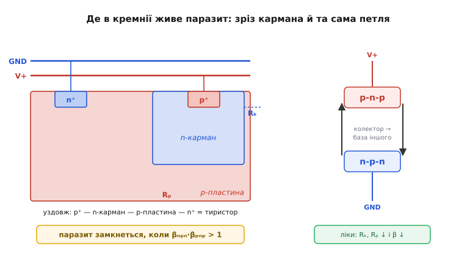

# 📜 Засувка, що мало не вбила КМОН

У кожного сімейства логіки був свій ворог із дитинства. Германій згоряв від теплового розгону. Біполярна логіка грілася й жерла струм. А в КМОН (англ. *CMOS*, complementary metal-oxide-semiconductor — комплементарна структура метал-оксид-напівпровідник), технології, що сьогодні править усією цифровою електронікою, від народження сиділа прихована хвороба з лиховісною назвою — **засувка**, або латч-ап (англ. *latch-up* — «замикання, заклинення на засув»). Хвороба ця була не дрібним ґанджем, а смертельною: одного короткого імпульсу на вході вистачало, щоб усередині мікросхеми сам собою замкнувся паразитний тиристор, і чип за частку секунди вигорав. Сама структура, яка робить КМОН таким економним, водночас ховає в собі зброю проти себе.

Ця історія — про те, як у тілі майже ідеальної технології визрів паразитний чотиришаровий прилад, готовий будь-якої миті замкнутися й спалити кристал; чому через нього КМОН добрих півтора десятиліття пасла задніх за повільнішим, але «безпечнішим» nMOS; хто й коли цю недугу розпізнав і відрізнив від простого пробою; як її приборкали — не одним прийомом, а кількома водночас: охоронними кільцями, епітаксійною підкладкою, отруєнням паразитних транзисторів; і чому, попри всі ліки, боротьба триває й донині — у космосі та на вістрі статичної електрики. Це не легенда: тут є конкретні дати, конкретні люди й конкретний патент, що став галузевим стандартом.

## Що ховається в самій будові КМОН

Щоб зрозуміти хворобу, треба спершу побачити, звідки в КМОН узявся паразитний прилад. А щоб побачити це — згадаймо, чим КМОН узагалі підкупив інженерів.

Ідея комплементарної пари проста й елегантна. Беремо два транзистори-ключі: один з *n*-каналом, другий з *p*-каналом, і вмикаємо їх так, що **завжди відкритий лише один**. Логічна одиниця на вході — відкрився нижній, притягнув вихід до землі; нуль — відкрився верхній, підтягнув вихід до живлення. Між живленням і землею ніколи немає наскрізного відкритого шляху, тож у спокої схема **майже не споживає струму**. Саме це й була революція: пара, винайдена 1963 року Френком Венлассом (Frank Wanlass, американський інженер, народжений у Тетчері, штат Аризона) і Чжитаном Са (Chih-Tang Sah, фізик китайського походження) у Fairchild Semiconductor, споживала в режимі спокою наноВати там, де біполярна логіка жерла міліВати. Свою доповідь вони так і назвали — «Нановатна логіка» (ISSCC, 20 лютого 1963), а патент США № 3 356 858 на «комплементарне коло з малим споживанням у спокої» Венласс подав 18 червня 1963-го (виданий 5 грудня 1967-го).

> 🔧 **Навіщо це.** Сама причина економності КМОН — два транзистори різного типу поряд на одному кристалі — і є причиною засувки. Економність і смертельна вада ростуть з одного кореня: щоб посадити *p*-канальний і *n*-канальний прилади на спільну пластину, доводиться створити в ній області протилежного типу провідності, вкладені одна в одну. А чотири шари різного типу поспіль — це вже не два транзистори, це готовий тиристор. Інженер, що проєктує КМОН, неминуче будує цей паразитний прилад — питання лише, чи зуміє він не дати йому замкнутися.

Подивімося на зріз. Пластина — наприклад, *p*-типу (легована домішкою, що дає дірки). На ній прямо стоїть *n*-канальний транзистор: його витік і стік — острівці *n*-типу в цій *p*-пластині. А щоб поряд поставити *p*-канальний транзистор, у пластині спершу вибирають область протилежного типу — **карман** (англ. *well* — «колодязь»), острів *n*-типу; уже в ньому роблять витік і стік *p*-типу. І ось у нас лежать поряд, рахуючи від витоку одного приладу до витоку другого, чотири шари по черзі:

```
p⁺ (витік pMOS) — n-карман — p-пластина — n⁺ (витік nMOS)
        p              n            p            n
```

P-n-p-n. Чотиришарова структура. Точнісінько та сама послідовність, з якої навмисне роблять **тиристор** (англ. *thyristor*, або кремнієвий керований випрямляч, SCR — silicon-controlled rectifier) — прилад, що вміє лише дві речі: сидіти замкненим або, раз увімкнувшись, проводити навстіж і не відпускати, поки крізь нього тече струм. Інженер КМОН не хотів цього тиристора. Але фізика дала його безкоштовно, як неминучий додаток до комплементарної пари.

## Як два сумирних транзистори стають вибухівкою

Сам по собі чотиришаровий «бутерброд» лежить тихо. Біда в тому, що його можна розкласти на **два паразитні біполярні транзистори, зчеплені в петлю додатного зворотного зв'язку** — і саме ця петля й вистрілює.

Перший паразитний транзистор — **вертикальний p-n-p**: емітер — це витік *p*-канального приладу (p⁺), база — *n*-карман, колектор — *p*-пластина. Другий — **горизонтальний n-p-n**: емітер — витік *n*-канального приладу (n⁺), база — *p*-пластина, колектор — *n*-карман. А тепер найважливіше — як вони з'єднані. Колектор p-n-p (пластина) — це **база** n-p-n. Колектор n-p-n (карман) — це **база** p-n-p. Вихід кожного годує вхід іншого. Це класична петля додатного зворотного зв'язку, замкнена сама на себе.

Поки все спокійно, обидва транзистори закриті, і петля мовчить. Але уявімо, що якийсь струм на мить підвів базу n-p-n хоч трохи вище — підвів настільки, що n-p-n ледь прочинився. Він починає тягти струм через карман. Цей струм — база p-n-p; p-n-p прочиняється й собі тягне струм через пластину. А цей струм — назад у базу n-p-n, ще дужче його відкриваючи. Кожен відкриває другого, другий ще дужче відкриває першого — лавина. За мить обидва розкриваються навстіж, між живленням і землею встановлюється майже коротке замикання, і єдине, що його обмежує, — опір дротів та джерела. Кристал заливає струм у десятки-сотні міліампер там, де мали текти мікроампери; локальна точка розжарюється — і метал вигорає, кремній плавиться. Чип мертвий.

Коли саме петля з тихої стає вибуховою? Тут є точний критерій, і він гарний своєю простотою. У кожного з паразитних транзисторів є коефіцієнт підсилення β — у скільки разів струм колектора більший за струм бази. Петля розкручується сама, якщо добуток підсилень двох транзисторів перевищує одиницю:

```
βₙₚₙ · βₚₙₚ > 1   →  засувка замикається й тримається
βₙₚₙ · βₚₙₚ < 1   →  збурення гасне, петля повертається в спокій
```

> 🔧 **Навіщо це.** Уся наука приборкання засувки вкладається в одну нерівність: тримати добуток βₙₚₙ·βₚₙₚ **нижче одиниці**. Усі ліки, які винайде галузь, — це різні способи зробити паразитні транзистори поганими: зменшити їхнє β, відвести від них струм, скоротити шлях. Як тільки добуток падає під одиницю, петля з вибухівки стає нешкідливим збуренням, що гасне саме. Це той рідкісний випадок, коли вся інженерна боротьба зводиться до однієї умови, яку видно з паперу.

І ще одна підступна риса тиристора, що дісталася паразитові в спадок. Замкнувшись, він **не відпускає**. Звичайний транзистор: прибрав сигнал на базі — закрився. Тиристор: щойно петля замкнулася, вона годує сама себе, і прибрати спусковий імпульс уже мало — струм тече далі сам із себе. Відпустить лише тоді, коли наскрізний струм упаде нижче деякого порогу — **струму утримання** (англ. *holding current*). На практиці це означає: щоб урятувати чип, який «зазасувило», треба зняти з нього живлення повністю. Доти він горітиме. Саме ця незворотність і робила засувку такою смертельною — не збій на мить, а заклинення до згоряння.


*Зліва — фізичний зріз: витоки p⁺ і n⁺ дають чотиришаровий p-n-p-n. Справа — та сама структура як два транзистори в петлі: колектор кожного годує базу іншого. Опори Rₖ (кармана) і Rₚ (пластини) відводять струм повз бази — це головна ручка керування.*

## Чому це мало не поховало КМОН

Тепер ясно, чому засувка була не дрібницею. Уявіть інженера початку 1970-х, що вибирає технологію для нового виробу. nMOS-логіка — повільніша, гарячіша, ненажерливіша, зате передбачувана: помилився на вході — зіпсував сигнал, не чип. А КМОН — економний красень, який, проте, може **самознищитися** від випадкового сплеску на виводі: завелика напруга, статичний розряд від пальця, перехідний процес при ввімкненні живлення — і паразитний тиристор замкнувся, кристала немає. Хто візьме на себе такий ризик у серійному виробі?

Тому довго ніхто й не брав. Попри те, що КМОН винайшли вже 1963-го, **майже все десятиліття 1970-х панував nMOS**: на ньому будували мікропроцесори, пам'ять, масову логіку. КМОН тулився в нішах, де його економність переважувала страх: цифровий годинник, калькулятор на батарейці, портативний прилад — там, де споживання вирішувало все, а напруги й струми були сумирні й передбачувані. Великий цифровий світ дивився на КМОН як на тендітну екзотику: надто легко вбити.

Лишалося одне особливе середовище, де КМОН пробачали все, — **космос**. Там його економність була безцінною (бо живлення на борту рахують до міліВата), а заразом виявилося, що ту саму засувку, яка лякала на Землі, у космосі **підпалює радіація**: важка заряджена частинка, прошивши кристал, лишає за собою слід вільних носіїв — готовий спусковий струм для паразитного тиристора. Тож перші великі КМОН-системи народилися саме «броньованими». Мікропроцесор RCA CDP1802 (відомий як COSMAC), що з'явився близько 1974–1976 років, став першим КМОН-процесором і першим радіаційно-стійким процесором: його робили за технологією «кремній на сапфірі» (silicon-on-sapphire), яка фізично розрізає паразитний тиристор ізолятором. На ньому полетіли «Вояджери», «Вікінги», «Галілео» — апарати, що десятиліттями працювали на крихтах потужності в потоці космічних частинок. Поряд був і Intersil 6100 (він же Harris HM-6100) — однокристальна КМОН-копія архітектури PDP-8, представлена в другому кварталі 1975-го, що споживала менше 100 мВт там, де її біполярні ровесники грілися ватами.

Виходить парадокс: технологія, що мала стати загальною, спершу вижила лише там, де її вада була найгострішою, — у космосі, бо там навчилися її зрізати ізолятором, і у дрібній побутовій електроніці, бо там вада майже не прокидалася. А щоб КМОН зійшов з ніш у великий світ — на масові процесори й пам'ять 1980-х, — засувку треба було перемогти не дорогим сапфіром, а дешевими прийомами у звичайному кремнії. І це зайняло роки.

## Хто розгледів хворобу й відрізнив її від пробою

Тут важливо розрізнити три різні речі, які легко плутають: **здогад**, **діагноз** і **ліки**. Те, що чотиришарова структура може поводитися як тиристор, було відоме з самої фізики приладів іще з 1950-х — тиристори ж навмисне будували з p-n-p-n. Здогад, що в КМОН неминуче сидить такий паразит, теж не вимагав генія: він видно зі зрізу. Але **довести, що це справжня, відтворювана причина загибелі реальних КМОН-чипів, виміряти умови, за яких вона спрацьовує, і відрізнити її від звичайного лавинного пробою переходу** — оце вже була робота, і її треба назвати точно.

Засадничою працею, що зробила цей діагноз, стала стаття 1973 року: **Б. Л. Ґреґорі (B. L. Gregory) і Б. Д. Шейфер (B. D. Shafer)**, «Засувка в КМОН-інтегральних схемах» (*Latch-up in CMOS Integrated Circuits*), опублікована в *IEEE Transactions on Nuclear Science* (том 20, випуск 6, с. 293–299). Робота виросла в Sandia Laboratories — лабораторії, що займалася стійкістю електроніки до радіації, і це не випадково. Саме там засувку було особливо видно: під імпульсом проникної радіації паразитні p-n-p-n шляхи замикалися надійно й відтворювано, тож їх можна було вивчати як явище, а не як рідкісну невдачу. Ґреґорі й Шейфер кількісно розібрали ці паразитні шляхи в КМОН з ізоляцією переходами, показали, що замикання справді руйнівне, і дали умови, за яких воно настає. Це й був перехід від «таке буває» до «ось механізм, ось числа».

> 🔧 **Навіщо це.** Розрізняти здогад і діагноз — не педантизм, а суть інженерної історії. Поки засувка лишалася «таким відомим ефектом», з нею нічого не можна було вдіяти: невідомо, коли спрацює і від чого. Щойно її виміряли й записали умову βₙₚₙ·βₚₙₚ > 1 з конкретними числами, з'явилося куди тиснути: стало ясно, які саме величини треба зменшити, щоб прилад не замикався. Діагноз — це не просто «знайшли винного», це перетворення страху на керовану величину.

Чесності заради: засувку в КМОН ніхто не «винайшов» і навіть не «відкрив» одним поглядом — її **розпізнали й описали кількісно**, і центральне місце в цьому належить роботі Ґреґорі та Шейфера на тлі радіаційних досліджень Sandia. Це усталений факт, без національних чи імперських міфів: тиха колективна робота американської національної лабораторії, де явище проступало найчіткіше.

## Перші ліки: охоронні кільця

Маючи на руках умову βₙₚₙ·βₚₙₚ > 1, інженери дістали чітку мету: **зробити паразитні транзистори якомога гіршими**. Найперший і найочевидніший спосіб — не дати спусковому струму дістатися бази паразита. Так народилися **охоронні кільця** (англ. *guard rings* — «кільця-сторожі»).

Ідея проста й красива. Згадаймо: паразит замикається, коли якийсь блукаючий струм підіймає потенціал бази — пластини чи кармана — настільки, що відкривається перехід «база-емітер». А що, як перехопити цей струм **до того**, як він дійде до небезпечного місця? Охоронне кільце — це суцільна замкнена смуга сильнолегованого контакту навколо приладу, посаджена просто на шину живлення або землі. Кільце навколо *n*-канального приладу — контакт до пластини, прив'язаний до землі; кільце навколо *p*-канального — контакт до кармана, прив'язаний до плюса живлення. Блукаючий струм, перш ніж дістатися чужої бази, натикається на це кільце з низьким опором і **стікає в шину**, а не піднімає потенціал. Кільце перехоплює неосновні носії, що інакше пішли б годувати петлю.

Мовою тієї самої нерівності це означає ось що. Між базою паразита й шиною завжди є якийсь паразитний опір — кармана (Rₖ) і пластини (Rₚ). Саме на ньому блукаючий струм і набирає напругу, що відкриває перехід. Охоронне кільце **різко зменшує цей опір**: тепер той самий струм створює куди меншу напругу, перехід не відкривається, ефективне підсилення паразита падає. Добуток βₙₚₙ·βₚₙₚ зсувається під одиницю — петля гасне.

> 🔧 **Навіщо це.** Охоронне кільце — це той самий прийом, що в аналоговій схемотехніці захищає високоомний вхід від витоків: замкнена смуга-сторож, що перехоплює небажаний струм і відводить його туди, де він безпечний. У КМОН воно перехоплює носії-палії, не даючи їм дійти до паразитної бази. Коли сьогодні в правилах топології чипа стоїть «оточи кожен карман контактним кільцем, постав контакти до підкладки часто-часто» — це пряма спадщина боротьби із засувкою, дисципліна, виплекана страхом перед нею.

Охоронні кільця коштують площі — кожне кільце займає місце на кристалі, — але вони не вимагають змінювати сам технологічний процес, тож стали першою лінією оборони, доступною будь-якому проєктувальникові топології.

## Глибші ліки: епітаксійна підкладка й отруєння паразита

Кільця — оборона на рівні топології. Але є й глибший шар, де із засувкою воюють у самому **матеріалі** пластини, ще до того, як на ній намалюють бодай один транзистор. Тут два головні прийоми, і обидва б'ють у ту саму нерівність із різних боків.

Перший — **епітаксійна підкладка з низькоомним прошарком**. Замість того щоб робити прилади просто на однорідній пластині, беруть пластину **дуже сильно леговану** (а отже, з дуже малим опором) і нарощують на ній тонкий **епітаксійний** (англ. *epitaxial*, від гр. *epí* — «на» + *táxis* — «впорядкування»: моношар кремнію, вирощений на пластині з тим самим ладом кристала) шар слабколегованого кремнію, в якому вже й живуть транзистори. Знизу під кожним приладом тепер лежить товстий пласт майже нульового опору. Блукаючий струм, що в звичайній пластині мусив би текти вузьким опорним шляхом і набирати на ньому небезпечну напругу, тут провалюється в цей низькоомний прошарок, як у каналізацію, і розтікається без жодного помітного падіння напруги. Опір під базою паразита впав на порядки — а з ним упало й ефективне підсилення петлі. Той самий струм утримання, нижче якого тиристор відпускає, стає недосяжно високим: петля просто не може набрати достатньо, щоб замкнутися.

Другий прийом — пряма **атака на саме β паразитного транзистора**, без огляду на опори. Згадаймо, від чого взагалі залежить β: від того, скільки неосновних носіїв устигає пройти базу, не загинувши дорогою. Якщо змусити носії гинути в базі швидше — скоротити їхній «час життя» (англ. *minority carrier lifetime*), — то менше їх дійде до колектора, і β впаде. Ранній спосіб зробити це — **легування золотом**: атоми золота в кремнії створюють пастки, що хапають носії, різко вкорочуючи їхнє життя. Інший, екзотичніший, — **опромінення нейтронами**: бомбардування створює в кристалі дефекти-пастки з тим самим ефектом. Обидва прийоми навмисне «псують» кремній рівно настільки, щоб паразитні p-n-p і n-p-n стали кепськими транзисторами з β у кілька одиниць замість десятків — і їхній добуток гарантовано лишився під одиницею.

Тут варто чесно сказати про ціну. У типового паразита підсилення були помітні — βₚₙₚ десь у межах від десятка до сотні, βₙₚₙ менше, одиниці. Завдання — будь-яким поєднанням прийомів зробити так, щоб їхній добуток не дотягував до одиниці за жодних умов. Кожен прийом має свою плату: золото й нейтрони псують і корисні транзистори теж (їхнє β теж падає), епітаксійна пластина дорожча, кільця їдять площу. Тому в реальному процесі ці засоби **складають разом**: трохи кращий матеріал, плюс кільця в топології, плюс акуратні правила відстаней — і сумарно паразит задавлений з усіх боків.

Саме на цьому шляху й народився прийом, що став **галузевим стандартом**. 1 червня 1977 року компанія Hughes Aircraft заявила винахід (патент США № 4 173 767, автор Алестер К. Стівенсон, Alastair K. Stevenson; подано травня 1978, видано листопада 1979), де між комплементарними приладами вставляється спеціальна легована область — **охоронна дифузія**, прив'язана до шини. Вона працює як додатковий колектор для паразита: перехоплює його колекторний струм і **відводить його геть із петлі зворотного зв'язку**, заганяючи ефективне підсилення під одиницю. Це той самий принцип охоронного кільця, доведений до елемента самої структури приладу, — і саме він ліг в основу того, як КМОН захищають від засувки досі.

## Чому боротьба триває й досі

Можна було б подумати, що з кільцями, епітаксією й охоронними дифузіями засувку остаточно поховали. У звичайній наземній логіці — майже так: сучасний КМОН-чип за нормальних умов засувити дуже важко, дисципліна топології й матеріалу робить свою справу. Але «майже» тут невипадкове, бо є два фронти, де паразитний тиристор не здається.

Перший фронт — **статична електрика** (ESD, electrostatic discharge). Палець, що торкнувся виводу, синтетичний одяг, сухе повітря — і на вивід приходить імпульс у кілька тисяч вольт. Цього з головою досить, щоб місцево підняти потенціал і запустити паразитну петлю. Тому кожен сучасний вивід КМОН-мікросхеми оснащений власними **захисними структурами** проти ESD, і вони ж заразом стережуть від засувки. Це вічна гонитва: процеси стають тоншими, прилади — дрібнішими, відстані між карманами — меншими, а отже паразитні опори природно зростають і паразити знову намагаються ожити. Кожне нове покоління технології наново перевіряють на стійкість до засувки за галузевим стандартом випробувань (JEDEC JESD78) — бо те, що було задавлене на старій нормі, може прокинутися на новій.

Другий фронт — **космос і радіація**, той самий, з якого КМОН колись починав «броньованим». Тут засувку підпалює не палець, а **поодинока важка частинка** — космічний іон, що прошиває кристал і лишає по собі щільний слід вільних носіїв. Цей миттєвий струм — ідеальний спусковий гачок для паразитного тиристора, і явище має власну назву: **поодинока радіаційна засувка** (англ. *single-event latch-up*, SEL). Для супутника чи марсохода вона смертельна так само, як земна: замкнувся тиристор — згорів вузол, і полагодити нікому. Тому радіаційно-стійкі КМОН досі будують особливими прийомами — на ізоляторі (кремній на ізоляторі, SOI, чи той-таки сапфір), що фізично розрізає чотиришаровий «бутерброд» так, що тиристорові просто немає з чого скластися. Дорого, зате паразита немає в самій геометрії.

> 🔧 **Навіщо це.** Засувка — приклад вади, яку не «закривають» раз і назавжди, а **тримають придушеною** дисципліною на всіх рівнях одразу: матеріал пластини, правила топології, захист виводів, вибір процесу під середовище. Інженер, що проєктує плату на КМОН, успадковує цю боротьбу й сьогодні: правильна послідовність подачі живлень, обмеження струму на виводах, захист входів від перенапруги — усе це почасти про те, щоб не дати старому паразитові замкнутися. Розуміти засувку — значить розуміти, чому ці на вигляд занудні правила насправді стережуть кристал від самознищення.

## Що лишилося від цієї боротьби

Засувка перестала бути масовою причиною загибелі чипів — але як **урок** вона вкарбувалася в саму технологію КМОН, і її сліди видно щодня.

Перший слід — **дисципліна топології**. Звичка оточувати кармани охоронними кільцями, ставити контакти до підкладки густо й часто, тримати мінімальні відстані між комплементарними приладами — усе це не примха, а пряма спадщина страху перед паразитним тиристором. Правила проєктування топології, які сьогодні виконують автоматично, написані кров'ю вигорілих ранніх чипів.

Другий слід — **сам погляд на паразитні прилади**. КМОН навчив інженерію бачити в кристалі не лише ті транзистори, які намалювали навмисне, а й ті, що утворилися самі собою між сусідніми областями. Паразитний біполярний транзистор, паразитний тиристор, паразитний опір підкладки — ця оптика «що ще ненавмисно вийшло з моєї структури» виросла значною мірою з боротьби із засувкою й тепер супроводжує будь-яке проєктування інтегральних схем.

І третій, найглибший слід — **сама ідея тримати петлю під одиницею**. Засувка показала в чистому вигляді, що додатний зворотний зв'язок із підсиленням понад одиницю — це бомба, хоч у [тепловому розгоні транзистора](root:hw-components/thermal-runaway), хоч у паразитному тиристорі КМОН. Скрізь, де в системі замикається петля, що годує сама себе, інженер тепер питає одне: чи менше за одиницю підсилення цієї петлі за всіх умов? Якщо так — система стійка; якщо ні — вона рано чи пізно «зазасувиться». КМОН виплекав цей рефлекс на власному ледь не смертельному прикладі.

Уся історія вкладається в одну думку. Те, що зробило КМОН геніальним — два комплементарні транзистори поряд, — водночас сховало в ньому паразитний тиристор, готовий спалити кристал від найменшого збурення. Технологія мало не загинула в колисці, відсиджуючись у нішах годинників і космічних зондів, поки інженери не навчилися душити паразита з усіх боків одразу: перехоплювати струм кільцями, відводити його низькоомною підкладкою, отруювати самі паразитні транзистори. Перемогли не одним ударом, а дисципліною на кожному рівні — і саме ця перемога відкрила КМОН дорогу стати тим, чим він є тепер: основою всієї цифрової електроніки світу. Засувка мало не вбила КМОН — а навчившись її приборкувати, КМОН переміг усіх.
