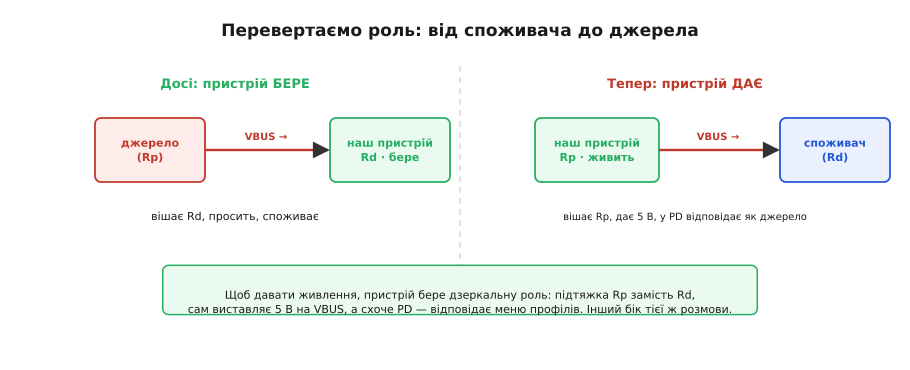
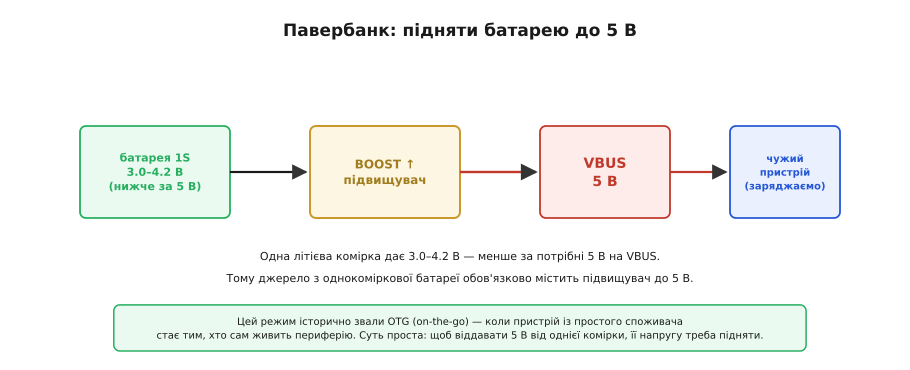
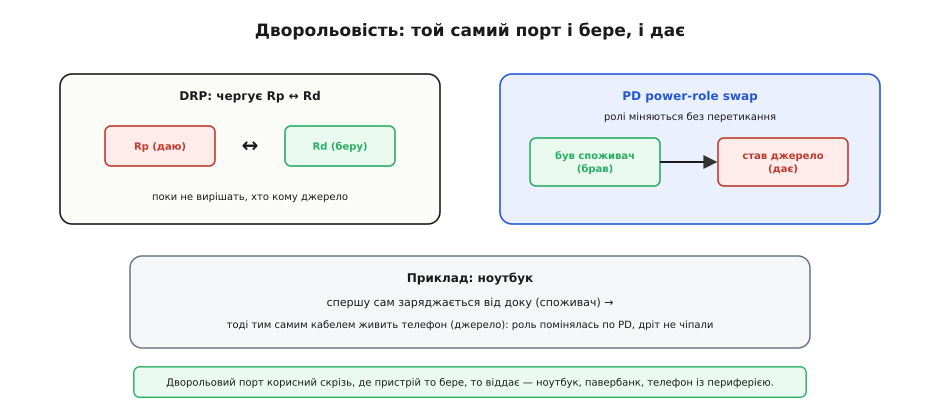
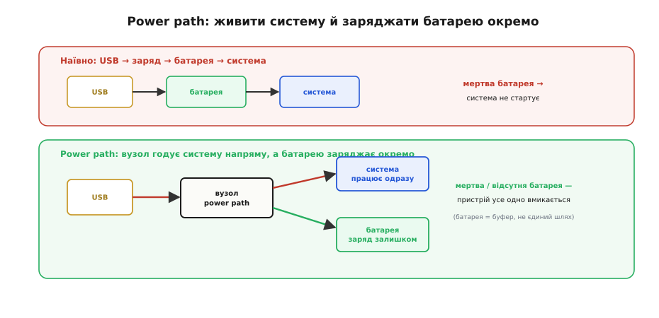
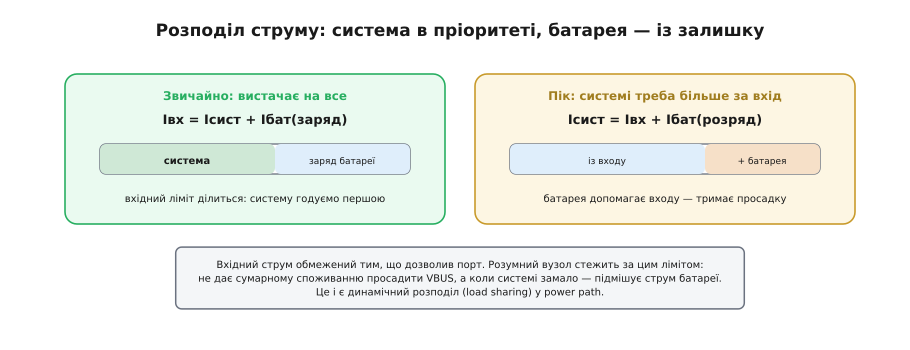
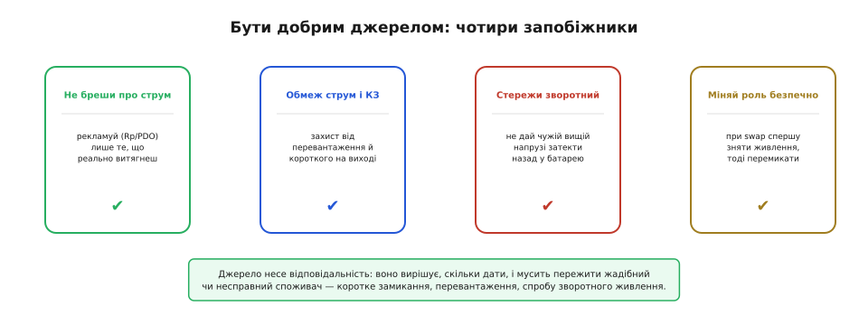

# Свій павербанк: джерело, дворольовість і power path

Пристрій із USB-C звично постає тим, хто **просить** і **бере** живлення, — споживачем (*sink*, англ. «стік, поглинач»). А якщо перевернути задачу: зробити пристрій таким, що сам **дає** енергію іншим? Це не екзотика, а буденна потреба. Власний переносний акумулятор, що заряджає телефон. Пристрій, який живить під'єднану до нього периферію — давач, модуль, ще один пристрій. Ноутбук, що то заряджається сам, то віддає заряд телефону. У всіх цих випадках наша коробочка стає **джерелом** (*source*, англ. «джерело»), і це міняє чимало: роль на лінії CC, наявність підвищувача, поведінку під час обміну ролями — і, найголовніше, внутрішню архітектуру живлення, бо тепер у пристрої одночасно живуть троє — вхід, батарея й власна система.

Стати джерелом грамотно — означає звести докупи чотири речі. Перша й найпростіша — мінімум, що робить пристрій джерелом по USB-C. На ній стоїть друга: будь-який павербанк від однієї літієвої комірки **мусить** мати boost, бо напруга комірки нижча за потрібні 5 В. Третя — дворольовість, коли той самий порт і бере, і дає. А над усім цим — **power path** (англ. «шлях живлення»): архітектура, що дозволяє водночас живити систему й заряджати батарею, працювати навіть із розрядженою чи відсутньою батареєю і чисто переходити з входу на батарею, коли живлення зникло.

### Стати джерелом: дзеркальна роль

Найперше, що треба зрозуміти: бути джерелом по USB-C — це **дзеркало** ролі споживача. Усі механізми ті самі, лише сторони помінялися місцями.


*Ліворуч — звична картина: джерело виставляє підтяжку Rp, наш пристрій — Rd і бере живлення. Праворуч — дзеркальна: тепер наш пристрій виставляє Rp, сам подає 5 В на VBUS і живить чужий пристрій, що висить на Rd. Той самий роз'єм, той самий протокол — лише інший бік розмови.*

[Роль на USB-C задає резистор на лінії CC](topic:com-devices/type-c-cc): хто вішає підтяжку вгору (Rp) — той джерело; хто вішає Rd — той споживач. Отже, щоб стати джерелом, наш пристрій має виставити **Rp** (а не Rd), подати на VBUS 5 вольтів і бути готовим живити того, хто під'єднається. Якщо ми хочемо не просто 5 В, а повноцінний PD, додається ще обов'язок [поводитися як джерело в протоколі](topic:com-devices/usb-pd): не просити меню, а **виставляти** його — відповідати на чужі запити списком профілів, які ми готові дати, і вмикати узгоджену напругу. Уся PD-розмова лишається тією ж, просто реплики міняються місцями: тепер ми ті, хто пропонує й погоджується.

> 🔧 **Навіщо це.** Практична користь — будь-який пристрій із власною батареєю можна перетворити на зарядку для інших, не докладаючи майже нічого, окрім правильних резисторів і трохи логіки. Давач, що роздає живлення сусідньому модулю; контролер, який підживлює підключений ґаджет; службовий порт, з якого можна «прикурити» розряджений пристрій. Розуміння, що джерело — це лише дзеркальний споживач, прибирає страх перед задачею: усі її частини — ті самі знайомі резистори, протокол і перетворювач, лише повернуті іншим боком.

### Чому павербанку потрібен boost

Тут криється фізичний нюанс, який легко проґавити. USB вимагає на VBUS рівно **5 вольтів** (а в PD — і більше). Але звідки їх узяти, якщо джерело живиться від **однієї** літієвої комірки? Її напруга — від 4.2 В у повному заряді до ~3.0 В у розрядженому. Тобто **завжди нижча за 5 В**. Просто «прокинути» батарею на вихід не вийде — напруги забракне.


*Одна літієва комірка дає 3.0–4.2 В — менше за потрібні 5 В на VBUS. Тому будь-яке джерело з однокоміркової батареї обов'язково містить підвищувач, що тягне напругу комірки вгору до 5 В. Цей режим історично називали OTG — коли пристрій зі споживача стає тим, хто сам живить периферію.*

Звідси непохитне правило: **джерело від батареї містить boost** ([підвищувальний перетворювач](topic:hw-power/boost); англ. *boost* — «підняти, підсилити»). Він бере 3.0–4.2 В комірки й піднімає до стабільних 5 В на VBUS, незалежно від того, повна батарея чи майже сіла. Цей режим часто звуть **OTG-boost** — за абревіатурою OTG (англ. *on-the-go* — «на ходу»), якою колись позначали здатність пристрою стати з простого споживача тим, хто сам керує шиною й живить периферію. Назва прижилася, а суть проста: щоб віддавати 5 В від однієї комірки, треба її напругу підвищити. Якщо ж пристрій живиться від кількох комірок послідовно (скажімо, 2S — близько 7–8 В), то для 5 В уже потрібен, навпаки, понижувач, — але масовий павербанк — це майже завжди одна комірка плюс boost.

Підвищення напруги не безкоштовне — і це чудово видно на класичному споживчому непорозумінні з ємністю.

**Приклад (чому «10000 мА·год» не заряджають телефон 3.3 раза).** Павербанк підписаний «10000 мА·год». Це ємність **комірки** при її напрузі ~3.7 В, а не при 5 В на виході.

```
Енергія комірки:   10000 мА·год × 3.7 В = 37 Вт·год
Boost до 5 В, ККД η ≈ 0.90:
   корисно на виході:  37 × 0.90 ≈ 33.3 Вт·год
   у перерахунку на 5 В:  33.3 / 5 ≈ 6.66 А·год ≈ 6660 мА·год

Телефон: акумулятор 3000 мА·год × 3.8 В ≈ 11.4 Вт·год
   скільки зарядів:  33.3 / 11.4 ≈ 2.9 → насправді ще менше
   (втрати в зарядці телефона) → реально ~2.3–2.5 заряду
```

Висновок: «10000 мА·год» на боці павербанка й «3000 мА·год» у телефоні — це ємності при **різних** напругах, тому ділити одне на одне («мало б вистачити на 3.3 заряду») — помилка. Чесний рахунок ведеться в [**ват-годинах**](topic:hw-power/energy-budget), і після підвищення напруги та двох перетворень корисними лишаються десь дві з половиною зарядки. Це не «обман виробника», а фізика: енергію перепаковують з 3.7 В у 5 В, і кожне перетворення бере свій відсоток.

Підвищення напруги має й інший, фізичний бік — **струм і тепло**. Потужність зберігається, тож коли джерело віддає, скажімо, 5 В × 2 А = 10 ват, із комірки на 3.7 В воно тягне вже близько 2.7 ампера, а з урахуванням ККД boost — і всі три. Такий струм помітно [**просаджує** комірку](topic:hw-power/c-rate) (через її внутрішній опір) і гріє перетворювач. Ось чому маленьке джерело на одній комірці не може віддавати багато: обмежує його не «бажання», а нагрів boost і просадка батареї під чималим струмом розряду. Що більше ват ми хочемо роздати, то товщі доріжки, більший перетворювач і серйозніший тепловідвід доведеться закласти — і то лише доти, доки вистачає самої комірки.

### Дворольовість: і бери, і дай

Багато пристроїв не обирають раз і назавжди, ким бути, — вони **то беруть, то віддають**. Телефон заряджається від розетки, але живить навушники. Ноутбук бере заряд від доку, а сам живить мишку, телефон, диск. Для таких випадків USB-C має поняття **дворольового** порту.


*Ліворуч — DRP: порт почергово виставляє то Rp, то Rd, поки не вирішить із сусідом, хто кому джерело. Праворуч — обмін ролями по PD: уже під час роботи ролі можна поміняти без перетикання кабелю — той, хто брав, починає давати. Приклад: ноутбук спершу заряджається від доку, а тоді тим самим дротом живить телефон.*

Перший рівень дворольовості — це [**DRP**](topic:com-devices/type-c-cc) (англ. *dual-role power* — «дворольове живлення»): порт не має наперед заданої ролі, а почергово виставляє то Rp, то Rd, доки не з'ясує з під'єднаним пристроєм, хто з них стане джерелом. Це вирішується **на під'єднанні**. Але PD додає сильнішу річ — **обмін ролями живлення** (англ. *power-role swap*): ролі можна поміняти **під час роботи**, не висмикуючи кабель. Пристрій, що був споживачем, за домовленістю стає джерелом, і живлення на VBUS розвертається у зворотний бік. Саме завдяки цьому ноутбук, під'єднаний до доку одним кабелем, може спершу сам зарядитися, а потім почати живити периферію — кабель при цьому ніхто не чіпає, помінялася лише домовленість. Для розробника це означає, що «джерело» й «споживач» — не намертво припаяні ярлики, а **режими**, між якими пристрій за потреби перемикається.

### Power path: працювати з мертвою батареєю

Найголовніше — power path. Пристрій із власною батареєю має всередині **трьох** учасників: зовнішній вхід (USB), батарею й власну систему (те, що споживає). Питання — як їх з'єднати. Найочевидніша схема виявляється поганою.


*Угорі — наївна схема: USB заряджає батарею, а вже батарея живить систему. Біда: якщо батарея геть розряджена або вийнята, системі нема від чого стартувати. Унизу — power path: окремий вузол годує систему напряму від входу, а батарею заряджає тим, що лишилось. Тоді пристрій вмикається миттєво навіть із мертвою батареєю, а сама батарея стає буфером, а не єдиним шляхом живлення.*

Наївно живлення з'єднують ланцюжком: USB заряджає батарею, а система живиться від батареї. Поки батарея жива — усе гаразд. Та варто їй сісти **в нуль** (чи бути вийнятою), і пристрій у халепі: системі нема від чого вмикатися, а заряд мертвої батареї з нуля йде повільно й обережно, тож і чекати доведеться довго. Знайома картина — телефон, який «не вмикається, поки трохи не зарядиться».

Архітектура **power path** розриває це порочне коло. Між входом, батареєю й системою ставлять окремий розумний вузол, який веде **дві незалежні** лінії: одну — від входу **просто в систему**, другу — від входу **в батарею** на заряд. Тепер, щойно з'явилося зовнішнє живлення, система отримує його **напряму** й оживає **миттєво** — байдуже, у якому стані батарея, хоч її й зовсім нема. А батарея заряджається окремо, тим струмом, що лишився після системи. Вона перетворюється з єдиного джерела на **буфер**: бере надлишок, коли він є, і віддає, коли вхід зник. До речі, саме цей вузол забезпечує й **безшовний перехід**: вийняли USB — живлення системи плавно підхоплюється з батареї, без провалу й перезавантаження.

Окремо варто сказати про **оживлення геть розрядженої батареї** — те, заради чого power path часто й ставлять. Коли комірка сіла глибоко, кидати в неї повний струм заряду небезпечно, тож зарядний вузол починає з обережного [**передзаряду** малим струмом](topic:hw-power/cc-cv-bms), повільно піднімаючи напругу комірки до робочої. Усе б нічого, але це довго — і тут якраз рятує power path: поки батарея мляво «приходить до тями», система вже працює, бо живиться **напряму від входу**, а не чекає на батарею. Без цього вузла пристрій із мертвою коміркою завис би в глухому куті: щоб увімкнутися, йому потрібна заряджена батарея, а щоб зарядити батарею — увімкнений зарядний тракт. Power path розриває і цю залежність.

Усередині такий вузол — це зарядна мікросхема з кількома ключами: один пускає вхід у систему, другий — у батарею, третій з'єднує батарею із системою, коли входу нема. Саме вона стежить за вхідним лімітом, віддає системі пріоритет і керує переходами. Типова обв'язка такого класу мікросхем і пастки розведення — [у вставці про мікросхему power path](topic:hw-power/powerbank-source/comp-power-path.md).

### Розподіл струму: хто кого годує

Power path ставить руба питання бюджету: вхідний струм **обмежений** тим, що дозволив порт ([BC1.2](topic:com-devices/legacy-charging-dialects) чи [PD](topic:com-devices/usb-pd)), а претендентів на нього двоє — система й заряд батареї. Хто перший?


*Ліворуч — звичайний режим: вхідний струм ділиться, система годується першою, батарея бере залишок на заряд: Iвх = Iсист + Iбат. Праворуч — піковий: коли системі раптом треба більше, ніж дає вхід, батарея доливає струм і тримає просадку: Iсист = Iвх + Iбат. Це і є динамічний розподіл навантаження в power path.*

Правило просте й розумне: **система в пріоритеті**, батарея бере те, що лишилось. У спокійному режимі вхідного струму вистачає на все: частина йде в систему, решта — на заряд батареї (`Iвх = Iсист + Iбат`). Але буває й навпаки: системі раптом потрібен сплеск, більший за весь вхідний ліміт. Тоді розумний вузол не дає просадити VBUS — він **підмішує** струм із батареї, і та на пік стає **другим** джерелом поряд із входом (`Iсист = Iвх + Iбат`). Такий динамічний розподіл звуть **load sharing** (англ. «поділ навантаження»). Це той самий механізм буфера, що й у фізиці батареї ([просадка під імпульсним навантаженням](topic:hw-power/c-rate)), тільки тут ним керують свідомо. Завдяки цьому пристрій під power path тримає важкі піки, навіть живлячись від слабенької зарядки: середнє споживання бере вхід, а гострі стрибки гасить батарея.

> 🔧 **Навіщо це.** Без керування розподілом легко зробити пристрій, що «вимикається, коли працює й заряджається одночасно»: система й заряд разом перевищують вхідний ліміт, VBUS просідає, спрацьовує захист. Power path із пріоритетом системи прибирає цю хворобу: заряд автоматично пригальмовується, коли системі треба більше, і прискорюється, коли та відпочиває. Користувач просто бачить, що пристрій «і працює, і заряджається» — без таємничих перезавантажень.

### Бути добрим джерелом

Стати джерелом — це не лише технічно подати 5 В, а й узяти на себе **відповідальність**. Споживач на тому кінці може виявитися жадібним або несправним, і саме джерело мусить це пережити, не нашкодивши ні собі, ні йому.


*Чотири обов'язки джерела. Не брехати про струм — рекламувати (Rp чи PDO) лише те, що реально витягнеш. Обмежувати струм і витримувати коротке замикання на виході. Стерегти зворотний струм — не дати чужій вищій напрузі затекти назад у твою батарею. І, для дворольових, безпечно міняти роль: спершу зняти живлення, тоді перемикати.*

Перший обов'язок — **чесність**. Скільки б ми не виставили на CC (Rp) чи в меню профілів (PDO), стільки споживач і спробує взяти. Пообіцяти 3 А, маючи boost на 1 А, — означає напроситися на просадку й перегрів власного перетворювача. Тому рекламувати треба **рівно** свою реальну спроможність. Другий — **захист виходу**: споживач може закоротити VBUS або потягти надміру, тож джерело має обмежувати струм і коректно переживати коротке замикання, а не згоряти. Третій, особливо підступний, — **зворотний струм**: якщо до нашого виходу під'єднають щось із вищою напругою, воно спробує «затекти» назад, у нашу батарею, а заряджати літій неконтрольованим зворотним струмом небезпечно. Тому на виході джерела ставлять захист, що пропускає струм лише **назовні**. Четвертий стосується дворольових пристроїв: під час обміну ролями спершу прибирають живлення з шини й лише тоді перемикають, щоб дві сторони на мить не виявилися обидві джерелами.

### Підсумок теми

Зробити пристрій **джерелом** — це дзеркало ролі споживача: [виставити Rp замість Rd](topic:com-devices/type-c-cc), самому подати VBUS, а в PD — [відповідати як джерело](topic:com-devices/usb-pd). Будь-який павербанк від однієї літієвої комірки обов'язково містить **boost**, бо 3.0–4.2 В комірки треба підняти до 5 В, — і саме через ці перетворення «10000 мА·год» дають телефону лише близько двох з половиною зарядів (чесний рахунок — [у ват-годинах](topic:hw-power/energy-budget)). **Дворольовий** порт і бере, і дає: DRP вирішує роль на під'єднанні, а обмін ролями по PD міняє її на ходу, без перетикання. Найголовніше — **power path**: окремий вузол годує систему напряму від входу, а батарею заряджає окремо, тож пристрій вмикається миттєво навіть із мертвою батареєю, чисто переходить на батарею при зникненні входу, а під пік **підмішує** струм батареї до обмеженого вхідного (load sharing із пріоритетом системи). І над усім цим — відповідальність джерела: не брехати про струм, захищати вихід від КЗ і зворотного струму, безпечно міняти роль.
