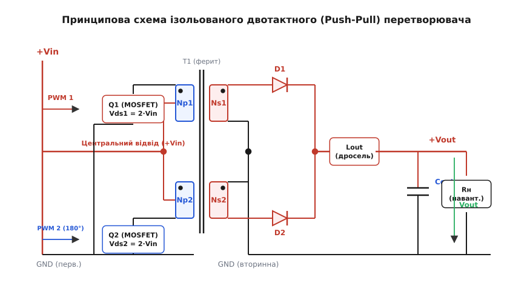
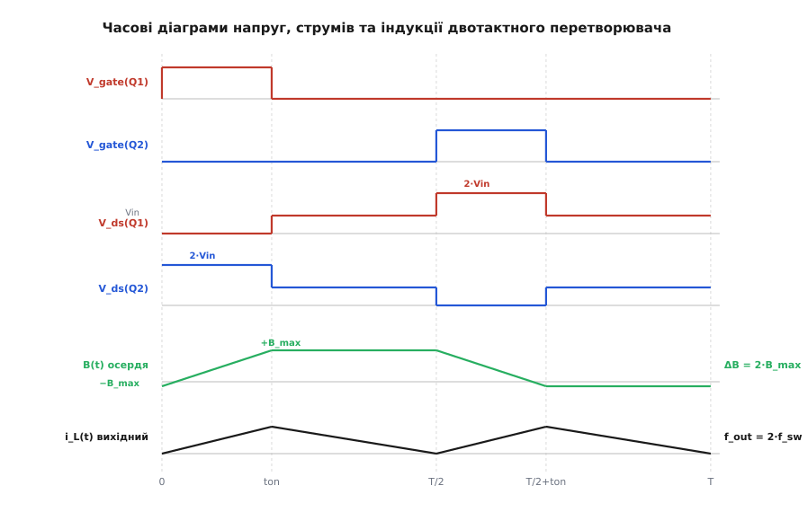
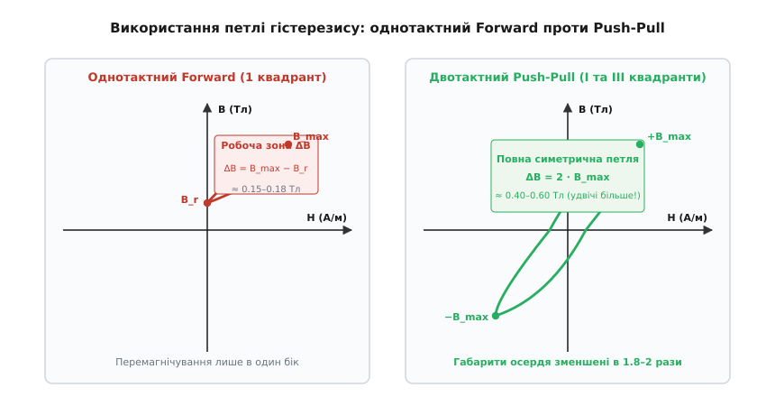
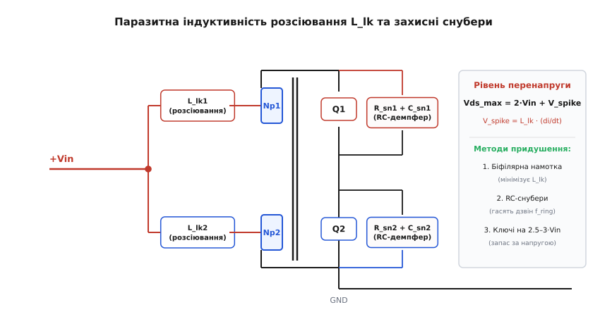
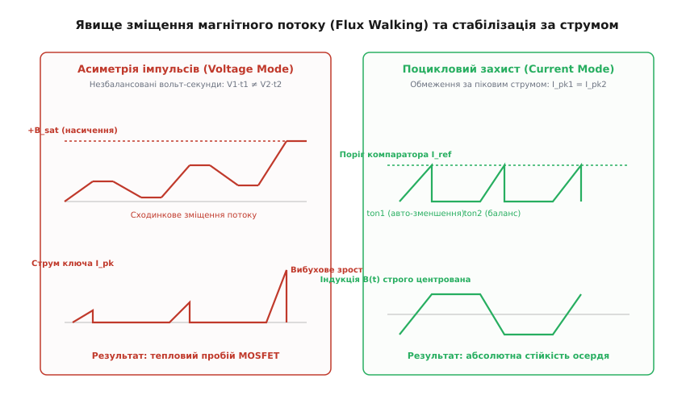

# Двотактний (push-pull) перетворювач

<preknowlist>
- [Трансформатор](topic:hw-components/transformer) — передача енергії змінним магнітним потоком в осерді та коефіцієнт трансформації напруг і струмів.
- [Силовий MOSFET](topic:hw-components/mosfet-power-switch) — робота польового транзистора в ключовому режимі, опір відкритого каналу та динамічні втрати.
- [Buck-перетворювач](topic:hw-power/buck) — робота вихідного згладжувального LC-фільтра та безперервне живлення навантаження.
- [Ферит і втрати в осерді](topic:hw-components/core-losses) — петля гістерезису B-H, індукція насичення фериту та динамічне перемагнічування.
- [Спарені котушки: взаємоіндукція в перетворювачах](topic:hw-power/coupled-inductor) — взаємоіндукція між обмотками та паразитна індуктивність розсіювання.
- [Dead-time у напівмості](topic:hw-power/dead-time-sizing) — часове розведення імпульсів керування для запобігання наскрізному струму.
</preknowlist>

Коли перед розробником постає завдання створити компактне ізольоване джерело живлення потужністю від 100 до 1000 Вт із низьковольтним входом — наприклад, автомобільний інвертор на 12 або 24 В, модуль живлення телекомунікаційної апаратури на 48 В чи високовольтний перетворювач для бортових систем, — класичні імпульсні топології стикаються з серйозними фізичними обмеженнями. 

Однотактний [зворотноходовий перетворювач (flyback)](topic:hw-power/flyback-isolated) змушений накопичувати всю порцію передаваної енергії у магнітному полі зазору спареної котушки, через що амплітуда пульсацій струму на вихідних конденсаторах сягає десятків ампер, випалюючи їхній електроліт. Однотактний [прямоходовий перетворювач (forward)](topic:hw-power/forward-converter) передає енергію безпосередньо, але його трансформатор перемагнічується лише в межах першого квадранта петлі гістерезису (`ΔB = Bmax − Br`), використовуючи менше третини магнітної здатності осердя та вимагаючи окремих кіл розмагнічування. [Напівмістовий перетворювач (half-bridge)](topic:hw-power/half-bridge-converter) через ємнісний дільник прикладає до первинної обмотки лише половину вхідної напруги `Vin / 2` (для 12-вольтового акумулятора це мізерні 6 В), що змушує подвоювати первинний струм до сотень ампер і вимагає складних плаваючих драйверів керування верхнім ключем. [Повний міст (H-міст)](topic:hw-motion/h-bridge) на чотирьох транзисторах позбавлений втрати напруги, але містить чотири силові ключі та два незалежні плаваючі драйвери, що для низьких вхідних напруг є невиправдано дорогим і габаритним рішенням.

Виходом із цього глухого кута є **двотактний перетворювач із центральним відводом первинної обмотки** (англ. *push-pull converter*). Завдяки підключенню витоків обох силових транзисторів безпосередньо до спільної шини землі схема повністю позбувається високовольтних плаваючих драйверів, прикладає до активної напівобмотки повну напругу живлення `Vin` і симетрично збуджує трансформатор у двох квадрантах петлі гістерезису (`ΔB = 2 · Bmax`), забезпечуючи максимальну питому потужність на одиницю об'єму магнітопроводу. Історичний розвиток цієї ідеї — від перших автогенераторів на насичуваних магнітних осердях до сучасних ШІМ-систем — детально висвітлює [історія автогенераторів Роєра та перетворювачів Єнсена](topic:hw-power/push-pull-converter/hist-push-pull.md).

## Анатомія схеми та чотири фази комутації

Топологія push-pull будується навколо симетричного імпульсного трансформатора з двома ідентичними первинними напівобмотками `Np1 = Np2 = Np`, намотаними на спільне феритове осердя.


*Принципова схема ізольованого двотактного (Push-Pull) перетворювача: центральний відвід первинної обмотки підключений до шини +Vin, витоки силових MOSFET Q1 та Q2 заземлені на первинну землю, а вторинне коло містить випрямляч із середньою точкою та згладжувальний LC-фільтр.*

Центральний відвід первинної обмотки з'єднаний безпосередньо з позитивною шиною живлення `+Vin`. Зовнішні виводи первинних напівобмоток підключені до стоків двох N-канальних польових транзисторів `Q1` та `Q2`. Витоки обох транзисторів об'єднані на спільній шині первинної землі `GND`. Таке розташування ключів у нижньому плечі (англ. *low-side switches*) дозволяє керувати їхніми затворами за допомогою простого двоканального драйвера або безпосередньо виходами мікроконтролера через логічні формувачі, повністю усуваючи потребу у високовольтних бутстрепних конденсаторах чи ізольованих оптодрайверах.

Вторинна сторона трансформатора також будується за симетричною схемою: дві вторинні напівобмотки `Ns1 = Ns2 = Ns` зі спільним заземленим центральним відводом живлять випрямляч на двох швидких діодах Шотткі `D1, D2` (або польових транзисторах синхронного випрямляча). За випрямлячем встановлено згладжувальний [LC-фільтр понижувального типу (buck)](topic:hw-power/buck), що складається з дроселя `Lout` і фільтрувального конденсатора `Cout`.

Робота перетворювача циклічно повторюється протягом періоду комутації `T = 1 / fsw` і розбивається на чотири послідовні фази.


*Часові діаграми напруг, струмів та індукції двотактного перетворювача: чергування відкритих станів Q1 і Q2 зі зсувом 180°, подвоєна напруга 2·Vin на закритому ключі, симетричний розмах індукції ΔB = 2·Bmax та подвоєна частота пульсацій на вихідному дроселі.*

### Фаза 1. Прямий робочий такт ключа Q1 (`0 ≤ t < ton1`, де `ton1 = D · T`)

Драйвер подає позитивну напругу на затвор транзистора `Q1`, відкриваючи його канал. Транзистор `Q2` у цей час надійно закритий.
Стік транзистора `Q1` з'єднується з шиною землі, і до верхньої напівобмотки `Np1` прикладається повна напруга живлення: `V_Np1 = +Vin`.

Струм наростає від центрального відводу крізь обмотку `Np1` та відкритий канал `Q1` до землі. За правилом правої руки магнітний потік в осерді починає лінійно наростати, перемагнічуючи ферит від початкового негативного значення `−Bmax` у напрямку позитивного насичення `+Bmax`.

У вторинній обмотці `Ns1` наводиться напруга, пропорційна коефіцієнту трансформації `n = Ns / Np`:

```
Vs1 = Vin · (Ns / Np)                  [наведена напруга на вторинній напівобмотці]
```

Діод `D1` відкривається у прямому напрямку, і струм вторинного кола через накопичувальний дросель `Lout` спрямовується в навантаження `Rн` та заряджає вихідний конденсатор `Cout`. Струм у дроселі лінійно зростає:

```
diL/dt = (Vin · (Ns/Np) − Vout) / Lout  [наростання струму вихідного дроселя у фазі ton]
```

### Фаза 2. Пауза мертвого часу (`ton1 ≤ t < T/2`)

Транзистор `Q1` закривається. Обидва силові ключі `Q1` та `Q2` перебувають у розімкненому стані протягом захисного інтервалу [мертвого часу (dead-time)](topic:hw-power/dead-time-sizing).

Струм вихідного дроселя `Lout` не може обірватися миттєво. ЕРС самоіндукції дроселя зміщує у прямому напрямку **обидва вторинні діоди** `D1` та `D2`. Струм навантаження ділиться порівну між двома вторинними напівобмотками (`i_D1 = i_D2 = i_L / 2`), протікаючи в протилежних напрямках до спільної точки. 

Оскільки струми двох половин вторинної обмотки створюють взаємно скомпенсовані магніторушійні сили (`Ns · i_D1 − Ns · i_D2 = 0`), вторинна обмотка трансформатора виявляється еквівалентно закороченою на землю. Напруга на всіх обмотках трансформатора падає практично до нуля, а потенціали стоків обох ключів `Q1` і `Q2` вирівнюються на рівні напруги шини живлення `+Vin`. Струм у дроселі `Lout` плавно спадає, замикаючись через вторинні діоди:

```
diL/dt = −Vout / Lout                   [спадання струму дроселя в паузі мертвого часу]
```

### Фаза 3. Зворотний робочий такт ключа Q2 (`T/2 ≤ t < T/2 + ton2`)

Зі зсувом фази на 180° відносно першого такту драйвер подає напругу на затвор транзистора `Q2`. Транзистор `Q1` залишається закритим.
Стік `Q2` замикається на землю, прикладаючи вхідну напругу `Vin` до нижньої напівобмотки `Np2`.

Оскільки струм тепер тече крізь нижню половину обмотки у зворотному просторовому напрямку відносно осердя, створюваний магнітний потік змінює свій знак на протилежний. Індукція в осерді починає лінійно спадати від рівня `+Bmax` назад до `−Bmax`.

У вторинній напівобмотці `Ns2` формується позитивна напруга, діод `D2` відкривається, а діод `D1` блокується зворотною напругою. Енергія знову надходить у вихідний LC-фільтр і навантаження, струм у дроселі `Lout` лінійно наростає з тим самим нахилом.

### Фаза 4. Друга пауза мертвого часу (`T/2 + ton2 ≤ t < T`)

Транзистор `Q2` закривається. Обидва ключі знову вимкнені, діоди `D1` та `D2` знову одночасно переходять у режим замикання струму дроселя, закорочуючи трансформатор, а магнітний стан осердя фіксується в точці `−Bmax` до початку наступного періоду комутації.

> 🔧 **Навіщо це.** Завдяки чергуванню двох симетричних робочих тактів за один період частота імпульсів струму на вихідному дроселі `Lout` та конденсаторі `Cout` становить `f_out = 2 · fsw` (подвоєна тактова частота перетворювача). Для робочої частоти ключів 100 кГц вихідний фільтр працює на частоті 200 кГц, що дозволяє зменшити необхідну індуктивність дроселя і ємність вихідних конденсаторів у 4 рази порівняно з однотактними схемами.

## Двоквадрантне використання петлі гістерезису

Головна перевага двотактного перетворювача над однотактними схемами полягає в принципово вищій ефективності використання магнітного матеріалу силового трансформатора.


*Використання петлі гістерезису фериту: в однотактному Forward магнітна індукція обмежена першим квадрантом (ΔB ≈ 0.15–0.18 Тл), тоді як у двотактному Push-Pull використовується повний симетричний розмах у I та III квадрантах (ΔB = 2·Bmax ≈ 0.40–0.60 Тл).*

В однотактному перетворювачі Forward струм протікає крізь первинну обмотку лише в одному напрямку. Робоча точка на [петлі гістерезису фериту](topic:hw-components/core-losses) переміщується виключно в першому квадранті між залишковою індукцією `Br` (зазвичай 0.10–0.15 Тл для силових феритів) та максимальною індукцією `Bmax` (0.30–0.35 Тл при 100 °C). Робочий розмах індукції обмежений величиною:

```
ΔB_forward = Bmax − Br ≈ 0.15...0.20 Тл  [робочий розмах індукції в однотактній схемі]
```

У двотактному перетворювачі зміна напрямку струму в напівобмотках примусово перемагнічує осердя симетрично в обидва боки — крізь перший та третій квадранти. Повний розмах магнітної індукції за період становить:

```
ΔB_pushpull = (+Bmax) − (−Bmax)
            = 2 · Bmax                   [розмах індукції в двотактній схемі]
            ≈ 0.40...0.60 Тл             [повний симетричний розмах фериту]
```

Зв'язок між габаритами осердя, кількістю витків та передаваною потужністю описується добутком площ вікна та осердя (Area Product `Ap = Wa · Ae`):

```
Ap = (Pout · 10⁴) / (Kf · Ku · ΔB · fsw · J)  [добуток площ осердя для вибору типорозміру]
```

Тут `Kf` — коефіцієнт форми хвилі (4.0 для прямокутних імпульсів); `Ku` — коефіцієнт заповнення вікна міддю (0.3–0.4); `J` — допустима густина струму в обмотках (4–6 А/мм²).

Оскільки величина `ΔB` у знаменнику для push-pull перетворювача у 2.5–3 рази більша, ніж для forward, необхідна площа перерізу осердя `Ae` або кількість витків первинної обмотки `Np` пропорційно зменшуються. Це дозволяє використовувати значно менші за габаритами осердя (наприклад, тороїди чи сердечники типорозмірів `ETD29/ETD34` замість громіздких `ETD44/ETD49`), скорочуючи довжину витків і втрати в міді.

## Автотрансформаторний ефект і подвоєна напруга на ключах

Найважливішою схемотехнічною особливістю push-pull перетворювача є рівень напруги, що прикладається до закритого силового транзистора.

Дві первинні напівобмотки `Np1` та `Np2` намотані на спільному осерді й мають абсолютно однакову кількість витків `Np`. Вони утворюють класичний 1:1 [автотрансформатор](topic:hw-components/transformer).

Коли транзистор `Q1` відкривається, його стік притягується до нульового потенціалу землі `GND`. Оскільки центральний відвід підключений до шини `+Vin`, на обмотці `Np1` формується різниця потенціалів величиною `Vin`. Завдяки жорсткому магнітному зв'язку між напівобмотками на обмотці `Np2` миттєво наводиться точно така сама ЕРС взаємоіндукції величиною `Vin`, причому її полярність спрямована так, що вона додається до напруги центрального відводу:

```
Vds2 = V_center + V_Np2
     = Vin + Vin                         [підстановка значень потенціалів]
     = 2 · Vin                           [подвоєна напруга на закритому ключі Q2]
```

Коли відкривається транзистор `Q2`, ситуація дзеркально повторюється: стік закритого транзистора `Q1` опиняється під потенціалом `Vds1 = 2 · Vin`.

Цей ефект накладає жорстке обмеження на сферу застосування топології: **push-pull перетворювач є оптимальним для низьких вхідних напруг (12–48 В) і вкрай неефективним при високих вхідних напругах (пряме випрямлення мережі 230 В).**

Якщо живити перетворювач від випрямленої мережі 230 В (де постійна напруга шини `Vin = 325 В`, а з урахуванням коливань мережі — до 380 В), стаціонарна напруга на закритому ключі сягатиме `2 · 380 = 760 В`. З урахуванням динамічних викидів перенапруги транзистори мусили б витримувати 1000–1200 В, що для кремнієвих MOSFET означає гігантський питомий опір відкритого каналу `Rds(on)` і катастрофічні омічні втрати провідності. Навпаки, при живленні від автомобільного акумулятора 12 В подвоєна напруга становить лише `2 · 14.5 = 29 В`, що дозволяє використовувати високоефективні польові транзистори на 40–60 В із рекордно низьким опором каналу (менше 1–2 мОм).

## Індуктивність розсіювання та захисні снубери

Стаціонарне значення `2 · Vin` — це лише базова напруга на закритому ключі. У реальному трансформаторі завжди присутня [паразитна індуктивність розсіювання](topic:hw-power/coupled-inductor) `Llk` (англ. *leakage inductance*), викликана неповним зчепленням магнітних потоків між первинними напівобмотками та вторинною обмоткою.


*Схема первинного кола з паразитною індуктивністю розсіювання Llk: виникнення комутаційного викиду перенапруги при розмиканні транзистора та методи захисту за допомогою RC-снуберів, RCD-клампів і біфілярної намотки.*

Коли ключ `Q1` відкритий, крізь індуктивність розсіювання його напівобмотки `Llk1` протікає повний первинний струм `Ipk`. В магнітному полі розсіювання консервується енергія:

```
Elk = 0.5 · Llk · Ipk²                  [енергія, накопичена в індуктивності розсіювання]
```

У момент розмикання ключа `Q1` цей струм намагається миттєво припинитися. Оскільки магнітне поле розсіювання не зчеплене з іншими обмотками, його енергія не може передатися у вторинне коло чи сусідню напівобмотку. За законом самоіндукції обрив струму породжує різкий високовольтний сплеск напруги зворотної полярності:

```
V_spike = Llk · (di/dt)                 [індуктивний викид перенапруги на стоці ключа]
Vds_peak = 2 · Vin + V_spike            [абсолютний пік напруги на стоці MOSFET]
```

Для потужного інвертора на 12 В струм `Ipk` може сягати 40–60 А, а час вимикання сучасного MOSFET — 20–30 нс. Навіть мікроскопічна індуктивність розсіювання всього у 50 нГн генерує викид амплітудою:

```
V_spike = (50 · 10⁻⁹ Гн) · (50 А / (25 · 10⁻⁹ с))
        = 50 · 10⁻⁹ · 2 · 10⁹           [розрахунок комутаційного викиду]
        = 100 В                         [амплітуда перенапруги!]
```

Сумарна пікова напруга сягає `Vds_peak = 24 + 100 = 124 В`, що багаторазово перевищує напругу лавинного пробою типового 40-вольтового транзистора і призводить до його негайного виходу з ладу.

Для придушення цього руйнівного явища застосовують комплекс конструктивних та схемотехнічних заходів:

1. **Біфілярна намотка первинних напівобмоток (bifilar winding):**
   Напівобмотки `Np1` та `Np2` намотують на осердя не послідовно одна за одною, а одночасно двома паралельними складеними проводами (або стрічками з мідної фольги), скрученими між собою. Це мінімізує фізичну відстань між провідниками й доводить коефіцієнт магнітного зв'язку між напівобмотками майже до одиниці (`k ≥ 0.998`), знижуючи міжпервинну індуктивність розсіювання до часток наногенрі.
2. **Паралельні демпфувальні [RC-снубери](topic:hw-power/snubbers-dvdt):**
   Паралельно переходу стік-витік кожного транзистора встановлюють послідовний ланцюжок із безіндуктивного резистора `Rsn` та високочастотного керамічного конденсатора `Csn`. Конденсатор поглинає енергію викиду, уповільнюючи фронт наростання напруги `dv/dt`, а резистор розсіює енергію коливального контуру, гасячи високочастотний дзвін на частоті резонансу паразитної ємності стоку `Coss` та індуктивності розсіювання:

```
f_ring = 1 / (2π · √(Llk · Coss))       [частота паразитного високочастотного резонансу]
```

3. **Спільний RCD-кламп первинного боку:**
   Два швидкі діоди катодами підключаються до стоків `Q1, Q2`, а анодами — до спільного конденсатора, зашунтованого розрядним резистором. Кламп жорстко обмежує максимальну амплітуду напруги на стоках, скидаючи надлишкову енергію в резистор або рекуперуючи її назад у вхідне джерело.
4. **Запас транзисторів за напругою:**
   Розрахункова напруга пробою транзисторів `V(BR)DSS` повинна обиратися з коефіцієнтом запасу не менше 2.5–3.0 від максимальної вхідної напруги живлення:

```
Vds_rating ≥ 2.5...3.0 · Vin_max        [інженерне правило вибору MOSFET за напругою]
```

## Ахіллесова п'ята: підмагнічування осердя (Flux Walking)

Найнебезпечнішим внутрішнім дефектом двотактного перетворювача є явище одностороннього накопичення магнітного потоку, або **звалювання потоку** (англ. *flux walking* чи *staircase saturation*).


*Фізика звалювання магнітного потоку (Flux Walking): незбалансовані вольт-секунди імпульсів у режимі керування за напругою призводять до лавинного зсуву петлі в насичення (+Bsat) та вибуху ключів; керування за піковим струмом (PCMC) поциклово балансує розмах індукції.*

В ідеальному світі тривалості робочих імпульсів обох ключів строго однакові (`ton1 = ton2`), а падіння напруги на напівпровідниках ідентичні. Прикладені вольт-секунди за два напівперіоди компенсують один одного: `Vin · ton1 − Vin · ton2 = 0`.

У реальній фізичній схемі абсолютної симетрії досягти неможливо:
- Кристали транзисторів мають розкид опору відкритого стану: `Ron1 ≠ Ron2`.
- Час затримки вимикання драйверів і час розсмоктування заряду затвора відрізняються на одиниці-десятки наносекунд: `ton1 ≠ ton2`.
- Вторинні випрямні діоди мають різне пряме падіння напруги: `Vf1 ≠ Vf2`.

Внаслідок цієї асиметрії інтеграл напруги на первинній обмотці за повний період комутації стає відмінним від нуля:

```
Δ(V · t) = V1 · ton1 − V2 · ton2 ≠ 0    [вольт-секундна асиметрія за період]
```

Це еквівалентно прикладенню до первинної обмотки постійної напруги зміщення `Vdc = Δ(V · t) / T`. Оскільки активний опір мідної первинної обмотки `Rcu` становить лише лічені міліоми, навіть мізерна постійна напруга `Vdc = 10 мВ` створює значний постійний струм підмагнічування:

```
Idc = Vdc / Rcu
    = 0.010 В / 0.005 Ом                [розрахунок постійного струму зміщення]
    = 2.0 А                             [постійний струм підмагнічування]
```

Цей постійний струм зміщує центр робочої петлі гістерезису в бік одного з полюсів (наприклад, у бік `+Bmax`). З кожним наступним періодом комутації залишкова індукція крокує все вище — виникає ефект «сходинкового наростання потоку». 

За кількасот циклів (за лічені мілісекунди) робоча точка досягає коліна насичення фериту `Bsat`. У точці насичення диференціальна магнітна проникність фериту лавиноподібно обвалюється від 3000 до 1, а індуктивність намагнічування `Lm` падає у тисячі разів. Опір первинної обмотки зводиться до нуля, і струм через відкритий транзистор миттєво зростає до сотень ампер, що закінчується вибухом напівпровідникового кристала від локального теплового пробою.

У мостових і напівмостових схемах послідовно з первинною обмоткою завжди встановлюють розділовий конденсатор (або використовують конденсатори напівмостового дільника), який фізично блокує постійний струм і автоматично зміщує свою середню напругу, рятуючи осердя від насичення. **У схемі Push-Pull центральний відвід підключений безпосередньо до шини живлення, тому встановити послідовний розділовий конденсатор фізично неможливо!**

Детальний математичний апарат розрахунку чутливості осердя до різних видів похибок та виведення динамічних рівнянь дрейфу наведено у [математичній моделі динаміки одностороннього підмагнічування](topic:hw-power/push-pull-converter/math-flux-walking.md).

## Порятунок: керування за піковим струмом (Current Mode Control)

Вирішальним технологічним проривом, що перетворив push-pull із примхливої та схильної до раптових аварій схеми на надійний промисловий стандарт, став перехід від керування за напругою (Voltage Mode Control, VMC) до **поциклового керування за піковим струмом (Peak Current Mode Control, PCMC)**.

При класичному керуванні за напругою ШІМ-генератор жорстко відраховує час відкритого стану ключів `ton` за внутрішнім тактовим генератором, не знаючи, який реальний струм тече крізь транзистори. Якщо осердя зміщується в насичення, тривалість імпульсу не зменшується, і система зазнає лавинного руйнування.

У системі Peak Current Mode Control тривалість відкритого стану кожного ключа визначається **динамічно в кожному такті**:

1. Тактовий генератор на початку кожного напівперіоду відкриває черговий силовий транзистор (`Q1` або `Q2`).
2. Спеціальний датчик струму (низькоіндуктивний шунт у витоку або високочастотний трансформатор струму) вимірює миттєвий первинний струм ключа `ip(t) = i_load_reflected(t) + im(t)`.
3. Струмовий сигнал подається на швидкісний аналоговий компаратор, де порівнюється з пороговою напругою керування `Vcontrol`, сформованою підсилювачем помилки вихідної напруги.
4. У точний момент, коли струм ключа досягає порогу `Ipeak = Vcontrol / Rsense`, компаратор **миттєво закриває транзистор**, не чекаючи закінчення такту генератора.

Цей механізм створює потужний поцикловий негативний зворотний зв'язок:
- Якщо напівперіод ключа `Q1` стартує з позитивним зміщенням магнітного потоку `+ΔΦ`, початковий струм намагнічування в обмотці вже є вищим.
- Сумарний струм `ip1(t)` досягає встановленого порогу `Ipeak` **швидше**, тому тривалість імпульсу `ton1` автоматично скорочується контролером на величину `Δt`.
- На протилежному напівперіоді ключ `Q2` перемагнічує осердя у зворотний бік. Оскільки струм стартує з меншого значення, наростання до порогу `Ipeak` триває **довше**, і тривалість імпульсу `ton2` автоматично подовжується.
- Вже за 1–2 періоди комутації різниця вольт-секунд `Δ(V · t)` повністю компенсує зміщення, і робоча петля гістерезису примусово центрується строго симетрично відносно початку координат (`B = 0`).

Додатковим надійним захисним заходом є внесення в магнітопровід малого немагнітного зазору (`lg ≈ 20...50 мкм` — наприклад, один шар термостійкого каптонового скотчу в стику осердя). Цей крихітний зазор збільшує магнітний опір кола, знижує залишкову індукцію `Br` практично до нуля і розширює допустимий струмовий діапазон до насичення, гарантуючи стійкість перетворювача навіть під час різких динамічних стрибків навантаження.

## Вихідний випрямляч і розрахунок компонентів LC-фільтра

Оскільки push-pull перетворювач передає енергію на вторинну сторону протягом обох напівперіодів, вихідна напруга є функцією вхідної напруги, коефіцієнта трансформації та шпаруватості імпульсів:

```
Vout = 2 · (Ns / Np) · D · Vin          [передатна характеристика напруги push-pull]
```

Тут `D = ton / T` — шпаруватість (коефіцієнт заповнення) імпульсів на один ключ. Оскільки відкриті стани ключів ніколи не повинні перекриватися (обов'язкова пауза dead-time), максимальне теоретичне значення `D` становить 0.5, а реальне робоче значення `Dmax` обирається в діапазоні 0.40–0.45.

### Розрахунок індуктивності вихідного дроселя `Lout`

Вихідний дросель підтримує неперервний струм навантаження під час робочих тактів і пауз мертвого часу. Максимальна амплітуда пульсацій струму дроселя `ΔIL` виникає при максимальній шпаруватості або максимальній вхідній напрузі. Необхідна індуктивність визначається виразом:

```
Lout = (Vs_max − Vout) · ton / ΔIL
     = (Vin_max · (Ns/Np) − Vout) · (1 − 2·D) / (2 · fsw · ΔIL)
```

Зазвичай коефіцієнт пульсацій струму дроселя обирають на рівні `ΔIL = 0.2...0.4 · Iout_max`.

### Розрахунок ємності вихідного конденсатора `Cout`

Пульсації вихідної напруги `ΔVout` складаються з перезаряду ємності та спаду напруги на її еквівалентному послідовному опорі (ESR):

```
ΔVout = ΔV_C + ΔV_ESR
      = (ΔIL / (8 · 2·fsw · Cout)) + (ΔIL · Resr)
```

Оскільки частота пульсацій на конденсаторі подвоєна (`2 · fsw`), для забезпечення пульсацій менше 1% від вихідної напруги потрібна значно менша ємність, ніж у flyback-схемах, причому основна вимога висувається до мінімізації паразитного опору `Resr`.

## Покроковий числовий розрахунок: автомобільний перетворювач 12 В → 350 В (300 Вт)

Розглянемо практичний інженерний розрахунок силового каскаду push-pull DC-DC перетворювача для автомобільного інвертора.

**Вихідні технічні вимоги:**
- Вхідна напруга живлення: `Vin_nom = 12.6 В`, діапазон `Vin_min = 10.5 В` (розряджена батарея), `Vin_max = 14.5 В` (працюючий генератор).
- Вихідна стабілізована напруга: `Vout = 350 В` постійного струму (шина DC для живлення мостового інвертора 230 В).
- Номінальна вихідна потужність: `Pout = 300 Вт` (вихідний струм `Iout = Pout / Vout = 300 / 350 = 0.857 А`).
- Робоча частота комутації ключів: `fsw = 80 кГц` (період `T = 12.5 мкс`).
- Очікуваний ККД перетворювача: `η = 90%` (`0.90`).

### Крок 1. Розрахунок максимальної шпаруватості та коефіцієнта трансформації

Мінімальний мертвий час між імпульсами призначимо `t_dead = 500 нс`.
Максимальний час відкритого стану одного ключа:

```
ton_max = (T / 2) − t_dead
        = (12.5 мкс / 2) − 0.5 мкс      [віднімання мертвого часу від напівперіоду]
        = 6.25 − 0.5 = 5.75 мкс         [максимальна тривалість імпульсу]
```

Максимальна шпаруватість на один ключ:

```
Dmax = ton_max / T
     = 5.75 / 12.5                      [розрахунок максимального заповнення]
     = 0.46                             [максимальне D на ключ]
```

Мінімальна вхідна напруга повинна забезпечувати повну вихідну напругу 350 В з урахуванням падіння на діодах і транзисторах (`Vdrop ≈ 1.5 В`):

```
n = Ns / Np
  = (Vout + Vdrop) / (2 · Dmax · Vin_min)
  = (350 + 1.5) / (2 · 0.46 · 10.5)     [підстановка параметрів для мінімального входу]
  = 351.5 / 9.66
  = 36.38                               [необхідний коефіцієнт трансформації]
```

Обираємо число витків первинної напівобмотки `Np = 2 витки` (тобто первинна обмотка містить `2 + 2 витки` зі спареної мідної стрічки).
Кількість витків вторинної напівобмотки:

```
Ns = n · Np
   = 36.38 · 2                          [розрахунок вторинних витків]
   = 72.76 → округлюємо до 74 витків    [вторинна обмотка 74 + 74 витки]
```

Уточнений фактичний коефіцієнт трансформації: `n_real = 74 / 2 = 37.0`.

### Крок 2. Перевірка максимальної індукції осердя

Обираємо феритове осердя типорозміру `ETD39` із матеріалу N87 (площа перерізу `Ae = 125 мм² = 1.25 · 10⁻⁴ м²`).
Обчислимо максимальну магнітну індукцію в осерді при роботі на мінімальній напрузі:

```
Bmax = (Vin_min · ton_max) / (Np · Ae)
     = (10.5 · 5.75 · 10⁻⁶) / (2 · 1.25 · 10⁻⁴)
     = 6.0375 · 10⁻⁵ / 2.5 · 10⁻⁴       [розрахунок амплітуди робочої індукції]
     = 0.2415 Тл = 0.24 Тл              [робоча амплітуда індукції]
```

Оскільки `Bmax = 0.24 Тл` значно нижче індукції насичення фериту N87 (`Bsat = 0.38 Тл` при 100 °C), осердя працює в абсолютно безпечній зоні з низькими гістерезисними втратами.

### Крок 3. Розрахунок струмів первинного боку та вибір MOSFET

Середній вхідний струм, що споживається від акумулятора:

```
Iin_avg = Pout / (η · Vin_min)
        = 300 / (0.90 · 10.5)           [розрахунок середнього споживаного струму]
        = 300 / 9.45
        = 31.75 А                       [середній вхідний струм від джерела]
```

Піковий струм кожного силового транзистора:

```
Ipk = Iin_avg / (2 · Dmax)
    = 31.75 / (2 · 0.46)                [піковий струм на полиці імпульсу]
    = 31.75 / 0.92
    = 34.5 А                            [піковий струм транзистора]
```

Середньоквадратичний (RMS) струм через кожен ключ:

```
Irms_FET = Ipk · √Dmax
         = 34.5 · √0.46                 [розрахунок середньоквадратичного струму]
         = 34.5 · 0.678
         = 23.4 А                       [діючий струм одного MOSFET]
```

Максимальна напруга на закритому транзисторі з урахуванням комутаційного викиду:

```
Vds_static = 2 · Vin_max
           = 2 · 14.5                   [подвоєна максимальна напруга живлення]
           = 29.0 В
Vds_rating ≥ 2.5 · Vin_max = 36.25 В → обираємо польові транзистори на 60 В
```

Обираємо MOSFET із робочою напругою 60 В та низьким опором каналу, наприклад `IRFB7430` (`Vds = 60 В`, `Rds(on) = 1.3 мОм` при 25 °C, з урахуванням нагрівання до 100 °C `Rds(on)_hot ≈ 2.2 мОм`).

Статичні втрати провідності на обох транзисторах:

```
P_cond = 2 · (Irms_FET)² · Rds(on)_hot
       = 2 · (23.4)² · 0.0022           [розрахунок омічних втрат ключів]
       = 2 · 547.56 · 0.0022
       = 2.41 Вт                        [мізерні теплові втрати провідності!]
```

### Крок 4. Розрахунок вихідного LC-фільтра

Частота пульсацій на вихідному дроселі: `f_filter = 2 · fsw = 2 · 80 кГц = 160 кГц`.
Приймаємо допустиму амплітуду пульсацій струму дроселя `ΔIL = 30% · Iout = 0.3 · 0.857 А = 0.257 А`.

При номінальній напрузі `Vin_nom = 12.6 В` шпаруватість становить:

```
D_nom = Vout / (2 · n_real · Vin_nom)
      = 350 / (2 · 37.0 · 12.6)         [шпаруватість при номінальному живленні]
      = 350 / 932.4
      = 0.375
```

Необхідна індуктивність вихідного дроселя `Lout`:

```
Lout = (Vin_nom · n_real − Vout) · (1 − 2 · D_nom) / (2 · fsw · ΔIL)
     = (12.6 · 37.0 − 350) · (1 − 2 · 0.375) / (160 000 · 0.257)
     = (466.2 − 350) · (1 − 0.75) / 41 120
     = 116.2 · 0.25 / 41 120            [розрахунок індуктивності фільтра]
     = 29.05 / 41 120
     = 0.000706 Гн = 706 мкГн → обираємо стандартний дросель 750 мкГн / 1.5 А
```

Задамо допустимі високочастотні пульсації вихідної напруги `ΔVout = 100 мВ` (0.03% від 350 В).
Мінімальна ємність вихідного конденсатора:

```
Cout_min = ΔIL / (8 · f_filter · ΔVout)
         = 0.257 / (8 · 160 000 · 0.100)
         = 0.257 / 128 000              [розрахунок мінімальної вихідної ємності]
         = 2.0 · 10⁻⁶ Ф = 2.0 мкФ
```

Обираємо батарею з двох високоякісних плівкових поліпропіленових або електролітичних конденсаторів ємністю `47 мкФ / 450 В` із низьким ESR, що гарантує мізерний рівень пульсацій та високий запас надійності за струмом.

## Порівняння базових топологій ізольованих перетворювачів

Для системного розуміння вибору топології зіставимо характеристики двотактного перетворювача з іншими популярними структурами в діапазоні потужностей 100–1000 Вт.

| Параметр порівняння | Push-Pull (двотактний) | Forward (однотактний) | Half-Bridge (напівміст) | Full-Bridge (повний міст) |
| :--- | :--- | :--- | :--- | :--- |
| **Кількість силових ключів** | 2 (Low-Side) | 1 (Low-Side) | 2 (1 High, 1 Low) | 4 (2 High, 2 Low) |
| **Складність драйвера затвора** | Мінімальна (спільна земля GND) | Мінімальна (спільна земля GND) | Середня (потрібен плаваючий Bootstrap/ізолятор) | Висока (два незалежні плаваючі канали) |
| **Використання петлі осердя** | 2 квадранти (`ΔB = 2·Bmax`) | 1 квадрант (`ΔB = Bmax − Br`) | 2 квадранти (`ΔB = 2·Bmax`) | 2 квадранти (`ΔB = 2·Bmax`) |
| **Напруга на закритих ключах** | `2 · Vin` (+ викиди `Llk`) | `2 · Vin` (+ викиди розмагнічування) | `Vin` | `Vin` |
| **Стійкість до асиметрії потоку** | Вразливий (вимагає PCMC) | Стійкий (одностороннє розмагнічування) | Абсолютна (конденсаторний дільник) | Помірна (можливий послідовний C) |
| **Частота пульсацій на виході** | `2 · fsw` (подвоєна) | `1 · fsw` (одинарна) | `2 · fsw` (подвоєна) | `2 · fsw` (подвоєна) |
| **Оптимальний діапазон вхідної напруги** | Низька (12 В, 24 В, 48 В) | Середня/висока (48–380 В) | Висока (230 В / 325 В мережі) | Будь-яка висока (>100 В...800 В) |
| **Типовий діапазон потужностей** | 100 – 1000 Вт | 50 – 250 Вт | 200 – 1000 Вт | 500 – 10 000 Вт |

## Практичні правила розведення друкованої плати та типові помилки

Через протікання первинних імпульсних струмів амплітудою в десятки й сотні ампер із крутими фронтами комутації (`di/dt > 10⁹ А/с`) надійність push-pull перетворювача критично залежить від топології друкованої плати (PCB layout):

1. **Сувора геометрична та електрична симетрія первинних контурів:**
   Два первинні силові контури «Центральний відвід → напівобмотка `Np1` → стік `Q1` → витік `Q1` → вхідний конденсатор» та «Центральний відвід → напівобмотка `Np2` → стік `Q2` → витік `Q2` → вхідний конденсатор» повинні мати **строго однакову довжину, ширину та паразитну індуктивність доріжок**. Будь-яка просторова асиметрія друкованих провідників створює різницю індуктивностей розсіювання, що провокує дрейф магнітного потоку.
2. **Мінімізація площі силових струмових петель:**
   Вхідні керамічні та електролітичні конденсатори низького імпедансу повинні розташовуватися впритул між центральним відводом трансформатора та витоками польових транзисторів. Чим менша площа контуру, тим менша паразитна індуктивність кола і тим нижчий рівень випромінюваних електромагнітних завад (EMI).
3. **Кельвінівське підключення драйвера затвора:**
   Силовий струм витоку, що досягає десятків ампер, створює падіння напруги на паразитній індуктивності доріжки землі витоку (`V = L_trace · di/dt`). Якщо земля виходу драйвера підключена до загальної силової полігонної шини, цей імпульс напруги потрапляє в контур керування затвором, викликаючи паразитне хибне відкривання закритого ключа (явище *ground bounce*). Драйвер затвора повинен підключатися окремим тонким сигнальним провідником безпосередньо до виводу витоку транзистора (підключення за схемою Кельвіна).
4. **Апаратна гарантія мертвого часу (Dead-Time):**
   Одночасне відкривання ключів `Q1` та `Q2` (навіть на 20–50 нс через затримку вимикання транзистора) створює пряме коротке замикання первинних обмоток на землю, викликаючи миттєвий тепловий вибух ключів струмом короткого замикання. Величина мертвого часу повинна жорстко контролюватися апаратними таймерами мікроконтролера або спеціалізованим драйвером із функцією блокування одночасного вмикання (англ. *cross-conduction lockout*).
