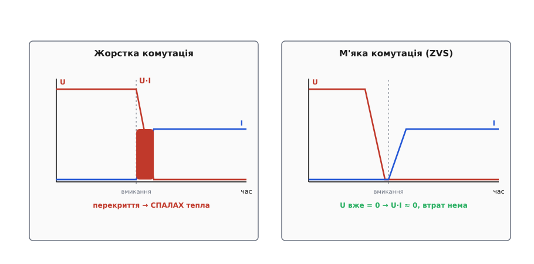
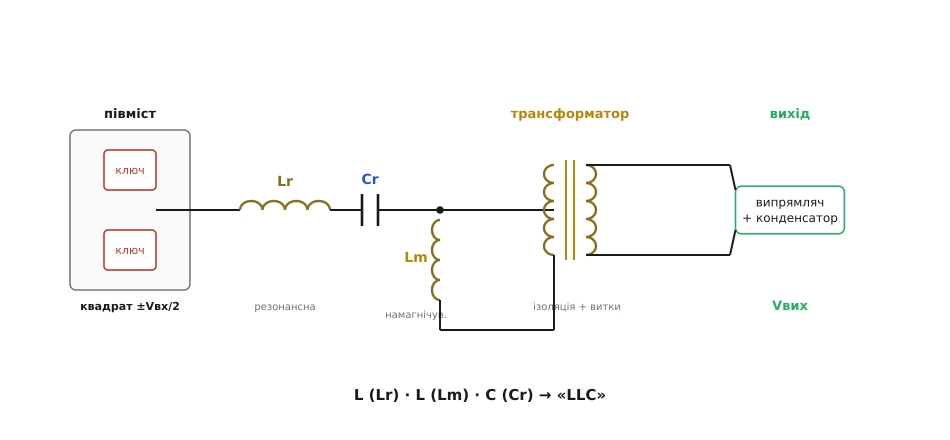
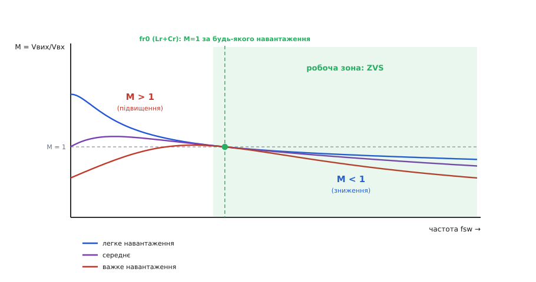
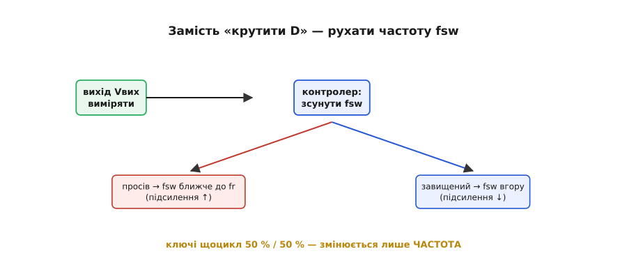

# Резонансні перетворювачі (LLC / LCC)

У звичайному імпульсному перетворювачі ключ рубає напругу «на живу»: у одну мить на ньому ще повні вольти, а струм уже пішов — і поки фронт триває, на транзисторі одночасно висять і напруга, і струм. Їхній добуток — це потужність, що просто гріє кристал. На кожному перемиканні спалахує порція тепла, і що частіше рубаєш, то більше цих спалахів за секунду. Саме тому в [buck](root:hw-power/buck) чи [flyback](root:hw-power/flyback-isolated) частоту не задирають до небес: втрати на комутації ростуть із нею лінійно й урешті з'їдають увесь виграш.

Резонансний перетворювач ламає цей компроміс одним хитрим ходом: він підводить до ключа не квадрат, а **синусоїду** — і перемикає його рівно тоді, коли напруга на ньому (або струм крізь нього) сама собою дійшла **до нуля**. А нуль, помножений на будь-що, дає нуль: у мить перемикання добуток U·I зникає, спалаху тепла немає. Це називають **м'якою комутацією** (англ. *soft switching*), на противагу звичайній **жорсткій** (*hard switching*).

## Чому жорстке перемикання гріє, а м'яке — ні

Придивімося до самої миті вмикання ключа. У жорсткому режимі на стоці транзистора ще стоїть повна напруга, а струм навантаження мусить різко початися. Напруга й струм на короткий час **перекриваються** — обидва ненульові водночас, — і саме це перекриття виділяє тепло. Те саме на вимиканні. Що коротший фронт, то менший спалах, але звести його до нуля жорстке перемикання не може принципово: заряд ємності стоку доводиться скидати крізь сам канал.


*Ліворуч — жорстка комутація: у мить вмикання напруга на ключі ще висока, а струм уже наростає; заштрихована зона — перекриття U·I, тобто спалах тепла. Праворуч — м'яка (ZVS): резонанс дотиснув напругу на ключі до нуля ЩЕ ДО вмикання, тож у мить перемикання добуток U·I ≈ 0 і втрат немає.*

М'яке перемикання прибирає перекриття інакше: воно влаштовує так, щоб **до** моменту вмикання напруга на ключі вже впала до нуля сама. Тоді транзистор відмикається «на нулі вольт» — і хоч би який струм пішов далі, добуток на нулі напруги дорівнює нулю. Цей режим звуть **комутацією при нулі напруги** (*zero-voltage switching*, **ZVS**). Дзеркальний варіант — **комутація при нулі струму** (*zero-current switching*, **ZCS**), коли до вимикання струм крізь ключ сам сходить у нуль; він природний для тиристорів, які інакше й не вимкнеш.

> 🔧 **Навіщо це.** ZVS — це не академічна вишуканість, а перепустка до **високих частот**. Прибравши втрати на комутації, перетворювач можна ганяти на сотнях кілогерц чи мегагерцах — а вища частота означає **менші** котушку й трансформатор (тому саме резонансні топології стоять у тонких ноутбучних зарядках і серверних блоках, де треба багато ват із малого об'єму й високий ККД).

Щоб напруга на ключі сама собою дійшла до нуля в потрібну мить, її треба чимось **розгойдати**. Цим і займається серце схеми — **резонансний бак** (*resonant tank*): коло з котушки й конденсатора, яке на своїй [резонансній частоті](root:hw-analog/lc-resonance) перекачує енергію між магнітним полем і електричним, і струм у ньому — чиста синусоїда.

## Резонансний бак: чому синусоїда

Основа — знайомий [LC-резонанс](root:hw-analog/lc-resonance). Якщо котушку Lr і конденсатор Cr увімкнути послідовно й «стукнути» по них прямокутним фронтом, коло відгукнеться не стрибком, а **гойданням**: енергія переливається з котушки в конденсатор і назад із частотою

```
fr = 1 / (2·π·√(Lr·Cr))
```

На цій частоті реактивний опір котушки й конденсатора рівні за модулем і взаємно **гасяться**: для зовнішнього джерела бак виглядає майже чистим опором, струм і напруга **у фазі**, а сам струм — гладенька синусоїда без гострих фронтів. Ключі при цьому рубають не струм навантаження навпрямки, а вхід цього гойдального контуру — і синусоїда сама підводить їх до нульових точок.

Тепер ключова думка. Півмостові ключі подають на бак **прямокутну** напругу (±Vвх/2), але бак — це вузькосмуговий фільтр: він пропускає майже лише свою резонансну частоту, а вищі гармоніки прямокутника **вирізає**. Тому струм у баку виходить синусоїдним, навіть коли живлення квадратне. А величину, яку бак віддасть на вихід, задає **як далеко** робоча частота стоїть від резонансу: точно на резонансі бак майже прозорий, а відходячи вбік — усе більше «затискає» передачу. Ось звідки береться керування: **крутячи частоту, ми рухаємося вздовж резонансної кривої** й тим міняємо вихід.

## Від простого бака до LLC: навіщо друга котушка

Найпростіший резонансний бак — це просто Lr і Cr послідовно; таку схему звуть **послідовним резонансним перетворювачем** (*series resonant converter*, SRC). Вона працює, але має дві прикрі вади. По-перше, вона вміє лише **знижувати** напругу — коефіцієнт передачі ніколи не перевищує одиницю, як і в buck. По-друге, на **холостому ходу** (коли навантаження зникло) вона втрачає керованість: щоб утримати вихід, частоту доводиться заганяти в нескінченність.

Розв'язок — додати до бака **ще одну котушку**, паралельно первинній обмотці трансформатора. Її звичайно й не доводиться ставити окремим компонентом: це **намагнічувальна індуктивність** Lm самого трансформатора — та, що завжди є через скінченну проникність осердя. Тепер у баку **три** реактивні елементи: дві котушки (Lr, Lm) і один конденсатор (Cr). Звідси й назва — **LLC**.


*Півміст рубає з входу прямокутник ±Vвх/2 і подає його на бак. Послідовні Lr і Cr задають головний резонанс; паралельна намагнічувальна Lm (індуктивність самого трансформатора) додає другий резонанс на нижчій частоті й дає підсилення понад одиницю. Далі — ізоляційний трансформатор, випрямляч і згладжувальний конденсатор. Три реактивні елементи L·L·C і дали назву «LLC».*

Друга котушка змінює все на краще одразу з двох боків. Вона додає **другий резонанс** — на нижчій частоті, де в грі бере участь уже сума (Lr + Lm) із Cr, — і між двома резонансами з'являється зона, де бак **підсилює**: коефіцієнт передачі стає **більшим за одиницю**. Отже, LLC вміє і знижувати, і **підвищувати** напругу, чого простий SRC не міг. А ще Lm тримає в баку струм навіть на холостому ходу, тож керованість не зникає, коли навантаження впало.

Близький родич — **LCC**, де реактивних елементів теж три, але їх дві **ємності** й одна котушка (L·C·C). LLC і LCC — це два різні способи скласти третій елемент; LLC переміг у масовій техніці, бо його друга котушка «безкоштовна» — вона й так живе в трансформаторі, тимчасом як зайвий якісний високовольтний конденсатор для LCC треба ставити й оплачувати.

## Крива підсилення: частота як важіль напруги

Уся поведінка LLC вкладається в одну картину — **криву підсилення**: як коефіцієнт передачі M = Vвих/Vвх залежить від робочої частоти. Це головний інструмент, яким думає розробник LLC.


*Коефіцієнт передачі M від частоти для легкого, середнього й важкого навантаження. У точці fr0 (резонанс самих Lr+Cr) усі криві сходяться в M=1 — незалежно від навантаження. Ліворуч від неї M може бути більшим за одиницю (підвищення), праворуч — меншим (зниження). Робоча зона — праворуч від піка кривої: там перетворювач тримає ZVS.*

Читаємо картину зліва направо. Є особлива частота **fr0** — резонанс самих лише Lr і Cr; у ній стається щось гарне: коефіцієнт передачі дорівнює **рівно одиниці незалежно від навантаження**. Усі криві, від холостого ходу до повного струму, проходять крізь цю спільну точку. Це вигідно: LLC часто проєктують так, щоб номінальний режим сидів **саме на fr0**, — там ККД найвищий, а вихід не «пливе» зі зміною струму.

Ліворуч від fr0 (нижчі частоти) бак **підсилює**: M > 1, і що легше навантаження, то вищий пік. Праворуч (вищі частоти) бак **послаблює**: M < 1. Тож щоб **підняти** вихід, контролер веде частоту **вниз**, ближче до резонансу; щоб **опустити** — жене частоту **вгору**. Одна ручка — частота — покриває весь діапазон від підвищення до зниження.

І критично важлива деталь: працювати треба **праворуч від піка** кожної кривої, на її спадній вітці. Саме там бак для ключів виглядає **індуктивним** (струм відстає від напруги) — а це рівно та умова, за якої відбувається ZVS. Заповзеш лівіше піка, у ємнісну зону, — і ZVS зникає, повертаються жорсткі втрати, ключі перегріваються. Тому нижня межа робочої частоти — не там, де скінчилося підсилення, а там, де скінчився ZVS.

## Керування: крутимо частоту, а не шпаруватість

Тут — головна відмінність від класичних імпульсників. У [buck](root:hw-power/buck) чи [flyback](root:hw-power/flyback-isolated) вихід тримають, змінюючи **шпаруватість** D при сталій частоті. У LLC роблять навпаки: **шпаруватість фіксована 50 %** (обидва ключі півмоста відкриті порівну), а регулюють **частоту**. Вихід просів — контролер підводить частоту ближче до fr; вихід підскочив — відводить угору. Такий спосіб звуть **частотним керуванням** (*frequency modulation*).


*Петля стабілізації LLC вимірює вихід і зсуває робочу частоту вздовж кривої підсилення. Вихід просів — частоту вниз, до fr (підсилення росте). Вихід завищений — частоту вгору (підсилення падає). Шпаруватість завжди 50 %/50 %: «крутиться» не вона, а частота.*

Прошивка регулятора виглядає майже так само просто, як для buck, тільки вихід ПІ-ланки править **періодом**, а не шпаруватістю. Пам'ятаймо про інверсію: більша частота → **менший** вихід, тож знак корекції протилежний звичному:

```c
// Регулятор LLC: тримаємо Vвих ≈ 12.0 В, рухаючи робочу частоту.
// Вихід просів  → треба ПІДняти підсилення → ЗНИЗИТИ частоту (ближче до fr).
// Вихід завищено → ЗНИЗИТИ підсилення → ПІДняти частоту.
float err = 12.0f - vout_adc;          // на скільки просів вихід
fsw_khz  -= KP * err;                   // просів (err>0) → частоту ВНИЗ

if (fsw_khz < FR_MIN_KHZ) fsw_khz = FR_MIN_KHZ;  // підлога: нижче — зникає ZVS!
if (fsw_khz > FSW_MAX_KHZ) fsw_khz = FSW_MAX_KHZ; // стеля: обмежує струм на старті

set_half_bridge_freq_50pct(fsw_khz);    // обидва ключі рівно по 50 %
```

Нижня межа `FR_MIN_KHZ` тут — не примха, а **захисна стеля підсилення**: пірнеш під неї — і робоча точка з'їде в ємнісну зону, ZVS обірветься, ключі почнуть грітися жорстко. Тому в реальному LLC-контролері ця межа стоїть залізно, і петля ніколи не пускає частоту нижче за неї.

**Приклад (де сидить номінал і куди їде частота).** Проєктуємо LLC-блок на Vвих = 12 В із шини Vвх = 400 В (типовий вихід [коректора коефіцієнта потужності](root:hw-analog/power-factor) перед ним). Хочемо, щоб у номіналі перетворювач стояв на fr0 з M = 1, а трансформатор одразу давав потрібне зниження. Яке відношення витків треба? На fr0 маємо Vвих = M·Vвх·(Ns/Np) = 1·400·(Ns/Np), звідки:

```
Ns/Np = Vвих / (M · Vвх) = 12 / (1 · 400) = 0.030
Np/Ns = 1 / 0.030 ≈ 33
```

Тобто первинна має приблизно у 33 рази більше витків за вторинну. Тепер уявімо, що мережа просіла й PFC віддає вже не 400, а 360 В. Щоб вихід лишився 12 В, потрібне підсилення:

```
M_потрібне = Vвих / (Vвх · Ns/Np) = 12 / (360 · 0.030) = 12 / 10.8 ≈ 1.11
```

M = 1.11 > 1 — отже, контролер зведе частоту **нижче** fr0, у зону підвищення, поки крива підсилення при цьому навантаженні не дасть саме 1.11. А коли вхід, навпаки, підскочить до 420 В, потрібне M впаде нижче одиниці — і петля жене частоту вгору за fr0. Витки задано раз залізом трансформатора (×33), а частота дрібно возить робочу точку по кривій, гасячи гуляння входу.

> 🔧 **Навіщо це.** Саме тому LLC так люблять ставити **після** PFC: вхід у нього досить стабільний (≈380–400 В), і перетворювачу треба лише невеликий діапазон підсилення навколо fr0 — а там ККД максимальний. Пара «PFC + LLC» — це майже стандартна архітектура блоків живлення від сотні ват і вище.

## Синхронний випрямляч на виході

На виході LLC ганяє чималий струм при низькій напрузі (12 В, 5 В), і звичайні діоди тут з'їли б відчутну частку потужності: на кожному падає 0.4–0.7 В, а помножити на десятки ампер — це десятки ват тепла. Тому у вторинній ставлять **синхронний випрямляч** — MOSFET-и, якими [замінюють діоди](root:hw-power/sync-rectifier), відмикаючи їх у такт зі струмом. Спад на відкритому каналі — це лиш I·Rds(on), часто мілівольти замість пів вольта, і випрямлення перестає бути головним джерелом втрат. У парі з ZVS на первинній це й дає резонансним блокам їхні характерні 95–97 % ККД.

## Платня: за що LLC бере свою ціну

М'яка комутація й високий ККД не безкоштовні, і чесно знати зворотний бік.

По-перше, **керування складніше**. Зв'язок «частота → вихід» **нелінійний** і залежить від навантаження (криві ж різні для різного струму), тож петлю налаштувати важче, ніж у buck із його прямою пропорцією. По-друге, **запуск** — окрема морока: доки вихідний конденсатор порожній, бак на старті може розігнати величезний струм, тож частоту при вмиканні починають **згори** (де підсилення мале) і плавно зводять униз. По-третє, **дуже легке чи нульове навантаження** — незручний режим: щоб утримати низький вихід, частоту доводиться задирати високо, і часто на малих струмах LLC переходить у **пачковий режим** (*burst mode*) — працює короткими чергами й відпочиває.

І головне обмеження, про яке вже йшлося: **вихід за межі ZVS убиває перевагу**. Уся вигода тримається на тому, що робоча точка сидить у індуктивній зоні праворуч від піка. Аварія, коротке замикання на виході чи надто глибоке просідання входу можуть зіштовхнути перетворювач у ємнісну зону — і тоді ключі перемикаються жорстко, з повними втратами й ризиком пробою. Тому контролер LLC ретельно **стереже нижню межу частоти** й струм, не даючи робочій точці зісковзнути.

## Де це стоїть

Резонансні LLC-перетворювачі — це силова частина всюди, де треба **багато ват із високим ККД та ізоляцією**, і бажано компактно: блоки живлення ноутбуків і моніторів (особливо тонкі, від 65 Вт), **серверні** й телекомунікаційні джерела на сотні-тисячі ват, зарядні станції, LED-драйвери великої потужності, живлення телевізорів. Там, де flyback уже задихається (він, нагадаємо, [запасає всю енергію в осерді](root:hw-power/flyback-isolated) й через це важчає з потужністю), LLC передає її **прямо** крізь трансформатор і робить це м'яко — тому й тягне кіловати з розумним нагрівом. Ідея, що ключ треба перемикати в нульовій точці синусоїди, а не рубати квадрат «на живу», визріла ще в [ранніх тиристорних резонансних схемах 1970-х і остаточно оформилася в класифікацію SRC / PRC / LLC наприкінці 1980-х](root:hw-power/resonant-converter/hist-resonant-origins.md) — і сьогодні керує ККД майже кожного серйозного блока живлення.

## Підсумок теми

Резонансний перетворювач прибирає головну ваду імпульсника — **втрати на комутації** — тим, що перемикає ключі не «на живу», а в моменти, коли напруга (ZVS) чи струм (ZCS) на них сама дійшла до нуля; добуток U·I у цю мить зникає, і спалаху тепла немає. Розгойдує напругу до нуля **резонансний бак** — котушка й конденсатор на своїй частоті fr = 1/(2π√(Lr·Cr)), який до того ж вирізає з прямокутника ключів чисту синусоїду. Додавши до бака **другу котушку** — намагнічувальну Lm самого трансформатора, — дістають топологію **LLC**: вона вміє і знижувати, і **підвищувати** напругу й не втрачає керованості на холостому ходу. Керують нею, крутячи **частоту** (а не шпаруватість) уздовж кривої підсилення: на fr0 передача дорівнює одиниці за будь-якого навантаження, ліворуч — підсилення, праворуч — послаблення, а працювати можна лише **праворуч від піка**, де тримається ZVS. Ціна — складніше керування, морока із запуском і холостим ходом та обов'язок стерегти нижню межу частоти. Разом із [синхронним випрямлячем](root:hw-power/sync-rectifier) на виході це дає 95–97 % ККД — тому LLC і стоїть у серверних, ноутбучних та інших потужних ізольованих блоках живлення, зазвичай одразу після [коректора коефіцієнта потужності](root:hw-analog/power-factor).

---
