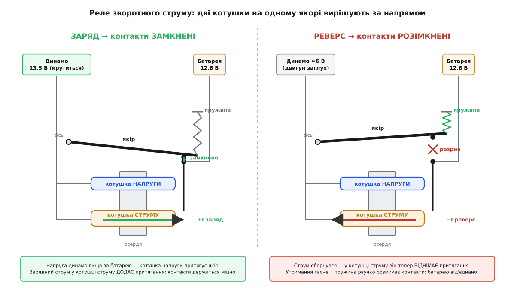
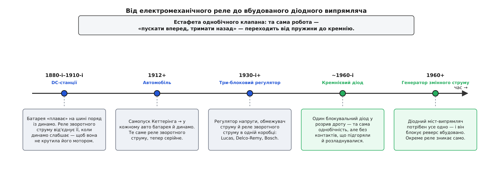

# 📜 Реле зворотного струму: як пружина стерегла батарею

Задовго до того, як однобічний клапан навчилися вирізати з кремнію, ту саму роботу виконувала жменя міді, заліза й сталева пружина. І задача, яку той механізм розв'язував, тонша, ніж здається на перший погляд. Звичайний вимикач уміє відповісти лише на одне питання — «чи є напруга?». А тут треба було відповісти на інше: **«у який бік тече струм?»** — і тримати коло замкненим, поки струм іде вперед, та розірвати його рівно тієї миті, коли струм обернувся. Пристрій, що вмів це самими лише котушками й пружиною, без жодної лампи чи транзистора, звався **реле зворотного струму** (англ. *reverse-current cut-out*, буквально «вимикач зворотного струму»).

Історія його — це історія однієї впертої задачі, яка не змінилася й досі, змінилася тільки техніка, якою її розв'язують.

### Батарея, що «плаває» на шині

Задача народилася не в автомобілі, а на десятиліття раніше — у машинних залах перших електростанцій постійного струму. Наприкінці XIX століття міські мережі освітлення живилися від динамо-машин (генераторів постійного струму), а поряд із ними на ту саму шину вмикали **акумуляторну батарею**. Батарея тут працювала не як окреме джерело, а як буфер: удень, коли динамо тягне, вона підзаряджається й лише «плаває» на шині; коли навантаження стрибає або динамо ненадовго слабшає — вона миттєво віддає накопичене й тримає напругу. Англійці назвали цей режим влучно — *floating the battery on the line*, «батарея плаває на лінії».

Але [паралельне з'єднання джерела й буфера на спільній шині](root:hw-power/power-oring) ховає ту саму пастку, що й будь-яке об'єднання джерел. Поки динамо крутиться і його напруга вища за батарею — струм тече правильно: від динамо в мережу й потроху в батарею. А коли машиніст спиняв динамо на ніч або пасок прослизав і оберти падали — напруга динамо просідала **нижче** за напругу зарядженої батареї. І тієї ж миті закон, що жене струм із вищого потенціалу в нижчий, обертав його: батарея починала **розряджатися назад крізь динамо**.

Це не просто марна втрата заряду. Динамо-машина за своєю природою **оборотна**: пропустиш крізь її обмотку струм — і вона з генератора стане мотором. Батарея, розряджаючись назад, розкручувала спинений генератор, змушувала його [обертатися й розвивати проти-ЕРС](root:hw-motion/back-emf), — тобто крутила важку машину власним коштом, доки не сідала. Машина, задумана віддавати енергію, тепер її пожирала.

Ліки з'явилися ще у практиці тих станцій — **реле зворотного струму** (тоді його частіше звали *reverse-current circuit breaker*, автоматом зворотного струму). Його вмикали в розрив між динамо й батареєю, і воно вміло те, чого не вміє простий рубильник: розпізнавати **знак** струму й розмикатися само, щойно струм із прямого став зворотним. Атрибутувати цей винахід одній людині було б неправдою — це радше усталена інженерна практика раннього електромашинобудування, яка виросла з очевидної потреби й швидко стала стандартним вузлом машинного залу. Важливо інше: сам **принцип**, до якого тоді додумалися, лишився незмінним і перекочував — майже без змін — під капот автомобіля.

### Кеттерінг, самопуск і нова потреба

Те, що на електростанції було одним вузлом на всю залу, автомобіль зробив масовим виробом — бо приніс батарею й генератор у кожну машину.

Поворотним був 1912 рік. Інженер **Чарлз Кеттерінг** (Charles F. Kettering) зі своєю фірмою **Delco** — Dayton Engineering Laboratories Company, яку він заснував 1909 року разом із Едвардом Дідсом (Edward Deeds), — поставив на Cadillac електричний **самопуск** (self-starter). До того двигун крутили важкою ручкою — небезпечно (зворотний удар ручки ламав руки) і незручно. Кеттерінг зробив систему, у якій той самий електромотор спершу прокручував двигун при пуску, а потім, від'єднаний реле, крутився вже двигуном як генератор — заряджав батарею й живив запалення та світло. Патент так і назвали: «Engine Starting, Lighting, and Ignition System» — система пуску, освітлення й запалення. Delco 1916 року продали в General Motors, а вже 1919-го електричний пуск з'явився навіть на масовому Ford Model T. За кілька років уся галузь перейшла на схему «батарея + генератор постійного струму».

І разом із нею кожен автомобіль успадкував **точнісінько ту саму проблему**, що й машинний зал електростанції, тільки в мініатюрі. Динамо крутиться від двигуна; на холостому ходу оберти малі, на стоянці — нульові. Щойно напруга динамо падає нижче за напругу батареї (а на холостих і при заглушеному двигуні це саме так), заряджена батарея починає розряджатися назад крізь якір динамо — і **крутить його мотором**. Результат подвійно поганий: батарея сідає за ніч, а зворотний струм крізь щітки й колектор підпалює контакти й марно гріє обмотку.

Тому в зарядне коло автомобіля, приблизно з середини 1910-х, увійшло те саме реле зворотного струму. Тепер це був крихітний, штампований мільйонами вузол — але задачу він розв'язував ту саму, що й його великий предок на електростанції: замкнути коло, коли динамо заряджає, і розірвати його, щойно струм спробує піти назад.

### Дві котушки на одному якорі

Ось тут і криється вся інженерна краса. Як маленький електромагніт може «знати», у який бік тече струм? Простий електромагніт відчуває лише **силу** струму, а не його напрям — намагнітиться однаково, хоч так пусти струм, хоч навпаки. Секрет реле зворотного струму в тому, що на одному залізному осерді, над одним рухомим **якорем** (англ. *armature* — рухома залізна пластина реле), сидять **дві різні котушки**, і працюють вони назустріч.


*Котушка напруги (тонкий дріт, багато витків) відчуває, коли динамо піднялося над батареєю, і притягує якір — контакти замикаються. Котушка струму (товстий дріт, кілька витків) несе весь зарядний струм: при заряді її поле ДОДАЄ притягання, а коли струм обертається — те саме поле ВІДНІМАЄ його, і пружина рвучко розмикає контакти.*

Перша котушка — **паралельна, «котушка напруги»** (шунтова). Її мотають із багатьох витків тонкого дроту й вмикають прямо на затискачі динамо, паралельно. Вона відчуває **напругу**: поки динамо мовчить, струм у ній малий і магнітне поле кволе, пружина тримає контакти розімкненими. Щойно динамо розкрутилося й його напруга піднялася вище за батарею — струм у тонкій котушці зростає, поле міцнішає, магніт **притягує якір** і замикає контакти. Кажуть, реле «включилося» (англ. *cut in*). У типовій 12-вольтовій системі виробники Lucas налаштовували це включення десь на 12.7–13.3 В — тобто рівно тоді, коли динамо вже справді може заряджати.

Друга котушка — **послідовна, «котушка струму»** (серієсна). Її мотають із кількох витків **товстого** дроту й вмикають у розрив зарядного кола, так що крізь неї проходить **увесь струм** між динамо й батареєю. Ось вона і є детектор напряму. При заряді струм тече «вперед», і поле котушки струму намотане так, що воно **додається** до поля котушки напруги — притягання стає ще міцнішим, контакти держаться намертво. Але коли динамо слабне і струм обертається, крізь ту саму послідовну котушку він тепер тече **у зворотний бік** — і її поле теж обертається. Тепер воно вже не додає, а **віднімає** притягання від котушки напруги. Сумарне поле осердя гасне, магніт більше не втримує якір — і пружина, що весь час тягнула його назад, **рвучко розмикає контакти**. Батарея від'єднана раніше, ніж устигла розкрутити динамо. Реле «вимкнулося» (*cut out*) — звідси й назва.

Порахуймо це в **ампер-витках** — одиниці магніторушійної сили, добутку числа витків на струм. Візьмімо орієнтовні числа, аби відчути співвідношення:

```text
Сила на осерді (ампер-витки):
  F = N_напр · I_напр  +  N_стр · I_коло

Котушка напруги:  N_напр = 1200 витків,  I_напр ≈ 0.02 А  → 24 А·вит
Котушка струму:   N_стр  = 5 витків

Заряд, I = +10 А:  F = 24 + 5·(+10) = 24 + 50 = 74 А·вит  → тримає міцно
Спокій, I =  0 А:  F = 24 + 5·(  0) = 24 +  0 = 24 А·вит  → ще замкнено
Реверс, I = −3 А:  F = 24 + 5·(−3) = 24 − 15 =  9 А·вит  → нижче утримання
                   пружина рве контакти
```

Зверніть увагу, яка це елегантна арифметика. У тонкої котушки багато витків, тож навіть її дрібний струм дає солідні 24 ампер-витки — досить, щоб просто **тримати** вже замкнений якір. А товста котушка має всього кілька витків, зате крізь неї йдуть **ампери**: п'ять витків на десяти амперах — це 50 ампер-витків, які при заряді впевнено допомагають. Але той самий множник обертається проти струму, коли він піде назад: лічені ампери реверсу через ті самі п'ять витків віднімають досить, аби перекинути баланс і відпустити пружину. Пристрій, по суті, **множить знак струму на важіль** і механічно порівнює результат із силою пружини. Жодної електроніки — саме тому воно й працювало ще до електроніки.

> 🔧 **Навіщо це.** Головна ідея реле зворотного струму пережила всі покоління техніки: щоб зловити реверс, мало виміряти напругу — треба виміряти **знак струму**. Тонка котушка каже «динамо вже вище за батарею, можна замикати»; товста котушка каже «а тепер струм пішов не туди — розмикай». Рівно ці два питання ставить і сучасний контролер «ідеального діода»: одне — про напругу («хто зараз вищий»), друге — про напрям струму («він ще тече вперед?»). Змінилися датчики й ключ; питання лишилися ті самі.

### Три блоки в одній коробці

Саме реле рідко жило окремо. Динамо, полишене без нагляду, на високих обертах задирає напругу так, що кипить батарея й перегорають лампи, а віддати може струм, більший за той, на який розрахована його ж обмотка. Тому поряд із реле зворотного струму в ту саму коробку поселили ще два електромагнітні блоки-«регулятори»: **регулятор напруги** (вібрує контактами, вмикаючи опір у коло збудження, коли напруга сягнула межі) і **обмежувач струму** (робить те саме, коли струм перевищив ліміт). Виходив класичний **три-блоковий регулятор** — три котушки з якорями на спільній основі, кожна стереже своє.

Ці коробки штампували мільйонами по обидва боки океану, і всюди — та сама трійця. У Британії їх робив **Lucas** (Joseph Lucas Ltd, Бірмінгем): справжній три-блоковий, «трибобінний» тип — це моделі на кшталт **RB310** і **RB340** (регулятор напруги + обмежувач струму + реле зворотного струму). Простіші й найпоширеніші коробки Lucas — **RB106** — мали лише два блоки: один вібраційний регулятор напруги, що заодно обмежував струм, плюс окреме реле зворотного струму; такі стояли на Morris Minor, MG MGA, Austin-Healey Sprite і MG Midget. У США **Delco-Remy** (підрозділ General Motors) робив свій три-блоковий регулятор із точнісінько такою ж будовою реле — послідовна обмотка з кількох витків товстого дроту та шунтова з багатьох витків тонкого. У Німеччині те саме випускав **Bosch**. Різні марки, різні кріплення й номінали — але серце скрізь однакове, бо й задача одна.

Атрибуція тут навмисно **родова**: реле зворотного струму — не чийсь особистий винахід, а стандартний елемент інженерної практики, який кожен великий виробник електрообладнання втілював по-своєму. Шукати тут «першого винахідника» — те саме, що шукати винахідника гвинта: ідея очевидна з потреби, а цінність — у мільйонах акуратно зроблених екземплярів.

### Естафета однобічного клапана

У реле зворотного струму був природжений ґандж — **контакти**. Пара металевих цяток, що замикаються й розмикаються тисячі разів на поїздку, неминуче підгоряють від іскри, окиснюються, залипають і розладнуються. Реле, яке мусить розімкнутися рівно вчасно, іноді запізнювалося чи не спрацьовувало — а це вже прямий шлях до розрядженої батареї й зіпсованого динамо. Робота була делікатна, але вкрай важлива: завалити її легко, а ціна помилки — загублене за ніч динамо. Реставратори старих машин досі згадують ці контакти лихим словом.

Тож щойно з'явилися дешеві **кремнієві діоди**, естафету однобічного клапана підхопило залізо без жодної рухомої частини.


*Та сама робота — «пускати вперед, тримати назад» — переходить від пружини й контактів до кремнієвого переходу, а далі стає безкоштовним побічним ефектом випрямляча генератора змінного струму.*

Спершу — **прямий переклад**: один [блокувальний діод](root:ph-condensed/pn-junction) у розрив зарядного дроту, вістрям (катодом) до батареї. Діод — це і є однобічний клапан у чистому вигляді: у прямому напрямі проводить, у зворотному тримає напругу. Він робить рівно те, що робило реле, тільки без контактів, які підгоряють, без пружини, яку треба налаштовувати, і без запізнення — фізика переходу спрацьовує миттєво й завжди. Ціна — постійне падіння напруги на діоді; але надійність того варта, і в багатьох схемах реле просто викинули, а на його місце поставили діод.

А далі стався зсув глибший — **генератор змінного струму** (англ. *alternator*). У 1960 році Chrysler першим із американських автовиробників поставив генератор змінного струму серійно (на компактній моделі Valiant), і за кілька років на нього перейшла вся галузь. Річ у тім, що генератор змінного струму видає, як каже назва, **змінний** струм, а бортова мережа й батарея потребують **постійного**. Тому на виході генератора стоїть **міст із діодів-випрямлячів**, який перетворює змінний струм на постійний. І тут — уся сіль: ці випрямні діоди **за самою своєю природою** пропускають струм лише в один бік. Вони проводять, коли генератор видає більше за батарею, і **замикаються тієї ж миті**, коли генератор спиняється й батарея намагається штовхнути струм назад. Захист від зворотного струму став **безкоштовним побічним ефектом** випрямляча — окреме реле зворотного струму стало непотрібним і тихо зникло зі схеми.

Ось так одна впертa задача пройшла через три втілення, не змінивши суті. Спочатку її розв'язувала пружина з двома котушками, що механічно порівнювала знак струму із силою пружини. Потім — кремнієвий перехід, що робив те саме без рухомих частин. Нарешті вона розчинилася в самій конструкції генератора, ставши однією з функцій його випрямляча. А сьогодні ту саму пару питань — «хто зараз вищий за напругою?» і «в який бік іде струм?» — ставить контролер [«ідеального діода»](root:hw-power/ideal-diode), відповідаючи на них компаратором і польовим ключем замість котушки й контактів. Техніка змінюється щопокоління; питання, на яке вона відповідає, не змінилося від машинного залу перших електростанцій.
