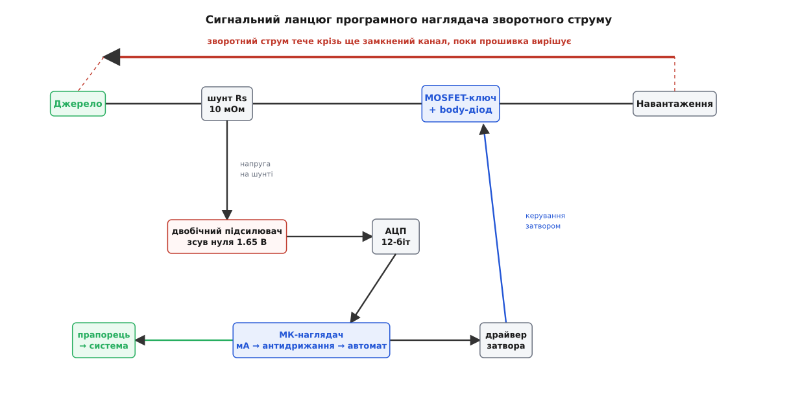
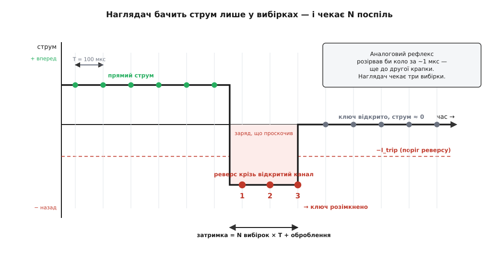

# ⚙️ Наглядач зворотного струму на мікроконтролері

Аналоговий [«ідеальний діод»](root:hw-power/ideal-diode) ловить реверс, як рефлекс: швидкий компаратор порівнює напругу на ключі й за частку мікросекунди притискає затвор. Жодного коду, жодного роздумування — суто рефлекторна дуга з кількох транзисторів. Але на платі майже завжди вже сидить мікроконтролер, і та сама робота — «помітив, що струм пішов назад, розімкнув ключ» — цілком лягає в прошивку. Навіщо, якщо залізо швидше? Бо прошивка вміє те, чого рефлекс не вміє: поріг у неї **програмний** (зміни константу — і той самий вузол ловить 50 мА чи 5 А), витримку й гістерезис можна **підкрутити під конкретне навантаження**, а головне — наглядач не просто рве коло, він **знає** про подію: піднімає прапорець, який читає решта системи, лічить аварії, шле телеметрію, ухвалює політику «спробувати ще раз чи приспати вузол». Платить він за це швидкодією. Зберемо такий наглядач від давача до ключа — і впремося в один незручний факт: **поки прошивка думає, реверс уже тече**.

## Задача

Ключ навантаження стоїть у силовому колі: MOSFET (або пара спина-до-спини, якщо реверс треба тримати в обидва боки), затвором керує [драйвер](root:hw-power/gate-driver), а тим драйвером — ніжка мікроконтролера. Послідовно з коло́м увімкнено **шунт** — крихітний [резистор на міліоми](root:hw-components/shunt-resistor), на якому струм лишає слід у вигляді напруги. Цю напругу підхоплює [двобічний давач струму](root:hw-sensing/bidirectional-current-sense): [підсилювач вимірювання струму типу INA](root:hw-sensing/current-monitor) з навмисним зсувом нуля посередині живлення. Прямий струм піднімає вихід над зсувом, зворотний — опускає під нього. [АЦП](root:hw-analog/adc) мікроконтролера читає цей вихід, і задача наглядача проста на словах: **безперервно стежити за знаком і величиною струму; щойно струм упевнено пішов назад — розімкнути ключ і сказати про це системі**. З двома застереженнями, які й роблять задачу цікавою: не спрацьовувати від пульсацій і шуму — і не проґавити справжній реверс.


*Струм лишає слід на шунті; двобічний підсилювач зі зсувом нуля перетворює його на напругу довкола середини, АЦП оцифровує, мікроконтролер переводить у знаковий струм і жене крізь антидрижання й автомат. Рішення «розімкнути» повертається через драйвер на затвор, а прапорець аварії йде в систему. Замкнена петля — але, на відміну від аналогового рефлексу, з тактом і роздумуванням усередині.*

Почнемо з фундаменту — як із сирого відліку АЦП дістати **знаковий** струм у зрозумілих одиницях. Це не деталь, а половина справи: усе подальше рішення спирається на це число, і якщо воно бреше на зсув, наглядач ловить привидів. Візьмемо конкретні числа й пройдемо ланцюг наскрізь.

**Шунт 10 мОм, підсилювач із підсиленням 50, зсув нуля 1.650 В; АЦП 12-біт з опорою 3.300 В.**

```text
Чутливість ланцюга:  S = G · Rs = 50 · 0.010 Ом = 0.5 В/А
   тобто 1 А струму дає 0.5 В над зсувом, а 1 мВ ≈ 2 мА

Крок АЦП:            3300 мВ / 4096 = 0.8057 мВ на один відлік
Один відлік струму:  0.8057 мВ · 2 мА/мВ = 1.611 мА  ≈ 1611 мкА
Зсув нуля у відліках: 1650 мВ / 0.8057 = 2048  (рівно середина шкали)
```

Звідси проста формула переведення: беремо відлік, віднімаємо середину шкали, множимо на крок. Різниця додатна — струм уперед, від'ємна — назад. Один вольт «помилки» на реальному колі з міліомами шляху обертається десятками ампер (це вся арифметика реверсу), тож розпізнати перші ж від'ємні міліампери й означає встигнути.

## Ідея

Спокуса — написати `if (i < 0) розімкнути()`. Вона розсипається на першому ж реальному давачі, і варто зрозуміти чому, бо кожна складова наглядача народжується саме із цього провалу.

По-перше, **нуль не там, де здається**. Зсув підсилювача не рівно 1.650 В, а плаває з температурою; АЦП має власну похибку; на сигналі сидить шум. Тож біля нуля знак **тремтить**: половину відліків «трохи вперед», половину «трохи назад», хоча струму практично немає. Голе порівняння зі знаком спрацьовуватиме на цьому тремтінні без упину. Ліки — не ловити «менше нуля», а ловити **впевнений реверс**: поріг `−I_trip`, помітно нижчий за нуль, за яким струм уже точно назад, а не шумить довкола нуля.

По-друге, навіть за розумного порога один-єдиний відлік нічого не доводить. Пульсація навантаження, кидок при вмиканні сусіда, наводка на довгий провід до шунта — будь-що може на мить провалити струм у мінус, не будучи аварією. Тому реверс має **протриматися**: вимагаємо, щоб умова `i ≤ −I_trip` виконалася на **N вибірках поспіль**. Це антидрижання (англ. *deglitch*) — той самий прийом, яким гасять [брязкіт контактів](root:hw-digital/contact-debounce): не вір миттєвому значенню, дочекайся, поки воно встоїться. Коротший за N·T сплеск лічильника не набере — і буде відкинутий.

По-третє, коли ми вже розімкнули ключ, не можна замикати його назад від першого ж «схожого на норму» відліку. Якщо причина реверсу нікуди не поділася, ключ замкнеться — реверс ринé — наглядач знову розімкне, і так тисячі разів на секунду: **брязкіт ключа**, який гріє й нищить транзистор. Тому вхід і вихід зі стану аварії розводять: розмикаємось на `−I_trip`, а замикаємось назад лише коли струм упевнено повернувся вперед, вище окремого порога `I_rearm`. Це **гістерезис** — та сама пам'ять про власний стан, що й у [програмному тригері Шмітта](root:hw-digital/threshold-schmitt/proj-software-hysteresis.md), тільки прикладена до знакового струму. А там, де відновлення взагалі не потрібне, найпростіший і найнадійніший варіант — **фіксація** (англ. *latch*): розімкнувши раз, лишатися вимкненим, доки система свідомо не скине аварію.

Складаємо це докупи — і наглядач виявляється крихітним **автоматом із двох станів**. «На варті» (ключ замкнений, стежимо за реверсом) і «в аварії» (ключ розімкнений, підсвічуємо прапорець). Переходи між ними стереже пара порогів і лічильник антидрижання. Уся хитрість — у станах і умовах; решта коду просто читає давач і смикає затвор.

## Робочий код

Це прошивка, що керує ніжкою, АЦП і перериванням, — домен, де мова одна: C/C++. Ядро — невеликий клас, що тримає налаштування й стан; його `tick()` викликають з рівномірного такту (обробника переривання таймера) зі свіжим струмом. Числа тримаємо в **мікроамперах цілими** — жодної коми: цілочислова арифметика на мікроконтролері без співпроцесора швидша й **детермінована**, а в обробнику переривання, що крутиться десятки тисяч разів на секунду, це не примха, а необхідність.

```cpp
#include <stdint.h>

// ── Калібрування ланцюга давача (рахується раз, під конкретну плату) ─────────
// АЦП 12-біт, опора 3.300 В  → 3300 мВ / 4096 = 0.8057 мВ на відлік
// Чутливість S = G·Rs = 50 · 0.010 Ом = 0.5 В/А   →   1 мВ = 2 мА
//   один відлік = 0.8057 мВ · 2 мА/мВ = 1.611 мА ≈ 1611 мкА
static const int32_t UA_PER_COUNT = 1611;   // мкА на один відлік АЦП
static const int16_t BIAS_COUNT   = 2048;   // 1.650 В — точка нульового струму

// Сирий відлік → ЗНАКОВИЙ струм у мкА (плюс — уперед, мінус — назад):
static inline int32_t counts_to_uA(uint16_t raw) {
    return (int32_t)((int16_t)raw - BIAS_COUNT) * UA_PER_COUNT;
}

void gate_write(bool on);   // прив'язка до заліза — нижче

// ── Наглядач зворотного струму ──────────────────────────────────────────────
class ReverseGuard {
public:
    struct Config {
        int32_t trip_uA;    // модуль реверсу, що вважаємо аварією (300000 = 300 мА)
        int32_t rearm_uA;   // прямий струм для повернення на варту (гістерезис)
        uint8_t deglitch;   // скільки вибірок поспіль умова має протриматися
        bool    latching;   // true — лишатися вимкненим до явного reset()
    };

    explicit ReverseGuard(const Config& c) : cfg(c) {}

    // Виклик із РІВНОМІРНОГО такту (обробник переривання таймера).
    void tick(int32_t i_uA) {
        last_uA = i_uA;
        if (state == ARMED) {
            // реверс від'ємний; аварія — коли струм глибше за −trip
            if (i_uA <= -cfg.trip_uA) {
                if (++rev_run >= cfg.deglitch) trip();
            } else {
                rev_run = 0;              // будь-яка здорова вибірка скидає лічильник
            }
        } else {                          // TRIPPED
            if (cfg.latching) return;     // засувка: вихід лише через reset()
            if (i_uA >= cfg.rearm_uA) {
                if (++fwd_run >= cfg.deglitch) rearm();
            } else {
                fwd_run = 0;
            }
        }
    }

    bool    faulted() const { return fault; }    // липкий прапорець для системи
    int32_t current() const { return last_uA; }
    void    reset()         { fault = false; rearm(); }  // ручне скидання засувки

private:
    enum State { ARMED, TRIPPED };

    void trip() {
        gate_write(false);   // ПЕРШЕ — розімкнути ключ (дія в залізі)
        state = TRIPPED;
        fault = true;        // ПОТІМ — підняти прапорець для системи
        rev_run = 0;
    }
    void rearm() {
        gate_write(true);
        state = ARMED;
        fwd_run = 0;
    }

    Config  cfg;
    State   state   = ARMED;
    uint8_t rev_run = 0, fwd_run = 0;
    bool    fault   = false;
    int32_t last_uA = 0;
};
```

Серце — метод `tick()`, і в ньому варто побачити три речі. Порядок дій в `trip()`: спершу **залізо** (`gate_write(false)`), і лише потім прапорець — бо коли струм тече не туди, дорога кожна мікросекунда, і повідомити систему можна вже після того, як коло розірвано. Лічильники `rev_run` і `fwd_run` — це і є антидрижання: будь-яка вибірка, що випадає з умови, скидає лічильник у нуль, тож пробитися крізь фільтр може лише **N підряд**. І два різні пороги на вхід та вихід (`trip_uA` проти `rearm_uA`) — це гістерезис, без якого автомат брязкотів би на межі.

Тепер прив'язка до заліза й такт. Тут з'являються регістри й переривання — те, заради чого прошивку взагалі пишуть цією мовою:

```cpp
// ── Прив'язка до заліза (макроси — під конкретний МК) ────────────────────────
void gate_write(bool on) {
    // Верхній ключ через драйвер затвора: on → підняти затвор, off → притиснути до 0.
    if (on) GPIO_SET(GATE_PORT, GATE_PIN);
    else    GPIO_CLR(GATE_PORT, GATE_PIN);
}

ReverseGuard guard({
    .trip_uA  = 300000,   // 300 мА реверсу — аварія
    .rearm_uA = 150000,   // 150 мА впевненого прямого — умова повернення
    .deglitch = 3,        // три вибірки поспіль
    .latching = true,     // фіксуємось, чекаємо явного reset()
});

// Обробник переривання таймера на 10 кГц (кожні 100 мкс):
extern "C" void TIM_IRQHandler(void) {
    TIM_CLEAR_FLAG();
    uint16_t raw = adc_read(CURRENT_CH);   // одне перетворення АЦП
    guard.tick(counts_to_uA(raw));         // уся логіка — тут
}
```

І головний цикл, що читає прапорець і вирішує **політику** — ту саму гнучкість, заради якої наглядач узагалі виносять у прошивку:

```cpp
int main(void) {
    board_init();
    // безпечний старт: замикаємо ключ лише коли переконались у прямому струмі
    for (;;) {
        if (guard.faulted()) {
            log_event("REVERSE", guard.current());  // телеметрія, лічильник аварій
            alarm_raise();                           // тривога назовні
            // політика системи: приспати вузол / спробувати відновитись / чекати
        }
        do_other_work();   // мигання, мережа, решта — наглядач крутиться в перериванні
    }
}
```

Ось і весь наглядач: одне перетворення АЦП у перериванні, переведення в знаковий струм, автомат із двох станів — і решта системи, що читає прапорець. Порівняйте з аналоговим рефлексом: там та сама логіка «зашита» у компаратор і працює завжди й миттєво, зате незмінна. Тут кожен поріг, кожна витримка — рядок, який можна переписати, а подія стає **числом у журналі**, а не безмовним розривом кола.

## Скільки коштує «повільніше»

За гнучкість наглядач платить головним — часом реакції, і ця плата не абстрактна. Порахуймо її чесно.

**Такт 10 кГц, антидрижання 3 вибірки, перетворення АЦП і вхід у переривання ≈ 30 мкс.**

```text
Період вибірки:       T = 1 / 10 000 = 100 мкс
Антидрижання:         3 · 100 = 300 мкс (найгірший випадок — плюс фаза до 1 T)
Оброблення (АЦП+ISR): ≈ 20…40 мкс
──────────────────────────────────────────────
Від початку реверсу до розмикання: ≈ 300…400 мкс

Аналоговий «ідеальний діод»: ≈ 0.5…2 мкс
Наглядач повільніший у 200…800 разів.
```

Три вибірки антидрижання, які ми додали заради надійності, **напряму** розтягують це вікно — ось перша фундаментальна напруга наглядача: більше N — менше хибних спрацювань, але й довше тече реверс. І тут криється те, що робить задачу по-справжньому підступною: **поки наглядач вибирає й лічить, ключ ще замкнений**. Затвор ще піднятий, канал ще відкритий — і весь цей час зворотний струм ллється крізь відкритий канал, опір якого міліоми. Це не діодний бар'єр, а майже коротке замикання: реверс тут навіть більший, ніж потік би крізь звичайний блокувальний діод.


*Наглядач бачить струм лише в миті вибірок (крапки), а не безперервно. Струм повернув між двома вибірками; перша ж вибірка нижче порога −I_trip запускає лічильник, і тільки на третій поспіль наглядач розмикає ключ. Заштрихована смуга — заряд, що встиг пройти назад крізь ще відкритий канал за ці три такти. Аналоговий контролер розірвав би коло на порядки раніше, ще до другої крапки.*

Скільки саме встигає проскочити — і чи це біда:

**Реверс ΔV = 1 В, шлях 0.1 Ом (канал + мідь + роз'єм), затримка 350 мкс.**

```text
Зворотний струм:  I = ΔV / R = 1.0 / 0.1 = 10 А
Заряд:            Q = I · t = 10 · 350·10⁻⁶ = 3.5 мКл
Тепло в каналі:   P = I² · Rds = 100 · 0.010 = 1 Вт  (350 мкс → 0.35 мДж)
```

Одиничний такий сплеск транзистор переживає — 0.35 мДж розсіяти не проблема. Але якщо аварія повторюється, або струми справді великі, або замикання ключа тимчасово зникло й реверс тече секундами до наступного такту — ці мілікулони складаються в реальну шкоду. Звідси й висновок: коли реверс може бути раптовим і потужним (сусідній блок закоротило), **швидку реакцію лишають аналоговому рефлексу, а прошивці віддають нагляд і політику**. Коли ж реверс повільний і дрібний — заряджена батарея тихенько тече назад крізь темну сонячну панель на десятках міліампер — сотні мікросекунд затримки не важать нічого, і чисто програмний наглядач цілком доречний.

Після розмикання постає питання, яке легко проґавити: а **чи спиняє** розмикання реверс? Один MOSFET блокує струм лише в один бік — той, куди його [body-діод](root:hw-components/body-diode) дивиться зворотно. Якщо транзистор орієнтований на блокування реверсу (витік до джерела), то, розімкнувши канал, ми лишаємо реверс упертися в зворотно зміщений body-діод — і реверс справді спиняється. Якщо ж потрібне двобічне тримання, ставлять два MOSFET спина-до-спини, і наглядач мусить гасити **обидва** затвори. Просто «записати нуль у ніжку» замало думати — треба знати, який діод куди дивиться, інакше «розімкнутий» ключ пропускає саме те, від чого мав захистити.

## Автовідновлення без зайвого заліза

Засувка проста й безвідмовна, але часом хочеться, щоб вузол сам оживав, коли причина минула — панель освітилася, сусід ожив. У коді для цього вже все є: `latching = false`, і в стані `TRIPPED` наглядач чекає впевненого прямого струму `rearm_uA`, щоб замкнути ключ назад. Але звідки взяти цей струм, якщо ключ **розімкнений** і струму нібито немає?

Ось тут краса орієнтації body-діода відкривається вдруге. У блокувальному розташуванні розімкнений транзистор реверс тримає, а прямий струм **пропускає крізь той самий body-діод** — з діодним падінням, зате пропускає. Шунт стоїть у колі послідовно, вище за ключ, тож він **бачить** цей прямий струм навіть при вимкненому каналі. Отже, наглядачеві не потрібен ні окремий давач напруги, ні друга ніжка: він читає ту саму знакову величину зі шунта, і щойно вона впевнено пішла вперед (прямий струм повернувся й тече крізь body-діод), замикає канал, аби прибрати діодне падіння й повернути малі втрати. Реверс же в цьому стані блокований — тож жодного паразитного струму, який хибно скине аварію, немає.

Одна засторога: якщо реверс не минув, автозамикання призведе до того самого брязкоту — замкнули, реверс ринув, розімкнули. Тому автоваріант доповнюють **відступом** (англ. *backoff*): після кількох невдалих спроб поспіль подовжують паузу перед наступною або зовсім переходять у засувку й будять систему. Лічильник спроб — ще один рядок, де програмний наглядач виграє в аналогового: рефлекс так розумувати не вміє.

## Пастки

Кожен параметр наглядача — це вибір між двома способами помилитися, і майже всі пастки живуть на цих терезах.

**Поріг занизький — хибні спрацювання від пульсацій.** Реальне навантаження пульсує: імпульсний перетворювач, комутація, кидки. Якщо середній прямий струм лише 50 мА, а пульсація ±200 мА, то в долинах струм провалюється до −150 мА — і поріг реверсу в 100 мА спрацьовує на кожній долині, хоча жодної аварії немає. Поріг мусить сидіти **вище** за найгіршу пульсацію плюс шум давача, з запасом. Частково рятує антидрижання: коротка долина, вужча за N·T, лічильника не набере — але лише якщо вона справді коротша.

**Поріг зависокий — пропущений реверс.** Дзеркальна біда. Заряджена батарея тече назад крізь темну панель на −80 мА і робитиме це годинами, марно спорожняючись. Поріг у 300 мА цього ніколи не побачить. Виходить вилка: поріг має лежати **між** найбільшою нормальною пульсацією й найменшим реверсом, який зобов'язані впіймати. Якщо ці дві межі перекриваються — пульсація сягає глибше за реверс, що його треба ловити, — програмний наглядач сам не впорається: потрібен тихіший підсилювач, фільтр на вході, або аналогове рішення з іншим принципом.

**Антидрижання проти швидкодії.** Ту саму напругу назвемо прямо, бо це головний компроміс налаштування. Кожна додана вибірка N робить наглядач стійкішим до шуму — і рівно на стільки ж довше пускає реверс крізь відкритий канал. Немає «правильного» N; є баланс під конкретне коло: скільки заряду переживе ключ проти того, наскільки брудний сигнал.

**Зсув нуля плаває.** Точка нульового струму `BIAS_COUNT` — не свята константа. Зсув підсилювача й опора АЦП повзуть із температурою, і жорстко зашитий зсув перетворюється на **фантомний струм**. Порахуймо: зсув усього на 20 мВ при нашій чутливості 0.5 В/А — це `0.020 / 0.5 = 40 мА` неіснуючого струму, які наглядач приймає за чисту монету. Ліки — виміряти нуль **при завідомо нульовому струмі** на старті (а краще й періодично) і віднімати виміряне, а не паспортне. Це та сама [двоточкова корекція АЦП](root:hw-sensing/adc-errors/proj-two-point-cal.md), лише прикладена до знакового давача.

**Аліасинг: реверс між вибірками.** Наглядач сліпий між тактами. Якщо реверс приходить і зникає швидше за період вибірки — гострий сплеск між двома крапками, — наглядач його просто не побачить, а якщо побачить, то спотворено. Проти цього ставлять аналоговий фільтр низьких частот на лінії давача (щоб не було чого аліасити) або піднімають частоту вибірки. Але й тут терези: швидша вибірка — важче переривання й дорожча цілочислова обробка.

**Кома в перериванні.** Спокуса написати `float i = (raw - bias) * scale;` у тілі обробника. На мікроконтролері без співпроцесора кожна така операція — десятки тактів, і в перериванні на 10 кГц вони з'їдають бюджет, а час обробки ще й **плаває**. Тому весь код вище тримає струм цілими мікроамперами й порівнює цілі: детерміновано й швидко. Це не мікрооптимізація заради краси — це різниця між тим, чи встигне наглядач зробити свою вибірку до наступного такту.

**Ключ і безпечний стан.** «Розімкнути» — не завжди «записати нуль у GPIO». Верхній ключ потребує [драйвера затвора](root:hw-power/gate-driver), бо підняти затвор над шиною живлення прямою ніжкою не вийде; пара спина-до-спини вимагає гасити обидва затвори. І окремо — стан при скиданні та просіданні живлення: після ресету, доки прошивка не піднялась, ніжка має за замовчуванням тримати ключ у **безпечному** положенні (радше розімкненому), інакше вікно беззахисності відкривається щоразу на старті. Тому в `main()` ключ замикають не наосліп, а свідомо, переконавшись у прямому струмі.

Наглядач на мікроконтролері — це не швидший захист, а **розумніший**. Він завжди програє аналоговому рефлексу в часі й завжди виграє в гнучкості та обізнаності: там, де реверс повільний і дрібний, а системі важливо не лише спинити струм, а й **знати** про подію й на неї відповісти, кілька рядків прошивки замінюють спеціалізовану мікросхему — і роблять більше, ніж вона.
