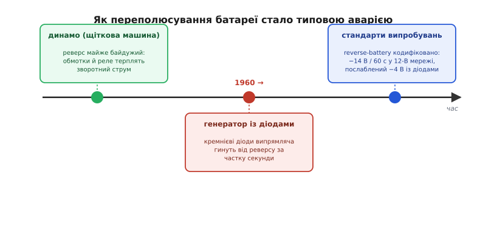
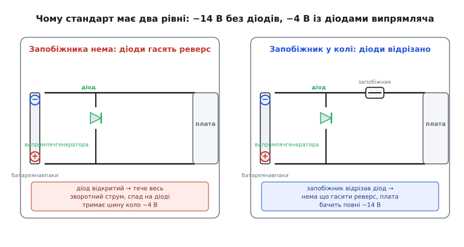

# 📜 Як переплутана батарея стала окремим випробуванням

Є аварії, яких інженер не вигадує за столом, — їх приносить із собою жива експлуатація, і приносить так уперто, що зрештою галузь мусить визнати їх нормою, а не винятком. Переполюсування автомобільної батареї — саме така. Ніхто не проєктує пристрій, розраховуючи, що плюс і мінус хтось накине навхрест. І все ж це стається щодня по всьому світу, у гаражах і на узбіччях, руками досвідчених механіків не рідше, ніж руками власників, — і стається так передбачувано, що для нього виписали окремий рядок у міжнародному стандарті випробувань, із точною напругою й точним часом. Історія цього рядка — це історія про те, як одна конкретна деталь під капотом зробила стару необережність раптом смертельною, і як галузь на це відповіла.

## Стара необережність, що нікому не шкодила

Щоб зрозуміти, чому переполюсування стало проблемою, треба спершу зрозуміти, чому довгий час воно **не** було проблемою. Автомобілі мали електрику задовго до того, як переплутана батарея почала щось ламати, — і секрет тут не в акуратності водіїв тих часів, а в тому, **що саме** стояло на борту.

До початку 1960-х струм у машині виробляв **динамо** (від гр. *dýnamis* — «сила») — колекторна машина постійного струму зі щітками й обертовим якорем. Це, по суті, електродвигун, обернений навпаки: крутиш вал — на щітках з'являється постійна напруга. Головне для нашої розповіді — з чого зроблено все коло заряджання тих років. Мідні обмотки. Залізні осердя. Електромеханічне реле-регулятор, що клацає контактами, під'єднуючи й від'єднуючи динамо від батареї. У цьому колі **немає жодного напівпровідника** — нема нічого, що розрізняло б напрямок струму на рівні фізики.

А те, що не розрізняє напрямку, до переполюсування майже байдуже. Накиньте батарею навпаки на систему з динамо — і струм потече в інший бік крізь мідні обмотки, крізь котушку реле, крізь лампу приладів. Обмотка нагріється не більше, ніж від звичайного струму тієї ж величини: міді все одно, куди тече електрон. Реле може клацнути не туди, регулятор — розгубитися, у найгіршому разі динамо піде «мотором» і смикне ремінь. Неприємно, іноді видно іскру на клемі — але катастрофи нема. Систему можна від'єднати, перекинути клеми правильно, і вона працює далі. Переполюсування тих часів — це прикрість рівня «сів акумулятор», а не «згорів вузол».

Тому й культура поводження з батареєю склалася безтурботна. Ціле покоління механіків звикло, що клеми можна чіпати вільно, що помилка з полярністю — це конфуз, а не поломка. Ця звичка пережила ту техніку, для якої була безпечна, — і саме тому, коли фізика під капотом змінилася, вона вдарила зненацька.

## Одна деталь, що змінила все

Зміна прийшла не від водіїв і не від нового способу помилятися. Вона прийшла з новою деталлю в колі заряджання — з **діодом**.

До кінця 1950-х назрів простий інженерний конфлікт. Машини вимагали дедалі більше струму: потужніші фари, електричні двірники, обігрів скла, автомобільне радіо, згодом — перші електронні впорскування. Динамо на цей апетит уже не тягнуло, надто на малих обертах і холостому ходу: щоб зарядити батарею в заторі, колекторній машині бракувало швидкості. А напрошувалася заміна — **генератор змінного струму** (англ. *alternator*, від *alternate* — «чергуватися»). Він охоче віддає струм навіть на холостих і механічно простіший. Була лиш одна перешкода, суто фізична: генератор виробляє струм **змінний**, що тече туди-сюди, а батарея приймає тільки **постійний**. Треба щось, що пропускає струм в один бік і не пропускає в інший, — випрямляч. Роль ця для діода природна, але доступних, дешевих і надійних діодів на потрібні струми довго не було. Щойно кремнієві діоди подешевшали й стали витримувати десятки ампер, перешкода впала — і генератор змінного струму витіснив динамо за якесь десятиліття.

Першим поставив генератор змінного струму **серійно, як штатне обладнання**, американський **Chrysler** — на моделі Valiant 1960 модельного року, на кілька років випередивши Ford і General Motors. (Самі генератори змінного струму не були нові — їх ставили ще під час Другої світової на військові машини, щоб живити радіостанції, — але саме Chrysler зробив їх нормою для масового легковика.) Генератори тих перших машин збирали в Індіанаполісі; на діодний випрямляч інженер Chrysler Ґленн Ферісон (Glenn S. Farison) отримав патент. Перші вузли давали лиш близько 30 А — доволі для легкого літака Piper, але не для всіх авто, тож поки Chrysler не дотягнув власні до ~60 А, важчі генератори брали в Leece-Neville.

> 🔧 **Навіщо це.** Уся суть переходу — в одному: у колі заряджання з'явився напівпровідник, який **за фізикою** пропускає струм лише в один бік. Динамо було симетричне до полярності; генератор — ні. Саме ця асиметрія, потрібна для випрямлення, і зробила з переплутаної батареї не конфуз, а руйнівну подію.

І тут стара безтурботна звичка зустрілася з новою фізикою. Той самий рух рукою, що поколіннями лишався безкарним, тепер уперше зустрічав на своєму шляху діод. Розгляньмо, що діється в мить помилки.

## Мить помилки: чому діод не переживає реверсу

Випрямляч генератора — це міст (звичайно шість діодів для трьох фаз), увімкнений між обмотками й батареєю так, щоб віддавати в батарею тільки додатні півхвилі. У нормальній роботі кожен діод по черзі то відкритий (проводить свою півхвилю), то замкнений (тримає зворотну напругу, поки провідні інші). Усе розраховано на **правильний** знак на клемі батареї.

Накиньте батарею навпаки — і вся картина перевертається. Діоди, що в нормі стережуть зворотну напругу, тепер зміщені **прямо** й відкриваються навстіж. Крізь них із перевернутої батареї ринає струм, обмежений хіба що опором обмоток та дротів, — десятки, а то й сотні ампер. І тут спрацьовує безжальна арифметика теплового пробою: у діода з кремнію тонкий p-n-перехід, кристалик у кілька міліметрів, і на ньому осідає добуток струму на пряме падіння. Сто ампер на 0.8 В — це вісімдесят ват у крихітному кристалі. Він не встигає віддати таке тепло й перегорає за частку секунди: перехід або **розриває** (діод стає обривом), або **проплавляє наскрізь** (діод стає перемичкою, і тоді на клемі акумулятора висить постійне коротке замикання). Практики описують це буквально як вибух діодів у випрямлячі.

Ось той самий тепловий баланс у числах.

**Перевернута 12-В батарея, опір кола заряджання ≈ 0.05 Ом, пряме падіння діода Vf ≈ 0.8 В.**

```text
Зворотний струм крізь відкриті діоди:
  I ≈ (12 − Vf) / R = (12 − 0.8) / 0.05 ≈ 224 А

Потужність, що осідає в кристалах діодів:
  P ≈ Vf · I = 0.8 · 224 ≈ 179 Вт   (у міст із шести дрібних кристалів)

Висновок: кожен провідний діод розсіює десятки ват у міліметровому
переході, розрахованому на одиниці ват — тепловий пробій за частку секунди.
```

І це ще половина біди. Поки випрямляч гине, та сама перевернута напруга б'є по всьому іншому, що встигло з'явитися на борту, — по регуляторі, по електронних блоках керування, по радіо. Кожен вхід живлення, спроєктований на один знак, під зворотним знаком відкриває свої паразитні шляхи, і найслабший згорає першим. Машина, у якій колись переполюсування коштувало іскри й п'яти хвилин на перекидання клем, тепер коштувало генератора, а нерідко й блоку електроніки.

## Чому саме обслуговування й підкурювання

Могло б здатися, що з чіткою розміткою клем і різними діаметрами полюсів помилка стане рідкістю. На самій машині так і є: клеми підписані, кабелі різного кольору, наконечники різні. Проблема в тому, що переполюсування народжується не там, де батарея стоїть штатно, а там, де в коло втручається людина з інструментом і чужими дротами. Два сценарії дають майже всі випадки.

**Обслуговування й ремонт.** Батарею знімають, ставлять нову, чіпають проводку — і в тісному підкапотному просторі, часто наосліп чи поспіхом, накидають клему не на той полюс. Або збирають роз'єм блоку дзеркально. Помиляються не лише аматори: досвідчений механік, що робить це вп'ятдесяте за день, помиляється саме через автоматизм. Тут і мстить культура, успадкована від епохи динамо, коли така помилка нічого не ламала.

**Підкурювання (англ. *jump-start*, «запуск ривком»).** Це головне джерело. Сів акумулятор — беруть кабелі-«крокодили» й приєднують чужу заряджену батарею (з іншої машини чи бустера). Тепер полюсів **удвічі більше**: плюс і мінус на кожному з чотирьох затискачів, дві машини, часто в темряві чи на морозі, під тиском «швидше б завестися». Досить накинути «крокодили» навхрест — і на розряджену бортову мережу лягає повна зустрічна напруга чужої свіжої батареї, здатної віддати сотні ампер. Форуми автолюбителів рясніють зізнаннями на кшталт «переплутав полярність під час підкурювання — я ідіот»: помилка настільки типова, що стала фольклором.

> 🔧 **Навіщо це.** Переполюсування — не рідкісний дефект складання, який можна «відсіяти на конвеєрі», а **регулярна експлуатаційна подія**, вбудована в самі процедури обслуговування й підкурювання. Саме тому автомобільна галузь не сподівається на акуратність, а вимагає, щоб електроніка **пережила** переплутану батарею. З цієї вимоги й народилося окреме випробування.


*Причинний ланцюг століття: доки струм робило динамо, переполюсування було майже байдуже; діодний випрямляч генератора зробив ту саму помилку руйнівною; а масовість аварії змусила винести її в стандарт із точними числами.*

## Як аварію перетворили на пункт стандарту

Коли якась несправність трапляється в усіх однаково, галузь рано чи пізно її **кодифікує**: описує точну умову й точний поріг, аби всі виробники перевіряли своє залізо однією міркою. Для переполюсування такою міркою став міжнародний стандарт **ISO 16750-2** — «Дорожні транспортні засоби. Умови довкілля й випробування електричного та електронного обладнання. Частина 2: Електричні навантаження». Його перші редакції вийшли **2003 року** (ISO — Міжнародна організація зі стандартизації, Женева); він увібрав і впорядкував напрацювання національних автомобільних норм попередніх десятиліть.

Пункт про переполюсування там названо стримано — «зворотна напруга» (англ. *reversed voltage*), хоча інженери в побуті кажуть просто *reverse battery*, «зворотна батарея». Суть випробування гранично проста й дослівно відтворює аварію під капотом: на вхід живлення блоку подають **зворотну** напругу й тримають достатньо довго, щоб проявився будь-який тепловий пробій, а не миттєвий сплеск. Величини прив'язані до номіналу бортмережі:

```text
ISO 16750-2, зворотна напруга (reverse battery):

  12-В система:   −14 В упродовж 60 с
  24-В система:   −28 В упродовж 60 с   (вантажівки, автобуси)

  Полегшений режим (Case 1):
  12-В система:   −4 В упродовж 60 с
```

Два числа тут варті окремого пояснення, бо в них уся інженерна суть.

**Чому −14, а не −12.** Здавалося б, у 12-вольтовій машині й зворотна напруга має бути −12 В. Але 14 В — це напруга **працюючого** генератора: коли двигун крутиться, він тримає бортову мережу близько 14 В, щоб заряджати батарею. Стандарт бере найгірший реальний випадок — реверс за працюючого джерела, — тож і в 24-вольтовій мережі число подвоєне до −28 В.

**Чому 60 секунд.** Хвилина — це не «поки помітять і від'єднають», а свідомий запас: за 60 с встигає розігрітися й проявитися будь-який повільний тепловий відмов, а не лише миттєвий кидок. Витримав блок хвилину зворотної напруги без пошкоджень — витримає й коротшу реальну помилку.

А ось третє число, −4 В, — найцікавіше, бо воно прямо повертає нас до історії з діодами генератора.

## Полегшені −4 В: коли генератор рятує сам себе

Стандарт дозволяє замість жорстких −14 В випробовувати блок лише на **−4 В** (той самий режим — «Case 1»), але не будь-кому й не завжди. Умова строга: у колі між генератором і цим блоком **немає послідовного запобіжника**, а зворотну напругу гасять **діоди випрямляча самого генератора**. Механізм тут — навмисне [коротке замикання](root:hw-analog/short-circuit) реверсу крізь відкриті діоди, тільки ролі переставлені проти звичного захисту — і варто простежити його причинно.

За перевернутої батареї, ми вже бачили, діоди випрямляча відкриваються прямо й пропускають крізь себе величезний зворотний струм. Але відкритий діод — це не обрив: він **тримає на собі** своє пряме падіння, десь 0.7–1 В, майже незалежно від струму. А генератор під'єднаний до батареї **без запобіжника**, товстим дротом. Виходить, що напруга на всій бортовій шині «прив'язана» до цих відкритих діодів і не може впасти нижче за кілька їхніх падінь від нуля — навіть під повною зворотною батареєю. Діоди гинуть, приймаючи удар на себе, — але поки вони проводять, вони **обмежують** зворотну напругу на шині приблизно до −4 В. Решта електроніки, підвішена на ту саму шину, бачить уже не −14, а лагідніші −4 В.

А тепер друга половина умови: **якщо запобіжник у колі є**, він, перегоряючи (або просто розриваючи цю вітку), **відрізає діоди генератора від решти**. Тоді гасити реверс уже нема чому — і блок за запобіжником опиниться під повними −14 В. Ось чому стандарт ставить полегшений режим у пряму залежність від запобіжника: **нема запобіжника → діоди клампують → досить −4 В; є запобіжник → діоди відрізані → треба повні −14 В.**


*Один вузол — випрямляч генератора — залежно від наявності запобіжника або гасить реверс до −4 В, або лишається відрізаним, і тоді повні −14 В доходять до плати. Саме цю розвилку стандарт і закладає у два рівні випробування.*

**Що бачить блок у 12-В мережі за реверсу, залежно від запобіжника.**

```text
Запобіжника нема:
  діоди випрямляча відкриті, тримають своє падіння
  шина «притиснута» до кількох Vf від нуля
  → блок бачить ≈ −4 В   → випробування Case 1: −4 В / 60 с

Запобіжник є (перегорів / розірвав вітку):
  діоди генератора відрізані від шини блоку
  реверс нема чим гасити
  → блок бачить повні −14 В   → випробування: −14 В / 60 с
```

Ось де історія замикається сама на себе з несподіваною іронією. Та сама діодна деталь, що півстоліття тому зробила переполюсування руйнівним, у певній схемі стає його **природним обмежувачем**: гине першою, але прикриває решту. І стандарт, замість ігнорувати цей фізичний факт, вписав його прямо в методику — тому й має два рівні суворості замість одного.

> 🔧 **Навіщо це.** Число −4 В у datasheet автомобільної мікросхеми — не примха стандарту, а закодована фізика випрямляча генератора. Побачивши його, інженер має спитати передусім: **чи справді в моєму колі нема послідовного запобіжника між генератором і цим входом?** Бо тільки тоді полегшений режим чесний. Є запобіжник — проєктуй захист на повні −14 В, хоч би що обіцяв полегшений рядок.

## Сусіднє випробування, яке легко сплутати

Поряд із «зворотною батареєю» в автомобільних вимогах майже завжди стоїть інше випробування, і їх варто чітко розрізняти, бо стережуть вони від різних бід. Це **ISO 7637-2** — «Дорожні транспортні засоби. Електричні збурення від кондукції та зв'язку. Частина 2: Електричні перехідні процеси вздовж ліній живлення». Його перша редакція вийшла **1990 року**, раніше за ISO 16750; він виріс із європейських (зокрема німецьких) норм на електромагнітну сумісність, як-от серія **DIN 40839**, чиї положення 1990-х поступово влилися в ISO 7637.

Різниця — у самій природі впливу. ISO 16750-2 (reverse battery) — це **стала** зворотна напруга, що тримається секундами: помилка, яку роблять руками й лишають, доки не помітять. ISO 7637-2 — це, навпаки, **швидкоплинні імпульси** бортової мережі, що живуть мікросекунди й мілісекунди: сплеск при скиданні навантаження (англ. *load dump* — коли на працюючому генераторі раптом від'єднують батарею), голки перемикань, дзвін від індуктивностей джгута. Там небезпечні короткі, але високі викиди напруги обох знаків; тут — довга рівна зворотна напруга одного знаку.

Через це й засоби захисту різні. Від сталого реверсу боронить власне захист від переполюсування — послідовний діод, ключ на MOSFET чи запобіжник; від коротких викидів — [обмежувач перенапруги (TVS-діод)](root:hw-components/tvs-diode), що на мить відводить енергію імпульсу. Обидва вузли часто сидять поруч на одному вводі живлення, і недосвідчене око зливає їх в одне «щось на вході» — але це два різні стражі проти двох різних напастей, і кожен виписаний своїм стандартом.

> 🔧 **Навіщо це.** Побачивши в автомобільній специфікації одразу і ISO 16750-2, і ISO 7637-2, не приймайте їх за дублікати. Перший питає: «переживеш переплутану батарею, що тримається хвилину?»; другий: «переживеш град коротких викидів мережі?». Пройти один — не означає пройти інший, і захисні вузли для них проєктують окремо.

## Що лишила по собі ця історія

Уся дуга — від безтурботної епохи динамо через одну діодну деталь до рядка в ISO 16750-2 — тримається на простій, але не завжди очевидній думці: **природа аварії визначається не помилкою людини, а фізикою кола, у яке ця помилка потрапляє.** Той самий рух рукою — накинути клему навхрест — був конфузом за динамо й став катастрофою за генератора, і не тому, що люди почали помилятися частіше, а тому, що під капотом з'явився елемент, який фізично розрізняє напрямок струму.

Звідси й головний практичний висновок, ширший за автомобілі. Щойно у вашому пристрої на вводі живлення стоїть бодай щось однобічне — діод, електроліт, MOSFET, вхід мікросхеми, — переполюсування перестає бути «малоймовірним випадком» і стає **питанням часу**, надто якщо живлення приходить крізь роз'єм чи знімну батарею, яку хтось колись накине рукою. Автомобільна історія просто прожила цей урок першою й гучно, а тоді закарбувала його в число: −14 В, шістдесят секунд, — щоб наступному поколінню інженерів не довелося вчити його ціною згорілих блоків.

*Статус доказовості: усталено. Дати редакцій (ISO 7637-2 — 1990; ISO 16750-2 — перші частини 2003), номінали випробувань (−14 В / −28 В / −4 В, 60 с), першість Chrysler із серійним генератором змінного струму (Valiant, 1960 модельний рік) і механізм гасіння реверсу діодами випрямляча підтверджені чинними текстами стандартів та історичними джерелами. Йдеться про національні (німецькі DIN) і міжнародні (ISO) норми — без імперської чи національної атрибуції.*
