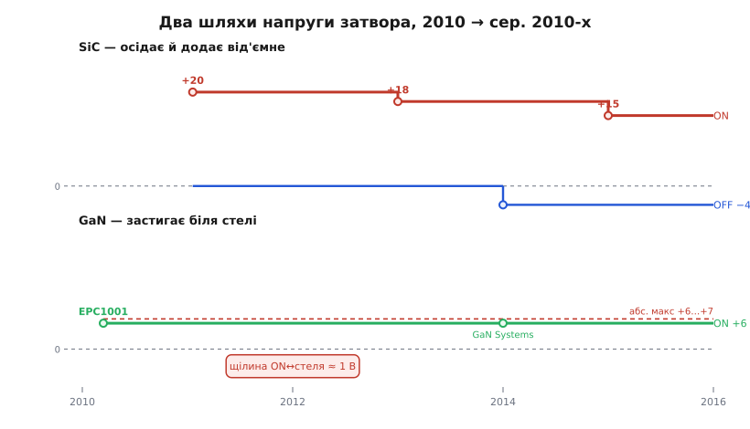

# 📜 Звідки взялися +15/−4 у SiC і чому GaN застряг на +6

> Числа, які сьогодні здаються природними в даташиті, колись були відкритим питанням. Коли перший комерційний карбід-кремнієвий ключ вийшов у продаж, ніхто ще не знав, скільки на нього подавати: у першому даташиті стояли поважні +20 В, за кілька років їх обережно опустили до +18, а сьогодні більшість родин просить рівно +15 і ще й вимагає під нуль на вимкнення. Нітрид галію тим часом пішов зовсім іншим шляхом — не «скільки дати», а «як не вбити», бо його затвор працює за півкроку від власної загибелі. Ця вставка — про те, як два матеріали, що вийшли на ринок майже одночасно, розійшлися у своїх напругах затвора настільки, що для кожного знадобився свій драйвер. І про те, що жодне з цих чисел не «вивели формулою» — їх виміряли, обпеклися й уточнили на реальних приладах.

Історія тут коротка за часом — усе вкладається в якийсь десяток років, від 2010-го до середини 2010-х, — але повчальна тим, як **фізичний факт кристала перетворюється на рядок «recommended Vgs» у документі**. За кожним числом стоїть або тонкий напружений оксид, або прямозміщений діод, і саме вони, а не забаганки інженерів, продиктували вікна.

*Дві доріжки за той самий десяток років. SiC (згори) починає з обережних +20 В у першому комерційному ключі Cree 2011 року, тоді сповзає до +18 заради ресурсу оксиду й осідає на +15 з від'ємним вимкненням близько −4 В — вікно широке, але зсунуте. GaN (знизу) з першого ж масового приладу EPC 2010 року стоїть на +5…+6 В, і його абсолютна стеля +6…+7 В лежить упритул — рухатися нема куди від самого початку.*

## Дві родини, що стартували майже одночасно

Варто почати з того, що SiC і GaN — не «старе й нове», як їх іноді подають. Обидва вийшли на масовий ринок практично в один час, на межі 2010–2011 років, і саме тому їхнє розходження таке промовисте: два матеріали з майже однаковою шириною забороненої зони (≈ 3.3 еВ у SiC, ≈ 3.4 еВ у GaN) отримали геть різні правила керування затвором — бо різнилася не ширина зони, а **будова самого затвора**.

У SiC затвор — класичний, ізольований оксидом, як у кремнієвого MOSFET; уся драма там навколо того, **скільки** на цей оксид можна подати. У GaN затвор — узагалі не оксидний, а напівпровідниковий p-GaN, і він поводиться як діод; там драма навколо того, що подати треба **мало й точно**. Обидві історії почалися з конкретних приладів конкретних компаній, тож із них і почнемо.

## SiC: перший ключ Cree і поважні +20 вольт

**18 січня 2011 року** компанія Cree (пізніше вона виділить силовий напрям у Wolfspeed) оголосила прилад **CMF20120D** — і назвала його «першим у галузі повністю кваліфікованим комерційним силовим SiC-MOSFET» *(the industry's first fully qualified commercial silicon carbide power MOSFET)*. Це 1200-вольтовий ключ з опором відкритого каналу близько 80 мОм при кімнатній температурі. Твердження про першість тут **усталене**: Cree справді першою довела SiC-MOSFET до серійного, кваліфікованого продукту, доступного через дистриб'юторів (зразки роздавала Digi-Key), тоді як доти SiC у силовій електроніці означав здебільшого діоди Шоткі, а не керовані ключі.

І ось перше число нашої історії: у даташиті того CMF20120D рекомендована напруга ввімкнення затвора — **+20 В**, а абсолютний максимум по затвору — від **−5 до +25 В**. Це вражає око кожного, хто звик до кремнію: там +10…+12 В повністю відкривають ключ, а тут просять удвічі більше. Чому?

Причина в тім, що в SiC **рухливість електронів у інверсійному каналі низька**, а сам канал псує густий шар пасток на межі SiC/SiO₂. Практичний наслідок: опір каналу спадає з напругою затвора мляво й довго не виходить на «полицю». Щоб Rds(on) впав до паспортного, а не завис на півтора-два рази вищому, ранньому SiC треба було гнати затвор високо — і +20 В якраз давали той запас, за якого канал гарантовано «насичувався» навіть у гіршому куті партії. Інженери Cree обрали +20 не тому, що це оптимум, а тому, що це **безпечний надлишок**: краще перевідкрити, ніж лишити ключ у напівпровідному стані, де він згорить від власних провідних втрат.

> 🔧 **Навіщо це.** Коли бачите в старому даташиті SiC поважні +20 В — це не помилка й не «на всяк випадок». Це слід епохи, коли канал ще погано насичувався й запас за напругою був єдиною гарантією паспортного опору. Сучасні родини цього вже не потребують — але правило «перевір рекомендовану Vgs у ЦЬОМУ даташиті, а не переноси з пам'яті» лишається залізним саме тому, що число рухалося.

## Чому +20 сповзли до +18, а тоді до +15

Далі почалося те, що робить цю історію повчальною: перше число виявилося **завеликим для довговічності**, і промисловість кілька років його опускала.

Проблема — у самому оксиді. Заборонена зона SiC широка, і це, хоч як парадоксально, **шкодить** підзатворному діелектрику. Що ширша зона напівпровідника, то менший розрив між його зоною провідності й зоною провідності оксиду (SiO₂ той самий, що й у кремнію). Менший бар'єр означає, що електронам легше **тунелювати** з SiC в оксид за механізмом Фаулера-Нордгейма *(Fowler-Nordheim tunneling)* під високим полем. А підзатворний оксид у SiC до того ж роблять тоншим і працює він за вищої напруженості поля, ніж у кремнію. Кожен затунельований електрон осідає пасткою в оксиді або на межі — і **зсуває поріг** приладу з часом. Це явище звуть нестабільністю порога під позитивним зміщенням *(positive bias temperature instability, PBTI)*, і в SiC воно виражене куди сильніше, ніж будь-коли турбувало кремній.

Звідси прямий висновок: кожен зайвий вольт на затворі понад необхідний **прямо скорочує ресурс оксиду**, прискорюючи і дрейф порога, і саму деградацію діелектрика. +20 В давали чудове насичення каналу, але платили за це полем на оксиді, якого не хотілося тримати десятиліттями.

Тому крок за кроком число опускали. Спершу з'явилася рекомендація **+18 В** — компроміс, за якого опір каналу майже не програє двадцяти вольтам (різниця Rds(on) між 18 і 20 В мізерна), зате поле на оксиді помітно менше й прилад стійкіший до сплесків. А з другим і третім поколінням приладів, коли навчилися робити канал, що насичується раніше, більшість SiC-родин осіла на **+15 В** — рівно стільки, щоб канал був повністю відкритий, і не більше, щоб не мучити оксид.

Це рідкісний в електроніці випадок, коли **рекомендоване число з часом падало**, а не зростало: зазвичай прилади стають кращими й дозволяють більше, тут же — навпаки, галузь свідомо забирала запас, щойно ставало ясно, що він коштує ресурсу. Статус цієї еволюції **усталений**: перехід +20 → +18 → +15 задокументований у нотатках застосування виробників SiC, і мотив скрізь той самий — оптимізувати опір проти довговічності оксиду.

## Другий зсув: чому SiC заганяють під нуль

Верхнє число розібрали; тепер нижнє — і воно теж вимушене, тільки з іншої причини.

Поріг Vgs(th) у SiC-MOSFET **низький**: типово десь у діапазоні 2–4 В, а нерідко ближче до нижнього краю. Сам по собі низький поріг не біда, але він стає бідою у півмості, де другий ключ жене на стоку нашого «закритого» SiC різкий стрибок напруги. Через ємність затвор-стік цей стрибок упорскує струм у затвор і наводить хибну напругу; якщо вона дотягнеться до порога — закритий ключ на мить прочиняється, і крізь пару ключів проскакує наскрізний струм. Механізм той самий, що й Міллерове хибне відмикання в кремнію, але тут поріг нижчий, а швидкості вищі, тож те, що кремній ігнорував, SiC відчуває.

Найпростіші ліки, які галузь виробила швидко, — вимикати не на нуль, а **під нуль**, типово на −2…−5 В *(від'ємне зміщення)*. Тоді, щоб хибно відкрити ключ, наведенню треба здолати не самий поріг, а поріг плюс усю глибину від'ємного зміщення — запасу, якого хибний імпульс уже не набирає. Так і склалося характерне асиметричне вікно SiC, яке ви читаєте в сучасних даташитах: **+15 зверху, приблизно −4 знизу**. Верхнє число прийшло від насичення каналу проти ресурсу оксиду; нижнє — від низького порога проти наведення. Жодне не «кругле для краси» — обидва є прямим наслідком двох фізичних чисел приладу.

> 🔧 **Навіщо це.** Асиметрія +15/−4 — не традиція, а два різні компроміси, склеєні в одне вікно. Якщо колись побачите SiC-родину з іншими числами (скажімо, +18/−3 у старших або +15/0 у тих, що терплять наведення) — це не суперечність, а той самий баланс, зважений під конкретний оксид і конкретний поріг. Читайте вікно як пару рішень, а не як один сакральний рядок.

## GaN: зовсім інша задача з самого початку

Тепер друга доріжка — і вона від першого дня не про «скільки дати».

Майже водночас із SiC на ринок вийшов нітрид галію, і привела його туди компанія з промовистою родовідною. **Efficient Power Conversion (EPC)** заснував 2007 року **Алекс Лідов** *(Alex Lidow)* — той самий інженер, що замолоду в Стенфорді співавторив [шестикутну коміркову структуру силового MOSFET (HEXFET)](root:hw-components/rds-on/hist-hexfet.md) і згодом очолював International Rectifier. Тобто GaN у силову електроніку привів не випадковий гравець, а людина, яка вже одного разу зробила силовий транзистор масовим. У **березні 2010 року** EPC випустила **EPC1001** — 100-вольтовий прилад, який компанія подала як перший серійний комерційний нормально-закритий (збагачений, e-mode) GaN-транзистор, призначений заміняти силовий MOSFET там, де критична швидкість чи ККД. Перші зразки компанія показувала ще влітку 2009-го, серійний продукт — 2010-го; статус першості тут **правдоподібний і загалом визнаний**, хоча, як завжди в напівпровідниках, «перший» залежить від того, що рахувати серійним і що — дослідним.

І з першого ж даташита видно, що GaN — інша порода. Візьмімо ранній прилад EPC того ж покоління, **EPC2010** (200 В): усі його характеристики виміряні при напрузі затвора **+5 В**, поріг Vgs(th) типово **1.4 В**, а абсолютний максимум по затвору — усього **+6 В** (і −5 В у зворотний бік). Порівняйте з SiC, де абсолютний максимум сягав +25: тут стеля стоїть на +6, а працюють на +5. Між робочою точкою й загибеллю — **один вольт**.

## Затвор GaN — це діод, і ось де ховається його +6

Щоб зрозуміти, звідки береться це задушливе вікно, треба подивитися, що взагалі таке затвор у e-mode GaN. Це не оксид. У найпоширенішому промисловому виконанні над каналом ставлять шар **p-GaN**, і між цим p-шаром та рештою структури утворюється **p-n-перехід** — по суті діод. Поки напруга на затворі мала, діод закритий і струму майже не бере, як і належить. Але щойно напруга перевищить поріг, діод **відмикається у прямому напрямі**, і крізь затвор починає текти сталий струм.

Ось і розгадка числа +6. У даташиті того ж EPC2010 видно, що вже при +5 В крізь затвор тече відчутний струм витоку — близько міліампера, а далі він росте стрімко. Виробники прямо пояснюють: напругу на затворі обмежують приблизно шістьма вольтами саме для того, щоб **не гнати надмірний струм крізь p-n-перехід** між p-GaN-затвором і бар'єрним шаром. Тобто +6 В — це не «де пробивається оксид» (оксиду тут нема), а **де прямий струм діода стає завеликим** і починає і гріти, і руйнувати затвор. Стеля GaN — не про пробій ізолятора, а про перевантаження діода.

Звідси й фундаментальна різниця в тому, як драйвер працює з GaN. Кремнієвий чи SiC-затвор досить **зарядити** до потрібної напруги й відпустити — далі він тримається сам, бо ізольований. GaN-затвор тримати струмом доводиться постійно, поки ключ відкритий, — його не «заряджаєш», його **живиш**. Тому кращі GaN-драйвери працюють як джерело струму: сильний імпульс, щоб швидко відкрити, і менший утримувальний струм далі. А вікно +5…+6 В стоїть так близько до стелі не через незрілість технології — це прямо там, де діод затвора переходить від «тримається малим струмом» до «горить від великого».

> 🔧 **Навіщо це.** Число +6 В у GaN і число +15 В у SiC — принципово різної природи, і плутати їх не можна. +15 у SiC — це «скільки треба, щоб відкрити канал», з запасом до стелі. +6 у GaN — це майже сама стеля, продиктована струмом крізь діод затвора. Тому кремнієва звичка «дам трохи більше про запас» у GaN означає не запас, а перевантаження затвора. У GaN «більше» — завжди в бік смерті.

## Чому GaN так і не отримав запасу згори

Лишається пояснити, чому за роки це вікно так і не розширилося, тоді як SiC своє впорядкував.

SiC мав куди рухатися: верхнє число можна було опустити (і опустили), нижнє — завести під нуль (і завели), бо оксид витримує і +25, і −10, простір для маневру був. GaN такого простору не має за **самою фізикою p-n-затвора**: щойно піднімеш напругу — росте прямий струм діода, гріється й деградує затвор; це не інженерний недогляд, який виправлять новим поколінням, а властивість самої структури. Тому й наступні виробники, приходячи на ринок, приходили в те саме вузьке вікно.

Показовий приклад — канадська **GaN Systems** (заснована 2008 року в Оттаві; свою фірмову «острівну» топологію кристала вона вивела в серійні нормально-закриті прилади близько середини 2014 року). Її 650-вольтові ключі з тим самим p-GaN-затвором рекомендують ті самі **6 В** на ввімкнення (можна й 6.5), поріг у них 1.1–2.6 В, а абсолютний максимум по затвору — **+7 В**. Тобто інша компанія, інша топологія кристала, інший континент — а вікно те саме, бо його диктує не фірма, а діод. Понад те, GaN Systems прямо зазначає цікаву деталь: від'ємне зміщення на вимкнення її приладам **не потрібне** для самого закриття (на відміну від SiC), але його все одно радять тримати помірним (близько −3 В) — саме тому, що з боку стелі +7 В запасу катма, і будь-яке перерегулювання небезпечне.

Ось чому дві доріжки на нашій стрічці часу так і не зійшлися. SiC за десяток років свої числа **впорядкував** — знайшов оптимум +15 і додав захисне −4. GaN свої числа **не рухав** — не тому, що не хотів, а тому, що p-n-затвор від самого EPC1001 2010 року стоїть на межі, і зрушити цю межу вгору не дає фізика діода. Один матеріал шукав баланс у широкому полі; другий від народження працює в щілині.

## Що з цього забрати

Три відлуння цієї короткої історії стають у пригоді щоразу, коли берете WBG-ключ до рук.

**Перше:** числа вікна затвора — не константи природи, а **зафіксовані компроміси конкретного приладу**, і в SiC вони навіть рухалися з часом. Тому «recommended Vgs» читають у даташиті саме цього приладу, а не переносять з пам'яті чи з сусідньої родини. +20 старшого SiC і +15 сучасного — обидва правильні, кожен для свого оксиду.

**Друге:** верхня межа SiC і верхня межа GaN — **різної природи**. У SiC над робочою точкою є простір до пробою оксиду, і зайвий вольт лише скорочує ресурс. У GaN над робочою точкою простору майже нема, бо там не пробій ізолятора, а перевантаження діода затвора; тут зайвий вольт — це смерть. Одна й та сама фраза «трохи більше про запас» у двох матеріалів має протилежну ціну.

**Третє, найзагальніше:** ці числа ніхто не вивів з рівняння наперед — їх **виміряли на реальних приладах і уточнювали, обпікаючись**. +20 виявилися завеликими для оксиду, і їх опустили; +6 виявилися стелею діода, і вище не пішли; від'ємне зміщення додали, коли наведення почало відкривати ключі. За кожним акуратним рядком у сучасному даташиті стоїть кілька років, коли галузь на власних згорілих зразках з'ясовувала, де саме проходить межа. Це типова доля силового приладу: спершу продукт, потім — виміряна на ньому мудрість.
