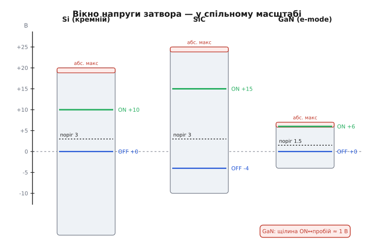
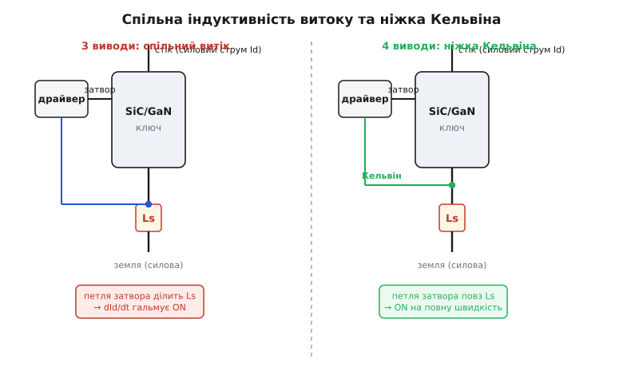

# Керування затвором SiC і GaN

<preknowlist>
- [Драйвер затвора](topic:hw-power/gate-driver) — навіщо затвору потрібен окремий підсилювач струму, двотактний вихід, бутстреп, Міллерове хибне відмикання.
- [Затвор як ємність](topic:hw-components/gate-capacitance) — заряд Qg, час перемикання ≈ Qg / струм, плато Міллера, втрати на перемикання.
- [MOSFET як ключ](topic:hw-components/mosfet-power-switch) — Vgs(th), напруга повного відкриття, резистор затвора.
- [Втрати перемикання](topic:hw-components/switching-losses) — чому перехід гріє й чому його скорочують.
</preknowlist>

Кремнієвий силовий MOSFET прощає багато. Дай йому на затвор +10 В — відкриється; +12 В — теж; забув від'ємне живлення на вимкнення — переживе. Затвор витримує ±20 В, а поріг у нього комфортні 2–4 В, тож між «закрито» й «відкрито» лежить широка мирна долина, де майже будь-який драйвер спрацює. Прилади з **широкою забороненою зоною** *(wide bandgap, WBG)* — карбід кремнію (SiC) і нітрид галію (GaN) — цю розкіш забирають. Вони перемикають у рази швидше й тримають вищу напругу на меншому кристалі, але за це вимагають керувати затвором **прицільно**: у SiC — інші, асиметричні напруги; у GaN — вузьке, майже без запасу, вікно, де кілька зайвих вольт означають миттєву смерть. Драйвер, що чудово водив кремній, тут або недовідкриває ключ, або пробиває його, або пропускає наскрізний струм від власної швидкості.

Розберемо, **чому** саме ці два матеріали ламають звичні правила затвора й що конкретно з цим робити — які напруги подавати, як боротися з наведенням від скажених dV/dt і навіщо з'являється зайва ніжка на корпусі.

## Чому WBG узагалі інші

Уся відмінність тягнеться від одного матеріального факту. Ширша заборонена зона (у SiC ≈ 3.3 еВ, у GaN ≈ 3.4 еВ проти 1.1 еВ у кремнію) — це міцніший «діелектричний бар'єр» усередині кристала: матеріал витримує в рази вищу напруженість поля, перш ніж настане лавинний пробій. Практичний наслідок — той самий блокуючий напругою шар можна зробити **тоншим і сильніше легованим**, а отже з меншим опором. Тому WBG-ключ на ту саму напругу має набагато менший [питомий опір каналу Ron·A](topic:hw-components/specific-on-resistance-metric) — тонший дрейфовий шар несе ту саму напругу.

Менший кристал на ту саму напругу — це менші паразитні ємності, зокрема ємність затвір-стік Cgd. Менші ємності означають менший заряд Qg і здатність перемикати **дуже** швидко: фронти напруги на стоці не в кілька В/нс, як у кремнію, а десятки, а в GaN і за сотню В/нс. Саме ця скажена швидкість — і головна перевага (мізерні втрати на перемикання, тож можна підняти частоту й зменшити котушки та конденсатори), і головний клопіт керування затвором. Усе інше в цій статті — наслідки двох речей: **інші напруги відкриття** й **дуже високі dV/dt**.

> 🔧 **Навіщо це.** Не переносьте кремнієві звички на WBG «за аналогією». Той факт, що прилад менший і швидший, автоматично означає: вужчі допуски на напругу затвора й сильніше наведення від dV/dt. Перше питання при заміні Si-ключа на SiC чи GaN — не «чи підійде за струмом», а «чи вміє мій драйвер дати правильну напругу затвора й приборкати наведення».

## SiC: та сама ідея, але напруги зсунуто

SiC-MOSFET улаштований як звичайний кремнієвий: є ізольований затвор, поріг, канал. Але два числа зсунуто, і обидва зсуви примусові.

**Відкривати треба сильніше.** У SiC рухливість електронів у каналі нижча, а спад опору з напругою затвора повільніший, ніж у кремнію. Щоб канал відкрився **по-справжньому** (щоб Rds(on) впав до паспортного, а не завис на вдвічі більшому), потрібно не +10 В, а помітно більше. Промисловість перепробувала +20 В, згодом +18 В, і врешті більшість сучасних SiC-приладів націлені на **+15 В** — рівно стільки, щоб канал був повністю відкритий, але без надмірного поля на підзатворному оксиді (оксид у SiC тонший і напруженіший, тож надлишок напруги напряму скорочує ресурс). Подаси замало (скажімо, кремнієві +10 В) — ключ проведе струм, але з завищеним опором, і згорить від провідних втрат там, де кремній був би холодний.

> 🔧 **Навіщо це.** Найпоширеніша помилка при першому SiC — годувати затвор кремнієвими +10…+12 В. Ключ «начебто працює», а гріється вдвічі проти очікуваного, бо канал недовідкритий. Перевірте в даташиті рекомендовану Vgs(on) (типово +15 В для сучасних, +18…+20 В для старших родин) і дайте саме її — це не запас надійності, а умова паспортного Rds(on).

**Закривати треба нижче нуля.** Поріг Vgs(th) у SiC низький — усього ≈ 2–4 В, а часто ближче до нижнього краю. Це небезпечно у півмості: коли парний ключ вмикається й жене на стоку нашого «закритого» SiC різкий dV/dt, ємність Cgd впорскує в затвор струм, що наводить хибну напругу. Механізм той самий, що і в кремнію (Міллерове хибне відмикання), але тут поріг нижчий, а dV/dt вищий — тож наведення легко дотягується до порога. Ліки — тримати затвор на вимкненні **нижче нуля**: типово −2…−5 В *(від'ємне зміщення, negative bias)*. Тоді, щоб хибно відкрити ключ, наведенню треба подолати не 3 В, а всі 3 + 4 = 7 В — запас, якого хибний імпульс не набирає. Звідси характерне асиметричне вікно SiC: **+15 / −4 В** (числа за родиною).


*Три однакові за шириною смуги — напруга затвора для Si, SiC і GaN у тому самому масштабі. Кремній: поріг ~3 В, відкриття ~+10 В, стеля пробою ±20 В — величезний запас з обох боків. SiC: відкриття зсунуте вгору до +15 В, вимкнення опущене під нуль до −4 В проти хибного відмикання, стеля ~+25/−10 В. GaN: усе стиснуто — поріг ~1.5 В, відкриття +5…+6 В стоїть майже впритул до абсолютної стелі ~+7 В, запасу згори майже нема.*

Асиметрія «+15 зверху, −4 знизу» — це не примха, а прямий висновок з двох чисел приладу: висока напруга повного відкриття тягне верхню межу вгору, низький поріг тягне нижню під нуль. Драйвер SiC тому майже завжди робить **два різні живлення затвора** — позитивне й негативне — замість одного, як у простих кремнієвих схем. Як народжується це негативне живлення (окрема шина, стабілітрон-фіксатор чи заряд-помпа) — розписано у [від'ємному живленні затвора](topic:hw-power/negative-gate-supply).

## GaN: вікно, у якому нема куди відступати

GaN-транзистор іншої породи. Це не MOSFET з ізольованим затвором, а **HEMT** *(high-electron-mobility transistor — транзистор із високою рухливістю електронів)*: струм несе тонкий шар електронного газу на межі GaN/AlGaN. У найпоширенішому промисловому виконанні (**e-mode**, збагачений, нормально закритий) над каналом ставлять шар p-GaN, який без напруги на затворі «перекриває» електронний газ — прилад закритий, поки затвор не піднімуть. І саме цей p-GaN-затвор задає всю драму керування.

**Затвор — це діод, а не конденсатор.** У кремнієвому чи SiC-MOSFET затвор ізольований оксидом: у сталому відкритому стані струму він не бере. У p-GaN затвор — це фактично прямозміщений діод: щойно напруга перевищує поріг, крізь нього тече **сталий струм**. Тобто GaN-затвор треба не просто зарядити до напруги й відпустити — його треба **тримати струмом**, поки ключ відкритий. Драйвери під GaN тому часто працюють як джерело струму з обмеженням: сильний імпульс, щоб швидко відкрити, і менший утримувальний струм далі. Простий «подай напругу крізь резистор» тут теж працює, але резистор доводиться рахувати під струм затвора, а не лише під швидкість фронту.

**Стеля пробою впритул до робочої точки.** Ось головне число GaN: рекомендована напруга відкриття — усього близько **+5…+6 В**, а абсолютний максимум затвора — теж близько **+6…+7 В**. Між «нормально відкрито» й «затвор пробито» лежить не долина, а **щілина в один-два вольти**. Поріг при цьому низький, ≈ 1.5 В. Порівняйте з кремнієм, де стеля ±20 В стоїть за десяток вольт від робочих +10 В: там перерегулювання Vgs на кілька вольт — дрібниця, тут — смерть приладу. А перерегулювання виникає легко: індуктивність петлі затвора з ємністю затвора утворює коливальний контур, і при швидкому фронті напруга на затворі «дзвенить» вище поданої.

Звідси залізне правило GaN: **петля затвора мусить бути гранично короткою й малоіндуктивною**, а часто в неї ще й ставлять фіксатор (клемп), що не пускає Vgs вище безпечного. Довга доріжка затвора, яка в кремнію лише сповільнила б перемикання, у GaN дзвоном пробиває затвор — і ключ гине тихо, без явної причини «на око».

> 🔧 **Навіщо це.** У GaN немає слова «запас згори». Проектуючи, рахуйте найгірше перерегулювання: індуктивність петлі затвора Lg із зарядним струмом дає викид ΔV ≈ Lg·(dІ/dt), і сума робочих +6 В та цього викиду не сміє дійти до абсолютного максимуму. На практиці це означає: драйвер **у корпусі поруч** із ключем (а часто інтегрований із ним у один модуль), найкоротша можлива петля й, за потреби, зовнішній клемп на затворі. Це не «для надійності» — це різниця між робочим ключем і купою мертвих.

**Реверсна провідність без діода тіла.** У кремнієвому MOSFET є вбудований діод тіла, що проводить зворотний струм у мертвий час півмоста. У латерального GaN p-n-переходу тіла **немає** — і це добре (немає повільного відновлення діода, тобто немає його втрат). Але зворотний струм GaN усе одно проводить: коли на стік подано напругу нижчу за витік, канал самозміщується й відкривається «з іншого боку». Платня за це — **висока напруга зворотної провідності**, близько 2.5–3 В (проти ~0.7 В у кремнієвого діода тіла). Ця напруга множиться на струм і на **час мертвого паузи** — тож у GaN зайвий [мертвий час](topic:hw-power/dead-time-sizing) коштує дорого, і його тиснуть до мінімуму. Кремнієва звичка «постав мертвий час із запасом, діод тіла перекриє» у GaN обертається відчутними втратами й нагрівом саме в цій паузі.

## Спільний ворог обох: наведення через dV/dt

Найковарніша спільна риса SiC і GaN — не напруги, а **швидкість**. Високий dV/dt на стоці, який і дає малі втрати, водночас упорскує струм у затвор сусіда через ємність Cgd. У півмості це працює так: коли нижній ключ різко вмикається, вузол посередині (стік верхнього) валиться вниз із величезним dV/dt; цей стрибок крізь Cgd верхнього ключа тече в його затвор і наводить там хибну напругу. Механізм — той самий Міллер, що й у кремнію, лише dV/dt тут у рази вищий, а пороги нижчі, тож те, що кремній ігнорував, WBG-ключ відчуває болісно. Це явище звуть **перехресним наведенням** *(crosstalk)* між плечима.

Порахуємо, щоб відчути масштаб.

**Числовий приклад: наведена Vgs у півмості на SiC.**
Півміст 800 В, SiC-ключ із Cgd (Crss) ≈ 30 пФ і Vgs(th) = 2.5 В. Нижнє плече вмикається так, що на стоці верхнього dV/dt = 50 В/нс. Затвор верхнього стягнуто донизу через сумарний опір (внутрішній вихід драйвера + зовнішній Rg,off) = 3 Ω. Порахуємо наведену напругу для двох випадків: вимкнення на 0 В і вимкнення на −4 В.

```
I(наведення) = Cgd · dV/dt
             = 30e-12 · 50e9        = 1.5 А
Vgs(хибна)   = I · R
             = 1.5 · 3              = 4.5 В
```

Тепер порівняємо з порогом:

```
вимкнення на 0 В:   затвор злітає до  0 + 4.5 = +4.5 В  >  2.5 В  → хибно відкриється
вимкнення на −4 В:  затвор злітає до −4 + 4.5 = +0.5 В  <  2.5 В  → запас 2 В, тримається
```

Ось точна, числова причина від'ємного живлення в SiC: наведення в 4.5 В саме собою перевищує поріг, і лише зсув стартової точки під нуль лишає ключ закритим. Ту саму боротьбу з боку швидкості й опору розписано в математичній вставці [запас проти наведення при високому dV/dt](topic:hw-power/sic-gan-gate-drive/math-crosstalk-margin.md).

Звідси три важелі проти перехресного наведення, і всі три застосовують разом:

- **Від'ємне вимкнення** (SiC) — опустити стартову точку затвора, щоб наведення не дотяглося до порога. У GaN від'ємного вікна майже нема, тож там натомість тиснуть на решту.
- **Малий опір стягання й окремий швидкий шлях вимкнення** — щоб наведений струм тік у затвор по найменшому опору й давав меншу хибну напругу (Vgs = I·R). Часто ставлять окремий, дуже низькоомний вивід «сильного стягання».
- **Мінімальна індуктивність петлі затвора** — щоб наведення не «дзвеніло» й щоб драйвер міцно тримав затвор на місці.

Помітно, що це загострена версія тих самих прийомів, що й у кремнієвому [драйвері](topic:hw-power/gate-driver): різні Rg на ввімкнення й вимкнення, коротка петля, сильне стягання. WBG лише піднімає ставки настільки, що недбалість, пробачна кремнію, тут фатальна.

## Паразитна індуктивність витоку — і навіщо ніжка Кельвіна

Є ще одна пастка, яку швидкість WBG робить критичною: **спільна індуктивність витоку** *(common source inductance)*. Витік силового ключа має паразитну індуктивність — виводи корпусу, зварні дротики, доріжки. Біда в тому, що ця індуктивність лежить **одночасно** у двох петлях: у силовій (нею тече весь струм стоку) і в петлі затвора (драйвер повертає струм затвора через той самий вивід витоку).

Тепер простежмо ланцюжок. Під час увімкнення струм стоку Id стрімко наростає — а при швидкості WBG це dId/dt у тисячі ампер за мікросекунду. На спільній індуктивності Ls цей наростаючий струм наводить напругу Vls = Ls·(dId/dt), і полярність її така, що вона **віднімається** від напруги, яку драйвер прикладає до затвора. Драйвер жене +15 В, а канал «бачить» менше — бо частина осіла на індуктивності витоку, збуреній власним струмом ключа. Виходить від'ємний зворотний зв'язок: чим швидше росте струм, тим сильніше просідає ефективна Vgs, тим повільніше відкривається ключ. Швидкість, заради якої брали WBG, з'їдає сама себе, і втрати на перемикання ростуть.


*Ліворуч: звичайний трививідний корпус — струм затвора від драйвера й силовий струм стоку повертаються через один і той самий вивід витоку, спільна індуктивність Ls наводить напругу від dId/dt і гальмує перемикання. Праворуч: чотирививідний корпус — окрема ніжка Кельвіна веде повернення затвора прямо до кристала витоку, повз силову індуктивність; тепер струм стоку вже не наводить напругу в петлі затвора, і ключ перемикається на повну швидкість.*

Ліки — **чотирививідний корпус із ніжкою Кельвіна** *(Kelvin source)*: окремий, малострумовий вивід, приєднаний прямо до кристала витоку, служить **тільки** для повернення струму затвора. Тоді петля затвора більше не ділить індуктивність із силовим струмом: dId/dt тече своєю силовою петлею й у затворі напруги не наводить. Ефект величезний саме через швидкість WBG: у типовому вимірі той самий SiC-прилад у трививідному корпусі (TO-247-3) розсіює на перемиканні близько 430 мкДж, а в чотирививідному з ніжкою Кельвіна (TO-247-4) — лише близько 150 мкДж на тому самому струмі. Утричі менше втрат — з однієї зайвої ніжки, що просто розв'язала дві петлі.

> 🔧 **Навіщо це.** Бачите на WBG-ключі чотири виводи замість трьох — це не помилка й не «сигнальний витік для струмоміру». Четверта ніжка (Kelvin/driver source) — це окремий вихід затворної петлі, і драйвер треба заводити **саме на неї**, а силовий струм — на товстий силовий витік. Переплутаєте (заведете обидва на силовий вивід) — втратите половину переваги WBG у втратах, і ключ грітиметься без видимої причини. Ведіть петлю затвора «драйвер → затвор → ніжка Кельвіна» окремо й коротко.

## Як це збирається докупи

Зведімо все в одну картину керування WBG-затвором, від приладу до драйвера.

Спершу подивіться, що за прилад. **SiC-MOSFET**: дайте асиметричне вікно — приблизно **+15 В** на відкриття (перевірте даташит; старші родини хочуть +18…+20 В) і **−2…−5 В** на вимкнення проти перехресного наведення; закладіть два живлення затвора. **GaN e-mode**: дайте вузьке позитивне вікно — приблизно **+5…+6 В**, ніколи не наближаючись до абсолютного максимуму; пам'ятайте, що затвор бере сталий струм (керуйте струмом, не лише напругою), і що зайвий мертвий час коштує дорого через високу напругу зворотної провідності.

Тоді — незалежно від матеріалу — приборкайте швидкість. Порахуйте наведення Cgd·dV/dt·R проти порога й переконайтеся, що маєте запас (від'ємним зміщенням у SiC, малим опором стягання й короткою петлею — усюди). Заведіть драйвер на **ніжку Кельвіна**, якщо корпус чотирививідний. Тримайте петлю затвора гранично короткою — у GaN це питання життя ключа, у SiC — питання швидкості й тиші в ефірі. І поставте драйвер **фізично поруч** із ключем, а для найшвидших GaN — беріть інтегрований силовий каскад, де драйвер і ключ в одному кристалі, бо будь-яка зовнішня індуктивність петлі вже завелика.

Різниця між керуванням кремнієм і WBG — це різниця між водінням містом і трасою: правила ті самі, але на швидкості будь-яка неточність, дрібна в місті, стає фатальною. Широка заборонена зона дала менший, швидший, холодніший ключ — а натомість забрала запас, який ховав недбалість керування затвором. Матеріальна історія, звідки взялися саме ці числа вікон — чому SiC осів на +15/−4, а GaN застряг на межі +6 В — коротко викладена у [нарисі про появу WBG-керування](topic:hw-power/sic-gan-gate-drive/hist-wbg-gate-drive.md).

> 🔧 **Навіщо це.** Практичний висновок на одну фразу: WBG вимагає **правильної напруги** (асиметрична в SiC, вузька в GaN) і **приборкання швидкості** (від'ємне зміщення, коротка петля, ніжка Кельвіна, драйвер поруч). Дасте перше, забудете друге — ключ згорить від наведення чи наскрізного струму. Дасте друге, забудете перше — недовідкриється й згорить від нагріву. Обидві половини обов'язкові, і саме тому «звичайний» кремнієвий драйвер під SiC чи GaN здебільшого не годиться.
