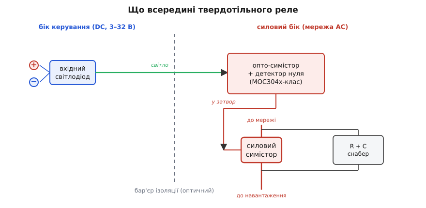

# 🔌 Твердотільне реле (SSR) і його чутливість до dv/dt

Тверде реле виглядає як проста заміна механічному: на вхід подав кілька вольт логіки — навантаження ввімкнулося, без клацання й без зношуваних контактів. Та всередині нього живе той самий [симістор](root:hw-components/triac), і з ним у спадок переходить його тонка хвороба — **самовмикання від різкого стрибка напруги**. Тому твердотільне реле на індуктивному навантаженні поводиться так само непокірно, як голий симістор: то «прилипає» й не вимикається, то спрацьовує невпопад. Розберемо клас цього пристрою, де саме в ньому ховається чутливість до dv/dt, чому в даташиті аж дві різні цифри dv/dt і коли потрібен снабер — внутрішній чи зовнішній.

### Клас пристрою: оптично розв'язаний напівпровідниковий ключ

**Твердотільне реле** (*solid-state relay*, SSR) — це ключ, що комутує силове коло **без рухомих частин**, керований слабким сигналом через **гальванічну розв'язку**. Усередині нього три яруси, і їх корисно бачити окремо, бо чутливість до dv/dt сидить лише в одному.


*Внутрішня будова AC-SSR. Логічний бік (синій) — лише світлодіод; силовий бік (червоний) — опто-симістор із детектором нуля, що керує силовим симістором. Саме силовий симістор латчиться, тож саме він чутливий до dv/dt; кращі SSR містять внутрішній RC-снабер просто паралельно йому.*

Перший ярус — **вхідний світлодіод**: подаєте на нього 3–32 В логіки (типовий діапазон керування), він світить. Другий — **опто-драйвер**: маленький фоточутливий симістор, що ловить це світло й видає слабкий запальний імпульс. Саме тут стоїть **бар'єр ізоляції** — світло перетинає його, а мідь ні, тож логіка ніде не з'єднана з мережею (звична властивість будь-якої [оптопари](root:hw-components/optocoupler)). Третій ярус — **силовий симістор** (для змінного струму) або кілька MOSFET (для постійного): саме він пропускає крізь себе струм навантаження.

Важлива деталь, на якій тримається весь дальший розбір: **латчиться, а отже й самовмикається від dv/dt, лише силовий ярус** — симістор. Світлодіод і опто-драйвер тут ні до чого; проблема стрибка напруги живе на виході, прямо там, де SSR під'єднано до мережі й навантаження.

> 🔧 **Навіщо це.** Коли SSR на двигуні чи клапані «прилипає» й не вимикається, новачок гадає, що згоріла мікросхема або глючить керування, і марно перевіряє логічний бік. Знаючи будову, інженер одразу дивиться на силовий ярус: це симістор, він самозапускається від dv/dt при вимиканні індуктивності — лікують це снабером, а не заміною реле.

### Чому SSR успадковує самовмикання від dv/dt

Механізм точно такий самий, як у голого симістора, і докладно розібраний у темі [снабери й dv/dt](root:hw-power/snubbers-dvdt): у силовому кристалі є паразитна [ємність](root:ph-electromagnetism/capacitance), і крізь неї тече струм, пропорційний швидкості зміни напруги:

```
i = C · dv/dt
```

Якщо до щойно закритого симістора напруга прикладається надто різко, цей ємнісний струм потрапляє в затвор і **вмикає прилад без жодної команди**. На індуктивному навантаженні (двигун, трансформатор, котушка клапана) [струм відстає від напруги](root:hw-components/phase-shift), тож у мить, коли струм падає до нуля й симістор гасне, напруга мережі **вже відійшла від нуля** — і одразу б'є по закритому ключу різким стрибком. Звідси проста, але неочевидна закономірність: **SSR норовить самовмикатися саме на індуктивному навантаженні й саме в момент, коли мав би вимикатися**.

Тут і ховається перша пастка твердотільного реле: ззовні воно подане як «бездоганна заміна механічному», а насправді на індуктивності потребує тих самих запобіжників, що й симістор. Те, що ключ запаяний у акуратний корпус із гвинтовими клемами, нічого не міняє у фізиці кристала всередині.

### Дві цифри dv/dt у даташиті: статична і комутаційна

У даташиті SSR (чи силового симістора) ви знайдете **не одну, а дві** характеристики dv/dt — і плутати їх не можна, бо саме менша з них зазвичай і визначає долю схеми.

- **Статична dv/dt** (*static / off-state dv/dt*) — наскільки швидкий стрибок витримає **повністю закритий, «холодний»** прилад, не ввімкнувшись. Тут цифри великі: типово близько **100 В/мкс**.
- **Комутаційна dv/dt** (*commutating dv/dt*) — те саме, але в **набагато гірший момент**: одразу по тому, як струм щойно проходив крізь прилад і впав до нуля. Кристал ще «теплий» від щойно протеклого струму — носії заряду не встигли розсмоктатися, і прилад вмикається від куди слабшого стрибка. Типове значення тут — лише **близько 4 В/мкс**, у десятки разів менше за статичну.

Підступність у тому, що при вимиканні **індуктивного** навантаження стрибок dv/dt прикладається саме в цю мить — одразу після проходження струму через нуль. Тобто прилад зустрічає його **найслабшою** своєю стороною: працює не статична межа 100 В/мкс, а комутаційна ~4 В/мкс. Тому SSR, що чудово тримає резистивне навантаження, на індуктивному з тим самим струмом раптом починає самовмикатися: навантаження поміняло не струм, а **момент і крутість** стрибка напруги.

> 🔧 **Навіщо це.** Якщо взяти з даташита велику цифру (100 В/мкс) і вирішити «мій стрибок менший, снабер не потрібен» — це класична помилка. На індуктивності працює комутаційна межа в десятки разів нижча. Правило просте: для індуктивного навантаження орієнтуйтеся на **комутаційну** dv/dt і ставте снабер; для чисто резистивного часто вистачає й статичної межі без снабера.

### Зеро-крос комутація: чому вона є й чому індуктивності не любить

Багато SSR — **зеро-крос** (*zero-cross switching*): отримавши команду, такий ключ вмикається не одразу, а чекає найближчого [переходу мережі через нуль](root:hw-power/zero-cross-switching) і відмикається саме там, де напруга мала. Це дуже добре для резистивних і теплових навантажень: вмикання в нулі напруги означає **мінімальний кидок струму** й мало електромагнітних завад — нагрівач чи лампа не «бахкають» стартовим струмом.

Але та сама зеро-крос-логіка кепсько лягає на **індуктивне** навантаження. У котушки струм і напруга зсунуті, тож «нуль напруги», у який радо вмикається зеро-крос-ключ, — це зовсім не нуль струму; вмикання в такій точці саме й породжує перехідний кидок. Тому для індуктивних навантажень (а надто для фазового регулювання — димери, регулятори потужності) беруть **довільного вмикання** (*random-fire*, без зеро-кросу): такий SSR відмикається тоді, коли треба керуванню, а не тоді, коли напруга в нулі. Правило вибору просте: **зеро-крос — для резистивних/теплових; random-fire — для фазового керування й важких індуктивних**. Обидва типи, проте, однаково потребують снабера на індуктивності — зеро-крос від dv/dt-самовмикання не рятує, бо стрибок виникає при **вимиканні**, а не при вмиканні.

### Внутрішній і зовнішній RC-снабер

Захист той самий, що й для голого симістора, — **RC-снабер**: послідовні резистор і конденсатор, увімкнені **паралельно силовому ключу**. Конденсатор не дає [напрузі на ключі стрибнути миттєво](root:hw-analog/rc-time-constant) (вона тепер наростає плавно, поки заряджається C), тобто збиває dv/dt нижче небезпечної межі; резистор обмежує кидок струму, коли заряджений конденсатор розряджається крізь ключ при наступному вмиканні. Чому потрібні **обидві** деталі, як вони ділять роботу і як це дзеркалить захист механічних контактів — докладно в [RC-снабері біля контактів](root:hw-components/inductor-kickback/comp-rc-snubber.md).

Багато якісних SSR несуть **внутрішній снабер** — ту саму пару R+C, уже впаяну паралельно силовому симістору (на схемі будови вона праворуч від ключа). Це зручно: для багатьох індуктивних навантажень зовнішній снабер тоді не потрібен. Та внутрішній снабер розрахований на **типовий** випадок; за сильної індуктивності чи великого струму його може не вистачати, і тоді **зовнішній** RC-снабер додають прямо на силові клеми реле. Бувають і SSR **без** внутрішнього снабера (дешевші чи «snubberless»-симістори з підвищеною стійкістю) — для них на індуктивності зовнішній снабер тим паче доречний.

Де ставити зовнішній снабер — те саме залізне правило, що й завжди: **прямо на силові клеми SSR**, короткими провідниками. Винесений на довгих доріжках снабер втрачає силу — їхня [паразитна індуктивність](root:ph-electromagnetism/inductance) пропустить стрибок «вистрелити» на самому ключі, перш ніж він дійде до віддаленого конденсатора.

> 🧮 Як перерахувати струм навантаження й паспортне dv/dt на конкретні R та C — три формули «на серветці»: [оцінка RC-снабера](root:hw-power/snubbers-dvdt/math-snubber-calc.md).

### Чим SSR відрізняється від механічного реле

Спокусливо вважати SSR прямим покращенням [електромеханічного реле](root:hw-motion/relay-driver), та обмін не безкоштовний — у кожного свій набір сильних і слабких сторін.

- **Контакти проти кристала.** У механічного реле — металеві контакти, що зношуються й іскрять, зате в розімкненому стані дають **справжній розрив** з мізерним витоком. У SSR рухомих частин немає (мільйони циклів, безшумно, швидко), але закритий симістор **завжди трохи протікає** — одиниці міліампер. Через це слабке навантаження за вимкненим SSR може ледь жевріти.
- **dv/dt-самовмикання — біда суто SSR.** Механічний контакт стрибком напруги не «ввімкнеться сам»; він страждає від [іскри на розмиканні](root:hw-components/inductor-kickback). SSR навпаки: іскрити нема чому, зате від dv/dt він самозапускається. Снабер потрібен обом, але **проти різних бід**: у механічного — проти іскри, у SSR — проти хибного вмикання.
- **Тепло.** Сухий контакт у замкненому стані майже не гріється (опір — міліоми). А симістор SSR має падіння **близько 1.2–1.6 В завжди, доки веде струм**, і це падіння перетворюється на тепло. Звідси головна інженерна турбота біля SSR — відведення тепла.

### Тепло: чому SSR живе на радіаторі

Це найчастіша причина передчасної смерті твердотільного реле, тож варто рахувати, а не сподіватися. Потужність, що виділяється в реле, — добуток струму навантаження на падіння напруги на відкритому ключі:

```
P = I_навант · U_пад
```

З падінням ≈1.5 В виходить просте робоче число: **близько 1.5 Вт тепла на кожен ампер** струму. Реле «на 25 А» при повному навантаженні розсіює ~37 Вт — це вже як добрячий паяльник, і без [радіатора](root:hw-components/heatsink) кристал швидко перегріється. Тому потужні SSR кріплять на радіатор через термопасту, а в даташиті дають **криву зниження** (*derating*): чим гарячіше довкола, тим менший струм дозволено. Орієнтир надійності жорсткий: частота відмов SSR **подвоюється на кожні +10 °C** понад типові 40 °C середовища. Тримати кристал холодним — не примха, а пряме продовження життя приладу.

**Приклад (тепло й вибір радіатора).** SSR комутує двигун зі струмом 10 А, падіння на симісторі 1.5 В. Скільки тепла, і який радіатор треба, щоб кристал не вийшов за 100 °C при 40 °C довкола?

```
Тепло:        P = I · U_пад = 10 А · 1.5 В = 15 Вт

Запас на нагрів: ΔT = T_кристал − T_середовища = 100 − 40 = 60 °C

Потрібний тепловий опір (кристал→повітря):
              R_th = ΔT / P = 60 °C / 15 Вт = 4 °C/Вт

Частину цього опору з'їдає сам корпус і шар пасти (≈1–2 °C/Вт),
тож радіатор має давати приблизно:
              R_th(радіатор) ≈ 4 − 1.5 ≈ 2.5 °C/Вт   → з невеликим запасом
```

Тобто потрібен радіатор не гірше ~2.5 °C/Вт. Поставити SSR «на 10 А» голим на плату — означає лишити йому 15 Вт без шляху назовні: тепловий опір корпусу в повітря — десятки °C/Вт, кристал миттю вилетить за межу. Простий розрахунок одразу показує, що радіатор тут не опція, а необхідність.

> 🔧 **Навіщо це.** Дві цифри з даташита вирішують долю SSR на практиці: **падіння напруги** (звідси тепло — близько 1.5 Вт/А, і потреба в радіаторі) та **комутаційна dv/dt** (звідси потреба в снабері на індуктивному навантаженні). Запам'ятайте обидві — і твердотільне реле перестане «прилипати» й перегріватися.

### Конкретні приклади приладів

Узагальнений клас вище однаково описує більшість SSR; ось як він втілюється в реальних виробах, щоб упізнати їх на полиці:

- **Omron G3MB-202P** — мініатюрне SSR для монтажу на плату, у корпусі DIP: керування 5 В, комутує 2 А при 100–240 В AC, вихід — фотосимістор із **зеро-крос**. Типове «логічне» реле для слабких резистивних навантажень прямо на платі.
- **Fotek SSR-25DA** — поширений промисловий модуль на радіаторну панель: керування 3–32 В DC, комутує до 25 А при 24–480 В AC, **зеро-крос**, час відгуку до 10 мс. Це той самий «брусок на радіаторі», що стоїть у безлічі саморобних терморегуляторів і печей.
- **MOC3041 / MOC3061** — не саме реле, а **опто-драйвер** (другий ярус будови): світлодіод плюс фотосимістор із **зеро-крос**-логікою, яким запускають зовнішній силовий симістор. У типовій схемі застосування поряд із ним малюють снабер ≈39 Ом + 0.01 мкФ. Версії **MOC3052 / MOC3022** — те саме, але **random-fire** (без зеро-кросу), для фазового керування.

Із цих прикладів видно й межу: коли пристрій визначається конкретним падінням, струмом, монтажем і кривою derating саме цієї моделі, його місце — в каталозі живлення; тут же він фігурує лише як упізнаваний приклад загального класу.
