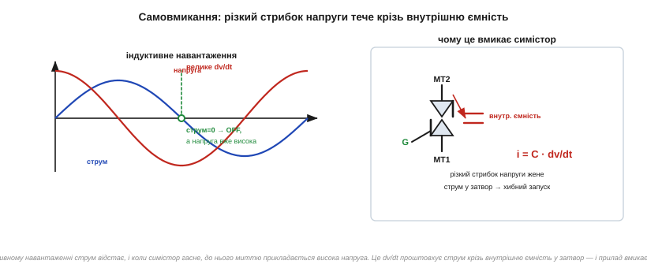
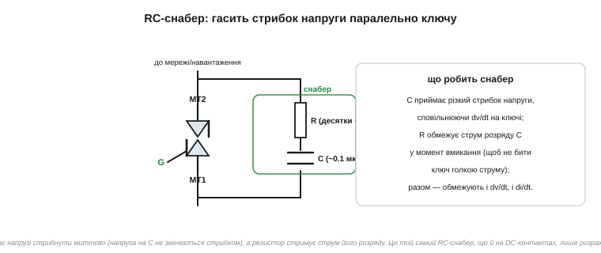

# Снабери й dv/dt: чому симістор самовмикається

Уявімо прикру несправність: симістор у схемі вмикається **сам**, без жодного імпульсу на затворі. Навантаження то вмикається невпопад, то взагалі не вимикається. Особливо часто це трапляється на **індуктивному** навантаженні — двигуні, трансформаторі, котушці клапана. Причина не в поломці, а у фундаментальній властивості приладу: симістор реагує не лише на струм затвора, а й на **швидкість зміни напруги** на ньому. Розберемо це явище й захист від нього.

### Звідки береться небезпечний стрибок напруги

На індуктивному навантаженні [струм відстає від напруги](topic:hw-components/phase-shift): коли напруга мережі вже пройшла нуль і росте, струм ще тільки доганяє. Сполучімо це з тим, як гасне [симістор](topic:hw-components/thyristor-scr): він закривається, коли **струм** падає нижче утримуючого. На індуктивному навантаженні струм проходить нуль **пізніше** за напругу — отже, у момент, коли симістор гасне (струм = 0), напруга мережі **вже встигла відійти від нуля** й має помітне значення.

І ось що відбувається: щойно симістор закрився, до нього **миттєво** прикладається ця ненульова напруга мережі. Виникає різкий **стрибок напруги** на закритому приладі — велика **швидкість зміни напруги**, яку позначають **dv/dt** *(швидкість наростання напруги, вольт за мікросекунду)*.


*Зліва: на індуктивному навантаженні струм відстає від напруги; коли симістор гасне (струм = 0), напруга мережі вже велика → до приладу різко прикладається висока напруга (велике dv/dt). Справа: цей стрибок жене струм крізь внутрішню ємність приладу прямо в затвор (i = C·dv/dt) — і симістор хибно вмикається сам.*

### Механізм самовмикання: i = C·dv/dt

Чому стрибок напруги вмикає прилад? Бо всередині симістора, як і будь-якого [напівпровідникового переходу](topic:ph-condensed/pn-junction), є **паразитна ємність** — зокрема між силовим виводом і затвором. А через будь-яку ємність протікає струм, пропорційний [швидкості зміни напруги](topic:ph-electromagnetism/capacitance) на ній:

```
i = C · dv/dt
```

Якщо dv/dt досить велике, цей ємнісний струм, потрапляючи в затвор, виявляється **достатнім, щоб запустити защіпку** — так само, як зробив би справжній імпульс керування. Прилад вмикається «думаючи», що отримав команду, хоча насправді це лише наслідок різкого стрибка напруги. Звідси й параметр у даташиті — **критичне dv/dt** *(critical rate of rise of off-state voltage)*: максимальна швидкість наростання напруги, яку прилад витримає, **не** ввімкнувшись.

> 🔧 **Навіщо це.** Це пояснює одну з найзагадковіших несправностей у силовій електроніці: «симістор вмикається сам, особливо коли навантаження індуктивне». Новачок шукає поломку або наводку, а причина — фізична: dv/dt у момент природного вимикання. Знаючи механізм i = C·dv/dt, інженер не «бореться з привидом», а ставить снабер — і проблема зникає. Те саме dv/dt, до речі, загрожує й силовому ключу в [твердотільному реле](topic:hw-power/solid-state-relay).

### RC-снабер: сповільнити стрибок

Захист від dv/dt — **снабер** *(snubber)*: найчастіше це послідовне з'єднання **резистора й конденсатора** *(RC-снабер)*, увімкнене **паралельно** силовому ключу. Ідея проста й спирається прямо на властивість конденсатора: [напруга на конденсаторі не може змінитися стрибком](topic:hw-analog/rc-time-constant). Підключивши конденсатор паралельно симістору, ми **не даємо напрузі на приладі підскочити миттєво** — вона тепер наростає плавно, поки заряджається C. Тобто dv/dt **зменшується** до безпечного рівня.


*RC-снабер (резистор послідовно з конденсатором) увімкнено паралельно симістору. Конденсатор приймає різкий стрибок напруги, сповільнюючи dv/dt на ключі; резистор обмежує струм розряду конденсатора в момент вмикання, щоб той не вдарив ключ голкою струму. Разом вони стримують і dv/dt, і di/dt.*

Навіщо в снабері **резистор**, чому не самий конденсатор? Бо коли симістор усе ж вмикається (за командою), заряджений конденсатор снабера **розрядиться** крізь нього — і без обмеження це був би різкий кидок струму (велике di/dt), здатний пошкодити ключ. Резистор обмежує цей розрядний струм. Виходить розумний компроміс: конденсатор гасить **стрибок напруги** при вимиканні, резистор гасить **кидок струму** при вмиканні. Типові номінали для мережі — конденсатор близько 0.1 мкФ і резистор у десятки ом, обов'язково на мережеву напругу.

Тут є тонкий баланс, який варто розуміти, а не лише запам'ятати номінали. **Більший** конденсатор сильніше згладжує dv/dt (краще захищає від самовмикання), але водночас запасає більше заряду, який при вмиканні вдарить крізь резистор у ключ. **Менший** резистор краще гасить кидок напруги, але гірше стримує розрядний струм. Тож снабер — це завжди компроміс між захистом від dv/dt (хочеться більше C, менше R) і захистом від di/dt розряду (хочеться більше R). Класичні «0.1 мкФ + кілька десятків ом» — це усереднена точка, що годиться для більшості побутових навантажень; для конкретного приладу й струму номінали уточнюють розрахунком за параметрами з даташита (критичні dv/dt і di/dt).

> 🧮 Як перетворити струм навантаження й паспортне dv/dt на конкретні R та C — три формули «на серветці»: [оцінка RC-снабера](topic:hw-power/snubbers-dvdt/math-snubber-calc.md).

Ще важливо, **де** снабер фізично стоїть. Підключати його треба **прямо до виводів симістора**, короткими провідниками: якщо снабер віднести від ключа довгими доріжками, їхня власна [паразитна індуктивність](topic:ph-electromagnetism/inductance) зведе нанівець захист — стрибок напруги встигне «вистрелити» на самому ключі, перш ніж дійде до віддаленого конденсатора. Те саме правило діє і для [розв'язувальних конденсаторів](topic:hw-components/capacitor-uses) «біля кожної ніжки живлення»: захисний елемент діє лише там, де він **поруч**.

### Один знайомий механізм — два прояви

Той самий RC-снабер працює і в зовсім іншій схемі — коли гасять [іскру на механічних контактах](topic:hw-components/inductor-kickback) при комутації індуктивного навантаження **постійного** струму. Там механізм дзеркальний: розмикання котушки дає стрибок напруги (V = L·di/dt), що пробиває іскрою контакти, і RC-снабер поглинає цей викид. Тут, у мережі змінного струму, снабер бореться не з іскрою на механічних контактах, а із **самовмиканням напівпровідникового ключа** від dv/dt. Але **фізична ідея та сама**: конденсатор не дає напрузі стрибнути, резистор стримує струм його розряду.

Різниця лише в тому, **проти чого** ми захищаємось. На механічних [DC-контактах](topic:hw-components/inductor-kickback) ворог — іскра, що випалює метал. У **мережі AC** ворог — хибне вмикання ключа стрибком напруги. Снабер — спільна відповідь на обидві біди, бо обидві біди — це той самий різкий стрибок напруги на щойно розімкненому ключі з індуктивним навантаженням позаду.

Корисно побачити, що «снабер» — це ширша ідея, ніж один конкретний RC-вузол. Будь-де, де **різка зміна** напруги чи струму загрожує приладу, ставлять елемент, що цю зміну **сповільнює або поглинає**: [конденсатор](topic:hw-analog/rc-time-constant) проти стрибка напруги (бо напруга на ньому не скаче), [котушка](topic:ph-electromagnetism/inductance) проти стрибка струму (бо струм у ній не скаче), резистор, щоб розсіяти запасену енергію в тепло. RC-снабер симістора, RC на DC-контактах, [flyback-діод на котушці реле](root:embedded/flyback-protection), [TVS на вході](root:embedded/zener-schottky) — усе це різні втілення однієї думки: **гасити різкі перехідні процеси біля джерела**. Зрозумівши снабер тут, ви впізнаєте його родичів у будь-якій силовій схемі.

А що з різким **наростанням струму** при вмиканні — di/dt? Тиристор і симістор бояться не лише стрибка напруги, а й надто швидкого зростання струму на старті провідності: струм спершу тече лише через крихітну ділянку кристала біля затвора, і якщо він наростає блискавично, ця ділянка перегрівається й вигоряє, перш ніж провідність встигне розповзтися по всьому кристалу. Захист дзеркальний до снабера напруги — невелика **котушка послідовно** з ключем: вона не дає струмові стрибнути миттєво (V = L·di/dt стримує наростання). У м'яких мережевих схемах власної індуктивності проводів і навантаження зазвичай вистачає, тож окрему котушку di/dt ставлять лише в жорстких силових перетворювачах; але знати про обидва боки — і dv/dt, і di/dt — корисно.

> 🔧 **Навіщо це.** Снабер — обов'язковий елемент будь-якої схеми з симістором на **індуктивному** навантаженні (двигун, трансформатор, котушка). Без нього прилад вмикатиметься сам і поводитиметься непередбачувано. Для резистивного навантаження снабер часто не потрібен — там струм і напруга збігаються у фазі, і стрибка при вимиканні нема. Тому в даташитах симісторів є окремий клас **«snubberless»** *(без снабера)* — приладів із підвищеною стійкістю до dv/dt, спеціально для індуктивних навантажень; але навіть із ними снабер часто лишають для надійності.

Як розпізнати, що в реальній схемі коїться саме самовмикання від dv/dt, а не щось інше? Є кілька характерних ознак. Проблема з'являється або посилюється **на індуктивному навантаженні** (двигун, трансформатор, котушка клапана) і зникає на резистивному (лампа розжарення, нагрівач). Симістор вмикається **сам**, без команди від мікроконтролера, причому часто саме в момент, коли навантаження мало б вимикатися. Додавання RC-снабера паралельно ключу проблему усуває. Якщо всі три ознаки збігаються — діагноз майже певний: це dv/dt. Новачок у такій ситуації часто підозрює збій програми чи наводку на лінію керування й місяцями шукає не там; знання механізму i = C·dv/dt одразу скеровує до правильного рішення — снабер або snubberless-симістор. Це гарний приклад того, як розуміння **фізики** приладу економить дні налагодження.

**Приклад (оцінка ефекту снабера).** Симістор без снабера бачить стрибок напруги 200 В за 1 мкс при вимиканні. Його критичне dv/dt — 50 В/мкс. Чи ввімкнеться він сам, і як допоможе конденсатор 0.1 мкФ?

```
Без снабера: dv/dt = 200 В / 1 мкс = 200 В/мкс
             200 В/мкс > 50 В/мкс (критичне) → САМОВМИКАННЯ ✗

Зі снабером (грубо): конденсатор розтягує наростання.
Якщо снабер сповільнить фронт, скажімо, до 20 В/мкс:
             20 В/мкс < 50 В/мкс → ключ НЕ вмикається сам ✓
```

Снабер «розмазав» різкий стрибок у часі — і dv/dt упало нижче критичного. Симістор тепер вимикається коректно й більше не запускається сам. (Точний підбір номіналів — за струмом навантаження й параметрами приладу; тут показано лише принцип.)

Наостанок — про **snubberless-симістори**, бо назва обманлива. Вона не означає, що такий прилад узагалі не потребує захисту від dv/dt; вона означає, що його зроблено **стійкішим до dv/dt зсередини** — підвищили критичне dv/dt самого кристала, тож для багатьох індуктивних навантажень зовнішній снабер уже не обов'язковий. Досягають цього особливою геометрією кристала, яка гірше «ловить» ємнісний струм у затвор. Це зручно: менше деталей, менша плата. Але межа в нього все одно є, і в жорстких умовах (дуже швидкі стрибки, сильна індуктивність) снабер додають навіть до snubberless-приладу. Тобто «snubberless» — це «зазвичай можна без снабера», а не «снабер не діє». Розуміючи механізм, ви легко вирішите, коли можна заощадити деталь, а коли краще не ризикувати.
