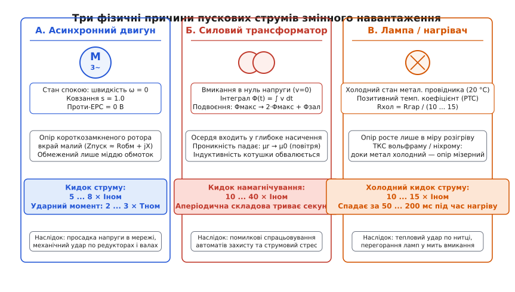
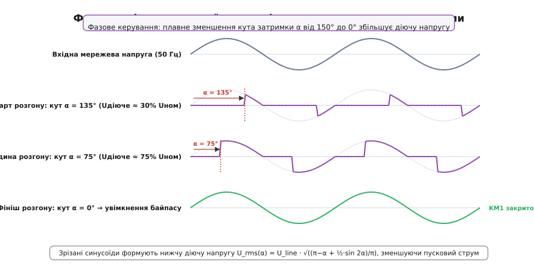
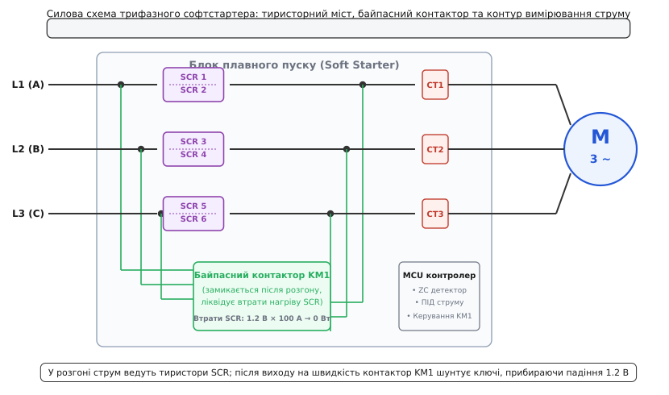
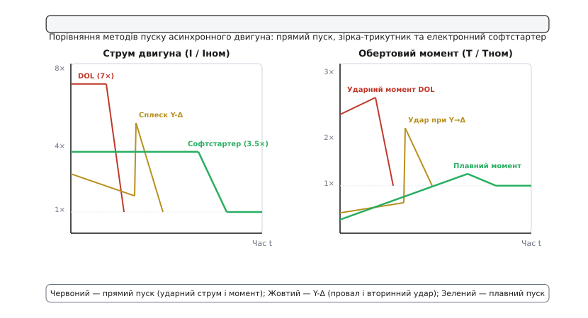
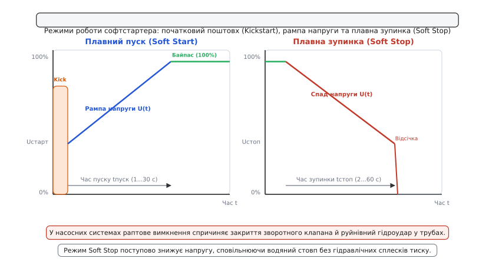

# Плавний пуск змінного навантаження

<preknowlist>
- [Кидок струму при вмиканні](root:hw-power/inrush-current) — фізична природа комутаційних сплесків струму в електричних колах.
- [Тиристор](root:hw-components/thyristor-scr) — напівпровідниковий прилад із фіксацією відкритого стану, керований імпульсом на затворі.
- [Симістор](root:hw-components/triac) — двонаправлений симетричний тиристор для комутації обох півхвиль змінного струму.
- [Фазове керування](root:hw-power/phase-control-dimmer) — метод регулювання середньоквадратичної напруги зміною кута відкривання ключів відносно нуля напруги.
- [Нелінійна індуктивність і насичення осердя](root:hw-components/nonlinear-inductor) — фізика падіння диференційної проникності феромагнетика при перевищенні порогу насичення.
- [Снабери](root:hw-power/snubbers-dvdt) — захисні RC-кола для обмеження швидкості наростання напруги dV/dt на силових ключах.
</preknowlist>

Коли на промисловому підприємстві безпосередньо вмикають у мережу 400 В трифазний асинхронний двигун потужністю 45 кВт, контакти головного рубильника приймають на себе струмовий удар у 650 А замість робочих 85 А. У ту саму мить напруга в цеховій розподільчій мережі просідає на 15–20 %, через що перезавантажуються мікроконтролерні контролери сусідніх верстатів, а на валу двигуна виникає раптовий механічний поштовх із моментом у 2.8 раза вищим за номінальний, здатний зрізати шпонки, порвати приводні паси та пошкодити зубчасті вінці редуктора.

У колах змінного струму пусковий надструм (англ. *inrush current*) виникає не лише через заряд ємностей, а породжується трьома принципово різними фізичними явищами: відсутністю проти-ЕРС у нерухомому роторі двигуна, магнітним насиченням заліза трансформатора під час комутації в нуль напруги та низьким електричним опором холодних металевих нагрівачів. Щоб приборкати ці руйнівні піки, інженерія силової електроніки застосовує пристрої плавного пуску (англ. *soft starters*), які плавно дозують надходження енергії в навантаження.


*Три фізичні причини виникнення комутаційних надструмів у навантаженнях змінного струму. Ліворуч — асинхронний двигун у стані спокою діє як короткозамкнений трансформатор через нульову проти-ЕРС (кидок 5–8× Іном); у центрі — магнітопровід трансформатора при увімкненні в нуль напруги заходить у глибоке насичення через накопичення магнітного потоку (кидок 10–40× Іном); праворуч — холодний опір металевої нитки лампи чи ТЕНа у 10–15 разів менший за робочий гарячий опір.*

## Фізика пускових струмів: три природи надструму в мережі AC

Щоб обрати правильний спосіб обмеження струму, необхідно розділити фізичні процеси, які керують поведінкою навантаження в перші мілісекунди після подачі змінної напруги.

### 1. Асинхронний двигун: ковзання s = 1 та відсутність проти-ЕРС

В усталеному режимі роботи трифазний асинхронний двигун обертається зі швидкістю `n`, що трохи менша за швидкість обертання магнітного поля статора `n_s` (синхронну швидкість, яка для 4-полюсного двигуна при 50 Гц становить 1500 об/хв). Безрозмірне відносне відставання ротора від поля називають **ковзанням** (лат. *lapsus*, англ. *slip*):

```
s = (n_s − n) / n_s
```

В усталеному робочому режимі під навантаженням ковзання становить лише `s = 0.02...0.05` (2–5 %). Обертовий ротор перетинає поле статора з малою відносною швидкістю, у його стрижнях наводиться невелика електрорушійна сила (ЕРС), а струм статора визначається балансом між напругою мережі та зустрічною ЕРС обмоток (проти-ЕРС).

У мить пуску вал нерухомий (`n = 0`), тому ковзання дорівнює одиниці (`s = 1.0`). За нульової швидкості ротор діє як вторинна обмотка трансформатора, замкнена накоротко масивними мідними або алюмінієвими кінцевими кільцями. Еквівалентний електричний опір нерухомого двигуна `Z_пуск` (імпеданс загальмованого ротора, англ. *locked-rotor impedance*) складається лише з активного опору міді обмоток статора й ротора `R_eq` та реактивного індуктивного опору розсіювання магнітного поля `X_eq`:

```
Z_пуск = √(R_eq² + X_eq²)
```

Оскільки двигуни проєктують із мінімальним активним опором обмоток для досягнення високого коефіцієнта корисної дії (ККД понад 92–95 %), значення `R_eq` становить лічені частки ома. Внаслідок цього пусковий струм `I_пуск = V_фаз / Z_пуск` перевищує номінальний робочий струм у 5–8 разів:

```
I_пуск = (5.0 ... 8.0) · I_ном
```

При цьому коефіцієнт потужності на старті є вкрай низьким (`cos φ_пуск ≈ 0.2...0.35` замість номінальних 0.85–0.90), що означає переважання реактивної індуктивної складової струму.

Одночасно з цим електромагнітний обертовий момент двигуна `T` описується спрощеною формулою Клосса (нім. *Kloss-Formel*), згідно з якою момент у будь-якій точці швидкісної характеристики строго пропорційний квадрату прикладеної до статора напруги:

```
T(s) = (2 · T_max) / ( (s / s_k) + (s_k / s) ) ∝ V²
```

де `T_max` — критичний (перекидний) момент двигуна, а `s_k` — критичне ковзання (типово 0.1–0.2).

Під час прямого пуску на повну напругу стрибок початкового пускового моменту `T_пуск` сягає 150–250 % від номінального, а в процесі розгону при проходженні критичного ковзання `s_k` момент підскакує до 250–320 % `T_ном`. Цей динамічний удар спричиняє пружні деформації валів, різке проковзування клинових пасів та ударне навантаження на зубці редукторів.

### 2. Силовий трансформатор: подвоєння потоку та насичення сталі

Якщо для конденсатора найгіршим моментом увімкнення є амплітудний пік напруги, то для індуктивного трансформатора найруйнівніший кидок струму виникає за комутації в момент, коли миттєва напруга мережі **проходить через нуль** (`v(t) = 0`).

Згідно із законом електромагнітної індукції Фарадея, напруга на первинній обмотці дорівнює швидкості зміни магнітного потоку в осерді: `v(t) = N · (dΦ/dt)`. Інтегруючи цей вираз, отримуємо закон зміни потоку:

```
Φ(t) = Φ_rem + (1 / N) · ∫ v(t) dt
```

де `Φ_rem` — залишковий магнітний потік (залишкова намагніченість сталі від попереднього циклу роботи).

В усталеному режимі роботи за синусоїдальної напруги `v(t) = V_pk · sin(ω·t)` магнітний потік коливається симетрично навколо нуля: `Φ(t) = −Φ_max · cos(ω·t)`. Потік відстає від напруги рівно на 90° (чверть періоду): коли напруга проходить через нуль, потік в осерді вже перебуває у своєму максимальному негативному піку `−Φ_max`.

Але в момент увімкнення розімкненого трансформатора потік не може миттєво стрибнути до `−Φ_max`. Якщо комутація відбулася при `v(t) = 0`, інтегрування синусоїди починається від початкового значення `Φ_rem` (яке може досягати 40–70 % від номінального `Φ_max`):

```
Φ(t) = Φ_rem + Φ_max · (1 − cos(ω·t))
```

Через половину періоду мережі (`t = 10 мс` для 50 Гц, коли `ω·t = π` та `cos(π) = −1`), потік в осерді намагається досягти пікового значення:

```
Φ_пік = 2 · Φ_max + Φ_rem
```

Осердя промислового трансформатора розраховують з огляду на вартість матеріалів так, щоб номінальна індукція `B_max` лежала близько до порогу насичення сталі (типово 1.5–1.7 Тл при порозі насичення `B_sat ≈ 1.8...2.0 Тл`). Подвоєння потоку вимагає індукції понад 3.5 Тл, що фізично неможливо для феромагнетика.

Коли індукція перетинає `B_sat`, диференційна магнітна проникність сталі `μ_diff` стрімко обвалюється від значень `3000...5000 · μ0` до магнітної проникності повітря `μ0 = 4·π·10⁻⁷ Гн/м`. Індуктивність первинної обмотки зменшується в тисячі разів — трансформатор перетворюється на звичайну низькоомну котушку без осердя. Струм намагнічування злітає до величин у 10–40 разів вищих за номінальний струм навантаження. Повний математичний розрахунок цього процесу наведено в [математиці кидка струму в трансформаторі](root:hw-power/soft-start-ac/math-transformer-inrush.md).

### 3. Лампи розжарювання та нагрівачі: стрибок опору PTC

Метали (вольфрам ниток розжарювання, ніхром і фехраль трубчастих електронагрівачів — ТЕНів) мають виражений позитивний температурний коефіцієнт електричного опору (англ. *Positive Temperature Coefficient*, PTC). Їхній питомий опір `ρ(T)` зростає зі збільшенням температури кристалічної ґратки:

```
R(T) = R_0 · (1 + α · (T − T_0))
```

де `α` для вольфраму становить близько `0.0045 К⁻¹`.

Холодна нитка лампи розжарювання за кімнатної температури (20 °C) має опір, який у 12–15 разів нижчий за опір розжареної до 2500 °C нитки під час світіння:

```
R_холодний = R_гарячий / (12 ... 15)
```

Потужні групи кварцових інфрачервоних випромінювачів сушильних камер або промислові нагрівачі в мить подачі фазної напруги споживають струм `I_холод = V_rms / R_холод`, що викликає термічний удар. Саме через цей пусковий сплеск нитки ламп найчастіше перегорають у момент увімкнення вимикача, коли локальне стоншення нитки миттєво плавиться надструмом до того, як прогріється вся маса металу.

## Фазове керування: регулювання діючої напруги зустрічно-паралельними тиристорами

Основним методом безнапірного та плавного наростання енергії в колах змінного струму є **фазове регулювання** за допомогою силових напівпровідникових ключів — тиристорів (SCR) або симісторів (TRIAC).

У кожну фазу живильної лінії послідовно з навантаженням встановлюють пару зустрічно-паралельних тиристорів. На відміну від транзистора, який можна закрити в будь-яку мить напругою на затворі, відкритий тиристор залишається в провідному стані доти, доки струм крізь нього не впаде природним шляхом нижче порогу утримання (що в колі змінного струму відбувається автоматично під час кожного переходу синусоїди струму через нуль).


*Формування діючої напруги методом фазового відсікання. Зверху вниз: повна вхідна мережева напруга; зрізані імпульси малої площі на початку розгону (кут α = 135°, Uдіюче ≈ 30 %); наростання напівхвиль у середині пуску (кут α = 75°, Uдіюче ≈ 75 %); вихід на повну синусоїду (кут α = 0°) та перемикання навантаження на контакти байпасного контактора KM1.*

Керування полягає у зміні **кута відсічки** (кута відмикання `α`), що відраховується від моменту проходження синусоїди напруги через нуль:
1. Якщо імпульс керування подається із запізненням на кут `α = 135°` (через 7.5 мс після нуля для частоти 50 Гц), тиристор відкритий лише наприкінці кожного півперіоду протягом решти 45°. На навантаження надходять вузькі верхівки півхвиль, а діюче (середньоквадратичне, RMS) значення напруги становить близько 30 % від номінальної напруги мережі.
2. Контролер починає плавно зменшувати кут `α` від початкового `α_старт` (135–150°) до нуля (`α = 0°`).
3. Коли кут досягає `α = 0°`, тиристори відкриваються на самому початку кожної півхвилі, пропускаючи чисту неспотворену синусоїду повної амплітуди.

Залежність діючої напруги на навантаженні `V_rms(α)` від кута відмикання `α` для чисто резистивного навантаження описується інтегральним виразом:

```
V_rms(α) = V_line · √[ (1 / π) · ( (π − α) + ½ · sin(2·α) ) ]
```

Поступове зменшення кута `α` протягом часу розгону (від 1 до 30 секунд) забезпечує плавний підйом напруги на статорі двигуна від початкової `V_старт` (зазвичай 30–40 % `V_ном`) до 100 %. Завдяки пропорційності струму напрузі (`I ∝ V`) пусковий струм двигуна обмежується безпечною поличкою на рівні 2.5–3.5 × `I_ном` замість 7.0 × `I_ном`, а обертовий момент наростає плавно без ударів.

Детальний схемотехнічний опис силової частини, затворних драйверів та способів захисту ключів винесено в окремий огляд: [силова топологія та вузли трифазного софтстартера](root:hw-power/soft-start-ac/comp-ac-softstarter.md).

## Теплова проблема тиристорів і шунтування байпасним контактором

Попри виняткову швидкодію та відсутність рухомих частин, тиристори мають один фундаментальний фізичний недолік: напівпровідниковий `p-n-p-n` перехід у відкритому стані має постійне пряме падіння напруги `V_f ≈ 1.1...1.5 В`.

Порахуймо, скільки теплової потужності виділяється на тиристорах у шафі керування під час роботи трифазного двигуна з номінальним струмом 100 А (потужність близько 55 кВт).

**Умова.** Трифазний двигун, номінальний діючий струм `I_ном = 100 А`, пряме падіння напруги на тиристорі `V_f = 1.2 В`, кількість пар зустрічно-паралельних тиристорів — 3 (по 2 тиристори на кожну фазу).

```
Середній струм через один тиристор за півперіоду:
I_тиристор_avg = (√2 · I_ном) / π = (1.414 · 100) / 3.14159 ≈ 45.0 А

Потужність розсіювання одного тиристора:
P_1 = V_f · I_тиристор_avg = 1.2 · 45.0 = 54.0 Вт

Сумарні теплові втрати на шести тиристорах у 3 фазах:
P_сумарне = 6 · P_1 = 6 · 54.0 = 324 Вт
```

**Висновок.** 324 вати постійного тепла виділяються всередині закритої промислової шафи з класом захисту IP54. Якщо тиристори залишатимуться в колі постійно під час багатогодинної роботи двигуна, знадобляться масивні алюмінієві радіатори масою понад 10–15 кг та вентилятори примусового обдуву, які споживають додаткову енергію, шумлять і забиваються пилом.


*Принципова силова схема трифазного софтстартера. У процесі розгону струм ведуть тиристори SCR1–SCR6 за алгоритмом фазового відсікання. Після завершення розгону (кут α = 0°) мікроконтролер замикає контакти трифазного байпасного контактора KM1, спрямовуючи струм в обхід тиристорів. Це повністю вимикає розсіювання тепла 1.2 В × I на напівпровідниках у тривалому робочому режимі.*

### Роль байпасного контактора (Bypass Contactor)

Для розв'язання проблеми теплових втрат паралельно кожній тиристорній парі встановлюють електромеханічний **байпасний контактор** (англ. *bypass contactor*, позначення KM1).

Схема працює в чіткій часовій послідовності:
1. **Етап розгону (Start):** Контактор KM1 розімкнений. Усі 100 % струму проходять крізь тиристори, які плавно змінюють кут `α` від 135° до 0°. Оскільки розгін триває лічені секунди (5–15 с), тиристори та радіатор встигають нагрітися лише на 15–25 °C, не виходячи за теплові межі кристала.
2. **Момент перемикання (Bypass Handover):** Щойно кут `α` досягає 0° (на навантаженні діє повна синусоїда), мікроконтролер подає живлення на котушку контактора KM1. Контакти контактора сходяться й закорочують виводи анод-катод тиристорів.
3. **Усталений режим (Run):** Опір зімкнутих контактів контактора становить частки міліома (`R_конт ≈ 0.2...0.5 мОм`). За струму 100 А падіння напруги на контакторі становить лише `100 · 0.0003 = 0.03 В`, що в 40 разів менше за пряме падіння на тиристорі (1.2 В). Струм природним шляхом повністю перетікає в механічні контакти, а струм крізь тиристори падає до нуля. Контролер знімає імпульси керування із затворів SCR. Тепловиділення софтстартера в робочому режимі падає з 324 Вт до 3–5 Вт.

> 🔧 **Навіщо це.** Байпасний контактор не лише усуває нагрів шафи й дає змогу зменшити габарити радіаторів утричі, але й працює в ідеальних умовах комутації: він замикається і розмикається тоді, коли тиристори вже відкриті й проводять струм. Різниця напруг на контактах у момент їхнього сходження становить лише 1.2 В. За такої низької напруги між контактами **не виникає електричної дуги**, контакти не обгорають і не приварюються, а механічний ресурс контактора зростає з типових 100 тисяч комутацій до мільйонів циклів.

## Альтернативні методи обмеження: термістори, резистори та перемикання зірка-трикутник

Фазове електронне регулювання — не єдиний спосіб захисту кіл змінного струму. Залежно від потужності, вартості та вимог до надійності в електротехніці застосовують кілька альтернативних підходів:

### 1. NTC-термістори в однофазних колах малої потужності

Для малопотужних споживачів змінного струму (імпульсні блоки живлення комп'ютерів, побутові інвертори, LED-драйвери потужністю до 1–2 кВт) найдешевшим методом є встановлення послідовного **NTC-термістора** (англ. *Negative Temperature Coefficient*).

У холодному стані термістор має опір 5–20 Ом, обмежуючи перший пік струму заряду вхідних конденсаторів випрямляча. Під дією робочого струму напівпровідникова кераміка термістора розігрівається до 120–170 °C, її опір лавиноподібно падає до 0.1–0.5 Ом, і термістор перестає обмежувати струм.

Недолік NTC-термісторів у колах змінного струму — час теплової релаксації (охолодження), який становить від 30 до 90 секунд. Якщо живлення мережі короткочасно зникне на 0.5–2 секунди й увімкнеться знову, гарячий термістор не встигне охолонути, матиме низький опір і пропустить повний руйнівний кидок струму.

### 2. Ступеневі резистори та автотрансформатори (схема Корндорфера)

У важкій промисловості на початку XX століття для плавного пуску застосовували послідовні дротяні або чавунні пускові резистори чи понижувальні автотрансформатори, які замикалися контакторами за таймером у 2–3 ступені. Історичну еволюцію цих електромеханічних рішень розкрито в нарисі про [еволюцію методів пуску змінного струму](root:hw-power/soft-start-ac/hist-motor-starting.md).

### 3. Пускач «Зірка-Трикутник» (Star-Delta)

Найпоширенішим електромеханічним методом для двигунів потужністю понад 5 кВт тривалий час залишався пускач зірка-трикутник (Y-Δ). Обмотки статора на старті з'єднують у зірку, де фазна напруга на кожній обмотці становить `V_фаз = V_лін / √3 ≈ 230 В` (замість 400 В). Лінійний пусковий струм та момент падають рівно втричі:

```
I_пуск_зірка = ⅓ · I_пуск_трикутник
T_пуск_зірка = ⅓ · T_пуск_трикутник
```


*Порівняльні характеристики методів пуску асинхронного двигуна. Червона лінія — прямий пуск (DOL): величезний струм 7× Іном та ударний момент 2.5× Тном; жовта лінія — пуск «зірка-трикутник» (Y-Δ): початковий струм знижено до 2.5×, але під час перемикання виникає провал моменту та небезпечний вторинний сплеск струму до 5× Іном; зелена лінія — електронний софтстартер: струм утримується на плоскій поличці 3.5× Іном, а момент зростає безперервно без жодних механічних поштовхів.*

Головний дефект схеми «зірка-трикутник» — **вторинний удар перемикання**. Під час спрацьовування таймера розмикається контактор «зірки», і настає пауза тривалістю 30–60 мс для гасіння дуги. За цей час ротор трохи сповільнюється, а залишкове магнітне поле в роторі розвертається за фазою відносно мережі. Коли замикається контактор «трикутника», двигун опиняється підключеним до мережі несинхронно, що породжує сплеск струму до 4–5 × `I_ном` та механічний удар по трансмісії. Електронний тиристорний софтстартер повністю позбавлений цієї вади, оскільки забезпечує неперервне, плавне регулювання напруги без розриву кола.

### Порівняльна таблиця методів пуску трифазних асинхронних двигунів:

| Метод пуску | Пусковий струм (% Іном) | Пусковий момент (% Тном) | Механічний удар | Плавність | Втрати тепла в роботі | Вартість |
| :--- | :--- | :--- | :--- | :--- | :--- | :--- |
| **Прямий пуск (DOL)** | 600–800 % | 150–300 % | Максимальний | Відсутня (ривок) | Нульові | Мінімальна |
| **Пускач «Зірка-Трикутник»** | 200–300 % | 33–70 % | Сильний (при перемиканні) | Ступінчаста | Нульові | Низька |
| **Автотрансформатор (Корндорфер)** | 250–400 % | 40–80 % | Помірний | 2–3 ступені | Нульові | Середня/Висока |
| **Тиристорний софтстартер (з байпасом)** | 200–350 % | 30–150 % (регульований) | Відсутній | Абсолютна (лінійна) | 3–5 Вт (контактор) | Середня |
| **Частотний перетворювач (VFD)** | 100–150 % | 100–200 % | Відсутній | Повний контроль швидкості | 2–4 % від номіналу | Найвища |

## Алгоритми керування: рампа напруги, обмеження струму та початковий поштовх

Сучасні мікропроцесорні пристрої плавного пуску підтримують три основні режими керування розгоном та зупинкою:

### 1. Лінійне наростання напруги (Voltage Ramp)

Контролер лінійно зменшує кут затримки тиристорів `α` від початкового значення `α_старт` до нуля протягом заданого часу розгону `t_пуск` (наприклад, 10 секунд). Напруга на виході зростає прямою лінією:

```
V(t) = V_старт + (V_ном − V_старт) · (t / t_пуск)
```

Цей режим застосовують для механізмів із легким та середнім пуском (вентилятори, димососи, незавантажені стрічкові транспортери).

### 2. Початковий поштовх моменту (Kickstart або Torque Boost)

Деякі механізми (дробарки для породи, шнекові преси, заповнені рідиною насоси високого тиску) мають високе **статичне тертя спокою** (сухе тертя). За початкової напруги 30–40 % момент двигуна (що становить `0.3² ≈ 9 %` від номіналу) виявляється недостатнім, щоб провернути заклинений вал. Двигун гуде, залишається нерухомим і перегрівається струмом короткого замикання.

Для подолання цього бар'єра софтстартер формує режим **Kickstart**: у перші 100–300 мс після старту тиристори відмикаються на майже повну напругу (80–90 %, кут `α = 45°`). Двигун генерує короткий, потужний імпульс моменту (до 150–200 % номіналу), зриває механізм із мертвої точки, після чого напруга миттєво падає до `V_старт` і починається плавний спокійний розгін рампою.


*Режими напруги софтстартера. Ліворуч — Soft Start із функцією Kickstart: короткий високовольтний поштовх тривалістю 100–300 мс зриває сухе тертя спокою вала, після чого напруга плавно піднімається від Uстарт до 100 % за час tпуск із подальшим переходом на байпас; праворуч — Soft Stop: після зняття сигналу роботи байпас вимикається, тиристори перехоплюють струм і плавно знижують напругу за час tстоп, запобігаючи різкому закриттю зворотних клапанів у водогонах.*

### 3. Замкнений контур обмеження струму (Current Limit Soft Start)

Найдосконаліший режим, у якому контролер не просто рахує час таймером, а використовує зворотний зв'язок за виміряним струмом від вбудованих трансформаторів струму (CT).

Оператор задає максимальну межу струму `I_limit` (наприклад, 350 % `I_ном`). Контролер відмикає тиристори й за допомогою ПІ-регулятора динамічно підлаштовує кут `α` щопівперіоду так, щоб струм двигуна точно утримувався на рівні 350 %.
- Поки ротор повільно розганяється (`s` спадає від 1.0 до 0.2), струм уперто намагається зрости, але контролер стримує його кутом `α`.
- Коли ротор підходить до синхронної швидкості, проти-ЕРС зростає, і струм починає природно спадати нижче 350 %.
- Відчувши спад струму, контролер швидко дотискає кут `α` до 0° і замикає байпасний контактор.

Повну програмну реалізацію цього алгоритму мовами C та C++ з детекцією нуля мережі та перемиканням станів наведено в [проєкті контролера фазового плавного пуску](root:hw-power/soft-start-ac/proj-softstart-controller.md).

## Енергетичний баланс та нагрів ротора під час розгону

Важливо розуміти фундаментальне фізичне обмеження софтстартера: він зменшує пусковий струм у мережі та усуває механічні удари на валу, але **не зменшує сумарну кількість тепла, яка виділяється в роторі двигуна** за час розгону.

Кількість теплоти `Q_ротор`, що розсіюється в короткозамкненому роторі під час розгону механізму з сумарним моментом інерції `J` до синхронної кутової швидкості `ω_0`, визначається виключно кінетичною енергією обертових мас:

```
Q_ротор = ½ · J · ω_0² + ∫[0..t_пуск] T_навантаження(ω) · (ω_0 − ω) dω
```

Якщо момент статичного навантаження малий, тепло в роторі строго дорівнює запасеної кінетичній енергії: `Q_ротор = ½ · J · ω_0²`.

За прямого пуску (DOL) ця енергія виділяється у вигляді короткого (0.5–1.5 с), але вкрай інтенсивного теплового удару величезної потужності. За плавного пуску розгін триває довше (5–20 с), тому та сама порція теплової енергії виділяється з меншою миттєвою потужністю. Проте якщо встановити занадто довгий час розгону або занизьку початкову напругу, виникає небезпека **зависання двигуна** (англ. *motor stalling*): момент двигуна зрівнюється з моментом опору механізму на проміжній швидкості, ротор перестає прискорюватися і плавиться власним струмом. Тому софтстартери завжди оснащують вбудованим тепловим захистом за моделлю інтеграла нагріву `I² · t`.

## Вплив гармонік (THD) та допустима частота пусків на годину

Формування напруги методом фазового відсікання неминуче спотворює її синусоїдальну форму. У спектрі напруги та струму статора з'являються вищі гармоніки непарних порядків: 3-тя (150 Гц), 5-та (250 Гц), 7-ма (350 Гц) та вищі.

Сумарний коефіцієнт гармонійних спотворень (англ. *Total Harmonic Distortion*, THD) під час глибокого зрізання півхвиль (`α = 90°...120°`) досягає 30–50 %. Це породжує два специфічні ефекти:
1. **Зворотні поля вищих гармонік:** 5-та гармоніка струму створює в повітряному зазорі двигуна магнітне поле, що обертається у зворотний бік відносно ротора, створюючи невеликий зустрічний гальмівний момент. 7-ма гармоніка обертається в прямий бік, але з семикратною швидкістю.
2. **Додаткові втрати у сталі та міді:** Високочастотні гармоніки струму викликають додаткові вихрові струми в пакетах електротехнічної сталі та поверхневий скін-ефект у мідних провідниках.

Оскільки фазове регулювання діє лише під час короткочасного розгону (5–15 секунд), ці додаткові втрати не становлять загрози для ізоляції двигуна (класу нагрівостійкості F або H із запасом до 155–180 °C). Проте наявність вищих гармонік є ще одним беззаперечним аргументом на користь **обов'язкового шунтування байпасним контактором**: у тривалій роботі двигун мусить живитися чистою синусоїдою з нульовим вмістом штучних гармонік.

### Тепловий баланс і ліміт пусків на годину

Кожен пуск супроводжується виділенням порції тепла як у кристалах тиристорів софтстартера, так і в обмотках двигуна. Каталоги промислових софтстартерів завжди нормують допустиму **кількість пусків на годину** (типово 5–10 пусків на годину для стандартних моделей і до 30 пусків для посилених версій із примусовим вентиляторним охолодженням).

Якщо пуски відбуваються занадто часто поспіль без інтервалів на охолодження (наприклад, у циклічних реверсивних приводах кранів чи пресів), температура тиристорів перевищує критичні 125 °C, що загрожує тепловим пробоєм кремнію. У таких важких циклічних режимах безальтернативним рішенням є застосування повноцінного частотно-регульованого приводу (VFD).

## Плавна зупинка (Soft Stop) та ліквідація гідравлічного удару

Софтстартер призначений не лише для розгону, а й для керованої зупинки обладнання. Найбільш критичним це є для **відцентрових водяних насосів** у системах водопостачання та водовідведення.

Якщо працюючий потужний насос вимкнути звичайним контактором, напруга зникає миттєво. Обертовий момент падає до нуля за частки мілісекунди. Водяний стовп у магістральному трубопроводі, що рухався зі швидкістю кілька метрів за секунду, під дією зворотної хвилі тиску миттєво зупиняється й рухається назад, різко зачиняючи важкий зворотний клапан насосної станції.

Виникає явище **гідравлічного удару** (англ. *water hammer*): кінетична енергія рухомої води перетворюється на стрибок тиску, що поширюється трубопроводом у вигляді ударної хвилі зі швидкістю звуку у воді (близько 1200–1400 м/с). Тиск у трубі може стрибнути у 5–10 разів понад робочий (до 40–60 бар), що призводить до розриву чавунних і пластикових труб, зриву фланцевих з'єднань, руйнування засувок та деформації крильчатки насоса.

Режим **плавної зупинки (Soft Stop)** розв'язує цю задачу:
1. За сигналом «Стоп» байпасний контактор розмикається, а струм підхоплюють повністю відкриті тиристори (`α = 0°`).
2. Контролер починає поступово збільшувати кут `α` від 0° до 145° протягом часу зупинки `t_стоп` (зазвичай 10–30 секунд).
3. Напруга на двигуні падає плавною похилою лінією, плавно знижуючи обертовий момент крильчатки.
4. Швидкість потоку води в трубопроводі сповільнюється плавно, зворотний клапан сідає у своє сідло м'яко й безгучно за нульової швидкості зустрічного потоку — гідроудар повністю ліквідується.
5. Коли напруга доходить до порогу зупинки (близько 20–30 % `V_ном`), тиристори остаточно закриваються.
