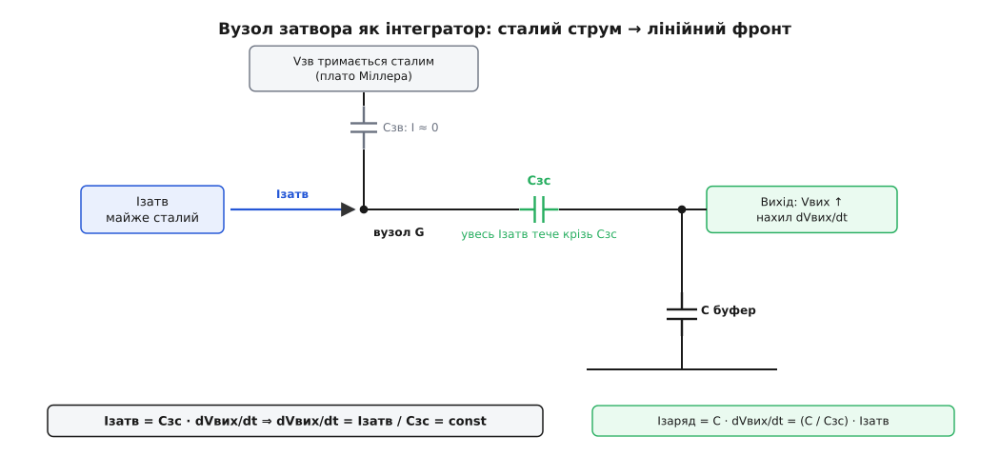
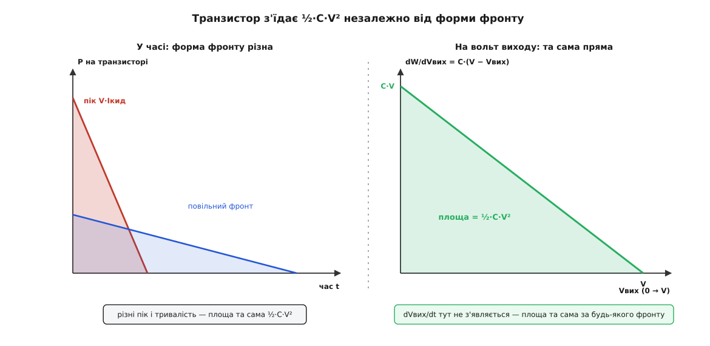

# 🧮 Математика керованого фронту

Активний м'який старт перетворює силовий транзистор на клапан, який відкривають повільно, ніби рукою. Уся його поведінка тримається на трьох числах, і кожне з них випливає з простої фізики, коли дивишся на неї уважно. Перше: конденсатор між затвором і стоком за сталого струму затвора змушує вихід підійматися **рівною прямою**, а не кривою, що вповільнюється. Друге: хоч як грайся формою й тривалістю цього фронту, транзистор з'їдає рівно **½·C·V²** тепла — ані джоулем більше, ані менше, стільки ж, скільки спалив би резистор. Третє, найпідступніше: розтягуючи фронт, щоб зменшити струм, можна не зробити старт безпечнішим, а навпаки — виштовхнути робочу точку **за** межу, у якій транзистор виживає. Виведімо всі три від першопричини, і кожне перестане бути правилом, яке треба запам'ятати.

## Вузол затвора як інтегратор

Почнімо з питання, чому фронт узагалі виходить прямим. Інтуїція підказує експоненту: заряджаєш ємність крізь опір — маєш сталу часу τ = R·C і криву, що дедалі вповільнюється, наближаючись до кінцевої напруги. Пряма лінія — це щось інше. Пряма означає **сталу** швидкість наростання, а стала швидкість напруги — це завжди ознака того, що десь інтегрується сталий струм. Отже в схемі має бути вузол, куди вливається незмінний струм і де він обертається на незмінний нахил напруги. Цей вузол — затвор.

Ключ до всього — **крутість** транзистора (англ. *transconductance*, gm): наскільки сильно змінюється струм стоку від крихітної зміни напруги затвор-витік. У силового MOSFET вона величезна — десятки ампер на вольт. Поки крізь транзистор тече заданий струм заряду, крутість тримає напругу затвор-витік Vзв майже прибитою до одного-єдиного значення — того, що саме й пропускає цей струм. Змінилася б Vзв на кілька мілівольт — струм стрибнув би на ампери, а йому нема звідки взятися, бо його задає конденсатор на виході. Тому Vзв стоїть майже нерухомо. Це і є [плато Міллера](topic:hw-components/gate-capacitance) — відрізок на кривій заряду затвора, де напруга затвор-витік завмерла, поки крізь затвор іде весь притік заряду.

Тепер складімо струми в самому вузлі затвора — це вся суть. Туди вливається струм Iзатв: від резистора, підтягнутого до живлення, або від справжнього джерела струму. Куди йому подітися? У затвора є дві ємності на сусідні виводи: затвор-витік Cзв і затвор-стік Cзс. Напруга на Cзв — це якраз Vзв, а вона прибита плато; а ємність, на якій напруга не змінюється, струму не бере зовсім, бо i = C·dV/dt, і при dV/dt ≈ 0 цей струм нульовий. Отже весь Iзатв **змушений** протекти крізь другу ємність — Cзс. А напруга на Cзс — це різниця між майже нерухомим затвором і стоком, тобто виходом. Щоб крізь Cзс пройшов саме струм Iзатв, вихід мусить рухатися рівно з такою швидкістю, щоб зміна напруги на Cзс дала цей струм:

```
Струм крізь ємність затвор-стік:   Iзатв = Cзс · d(Vзв − Vвих)/dt
Напругу затвор-витік тримає плато:  dVзв/dt ≈ 0
Звідси нахил виходу:                dVвих/dt = Iзатв / Cзс
```

Ось воно. У правій частині — самі сталі: незмінний струм затвора поділити на незмінну ємність. Отже **dVвих/dt теж стале**, а стала швидкість наростання і є прямою лінією. Пряма взялася не з вдалого підбору деталей — вона неминуча: транзистор власною крутістю заморозив напругу затвор-витік і не лишив струмові затвора іншого шляху, крім ємності затвор-стік, а протікання сталого струму крізь сталу ємність — це рівно інтегрування, тобто рампа. Саме тому [ефект Міллера](topic:hw-analog/miller-effect), який у підсилювачах вважають шкідливим (він з'їдає смугу), тут стає корисним інструментом: та сама зворотна ємність, що сповільнює каскад, перетворює безформний заряд затвора на точну лінійну рампу виходу.


*Чому фронт лінійний. Вузол затвора — це суматор струмів. Крутість транзистора тримає напругу затвор-витік сталою (плато Міллера), тому крізь ємність затвор-витік струм майже нульовий. Увесь струм затвора Iзатв змушений протекти крізь ємність затвор-стік Cзс, а це можливо лише коли вихід рухається зі швидкістю dVвих/dt = Iзатв / Cзс — сталою, бо і струм, і ємність сталі.*

**Умова.** Вихід V = 48 В, буферний конденсатор C = 470 мкФ. Задаємо фронт зовнішнім конденсатором затвор-стік Cзс = 10 нФ, а струм затвора беремо від резистора Rз ≈ 1 МОм, підтягнутого до шини (при напрузі затвора на плато близько 5 В).

```
Струм затвора:        Iзатв = (48 − 5) / 1·10⁶      ≈ 43 мкА
Нахил виходу:          dVвих/dt = Iзатв / Cзс = 43·10⁻⁶ / 10·10⁻⁹ = 4300 В/с ≈ 4.3 В/мс
Тривалість фронту:     T = V / (dVвих/dt) = 48 / 4300 ≈ 11 мс
```

**Висновок.** Крихітний струм затвора — сорок три мікроампери — задає одинадцятимілісекундний фронт, під час якого вихід повзе рівно вгору зі швидкістю 4.3 вольта на мілісекунду. Хочеш повільніший фронт — побільшуй Cзс або зменшуй струм затвора; хочеш точно передбачуваний — став справжнє джерело струму замість резистора, і нахил перестане залежати навіть від напруги шини.

## Заряд-підсилювач: звідки береться рівний струм

Знайшовши нахил виходу, струм заряду дістаємо одним рядком. Буферний конденсатор C бачить на собі саме цей нахил, а струм у конденсатор — це його ємність на швидкість зміни напруги:

```
Iкид = C · dVвих/dt = C · (Iзатв / Cзс) = (C / Cзс) · Iзатв
```

Підставмо числа з прикладу:

```
Iкид = (470·10⁻⁶ / 10·10⁻⁹) · 43·10⁻⁶ = 47000 · 43·10⁻⁶ ≈ 2.0 А
```

Придивімося до множника **C / Cзс = 47000**. Це коефіцієнт підсилення струму: сорок три мікроампери на затворі обертаються на два ампери на виході, бо буферна ємність у сорок сім тисяч разів більша за затворну. Схема працює як заряд-підсилювач — крихітний струм керування задає в стільки ж разів більший струм заряду. І зверніть увагу, чого тут **немає**: у формулі струму заряду немає ані напруги шини, ані опору навантаження. Пік струму цілком у ваших руках через відношення двох ємностей і струм затвора — рівна поличка заданої висоти, а не сплеск, продиктований джерелом.

> 🔧 **Навіщо це.** Відношення C / Cзс — це перше, що рахують, обираючи затворний конденсатор. Знаєш буферну ємність (скажімо, 1000 мкФ) і граничний струм, який дозволяє джерело чи запобіжник (скажімо, 3 А при струмі затвора 50 мкА), — і потрібна Cзс випадає одразу: Cзс = C·Iзатв / Iкид = 1000·10⁻⁶ · 50·10⁻⁶ / 3 ≈ 17 нФ. Не вгадуєш номінал, а вираховуєш його з двох чисел, які й так знаєш.

## Півджоуля, яких не уникнути

Тепер головне — тепло. Транзистор увесь фронт сидить між твердою шиною V і виходом, що повзе від нуля до V. На ньому висить напруга Vds = V − Vвих, а крізь нього тече струм заряду i = C·dVвих/dt. Добуток цих двох — миттєва потужність, яку розсіює кристал. Проінтегруймо її за весь фронт і подивімося, від чого вона залежить:

```
Wтр = ∫₀ᵀ Vds · i dt = ∫₀ᵀ (V − Vвих) · C · (dVвих/dt) dt
```

Тут криється весь фокус. Під інтегралом стоїть dVвих/dt, помножене на dt, — а це просто dVвих, елементарна зміна вихідної напруги. Отже інтеграл за часом обертається на інтеграл за **вихідною напругою**, і час — а з ним і вся форма фронту — зникає:

```
Wтр = ∫₀ⱽ (V − Vвих) · C dVвих = C · [V·Vвих − Vвих²/2]₀ⱽ
    = C · (V² − V²/2) = ½·C·V²
```

Півджоуля-на-C-V-квадрат — і жодного сліду від того, як саме йшов фронт. У результаті немає ні dVвих/dt, ні тривалості T, ні того, лінійна була рампа чи експонента, швидка чи повільна, гладка чи смикана. Байдуже: поки вихід монотонно пройшов від 0 до V, а струм крізь транзистор — це струм у конденсатор, кристал з'їдає рівно **½·C·V²**. Причина глибша за алгебру. Коли ти інтегруєш за вихідною напругою, а не за часом, підінтегральна величина C·(V − Vвих) — це енергія на кожен вольт підйому виходу, і вона не знає нічого про швидкість: скільки б часу вихід не витратив, минаючи позначку Vвих, енергія на цьому вольті та сама. Розтягни фронт удесятеро — і на кожному вольті транзистор сидить удесятеро довше, зате з удесятеро меншим струмом; добуток незмінний.


*Чому форма фронту не важить. Ліворуч, у часі: швидкий фронт дає високий вузький трикутник потужності, повільний — низький широкий, але площі (енергії) однакові — ½·C·V². Праворуч, на осі вихідної напруги: енергія на кожен вольт підйому, C·(V − Vвих), — та сама спадна пряма, хоч би яким був фронт; швидкість dVвих/dt у ній не з'являється взагалі, а площа під нею — той самий ½·C·V².*

Це та сама половина заряду, що згоряє в будь-якій послідовній схемі, просто тепер вона горить у кремнії транзистора замість резистора. М'який старт не зменшив тепла — він лише переніс його в керований елемент. Уся свобода, яку дає активна схема, — це свобода вибирати **розподіл** цих півджоуля в часі, а не їхню суму.

## Профіль потужності: трикутник від піка до нуля

Сума фіксована, а от форму розподілу для лінійного фронту випишемо явно — саме її треба порівнювати з межею транзистора. Нехай нахил сталий: Vвих(t) = k·t, де k = dVвих/dt = V/T. Тоді напруга на транзисторі спадає прямою, струм стоїть поличкою, а потужність — їхній добуток:

```
Напруга на ключі:     Vds(t) = V − k·t          (спадає від V до 0)
Струм заряду:          i(t)   = C·k = Iкид        (стала поличка)
Потужність:            P(t)   = Iкид · (V − k·t)  (спадає прямою)
```

На початку фронту, t = 0, вихід ще на нулі, на транзисторі повна напруга, а струм уже повний — це найгарячіша мить:

```
Пік потужності (t=0):  Pпік = V · Iкид
```

На кінці фронту, t = T, вихід дійшов до V, напруги на ключі не лишилося, і потужність падає до нуля. Між цими точками — пряма. Виходить трикутник: гострий пік V·Iкид на старті, лінійний спад до нуля. Його площа мусить збігтися з уже знайденим інтегралом, і збігається:

```
Площа трикутника = ½ · T · Pпік = ½ · T · V · Iкид = ½ · T · V · (C·V/T) = ½·C·V²
```

Для прикладу з 48 В і двома амперами:

```
Pпік = 48 · 2.0 = 96 Вт         (миттєвий пік на початку фронту)
Pсер = ½ · 96 = 48 Вт            (середнє за фронт)
Wтр  = ½ · 470·10⁻⁶ · 48² ≈ 0.54 Дж
```

Дев'яносто шість ват — на транзисторі, який у сталій роботі не гріється взагалі. Ось чому активний старт живе короткими фронтами: середні 48 ват за одинадцять мілісекунд кристал стерпить, бо не встигне прогрітися, а от тримати їх постійно він би не зміг. І тут причаїлася пастка, через яку «менший струм» не означає «безпечніше».

## Пастка довгого фронту: чому повільніше не значить безпечніше

Логіка новачка проста: гарячий пік Pпік = V·Iкид лякає, тож зменшимо струм — розтягнемо фронт. Подивімося, що при цьому діється з обома небезпечними числами. Струм заряду й піковий добуток на транзисторі обидва обернено пропорційні тривалості:

```
Iкид = C · V / T          (струм ∝ 1/T)
Pпік = V · Iкид = C · V² / T   (пікова потужність ∝ 1/T)
```

Розтягни фронт удесятеро — і струм упаде з 2 А до 0.2 А, і пік потужності з 96 Вт до 9.6 Вт. Обидва впали! Здавалося б, довший фронт безумовно безпечніший. Якби [безпечна робоча область](topic:hw-components/soa-power-devices) транзистора була однією нерухомою кривою — так і було б. Але вона не одна. SOA — це **сім'я** кривих, по одній на кожну тривалість імпульсу, і що довший імпульс, то **нижча** крива: за одну мілісекунду кристал витримає сотні ват, бо тепло ще не встигло дійти від переходу до корпусу й розтектися, а на постійному струмі — лише одиниці ват, бо температура переходу виходить на усталене значення ΔT = P·Rθ. Отже, розтягуючи фронт, ти не просто зсуваєш робочу точку вниз — ти **міняєш криву**, з якою її порівнюєш, на нижчу.

Тепер порівняння стає гонкою: робоча точка Pпік падає як 1/T, але дозволена межа SOA при тій самій напрузі теж падає з тривалістю. Хто швидше? Спершу, на коротких фронтах, точка виграє: перехід від мілісекундної кривої до десятимілісекундної опускає межу повільніше, ніж 1/T, тож помірне подовження додає запасу. Але за двома причинами далі гонка перевертається.

Перша — сама крива перестає падати, коли доходить до постійного струму: далі подовжуй фронт скільки хоч, а нижча за DC-межу SOA вже не опуститься. Робоча ж точка Pпік = C·V²/T усе падає як 1/T. Якби на цьому все, дуже повільний фронт зрештою заліз би під DC-криву. Але тут вступає друга, підступніша причина — **форма самої DC-кривої при високій напрузі**. Найгостріша мить фронту — це його початок, коли на транзисторі повна напруга V, а вихід ще на нулі. І саме при високій Vds крива постійного струму [прогинається донизу через теплову нестабільність](topic:hw-components/soa-power-devices/math-thermal-instability.md): нижче за струм нульового температурного коефіцієнта поріг транзистора має від'ємний температурний хід, гарячіша ділянка кристала притягує більший струм, гріється ще дужче — і струм збирається в жало замість розтікатися рівно. Ця нестабільність б'є найсильніше саме там, де **висока напруга й малий струм** — рівно в кут, куди заганяє надто повільний фронт. Тому крива при повній напрузі не просто низька, а прогнута ще нижче, і робоча точка з **меншим** струмом опиняється **над** нею, тимчасом як точка з більшим струмом при короткому фронті сиділа під високою короткоімпульсною кривою із запасом.

**Умова.** Той самий вихід V = 48 В, C = 470 мкФ. Порівняймо короткий фронт (T = 11 мс) і вдесятеро довший (T = 110 мс).

```
Короткий фронт  T = 11 мс:   Iкид = 470·10⁻⁶ · 48 / 0.011 ≈ 2.0 А,  Pпік = 96 Вт
Довгий фронт    T = 110 мс:  Iкид = 470·10⁻⁶ · 48 / 0.110 ≈ 0.2 А,  Pпік ≈ 9.6 Вт
```

**Висновок.** Пікова потужність упала вдесятеро, з 96 до 9.6 Вт. Але точку короткого фронту (96 Вт при 48 В, ~11 мс) тримає висока десятимілісекундна крива SOA — і вона з запасом. Точку довгого фронту (9.6 Вт при 48 В, ~110 мс) доводиться міряти вже майже DC-кривою, а та при 48 вольтах прогнута тепловою нестабільністю так, що дозволяє одиниці ват. Дозволена межа впала більш ніж удесятеро й додатково прогнулась, обігнавши падіння самої точки, — і менший струм пробиває SOA там, де більший її не пробивав. Оптимальний фронт — не найдовший, а той, що лягає під сім'ю кривих із запасом: досить довгий, щоб збити струм і потужність, але не такий, щоб з'їхати на прогнуту DC-межу при повній напрузі.

## Друга ціна повільного фронту: струм навантаження

Є ще одна причина не розтягувати фронт, і вона стосується того самого ½·C·V², точніше — того, чого в ньому немає. Інтеграл ½·C·V² рахував лише струм **заряду конденсатора**. Але якщо навантаження вже щось споживає під час фронту — тягне струм Iнав, поки вихід повзе вгору, — цей струм теж іде крізь транзистор при тій самій напрузі Vds, додаючи розсіяння. Порахуймо цю добавку для лінійного фронту:

```
Wнав = ∫₀ᵀ (V − k·t) · Iнав dt = Iнав · [V·t − k·t²/2]₀ᵀ
     = Iнав · (V·T − (V/T)·T²/2) = Iнав · V·T/2 = ½ · V · Iнав · T
```

Ось де ховається кара за повільність. На відміну від ½·C·V², який не залежить від T зовсім, тепло від струму навантаження **росте прямо з тривалістю фронту**. Повна енергія в транзисторі — сума двох доданків:

```
Wтр = ½·C·V²  +  ½·V·Iнав·T
      └─ заряд ─┘   └─ навантаження ─┘
      (не залежить    (росте з
       від T)          тривалістю)
```

Якщо навантаження бере, скажімо, 1 А вже під час старту, то при 48 В короткий фронт додає ½·48·1·0.011 ≈ 0.26 Дж — порівнянно з півджоулем заряду. Розтягни фронт удесятеро — і ця добавка стає 2.6 Дж, уп'ятеро більша за незмінний заряд, і саме вона, а не заряд, тепер палить кристал. Тобто повільний фронт карає двічі: жене робочу точку на прогнуту DC-криву **і** накопичує зайве тепло від струму навантаження. Обидві причини вказують в один бік — фронт має бути настільки коротким, наскільки дозволяє граничний струм заряду, а не настільки довгим, наскільки терпить нерв.

## Підсумок числами

Три числа активного старту зчепилися в один ланцюг. Ємність затвор-стік за сталого струму затвора інтегрує його у **лінійний фронт** dVвих/dt = Iзатв / Cзс — бо крутість транзистора морозить напругу затвор-витік і жене весь струм затвора крізь Cзс. Цей фронт задає **рівний струм заряду** Iкид = (C / Cзс)·Iзатв — схема-заряд-підсилювач із коефіцієнтом C / Cзс. За весь фронт транзистор неминуче з'їдає **½·C·V²** незалежно від форми рампи — трикутником потужності з піком V·Iкид на старті й лінійним спадом до нуля. А довжину цього трикутника не можна нарощувати безкарно: струм і пікова потужність падають як 1/T, зате межа SOA при повній напрузі падає ще швидше й прогинається тепловою нестабільністю, а струм навантаження додає ½·V·Iнав·T тепла, що росте з T. Тому оптимальний фронт лежить посередині — досить довгий, щоб струм не заважав джерелу, і досить короткий, щоб робоча точка сиділа під короткоімпульсною кривою SOA, а не над прогнутою DC-межею.
