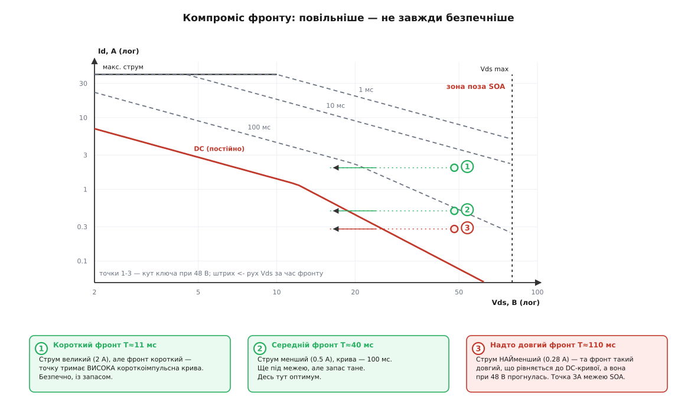
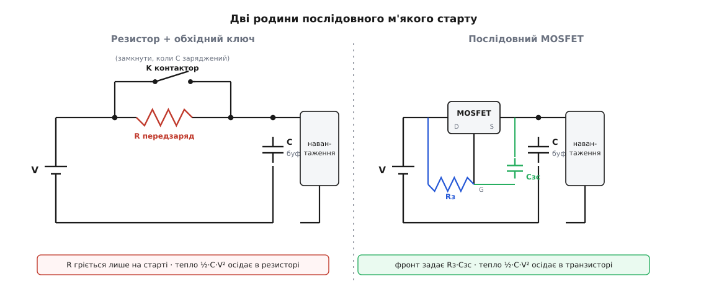
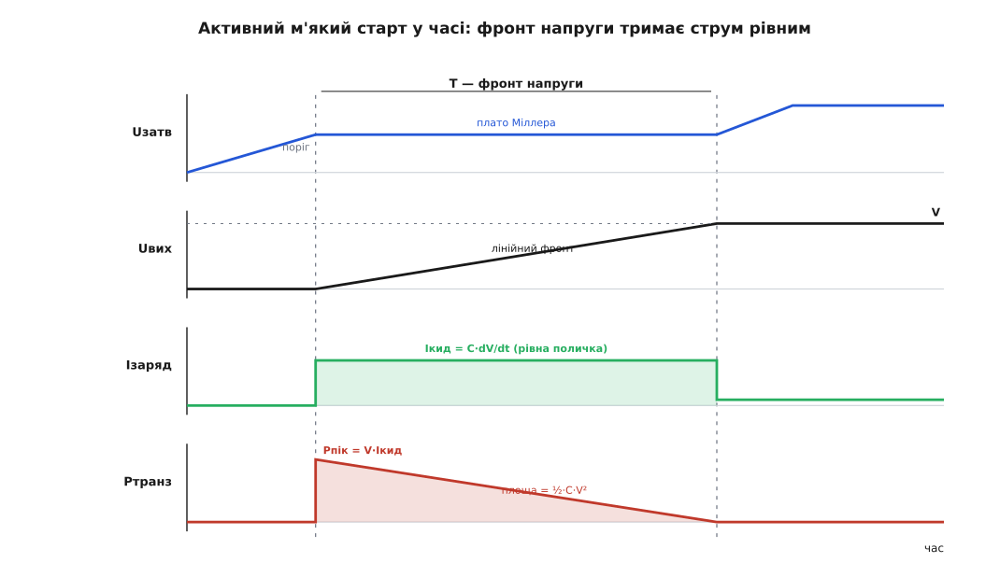

# Схеми м'якого старту

<preknowlist>
- [Кидок струму при вмиканні](topic:hw-power/inrush-current) — чому в мить подачі живлення розряджений вхід поводиться майже як коротке й тягне струм у десятки разів більший за робочий.
- [Конденсатор](topic:hw-components/capacitor) — зв'язок i = C·dV/dt: струм заряду визначає швидкість наростання напруги, а не навпаки.
- [Стала RC](topic:hw-analog/rc-time-constant) — як конденсатор заряджається через опір за експонентою зі сталою часу τ = R·C.
- [Силовий ключ](topic:hw-components/mosfet-power-switch) — MOSFET як послідовний прохідний ключ; що він не тільки «увімкнено/вимкнено», а має проміжну лінійну область, де поводиться як керований опір.
- [Безпечна робоча область (SOA)](topic:hw-components/soa-power-devices) — межа, у якій прохідний транзистор може одночасно тримати напругу й пропускати струм, не згорівши; вона тим тісніша, чим довший імпульс.
</preknowlist>

Схема м'якого старту (англ. *soft start* — «м'який пуск») розв'язує рівно одну задачу: узяти навантаження, що в мить увімкнення виглядає майже як [коротке замикання](topic:hw-power/inrush-current), і привести його до робочого стану без ривка струму. Задача звучить просто, а всі її розв'язки крутяться навколо одного невблаганного закону, який спершу здається несправедливим. Розберімо цей закон — і тоді кожна схема стане очевидним наслідком, а не окремим трюком, який доводиться запам'ятовувати.

## Закон, що керує всім: половина заряду згорає завжди

Почнімо з найпростішого мислимого м'якого старту — просто поставити послідовно резистор, який зрізає перший пік. Джерело напруги V заряджає крізь опір R розряджений буферний конденсатор C. Пік струму в першу мить — `V/R`, і що більший R, то менший пік. Здавалося б, збільшуй R — і втрати теж падають. Порахуймо, скільки енергії резистор при цьому спалить.

**Умова.** Джерело V, послідовний резистор R, розряджений конденсатор C заряджається до повної напруги V.

```
Заряд, що влився в конденсатор:   Q = C·V
Джерело віддало енергію:          Wдж = Q·V = C·V²
У конденсаторі осіло:             Wc  = ½·C·V²
Отже в резисторі згоріло:         Wr  = C·V² − ½·C·V² = ½·C·V²
```

Ось несправедливість: у формулі втрат `Wr = ½·C·V²` **немає R**. Хоч якою малою чи великою зроби опір, крізь нього на шляху до повного заряду проходить рівно половина всієї витраченої енергії — друга половина осідає в конденсаторі. Великий R лише розтягує це горіння в часі (більша стала τ = R·C), а не зменшує його. Струм менший — зате тече довше, і добуток той самий.

Це і є закон, від якого не втекти жодною послідовною схемою: **заряджаючи конденсатор до напруги V крізь будь-який розсіювальний елемент від «твердого» джерела, ти спалюєш у цьому елементі ½·C·V² — завжди.** М'який старт **не зменшує** втраченої енергії. Усе, що він може, — це вибрати, **як саме** розподілити ці ½·C·V²: коротким сплеском великої потужності чи довгим тлінням малої, у резисторі, у термісторі чи в транзисторі. Уся інженерія м'якого старту — це керування розподілом фіксованої порції тепла так, щоб жоден елемент не вийшов за свою межу: щоб не спрацював запобіжник, не приварилися контакти, не згорів ключ.

> 🔧 **Навіщо це.** Формула `½·C·V²` — це перше число, яке рахують, проєктуючи м'який старт. Для шини 400 В із конденсатором 1000 мкФ вона дає 80 Дж — стільки тепла елемент мусить прийняти щоразу на старті. Обереш резистор без запасу за імпульсною енергією — він трісне з першого ж увімкнення; недооціниш нагрів транзистора — він вийде за [безпечну робочу область](topic:hw-components/soa-power-devices). Обійти цей закон узагалі можна лиш одним способом — та спершу вичавимо максимум із послідовних схем, що йому підкоряються.

## Термістор: опір, що прибирає себе сам

Найдешевший м'який старт для мережевих блоків живлення — послідовний [NTC-термістор](topic:hw-sensing/ntc-thermistor) (англ. *Negative Temperature Coefficient* — «від'ємний температурний коефіцієнт»). Холодним він має відчутний опір — одиниці чи десятки ом, — який зрізає перший пік. А далі власний струм його розігріває, опір падає в десятки разів, і в усталеній роботі термістор майже не заважає. Опір, що прибирає себе сам, без жодного керування й без жодного додаткового ключа — уся принада в цьому.

Розплата ховається саме в тій самозмінності. По-перше, у роботі термістор увесь час гарячий і розсіює потужність: якщо гарячим він має 1 Ом і крізь нього тече 3 А, це `3²·1 = 9 Вт`, що гріють корпус приладу постійно. По-друге, і це головне, після вимикання термістору треба **охолонути** — кілька, а то й десяток секунд. Якщо живлення блимнуло й одразу повернулося, термістор ще гарячий, опір його малий, і кидок пройде майже безборонно, наче захисту немає. Тому термістор годиться там, де вмикають нечасто й дають йому охолонути; де живлення смикають раз по раз — потрібна схема, що не залежить від температури й ладна до старту щомиті.

## Резистор із обхідним ключем: додав опору — і прибрав

Наступний крок думки очевидний: якщо термістор поганий тим, що прибирає опір **повільно й ненадійно** (через нагрів), то приберімо опір **швидко й точно** — вимикачем. Ставимо послідовно звичайний резистор, який обмежує перший сплеск, чекаємо, поки конденсатор зарядиться, і тоді **закорочуємо** резистор — [реле](topic:hw-components/relay), силовим контактором чи [тиристором](topic:hw-components/thyristor-scr). Резистор працює лише кілька десятків мілісекунд на старті й у роботі не гріється зовсім, бо його вже немає в колі. Це класична схема передзаряду (англ. *precharge*) великих шин постійного струму — від зварювальних інверторів до силового кола електромобіля.

**Умова.** Шина V = 400 В, буферний конденсатор C = 1000 мкФ, передзарядний резистор R = 47 Ом.

```
Пік струму на старті:      Iпік = V / R   = 400 / 47      ≈ 8.5 А
Стала часу заряду:         τ    = R·C     = 47 · 1000·10⁻⁶ = 47 мс
Чекаємо ~5τ:               t    ≈ 5 · 47   ≈ 235 мс  (конденсатор на 99 %)
Енергія, що влетить у R:   Wr   = ½·C·V²  = ½ · 1000·10⁻⁶ · 400² = 80 Дж
Пікова потужність (t=0):   Pпік = V²/R    = 400² / 47    ≈ 3.4 кВт
```

**Висновок.** Пік у 8.5 А замість тисяч ампер — резистор зробив своє. Але зверніть увагу на два останні рядки: 80 Дж за чверть секунди означають миттєву потужність у три з половиною кіловати на самому початку. Звичайний резистор на 2 Вт від такого імпульсу вибухне, хоча *середня* потужність за старт мізерна. Тому в передзаряд ставлять резистори з великою **імпульсною** енергією (керамічні дротяні, розраховані на джоулі поштовхом), а не за середньою розсіюваною потужністю.

І тут причаїлася пастка, яка вбиває контакти й приварює реле. Обхідний ключ **не можна** замикати, поки конденсатор не зарядився. Уяви, що ключ спрацював, коли на конденсаторі ще 200 В: обхідний шлях має опір лічені міліоми, і різниця в 200 В жене крізь контакт, що тільки-но зійшовся, струм `200 / 0.02 = 10000 А`. Це другий кидок, страшніший за перший, — саме він зварює контактор намертво. Тому серйозний передзаряд не просто «чекає таймером», а **вимірює напругу на конденсаторі** й замикає обхід лише коли вона підійшла до напруги шини. Як це веде мікроконтролер — з наглядом за напругою, витримкою й аварійним таймаутом, якщо шина так і не зарядилася, — розписано в [проєкті-секвенсорі передзаряду](topic:hw-power/soft-start-circuits/proj-precharge-sequencer.md).

## Активний м'який старт: підняти напругу повільним фронтом

Резистор із ключем має два стани — «весь опір» і «нуль опору», перемикання стрибком. А що, як зробити опір **плавно змінним** і провести навантаження від короткого до робочого стану неперервно? Саме це робить активний м'який старт: послідовний [силовий MOSFET](topic:hw-components/mosfet-power-switch), який **вмикають повільно**, тримаючи його в лінійній області як керований опір, що поступово меншає від майже нескінченного до майже нульового.

Керуємо ми при цьому не струмом напряму, а **швидкістю наростання вихідної напруги**. Причина — той самий зв'язок `i = C·dV/dt`, що породжує кидок: струм заряду конденсатора дорівнює його ємності на швидкість зміни напруги. Розтягни фронт напруги — і струм заряду впаде рівно в стільки ж разів.

**Умова.** Вихід V = 48 В, буферний конденсатор C = 470 мкФ, хочемо тримати струм заряду не вище Iкид = 2 А.

```
Потрібна швидкість наростання:  dV/dt = Iкид / C = 2 / 470·10⁻⁶ ≈ 4255 В/с ≈ 4.3 В/мс
Час фронту до повних 48 В:      T     = V / (dV/dt) = 48 / 4255  ≈ 11 мс
```

Отже одинадцятимілісекундний фронт напруги тримає струм заряду рівним двом амперам увесь час наростання — не гострий пік, а рівна поличка, яку ми самі призначили. Практично такий фронт задають, повільно заряджаючи затвор транзистора: або через великий резистор (проста RC-крива), або — чистіше — конденсатором між затвором і стоком, який завдяки [ємності затвора та ефекту Міллера](topic:hw-components/gate-capacitance) змушує напругу наростати **сталим нахилом**, а не за експонентою. Повне виведення, чому конденсатор затвор-стік дає лінійний фронт `dV/dt = Iзатв / Cзс`, і як звідси випливає рівний струм заряду, — у [математиці керованого фронту](topic:hw-power/soft-start-circuits/math-mosfet-softstart.md).

Здавалося б, знайдено ідеал: жодного зайвого резистора, гладкий підйом, будь-який заданий пік. Але згадаймо закон. Ті самі ½·C·V² мусять десь згоріти — і тепер горіти нема де, крім самого транзистора. Поки триває фронт, MOSFET відкритий лише частково: на ньому висить напруга (спадає від повних 48 В до нуля), і крізь нього тече струм заряду. Добуток — це потужність, яку розсіює кристал.

```
Розсіяння в транзисторі за весь фронт:  Wтр = ½·C·V² = ½ · 470·10⁻⁶ · 48² ≈ 0.54 Дж
Пікова потужність (t=0, повна напруга):  Pпік = V·Iкид = 48 · 2 = 96 Вт
```

Ті самі півджоуля, що спалив би резистор, — тепер у транзисторі. Він приймає їх не рівно: на початку фронту напруга на ньому повна, струм уже повний, тож потужність стартує з 96 Вт і лінійно спадає до нуля, коли вихід дійшов до 48 В і напруги на ключі не лишилося. Середнє — близько 48 Вт протягом 11 мс.

> 🔧 **Навіщо це.** Тут криється пастка, що ловить новачків: «хочу менший струм — розтягну фронт довше». Розтягнеш удесятеро — струм упаде до 0.2 А, але тепер транзистор мусить тримати напругу й струм **уп'ятеро довше**, аж 110 мс. А [безпечна робоча область](topic:hw-components/soa-power-devices) транзистора тим тісніша, чим довший імпульс: за одну мілісекунду кристал витримає сотні ват, а на постійному струмі — лише одиниці. Тобто повільніший фронт **не завжди безпечніший**: він зменшує струм, але заганяє робочу точку в область, де межа SOA нижча. Енергія ½·C·V² однакова за будь-якого фронту — питання лише, влазить вона під криву SOA як короткий гарячий імпульс чи як довге тепле тління. Оптимальний фронт — не найдовший, а той, що лягає під SOA з запасом.


*Чому найповільніший фронт — не найбезпечніший. Робоча точка транзистора найгостріша на початку фронту: повна напруга й повний струм заряду. Короткий фронт (жовта точка) дає високий струм, але порівнюється з високою короткоімпульсною кривою SOA — з запасом. Дуже довгий фронт (червона точка) дає менший струм, зате триває так довго, що порівнюється з кривою постійного струму, яка при високій напрузі ще й прогинається донизу, — і точка з меншим струмом опиняється за межею. Оптимум — посередині.*

Ось чому активний м'який старт — це завжди спільна перевірка двох умов: пік струму досить малий (щоб не заважати джерелу й захисту) **і** робоча точка транзистора протягом усього фронту лишається в межах SOA. Ця сама схема, доповнена наглядом за струмом, стає [електронним запобіжником (eFuse)](topic:hw-power/efuse), а зібрана в спеціалізовану мікросхему з контролем SOA — контролером [гарячого підключення плат](topic:hw-power/hot-swap). У готових [навантажувальних ключах](topic:hw-power/load-switch) фронт часто задають одним зовнішнім конденсатором.


*Дві послідовні схеми. Ліворуч: резистор R обмежує перший сплеск, а коли конденсатор зарядився, контактор K закорочує R геть. Праворуч: послідовний MOSFET, чий затвор заряджають повільно (резистор Rз плюс конденсатор затвор-стік Cзс), піднімає вихідну напругу пологим фронтом. Обидві спалюють однакові ½·C·V² — у резисторі чи в транзисторі відповідно.*


*Що відбувається за час фронту T. Напруга затвора підіймається до порогу, тоді завмирає на міллерівській поличці — і саме тоді вихід наростає сталим нахилом. Струм заряду тримається рівною поличкою Iкид = C·dV/dt. Потужність на транзисторі стартує з V·Iкид (повна напруга, повний струм) і лінійно спадає до нуля — площа під нею дорівнює ½·C·V².*

## Єдиний спосіб не палити ½·C·V²: рухати саме джерело

Кожна з цих трьох схем — послідовний елемент між твердим джерелом і конденсатором, і тому кориться закону ½·C·V². Є один спосіб його обійти, і він логічно неминучий: не вставляти опір між джерелом і навантаженням, а **зробити саме джерело повільним** — щоб конденсатор заряджався тоді, коли напруга джерела ще мала, і повній напрузі не було на чому впасти.

Саме так стартує будь-який пристойний [імпульсний перетворювач](topic:hw-power/switching-converter). У нього є вивід м'якого старту: на старті внутрішнє опорне значення, з яким зрівнюється вихід, підіймають від нуля плавним фронтом (типово заряджаючи невеликий конденсатор сталим струмом). Перетворювач слухняно веде вихід за цим опорним — від нуля вгору, — і вихідні конденсатори наповнюються поступово, тимчасом як напруга на них увесь час близька до тієї, що перетворювач видає. Ключовий транзистор перетворювача при цьому качає енергію з високим ККД, а не палить її на собі: заряд у конденсатори надходить крізь дросель, а не крізь розсіювальний опір. Тому пів-C-V-квадрат тут просто **не виникає** як тепло — ось чому рухати джерело термічно вигідніше, ніж вставляти опір. Розплата інша: так можна лише тоді, коли «джерело» — активний перетворювач, яким ти керуєш, а не готова тверда шина.

Такий вивід став типовою ланкою імпульсних контролерів ще від перших монолітних мікросхем ШІМ середини 1970-х. Як прийом визрів — від пасивного термістора, що прибирає опір нагрівом, до окремого виводу, який навмисно вповільнює регулятор, — простежує [історія м'якого старту](topic:hw-power/soft-start-circuits/hist-soft-start-lineage.md).

> 🔧 **Навіщо це.** Вивід м'якого старту перетворювача рятує не лише від кидка на вході, а й від **викиду напруги** на виході. Без нього регулятор на старті бачить нульовий вихід, вважає це страшним провалом і жбурляє повний робочий цикл, розганяючи вихід із розгону — той вилітає вище номіналу й може пробити те, що живиться. Плавне опорне не дає [контуру зворотного зв'язку](topic:hw-power/control-loop-compensation) впасти в цей розгін: вихід підіймається рівно, без перельоту. Тому вмикати м'який старт у перетворювачі варто навіть там, де кидок сам собою не лякає.

## Що куди ставити

Вибір схеми диктує не смак, а те, чим є джерело й як часто вмикають.

- **Мережевий блок живлення, вмикають зрідка** — [NTC-термістор](topic:hw-sensing/ntc-thermistor). Дешево, пасивно, надійно. Дати йому охолонути між вмиканнями.
- **Мережа з частими циклами** — термістор із обхідним реле: термістор ловить перший пік, реле за мить його закорочує, і повторне вмикання не залежить від того, чи термістор охолов.
- **Велика шина постійного струму (інвертор, привід, електромобіль)** — передзарядний резистор із контактором і **вимірюванням** напруги перед замиканням обходу.
- **Плата, яку вставляють у живу систему; навантажувальний ключ** — активний MOSFET-старт із заданим фронтом і перевіркою SOA.
- **Живлення робить сам імпульсний перетворювач** — його вивід м'якого старту; послідовних елементів на вході часто взагалі не треба.

Кілька спільних граблів. Затворний конденсатор активного старту треба **розряджати** при вимкненні живлення — інакше на швидкому повторному ввімкненні він ще заряджений, фронт не спрацює, і кидок пройде повз. Якщо ключ має ще й блокувати зворотну напругу (наприклад, від помилки полярності), одного MOSFET мало через його вбудований діод — ставлять [пару транзисторів спина-до-спини](topic:hw-power/mosfet-back-to-back). А зовсім інша фізика — у плавному пуску **змінного** навантаження (мотори, трансформатори): там кидок родом не лише з конденсатора, і керують ним фазовою комутацією, про що окремо — [плавний пуск змінного навантаження](topic:hw-power/soft-start-ac).

Усі ці схеми — варіації однієї думки. Кидок є тому, що навантаження в мить t = 0 і в усталеній роботі — це дві різні речі: розряджений конденсатор проти зарядженого. М'який старт пом'якшує перехід між ними, розтягуючи його в часі. Якщо перехід іде крізь послідовний елемент — цей елемент неминуче з'їсть ½·C·V², і вся майстерність у тім, щоб розкласти це тепло під межами кожної деталі. А якщо вдається зробити повільним саме джерело — плата за плавність зникає, бо повній напрузі більше нема де впасти.
