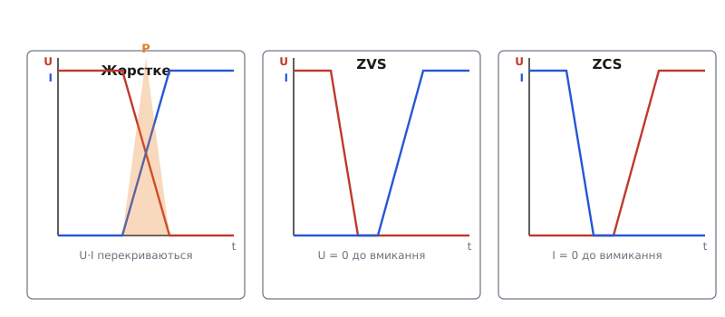
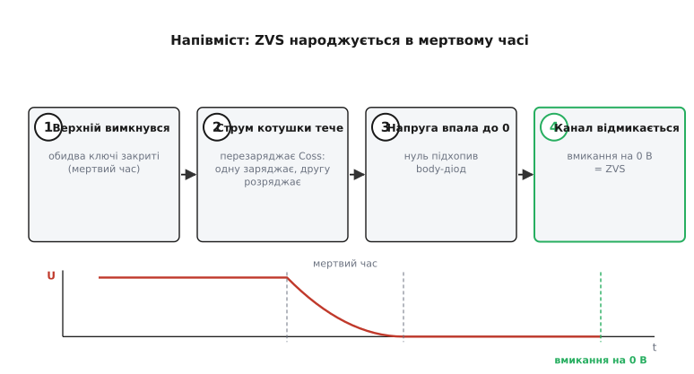
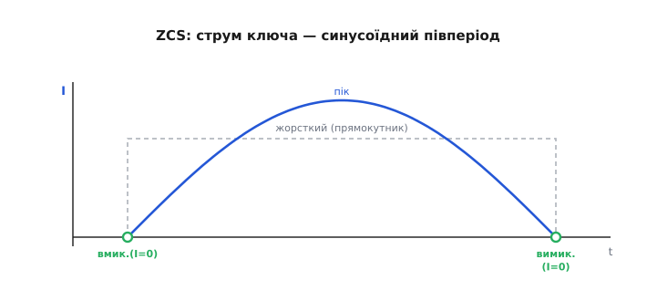

# М'яке перемикання: ZVS і ZCS

<preknowlist>
- [Втрати перемикання](topic:hw-components/switching-losses) — звідки береться спалах тепла, коли ключ переходить зі стану в стан; три доданки: перекриття U·I, розряд Coss, зворотне відновлення діода.
- [Силовий MOSFET](topic:hw-components/mosfet-power-switch) — як транзистор працює ключем, що таке відкритий канал і напруга на стоці.
- [Вихідна ємність і заряд затвора](topic:hw-components/gate-capacitance) — паразитні ємності MOSFET; що таке Coss і чому вона запасає енергію.
- [Body-діод MOSFET](topic:hw-components/body-diode) — паразитний діод між витоком і стоком, який проводить, коли канал закритий.
- [Зворотне відновлення діода](topic:hw-components/body-diode-reverse-recovery) — чому p-n-діод не закривається миттєво і сипле сплеск струму назад.
</preknowlist>

Ключ у силовій схемі гріється не тоді, коли він відкритий, і не тоді, коли закритий, — а рівно в ту коротку мить, коли він **переходить** між станами. У цю мить на ньому одночасно є і напруга, і струм, їхній добуток спалахує теплом, і цей [спалах повторюється на кожному перемиканні](topic:hw-components/switching-losses). Помножений на сотні тисяч перемикань за секунду, він і ставить стелю частоті імпульсного перетворювача: підняв частоту — виграв у розмірі котушки, але ключ починає пекти.

Звичний спосіб боротьби — прискорити перехід, щоб спалах був вужчий. Але є радикальніший хід, який б'є в саму причину. Спалах живе з добутку U·I у момент переходу. А що, як улаштувати схему так, щоб у **той самий момент** одна з цих двох величин уже дорівнювала нулю? Тоді хоч перехід і не миттєвий, добуток U·I у ньому мізерний — і спалаху майже немає. Ключ переходить «на нулі», плавно, холодно. Це й є **м'яке перемикання** *(soft switching)*, на противагу звичайному **жорсткому** *(hard switching)*, де транзистор перемикають «в лоб», під повною напругою й повним струмом.

Двоє воріт до нуля дають дві родини м'якості: занулити напругу перед вмиканням — **ZVS**; занулити струм перед вимиканням — **ZCS**. Розберімо, як саме кожен нуль створюють, чому ці два способи не взаємозамінні, і що вони прибирають із теплового рахунку ключа.

> 🔧 **Навіщо це.** Це та ідея, завдяки якій зарядка ноутбука на 100 Вт вміщається в долоню й лишається ледь теплою. Жорсткий перетворювач на такій частоті пік би нещадно; м'який проходить перемикання в нульовій точці — і тому його можна ганяти на сотнях кілогерц чи мегагерцах, а з частотою тане й трансформатор, і радіатор. За кожним тонким блоком живлення й кожним резонансним перетворювачем стоїть саме цей трюк.

## Дві точки нуля: чому їх рівно дві

Придивімося до одного перемикання. Ключ веде струм I і тримає напругу U (у різні миті), а між станами добуток U·I мусить пройти крізь свій максимум — бо жодна з величин не стрибає вмить. Саме цей проміжний добуток і є тепло. Щоб його вбити, треба, щоб у момент переходу хоча б один множник був нулем. Множників рівно два — напруга й струм, — тому й точок нуля рівно дві, і кожна дає свою родину м'якого перемикання.

**Занулити напругу перед вмиканням — ZVS** *(zero-voltage switching, перемикання при нулі напруги)*. Влаштовуємо схему так, щоб **до** миті вмикання напруга на ключі вже впала до нуля — її «зняла» стороння дія (резонанс, струм котушки). Тоді транзистор відмикається на нулі вольт: хоч би який струм пішов далі, добуток на нулі напруги дорівнює нулю. ZVS прибирає спалах **вмикання**.

**Занулити струм перед вимиканням — ZCS** *(zero-current switching, перемикання при нулі струму)*. Дзеркально: влаштовуємо так, щоб струм крізь ключ **до** миті вимикання сам зійшов у нуль. Тоді транзистор розмикається на нулі ампер: хоч би яка напруга з'явилася на ньому далі, добуток на нулі струму дорівнює нулю. ZCS прибирає спалах **вимикання**.


*Жорстке перемикання (ліворуч): напруга й струм перекриваються, добуток U·I дає спалах тепла. ZVS (центр): напруга дотиснута до нуля ще до вмикання, тож у мить переходу U·I ≈ 0. ZCS (праворуч): струм зведений до нуля до вимикання, знову U·I ≈ 0. У кожному м'якому випадку транзистор перемикається там, де один множник уже нульовий.*

Здавалося б, симетрія повна — просто занулюй що завгодно. Але річ у тім, що вмикання й вимикання **не симетричні** за тим, які втрати вони несуть. У кремнієвому MOSFET вмикання зазвичай **гарячіше**: до простого перекриття U·I там додаються ще дві приховані втрати — розряд вихідної ємності Coss і сплеск зворотного відновлення діода. Тож ZVS, який лікує саме вмикання, б'є не лише по перекриттю, а й по цих двох додатках — і тому для MOSFET ZVS цінніший. А ZCS природний там, де прилад узагалі не можна вимкнути «в лоб» — у тиристора. Розберімо обидва механізми зблизька.

## ZVS: як дотиснути напругу до нуля

Секрет ZVS у тому, що між стоком і витоком MOSFET **уже висить конденсатор** — його власна вихідна ємність [Coss](topic:hw-components/gate-capacitance). У жорсткому перемиканні це проблема: коли ключ вимкнений і тримає напругу U, ця ємність заряджена до U, тобто в ній запасено ½·Coss·U². При вмиканні транзистор замикає стік на витік майже накоротко — і весь цей запас розряджається **крізь власний канал**, обертаючись на тепло всередині кристала. Ця втрата не залежить від струму навантаження й квадратично росте з напругою; у високовольтних схемах вона часто головна.

ZVS перевертає ситуацію. Замість того щоб дати ключу самому розрядити свою Coss у канал, ми **зовнішнім струмом** розряджаємо цю ємність **до** вмикання — і лише тоді, коли напруга на ній уже впала до нуля, вмикаємо транзистор. Тепер розряджати нема чого: ключ відмикається на нулі вольт, у канал не влітає жодного джоуля запасеної енергії. Втрата ½·Coss·U² не зменшилася — вона **зникла**, бо ємність розрядилася м'яко, у зовнішню котушку, а не гаряче, у власний канал.

Хто ж дає той зовнішній струм? Найчастіше — **індуктивність**, яка в момент переходу не хоче міняти свій струм і тому продовжує гнати його крізь вузол, розряджаючи Coss. У напівмостовій схемі це виглядає так. Обидва ключі вимкнено (це навмисна пауза, **мертвий час**), а струм котушки навантаження нікуди не подівся й мусить кудись текти. Він тече крізь вузол напівмоста й **перезаряджає** обидві вихідні ємності: ємність ключа, який щойно вимкнувся, підзаряджає, а ємність ключа, який зараз вмикатиметься, **розряджає**. Коли напруга на майбутньому ключі спадає до нуля, її підхоплює його [body-діод](topic:hw-components/body-diode) — і фіксує стік практично на витоку. Ось тепер, поки body-діод тримає нуль напруги, драйвер відмикає канал: ZVS відбувся, добуток U·I у мить переходу нульовий.


*Послідовність ZVS у напівмості. 1 — верхній ключ вимкнувся, обидва закриті (мертвий час). 2 — струм котушки Lr тече крізь вузол і перезаряджає вихідні ємності: одну заряджає, другу розряджає. 3 — напруга на нижньому ключі впала до нуля, її підхопив body-діод. 4 — драйвер відмикає канал уже на нулі вольт: ZVS. Якщо ввімкнути раніше кроку 3, отримаєш жорстке перемикання.*

Звідси випливає ключова умова ZVS: **струму котушки має вистачити**, щоб устигнути перезарядити ємності за відведений мертвий час. На важкому навантаженні струм великий — ємності перезаряджаються швидко, ZVS впевнений. А на **легкому** навантаженні струм малий, ємності повзуть повільно, і за мертвий час напруга може не встигнути дійти до нуля — тоді ключ вмикається під залишковою напругою, і частина втрати повертається. Тому «ZVS втрачається на легкому навантаженні» — типова фраза в даташитах резонансних контролерів: м'якість тримається лише доти, доки в схемі циркулює достатній струм.

> 🔧 **Навіщо це.** Коли резонансний блок живлення холодний під повним навантаженням, але помітно тепліє на холостому ходу чи на легкому — це майже напевно **зрив ZVS**: струму забракло, щоб дотиснути Coss до нуля, і перемикання стало напівжорстким. Знаючи механізм, ти шукаєш не «поганий ключ», а причину малого циркулюючого струму: занизьку намагнічувальну індуктивність, задовгий мертвий час чи роботу поза розрахунковим діапазоном.

## ZCS: як звести струм до нуля

ZCS підходить із другого боку — занулює **струм** перед вимиканням. Тут головний герой — послідовна **індуктивність** резонансного контуру: разом із конденсатором вона змушує струм крізь ключ бути не прямокутним, а **синусоїдним півперіодом**. Струм плавно наростає від нуля, доходить до піка й так само плавно повертається **в нуль** — і саме в цю природну нульову точку схема вимикає ключ. Оскільки в мить вимикання струм уже нуль, спалах вимикання зникає сам собою.

Разом зі спалахом зникає ще одна прикрість — **зворотне відновлення** діода. Коли струм крізь ключ гаситься не різко, а плавно спадає до нуля, [накопичений у діоді заряд](topic:hw-components/body-diode-reverse-recovery) встигає розсмоктатися природно, без різкого сплеску зворотного струму. Тому ZCS цінний саме там, де в схемі стоять діоди зі значним зарядом відновлення (звичайні кремнієві, як у високовольтних випрямлячах): плавне гасіння струму робить їх «м'якими».

Історично ZCS — рідна стихія **тиристора** *(SCR)*. Тиристор має неприємну властивість: увімкнувшись, він **не вимикається** сигналом керування — щоб його закрити, треба, щоб струм крізь нього сам упав нижче струму утримання. Резонансний контур робить рівно це: гойднувши струм синусоїдою, він природно проводить його крізь нуль, і тиристор гасне сам. Тому перші **резонансні** перетворювачі, ще на тиристорах, працювали саме в режимі ZCS — не заради ККД, а тому що інакше тиристор було просто **нічим вимкнути** на високій частоті.


*ZCS: послідовна котушка Lr із конденсатором Cr роблять струм ключа не прямокутником, а синусоїдним півперіодом. Струм наростає від нуля, проходить пік і плавно повертається в нуль — і саме тут схема вимикає ключ. Оскільки в мить вимикання i = 0, спалах вимикання й сплеск зворотного відновлення діода зникають.*

## ZVS чи ZCS: коли який

Обидва режими прибирають спалах, але з різних кінців — і для сучасного кремнієвого чи широкозонного MOSFET це не байдуже. Причина в тій самій вихідній ємності Coss.

У **ZCS** ми вимикаємо ключ на нулі струму — чудово. Але потім він знову вмикатиметься, і вмикатиметься під **напругою**: його Coss на той момент заряджена, і при вмиканні вона розрядиться в канал — та сама втрата ½·Coss·U², якої ZCS не чіпає. Тобто ZCS лікує вимикання, але лишає гарячим вмикання через Coss. Для приладів із помітною Coss (звичайні кремнієві MOSFET) це відчутна вада, і саме тому на високих частотах перевагу віддають ZVS.

У **ZVS** усе навпаки й вигідніше для MOSFET: вмикання відбувається на нулі напруги, тож Coss розряджається м'яко, у зовнішній струм, а не в канал. ZVS прибирає найдорожчу для MOSFET втрату — Coss-розряд — і тому саме він став стандартом сучасних резонансних перетворювачів на MOSFET, SiC і GaN.

Коротко правило звучить так: **MOSFET любить ZVS** (бо ZVS прибирає розряд його Coss у канал), **тиристор і схеми зі «слабкими» діодами люблять ZCS** (бо ZCS гасить струм плавно й дає тиристору вимкнутися). Часто в реальних топологіях один ключ працює в ZVS, а інший — у ZCS, або перетворювач комбінує обидва; але базовий вибір диктується саме тим, чого коштує вихідна ємність приладу.

**Скільки економить ZVS.** Порахуймо на пальцях, що дає перехід від жорсткого вмикання до ZVS для одного ключа. Хай напруга шини U = 400 В (типова для мережевого блоку після [коректора коефіцієнта потужності](topic:hw-analog/power-factor)), вихідна ємність за даташитом дає енергію Eoss = 300 нДж при цій напрузі, частота f = 200 кГц. У жорсткому вмиканні цей запас щоразу згоряє в каналі; у ZVS — не згоряє зовсім.

```c
// Прошивка контролера прикидає, скільки тепла в ключі знімає ZVS.
// Це втрата Coss-розряду, яку жорстке вмикання дарує кристалу,
// а ZVS прибирає повністю.
float Eoss = 300e-9f;      // енергія вихідної ємності при робочій напрузі, Дж
float f    = 200000.0f;    // частота перемикання, Гц

float P_hard = Eoss * f;   // втрата Coss на жорсткому вмиканні:
// = 300e-9 * 200000 = 0.06 Вт  — на 200 кГц дрібно

float f_hi   = 2000000.0f; // а тепер підіймемо частоту до 2 МГц
float P_hi   = Eoss * f_hi;
// = 300e-9 * 2000000 = 0.6 Вт  — уже помітний гарячий доданок,
//   якого ZVS позбавляє повністю
```

На 200 кГц ця втрата дрібна — 0.06 Вт, і здається, що ZVS не вартий заходу. Але вона росте **лінійно з частотою**, і на 2 МГц це вже 0.6 Вт **на кожен ключ** — тепло, яке жорсткий перетворювач мусив би відвести радіатором, а м'який просто не створює. Ось чому ZVS — не косметика, а **перепустка до мегагерцового діапазону**: без нього частоту не задереш, бо Coss-розряд запече кристал; із ним — цієї стелі просто немає, бо втрату усунуто, а не зменшено.

## Мертвий час: вузьке вікно, у яке треба влучити

І ZVS, і ZCS тримаються на точному **таймінгу**, і центральне поняття тут — **мертвий час** *(dead time)*: коротка пауза, коли **обидва** ключі напівмоста вимкнено. Ця пауза потрібна з двох причин водночас, і вони тягнуть у різні боки.

По-перше, мертвий час **обов'язковий** проти наскрізного струму. Якщо вмикати другий ключ, поки перший ще не встиг закритися, обидва на мить виявляться відкритими — і шина замкнеться сама на себе крізь пару транзисторів. Це **наскрізний струм** *(shoot-through)*: короткий, потужний, руйнівний імпульс, що легко вбиває ключі. Пауза між «вимкнув один» і «ввімкнув другий» гарантує, що такого перекриття не станеться.

По-друге — і саме тут народжується ZVS — під час цієї паузи струм котушки **перезаряджає вихідні ємності**, дотискаючи напругу майбутнього ключа до нуля. Тобто мертвий час — це не просто запобіжник, а **робоче вікно**, у якому й відбувається занулення напруги. І звідси випливає тонкий баланс:

```
мертвий час ЗАМАЛИЙ  → напруга не встигла дійти до нуля → ключ вмикається жорстко (втрата)
мертвий час ЗАВЕЛИКИЙ → після нуля напруга «відкотилася» назад через body-діод → знову втрата
                         + довше тече body-діод → зайве тепло в ньому
мертвий час У САМИЙ РАЗ → ключ вмикається рівно в мить нуля напруги → чистий ZVS
```

Оптимальний мертвий час залежить від струму навантаження (бо саме струм задає, як швидко перезаряджаються ємності): на важкому навантаженні нуль настає раніше, на легкому — пізніше. Тому просунуті контролери **підлаштовують** мертвий час під навантаження, женучись за нульовою точкою. Помилишся в цей бік чи в той — і ретельно збудований ZVS обертається напівжорстким перемиканням із втратами.

> 🔧 **Навіщо це.** Коли новий резонансний перетворювач гріється дужче за розрахунок, перше, куди дивляться інженери, — **мертвий час**. Замалий — ключі вмикаються під залишковою напругою; завеликий — марно горить body-діод і напруга встигає відкотитися. Осцилограф на стоці ключа одразу показує правду: якщо напруга **дійшла до нуля й полежала** перед фронтом вмикання — ZVS є; якщо ключ вмикається на **сходинці** ще ненульової напруги — таймінг збитий, і саме звідти зайве тепло.

## Що м'яке перемикання дає й чого коштує

Складімо картину. М'яке перемикання прибирає **головну** плату імпульсного перетворювача — [спалах на комутації](topic:hw-components/switching-losses) — не прискоренням переходу, а зануленням одного з множників U·I у мить переходу. ZVS занулює напругу перед вмиканням (і заразом прибирає розряд Coss у канал — найдорожчу втрату MOSFET); ZCS занулює струм перед вимиканням (і заразом гасить сплеск зворотного відновлення діода й дає тиристору вимкнутися). Створюють ці нулі резонансні елементи — котушка й конденсатор, — а влучають у нульову точку точним таймінгом, серцем якого є мертвий час.

Виграш — прямий і великий. Прибравши втрати комутації, частоту можна підняти в рази — на сотні кілогерц чи мегагерци, — майже не платячи теплом. А вища частота означає **менші** магнітні деталі й конденсатори: та сама енергія на цикл, але циклів більше, тож на кожен треба менше запасу. Звідси тонкі й холодні блоки живлення, щільні серверні перетворювачі, зарядки, що поменшали з появою [GaN-ключів](topic:hw-components/specific-on-resistance-metric). Плюс менше **завад**: плавні, а не різкі фронти дають бідніший на гармоніки спектр, тож [м'яке перемикання простіше проходить норми ЕМС](topic:hw-power/emc-filtering), ніж жорстке зі своїми крутими краями й дзвоном.

Ціна теж чесна. М'яке перемикання **не безкоштовне**: воно вимагає резонансних елементів (додаткові котушка й конденсатор або майстерне використання паразитних), точного керування частотою й мертвим часом, а головне — **тримається лише у своєму діапазоні**. Вибіг за межу навантаження чи входу — і струму забракло на дотиснення нуля, ZVS/ZCS зривається, повертаються жорсткі втрати, а з ними ризик перегріву. Тому реальні [резонансні перетворювачі](topic:hw-power/resonant-converter) стережуть свої межі залізно: контролер не пускає робочу точку туди, де м'якість гине. Жорстке перемикання простіше й усеїдне, м'яке — холодніше й тихіше, але вибагливіше; де межа приладу по теплу стає стіною, туди й приходить м'яке перемикання, аби цю стіну відсунути.

Ідея м'якого перемикання не з'явилася одразу — вона [виросла з боротьби за високу частоту](topic:hw-power/soft-switching-zvs-zcs/hist-soft-switching-origins.md): від тиристорних резонансних інверторів, де ZCS був єдиним способом узагалі вимкнути прилад, до квазірезонансних перетворювачів 1980-х, де ZVS свідомо зробили інструментом проти втрат Coss і відчинили двері в мегагерци.
