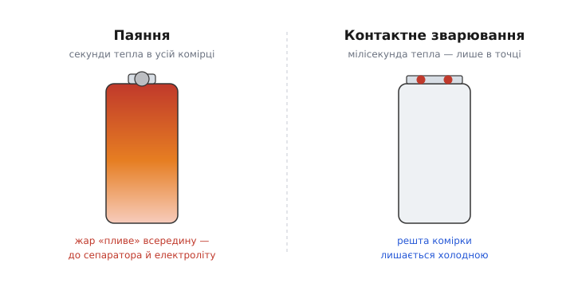
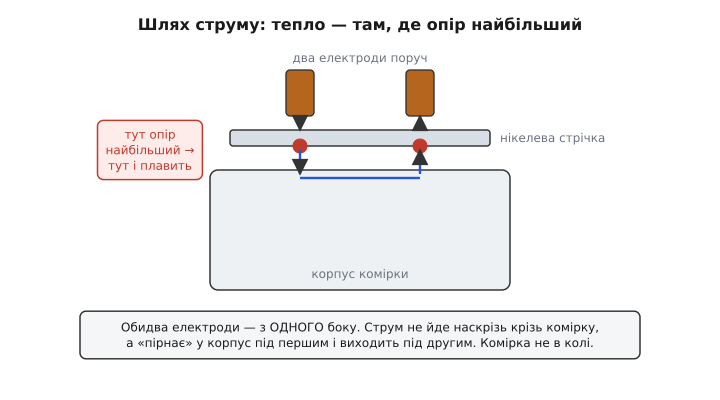
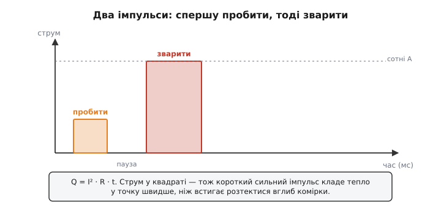

# Контактне зварювання в батарейних збірках

Складеш батарею з двох комірок — і одразу стаєш перед простим на вигляд питанням: чим їх з'єднати? Дротом і паяльником, як усе інше в електроніці? Виявляється, ні. Комірки в збірках майже завжди **зварюють** — притискають до клеми тонку металеву стрічку й на частку секунди пропускають крізь стик величезний струм, який сплавляє метал у точці дотику. Паяльник тут не просто гірший — він шкодить. Розберімо, **чому** саме зварювання, як народжується та точка сплаву й що робить з'єднання надійним.

Ідеться про літієві комірки — циліндричні (як [18650](root:hw-power/batteries)) чи пласкі «пакетики». Це саме той спосіб, яким збирають батареї дронів, електроінструменту, повербанків і електромобілів: не пайка, а короткий струмовий удар.

> 🔧 **Навіщо це.** Якщо колись збиратимеш чи ремонтуватимеш батарейну збірку, перше, що доведеться вирішити, — не «яким припоєм», а «яким зварювальником». Зрозумівши механізм, ти правильно вибереш стрічку, виставиш енергію імпульсу й не зіпсуєш дорогі комірки першим-ліпшим дотиком паяльника.

### Чому не паяльником

Причина одна, і вона фізична: **час, який комірка проводить під жаром**. Щоб припаяти дріт до сталевого корпусу комірки, паяльник мусить прогріти саму клему до температури плавлення припою — а це секунди контакту з жалом на 300–350 °C. І весь цей час тепло не сидить на п'ятачку, де ти паяєш: воно **тече** крізь метал углиб комірки — до того місця, де сталевий корпус майже впритул до згорнутих у рулон електродів, сепаратора й електроліту.

А літієва хімія тепла не любить. Перегрів сепаратора (тонкої плівки, що розділяє «плюсовий» і «мінусовий» шари) псує його незворотно; електроліт від жару розкладається; у гіршому разі це запускає ланцюг, який називають [тепловим розгоном](root:hw-components/thermal-runaway) — коли розігрів сам себе живить і комірка спалахує. Навіть якщо до пожежі не дійшло, перегріта комірка тихо втрачає ємність і живучість. Отже, шкодить не сам факт нагріву, а **тривалість**: секунди прогріву — це багато.


*Дві дороги вкласти метал у клему. Паяльник (ліворуч) мусить прогріти клему секундами — і жар «пливе» всередину, до сепаратора й електроліту, які цього не терплять. Контактне зварювання (праворуч) кладе тепло за мілісекунди й лише в двох крихітних цятках під електродами; решта комірки не встигає нагрітися.*

Ось де народжується вся ідея зварювання. Що, якби нагрів був **надкоротким** — не секунди, а мілісекунди — і **точковим**, лише там, де метал плавиться, а не по всій клемі? Тоді гаряча зона просто не встигне розповзтися вглиб: імпульс скінчився раніше, ніж тепло дійшло до вразливого нутра. Саме це й робить контактне зварювання (англ. *spot welding* — «точкове зварювання»): б'є коротко, сильно й локально.

### Тепло з опору: чому взагалі щось плавиться

Звідки в зварюванні береться тепло? З того самого закону, що гріє будь-який провідник під струмом. Коли струм *I* тече крізь опір *R* протягом часу *t*, він виділяє тепло:

```
Q = I² · R · t
```

Це і є ключова формула всієї теми. Придивись до неї уважно — у ній заховано, чому зварювання взагалі можливе.

По-перше, струм у **квадраті**. Подвоїш струм — тепла вчетверо більше. Тому зварювальник жене крізь стик не звичайні ампери, а **сотні ампер** на частку секунди: за такого струму навіть мізерний опір дає лавину тепла.

По-друге, це тепло сідає **там, де опір *R* найбільший**. І ось головна тонкість: у ланцюзі «електрод → стрічка → корпус комірки» найбільший опір — не в товщі металу, а на **межах дотику**. Дві металеві поверхні ніколи не торкаються ідеально: справжній контакт іде лише крихітними горбками, а між ними — повітря, оксид, бруд. Тому **контактний опір** (опір самого стику двох поверхонь) у рази більший за опір суцільного металу навколо. Струм, протискаючись крізь ці горбки, саме там і виділяє найбільше тепла — а отже, саме там метал розжарюється й плавиться першим. Це те саме явище, через яке будь-яке [погане з'єднання гріється](root:hw-analog/internal-resistance) дужче за добрий провідник; тут його зробили корисним.

По-третє, час *t*. Тепла тим більше, чим довше тече струм, — але довгий струм устигне й розтектися вглиб. Тому виграє коротка потужна порція: великий *I* за малий *t* кладе тепло у точку **швидше**, ніж воно розповзається. Це і є той компроміс, заради якого все й затіяно.


*Куди тече струм і де гріє. Обидва електроди стоять поруч, з одного боку. Струм не йде наскрізь крізь комірку — він пірнає в корпус під першим електродом, проходить коротким шляхом попід поверхнею й виходить під другим. Найбільший опір — на двох межах «стрічка–корпус»; там і народжуються дві гарячі точки, які сплавляють метал.*

Зверни увагу на важливе, що видно з малюнка: **обидва електроди притиснуті з одного боку**, поруч. Це не випадковість. Якби струм ішов наскрізь крізь комірку (електрод зверху, електрод знизу), то він проходив би крізь її нутро — і грів би саме те, що ми бережемо. А так струм лише «пірнає» у корпус під першим електродом і виринає під другим; сама комірка практично не в колі. Це називають зварюванням із **двобічним однобічним підведенням** — обидва полюси з одного боку. Проста ідея, а рятує комірку.

> 🔧 **Навіщо це.** Звідси випливає найпоширеніша помилка новачка: розсунути електроди задалеко. Що більша відстань між ними, то довший шлях струму попід поверхнею, то більше струму йде «в обхід» — і замість двох гарячих точок дістаєш кволий прогрів. Тому наконечники ставлять **близько** один до одного (кілька міліметрів), але не впритул, щоб струм не пішов прямо між ними, минаючи стик зі стрічкою.

### Стрічка, а не дріт: чому нікель

Комірки з'єднують не дротом, а плоскою **стрічкою** — найчастіше нікелевою. Тут теж є причина, і не одна.

Плоска стрічка добре лягає на плаский торець комірки, дає велику площу контакту й легко тримає під собою два електроди поруч. Дріт до такого стику не пасує. А нікель узяли за поєднання рис: він не надто добре проводить (а отже, під час зварювання **сам гріється** в потрібній зоні, помагаючи сплаву), витримує потрібний струм, не іржавіє й добре зварюється з корпусом комірки, який теж часто нікельований.

Тут ховається повчальний парадокс, з якого видно, що «краще проводить» не завжди «краще для зварювання». Стрічки бувають двох ґатунків: **чистий нікель** і **нікельована сталь** (сталева стрічка з тонким шаром нікелю).

- **Нікельована сталь** зварюється **легше**. Сталь має питомий опір разів у п'ятнадцять–двадцять вищий за чистий нікель, тож під струмом гріється дуже охоче — і слабенький, навіть саморобний зварювальник дає добру точку. Але той самий високий опір лишається в збірці **назавжди**: стрічка гріється й на робочому струмі, коли батарея просто віддає енергію, і марнує на собі напругу.
- **Чистий нікель** зварювати **важче** (нижчий опір — менше тепла в стику, треба потужніший імпульс), зате в готовій батареї він **майже не гріється** і не з'їдає напругу. Тому потужні збірки, де крізь стрічку течуть десятки ампер, роблять на чистому нікелі, миряться зі складнішим зварюванням.

Отже, вибір стрічки — це компроміс: легкість зварювання проти втрат у роботі. Той самий опір, що помагає зварити, потім заважає віддавати струм. Для сильнострумових збірок (де важить кожен [C-rate](root:hw-power/c-rate)) беруть чистий нікель або товщу стрічку; для слабких — дешевшу нікельовану сталь. А коли струми зовсім великі, до нікелю додають мідь — але суто мідь зварюється кепсько (надто добре проводить і відводить тепло), тож її або сталять з нікелем зверху, або з'єднують інакше.

### Звідки береться той струм: три способи вдарити

Сотні ампер за мілісекунди — звичайне джерело так не вміє. Тому зварювальники будують навколо одного питання: **як накопичити енергію повільно, а віддати вмить**. Три головні підходи.

**Від акумулятора.** Найпростіше: узяти сильнострумову комірку (або кілька), яка сама здатна віддати сотні ампер, і на мілісекунди замкнути коло через електроди силовим ключем. По суті це кероване [коротке замикання](root:hw-analog/short-circuit) сильного джерела на потрібний час. Дешево й популярно в саморобках, але струм залежить від заряду й стану комірки, тож точки виходять неоднакові.

**Від трансформатора.** Класика промислових апаратів: трансформатор із багатьма витками первинної обмотки й **одним-двома** витками грубезної вторинної. Мережеві сотні вольтів він перетворює на кілька вольтів, зате з величезним струмом (напруга падає — струм росте). Керована в часі частина мережевого періоду й дає імпульс. Потужно й стабільно, але апарат важкий.

**Від конденсаторів (розряд ємності).** Найточніший спосіб. Банк конденсаторів **повільно** заряджають до заданої напруги, накопичуючи енергію, а тоді **вмить** розряджають крізь стик. Уся сила тут у тому, що порція енергії щоразу **однакова** — вона задана напругою заряду, а не примхами мережі чи заряду акумулятора:

```
E = ½ · C · U²
```

Тому точки виходять на диво повторюваними, і саме такі апарати ставлять на серйозне виробництво. Заряджається банк секунди, розряджається — мілісекунди; цикл «зарядив–стрельнув» повторюють раз за разом.

Спільне в усіх трьох — розрив у часі: **накопичуй довго, віддавай коротко**. Джерело не мусить уміти віддати сотні ампер безперервно; воно лише мусить встигнути віддати їх на ту мілісекунду, поки триває точка.

> 🔧 **Навіщо це.** Ключ, що комутує ці сотні ампер, — окрема інженерна задача: звичайне реле згорить, тож беруть [силовий MOSFET-ключ](root:hw-components/mosfet-power-switch) (часто кілька паралельно), який замикає коло на задані мілісекунди. Саме на ньому тримається керування енергією точки: тривалість імпульсу задає прошивка, а транзистор мусить пережити піковий струм.

### Два імпульси: спершу пробити, тоді зварити

Придивившись до доброго зварювальника, помітиш, що він часто б'є не одним імпульсом, а **двома** поспіль із короткою паузою. Це не примха, а розумний хід проти головного ворога — **оксиду й брудного контакту**.

Перший імпульс — слабший — не так плавить, як **готує** стик: продавлює оксидну плівку на поверхні, згладжує мікрогорбки, притирає стрічку до корпусу. Після нього контакт стає чистішим і рівнішим — а отже, передбачуванішим за опором. Другий імпульс — сильніший — уже по підготованому стику кладе **робочу** порцію тепла й сплавляє ядро точки. Так удається обійти те, що на «сирому» контакті опір гуляє від дотику до дотику: перший імпульс приводить його до тями, другий зварює однаково добре.


*Профіль струму доброго зварювання. Спершу кволий імпульс «пробити» — він продавлює оксид і притирає стрічку до корпусу, роблячи контакт передбачуваним. Тоді, після паузи, потужний імпульс «зварити» сплавляє ядро точки. Оскільки тепло йде як I², короткий сильний удар устигає розжарити метал раніше, ніж жар розтече вглиб комірки.*

Скільки саме тривати кожному імпульсу — залежить від стрічки й струму, і тут якраз потрібна прошивка, що точно відміряє мілісекунди. Ось як виглядає осердя такого керування на мікроконтролері: зарядили банк (чи просто маємо джерело), тоді двома імпульсами через силовий ключ пропускаємо струм.

**Приклад (два імпульси на мікроконтролері).** Від контролера тут потрібно рівно двоє: **один цифровий вихід**, що тримає затвор ключа, і **лічба часу з мікросекундною точністю** — бо йдеться про одиниці мілісекунд, і зайва десята частка вже дає іншу точку. Перший імпульс коротший, другий довший, між ними — пауза. Нижче те саме осердя трьома середовищами; різниця лише в іменах функцій і в тому, звідки береться мікросекундна затримка:

:::tabs

```arduino
#define WELD_PIN        12       // затвор силового MOSFET-ключа
#define PULSE1_US     1500       // «пробити»: 1.5 мс
#define GAP_US        3000       // пауза між імпульсами: 3 мс
#define PULSE2_US     5000       // «зварити»: 5 мс

void fire_weld(void)
{
    // перший імпульс — притерти контакт, пробити оксид
    digitalWrite(WELD_PIN, HIGH);
    delayMicroseconds(PULSE1_US);
    digitalWrite(WELD_PIN, LOW);

    // пауза: метал трохи стухає, оксид уже продавлено
    delayMicroseconds(GAP_US);

    // другий імпульс — робоча порція тепла, сплав ядра
    digitalWrite(WELD_PIN, HIGH);
    delayMicroseconds(PULSE2_US);
    digitalWrite(WELD_PIN, LOW);
}
```

```esp-idf
#include "driver/gpio.h"
#include "esp_rom_sys.h"          // esp_rom_delay_us()
#include "freertos/FreeRTOS.h"

#define WELD_GPIO  GPIO_NUM_12    // затвор силового MOSFET-ключа
#define PULSE1_US      1500       // «пробити»: 1.5 мс
#define GAP_US         3000       // пауза між імпульсами: 3 мс
#define PULSE2_US      5000       // «зварити»: 5 мс

static portMUX_TYPE weld_mux = portMUX_INITIALIZER_UNLOCKED;

void weld_init(void)
{
    gpio_config_t cfg = {
        .pin_bit_mask = 1ULL << WELD_GPIO,
        .mode         = GPIO_MODE_OUTPUT,
        .pull_down_en = GPIO_PULLDOWN_ENABLE,   // ключ закритий, поки МК не ожив
        .intr_type    = GPIO_INTR_DISABLE,
    };
    ESP_ERROR_CHECK(gpio_config(&cfg));
    gpio_set_level(WELD_GPIO, 0);
}

void fire_weld(void)
{
    // критична секція: ані планувальник, ані Wi-Fi не влізуть посеред імпульсу
    portENTER_CRITICAL(&weld_mux);

    gpio_set_level(WELD_GPIO, 1);   // пробити оксид
    esp_rom_delay_us(PULSE1_US);
    gpio_set_level(WELD_GPIO, 0);

    esp_rom_delay_us(GAP_US);       // пауза

    gpio_set_level(WELD_GPIO, 1);   // сплавити ядро
    esp_rom_delay_us(PULSE2_US);
    gpio_set_level(WELD_GPIO, 0);

    portEXIT_CRITICAL(&weld_mux);
}
```

```stm32
#include "stm32f4xx_hal.h"

#define WELD_PORT       GPIOB
#define WELD_PIN        GPIO_PIN_12   // затвор силового MOSFET-ключа
#define PULSE1_US     1500            // «пробити»: 1.5 мс
#define GAP_US        3000            // пауза між імпульсами: 3 мс
#define PULSE2_US     5000            // «зварити»: 5 мс

// HAL_Delay міряє лише мілісекунди — замало. Беремо вільний таймер,
// накручений подільником на 1 МГц: один тик = одна мікросекунда.
extern TIM_HandleTypeDef htim6;

static void delay_us(uint16_t us)
{
    __HAL_TIM_SET_COUNTER(&htim6, 0);
    while (__HAL_TIM_GET_COUNTER(&htim6) < us) { }
}

void fire_weld(void)
{
    __disable_irq();   // жодного переривання посеред імпульсу

    HAL_GPIO_WritePin(WELD_PORT, WELD_PIN, GPIO_PIN_SET);    // пробити оксид
    delay_us(PULSE1_US);
    HAL_GPIO_WritePin(WELD_PORT, WELD_PIN, GPIO_PIN_RESET);

    delay_us(GAP_US);                                        // пауза

    HAL_GPIO_WritePin(WELD_PORT, WELD_PIN, GPIO_PIN_SET);    // сплавити ядро
    delay_us(PULSE2_US);
    HAL_GPIO_WritePin(WELD_PORT, WELD_PIN, GPIO_PIN_RESET);

    __enable_irq();
}
```

:::

Тривалості тут — типові орієнтири для тонкої нікелевої стрічки; під товщу стрічку чи слабше джерело їх добирають дослідом: збільшуй, поки точка не тримається міцно, але не так, щоб пропалити стрічку наскрізь чи перегріти комірку. У серйозних апаратах ці числа виставляють на панелі, а прошивка ще й стежить за напругою банку, щоб не стріляти недозарядженим.

> 🔧 **Навіщо це.** Замало енергії — точка «приклеїться», а не звариться: відірвеш стрічку пальцем, і під час роботи вона відпаде від тряски чи струму. Забагато — пропалиш стрічку, виб'єш іскри або перегрієш комірку. Тому зварювання завжди калібрують під конкретну пару «стрічка + джерело», а тоді перевіряють кожну точку на відрив.

### Як зрозуміти, що точка добра

Зварювання підступне тим, що погана точка **виглядає** так само, як добра: дві акуратні цятки на стрічці. Різниця — усередині, у тому, чи справді сплавився метал. Тому надійність перевіряють кількома простими способами.

Найпряміший — **на відрив** (англ. *pull test*): узяти краєчок стрічки й потягти. Добра точка радше **вирве шматочок корпусу** разом зі стрічкою, ніж відпустить — бо метал там суцільний. Погана «приклеєна» точка просто відскочить, лишивши гладеньку цятку. Тому зварники навмисне рвуть кілька пробних точок на початку, щоб переконатися, що енергію виставлено правильно, а вже тоді варять збірку.

Другий орієнтир — **іскри**. Добра точка йде майже без бризок; фонтан іскор означає, що струм завеликий і метал випорскує замість того, щоб плавитися рівно. І третій — **вигляд**: рівна матова цятка добра, а глибока пропалина чи діра в стрічці кажуть про перегрів.

І ще практичне правило, яке рятує від прикрих сюрпризів. Точок на кожен контакт роблять **дві поруч** (звідси й два електроди), а часто й більше пар — бо одна точка ненадійна: втомиться від вібрації чи струму й трісне, а поряд ще є. Так з'єднання лишається живим, навіть якщо якась окрема цятка з часом здасть.

> 🔧 **Навіщо це.** У готовій батареї погана точка — це прихована бомба сповільненої дії: вона додає опору (гріється під струмом), а під вібрацією зрештою відривається — і збірка або «пропадає», або дає іскру всередині корпусу поряд із зарядженими комірками. Тому пробний відрив — не формальність, а найдешевший спосіб не зібрати ненадійну батарею.

### Де це у справжніх збірках

Зібравши все докупи: контактне зварювання — це спосіб з'єднати комірки, не піддаючи їх шкідливому теплу. Замість секунд прогріву паяльником — мілісекундний струмовий удар, що сплавляє метал лише в точці дотику, де контактний опір найбільший, і не встигає дійти до вразливого нутра комірки. Стрічку беруть нікелеву (компроміс між легкістю зварювання й втратами в роботі), струм — сотні ампер від акумулятора, трансформатора чи конденсаторів, а імпульсів часто два: пробити оксид і сплавити ядро.

Саме так з'єднані комірки всередині майже будь-якої серйозної батареї — від повербанка до тягової збірки електромобіля, де тисячі комірок зварені в довгі ряди й паралелі. Зварені точки далі йдуть на **балансирні виводи** й на плату захисту: до кожного з'єднання комірок чіпляється [BMS](root:hw-power/bms), що стежить за напругами й струмами. А те, як усе це вкладено, затиснуто й ізольовано в корпусі, — уже питання [механіки й безпеки збірки](root:hw-power/battery-mechanics), де зварені стрічки мусять пережити і вібрацію, і температуру, і роки роботи.

> 📜 Сама ідея зварювати метал не полум'ям, а власним теплом струму належить [Елайг'ю Томсону](root:hw-power/spot-welding-batteries/hist-thomson-resistance-welding.md) — інженерові, який побудував перший електричний зварювальник ще у 1885 році, задовго до будь-яких літієвих комірок. Те, що сьогодні тримає купи батарей у наших пристроях, виросло з винаходу позаминулого століття.
