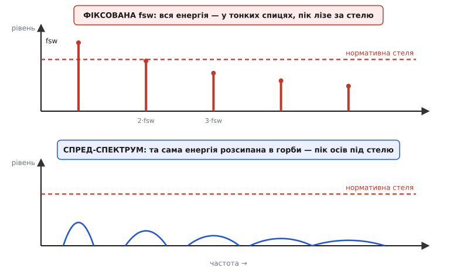
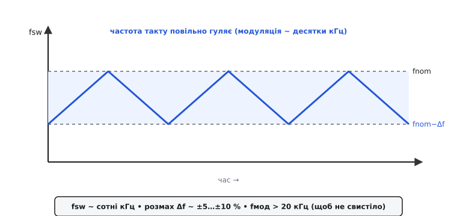
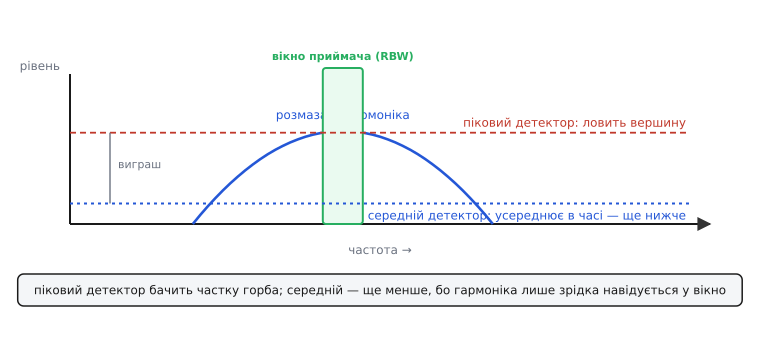

# Спред-спектрум у DC-DC і зниження EMI-піків

Уяви ситуацію, яка щороку трапляється в десятках лабораторій. Пристрій готовий, живлення тримає ідеально, ККД чудовий — а сертифікат на електромагнітну сумісність не дають. Причина одна: [імпульсний перетворювач](topic:hw-power/switching-converter) усередині рубає струм на сталій частоті, і саме ця сталість вихлюпує в ефір гострий пік радіозавад, що на кілька децибел перелазить дозволену межу. Схема правильна, розведення охайне, а винен один-єдиний зубець на екрані вимірювача.

Прибрати той пік «в лоб» майже нема як: він сидить на **робочій частоті перетворювача**, а без перемикань перетворювач не працює. Тоді народжується інша думка — не прибрати енергію, а **розмазати** її по смузі частот так, щоб у жодній точці вона вже не діставала межі. Саме це й робить **спред-спектрум** (англ. *spread spectrum* — «розширення спектру»; у контексті DC-DC його ще звуть частотним дизерингом, англ. *frequency dithering* — «дрижання частоти»): він не зменшує сумарних завад, а **знижує їхній пік**, розсипаючи ту саму силу тонким шаром. Розберімо, звідки в перетворювачі беруться ці спиці, як їх розмазують, чому саме в силовій електроніці це працює особливо добре — і яку ціну доводиться платити.

### Звідки пік: перемикання — це гребінець гармонік

Спершу зрозуміймо ворога. Чому рівно й корисно працюючий перетворювач стає джерелом вузьких піків?

Серце будь-якого імпульсного перетворювача — [вузол перемикання](topic:hw-power/switching-converter), точка, де силовий ключ раз у раз під'єднує й від'єднує вхід. Напруга в цій точці — майже прямокутна хвиля: різко вгору, різко вниз, десятки чи сотні тисяч разів на секунду. А будь-яка періодична прямокутна хвиля, за розкладом Фур'є, складається зі суми чистих синусоїд — основної частоти fsw і **гармонік**, кратних їй: fsw, 2·fsw, 3·fsw і далі вгору. Тобто перетворювач випромінює не суцільний шум, а цілий **гребінець** тонких спектральних ліній. Що різкіші фронти на вузлі перемикання, то повільніше спадають дальні гармоніки — і то вище тягнеться цей гребінець по частоті.

І тут — головна біда саме силової схеми. Струм, який перемикає перетворювач, **великий** (ампери, десятки ампер), а петлі, якими він тече, — це доріжки, [котушка](topic:hw-power/converter-inductor) і [конденсатори](topic:hw-power/converter-caps) на платі. Кожна така петля працює маленькою антеною, а вхідні дроти й вихідні кабелі — антенами вже чималими. Тому кожен зубець гребінця не просто існує в теорії, а реально **світить** у ефір і **гуляє** дротами живлення. Саме тонкість спиці робить її небезпечною: вузька лінія має великий пік, хоча повна енергія в ній може бути й невеликою.


*Фіксована частота перемикання дає частокіл гострих спиць на fsw, 2·fsw, 3·fsw… — і найвища лізе за нормативну стелю. Спред-спектрум перетворює кожну спицю на пологий горб тієї самої площі: пік осідає під межу. Що вища гармоніка, то ширший її розмаз, бо той самий відсоток гуляння частоти дає більший абсолютний обшир на вищій частоті.*

> 🔧 **Навіщо це.** Коли на випробуванні бачиш низку рівномірно розставлених піків із однаковим кроком — це майже напевно гармоніки перетворювача, а не окрема несправність. Крок між спицями одразу видає винуватця: поміряй відстань між сусідніми — вона дорівнює fsw. Побачив пік на 400 кГц і його копії на 800 кГц, 1.2 МГц — знай, що перетворювач крутиться на 400 кГц. Спред-спектрум цілиться саме в цей частокіл.

### Дві біди перетворювача: кондуктивна й радіаційна

Завади від перетворювача виходять двома різними шляхами, і норматив міряє їх окремо — це варто розділяти, бо спред-спектрум допомагає обом, але по-різному.

Перший шлях — **кондуктивний** (лат. *conductus* — «проведений»): завади **втікають дротами живлення** назад у мережу чи в бортову шину. Ключ смикає з входу струм імпульсами, і ці імпульси, попри [вхідні конденсатори](topic:hw-power/converter-caps), частково пролізають у вхідні дроти й далі. Цю біду міряють у нижчій смузі частот — там живуть основна частота перемикання та її ближчі гармоніки. Для автомобільної електроніки стандарт **CISPR 25** міряє кондуктивні завади від 150 кГц до 30 МГц, і роздільна смуга приймача (вікно, крізь яке він дивиться на одну частоту за раз) у цій смузі — **9 кГц**.

Другий шлях — **радіаційний**: завади **випромінюються в ефір** петлями струму й кабелями, як антенами. Це вища смуга — за тим самим CISPR 25 радіаційні завади міряють від 30 МГц і вище, з ширшою роздільною смугою **120 кГц**. Тут «світять» уже високі гармоніки з крутих фронтів вузла перемикання.

Чому це важливо для нашої теми? Бо саме **основна частота перемикання перетворювача часто падає прямо в діапазон середніх хвиль (АМ-радіо, 530–1710 кГц)** — а це найчутливіша й найдратівливіша смуга кондуктивних норм. Перетворювач на 500 кГц кладе свою третю гармоніку (1.5 МГц) точно в АМ-діапазон; автомобільна магнітола ловитиме її як свист. Тому спред-спектрум у DC-DC — це насамперед інструмент проти **кондуктивних** піків у нижній смузі, де перетворювач шумить найдужче.

### Головний трюк: повільно гойдати частоту перемикання

Тепер сама ідея, і вона напрочуд проста. Замість того щоб тримати перетворювач на строго сталій fsw, її **повільно й безперервно** гойдають туди-сюди навколо номіналу: трохи вгору, трохи вниз, знову вгору — за плавним законом із набагато нижчою частотою розгойдування. Розмах гуляння вже не «частки відсотка», як у тактових генераторів цифри, а помітно ширший — типово **±5…±10 %** від fsw. Силова схема може собі це дозволити, бо їй, на відміну від швидкої цифрової шини, байдуже до точного значення частоти в кожну мить.


*Частоту перемикання повільно гойдають за трикутним законом — тут «розмаз униз»: fsw гуляє від fnom до fnom−Δf і назад, ніколи не перевищуючи номінал. Розмах Δf ~ ±5…±10 %, а частоту самої модуляції тримають вище 20 кГц, щоб перетворювач не засвистів у чутному діапазоні.*

Що з цього виходить у спектрі? Поки частота стоїть на місці, уся енергія гармоніки б'є в одну лінію. Щойно частота почала повзати в діапазоні шириною Δf, та сама енергія вже не встигає збиратися в одну точку — вона **розподіляється** по всій смузі, якою блукає гармоніка. Замість тонкої високої спиці постає широкий низький **горб**. І тут ключове: **повна потужність зберігається**. Модуляція не спалює й не створює енергії — вона лише перерозподіляє наявну по частоті. Площа під горбом дорівнює площі колишньої спиці; змінилася тільки **висота**.

Отут природне заперечення: якщо енергія та сама, то й завад стільки ж — де ж виграш? І щодо сумарної енергії скептик має рацію. Виграш не в тому, що завад стало менше, а в тому, що **норматив міряє пік** у своєму вузькому вікні, а не повну енергію. Прилад бачить лише ту частку горба, що влучила у вікно роздільної смуги; решта лежить поза межами вікна й у показ не входить. Розтягнув енергію в смугу, ширшу за вікно приймача, — і показ падає приблизно на стільки децибел, у скільки разів розмаз ширший за вікно. Тонше цю механіку вікна розбирає [сусідня стаття про модуляцію тактового спектру](topic:hw-digital/spread-spectrum-clocking) — фізика придушення там та сама, лише джерелом виступає такт цифри, а не силовий ключ.

### Чому в силовій це працює особливо добре: середній детектор

Є одна причина, чому спред-спектрум у перетворювачах дає **більший** виграш, ніж можна очікувати з простої арифметики вікна, — і криється вона в тому, **яким детектором** норматив зважує завади.

Приймач завад уміє показувати рівень трьома способами. **Піковий** детектор бере найвищу точку, яку зловив у вікні. **Середній** (англ. *average*) — усереднює те, що бачить у вікні, **в часі**. І **квазіпіковий** — щось проміжне, зважене за частотою повторень. Норми на кшталт CISPR 25 задають окремі стелі і для пікового, і для середнього детектора: пройти треба **обидва**.

Тепер складімо це з розмазуванням. Коли частота перетворювача повільно гуляє, кожна гармоніка **не сидить** увесь час в одній точці спектру — вона лише **зрідка навідується** у вузьке вікно приймача, коли її мандрівка приводить її туди, а решту часу гуляє деінде. Для пікового детектора це вже дає виграш: у вікно влучає лише частка горба. Але для **середнього** детектора виграш ще більший: він усереднює рівень **у часі**, а гармоніка проводить у вікні лише малу частку часу — тож усереднений рівень падає значно нижче за піковий. Ось чому в силовій електроніці спред-спектрум найяскравіше показує себе саме на середньому детекторі: сама природа усереднення в часі перемножується з розмазуванням по частоті.


*Вікно приймача (RBW) ковзає по розмазаному горбу. Піковий детектор бере вершину того, що у вікні, — уже нижче за повну спицю. Середній детектор усереднює рівень у часі, а гармоніка лише зрідка проходить крізь вікно — тому середній показ падає ще глибше. Саме тому спред-спектрум найдужче виграє на середньому детекторі.*

На практиці числа такі. У нижній (кондуктивній) смузі CISPR 25, де перетворювач шумить найдужче, спред-спектрум збиває піки на **10–15 дБ** — цього з головою вистачає, щоб перелізти межу назад під неї. У вищій, радіаційній смузі виграш скромніший, **5–7 дБ**: там гармоніки й так вищі, а розмаз відносно вікна 120 кГц менш вигідний. Цю асиметрію теж видно з простої логіки: той самий відсоток розмаху дає більший абсолютний обшир на вищій частоті, але й вікно приймача там ширше, тож частина виграшу з'їдається.

**Приклад (порахувати виграш у нижній смузі).** Перетворювач крутиться на fsw = 440 кГц. Проблемна — третя гармоніка, 1.32 МГц (прямо в АМ-діапазоні), і на кондуктивному випробуванні вона на 8 дБ вища за стелю. Приймач CISPR 25 має вікно RBW = 9 кГц. Ставимо розмаз ±6 %. Порахуймо, чи вистачить.

:::tabs
```c
#include <stdio.h>
#include <math.h>

int main(void) {
    double fsw      = 440e3;    // частота перемикання, Гц
    int    harm     = 3;        // проблемна гармоніка
    double spread   = 0.06;     // ±6 % розмаху
    double rbw      = 9e3;      // вікно приймача CISPR 25 (низька смуга), Гц

    double f_harm = harm * fsw;             // 1.32 МГц — де стоїть спиця
    double df     = 2.0 * spread * f_harm;  // повна ширина розмазу (±6 % → 12 %)
    double gain   = 10.0 * log10(df / rbw); // наближене падіння піку

    printf("гармоніка : %.2f МГц\n", f_harm / 1e6);
    printf("розмаз Δf  : %.0f кГц (%.0f %% від гармоніки)\n",
           df / 1e3, 2 * spread * 100);
    printf("вікно RBW  : %.0f кГц\n", rbw / 1e3);
    printf("падіння піку ~ %.1f дБ\n", gain);

    double before = -8.0;                   // було: на 8 дБ ВИЩЕ стелі
    double after  = before + gain;
    printf("запас до стелі: %.1f -> %.1f дБ  %s\n",
           before, after, after > 0 ? "(проходить)" : "(усе ще завалено)");
    return 0;
}
```
```python
import math

fsw    = 440e3    # частота перемикання, Гц
harm   = 3        # проблемна гармоніка
spread = 0.06     # ±6 % розмаху
rbw    = 9e3      # вікно приймача CISPR 25 (низька смуга), Гц

f_harm = harm * fsw               # 1.32 МГц — де стоїть спиця
df     = 2.0 * spread * f_harm    # повна ширина розмазу (±6 % → 12 %)
gain   = 10.0 * math.log10(df / rbw)  # наближене падіння піку

print(f"гармоніка : {f_harm / 1e6:.2f} МГц")
print(f"розмаз Δf  : {df / 1e3:.0f} кГц ({2 * spread * 100:.0f} % від гармоніки)")
print(f"вікно RBW  : {rbw / 1e3:.0f} кГц")
print(f"падіння піку ~ {gain:.1f} дБ")

before = -8.0                     # було: на 8 дБ ВИЩЕ стелі
after  = before + gain
print(f"запас до стелі: {before:.1f} -> {after:.1f} дБ  "
      f"{'(проходить)' if after > 0 else '(усе ще завалено)'}")
```
:::

```
гармоніка : 1.32 МГц
розмаз Δf  : 158 кГц (12 % від гармоніки)
вікно RBW  : 9 кГц
падіння піку ~ 12.4 дБ
запас до стелі: -8.0 -> 4.4 дБ  (проходить)
```

Розмаз 158 кГц — це приблизно у 18 разів ширше за 9-кілогерцове вікно, звідки й ≈12 дБ падіння на піковому детекторі; на середньому виграш був би ще більший. Було на 8 дБ вище стелі — стало на 4 нижче: перетворювач проходить із запасом. І видно, чому вузьке вікно 9 кГц робить нижню смугу такою вдячною для спред-спектруму: що вужче вікно, то більша кратність розмазу й то глибше падіння.

### Униз чи навколо, і якою формою гойдати

Гойдати частоту можна кількома способами, і вибір — не косметика.

За **напрямком** розмаз буває **центрований** (частота гуляє симетрично навколо fnom, наполовину вгору) і **униз** (частота гуляє лише нижче fnom, від fnom до fnom−Δf, ніколи не перевищуючи номінал). У силовій електроніці частіше беруть **розмаз униз**: він гарантує, що частота ніколи не піднімається вище паспортної. Це важливо, бо на вищій частоті трохи ростуть [втрати перемикання](topic:hw-components/switching-losses) і сильніше гріється ключ; тримаючи fsw лише знизу, ти не виходиш за теплові розрахунки. Плата — мізерне зниження середньої частоти.

За **формою** закону теж є вибір, і тут силова електроніка розходиться з цифрою. Найпростіший — **трикутник**: частота рівномірно повзе вгору й вниз. Дає майже пласку полицю розмазаної енергії, але на краях, де частота на мить зупиняється розвернутися, лишаються невеликі підняті «вуха». Наступний рівень — **псевдовипадкова** модуляція: частоту стрибками ведуть за псевдовипадковою послідовністю, і горб виходить рівнішим, без вух. А найкраще працює **подвійний випадковий розмаз** (англ. *dual random spread spectrum*), де випадково гуляють і сама частота, і крок її зміни — саме він дає найнижчі піки. Загальне правило: трикутник < псевдовипадковий < подвійний випадковий за придушенням піку. У готових мікросхемах-перетворювачах цю логіку зашивають усередину — інженерові лишається ввімкнути функцію ніжкою чи бітом регістра.

> 🔧 **Навіщо це.** Практичне правило вибору: якщо перетворювач працює біля теплової межі — бери **розмаз униз**, щоб не піднімати fsw і не додавати втрат. А форму (трикутник чи випадкову) зазвичай не обираєш сам — її дає мікросхема; але знай, що дорожчі контролери з випадковою модуляцією глушать піки на кілька децибел краще за прості трикутні, і саме ці децибели інколи вирішують долю сертифіката.

### Ціна: розмазаний такт свистить і брижить

Задарма нічого не буває, і плата тут цілком конкретна й особлива саме для силової схеми.

**Перетворювач може засвистіти.** Це найпідступніший бік. Частоту самої модуляції (той повільний закон, за яким гуляє fsw) не можна ставити абияк: якщо вона впаде в чутний діапазон (20 Гц — 20 кГц), перетворювач почне **чутно пищати**. Причина фізична: [керамічні конденсатори](topic:hw-power/converter-caps) п'єзоелектричні — під змінною напругою вони механічно деформуються й вигинають плату, як мембрану динаміка. Поки fsw за межами чутного (сотні кГц), цього не чути; але **модуляція** накладає на все повільну обвідну, і якщо її частота — 5 чи 10 кГц, плата заспіває саме на ній. Тому частоту модуляції завжди тримають **вище 20 кГц** — досить повільно, щоб гарно розмазати спектр, і водночас вище порога чутності. Це чи не головна відмінність спред-спектруму в силовій схемі від цифрової.

**Розмах пульсації трохи росте.** Вихідна пульсація перетворювача залежить від частоти: що вища fsw, то менша пульсація. Коли частота гуляє вниз, у нижній частині розмаху період довший, [котушка](topic:hw-power/converter-inductor) встигає накачати більший розмах струму — і пульсація на виході трохи зростає. Зазвичай це частки відсотка й нікого не турбує, але в прецизійному аналоговому живленні це варто мати на увазі.

**Модуляція взаємодіє зі [зворотним зв'язком](topic:hw-power/feedback-stability).** Перетворювач безперервно підправляє [шпаруватість](topic:hw-power/switching-converter), тримаючи вихід сталим. Коли частота гуляє, контур керування бачить це як повільне збурення й намагається його відпрацювати. Якщо смуга регулювання зачепить частоту модуляції, вихід може трохи «дихати» на ритмі розмазу. Тому частоту модуляції ставлять помітно вище смуги контуру — щоб зворотний зв'язок її просто «не встигав» помічати й не боровся з нею.

**Спред-спектрум — не заміна доброму розведенню.** Він збиває піки на 10–15 дБ, і цього часто вистачає, щоб дотягнути майже-готовий пристрій до норми. Але якщо петлі струму на платі великі й [розведення перетворювача](topic:hw-power/converter-layout) кульгає, спред-спектрум не врятує: він розмаже завади, які взагалі не мали б туди потрапити. Правильний порядок — спершу коротка петля перемикання, вхідні конденсатори щільно, добра земля; і **аж тоді** спред-спектрум як останні кілька децибел запасу.

> 🔧 **Навіщо це.** Три речі перевір, вмикаючи спред-спектрум. Перше: частота модуляції — вище 20 кГц (інакше пристрій засвистить, і це чути вухом). Друге: якщо живиш прецизійний аналог чи опорну частоту — зважай, що вихід тепер має крихітну домішку модуляції; для АЦП це буває неприйнятно. Третє: не сподівайся, що спред-спектрум виправить погане розведення — це інструмент для останніх децибел, а не для порятунку антени, зробленої з силової петлі.

### Що з цього лишається в голові

Зберімо докупи. Імпульсний перетворювач рубає струм на сталій частоті fsw, і його вузол перемикання випромінює **гребінець гострих гармонік** на fsw, 2·fsw, 3·fsw і далі — а через великі струми й петлі-антени кожна спиця реально гуляє дротами (кондуктивно, нижня смуга) і світить у ефір (радіаційно, вища смуга). Небезпечна саме тонкість спиць. Спред-спектрум не прибирає цю енергію, а **розмазує** її: повільно гойдає fsw у межах ±5…±10 %, і кожна спиця осідає в широкий низький горб тієї самої площі. Виграш видно на приладі, бо той міряє лише частку горба у своєму вузькому вікні; у нижній смузі CISPR 25 (вікно 9 кГц) це дає **10–15 дБ**, а найдужче — на **середньому** детекторі, бо гармоніка навідується у вікно лише зрідка й усереднений у часі рівень падає глибше. Ведуть частоту зазвичай **униз** (щоб не піднімати fsw і втрати), формою від простого **трикутника** до **подвійного випадкового** розмазу (що краще глушить пік). А головна плата, властива саме силовій схемі, — частоту модуляції треба тримати **вище 20 кГц**, інакше п'єзоелектричні керамічні конденсатори змусять перетворювач чутно свистіти; додатково трохи росте пульсація, і спред-спектрум ніколи не замінює доброго розведення, а лише додає останні децибели запасу до сертифіката.

---

*Джерела фактів (усталене): Texas Instruments, «EMI Reduction Technique, Dual Random Spread Spectrum» (SNVA974); Analog Devices, «Spread Spectrum Frequency Modulation Reduces EMI»; смуги й роздільні смуги CISPR 25 (150 кГц–30 МГц / RBW 9 кГц; 30–300 МГц / RBW 120 кГц); п'єзоелектричний свист керамічних конденсаторів — Newark/NIC «MLCC Ringing-Singing» та EDN «Reducing MLCCs' piezoelectric effects and audible noise».*
