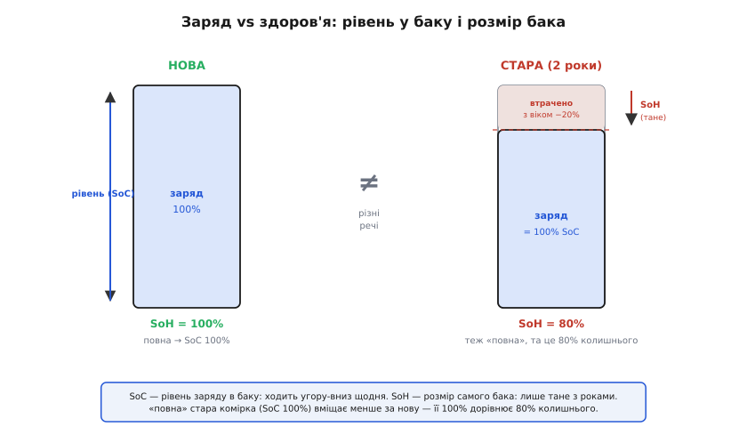
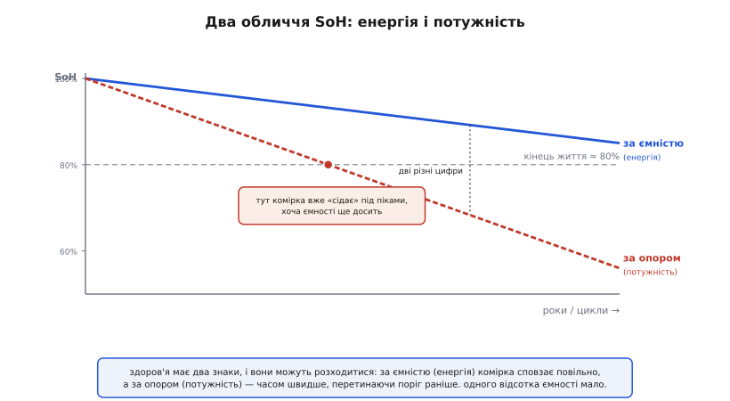
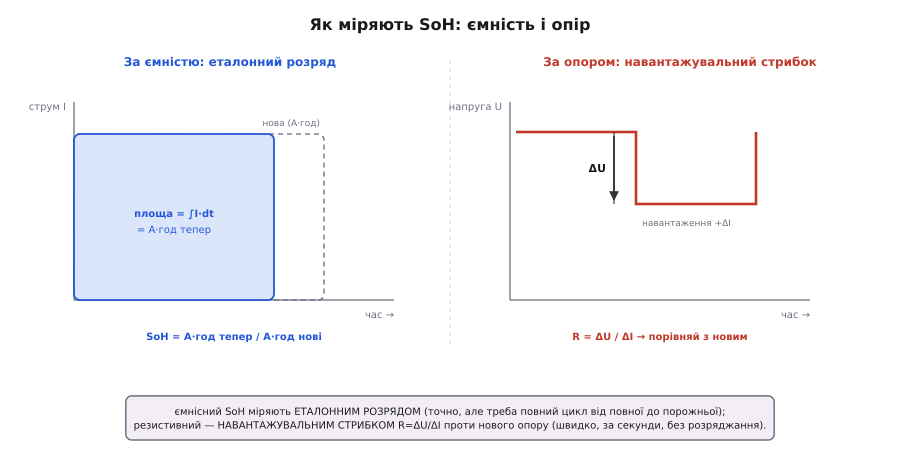

# Здоров'я батареї (SoH)

<preknowlist>
- [Стан заряду (SoC)](topic:hw-power/state-of-charge) — скільки заряду в комірці *зараз*, у відсотках від її поточної ємності; здоров'я — про іншу величину.
- [Старіння батарей](topic:hw-power/battery-aging) — чому з роками й циклами ємність тане, а внутрішній опір росте; SoH лише міряє наслідок цього.
- [Просадка під навантаженням](topic:hw-power/battery-sag) — чому під струмом напруга падає на I·Rвн і чому ріст внутрішнього опору означає втрату потужності.
</preknowlist>

Батарея — єдиний вузол пристрою, що зношується просто від того, що існує. Але «зношена» — ще не діагноз, поки за цим словом немає числа. І ось де пастка: майже кожна цифра, яку батарея показує назовні, — це насправді частка від знаменника, що з роками меншає. Індикатор «100%» означає «повна» — але повна *чого*? Повного бака, який щороку вміщає менше. [Стан заряду](topic:hw-power/state-of-charge) чесно каже, наскільки бак наповнений *цієї миті*, і нічого не каже про те, яким той бак став завбільшки. Щоб знати друге — скільки постаріла комірка ще здатна зробити проти того, що могла новою, — потрібне окреме число. Його й звуть **здоров'ям батареї** (англ. *state of health* — «стан справності», скорочено **SoH**).

Означення просте, як відсоток. Візьми повну ємність, яку комірка тримає *тепер*, і поділи на ту, що вона тримала новою (паспортну). Нова — 100%; коли її повний заряд опустився, скажімо, до 80% колишнього, це SoH = 80%. По суті це одометр зношеності: одне монотонне число, що поволі сповзає вниз і назад уже не росте. Комірка на 3000 мА·год, що після двох років тримає повними лише 2400, — проста арифметика: SoH ≈ 80%.


*Стан заряду — це рівень у баку, що ходить угору-вниз щодня; здоров'я — це розмір самого бака, який лише тане з роками. Тому «повна» стара комірка (SoC 100%) вміщає менше, ніж вміщала нова: її 100% — це вже 80% колишнього.*

Але ємність — лише половина картини. Старіючи, комірка не тільки вміщає менше — вона й **опирається дужче**: [внутрішній опір росте](topic:hw-power/battery-sag). А це вже про інше — не скільки *енергії* комірка зберігає, а скільки *потужності* здатна віддати, не просідаючи. Тож у SoH два обличчя. Перше — **ємнісне**: скільки енергії влазить (спад ємності). Друге — **резистивне**: скільки струму можна взяти без завалу напруги (ріст опору). І падати разом вони не зобов'язані. Буває, комірка ще тримає 90% ємності, але опір уже подвоївся: за енергією вона майже свіжа, а під струмовим піком уже «сідає». Тому чесна оцінка стежить за обома знаками, а не лише за відсотком ємності.


*Здоров'я має два обличчя, і вони можуть розходитися: за ємністю (енергія) комірка сповзає повільно, а за опором (потужність) — часом швидше, перетинаючи поріг раніше. Одна й та сама комірка буває ще «повна за енергією», але вже «сідає під струмом».*

Звідки береться риска, за якою кажуть «пора міняти»? Галузь традиційно бере **80% ємності** за умовний **кінець життя** (англ. *end of life*, EoL). Це не смерть — комірка на 80% ще цілком робоча; це домовлена межа, нижче якої ємності відчутно бракує, опір уже високий, і покладатися на батарею під піками стає ризиковано. [Чому саме 80% і чому це умовність, а не фізичний рубіж](topic:hw-power/battery-aging), — уже в темі старіння; нам тут важливо, що SoH — це та шкала, на якій ця риска взагалі має сенс.

Найцікавіше — як здобути це число, адже комірка його не повідомляє. Способів два, дзеркально до двох облич SoH. **За ємністю** — чесно, але дорого: потрібен *еталонний розряд*. Зарядити комірку до повної, тоді розрядити до відсічки сталим струмом і всю дорогу **рахувати ампер-години**, що витекли ([лічба заряду](topic:hw-power/state-of-charge)). Поділив виміряну ємність на паспортну — маєш SoH. Точно, та ціна — цілий контрольований цикл від повної до порожньої, якого в польових умовах майже ніколи немає.

**За опором** — дешевше й швидше. Різко зміни навантаження й подивись, як стрибне напруга: R = ΔU/ΔI. Порівняй із опором нової комірки — наскільки він виріс, настільки просіла «потужнісна» частина здоров'я. Це робиться за секунди, без розряджання батареї, — тому за опором SoH стежать куди частіше, ніж ганяють повний еталонний розряд. Точніше опір розкладають на складові змінним струмом різних частот — [імпедансна спектроскопія](topic:hw-power/battery-impedance) показує окремо швидку омічну частину й повільну дифузійну, — але сама ідея та сама: ріст опору = втрата здоров'я. Як звести обидва виміри в одне число й з тренду згасання прикинути, скільки ще лишилось до 80%, — у [математиці двох SoH і залишкового ресурсу](topic:hw-power/state-of-health/math-soh-metrics.md).


*Два способи зміряти SoH. Ліворуч — еталонний розряд: полічити ампер-години від повної до порожньої й поділити на паспортні (точно, але потрібен повний цикл). Праворуч — навантажувальний стрибок: R = ΔU/ΔI проти нового опору (швидко, за секунди).*

На практиці ніхто не ганяє еталонний розряд щодня — це роблять розумні **паливоміри**. [Мікросхема-паливомір](topic:hw-power/fuel-gauge), стежачи за досить повними циклами заряд-розряд, поступово **навчається** справжньої поточної ємності комірки й звідти виводить SoH. Саме це навчання й робить її «100%» чесними на постарілій батареї: без нього паливомір ділив би заряд на давню паспортну ємність — і брехав би на старість тим більше, чим дужче зносилась комірка. Як це виглядає в прошивці — навчити повну ємність з еталонного циклу, зняти опір із навантажувального стрибка й скласти з них SoH — розібрано в [алгоритмі оцінки SoH](topic:hw-power/state-of-health/proj-soh-estimator.md).

**Приклад (два SoH однієї комірки — і чому вони розходяться).** Нова комірка: 3000 мА·год, внутрішній опір 30 мОм. Через два роки еталонний розряд дав 2550 мА·год, а виміряний опір — 60 мОм.

```
SoH за ємністю = 2550 / 3000     = 85%   (енергії ще досить)
опір виріс     = 60 / 30         = ×2    (удвічі)

Що це означає під піком 3 А:
   просадка нова  = 3 А × 0.030 Ом = 0.09 В
   просадка тепер = 3 А × 0.060 Ом = 0.18 В   (удвічі глибша)
```

За енергією комірка ще бадьора (85%), а за потужністю — уже ні: під тим самим струмом вона просідає вдвічі глибше, і пристрій із жадібними піками (радіо, мотор) почне вимикатися передчасно, хоч ємності «на папері» вистачає. Ось чому одного відсотка ємності мало.

> 🔧 **Навіщо це.** SoH — це знаменник, що не дає решті чисел брехати. Оцінка заряду ділить наявні ампер-години на *поточну* ємність, тож без свіжого SoH навіть найрозумніший [паливомір](topic:hw-power/state-of-charge) поволі з'їде. Але головна цінність SoH — у рішеннях, яких без нього не ухвалити: коли **планово міняти** батарею (за графіком, поки вона не підвела в полі), як **читати гарантію** (виробники електромобілів, наприклад, часто зобов'язуються втримати пакет вище певної частки ємності — нерідко близько 70% — за вісім років, і це записано саме мовою SoH) і чи можна ще **довіряти піковій потужності** старої комірки. Одне застереження: SoH ловить *поступове* в'янення, а не *раптову* відмову — внутрішнє коротке чи обрив він не передбачить, тож надійні системи стежать ще й за аномаліями окремо.

Здоров'я батареї (**SoH**) — це міра того, скільки постаріла комірка ще здатна зробити проти себе ж новою, у відсотках (нова = 100%). У нього два обличчя: **ємнісне** (спад повної ємності — скільки енергії влазить) і **резистивне** (ріст внутрішнього опору — скільки потужності можна взяти), і вони можуть розходитися. Умовний **кінець життя** галузь бере за **80%** ємності — риска для планування, а не «смерть». Здобувають SoH двома способами: **еталонним розрядом** (полічити ампер-години від повної до порожньої й поділити на паспортні — точно, та потрібен повний цикл) і **виміром опору** (ΔU/ΔI проти нового — швидко й часто); на практиці справжню ємність **навчається** паливомір. А потрібне це число, щоб стан заряду не брехав, щоб вчасно й планово міняти батарею, читати гарантію й не покладатися на пікову потужність зношеної комірки. Чому саме ємність тане, а опір росте, — [окрема тема про старіння](topic:hw-power/battery-aging).
