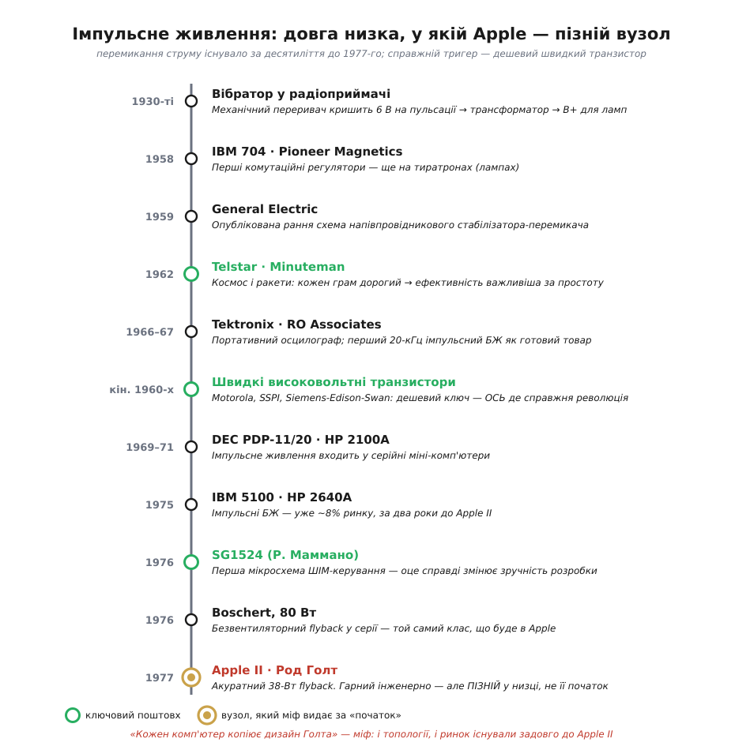
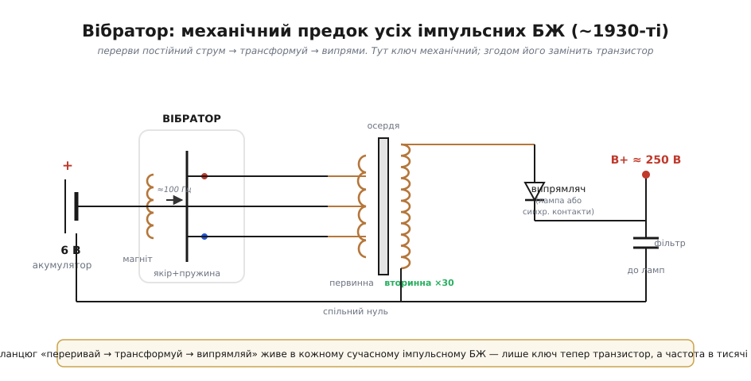

# 📜 Від дзижчання в радіо до DC-DC: хто насправді «винайшов» імпульсне живлення

> Ця історія не перелічує патенти за роками — вона веде **низкою задач**: що змушувало інженерів перемикати струм замість того, щоб просто гасити зайве в теплі, чому космос підняв ставки, як подешевшав транзистор — і чому красива легенда «імпульсне живлення винайшла Apple» не витримує перевірки. Майже кожне слово зі словника імпульсного живлення — *flyback*, *off-line*, *ШІМ-контролер*, *частота комутації* — закам'янілий слід цієї історії.

Візьміть зарядку від телефона: пластиковий кубик грамів на сорок, що з розетки робить 5 В на пару ампер і ледь теплий. А тепер уявіть ту саму потужність у 1965 році: важкий залізний трансформатор на 50 Гц, радіатор з долоню і ккд, на якому половина енергії йде в обігрів кімнати. Між цими двома картинками лежить один-єдиний інженерний хід — **перемикати, а не гасити**. На ньому стоїть уся імпульсна силова електроніка. І довкола нього виросла одна з найвідоміших легенд електроніки — нібито імпульсний блок живлення (*switched-mode power supply*, **SMPS**) народився в підвалі Apple 1977 року. Розплутаймо, як було насправді: це історія **колективна**, на півстоліття довша за Apple, і набагато цікавіша за легенду.


*Імпульсне живлення — довга низка, у якій Apple II (1977) стоїть наприкінці, а не на початку. Зеленим — справжні поштовхи (космос; дешевий швидкий транзистор; мікросхема керування). Бурштиновим — той вузол, який легенда видає за «винахід усього».*

---

## Машина, що дзижчала: вібратор автомобільного радіо

Перший по-справжньому масовий пристрій, який **перемикав** постійний струм заради перетворення напруги, їздив у багажнику автомобіля ще у 1930-х. Проблема була гостра й конкретна. Автомобіль дає **6 вольт** від свинцевого акумулятора. А лампове радіо тих років вимагає високої анодної напруги — **B+** у 150–250 В для пластин і сіток вакуумних ламп. Звідки взяти 250 В сталого струму з 6-вольтової батареї, та ще й у машині, що трясеться?

Відповідь знайшли в дотепному електромеханічному пристрої — **вібраторі** (*vibrator*). Перші серійні випустила фірма **P. R. Mallory & Co.** близько **1931 року**. Усередині — те саме, що в дзвінку чи зумері: електромагніт притягує пружну сталеву пластину-якір; щойно вона зрушила, контакт розмикається, магніт знеструмлюється, пружина повертає якір назад, контакт замикається — і все починається знову, **близько сотні разів на секунду**. Звідси й характерне дзижчання, яке пам'ятає кожен, хто заводив старий приймач.


*Вібратор робить рівно три речі, які робить будь-який імпульсний БЖ і досі: перериває постійний струм, переганяє пульсації крізь трансформатор на вищу напругу й випрямляє назад у DC. Різниця лише в тому, що ключ тут — механічний контакт, а частота — сотні герц, а не сотні кілогерців.*

Сенс у тому, що **постійний струм не можна підняти трансформатором** — трансформатор живе лише на змінному полі. Тож вібратор штучно робить зі сталого струму **пульсуючий**: дрібно кришить його контактом, переганяє через первинну обмотку з середнім відводом так, що в осерді виникає змінне поле, а воно вже наводить у вторинній обмотці високу напругу. Далі — випрямляч (окрема лампа-кенотрон або, у «синхронному вібраторі», другий комплект тих самих контактів) і конденсатор фільтра, які повертають усе назад у згладжений B+.

Зупиніться на цьому ланцюжку, бо він — **скелет будь-якого імпульсного перетворювача**: *перерви постійний струм → трансформуй на потрібну напругу → випрями назад*. Поміняйте дзижчливий контакт на транзистор, а сотню герц — на сотню кілогерців, і ви отримаєте сучасний [flyback-перетворювач](topic:hw-power/flyback-isolated) з мережевого адаптера. Принцип той самий; змінилася лише **технологія ключа**.

> 🔧 **Навіщо це.** Слова *primary*, *secondary*, *center-tap*, *rectifier* у даташиті flyback-контролера — це прямі нащадки вібраторної схеми. А ще звідси походить інженерна звичка боятися **залишкового струму** через трансформатор: у вібратора контакти підгорали саме на перемиканні, і вся подальша наука про «м'яке» вмикання ключів росте з тієї самої проблеми.

---

## Чому взагалі перемикати: тиранія лінійного стабілізатора

Щоб відчути, навіщо інженери морочилися з дзижчливими контактами й транзисторами, треба побачити **альтернативу** — і чим вона погана. Найпростіший спосіб зробити з 12 В рівні 5 В — поставити послідовно регулювальний елемент (транзистор) і **гасити на ньому зайве**, мов притискаючи пальцем шланг. Це **[лінійний стабілізатор](topic:hw-power/ldo-internals)** (*linear regulator*). Він чудовий тим, що тихий і простий. І жахливий тим, куди дівається різниця напруг.

А дівається вона **в тепло**. Якщо крізь стабілізатор тече 1 А, а на ньому падає 12 − 5 = 7 В, то він розсіює:

```
P_втрат = ΔU × I = 7 В × 1 А = 7 Вт
P_корисна = 5 В × 1 А = 5 Вт
ккд ≈ 5 / (5 + 7) ≈ 42 %
```

Більше половини енергії — у грубку. На кожен ват для пристрою — більш як ват у радіатор. Для мережевого живлення картина ще гірша: там спершу важкий **трансформатор на 50/60 Гц** опускає 230 В до низьких одиниць вольт (а трансформатор тим масивніший, чим нижча частота), потім випрямляч, потім лінійний стабілізатор знову палить надлишок. Типовий лінійний БЖ 1960-х віддавав у корисне навантаження **35–50 %** того, що споживав, і важив пропорційно до заліза в трансформаторі.

Перемикання ламає цей компроміс одним рухом. Ключ, який або **повністю відкритий** (падіння майже нуль — майже немає втрат), або **повністю закритий** (струму майже нема — знову майже немає втрат), у теорії не гріється зовсім: енергія не гаситься, а **порціями перекладається** через котушку чи трансформатор. А якщо перемикати швидко — десятки й сотні кілогерц замість 50 Гц, — то й трансформатор з котушкою стають крихітними, бо магнітному осердю на високій частоті треба в рази менше заліза на той самий ват. Звідси і ті 80–90 % ккд, і сорокаграмовий кубик замість цеглини. Ціна — складність і **шум**: різкі фронти перемикання породжують завади, з якими інженеру доводиться боротися окремо. Але виграш у вазі та ефективності виявився таким, що індустрія пішла на цей обмін без вагань — щойно з'явилося чим швидко перемикати.

---

## Космос і ракети роблять перемикання серйозним

У 1950-х перемикальні регулятори вже існували, але як екзотика. **IBM** ставила комутаційний регулятор у машину **704** ще **1958 року** — щоправда, ключем там був **тиратрон**, газонаповнена лампа, а не транзистор; приблизно тоді ж власні зразки будувала фірма **Pioneer Magnetics**. **General Electric** **1959 року** опублікувала ранню напівпровідникову схему. Це були поодинокі інженерні вправи, не індустрія.

Серйозною технологію зробив **космос**. Коли вашу електроніку треба вивести на орбіту або поставити в боєголовку міжконтинентальної ракети, **кожен грам коштує грубих грошей**, а енергію дає обмежена батарея чи сонячна панель. Тут 40 % ккд — це катастрофа: половину дорогоцінних ват ви викидаєте в тепло, яке у вакуумі ще й нікуди відвести. Раптом ефективність переважила простоту. Перемикальні регулятори полетіли на супутнику зв'язку **Telstar** (**1962**) і стояли в системі наведення ракет **Minuteman**. Аерокосмічна галузь і NASA стали першими замовниками, готовими платити за складність заради ват і грамів.

Паралельно технологія прийшла туди, де теж тісно й гаряче, — у **прилади**. **Tektronix** близько **1966 року** зробила портативний осцилограф з імпульсним живленням (інакше батарея не витягла б), а фірма **RO Associates** **1967 року** випустила, як вважають, **перший імпульсний БЖ як окремий товар** — на 20 кГц. Перемикання перестало бути секретом аерокосмічних лабораторій і стало річчю, яку можна купити.

> 🔧 **Навіщо це.** Логіка «грам ваги дорожчий за складність схеми» — це не лише про космос. Та сама арифметика працює в дроні, у носимому пристрої, у будь-чому на батареї: коли рахуєш [енергобюджет](topic:hw-power/energy-budget) автономного приладу, ти відтворюєш міркування інженерів Telstar — тільки замість вартості запуску в кілограмах у тебе час роботи від акумулятора.

---

## Справжня революція: транзистор нарешті дозрів

А тепер — головна, найчастіше забута частина історії. Ідея перемикати була стара. Чому ж імпульсні БЖ заполонили світ саме на зламі **1960–70-х**, а не на десять років раніше чи пізніше? Відповідь не в одному генієві й не в одній фірмі. Вона **в матеріалі ключа**.

Щоб перемикати сотні вольт тисячі разів на секунду, потрібен транзистор, який **тримає високу напругу**, **швидко** клацає й коштує **дешево**. Транзисторів 1950-х на це не вистачало: вони були або повільні, або низьковольтні, або захмарно дорогі. Перелом стався, коли **Motorola**, **Solid State Products Inc. (SSPI)**, британська **Siemens-Edison-Swan (SES)** та інші навчилися робити високовольтні швидкі ключі **серійно й недорого** — приблизно **1969–1971 років**. Темп був такий, що редактори журналу *Electronics World* 1971 року писали про 500-ватний блок живлення на обкладинці: його **неможливо було б зібрати на транзисторах, доступних лише вісімнадцять місяців тому**.

Ось де справжня «революція» — і вона **напівпровідникова, а не дизайнерська**. Не схему перемалювали, а ключ подешевшав і пришвидшився настільки, що перемикання раптом стало доступним кожному, хто будує живлення. Це типова для електроніки історія: проривом виявляється не яскравий винахід, а **тихий стрибок технології компонента**, після якого десятки команд незалежно роблять «очевидне».

---

## Перемикання заходить у комп'ютери

Щойно ключ подешевшав, імпульсні БЖ ринули в обчислювальну техніку — задовго до будь-якої домашньої машини. Перемикальне живлення стояло в міні-комп'ютері **DEC PDP-11/20** (**1969**), у **Honeywell H316R** (**1970**), у **HP 2100A** (**1971**). Далі — лавиною: на середину 1970-х імпульсні БЖ пропонували HP, Data General, Texas Instruments, IBM, Interdata. **Data General Nova 2/4** і **TI 960B** (**1974**), термінал **HP 2640A**, портативний **IBM 5100** і **IBM Selectric Composer** (**1975**), настільний **HP 9825A** (**1976**). Уже **1975 року** імпульсні БЖ становили близько **8 %** ринку живлення й швидко росли — **за два роки до появи Apple II**.

Дві постаті цього періоду варто назвати окремо, бо вони зробили для поширення SMPS більше, ніж будь-який пізніший міф.

Перша — **Роберт Бошерт** (*Robert Boschert*). Він **1970 року** звільнився й почав паяти блоки живлення буквально на кухонному столі, одержимий однією ідеєю: зробити імпульсний БЖ **таким дешевим і простим**, щоб він переміг лінійний не лише на вазі, а й на ціні. До **1974-го** він серійно випускав недорогі блоки для принтерів, **1976-го** — компактний **80-ватний безвентиляторний** flyback. До 1977 року Boschert Inc. виросла в компанію на **650 людей**, що живила супутники, винищувачі F-14 і техніку HP та Sun. Саме Бошерт зробив **off-line flyback** (перетворювач прямо з випрямленої мережі, без 50-герцового трансформатора) масовим класом — тим самим, який згодом поставлять і в Apple II.

Друга — **Роберт Маммано** (*Robert Mammano*). **1976 року** він у Silicon General випустив **SG1524** — **першу мікросхему керування імпульсним БЖ**. До неї кожен розробник ліпив контролер з купи окремих деталей; тепер логіка ШІМ, опорна напруга й захист уміщалися в один корпус. Це **по-справжньому** спростило й здешевило проєктування — і саме мікросхемні контролери, нащадки SG1524, стоять у БЖ донині. Якщо шукати технічну «революцію зручності» тих років — вона тут, а не там, куди показує легенда.

---

## Apple II, Род Голт — і як народився міф

Тепер ми готові чесно подивитися на **Apple II** (**1977**) і його блок живлення. Його спроєктував **Род Голт** (*Rod Holt*, нар. 1934) — досвідчений аналоговий інженер, колишній механік і яхтсмен, переконаний соціаліст, що став **п'ятим співробітником Apple**. Голт зробив для Apple II компактний, **безвентиляторний 38-ватний off-line flyback**, який давав мало тепла й дозволив сховати все в легкий пластиковий корпус без вентилятора. Стів Джобс терпіти не міг шуму вентиляторів — і холодний тихий блок Голта ідеально ліг у концепцію «домашнього» комп'ютера. Це була **гарна, доречна інженерія**: правильний блок для правильного продукту. Голт узагалі був сильним інженером — він пишався внеском у дисковод, у боротьбу із завадами та чотирма патентами; применшувати його несправедливо.

Несправедливо й **перебільшувати**. А саме це сталося. У біографії Джобса (Волтер Айзексон) і в десятках статей кочує цитата Джобса:

> «Той імпульсний блок живлення був такий самий революційний, як логічна плата Apple II. Род не дістав за це належного визнання в підручниках історії, а мав би. Кожен комп'ютер тепер використовує імпульсні блоки живлення, і всі вони здирають дизайн Рода Голта.»

Звучить красиво — і **майже все тут хибне**. Розберімо по пунктах, бо це зразковий приклад того, як народжується технологічний міф.

**По-перше, хронологія.** Імпульсні БЖ стояли в комп'ютерах від 1969 року й займали відчутну частку ринку **до** Apple II. Голт не відкрив дверей — він увійшов у вже відчинені.

**По-друге, топологія.** Off-line flyback, який зробив Голт, **уже продавав Бошерт** та інші. Це був усталений клас, а не винахід Apple.

**По-третє, патент.** Голт справді одержав патент (**US 4 130 862**) на два конкретні прийоми свого блока: схему **запуску від мережі** (її ставили лише з Apple II Plus) і **демпферну обмотку з діодом**, що повертає надлишкову енергію. Але саме цю демпферну обмотку описала книжка **Texas Instruments ще 1976 року** — до Apple, — а в прямоходових перетворювачах подібне застосовували з **1956-го**. Тобто навіть «фірмові» рішення Голта не були першими.

**По-четверте, спадковість.** Твердження «кожен комп'ютер здирає дизайн Голта» — просто неправда. Сучасні БЖ будують навколо **мікросхемних контролерів** (лінія SG1524 і її нащадки), а дискретна схема Голта виявилася **технологічним глухим кутом** — гарним для свого року, але без продовження.

То який **статус** цього твердження? Це **маркетинговий міф** — не зловмисна брехня, а героїчна спрощена легенда, у якій складна колективна історія стискається в одну фірму й одне прізвище. Іронія найгостріша наприкінці: саме завдяки Джобсовим словам про «недооціненого Голта» про Голта написали в десятках книжок — і він став, мабуть, **найвідомішим розробником блоків живлення в історії**, хоча його робота, за всієї поваги, революційною не була. Легенда зробила йому те визнання, на яке його справжня — добротна, але не проривна — праця сама по собі не претендувала.

---

## Що з цього бере розробник

Ця історія потрібна не заради справедливості до Бошерта чи Маммано (хоч і заради неї теж). Вона дає два робочі уроки.

**Перший — технічний.** Будь-який перетворювач — [buck](topic:hw-power/buck), [boost](topic:hw-power/boost), [flyback](topic:hw-power/flyback-isolated), зарядка USB, DC-DC модуль — це нащадок не однієї компанії, а тієї самої трійці ідей із вібратора (*перерви → трансформуй → випрями*) плюс дешевого швидкого транзистора кінця 1960-х. За словами *частота комутації*, *off-line*, *ШІМ-контролер* стоїть півстоліття колективної інженерії, а не рекламний слоган.

**Другий — методологічний, і він ширший за живлення.** Твердженням «X винайшов Y» варто давати рівно ту саму недовіру, що й надто гарному числу в даташиті: спитати, **хто ще** робив те саме поряд, що саме означає «винайшов» (придумав? опублікував? побудував робоче? здешевив до масового?) і чи не стиснули складну колективну історію в зручну легенду про одного героя. Винаходи в електроніці майже завжди **колективні** й виростають з тихого стрибка технології компонента. Тримайте цей скепсис увімкненим — він стане в пригоді не раз, від історії радіо до наступного гучного прес-релізу.
