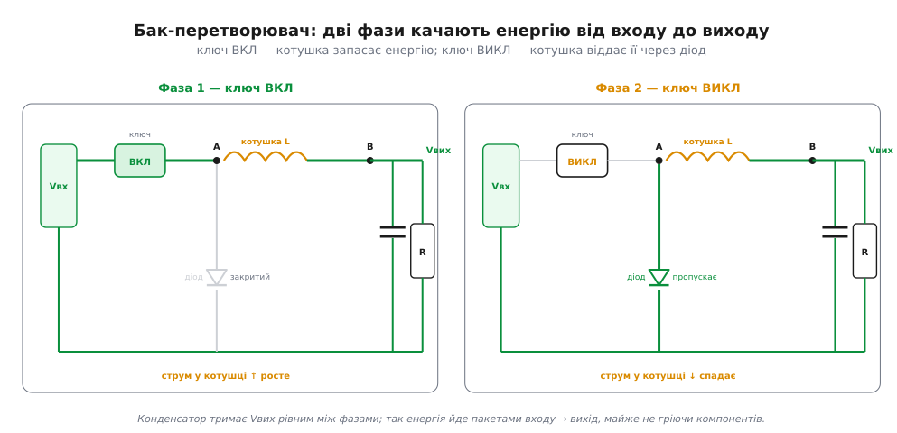
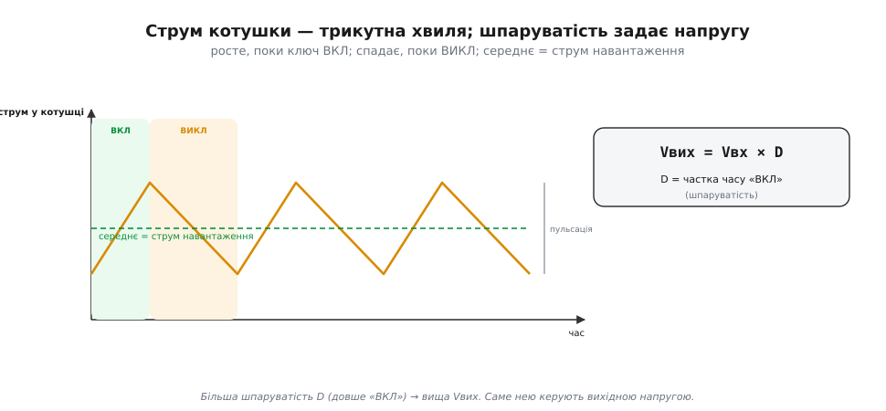
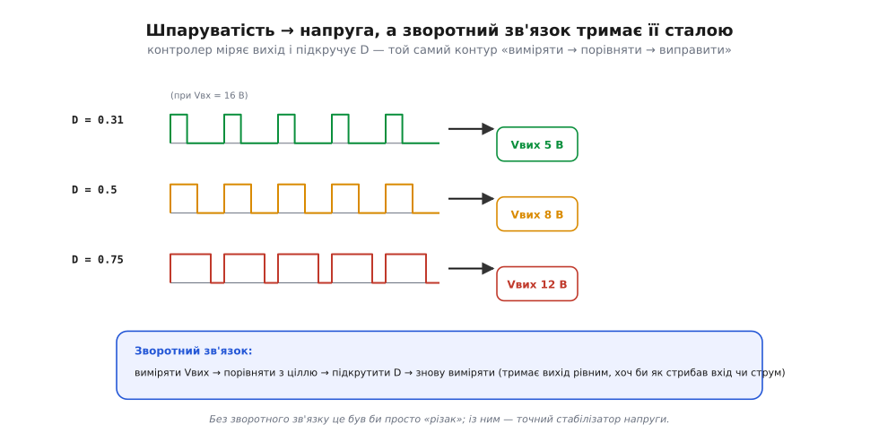
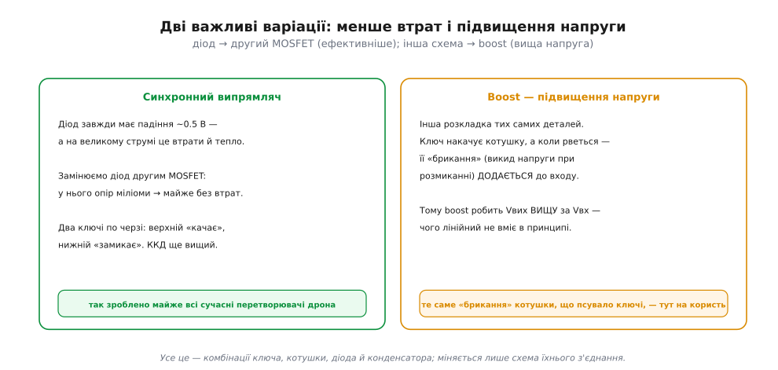

# Імпульсний перетворювач

<preknowlist>
- [Котушка (індуктивність)](topic:ph-electromagnetism/inductor-coil) — опирається зміні струму (V = L·di/dt) і не дає струмові урватися миттєво, запасаючи енергію в магнітному полі.
- [Конденсатор (ємність)](topic:hw-components/capacitor) — накопичує заряд і згладжує напругу, опираючись її різкій зміні.
- [MOSFET як силовий ключ](topic:hw-components/mosfet-power-switch) — транзистор-вимикач: або повністю відкритий, або повністю закритий, майже без втрат на собі.
- [Діод](topic:hw-components/diode-iv-curve) — пропускає струм лише в один бік; тут «ловить» струм котушки, коли ключ розмикається.
- [Шпаруватість, ШІМ](topic:hw-arch/pwm-on-mcu) — частка періоду, коли ключ увімкнено (D); саме нею задають середній рівень на виході.
</preknowlist>

[Імпульсний перетворювач](root:embedded/linear-vs-switching) не палить різницю напруг, а **переносить** енергію пакетами. Розберімо, **як** саме він це робить, — на прикладі найпоширенішого, **знижувального** перетворювача (його звуть [*buck*](topic:hw-power/buck)). І це красивий момент: чотири компоненти, кожен зі своєю роллю, — **ключ** ([MOSFET](topic:hw-components/mosfet-power-switch)), **котушка** ([індуктивність](topic:ph-electromagnetism/inductor-coil)), **діод** ([діод](topic:hw-components/diode-iv-curve)) і **конденсатор** ([ємність](topic:hw-components/capacitor)) — заграють разом.

### Дві фази бак-перетворювача

Уся робота зводиться до **двох фаз**, які повторюються десятки чи сотні тисяч разів на секунду:


*Дві фази знижувального перетворювача. **Фаза 1 (ключ ВКЛ):** вхід через котушку живить вихід; котушка чинить опір різкому зростанню струму (V = L·di/dt) і **запасає** в собі енергію магнітного поля — струм у ній плавно росте. **Фаза 2 (ключ ВИКЛ):** вхід від'єднано, але струм у котушці не може урватися миттєво — тож вона тягне його далі, тепер уже через **діод** (той «ловить» струм), і **віддає** запасене у вихід; струм спадає. Конденсатор увесь час згладжує вихід, тримаючи Vвих рівним.*

Серце цього механізму — **дві властивості [котушки](topic:ph-electromagnetism/inductor-coil)**. По-перше, вона **опирається зміні струму**: коли ключ вмикається, струм не стрибає, а плавно наростає, і котушка під час цього **накопичує** енергію. По-друге — і це ключове — струм через котушку **не може урватися миттєво**: щойно ключ розмикається, котушка робить усе, щоб струм продовжився, і «всмоктує» його через діод із землі. Діод тут — **черговий**: він замикає шлях для струму котушки, поки ключ відпочиває. А конденсатор на виході згладжує пульсації, щоб навантаження бачило рівну напругу, а не ці перемикання.

Жоден елемент не **гасить** напругу постійно (як прохідний транзистор у лінійному), тож і тепла майже немає: ключ або повністю відкритий, або закритий; котушка й конденсатор енергію **зберігають і віддають**, а не палять. Ось чому ККД сягає 90% і вище.

Може виникнути питання: а навіщо взагалі котушка — чому не вмикати-вимикати вхід прямо на навантаження? Тоді на виході був би грубий **меандр** (то повна напруга, то нуль), а не рівні 5 В. Саме котушка з конденсатором **усереднюють** цей рубаний сигнал у гладку напругу: котушка згладжує струм, конденсатор — напругу. Можна сказати, перетворювач рубає вхід на дрібні шматочки, а тоді з них «зліплює» рівний нижчий рівень — і робить це майже без втрат, бо рубає, а не гасить.

Варто згадати й **вхідні** конденсатори. Перетворювач смикає з входу струм **імпульсами** (ключ то бере повний струм, то нічого), а тонкий дріт від батареї має свою індуктивність і не любить різких ривків. Тому поряд із входом ставлять конденсатори, що тримають ці імпульси «під рукою»: вони віддають струм у моменти ввімкнення ключа й добираються між ними. Без них на вході були б викиди напруги, а батарейний дріт «дзвенів» би завадами. Ось чому перетворювач завжди оточений конденсаторами з **обох** боків.

### Струм котушки й чому Vвих = Vвх × D

Якщо подивитися на струм у котушці в часі, побачимо характерну **трикутну** хвилю: вгору під час «ВКЛ», вниз під час «ВИКЛ»:


*Струм котушки гойдається трикутником: наростає, поки ключ «ВКЛ», і спадає, поки «ВИКЛ»; його середнє значення й живить навантаження, а розмах — це пульсація. Найважливіше: вихідна напруга дорівнює вхідній, помноженій на **шпаруватість** D (частку часу, коли ключ увімкнено): Vвих = Vвх × D — це **ідеальна** формула buck-перетворювача в режимі безперервного струму котушки; реальні втрати (ключ, діод, опори, переривчастий режим) її трохи коригують.*

Звідси й керування напругою — через **[шпаруватість](topic:hw-arch/pwm-on-mcu)** (*duty cycle*, D), частку часу, коли ключ увімкнено. Що довшу частку циклу ключ тримається відкритим, то вища середня напруга на виході. А **чому** саме Vвих = Vвх × D — і звідки беруться розмах струму ΔI та межа переривчастого режиму — прямо випливає з того, що струм котушки щоперіод повертається до себе; покрокове виведення — у вставці [вольт-секундний баланс](topic:hw-power/switching-converter/math-volt-second.md). Порахуймо нашу шину:

**Приклад (шпаруватість бак-перетворювача).** Робимо 5 В із 16 В:

```
Vвих = Vвх × D
   D = Vвих / Vвх = 5 / 16 ≈ 0.31
   → ключ «ВКЛ» приблизно 31% часу кожного циклу,
     решту 69% — «ВИКЛ» (працює діод)
частота перемикання — десятки–сотні кГц
   (що вища, то менша потрібна котушка й тихіша пульсація)
```

Тридцять один відсоток часу — ключ відкритий; усе інше робить котушка з діодом. І та сама схема дає будь-яку нижчу напругу: досить змінити шпаруватість — число в коді контролера чи опір у дільнику зворотного зв'язку, — і вихід уже інший, без заміни жодної деталі. А висока частота перемикання (десятки-сотні кілогерц) дозволяє взяти маленьку котушку й конденсатор: що частіше «качаєш», то менші порції енергії й то менша пульсація.

Тут є компроміс. Підняти частоту — і котушку з конденсатором можна взяти крихітні (тому сучасні перетворювачі такі дрібні); але задорого піднімеш — і саме перемикання почне з'їдати ефективність, бо кожне ввімкнення-вимкнення транзистора має свою маленьку втрату. Тому частоту обирають як баланс: достатньо високу для малих деталей і тихої пульсації, та не настільки, щоб втрати на перемиканні з'їли весь виграш.

Є й тонкість на малому навантаженні. Коли струм великий, він тече в котушці безперервно. А коли навантаження мале, струм за фазу «ВИКЛ» може встигнути впасти до нуля — і перетворювач переходить у **переривчастий** режим, де ККД на зовсім малих струмах падає. Тому той самий перетворювач поводиться неоднаково на повному газі й на холостому — що варто пам'ятати, рахуючи живлення в режимі очікування.

Є тут і красивий, неочевидний наслідок. Оскільки перетворювач майже не втрачає енергії, потужність на вході дорівнює потужності на виході: Vвх × Iвх ≈ Vвих × Iвих. А отже, **знижуючи напругу, він підвищує струм**: щоб віддати 5 В × 4 А = 20 Вт навантаженню, він бере з 16-вольтової батареї лише близько 1.25 А (20 Вт ÷ 16 В). Тобто бак-перетворювач — наче «трансформатор постійного струму»: на вході висока напруга й малий струм, на виході — низька напруга й більший струм. Лінійний так не вміє: він бере з входу **той самий** струм, що віддає, а різницю просто палить — ще одна причина його марнотратності.

### Шпаруватість і зворотний зв'язок

Але самої формули мало: батарея просідає, навантаження стрибає — і якби шпаруватість була **фіксована**, вихід плавав би разом із входом. Тому справжній перетворювач — це **[контур зі зворотним зв'язком](root:embedded/open-vs-closed-loop)**:


*Більша шпаруватість — вища напруга (приклади для Vвх = 16 В). А щоб тримати вихід **сталим**, схема безперервно міряє Vвих, порівнює з ціллю й підкручує D: просів вхід — додала шпаруватості, зросло навантаження — теж підправила. Без цього зворотного зв'язку це був би просто «різак» напруги; із ним — точний стабілізатор.*

Тобто всередині імпульсного перетворювача крутиться той самий цикл «виміряти → порівняти → виправити», що й у [ПІД-регуляторі](root:embedded/open-vs-closed-loop) апарата чи в [серво](topic:hw-motion/servo). Він стежить за виходом сотні тисяч разів на секунду й щоразу трішки міняє шпаруватість, щоб напруга стояла як укопана, хоч би що коїлося на вході — навіть коли літієва батарея під навантаженням сповзає з 16.8 до 12 В. Саме це робить його **стабілізатором**, а не просто перетворювачем.

Цей внутрішній контур, як і будь-який зі зворотним зв'язком, можна **розхитати**: підбереш погані параметри — і замість стояти рівно, вихід почне дзвеніти чи коливатися. Тому перетворювачі **компенсують** — навмисно підбирають характеристику контуру так, щоб він був і швидкий, і стійкий. Готові мікросхеми роблять це за тебе; але якщо колись побачиш «дзвін» на виході перетворювача в осцилографі — знай, що це не магія, а той самий контур керування на [межі стійкості](root:embedded/loop-stability).

### Менше втрат і підвищення: синхронний і boost

Наостанок — дві важливі варіації тієї самої четвірки деталей:


*Дві варіації. **Синхронний випрямляч:** діод завжди має падіння ~0.5 В, а на великому струмі це помітні втрати й тепло — тож його замінюють другим MOSFET із мізерним опором, і ККД росте ще. **Boost (підвищення):** інша розкладка тих самих деталей, де «брикання» котушки (викид напруги при розмиканні) **додається** до входу — і перетворювач дає напругу **вищу** за вхідну, чого лінійний не вміє в принципі.*

Перша варіація — **синхронний випрямляч** — прибирає втрати на діоді, замінивши його керованим транзистором; так зроблено майже всі сучасні перетворювачі на дронах. Друга — [**boost**](topic:hw-power/boost) — гарна тим, що ставить собі на службу те саме [«брикання» котушки](topic:hw-components/inductor-kickback), що зазвичай псує ключі: викид напруги від різкого розмикання струму тут не шкодить, а **додається** до входу, даючи вищу напругу. Так із тих самих чотирьох деталей, лише по-іншому з'єднаних, виходить перетворювач, що **підвищує** напругу.

Між «лише знижує» і «лише підвищує» є й золота середина — **buck-boost**, що вміє і те, й те: незамінний там, де вхідна напруга може бути і вищою, і нижчою за потрібну (як батарея, що сповзає крізь рівень виходу під час розряду). А загалом «зоопарк» топологій ширший — SEPIC, flyback та інші, — але всі вони лише по-різному переставляють ті самі ключ, котушку, діод і конденсатор. Зрозумівши бак, ти зрозумів принцип усіх.

І трохи практики читання плати. Точку, де ключ «рубає» напругу (між ключем і котушкою), звуть **вузлом перемикання** — це найгаласливіше місце перетворювача, джерело [електромагнітних завад](root:embedded/linear-vs-switching), якими славляться імпульсні схеми. Тому на платі котушку, транзистори й вхідні конденсатори тримають щільною компактною групою, щоб петлі струму були короткі. Велика котушка плюс дрібна мікросхема-контролер плюс щільні конденсатори поряд — і ти впізнав імпульсний перетворювач та його шумний куток, навіть не читаючи маркування.

> 📜 Перехід від лінійних блоків живлення до імпульсних — тиха революція, яку видно неозброєним оком. Старі блоки живлення були **важкі й гарячі**: усередині — масивний залізний трансформатор і лінійний стабілізатор, що грів повітря. Сучасний зарядний пристрій телефона — крихітний і холодний, бо всередині імпульсний перетворювач на високій частоті, якому й трансформатор потрібен мізерний. Принцип бак-перетворювача знали давно, та практичним його зробили лише **швидкі силові напівпровідники** (ті самі MOSFET) — і відтоді важкі лінійні блоки зникли майже звідусіль.

На щастя, інженеру апарата рідко доводиться **проєктувати** перетворювач із нуля — це тонка справа з купою нюансів. Зазвичай беруть готовий модуль чи мікросхему-перетворювач і добирають її за кількома числами: діапазон вхідної напруги, потрібний вихід, максимальний струм, ККД. Але **розуміти**, що всередині качає енергію ключ із котушкою, а не «чорна магія», критично важливо: тоді ясно, чому модуль має саме такі межі за струмом, чому гріється, чому шумить і де його слабкі місця. Ця тема — саме про таке розуміння, а не про розрахунок витків.
