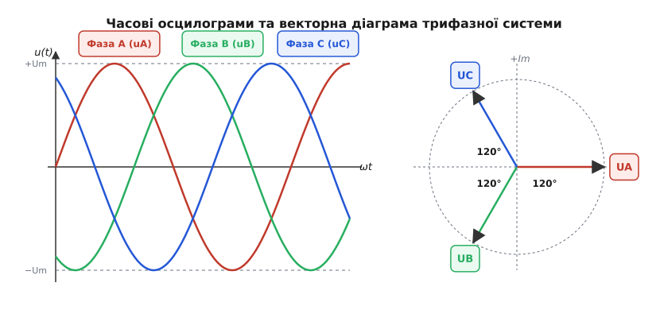
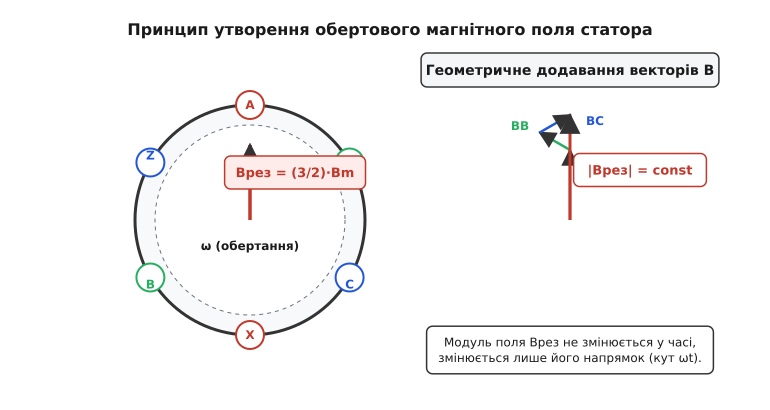
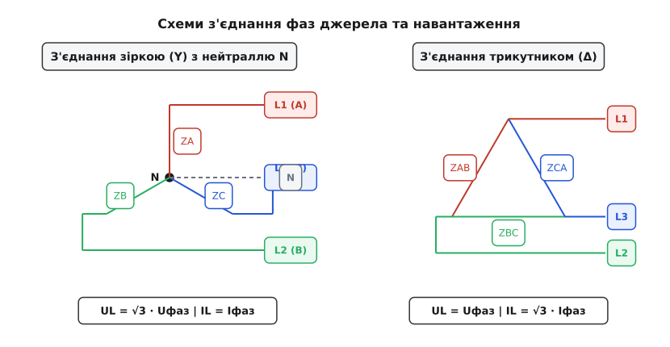
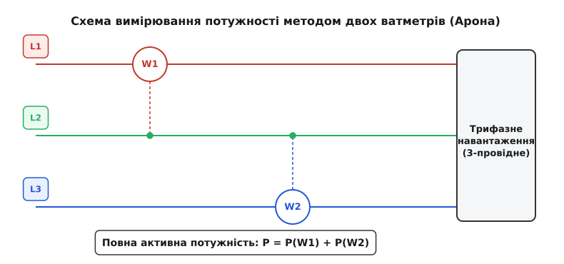

# Трифазний змінний струм

<preknowlist>
- [Діюче значення](topic:ph-electromagnetism/rms-value) — середньоквадратичне значення періодичного струму та напруги.
- [Електрична потужність](topic:ph-electromagnetism/electric-power) — активна, реактивна та повна потужність у колах змінного струму.
- [Постійний та змінний струм](topic:ph-electromagnetism/dc-vs-ac) — порівняння однофазного змінного струму та постійного струму.
- [Електромагнітна індукція](topic:ph-electromagnetism/electromagnetic-induction) — виникнення ЕРС при зміні магнітного потоку через контур.
</preknowlist>

Однофазна система змінного струму має фундаментальний фізичний недолік, зумовлений гармонічною природою електромагнітних коливань: її миттєва потужність циклічно пульсує з подвійною частотою мережі, двічі за кожен період впадаючи до нуля. У потужних генераторах та електродвигунах ця пульсація створює значні циклічні механічні напруження на валу, спричиняє вібрацію, акустичний шум та прискорене зношування підшипникових вузлів. Крім того, однофазні асинхронні двигуни позбавлені природного початкового пускового моменту, що вимагає застосування додаткових пускових конденсаторів або розщеплених обмоток. Перехід від однофазного струму до трифазного усуває пульсацію потужності, створює стале обертове магнітне поле та дає змогу передавати значно більшу потужність за суттєво меншої витрати кольорових металів.

## Фізичні обмеження однофазного струму та концепція багатофазності

При проходженні синусоїдального струму через активне навантаження `R` миттєва потужність однофазного кола `p(t)` визначається добутком миттєвих значень напруги та струму. Застосування тригонометричних перетворень показує внутрішню структуру цього процесу:

```
u(t) = U_m·sin(ωt)
i(t) = I_m·sin(ωt)

p(t) = u(t)·i(t)
= U_m·I_m·sin²(ωt)                              [підстановка виразів напруги та струму]
= (U_m·I_m / 2) · [1 - cos(2ωt)]                 [перехід через косинус подвійного кута]
= P_avg · [1 - cos(2ωt)]                         [вираження через середню активну потужність]
```

З отриманого рівняння видно, що миттєва потужність `p(t)` змінюється в межах від нуля до подвійного середнього значення `2·P_avg`. У момент часу, коли синусоїда напруги перетинає нуль, передача енергії споживачу повністю припиняється. Для побутової лампочки розжарювання або електронагрівача це пульсування згладжується тепловою інерцією елемента, але для силового турбогенератора потужністю 500 МВт подвоєна частота пульсації 100 Гц означає, що на ротор масою в десятки тонн щосекунди діє 100 потужних механічних ударів крутного моменту. Це викликає втомні руйнування металу, крутильні осциляції вала та вібрацію фундаментальних опор.

Другим фундаментальним обмеженням однофазного струму є відсутність початкового пускового моменту в асинхронних двигунах. Пульсуюче магнітне поле однофазної котушки `B(t) = B_m·sin(ωt)` за теоремою Ферраріса можна розкласти на два зустрічно обертові магнітні поля з однаковими амплітудами `B_m / 2`, які обертаються в протилежні боки з однаковими синхронними швидкостями `+n_1` та `-n_1`. При нерухомому роторі (`n = 0`) обидва поля індукують у роторі однакові за модулем, але протилежно спрямовані електромагнітні моменти. Результуючий пусковий момент дорівнює нулю (`M_{start} = 0`). Двигун гуде, але не розганяється.

Для пуску однофазного двигуна доводиться створювати штучну другорядну фазу, розташовану під кутом 90° до основної, і живити її через фазозсувний конденсатор або індуктивність. Це створює несиметричне еліптичне поле, яке забезпечує пуск, але ККД та коефіцієнт потужності однофазних двигунів залишаються низькими (60–75%), порівняно з трифазними асинхронними двигунами (88–96%).

Для подолання пульсації потужності та створення природного обертового поля виникла ідея об'єднання кількох незалежних синусоїдальних джерел ЕРС, часові фази яких зсунуті одна відносно одної на однаковий кут. Якщо підсумувати миттєві потужності декількох фаз, гармонічні осциляції подвійної частоти можуть взаємно зкомпенсуватися.

Мінімальною багатофазною системою, у якій сума миттєвих потужностей усіх фаз є строго постійною величиною, а сума миттєвих напруг і струмів у будь-який момент часу дорівнює нулю, є **трифазна система**. Вона вимагає найменшої кількості провідників при забезпеченні ідеально симетричного обертового магнітного поля. Докладніше про гостру боротьбу інженерних шкіл, наукові суперечки Галілео Ферраріса, Ніколи Тесли та Михайла Доліво-Добровольського висвітлено в розділі [📜 Історія створення трифазного струму](topic:hw-power/three-phase-rotating-field/hist-three-phase-ac.md).

## Фізика генерації трифазної електрорушійної сили

Генерація трифазного струму базується на явищі електромагнітної індукції Фарадея. У найпростішій конструктивній моделі трифазного генератора (альтернатора) на нерухомому статорі розміщують три однакові котушки (обмотки фаз A, B і C), просторово зсунуті одна відносно одної вздовж расточки статора на кут **120° (2π/3 радіан)**.

Усередині статора обертається ротор — електромагніт або постійний магніт, що живиться постійним струмом. При обертанні ротора з постійною кутовою швидкістю `ω` його магнітне поле перетинає витки статорних котушок, індукуючи в них синусоїдальні ЕРС однаковою амплітуди `E_m` та частоти `f = ω / (2π)`:

```
e_A(t) = E_m·sin(ωt)
e_B(t) = E_m·sin(ωt - 2π/3)
e_C(t) = E_m·sin(ωt - 4π/3) = E_m·sin(ωt + 2π/3)
```


*Часові осцилограми трьох фаз A, B, C зі зсувом 120° та їхня векторна діаграма на комплексній площині.*

Оскільки три ЕРС мають однакову амплітуду і симетрично рознесені за фазою на третину періоду (`120°`), їхня алгебраїчна сума в будь-який момент часу `t` строго дорівнює нулю:

```
e_A(t) + e_B(t) + e_C(t)
= E_m·[sin(ωt) + sin(ωt - 2π/3) + sin(ωt + 2π/3)]      [сума трьох фазних ЕРС]
= E_m·[sin(ωt) + 2·sin(ωt)·cos(2π/3)]                  [застосування формули суми синусів]
= E_m·[sin(ωt) + 2·sin(ωt)·(-1/2)]                     [підстановка cos(120°) = -1/2]
= E_m·[sin(ωt) - sin(ωt)]
= 0                                                     [строга тотожність нульової суми]
```

Це рівняння має фундаментальне практичне значення: воно означає, що якщо з'єднати кінці трьох котушок в одну спільну точку (нейтраль), то для повернення струму до джерела не потрібно прокладати три окремі зворотні провідники. При симетричному навантаженні сумарний струм у зворотному провіднику дорівнює нулю, що дає змогу будувати 3-провідні лінії передачі.

Конструктивно статор трифазного генератора виготовляється із ізольованих листів електротехнічної сталі для зменшення втрат на вихрові струми (струми Фуко). У пазах статора вкладаються фазні обмотки, виконані мідним емальованим проводом. Ротор силових генераторів електростанцій буває двох типів: явнополюсний (для низькооборотних гідрогенераторів із великою кількістю пар полюсів `p`) та неявнополюсний (для високооборотних турбогенераторів АЕС і ТЕС зі швидкістю 3000 об/хв при `p = 1`).

При підключенні навантаження протікаючі по обмотках статора трифазні струми створюють власне магнітне поле статора. Це явище називається **реакцією якоря**. У симетричному трифазному генераторі поле реакції якоря обертається в повітряному зазорі з такою ж синхронною швидкістю `ω`, як і ротор, перебуваючи відносно ротора в нерухомому стані. Завдяки цьому магнітне поле генератора не спотворюється часовими пульсаціями, а напруга на виході залишається строго синусоїдальною.

## Постійність миттєвої потужності симетричної трифазної системи

Головною фізичною перевагою трифазного струму є постійність його результуючої миттєвої потужності. Для симетричного навантаження, у якому опори всіх трьох фаз однакові (`Z_A = Z_B = Z_C = Z`), фазні струми відстають від відповідних фазних напруг на однаковий кут `φ`.

Розрахуємо сумарну миттєву потужність `p_{total}(t)` як суму миттєвих потужностей трьох фаз:

```
p_A(t) = U_ph·I_ph·[cos(φ) - cos(2ωt - φ)]
p_B(t) = U_ph·I_ph·[cos(φ) - cos(2ωt - 2π/3 - φ)]
p_C(t) = U_ph·I_ph·[cos(φ) - cos(2ωt - 4π/3 - φ)]
```

При додаванні трьох виразів другі доданки являють собою трійку синусоїдальних коливань подвоєної частоти `2ω`, які мають однакові амплітуди `U_ph·I_ph` та зсунуті один відносно одного на `120°` (`2π/3`). Як ми вже довели вище, сума трьох таких симетричних гармонік дорівнює нулю у будь-який момент часу.

Таким чином, сумарна миттєва потужність становить:

```
p_{total}(t) = p_A(t) + p_B(t) + p_C(t) = 3·U_ph·I_ph·cos(φ) = const
```

Миттєва потужність симетричної трифазної системи не містить жодного часового доданка. Вона є строго сталою в часі. Завдяки цьому електрогенератори та двигуни трифазного струму працюють з абсолютно рівномірним обертальним моментом без вібрацій та підвищеного шуму. 

Фізично це означає, що енергія передається по трифазній лінії суцільним неелектромагнітним потоком сталого модуля. Вектор Пойнтінга, який описує густину потоку електромагнітної енергії в просторі навколо трифазних проводів, має постійну інтегральну величину за кожен момент часу. Детальний математичний вивід та матричні перетворення подано у вставці [🧮 Математичний вивід властивостей трифазного струму](topic:hw-power/three-phase-rotating-field/math-three-phase-ac.md).

## Утворення обертового магнітного поля та асинхронний двигун

Завдяки зсуву фазних струмів у часі на `120°` та просторовому зсуву котушок статора на `120°` трифазна система природним чином створює **обертове магнітне поле**.

Розглянемо статор, на якому розташовано три котушки A, B, C. Кожна котушка при проходженні через неї струму створює пульсуюче магнітне поле, вектор індукції якого спрямований вздовж осі цієї котушки:

```
B_A(t) = B_m·sin(ωt)·e_A
B_B(t) = B_m·sin(ωt - 2π/3)·e_B
B_C(t) = B_m·sin(ωt - 4π/3)·e_C
```

Де `e_A`, `e_B`, `e_C` — одиничні вектори осей котушок у просторі.


*Просторове додавання магнітних індукцій трьох котушок, що створює результуючий вектор сталого модуля, який обертається.*

Додаючи ці три вектори геометрично на площині, отримуємо результуючий вектор магнітної індукції `B_{rot}`:

1. **Модуль вектора:** Модуль результуючої магнітної індукції є постійним у часі і дорівнює **`B_{rot} = (3/2)·B_m`**, де `B_m` — амплітуда поля однієї фази.
2. **Напрямок вектора:** Вектор `B_{rot}` обертається в просторі з кутовою швидкістю `ω = 2π·f`.

Синхронна частота обертання поля `n_1` (в обертах за хвилину) залежить від частоти мережі `f` та кількості пар полюсів обмотки статора `p`:

```
n_1 = (60 · f) / p
```

Для частоти `f = 50 Гц` при одній парі полюсів (`p = 1`) магнітне поле обертається зі швидкістю `3000 об/хв`, при двох парах (`p = 2`) — `1500 об/хв`, при трьох (`p = 3`) — `1000 об/хв`.

Якщо всередині такого статора розмістити ротор у вигляді короткозамкненого барабана («біляча клітка»), обертове магнітне поле статора перетинатиме його провідники, індукуючи в них ЕРС та струми. Згідно з законом Ампера, взаємодія індукованого струму ротора з обертовим магнітним полем статора створює механічний обертальний момент. Ротор починає обертатися в бік обертання поля зі швидкістю `n_2`, яка трохи менша за синхронну швидкість `n_1`. Ця різниця швидкостей називається **ковзанням (slip)**:

```
s = (n_1 - n_2) / n_1
```

Частота індукованого струму в роторі дорівнює `f_2 = s · f_1`. При заклинюванні ротора (`n_2 = 0`) ковзання `s = 1`, ЕРС і струми ротора досягають максимальних пускових значень, викликаючи пускові струми статора, які у 5–8 разів перевищують номінальний струм. У режимі холостого ходу ротор розганяється майже до синхронної швидкості, і ковзання прямує до нуля (`s ≈ 0`).

Електромагнітний момент двигуна `M` описується **формулою Клосса**:

```
M = (2 · M_max) / (s / s_cr + s_cr / s)
```

Де `M_max` — критичний (максимальний) момент двигуна, а `s_cr` — критичне ковзання, при якому момент досягає максимуму. Формула Клосса показує перехід від стійкої робочої ділянки характеристики (де момент зростає зі збільшенням навантаження) до перевантажувальної ділянки заклинювання.

Так працює **асинхронний двигун з короткозамкненим ротором** — наймасовіший електричний двигун сучасної цивілізації, винайдений Михайлом Доліво-Добровольським.

## Топології з'єднання трифазних кіл: Зірка та Трикутник

Фази генератора (або вторинних обмоток трансформатора) та фази споживача можуть об'єднуватися за двома основними схемами: «зірка» (символ `Y`) та «трикутник» (символ `Δ`).


*Топології трифазних кіл: з'єднання зіркою з нейтральним провідником N та з'єднання трикутником.*

### З'єднання зіркою (Y)

При з'єднанні зіркою кінці трьох фазних обмоток джерела (або навантаження) об'єднуються в одну спільну точку, яка називається **нейтраллю (або нульовою точкою N)**. Початкові виводи фаз A, B, C підключаються до лінійних провідників L1, L2, L3.

Розрізняють дві величини напруг і струмів:
- **Фазна напруга (`U_ph`):** напруга між початком фази та нейтраллю N (`U_AN`, `U_BN`, `U_CN`).
- **Лінійна напруга (`U_L`):** напруга між двома лінійними провідниками (`U_AB`, `U_BC`, `U_CA`).

З векторної діаграми видно, що лінійна напруга являє собою геометричну різницю двох фазних напруг: `U_AB = U_A - U_B`. Оскільки кут між векторами `U_A` та `U_B` становить `120°`, модуль лінійного вектора перевищує фазний у `√3` разів:

```
U_L = √3 · U_ph ≈ 1.732 · U_ph
```

У стандартній європейській мережі низької напруги фазна напруга становить `U_ph = 230 В`, а лінійна напруга дорівнює `U_L = √3 · 230 В ≈ 400 В` (раніше 220 В / 380 В).

При з'єднанні зіркою лінійний струм, що тече по проводу L1, проходить безпосередньо через фазу навантаження, тому:

```
I_L = I_ph
```


> 🔧 **Навіщо потрібен нейтральний провідник N.**
> У чотирипровідній мережі `Y/N` нейтральний провідник фіксує потенціал нейтральної точки навантаження `N'` на рівні нейтралі джерела `N`. При несиметричному побутовому навантаженні (наприклад, у будинку на фазі A увімкнули чайник, на фазі B — комп'ютер, а фаза C вільна) струми фаз не рівні (`I_A ≠ I_B ≠ I_C`). Різниця струмів повертається через нейтральний провідник: `I_N = I_A + I_B + I_C`.
> Якщо нейтральний провідник обірветься (**«обрив нуля»**), потенціал точки `N'` зміститься у бік більш навантаженої фази. У результаті на фазі з малим навантаженням напруга підскочить майже до лінійної (`350–380 В`), що спричинить вибух конденсаторів та пожежу побутової електроніки, а на перевантаженій фазі напруга впаде до `120–150 В`.

Аналіз режиму обриву нейтрального провідника є важливим елементом інженерного проектування електромереж. У чотирипровідних мережах для запобігання небезпечному зміщенню нейтралі застосовують пристрої захисту від перенапруги (реле напруги), які відключають споживачів при виході напруги за межі 190–250 В. Також виконують повторні заземлення провідника N на вводі в кожну будівлю.

### З'єднання трикутником (Δ)

При з'єднанні трикутником кінець першої фази обмотки з'єднується з початком другої, кінець другої — з початком третьої, а кінець третьої — з початком першої, утворюючи замкнений контур. Лінійні провідники L1, L2, L3 підключаються до вершин цього трикутника.

При з'єднанні трикутником кожна фаза навантаження підключається безпосередньо між двома лінійними проводами, тому фазна напруга дорівнює лінійній:

```
U_L = U_ph
```

Лінійний струм у вузлі трикутника за першим законом Кірхгофа дорівнює різниці двох фазних струмів (наприклад, `I_L1 = I_AB - I_CA`). Для симетричного навантаження модуль лінійного струму перевищує фазний струм у `√3` разів:

```
I_L = √3 · I_ph ≈ 1.732 · I_ph
```

З'єднання трикутником не має нейтрального провідника (3-провідна мережа). Воно широко застосовується для живлення потужних трифазних електродвигунів, електропечей та міжпідстанційних трансформаторів. Перевагою трикутника є те, що при несиметричному навантаженні фазні напруги залишаються жорстко зафіксованими лінійними напругами генератора, і перенапруг на фазах не виникає.

Крім того, схема трикутника створює замкнений контур для струмів третьої гармоніки. Струми частоти `150 Гц` є синфазними у всіх трьох фазах, тому вони циркулюють усередині контуру трикутника, не виходячи у лінійні провідники мережі, що запобігає спотворенню синусоїдності напруги.

Для пуску потужних трифазних асинхронних двигунів використовується перемикач схеми з зірки на трикутник. При пуску обмотки двигуна вмикаються зіркою `Y`, що зменшує фазну напругу в `√3` разів, а пусковий струм і момент — у 3 рази. Після розгону ротора контактори автоматично перемикають обмотки у робочу схему трикутника `Δ`.

## Розрахунок потужності та метод двох ватметрів

Повна активна потужність трифазного споживача незалежно від схеми з'єднання дорівнює сумі активних потужностей його окремих фаз. У симетричному режимі:

```
P = 3 · P_ph = 3 · U_ph · I_ph · cos(φ)
```

Виразимо активну потужність через лінійні напруги `U_L` та струми `I_L`:

1. **Для зірки (Y):** `U_ph = U_L / √3`, `I_ph = I_L`:
   ```
   P = 3 · (U_L / √3) · I_L · cos(φ) = √3 · U_L · I_L · cos(φ)
   ```
2. **Для трикутника (Δ):** `U_ph = U_L`, `I_ph = I_L / √3`:
   ```
   P = 3 · U_L · (I_L / √3) · cos(φ) = √3 · U_L · I_L · cos(φ)
   ```

Формули активної `P`, реактивної `Q` та повної `S` потужності симетричного трифазного кола через лінійні величини є однаковими для обох топологій:

```
P = √3 · U_L · I_L · cos(φ)    [Активна потужність, Вт (W)]
Q = √3 · U_L · I_L · sin(φ)    [Реактивна потужність, вар (VAR)]
S = √3 · U_L · I_L             [Повна потужність, В·А (VA)]
```

### Компенсація реактивної потужності трифазного навантаження

Оскільки більшість промислових споживачів має індуктивний характер навантаження (електродвигуни, трансформатори), коефіцієнт потужності `cos(φ)` виявляється суттєво меншим за одиницю (0.70–0.80). Це змушує генератори та лінії передавати реактивний струм, який розігріває проводи і викликає додаткові втрати напруги.

Для підвищення `cos(φ)` до нормованих значень 0.95–0.98 паралельно трифазному навантаженню підключають трифазні батареї статичних конденсаторів. Найчастіше конденсатори з'єднують трикутником `Δ`. Необхідна реактивна потужність конденсаторної батареї розраховується за формулою:

```
Q_c = P · [tg(φ_1) - tg(φ_2)]
```

Ємність однієї фази конденсатора при з'єднанні трикутником виражається як: `C_Δ = Q_c / (3 · ω · U_L²)`. При з'єднанні трикутником необхідна ємність у три рази менша за ємність конденсаторів у схемі зірки `C_Y = 3 · C_Δ`, що робить схему трикутника економічно вигіднішою.

### Вимірювання потужності: схема Арона (метод двох ватметрів)

У трипровідних трифазних мережах без нейтрального провідника (як при з'єднанні `Δ`, так і при `Y` без N) активну потужність несиметричного навантаження можна точно виміряти за допомогою всього **двох однофазних ватметрів**.


*Підключення двох ватметрів у трипровідну мережу для вимірювання повної активної потужності трифазного навантаження.*

Стумові обмотки двох ватметрів вмикаються в розрив двох будь-яких лінійних провідників (наприклад, L1 і L3), а їхні обмотки напруги підключаються між відповідним лінійним проводом і третім вільним проводом (L2).

Спеціальний довідник усіх стандартних напруг, колірних маркувань та схем наведено у вставці [📋 Довідник параметрів, стандартів та схематики трифазних систем](topic:hw-power/three-phase-rotating-field/api-three-phase-ac.md).

Показання ватметрів `W_1` та `W_2` визначаються виразами:

```
P_W1 = U_L · I_L · cos(30° - φ)
P_W2 = U_L · I_L · cos(30° + φ)
```

Сума покази двох приладів завжди дорівнює повній активній потужності кола:

```
P = P_W1 + P_W2
```

При зміні коефіцієнта потужності `cos(φ)` покази ватметрів змінюються:
- При чисто активному навантаженні (`φ = 0`, `cos(φ) = 1`): `P_W1 = P_W2`, обидва прилади показують однакову потужність.
- При `cos(φ) = 0.5` (`φ = 60°`): `P_W2 = cos(90°) = 0`, весь потік потужності вимірює перший ватметр.
- При `cos(φ) < 0.5` (`φ > 60°`): стрелка другого ватметра `W_2` відхиляється вхідну сторону (покази стають від'ємними), і активна потужність розраховується як різниця показів: `P = P_W1 - |P_W2|`.

## Несиметричні режими та метод симетричних складових

У реальних розподільчих мережах споживачі розподілені по фазах нерівномірно. Несиметрія навантаження спричиняє несиметрію фазних струмів та напруг, що призводить до додаткових втрат енергії, перегріву трансформаторів та появи зворотного магнітного поля в двигунах, яке гальмує ротор.

Для аналізу несиметричних режимів у 1918 році американський інженер Чарльз Фортеск'ю (Charles LeGeyt Fortescue) запропонував **метод симетричних складових**. Згідно з теоремою Фортеск'ю, будь-яка несиметрична 3-фазна система векторів (напруг або струмів) розкладається на три симетричні системи:

1. **Пряма послідовність (`U_1`):** три вектори однаковою амплітуди, зсунуті на `120°`, із прямим чередуванням фаз A → B → C. Вона створює корисний обертальний момент двигунів.
2. **Зворотна послідовність (`U_2`):** три вектори однаковою амплітуди, зсунуті на `120°`, із зворотним чередуванням фаз A → C → B. Вона створює гальмівний момент та викликає паразитно розігрів роторів.
3. **Нульова послідовність (`U_0`):** три однакові за модулем та напрямком (синфазні) вектори. Вони виникають лише при наявності замкненого нейтрального провідника або однофазних коротких замикань на землю.

Математичне моделювання та чисельну симуляцію трифазних кіл у C та C++ детально розібрано у вставці [⚙️ Симуляція та розрахунок трифазних кіл](topic:hw-power/three-phase-rotating-field/proj-three-phase-ac.md).

Практичний аналіз несиметричних режимів виконується мікропроцесорними блоками релейного захисту. При перевищенні коефіцієнта несиметрії по зворотній послідовності `K_2 = (U_2 / U_1) · 100%` понад допустимі 2–5% захист відключає аварійну ділянку мережі.

## Економічні та інженерні переваги трифазної інфраструктури

Посюдне впровадження трифазного змінного струму в світовій енергетиці зумовлене комплексом фундаментальних техніко-економічних переваг:

1. **Економія металу провідників:** Для передачі однаковою активної потужності `P` на однакову відстань при однаковій напрузі та втратах потужності в лінії, трифазна 3-провідна система вимагає на **25% менше маси кольорового металу (міді чи алюмінію)**, ніж три незалежні однофазні лінії (6 провідників) або двофазна 4-провідна система.
2. **Досконалість асинхронного двигуна:** Трифазний асинхронний двигун з короткозамкненим ротором не має колектора, щіток чи контактних кілець. Він набагато дешевший, надійніший та має більший ККД порівняно з однофазними двигунами чи двигунами постійного струму аналогічної потужності.
3. **Універсальність напруг:** Перехід від з'єднання зіркою `Y` до трикутника `Δ` дає змогу використовувати те саме обладнання при двох різних напругах мережі (наприклад, `230/400 В` або `400/690 В`).
4. **Легкість трансформації:** Трифазний трансформатор на єдиному тристержньовому магнітопроводі значно менший за масою та габаритами, ніж три окремі однофазні трансформатори такої ж сумарної потужності.

Розглянемо детальніше математику масового заощадження матеріалу провідників. При передачі потужності `P` на відстань `L` лінійні втрати складають `ΔP = 3 · I_ph² · R_line`. Для трифазного кола струм фази `I_ph = P / (√3 · U_L · cos(φ))`. Шляхом прямих розрахунків доводиться, що площа перерізу кожного з трьох проводів трифазної лінії виявляється у два рази меншою за площу перерізу проводів однофазної лінії, що живить те саме навантаження при тій самій лінійній напрузі `U_L`. У результаті загальний об'єм міді `V = 3 · S_3ph · L` становить 75% від об'єму міді `V_{1ph} = 2 · S_1ph · L` для двох еквівалентних однофазних ліній.

Завдяки сукупності цих властивостей трифазний змінний струм є єдиним глобальним інженерним стандартом генерації, транспортування та споживання електричної енергії на нашій планеті.
