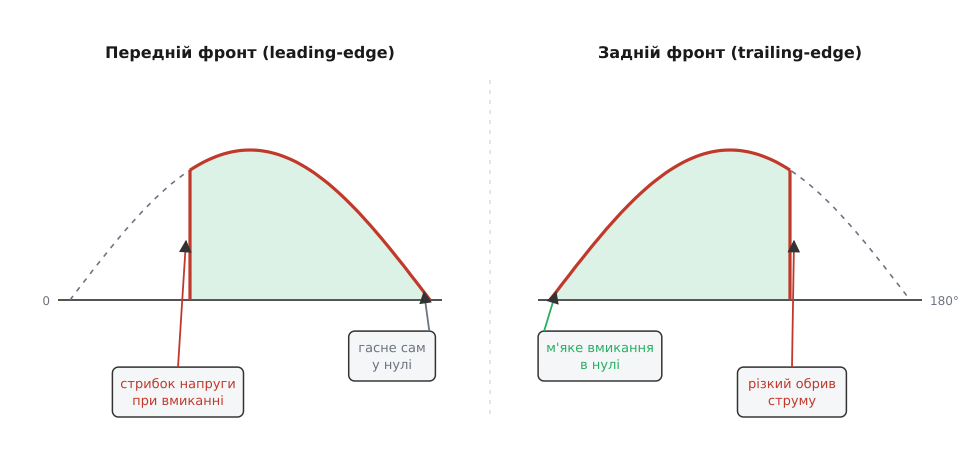
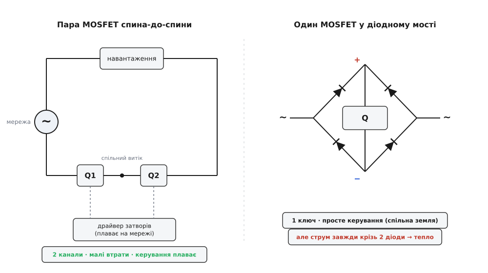
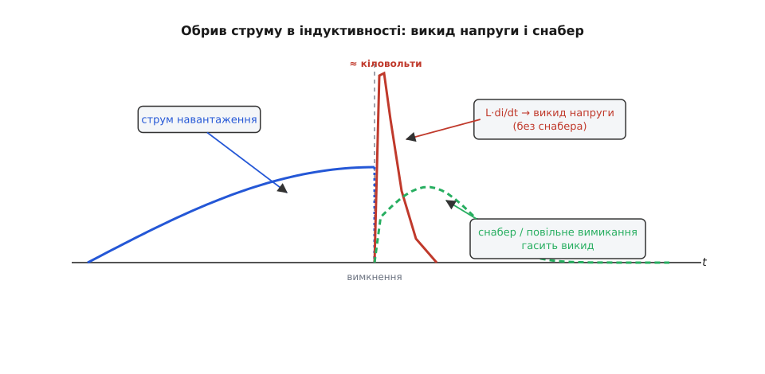

# Trailing-edge dimmer

<preknowlist>
- [Фазове керування: димер](root:hw-power/phase-control-dimmer) — як обрізають півхвилю мережі за кутом, відлік від переходу через нуль, зв'язок кута й потужності.
- [Симістор](root:hw-components/triac) — двобічний ключ, що защіпається коротким імпульсом і гасне сам лише на переході струму через нуль.
- [Силовий ключ на MOSFET](root:hw-components/mosfet-power-switch) — польовий транзистор, який відкривають і закривають затвором будь-якої миті.
- [MOSFET спина-до-спини](root:hw-power/mosfet-back-to-back) — як із двох однобічних транзисторів зробити ключ, що блокує змінний струм в обидва боки.
</preknowlist>

Класичний симісторний [димер](root:hw-power/phase-control-dimmer) вмикає ключ **посеред** півхвилі. У ту мить миттєва напруга мережі вже висока — сто, двісті вольт, — тож напруга на навантаженні **стрибком** злітає з нуля до цього значення за частки мікросекунди. Цей стрибок — корінь майже всіх бід симісторного димера: різкий фронт заганяє голку струму в кожен вхідний конденсатор, змушує гудіти залізо трансформаторів і котушок, розсіює завади в ефір і в проводи. Напрошується протилежна думка. А що, як вмикати ключ **м'яко в самому нулі**, де напруга й так близька до нуля й стрибати нема з чого, — а обрізати натомість не початок півхвилі, а її **кінець**? Саме так працює **димер із відсіканням заднього фронту** *(trailing-edge dimmer; інша назва — reverse-phase control, «зворотне фазове керування»)*.

### Дзеркало симісторного димера

Обидва димери роблять те саме — віддають навантаженню лише **частину** кожної півхвилі, — але відрізають різні її половини. Симістор мовчить від нуля й вмикається із затримкою, тож навантаженню дістається **хвіст** півхвилі; це відсікання **переднього** фронту. Транзисторний димер робить навпаки: відкриває ключ **одразу** на переході через нуль, проводить **початок** півхвилі, а потім у якийсь момент **обриває** струм — і навантаженню дістається **перед** півхвилі. Це відсікання **заднього** фронту.


*Ліворуч (передній фронт): ключ вмикається посеред півхвилі — напруга стрибає вгору, різкий фронт вмикання; далі струм сам гасне в нулі. Праворуч (задній фронт): ключ вмикається м'яко в нулі, без стрибка, і обривається пізніше — різким лишається тепер вимкнення. Залите — те, що дісталося навантаженню.*

Скільки потужності віддає такий димер — питання того самого квадрата напруги, що й у симісторного, лише дзеркального. Якщо провідність триває від нуля до кута β, частка повної потужності виходить

```
P(β) / Pмакс = (1/π) · [ β − sin(2β)/2 ]      (β у радіанах)

β = 180°  →  1.00   (проводить усю півхвилю)
β = 90°   →  0.50   (рівно половина)
β = 0°    →  0.00   (не проводить)
```

Половина потужності припадає на β = 90° — точнісінько як у димера переднього фронту, бо це та сама [нелінійна крива «потужність від кута»](root:hw-power/phase-control-dimmer/math-phase-power.md), просто відрахована з іншого боку півхвилі. Різниця між двома димерами — **не** в діапазоні яскравості (обидва можуть від нуля до повної), а в тому, **де стоїть різкий фронт** і **яке навантаження цей фронт витримає**.

### Чому тут безсилий симістор

Головна відмінність заднього фронту прихована в одному слові — **обриває**. Щоб відрізати кінець півхвилі, ключ треба **вимкнути посеред неї, коли струм ще тече**. А саме цього [симістор](root:hw-components/triac) і не вміє. Тиристорні прилади защіпаються, мов дверна засувка: коротким імпульсом на затвор їх відкривають, а закриваються вони **самі** й лише тоді, коли струм крізь них природно спаде до нуля — на переході синусоїди. Керуючого «вимкнути» в симістора просто немає. Вимкнути його примусово посеред півхвилі можна тільки хитрою зовнішньою схемою, яка на мить зустрічним струмом зіб'є струм у ньому до нуля, — це [примусова комутація тиристора](root:hw-components/forced-commutation), громіздка й непрактична для побутового димера.

Тому димер заднього фронту будують на приладі, що слухається команди «закрийся» будь-якої миті, — на [польовому транзисторі (MOSFET)](root:hw-components/mosfet-power-switch) або, для великих потужностей, на [IGBT](root:hw-components/igbt). Опустив напругу на затворі — канал закрився, струм обірвано там, де забажалося. Ось чому trailing-edge димери часто й називають просто **транзисторними**, на противагу симісторним.

> 🔧 **Навіщо це знати.** На стіні це не абстракція, а сумісність. Симісторний (передній фронт) і транзисторний (задній фронт) димери зовні однакові, але всередині — різні прилади з різними «характерами». Поставиш не той під не те навантаження — лампа гудітиме, блиматиме або не засвітиться зовсім. Тому на регуляторах і драйверах пишуть, який фронт вони дають чи очікують.

### Ключ змінного струму з однобічних транзисторів

Тут ховається технічна морока. Мережа — змінна: половину періоду напруга додатна, половину — від'ємна. А один MOSFET блокує струм лише **в один бік**: у зворотному крізь нього завжди пройде струм через [вбудований body-діод](root:hw-power/mosfet-back-to-back), якого не прибрати. Одинокий транзистор — це не ключ змінного струму, а ключ із діодом навперекій. Є два способи це обійти.

Перший — поставити **два транзистори [спина-до-спини](root:hw-power/mosfet-back-to-back)**, спільними витоками разом, під одним керуванням. Їхні body-діоди дивляться назустріч, тож у вимкненому стані завжди один із них стоїть поперек струму, хай яка полярність; у ввімкненому — обидва канали проводять в обидва боки. Це основне рішення: малий спад (лише два опори відкритих каналів), зате керувати ним складніше.

Другий — узяти **один MOSFET і вкласти його в [діодний міст](root:hw-power/bridge-rectifier)**. Міст випрямляє змінний струм на своїй діагоналі в односпрямований, тож транзистор завжди бачить лише одну полярність — і однобічного ключа досить. Схема простіша керуванням (один транзистор, витік прив'язаний до спільної точки), але за це доводиться платити: струм навантаження **завжди** тече крізь **два діоди** мосту послідовно з каналом, а на кожному діоді сідає близько вольта — і цей вольт перетворюється на тепло.


*Ліворуч: два транзистори спільними витоками, керовані плаваючим драйвером, — струм іде лише крізь два канали, втрати малі. Праворуч: один транзистор у мості — керувати легше (спільна земля), але струм завжди проходить два діодні спади, які гріються.*

**Скільки тепла коштує «дешевий» міст.** Лампа розжарення 100 Вт у мережі 230 В: діюче значення струму I ≈ 100 / 230 ≈ 0.43 А. Порівняймо провідні втрати двох схем ключа (опір відкритого каналу Rds(on) ≈ 0.3 Ом, спад на діоді Vf ≈ 0.9 В):

```
Спина-до-спини (два канали):
  P = 2 · Rds · I² = 2 × 0.3 × 0.43² ≈ 0.11 Вт

MOSFET у мості (два діоди + канал):
  P = 2 · Vf · I + Rds · I²
    = 2 × 0.9 × 0.43  +  0.3 × 0.43²
    ≈ 0.77 + 0.06 ≈ 0.83 Вт
```

Майже всемеро більше тепла — і воно від струму, а не від опору, тож не зникне, хоч який добрий транзистор постав. Ось чому міст ставлять у дешеві димери на кілька десятків ват, а серйозні потужності роблять на парі спина-до-спини.

### Керування, що плаває на мережі

За елегантність пари спина-до-спини теж треба платити — керуванням. Спільний витік двох транзисторів не сидить на землі: він **гойдається разом із мережею**, від −325 до +325 В у розетці на 230 В. А відкрити MOSFET можна лише піднявши затвор **відносно його витоку** на кілька вольт. Отже, керуючу напругу треба подавати не від землі, а «верхи» на цьому вузлі, що літає туди-сюди сотнями вольт. Роблять це [драйвером затвора](root:hw-power/gate-driver) з окремим плаваючим живленням і [зсувом рівня](root:hw-power/high-side-level-shift), який переносить логічний сигнал мікроконтролера на потенціал витоку. Уся ця обв'язка — причина, чому транзисторний димер складніший і дорожчий за симісторний, де короткий імпульс защіпки можна подати навіть просто через оптопару.

### Вмикаємо в нулі, вимикаємо за таймером

Логіка керування дзеркальна до симісторної. Детектор нуля так само на кожному переході синусоїди видає імпульс — від нього починається відлік. Але тепер у момент нуля ми ключ **відкриваємо**, а таймер відлічує **час провідності**, по спливанні якого ключ **закриваємо**. І ще одна тонкість: MOSFET проводить, лише **поки** на затворі тримається напруга, — тож затвор треба тримати відкритим **усю провідну частину**, а не бити коротким імпульсом, як защіпку симістора.

**Вимкнення заднього фронту в прошивці.** Мережа 50 Гц, треба половина потужності (β = 90°). Півперіод — 10 мс, час провідності d = (90 / 180) × 10 = 5.0 мс. Відкрити в нулі, закрити через 5 мс:

:::tabs
```cpp
// Задній фронт: у нулі — відкрити ключ, по спливанні часу провідності — закрити.
void on_zero_cross(void) {         // переривання від детектора нуля
    gate_write(1);                 // ВІДКРИТИ ключ одразу (тримаємо рівень!)
    timer_start_oneshot_us(5000);  // 5.0 мс провідності = 50% для 50 Гц
}
void on_timer(void) {              // сплив час провідності
    gate_write(0);                 // ЗАКРИТИ ключ — обрізаємо задній фронт
}
```
```micropython
from machine import Pin, Timer

gate = Pin(15, Pin.OUT)            # затвор ключа (через драйвер)
tmr = Timer(0)

def turn_off(t):                   # сплив час провідності
    gate.off()                     # ЗАКРИТИ ключ — обрізаємо задній фронт

def on_zero_cross(pin):            # переривання від детектора нуля
    gate.on()                      # ВІДКРИТИ ключ одразу — і тримаємо рівень
    tmr.init(mode=Timer.ONE_SHOT, period=5, callback=turn_off)  # 5.0 мс = 50%

zc = Pin(14, Pin.IN)               # детектор нуля
zc.irq(trigger=Pin.IRQ_RISING, handler=on_zero_cross)
```
:::

Порівняно з симісторним димером, де таймер відлічує затримку **до** імпульсу вмикання, тут той самий таймер відлічує момент **вимикання** — і в цьому вся інверсія «переднього» на «задній».

### Найважливіше: який фронт для якого навантаження

Тепер про те, заради чого задній фронт узагалі придумали. Коли ключ вимикається посеред півхвилі, він **обриває струм** — і що станеться далі, вирішує **природа навантаження**.

**Резистивному навантаженню** — лампі розжарення, нагрівачеві — байдуже: струм у ньому пропорційний напрузі, обірвати його можна будь-коли, буде лише ступінька напруги вниз. Тут годяться обидва фронти.

**Ємнісному навантаженню** задній фронт **пасує якнайкраще** — і саме воно його породило: reverse-phase керування народилося заради «електронних трансформаторів» для галогенних ламп, яким симісторний передній фронт відверто шкодив [(як це сталося)](root:hw-power/trailing-edge-dimmer/hist-reverse-phase.md). Вхід сучасного [драйвера LED](root:hw-power/led-driver) чи «електронного трансформатора» для галогенок — це, по суті, [імпульсний блок живлення](root:hw-power/switching-converter): [діодний міст і конденсатор](root:hw-power/rectification) на вході. Якщо вдарити по такому входу переднім фронтом — різким стрибком напруги в уже високій точці синусоїди, — розряджений конденсатор відповість страшною голкою [пускового струму](root:hw-power/inrush-current), від якої димер гріється, лампа клацає, а завад повно. Задній фронт цієї біди позбавлений **у корені**: він вмикається в нулі, де напруга майже нульова, тож стрибати конденсаторному входу нема з чого — старт завжди м'який.

> 🔧 **Навіщо це знати.** Ось чому «димеровані» LED-лампи так часто просять саме trailing-edge регулятор. Їхній вхід — ємнісний, і м'яке вмикання в нулі рятує його від ударів, а заразом гасить мерехтіння та гудіння. Поставиш такий світлодіод на старий симісторний димер — і в кращому разі він блиматиме, у гіршому не запуститься, бо його струм замалий, щоб утримати симістор відкритим.

А от **індуктивному навантаженню** — магнітному (залізному) трансформаторові, обмотці двигуна, дроселю — задній фронт **протипоказаний**, і причина фізична. Струм в індуктивності не можна обірвати миттєво: котушка боронить зміну свого струму, відповідаючи на різке вимикання викидом напруги U = L · di/dt. Що швидше рвеш струм — то вищий викид.

**Викид на індуктивному навантаженні при обриві струму.** Магнітний трансформатор із намагнічувальною індуктивністю L ≈ 1 Гн; у мить вимикання крізь нього тече i ≈ 40 мА; ключ закривається за Δt ≈ 2 мкс. Яку напругу «побачить» ключ?

```
U = L · di/dt ≈ L · i / Δt
  = 1 Гн × 0.040 А / (2×10⁻⁶ с)
  ≈ 20 000 В   (без жодного обмеження)
```

Двадцять кіловольт — звісно, у реальності стільки не буде: викид зріже пробій транзистора чи снабер. Але число показує **масштаб насильства**: обірвати струм індуктивності — це вдарити ключ напругою, здатною його вбити. Тому магнітні трансформатори й моторчики вентиляторів віддають **симісторному** димеру переднього фронту: той вимикається лише **на природному нулі струму**, де в котушці вже не лишилося запасеної енергії, якій нема куди подітися.


*Струм навантаження різко обірвано в момент вимкнення. Без захисту індуктивність відповідає високою голкою напруги (L·di/dt — до кіловольтів). Снабер або навмисне сповільнене вимикання розтягують фронт у часі й гасять викид до безпечного горба.*

Виходить проста таблиця сумісності: резистивне — обидва фронти; ємнісне (LED-драйвери, електронні трансформатори) — задній; індуктивне (магнітні трансформатори, двигуни) — передній.

### Снабер і повільне вимикання

Навіть на «дозволених» навантаженнях різке вимикання лишає по собі різкий фронт напруги — а різкий фронт це завади. Тому задній фронт майже завжди **пом'якшують**. Один шлях — [снабер](root:hw-power/snubbers-dvdt): ланка з конденсатора й резистора паралельно ключу, що приймає на себе енергію викиду й уповільнює наростання напруги ([RCD-варіант](root:hw-power/rcd-snubber) додає діод, коли треба відводити енергію лише в один бік). Інший шлях — навмисно **сповільнити саме вимикання**: драйвер закриває затвор не миттєво, а за кілька мікросекунд, розмазуючи фронт. І викид нижчає, і завад менше, і димер тихіший — саме тиша й м'якість завжди були козирем заднього фронту перед переднім.

### Світлодіоди й універсальні димери

Із приходом світлодіодів задній фронт із нішевого рішення для галогенок став масовим: імпульсні драйвери LED-ламп — ємнісні, і їм миліший саме він. Але однозначності немає. Частина LED-драйверів навпаки розрахована на **симісторний** димер — вони навіть тримають усередині невеликий стічний резистор *(bleeder — «стікач»)*, що підбирає струм, аби втримати симістор відкритим. Тому «димерованість» лампи — це завжди питання, **під який фронт** її зроблено.

Щоб не змушувати покупця розбиратися, роблять **універсальні** *(adaptive)* димери: така схема сама промацує навантаження при ввімкненні — ємнісне воно чи індуктивне — і сама обирає, різати передній фронт чи задній. Ще одна спільна риса транзисторних димерів — **мінімальне навантаження**: одну маленьку LED-лампу на кілька ват димер може «не побачити», бо струм замалий для стабільної роботи його схеми; тоді або додають ще ламп, або ставлять окремий стічний резистор-навантажувач. Це та ціна, яку платять за м'якість і тишу відсікання заднього фронту.
