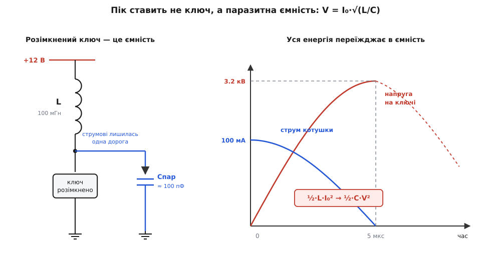
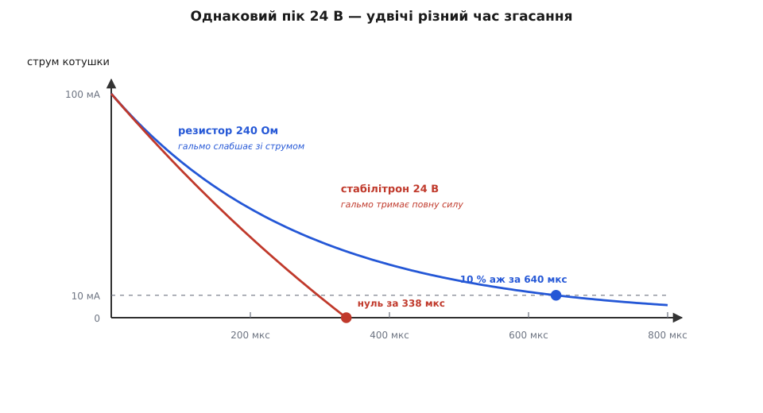

# 🧮 Скільки вольтів і скільки джоулів

Долю ключа на індуктивному навантаженні вирішують два числа: до якого піка злетіла б напруга, якби струмові не дали дороги, і скільки джоулів мусить проковтнути той, хто цю дорогу дає. Обидва рахуються точно — і обидва виходять не такими, як підказує перше враження.

Рахуватимемо на одному прикладі, звичайному реле. Котушка L = 100 мГн з активним опором обмотки R = 120 Ом живиться від 12 В, отже сталий струм I₀ = 100 мА; вмикає її MOSFET, розрахований на 60 В. З трьох сталих далі виросте все:

```
E₀ = ½·L·I₀² = 0.5 · 0.1 Гн · (0.1 А)²  = 500 мкДж   ← енергія в полі
Λ  = L·I₀    = 0.1 Гн · 0.1 А           = 10 мВ·с    ← потокозчеплення
τ  = L / R   = 0.1 Гн / 120 Ом          = 833 мкс    ← стала часу обмотки
```

Перше число — [енергія котушки](topic:ph-electromagnetism/inductor-energy), її доведеться десь висадити. Друге — [потокозчеплення](topic:ph-electromagnetism/magnetic-flux), добуток індуктивності на струм; його одиниця — вольт-секунда, і саме ця дивна одиниця виявиться тут головною.

## Рівняння з двома невідомими

Оцінка піка «в лоб» бере V = L·di/dt, підставляє час розмикання ключа — скажімо, мікросекунду — і видає десять кіловольтів. Одна біда: мікросекунду ми взяли зі стелі. У рівнянні V = L·di/dt невідомих двоє, напруга і швидкість зміни струму, а котушка дає між ними лише один зв'язок. Друге рівняння має надійти звідкись іще.

Тут варто перевернути причинність. Здається, ніби ключ обриває струм, а котушка на це відповідає напругою. Насправді навпаки: транзистор, який перестав проводити, з рівняння вибуває — він уже нічим не керує, він тепер просто розрив. Струмові лишається якась дорога, у цієї дороги є своя напруга, і саме вона, поділена на індуктивність, дає di/dt. Отже пік задає не швидкість ключа, а те, куди подівся струм. Порахувати можна лише тоді, коли назвеш дорогу.

## Стеля: скільки дає паразитна ємність

Коли обмежувача немає, дорога все одно є — лишається паразитна ємність вузла: [вихідна ємність MOSFET](topic:hw-components/output-capacitance), [власна ємність обмотки](topic:hw-components/inductor-parasitics) і монтаж. Разом кілька десятків чи сотень пікофарад — мізер, але не нуль, а нуля тут і не потрібно.

Тепер невідомих так само двоє, зате й рівнянь два. Котушка віддає енергію, ємність її приймає; у мить, коли напруга найвища, струм уже впав до нуля, тобто вся енергія переїхала з поля в ємність:

```
½·L·I₀²  =  ½·C·V²
V = I₀ · √(L/C)
```

Величина √(L/C) має розмірність опору й зветься [характеристичним опором](topic:com-medium/characteristic-impedance) пари: саме вона перетворює ампери на вольти. У котушки з великою індуктивністю і крихітною ємністю він величезний — тому з такого лагідного струму й виходить такий страшний викид.

**Те саме реле, жодного обмежувача, паразитна ємність вузла C = 100 пФ.**
```
ρ = √(L/C)         = √(0.1 / 100·10⁻¹²)      = 31 600 Ом
V = I₀·ρ           = 0.1 А · 31 600 Ом       = 3160 В
t = (π/2)·√(L·C)   = 1.571 · 3.16·10⁻⁶ с     = 4.97 мкс
f = 1/(2π·√(L·C))                            = 50 кГц
```

Три кіловольти на транзисторі, розрахованому на шістдесят, — і жодного вільного припущення в розрахунку. Перевірмо себе тим самим L·di/dt, від якого починали: струм спадає зі 100 мА до нуля за 4.97 мкс, це в середньому 20 100 А/с, тобто 2010 В. Пік мусить бути більшим за середнє рівно в π/2 раза, бо струм спадає косинусом, а не прямою: 2010 · 1.571 = 3160 В. Збіглося — два різні шляхи привели до одного числа.

А заразом видно, звідки взялася та мікросекунда. Щоб чверть періоду тривала саме 1 мкс, ємність мала б бути 4 пФ, і тоді пік вийшов би не 10, а 15.7 кВ. Формула V = L·di/dt не помилялася — вона просто не знала, коли їй зупинитися; час їй дає ємність.



*Розімкнений ключ — це конденсатор, і вся енергія поля переїздить у нього.*

Опір обмотки на цьому піку майже не позначається: добротність контуру ρ/R = 31 600/120 = 264, а за чверть періоду обвідна встигає впасти лише на 0.3 %. Тому в цій частині розрахунку R справді можна не враховувати — але тільки в цій.

Наживо трьох кіловольтів ніхто не побачить: [лавина в MOSFET](topic:hw-components/mosfet-avalanche) настає трохи вище за паспортну межу й зрізає викид десь на 70 В. Проте формула вже сказала головне — коло *прагне* туди, і зупиняє його лише пробій. Вона ж дає й спосіб виміряти ту саму C, яку ми досі вгадували: зніміть на осцилографі частоту дзвону f і перерахуйте назад, C = 1/((2πf)²·L).

## Вольт-секунди: обмежувач купує час, а не джоулі

Тепер дорогу дано свідомо. Гасильний діод повертає струм у ту саму шину живлення, з якої той вийшов, тож у колечку «котушка → діод → котушка» джерела немає: обидва кінці петлі сходяться в один вузол, напруга джерела стоїть по обидва боки й скорочується. Лишається просте рівняння петлі, де Vобм — сумарне падіння на всьому, що ви в неї поставили (діод, а за потреби ще й стабілітрон чи резистор):

```
0 = L·di/dt + i·R + Vобм
```

Спершу відкиньмо i·R — це чесно, поки падіння на обмежувачі помітно більше за резистивне падіння на самій обмотці. Тоді di/dt стале, і струм спадає не експонентою, а прямою:

```
i(t) = I₀ − (Vобм / L)·t
T    = L·I₀ / Vобм = Λ / Vобм
```

А тепер найцікавіше — енергія. Обмежувач тримає своє падіння незмінним, тож поглинута ним енергія — це просто напруга на весь заряд, що крізь нього протік, а заряд під прямою — площа трикутника:

```
E = Vобм · ∫i dt = Vобм · ½·I₀·T = Vобм · ½·I₀ · (L·I₀/Vобм) = ½·L·I₀²
```

Vобм скоротилося. Хоч яким високим ви зробите обмежувач, він поглине ті самі 500 мкДж — усе, що було в полі, до останнього джоуля. Обмежувач не торгується за енергію; він торгується за **час**:

```
Vобм · T = Λ = 10 мВ·с           (площа під імпульсом напруги — стала)

  0.7 В  →  14.3 мс
 24 В    →   417 мкс
 36 В    →   278 мкс
```

Це не збіг і не властивість схеми, а сам закон індукції, записаний навпаки. Напруга на котушці дорівнює швидкості зміни потокозчеплення, тож інтеграл напруги за часом — це і є зміна потокозчеплення. Щоб посадити струм у нуль, треба зняти всі Λ вольт-секунд, і жодна схема цього рахунку не обійде: можна взяти велику напругу за короткий час або малу за довгий, а площа однакова.

> 🔧 **Навіщо це.** Вольт-секундний закон дає весь вибір в одному рядку. Ви знаєте, скільки вольтів витримує ключ; віднімаєте живлення й запас — лишається Vобм; ділите на нього Λ — маєте час згасання. Або навпаки: потрібен час, отже ось необхідна напруга й ось потрібний клас транзистора. Третього шляху немає, бо площа під імпульсом — це магнітний потік, який усе одно доведеться зняти.

## Точний поділ: обмежувач проти самої обмотки

Відкидати i·R виходить не завжди. З голим діодом Vобм = 0.7 В, а резистивне падіння на обмотці на початку 12 В — у сімнадцять разів більше. Гальмує тут не діод, а сама обмотка, і наближення без i·R перебріхує все: обіцяє 14 мс замість справжніх 2.4 мс і всі 500 мкДж у діоді замість справжніх сорока восьми. Отже розв'яжімо рівняння петлі повністю, не викидаючи нічого. Воно лінійне першого порядку, розв'язок стандартний:

```
L·di/dt = −(Vобм + i·R)
i(t)    = (I₀ + a)·e^(−t/τ) − a ,   де a = Vобм/R ,  τ = L/R
```

Зверніть увагу на знак: експонента прямує не до нуля, а до −a, тож дорогою вниз вона перетинає нуль — за скінченний час, на відміну від чистого RL-згасання. Прирівнявши i до нуля, дістаємо момент, коли струму більше немає:

```
T = τ · ln(1 + x) ,   де x = I₀·R / Vобм
```

Безрозмірне x — це і є терези: скільки резистивного падіння обмотки припадає на одиницю падіння обмежувача. Тепер заряд, бо саме він визначає енергію. Інтегруємо струм від нуля до T:

```
q = ∫i dt = τ·(I₀ + a)·(1 − e^(−T/τ)) − a·T
```

Показник e^(−T/τ) = 1/(1+x) підставляється чудово: (I₀ + a)·(1 − 1/(1+x)) = (I₀ + a)·x/(1+x) = I₀, бо a·x = (Vобм/R)·(I₀·R/Vобм) = I₀. Уся громіздка перша частина згортається в τ·I₀, і лишається

```
q = τ·I₀ − (Vобм/R)·T
E = Vобм·q = (L·I₀²/x²) · [x − ln(1+x)]
```

а частка від усієї запасеної енергії, що дістається обмежувачу, взагалі не залежить від L та I₀ окремо — тільки від терезів x:

```
η = E / (½·L·I₀²) = 2·[x − ln(1+x)] / x²
```

Обидві межі поводяться так, як велить здоровий глузд. За малих x (обмежувач набагато сильніший за обмотку) розклад логарифма дає η ≈ 1 − 2x/3 → 1: обмежувач забирає майже все. За великих x — η ≈ 2/x → 0: обмотка гріється сама, а на обмежувачі лишаються крихти.

![Крива η = 2·[x − ln(1+x)]/x² на логарифмічній осі x від 0.01 до 100. Позначено дві робочі точки: голий діод при x = 17 дістає 9.7 % енергії, діод зі стабілітроном 24 В при x = 0.49 — 76 %.](img/clamp-energy-split.svg)

*Одна крива відповідає на питання «скільки джоулів піде в обмежувач» для будь-якої котушки.*

**Голий гасильний діод: Vобм = 0.7 В.**
```
x = I₀·R/Vобм = 0.1·120 / 0.7        = 17.14
T = τ·ln(1+x) = 833 мкс · ln 18.14   = 2.42 мс
η = 2·(17.14 − 2.898) / 17.14²       = 0.097
E = 0.097 · 500 мкДж                 = 48 мкДж   (решта 452 мкДж — в обмотці)
```

**Той самий діод, але послідовно з ним стабілітрон 24 В: Vобм = 24.7 В.**
```
x = 0.1·120 / 24.7                   = 0.486
T = 833 мкс · ln 1.486               = 330 мкс
η = 2·(0.486 − 0.396) / 0.486²       = 0.761
E = 0.761 · 500 мкДж                 = 381 мкДж  (решта 119 мкДж — в обмотці)
```

Отже додані двадцять чотири вольти пришвидшили згасання в 7.3 раза, а платою стала не лише вища поличка на ключі (36.7 В замість 12.7 В — усе ще з запасом до шістдесяти), а й восьмикратно більша порція тепла в маленькому корпусі стабілітрона. Проста оцінка ½·L·I₀² тут завищує на чверть: 381 мкДж, а не 500, бо обмотка все ще відбирає своє. Що менший x, то менша й ця розбіжність — рівно як каже межа η ≈ 1 − 2x/3.

## Коли обмежувач ковтає більше, ніж було в котушці

Досі обмежувач стояв паралельно котушці й повертав струм у шину. Але [TVS-діод](topic:hw-components/tvs-diode) зазвичай ставлять інакше — від вузла ключа на землю; так само поводиться й сам транзистор, коли захисту немає і викид зрізає його власна лавина. Топологія змінилася дрібницею, а рахунок — принципово: тепер джерело живлення опинилося всередині петлі й підганяє струм далі.

```
L·di/dt = Vжив − i·R − Vобм
```

Гальмує вже не все падіння Vобм, а лише його надлишок над живленням. Отже всі формули лишаються ті самі, якщо підставити в них ефективну напругу Vе = Vобм − Vжив. А от енергію обмежувач приймає на повне своє падіння, бо весь заряд іде крізь нього:

```
гальмує:    Vе = Vобм − Vжив
поглинає:   E  = Vобм · q      ← повне падіння, а не сама лише Vе
```

Різниця Vжив·q — це те, що джерело докинуло від себе, поки тривало згасання. У найпростішому наближенні (R відкинуто) вона згортається в короткий множник:

```
E = ½·L·I₀² · Vобм / (Vобм − Vжив)
```

**Захисту немає, викид зрізає лавина транзистора при 70 В; живлення 12 В.**
```
Vе = 70 − 12                            = 58 В
x  = 0.1·120 / 58                       = 0.207
T  = 833 мкс · ln 1.207                 = 156.7 мкс
q  = τ·I₀ − (Vе/R)·T = 83.33 − 75.74    = 7.59 мкКл
E  = Vобм·q = 70 В · 7.59 мкКл          = 531 мкДж
```

П'ятсот тридцять один мікроджоуль — більше, ніж уся енергія, що була в котушці. Дев'яносто один мікроджоуль джерело докинуло просто тому, що плюс живлення весь цей час лишався притиснутим до котушки, яка тягла струм крізь лавину. Уся ця порція осідає в мікроскопічній ділянці кристала, і саме в цьому арифметична розгадка транзисторів, які помирають не одразу, а після сотень справних спрацювань.

Множник Vобм/(Vобм − Vжив) вартий того, щоб мати його перед очима, коли добираєте TVS:

```
Vобм = 15 В → ×5.0        Vобм = 36 В → ×1.5
Vобм = 24 В → ×2.0        Vобм = 70 В → ×1.2
```

Спокуса вибрати обмежувач із напругою якнайближчою до живлення — щоб ключ бачив меншу поличку — обертається тим, що деталь мусить проковтнути вп'ятеро більше за запасене, та ще й ковтати вп'ятеро довше: час згасання росте тим самим множником. Обмежувач, притиснутий до самого живлення, узагалі перестає гальмувати: Vе → 0, T → ∞.

## Резистор чи стабілітрон за того самого піка

Тепер порівняння в однакових умовах: дозволимо кожному варіантові підняти напругу на ключі рівно на 24 В понад живлення, не більше, і рахуватимемо це падіння на всю петлю разом. Резистор при струмі 100 мА має тоді бути 240 Ом; стабілітрон — на 24 В.

Резистор і стабілітрон гальмують принципово по-різному, і це видно вже з рівняння петлі. Падіння на резисторі пропорційне струмові, тож коли струм слабне, слабне й гальмо: спад чисто експоненційний зі сталою часу L/(R + 240) = 278 мкс, і нуля він не досягає ніколи. Стабілітрон, натомість, [тримає своє падіння](topic:hw-components/diode-breakdown) майже незмінним аж до останніх міліампер — гальмо тисне на повну силу до кінця, і струм таки доходить до нуля, за 338 мкс. Порівняймо на однаковому порозі, скажімо на десятій частині початкового струму:

```
резистор 240 Ом:   t = 278 мкс · ln 10                  = 640 мкс
стабілітрон 24 В:  a = 24 В / 120 Ом                    = 0.2 А
                   t = 833 мкс · ln[(I₀ + a)/(0.1·I₀ + a)]
                     = 833 мкс · ln(0.3 / 0.21)         = 297 мкс
```

Удвічі з гаком швидше за тієї самої висоти стрибка. Причина знову вольт-секундна: площу Λ треба назбирати в будь-якому разі, а резистор, почавши з тих самих 24 В, далі віддає дедалі менше вольтів на секунду — тож на ту саму площу йому потрібно більше часу. Перевірка сходиться до останньої цифри, якщо додати обидва падіння в петлі — і на обмежувачі, і на самій обмотці:

```
стабілітрон:  24 В · 338 мкс + 120 Ом · 15.8 мкКл = 8.11 + 1.89 = 10.0 мВ·с
резистор:     (240 + 120) Ом · 27.8 мкКл                        = 10.0 мВ·с
```

Площа однакова — просто одні збирають її прямокутником, а інші довгим хвостом.



*Резистор слабшає разом зі струмом, стабілітрон тисне на повну силу до самого нуля.*

Енергії при цьому обидва беруть майже порівну. У резисторі, ввімкненому послідовно з обмоткою, поділ тривіальний — крізь них тече той самий струм, тож тепло ділиться прямо за опорами: 240/(240 + 120) = 67 %, тобто 333 мкДж проти 381 мкДж у стабілітрона (заряд у цьому колі q = I₀·τ′ = 27.8 мкКл). Джоулі майже ті самі, а час удвічі менший — ось чому за однакового бюджету напруги стабілітрон чи TVS майже завжди кращі за резистор.

## Стеля швидкості

Останнє питання, на яке вольт-секунди відповідають без жодних додаткових припущень: як швидко цю котушку взагалі можна вимкнути. Швидкість купують напругою, напругу обмежує ключ, тож межа виходить сама:

```
Tмін = Λ / (Vкл.макс − Vжив)
```

Для нашого шістдесятивольтового MOSFET із двадцятивідсотковим запасом на вузлі дозволено 48 В, отже обмежувачу лишається 36 В:

```
Tмін = 10 мВ·с / 36 В = 278 мкс        (оцінка згори, без опору обмотки)
T    = 833 мкс · ln(1 + 12/36) = 240 мкс   (точно, з опором обмотки)
```

Швидше — ніяк. Ані добірний TVS, ані активний обмежувач, ані найшвидший драйвер не зроблять із цих 240 мкс двадцяти чотирьох: потокозчеплення Λ треба зняти, а вольтів на це відпущено рівно стільки, скільки витримує ключ. Лишаються тільки два справжні важелі — зменшити Λ (менше витків, менший робочий струм) або купити транзистор на вищу напругу. Перший здешевлює захист, другий здорожчує ключ, і третього не існує; уся інженерія тут — вибір між цими двома, з відомою наперед ціною кожного.
