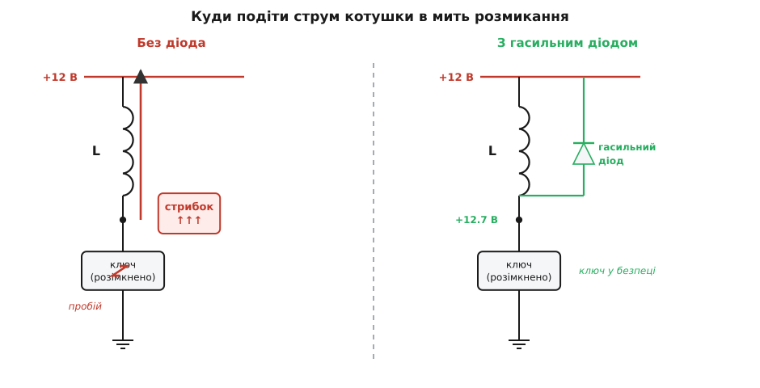
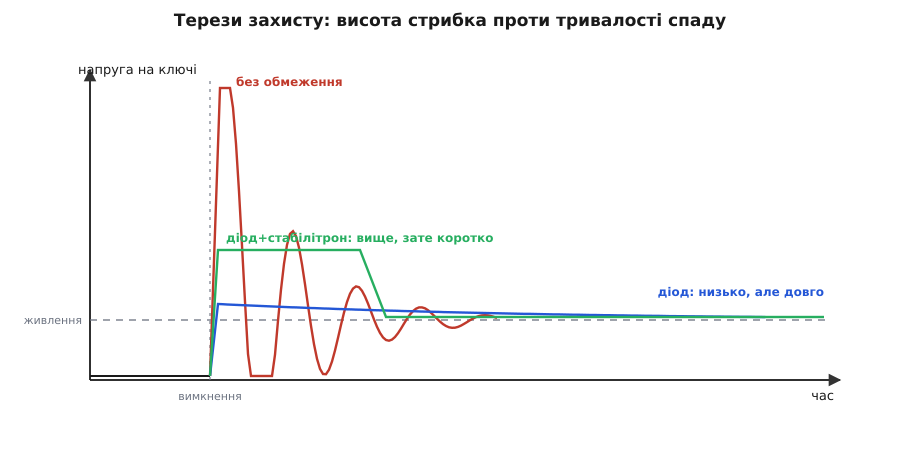

# Придушення перехідних стрибків напруги

<preknowlist>
- [Індуктивність](root:ph-electromagnetism/inductance) — котушка накопичує енергію в магнітному полі й противиться миттєвій зміні струму: напруга на ній дорівнює індуктивності, помноженій на швидкість зміни струму.
- [MOSFET як ключ](root:hw-components/mosfet-switch) — транзистор, що вмикає й розриває струм у навантаженні.
- [PN-перехід](root:ph-condensed/pn-junction) — діод пропускає струм лише в один бік.
</preknowlist>

Ви керуєте звичайним реле: транзистор вмикає його котушку від 12 В, потім вимикає. Живлення — лагідні 12 В, транзистор розрахований на 60 В, запас чотирикратний. А він усе одно згорає. І не одразу, а таємниче: то за тиждень, то за місяць, після сотень справних спрацювань. Звідки в колі, де ніде немає більше як 12 В, береться напруга, що пробиває транзистор на 60 В?

Відповідь ховається в котушці. Поки через неї тече струм, у її магнітному полі запасена енергія, і котушка тримається за свій струм так само вперто, як маховик — за свою швидкість. Напруга на котушці — це не опір струмові, а опір його *зміні*: вона дорівнює індуктивності, помноженій на швидкість зміни струму (V = L·di/dt). Поки струм сталий, напруга майже нульова. Але тієї миті, коли транзистор розмикається, він намагається обірвати струм за частки мікросекунди. Швидкість зміни струму злітає до величезних значень — і разом із нею злітає напруга.

Побачмо, наскільки.

**Реле: 100 мА через котушку 100 мГн, транзистор розмикається за 1 мкс.**
```
di/dt = ΔI / Δt = 0.1 А / 0.000001 с = 100 000 А/с
V     = L · di/dt = 0.1 Гн · 100 000  = 10 000 В
```
Десять тисяч вольт — з дванадцятивольтового живлення. Насправді такої напруги не виникає: задовго до неї щось пробивається — повітряний проміжок у контактах або сам транзистор іде в лавинний пробій. Але саме в цьому й біда. Котушці байдуже, *через що* потече її струм; якщо ви не дасте йому дороги, він проб'є її сам — крізь ваш ключ. Уся запасена в полі енергія (½·L·I²) висадиться там, де стався пробій, і кожне вимкнення відкушує по шматочку кремнію, аж поки транзистор не помре. Це той самий ефект самоіндукції, що зветься [проти-ЕРС](root:hw-motion/back-emf): котушка сама породжує напругу, аби втримати свій струм. Ту саму іскру, що вискакує на розмиканні, помітили колись найпершою — з неї й почалося розуміння самоіндукції, [як це було](root:hw-power/transient-suppression/hist-inductive-spark.md).

Щойно причину названо, розв'язок стає очевидним: якщо струмові конче треба кудись текти — дайте йому безпечну дорогу. Поставте діод паралельно котушці, «спиною» до живлення — катодом до плюса, анодом до ключа. Поки ключ замкнений і струм тече нормально, діод під зворотною напругою й мовчить. Але в мить розмикання котушка підіймає свій нижній кінець угору, щоб проштовхнути струм далі, — і діод відмикається. Тепер струм тече тихим колечком: котушка → діод → назад у котушку, замикаючись сам на себе. Напруга на ключі більше не сягає небес — її обмежує лише падіння на діоді, якісь 0.7 В понад живлення. Струм не обривається, а плавно згасає, віддаючи енергію на власному опорі котушки. Цей діод називають зворотним, або гасильним (англ. freewheeling — «на вільному ходу»).



*Без дороги для струму котушка пробиває ключ сама; діод дає струмові колечко, і викид зникає.*

За плавність згасання доводиться платити, і в цьому вся суть налаштування. Струм у колечку спадає з тією самою сталою часу L/R, що з нею й наростав, — а опір котушки малий, тож хвіст буває млявим: реле відпускає якір повільніше, ніж могло б. Для простого реле це дрібниця. Але там, де вимкнення має бути різким — швидкий ШІМ, точне керування двигуном, — млявий хвіст заважає. Тоді послідовно з діодом у те саме колечко додають резистор або стабілітрон: він змушує струм згасати швидше, бо тепер енергія висаджується не лише на кволому опорі котушки. Ціна очевидна — напруга на ключі підскакує рівно на те падіння, яке ви додали. Один регулятор, дві шальки терезів: швидкість згасання проти висоти стрибка. Скільки саме енергії поглине обмежувач і до якого піка зметнувся б нестримний викид — [порахуймо це точно](root:hw-power/transient-suppression/math-clamp-energy.md).



*Ті самі терези: діод дає низький, але довгий викид; стабілітрон — вищий, зате швидкий.*

> 🔧 **Навіщо це.** Будь-яке індуктивне навантаження — реле, соленоїд, електроклапан, крокові й колекторні двигуни, котушка запалювання — потребує такого захисту. Забутий гасильний діод — найчастіша причина «незрозумілої» смерті драйверів і MOSFET-ів, яка виявляється не на столі, а вже в полі, після сотень справних спрацювань.

Діод — ідеальне рішення, та лише для сталого струму. На змінному навантаженні він не годиться: там струм і так тече в обидва боки, і діод, поставлений упоперек, просто закоротив би один півперіод. Тут дорогу треба дати інакше. Найпоширеніший спосіб — [RC-снабер](root:hw-power/snubbers-dvdt): послідовна пара «резистор + конденсатор» паралельно ключу, що приймає раптовий стрибок на конденсатор і гасить його енергію на резисторі, не заважаючи повільному змінному струмові. Там, де стрибок різкий і потужний, ставлять напівпровідниковий обмежувач — [TVS-діод](root:hw-components/tvs-diode), який спрацьовує за пікосекунди й жорстко зрізає викид на заданому рівні, або [варистор](root:hw-components/varistor) на оксиді цинку, коли треба поглинути велику енергію.

І тут проступає ширший закон, що єднає всі ці прийоми. Стрибок може народитися *всередині* вашої плати — від власного комутування індуктивності, як у прикладі з реле. А може прийти *ззовні* — [кидком із мережі](root:hw-power/mains-transients) від грози чи вмикання сусіднього потужного приладу. Джерела різні, але ліки одні за суттю: дати надлишковій енергії власну дорогу — обмежувач, що відводить її повз чутливе, — раніше, ніж вона знайде дорогу сама, крізь те, що ви хотіли зберегти.
